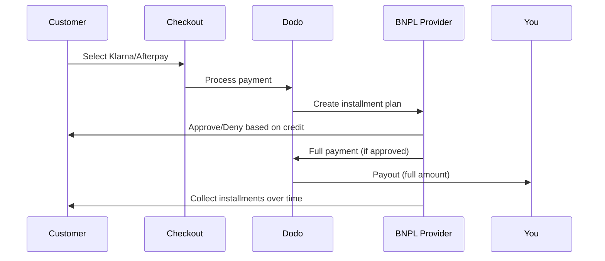

先买后付（BNPL）使客户能够将购买分成无利息的分期付款，这样可以将平均订单价值提高20-50%，并使合格交易的转化率提高10-30%。

## 为什么要提供BNPL？

<CardGroup cols={3}>
<Card title="Higher AOV" icon="chart-line">
当顾客可以分期付款时，他们会花更多钱。平均订单价值增加20-50%。
</Card>

<Card title="Better Conversion" icon="percent">
在结账时移除支付障碍。高价商品的转化率提高10-30%。
</Card>

<Card title="Zero Risk" icon="shield-check">
BNPL提供商负责信用风险与催收。您可以提前收到全额付款。
</Card>
</CardGroup>

## 支持的提供商

### Klarna

| 功能 | 详情 |
| :------ | :------ |
| **可用性** | 美国 + 19 个欧洲国家 |
| **货币** | USD, EUR, GBP, DKK, NOK, SEK, CZK, RON, PLN, CHF |
| **最低限额** | $50.01（或等值货币）|
| **订阅** | 是 |

**支持的国家：** 奥地利、比利时、捷克共和国、丹麦、芬兰、法国、德国、希腊、爱尔兰、意大利、荷兰、挪威、波兰、葡萄牙、罗马尼亚、西班牙、瑞典、瑞士、英国、美国

**支付选项：**
- **分4期付款** — 分为4个无息付款
- **30天内付款** — 30天内全额付款到期
- **融资** — 更长期的分期付款计划

### Afterpay (Clearpay)

| 特性 | 详情 |
| :------ | :------ |
| **可用性** | 美国、英国 |
| **货币** | 美元（USD）、英镑（GBP） |
| **最低金额** | $50.01（或等值） |
| **订阅** | 否 |

**支付选项：**
- **分4期付款** — 每两周分4个无息付款

<Note>
在英国，Afterpay以“Clearpay”运营，但使用相同的API类型 (`afterpay_clearpay`)。
</Note>

### Billie

| 特性 | 详情 |
| :------ | :------ |
| **可用性** | 全球 |
| **货币** | 英镑（GBP） |
| **最低金额** | 无 |
| **订阅** | 否 |

**关于Billie：**
Billie是一个B2B的先买后付解决方案，使企业能够为客户提供灵活的付款条款。它旨在用于买家需要基于发票的付款选项的商业交易。

**支付选项：**
- **发票付款** — 在约定的付款条款内付款
- **灵活条款** — 对企业友好的付款计划

### Sunbit

| 功能 | 详情 |
| :------ | :------ |
| **可用性** | 美国 |
| **货币** | 美元 |
| **最低** | $60.00 |
| **最高** | $19,999.00 |
| **订阅** | 否 |

**支付选项：**
- **分期融资** — 将购买拆分为可管理的每月付款

## 配置

### API 方法类型

| 类型 | 供应商 |
| :--- | :------- |
| `klarna` | Klarna |
| `afterpay_clearpay` | Afterpay / Clearpay |
| `billie` | Billie (B2B) |
| `sunbit` | Sunbit |

### 示例

```javascript
const session = await client.checkoutSessions.create({
  product_cart: [{ product_id: 'prod_123', quantity: 1 }],
  allowed_payment_method_types: [
    'klarna',
    'afterpay_clearpay',
    'credit',
    'debit'
  ],
  customer: {
    email: 'customer@example.com',
    name: 'Jane Smith'
  },
  billing_address: {
    country: 'US',
    zipcode: '10001'
  },
  return_url: 'https://example.com/success'
});
```

<Warning>
始终包含 `credit` 和 `debit` 作为备用选项。并非所有客户都符合 BNPL 的资格，低于供应商最低限额的交易将不符合资格。
</Warning>

## 交易金额限制

每个 BNPL 供应商都有自己的最低（有时是最高）交易金额：

| 供应商 | 最低 | 最高 |
| :------- | :------ | :------ |
| Klarna | $50.01 | — |
| Afterpay | $50.01 | — |
| Sunbit | $60.00 | $19,999.00 |

不在这些阈值内的交易：
- 结账时不会出现 BNPL 选项
- 不会触发错误 — 选项只是不显示
- 卡支付仍然可用

这是预期的行为。如果您的产品价格不太可能在供应商支持的范围内，请勿在 `allowed_payment_method_types` 中包含 BNPL 方法。

## 分期付款的工作原理



**关键点：**
- 您从 BNPL 供应商那里获得 **全额预付款**
- BNPL 供应商负责 **信用风险和收款**
- 客户直接向供应商支付 **4 次分期付款**（通常）
- **没有分期付款失败的退款** — 这是供应商的风险

## 测试

### Klarna 测试数据

在测试模式下使用这些详细信息：

| 字段 | 批准 | 拒绝 |
| :---- | :------- | :----- |
| **出生日期** | 07-10-1970 | 07-10-1970 |
| **名字** | Test | Test |
| **姓氏** | Person-us | Person-us |
| **电子邮件** | customer@email.us | customer+denied@email.us |
| **街道** | Amsterdam Ave | Amsterdam Ave |
| **门牌号** | 509 | 509 |
| **城市** | New York | New York |
| **州** | New York | New York |
| **邮政编码** | 10024-3941 | 10024-3941 |
| **电话** | +13106683312 | +13106354386 |

<Note>
交易至少需 $50 才会显示 Klarna 作为选项。
</Note>

### Afterpay 测试

<Steps>
<Step title="Select Afterpay">
结账时选择 Afterpay 并点击支付。
</Step>

<Step title="Successful payment">
使用任何有效的电子邮件和送货地址。
</Step>

<Step title="Failed authentication">
测试失败：在重定向页面关闭 Afterpay 模态窗口。支付状态转换为 `requires_payment_method`。
</Step>
</Steps>

### Sunbit 测试

<Steps>
<Step title="Set billing country and currency">
确保结账会话设置 `billing_address.country` 为 `US` 并设置 `billing_currency` 为 `USD`。
</Step>

<Step title="Use a qualifying amount">
设置交易金额在 **$60.00 和 $19,999.00** 之间。Sunbit 不会出现在此范围之外。
</Step>

<Step title="Select Sunbit">
在结账时选择 Sunbit 并完成 Sunbit 模态中的融资申请流程。
</Step>

<Step title="Test failure">
要模拟被拒绝的申请，在完成流程前关闭 Sunbit 模态。支付状态转换为 `requires_payment_method`。
</Step>
</Steps>

<Note>
Sunbit 仅适用于以美元支付的美国客户，交易金额在 $60.00 至 $19,999.00 之间。
</Note>

## 最佳实践

<AccordionGroup>
<Accordion title="Target high-ticket items">
BNPL 最适用于 $100-$1000 的产品。“分期付款”的价值主张在此范围内最具吸引力。
</Accordion>

<Accordion title="Show installment amounts">
“4 次付款 $25” 比“$100 使用 Klarna” 更具吸引力。尽可能显示每次付款金额。
</Accordion>

<Accordion title="Don't force BNPL for low-value products">
低于 $50 时，BNPL 无法显示。低于 $100 时，大多数客户更倾向于使用卡支付。将 BNPL 推广集中于高价商品。
</Accordion>

<Accordion title="Collect billing address">
BNPL 供应商需要账单信息进行信用检查。确保您的结账收集完整地址详情。
</Accordion>

<Accordion title="Set clear expectations">
客户应了解他们与 Klarna/Afterpay 而不是与您达成借款协议。
</Accordion>
</AccordionGroup>

## 限制

### 无订阅
BNPL 支付方式**不支持定期付款**。对于订阅产品，请使用卡或其他支持定期付款的方法。

### 基于信用的批准
BNPL 供应商进行即时信用检查。并非所有客户都会被批准。批准率因以下因素而异：
- 客户在供应商处的信用历史
- 交易金额
- 客户所在地

### 货币与国家映射

每种货币仅限于其相应区域：

| 货币 | 支持的国家 |
| :------- | :------------------ |
| **美元** | 仅限于美国 |
| **欧元** | 所有支持的欧洲国家（奥地利、比利时、捷克共和国、丹麦、芬兰、法国、德国、希腊、爱尔兰、意大利、荷兰、挪威、波兰、葡萄牙、罗马尼亚、西班牙、瑞典、瑞士） |
| **英镑** | 英国和所有支持的欧洲国家 |

Klarna 支持的其他货币（丹麦克朗、挪威克朗、瑞典克朗、捷克克朗、罗马尼亚列伊、波兰兹罗提、瑞士法郎）在各自的国家中可用。

<Info>
例如，美元交易仅向美国客户显示 BNPL 选项。欧元交易将在所有支持的欧洲国家显示 BNPL 选项。英镑交易将在英国和所有支持的欧洲国家向客户显示 BNPL 选项。
</Info>

| 供应商 | 支持的货币 |
| :------- | :------------------- |
| Klarna | 美元、欧元、英镑、丹麦克朗、挪威克朗、瑞典克朗、捷克克朗、罗马尼亚列伊、波兰兹罗提、瑞士法郎 |
| Afterpay | 美元（美国）、英镑（英国） |
| Sunbit | 美元（美国） |

## 故障排除

<AccordionGroup>
<Accordion title="BNPL not appearing at checkout">
**检查：**
1. 交易金额是否在供应商支持的范围内？（Klarna/Afterpay：最低 $50.01；Sunbit：$60.00–$19,999.00）
2. 客户位置是否在支持的国家？
3. 货币是否被 BNPL 供应商支持？
4. BNPL 方法是否包含在 `allowed_payment_method_types` 中？

**解决方案：**最常见的是交易低于最低或高于最高。验证金额是否在供应商支持的范围内。
</Accordion>

<Accordion title="Customer denied by BNPL provider">
**原因：**
- 在供应商处的信用历史不足
- 太多活跃的分期计划
- 身份验证失败

**解决方案：**某些客户会遇到这种情况。确保卡支持的备用方案可用。不要公开特定的拒绝原因。
</Accordion>

<Accordion title="Payment stuck in pending">
**原因：**客户未完成与 BNPL 供应商的身份验证流程。

**解决方案：**支付将超时并失败。客户可以重试或使用其他方法。
</Accordion>
</AccordionGroup>

## 相关页面

<CardGroup cols={2}>
<Card title="Payment Methods Overview" icon="credit-card" href="/features/payment-methods">
查看所有支持的支付方式。
</Card>

<Card title="Checkout Guide" icon="book" href="/developer-resources/checkout-session">
完成结账实施指南。
</Card>

<Card title="Testing Process" icon="flask" href="/miscellaneous/testing-process">
所有支付方式的测试数据。
</Card>

<Card title="Adaptive Currency" icon="globe" href="/features/adaptive-currency">
货币支持和转换。
</Card>
</CardGroup>