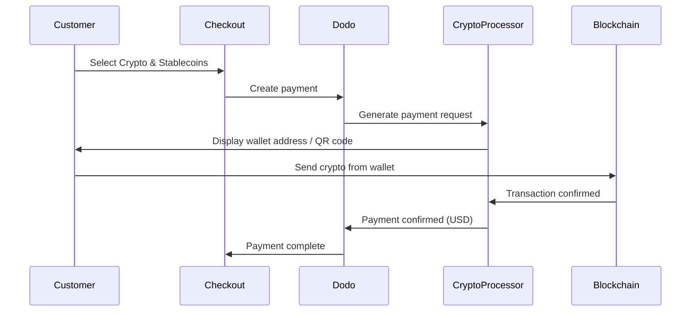

加密货币与稳定币支付允许客户使用加密货币和稳定币在世界任何地方支付（不包括印度）。交易以美元结算，因此您收到的是法定货币，而客户使用他们首选的加密钱包支付。

## 为什么提供加密货币与稳定币？

<CardGroup cols={3}>
<Card title="Global Reach" icon="globe">
接受来自任何国家的付款 — 客户无需任何银行基础设施。
</Card>

<Card title="No Chargebacks" icon="shield-check">
加密交易不可逆，完全消除退款欺诈。
</Card>

<Card title="USD Settlement" icon="dollar-sign">
您收到美元 — 无需处理加密波动或钱包管理。
</Card>
</CardGroup>

## 概览

| 细节 | 数值 |
| :----- | :---- |
| **结算货币** | USD |
| **支持国家** | 全球（不包括印度） |
| **订阅** | 否 |
| **最低金额** | $0.50 |
| **结算** | USD |

## 工作原理



## 客户体验

1. 客户在结账时选择加密货币与稳定币
2. 显示一个钱包地址和二维码以及加密货币金额
3. 客户从他们的加密钱包发送准确的金额
4. 在区块链上确认交易
5. 客户被重定向到成功页面

<Info>
加密支付以美元计算。结账时显示的加密金额反映支付时的实时汇率。
</Info>

## 支持的货币和网络

| 货币 | 网络 |
| :------- | :------- |
| **USDC** | Ethereum，Solana，Polygon，Base |
| **USDP** | Ethereum，Solana |
| **USDG** | Ethereum |

## 配置

```javascript
const session = await client.checkoutSessions.create({
  product_cart: [{ product_id: 'prod_123', quantity: 1 }],
  allowed_payment_method_types: ['crypto', 'credit', 'debit'],
  return_url: 'https://example.com/success'
});
```

## API 方法类型

| 类型 | 方法 | 国家 |
| :--- | :----- | :------ |
| `crypto` | Crypto & Stablecoins | 全球（不包括印度） |

## 测试

<Steps>
<Step title="Enable test mode">
使用您的 Dodo Payments 测试 API 密钥。
</Step>

<Step title="Create a test checkout">
在允许的支付方法中创建一个包含 `crypto` 的结账会话。
</Step>

<Step title="Complete the test flow">
在测试环境中遵循模拟的加密支付流程。
</Step>
</Steps>

## 最佳实践

<AccordionGroup>
<Accordion title="Always include card fallbacks">
并非所有客户都有加密钱包。始终包括 `credit` 和 `debit` 作为备用支付方法。
</Accordion>

<Accordion title="Set clear expectations on confirmation time">
区块链确认可能需要几分钟，这取决于网络。确保您的结账过程向客户传达此信息。
</Accordion>

<Accordion title="Handle underpayments and overpayments">
由于网络费用的原因，加密支付可能会偶尔与确切金额略有不同。通过网络钩子监控支付状态更新。
</Accordion>
</AccordionGroup>

## 疑难解答

<AccordionGroup>
<Accordion title="Crypto not appearing at checkout">
**检查：**
1. `crypto` 是否包含在 `allowed_payment_method_types` 中？
2. 交易金额是否达到最低要求（$0.50）？

**解决方案：** 验证支付方法类型是否正确传递到您的 API 请求中。
</Accordion>

<Accordion title="Payment not confirming">
**原因：** 区块链确认时间各不相同。有些网络比其他网络耗时更长。

**解决方案：** 等待网络钩子确认。在确认窗口结束之前，不要将支付视为失败。
</Accordion>

<Accordion title="Amount mismatch">
**原因：** 从支付发起到发送的过程中，加密汇率会波动。

**解决方案：** 通过网络钩子监控最终确认的金额。小的差异会被自动处理。
</Accordion>
</AccordionGroup>

## 相关页面

<CardGroup cols={2}>
<Card title="Payment Methods Overview" icon="credit-card" href="/features/payment-methods">
查看所有支持的支付方法。
</Card>

<Card title="Checkout Guide" icon="book" href="/developer-resources/checkout-session">
完整的结账实施指南。
</Card>

<Card title="Webhooks" icon="webhook" href="/developer-resources/webhooks">
异步处理支付确认。
</Card>

<Card title="Testing Process" icon="flask" href="/miscellaneous/testing-process">
所有支付方法的完整测试指南。
</Card>
</CardGroup>
