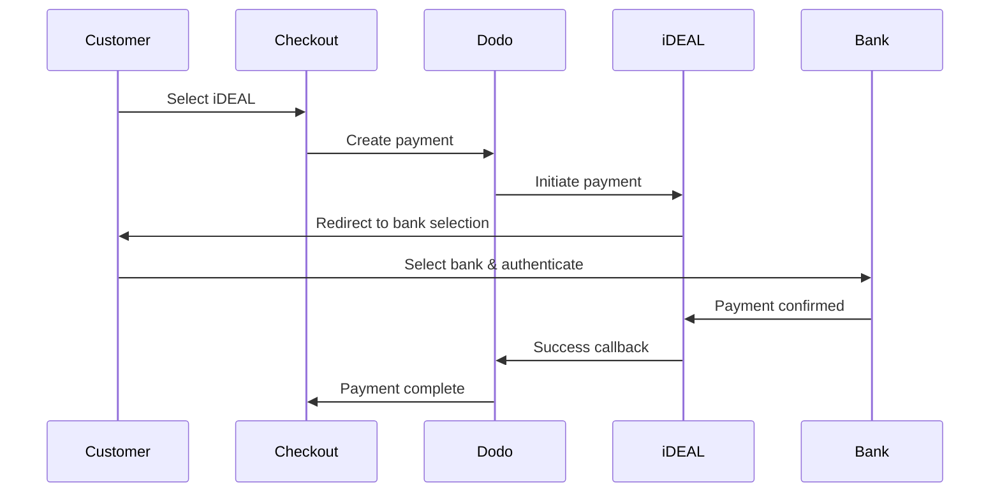
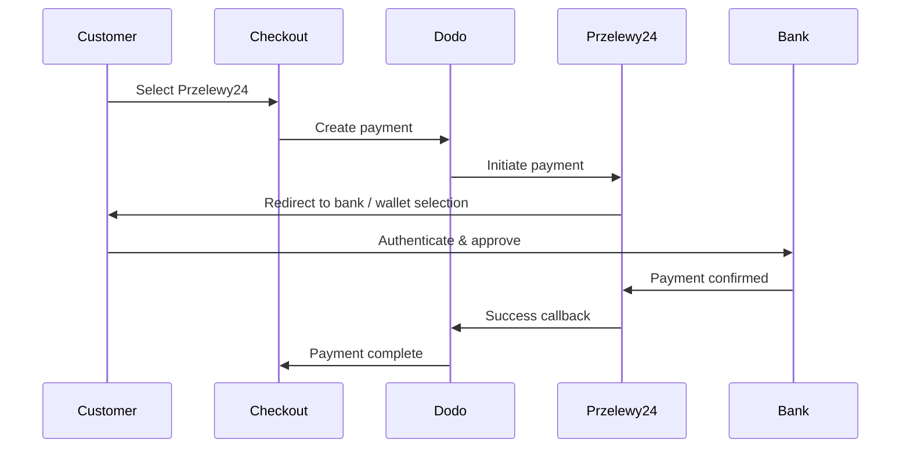

European customers strongly prefer local payment methods that integrate with their banking systems. Offering these methods can increase conversion rates by 20-40% in target markets.

## Why Local European Payment Methods?

<CardGroup cols={3}>
<Card title="Higher Conversion" icon="chart-line">
iDEAL captures ~60% of Dutch online payments. Not offering it means losing customers.
</Card>

<Card title="Lower Fraud" icon="shield-check">
Bank-authenticated payments have near-zero fraud rates and no chargebacks.
</Card>

<Card title="Real-Time Settlement" icon="bolt">
Most European methods provide instant payment confirmation.
</Card>
</CardGroup>

## Supported Methods

| 方法 | 国家 | 市场份额 | 货币 | 订阅 |
| :----- | :------ | :----------- | :------- | :-----------: |
| **iDEAL** | 荷兰 | ~60% | EUR | 否 |
| **Bancontact** | 比利时 | ~50% | EUR | 否 |
| **EPS** | 奥地利 | ~30% | EUR | 否 |
| **Multibanco** | 葡萄牙 | ~40% | EUR | 否 |
| **Przelewy24 (P24)** | 波兰 | ~30% | PLN | 否 |

## iDEAL (Netherlands)

iDEAL is the dominant online payment method in the Netherlands, connecting directly to all major Dutch banks.

### How It Works



### Supported Banks

All major Dutch banks are supported:
- ABN AMRO
- ASN Bank
- Bunq
- ING
- Knab
- Rabobank
- RegioBank
- Revolut
- SNS
- Triodos Bank
- Van Lanschot

### Configuration

```javascript
const session = await client.checkoutSessions.create({
  product_cart: [{ product_id: 'prod_123', quantity: 1 }],
  allowed_payment_method_types: ['ideal', 'credit', 'debit'],
  billing_currency: 'EUR',
  billing_address: {
    country: 'NL',
    zipcode: '1012JS'
  },
  return_url: 'https://example.com/success'
});
```

## Bancontact (Belgium)

Bancontact is Belgium's national payment scheme, used by virtually all Belgian banks for online payments.

### Features
- Works with existing Belgian debit cards
- Mobile app support (Payconiq by Bancontact)
- Instant payment confirmation
- No additional registration needed for customers

### Configuration

```javascript
const session = await client.checkoutSessions.create({
  product_cart: [{ product_id: 'prod_123', quantity: 1 }],
  allowed_payment_method_types: ['bancontact_card', 'credit', 'debit'],
  billing_currency: 'EUR',
  billing_address: {
    country: 'BE',
    zipcode: '1000'
  },
  return_url: 'https://example.com/success'
});
```

## EPS (Austria)

EPS (Electronic Payment Standard) enables direct online bank transfers for Austrian customers.

### Features
- Direct integration with Austrian banks
- Real-time payment confirmation
- High trust among Austrian consumers
- No chargebacks

### Supported Banks

Major Austrian banks including:
- Erste Bank
- Bank Austria
- Raiffeisen
- BAWAG
- Volksbank

### Configuration

```javascript
const session = await client.checkoutSessions.create({
  product_cart: [{ product_id: 'prod_123', quantity: 1 }],
  allowed_payment_method_types: ['eps', 'credit', 'debit'],
  billing_currency: 'EUR',
  billing_address: {
    country: 'AT',
    zipcode: '1010'
  },
  return_url: 'https://example.com/success'
});
```

## Multibanco (Portugal)

Multibanco is Portugal's interbank network, offering both online payments and ATM-based payments.

### Payment Options

1. **Online Banking** — Direct bank transfer via internet banking
2. **ATM Payment** — Customer receives a reference to pay at any Multibanco ATM
3. **Mobile Banking** — Payment via bank mobile apps

### How ATM Payment Works

For ATM payments, customers receive a payment reference:

```
Entity: 12345
Reference: 123 456 789
Amount: €50.00
Expiry: 24 hours
```

Customer can pay at any Portuguese ATM or via online banking using this reference.

### Configuration

```javascript
const session = await client.checkoutSessions.create({
  product_cart: [{ product_id: 'prod_123', quantity: 1 }],
  allowed_payment_method_types: ['multibanco', 'credit', 'debit'],
  billing_currency: 'EUR',
  billing_address: {
    country: 'PT',
    zipcode: '1000-001'
  },
  return_url: 'https://example.com/success'
});
```

<Note>
Multibanco ATM payments may have a delay between checkout and actual payment. Monitor webhooks for payment confirmation.
</Note>

## Przelewy24（波兰）

Przelewy24 (P24) 是波兰领先的在线支付方式，整合了银行转账和所有主要波兰银行的本地钱包。与其他欧洲方式不同，Przelewy24 以 **PLN**（波兰兹罗提）而非 EUR 结算。

### 工作原理



### 可用性

- **计费货币：** 仅 PLN
- **交易类型：** 仅一次性付款（不适用于订阅）
- **覆盖范围：** 所有主要波兰银行及流行的本地钱包

### 配置

```javascript
const session = await client.checkoutSessions.create({
  product_cart: [{ product_id: 'prod_123', quantity: 1 }],
  allowed_payment_method_types: ['przelewy24', 'credit', 'debit'],
  billing_currency: 'PLN',
  billing_address: {
    country: 'PL',
    zipcode: '00-001'
  },
  return_url: 'https://example.com/success'
});
```

<Note>
Przelewy24 需要 **PLN** 计费货币。如果您的价格以 EUR 报价，请启用 [Adaptive Currency](/features/adaptive-currency) 以便波兰客户以 PLN 计费并使 Przelewy24 可用。
</Note>

## API 方法类型

| 类型 | 方法 | 国家 |
| :--- | :----- | :------ |
| `ideal` | iDEAL | 荷兰 |
| `bancontact_card` | Bancontact | 比利时 |
| `eps` | EPS | 奥地利 |
| `multibanco` | Multibanco | 葡萄牙 |
| `przelewy24` | Przelewy24 (P24) | 波兰 |

## 多国家欧洲结算

对于服务于多个欧洲国家的企业，包括所有区域方法：

```javascript
const session = await client.checkoutSessions.create({
  product_cart: [{ product_id: 'prod_123', quantity: 1 }],
  allowed_payment_method_types: [
    'ideal',           // Netherlands
    'bancontact_card', // Belgium
    'eps',             // Austria
    'multibanco',      // Portugal
    'przelewy24',      // Poland (requires PLN billing currency)
    'credit',          // Fallback
    'debit'            // Fallback
  ],
  billing_currency: 'EUR',
  return_url: 'https://example.com/success'
});
```

Dodo 会根据客户位置自动显示相关方法。荷兰客户将看到 iDEAL；比利时客户将看到 Bancontact。

## 测试

可以在沙盒模式中测试欧洲支付方式。测试流程模拟银行认证过程。

<Steps>
<Step title="Enable test mode">
使用您的 Dodo Payments 测试 API 密钥。
</Step>

<Step title="Set appropriate billing address">
将账单地址国家设置为匹配支付方法：
- `NL` 用于 iDEAL
- `BE` 用于 Bancontact
- `AT` 用于 EPS
- `PT` 用于 Multibanco
- `PL` 用于 Przelewy24（采用 PLN 计费货币）
</Step>

<Step title="Complete the test flow">
在测试环境中跟随模拟的银行认证流程。
</Step>
</Steps>

## 最佳实践

<AccordionGroup>
<Accordion title="Always include regional methods for target markets">
如果您向荷兰客户销售，请包含 iDEAL。未包含相当于在美国不接受 Visa——您会失去大量销售。
</Accordion>

<Accordion title="Match currency to region">
大多数欧洲支付方式需要 EUR，请确保您的定价支持欧元交易。唯一的例外是 Przelewy24，仅以 **PLN**（波兰兹罗提）计费提供。
</Accordion>

<Accordion title="Handle redirects gracefully">
所有欧洲方法都涉及重定向到银行网站。确保您的返回网址处理健全，并考虑用户在中途放弃的情况。
</Accordion>

<Accordion title="Provide card fallbacks">
并非所有欧洲客户都能使用这些区域方法（游客、外籍人士等）。请始终包含 `credit` 和 `debit` 作为备选。
</Accordion>

<Accordion title="Consider Multibanco timing">
Multibanco ATM 支付可能需要数小时才能完成。不要在即时支付上阻止履行——使用 webhooks 进行异步确认。
</Accordion>
</AccordionGroup>

## 故障排除

<AccordionGroup>
<Accordion title="European method not appearing">
**检查：**
1. 客户账单国家是否与方法国家匹配？
2. 货币设置为 EUR？
3. 方法包含在 `allowed_payment_method_types` 中？

**解决方案：** 欧洲方法严格区域化。账单国家为 `DE` （德国）的客户不会看到仅限荷兰的 iDEAL。
</Accordion>

<Accordion title="Bank authentication failed">
**原因：**
- 客户在银行认证时取消
- 银行的认证系统暂时不可用
- 客户输入了错误的凭证

**解决方案：** 客户应重试。如果持续，请建议尝试其他支付方式。
</Accordion>

<Accordion title="Redirect not completing">
**原因：**
- 客户在银行重定向期间关闭浏览器
- 认证过程中的网络问题
- 返回 URL 配置错误

**解决方案：** 确认返回 URL 正确且可访问。确保它能处理成功和失败状态。
</Accordion>

<Accordion title="Multibanco payment pending">
**原因：** 客户已收到支付参考，但尚未支付。

**解决方案：** 这是 ATM 支付的正常情况。等待 webhook 确认。参考通常在 24-72 小时内过期。
</Accordion>
</AccordionGroup>

## PSD2 合规

所有欧洲支付方式均符合 PSD2（支付服务指令 2）法规：

- **强客户认证 (SCA)** — 内置于银行认证流程中
- **安全通信** — 所有数据通过安全渠道传输
- **消费者保护** — 完全符合欧盟消费者权利

## 相关页面

<CardGroup cols={2}>
<Card title="Payment Methods Overview" icon="credit-card" href="/features/payment-methods">
查看所有支持的支付方式。
</Card>

<Card title="Adaptive Currency" icon="globe" href="/features/adaptive-currency">
货币支持和自动转换。
</Card>

<Card title="Checkout Guide" icon="book" href="/developer-resources/checkout-session">
完整的结算实现指南。
</Card>

<Card title="Webhooks" icon="webhook" href="/developer-resources/webhooks">
异步处理付款确认。
</Card>
</CardGroup>