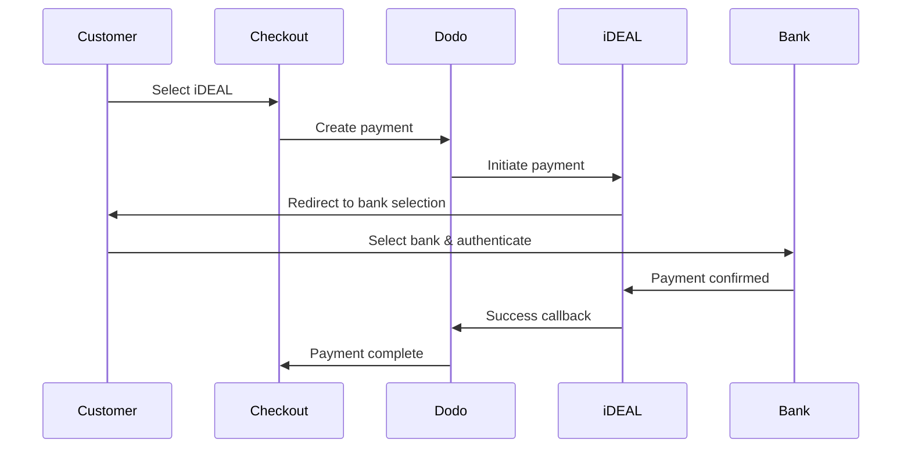
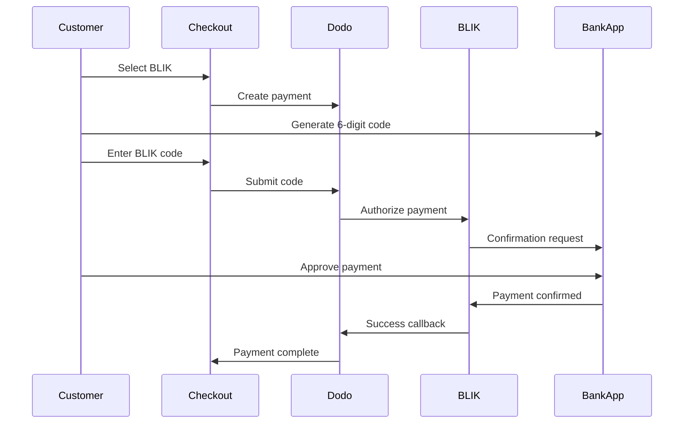
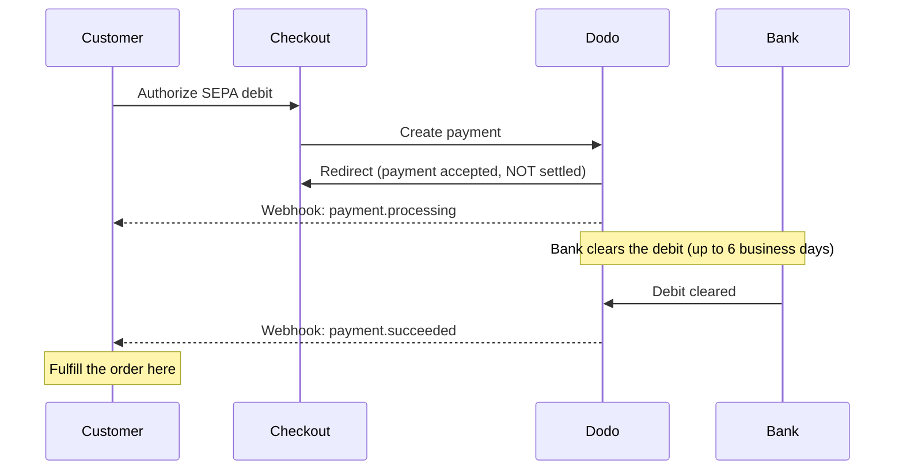

European customers strongly prefer local payment methods that integrate with their banking systems. Offering these methods can increase conversion rates by 20-40% in target markets.

## Why Local European Payment Methods?

<CardGroup cols={3}>
<Card title="Higher Conversion" icon="chart-line">
iDEAL captures ~60% of Dutch online payments. Not offering it means losing customers.
</Card>

<Card title="Lower Fraud" icon="shield-check">
Bank-authenticated payments have near-zero fraud rates and no chargebacks.
</Card>

<Card title="Real-Time Settlement" icon="bolt">
Most European methods provide instant payment confirmation.
</Card>
</CardGroup>

## Supported Methods

| 方式 | 国家/地区 | 市场份额 | 货币 | 订阅 |
| :----- | :------ | :----------- | :------- | :-----------: |
| **iDEAL** | 荷兰 | ~60% | EUR | 否 |
| **Bancontact** | 比利时 | ~50% | EUR | 否 |
| **EPS** | 奥地利 | ~30% | EUR | 否 |
| **Multibanco** | 葡萄牙 | ~40% | EUR | 否 |
| **BLIK** | 波兰 | ~60% | PLN | 否 |
| **SEPA Direct Debit** | 欧元区 | 广泛使用 | EUR | 否 |
| **Satispay** | 欧洲（意大利） | 正在增长 | EUR | 是 |

## iDEAL (Netherlands)

iDEAL is the dominant online payment method in the Netherlands, connecting directly to all major Dutch banks.

### How It Works



### Supported Banks

All major Dutch banks are supported:
- ABN AMRO
- ASN Bank
- Bunq
- ING
- Knab
- Rabobank
- RegioBank
- Revolut
- SNS
- Triodos Bank
- Van Lanschot

### Configuration

```javascript
const session = await client.checkoutSessions.create({
  product_cart: [{ product_id: 'pdt_123', quantity: 1 }],
  allowed_payment_method_types: ['ideal', 'credit', 'debit'],
  billing_currency: 'EUR',
  billing_address: {
    country: 'NL',
    zipcode: '1012JS'
  },
  return_url: 'https://example.com/success'
});
```

## Bancontact (Belgium)

Bancontact is Belgium's national payment scheme, used by virtually all Belgian banks for online payments.

### Features
- Works with existing Belgian debit cards
- Mobile app support (Payconiq by Bancontact)
- Instant payment confirmation
- No additional registration needed for customers

### Configuration

```javascript
const session = await client.checkoutSessions.create({
  product_cart: [{ product_id: 'pdt_123', quantity: 1 }],
  allowed_payment_method_types: ['bancontact_card', 'credit', 'debit'],
  billing_currency: 'EUR',
  billing_address: {
    country: 'BE',
    zipcode: '1000'
  },
  return_url: 'https://example.com/success'
});
```

## EPS (Austria)

EPS (Electronic Payment Standard) enables direct online bank transfers for Austrian customers.

### Features
- Direct integration with Austrian banks
- Real-time payment confirmation
- High trust among Austrian consumers
- No chargebacks

### Supported Banks

Major Austrian banks including:
- Erste Bank
- Bank Austria
- Raiffeisen
- BAWAG
- Volksbank

### Configuration

```javascript
const session = await client.checkoutSessions.create({
  product_cart: [{ product_id: 'pdt_123', quantity: 1 }],
  allowed_payment_method_types: ['eps', 'credit', 'debit'],
  billing_currency: 'EUR',
  billing_address: {
    country: 'AT',
    zipcode: '1010'
  },
  return_url: 'https://example.com/success'
});
```

## Multibanco (Portugal)

Multibanco is Portugal's interbank network, offering both online payments and ATM-based payments.

### Payment Options

1. **Online Banking** — Direct bank transfer via internet banking
2. **ATM Payment** — Customer receives a reference to pay at any Multibanco ATM
3. **Mobile Banking** — Payment via bank mobile apps

### How ATM Payment Works

For ATM payments, customers receive a payment reference:

```
Entity: 12345
Reference: 123 456 789
Amount: €50.00
Expiry: 24 hours
```

Customer can pay at any Portuguese ATM or via online banking using this reference.

### Configuration

```javascript
const session = await client.checkoutSessions.create({
  product_cart: [{ product_id: 'pdt_123', quantity: 1 }],
  allowed_payment_method_types: ['multibanco', 'credit', 'debit'],
  billing_currency: 'EUR',
  billing_address: {
    country: 'PT',
    zipcode: '1000-001'
  },
  return_url: 'https://example.com/success'
});
```

<Note>
Multibanco ATM payments may have a delay between checkout and actual payment. Monitor webhooks for payment confirmation.
</Note>

## BLIK（波兰）

BLIK 是波兰最受欢迎的移动支付方式，客户可以使用银行应用生成的一次性 6 位数代码进行支付。BLIK 以 **PLN**（波兰兹罗提）结算，而不是 EUR。

### 工作原理



### 可用性

- **账单货币：**仅限 PLN
- **交易类型：**仅限一次性付款（不支持订阅）
- **覆盖范围：**所有支持 BLIK 的主要波兰银行

### 配置

```javascript
const session = await client.checkoutSessions.create({
  product_cart: [{ product_id: 'pdt_123', quantity: 1 }],
  allowed_payment_method_types: ['blik', 'credit', 'debit'],
  billing_currency: 'PLN',
  billing_address: {
    country: 'PL',
    zipcode: '00-001'
  },
  return_url: 'https://example.com/success'
});
```

<Note>
BLIK 要求使用 **PLN** 账单货币。如果您以 EUR 报价，请启用 [Adaptive Currency](/features/adaptive-currency)，这样波兰客户将以 PLN 付款，并且 BLIK 将可用。
</Note>

## SEPA Direct Debit（欧元区）

SEPA Direct Debit 允许欧元区各地的客户直接从银行账户付款，而无需使用银行卡。该方式适用于 EUR 结账中的一次性付款。

<Warning>
**SEPA Direct Debit 不是即时支付——付款最多需要 6 个工作日才能确认。** 与本页上的其他所有支付方式不同，客户在结账时授权扣款，**并不**意味着资金已经到账。切勿在结账重定向时或在 `payment.processing` 上履行订单；请等待 `payment.succeeded` webhook。
</Warning>

### 工作原理

客户在结账时授权扣款，随后 Dodo Payments 会从其银行账户中收取资金。由于银行会异步结算扣款，付款会先进入 `processing` 状态，然后才会达到最终结果：



### 付款时间线

| 阶段 | 时间 | 付款状态 | 含义 |
| :---- | :--- | :------------- | :------------ |
| **授权** | 结账时 | `processing` | 客户批准了扣款并被重定向回来。资金**尚未**转移——不要履行订单。 |
| **确认** | 最多 **6 个工作日**后 | `succeeded` | 银行已结算扣款。现在履行订单。 |
| **失败** | 最多 **6 个工作日**后 | `failed` | 无法收取扣款（例如余额不足）。不要履行订单；通知客户。 |

由于客户离开你的网站数天后才会收到确认，你的 webhook handler——而不是结账重定向——必须负责授予访问权限。请参阅下方的[处理确认延迟](#handling-the-confirmation-delay)。

### 可用性

- **结算货币：** EUR
- **交易类型：** 仅限一次性付款（不适用于订阅）

### 配置

```javascript
const session = await client.checkoutSessions.create({
  product_cart: [{ product_id: 'pdt_123', quantity: 1 }],
  allowed_payment_method_types: ['sepa', 'credit', 'debit'],
  billing_currency: 'EUR',
  billing_address: {
    country: 'DE',
    zipcode: '10115'
  },
  return_url: 'https://example.com/success'
});
```

### SEPA 测试 IBAN

在测试模式下，在结账时输入以下 IBAN 之一，以强制触发特定结果。

| 测试 IBAN | 行为 |
| :-------- | :------- |
| `DE89370400440532013000` | 付款成功。 |
| `DE08370400440532013003` | 延迟至少三分钟后付款成功。 |
| `DE62370400440532013001` | 付款失败。 |
| `DE78370400440532013004` | 延迟至少三分钟后付款失败。 |
| `DE35370400440532013002` | 付款成功，随后立即产生争议。 |
| `DE65370400440002222227` | 由于余额不足，付款失败。 |
| `DE18370400440000066666` | 银行账户不可用，因此无法创建该付款方式。 |

要测试特定国家/地区的行为，请使用其他欧元区国家对应的成功 IBAN：

| 国家/地区 | 成功 IBAN |
| :------ | :----------- |
| 奥地利 | `AT611904300234573201` |
| 比利时 | `BE62510007547061` |
| 爱沙尼亚 | `EE382200221020145685` |
| 芬兰 | `FI2112345600000785` |
| 法国 | `FR1420041010050500013M02606` |
| 爱尔兰 | `IE29AIBK93115212345678` |
| 卢森堡 | `LU280019400644750000` |

<Note>
延迟测试 IBAN 有助于确认是你的 webhook handler——而不是结账重定向——负责授予访问权限，因为 SEPA 付款会在客户离开结账页面很久之后才确认。
</Note>

### 处理确认延迟

由于 SEPA 在结账后最多需要 6 个工作日才能结算，你不能依赖浏览器重定向来判断付款是否已到账。相反，应通过 webhook 事件驱动订单履行。启用 `payload.type` 并处理每个阶段：

| 事件类型 | 触发时间 | 操作 |
| :--------- | :------------ | :--------- |
| `payment.processing` | 客户在结账时授权扣款并被重定向回来。 | **不要履行订单。** 将订单标记为待处理，并可选择告知客户其付款正在处理中。 |
| `payment.succeeded` | 银行已结算扣款（最多 6 个工作日后）。 | 履行订单——授予访问权限、配置产品并发送收据。 |
| `payment.failed` | 无法收取扣款。 | 通知客户并提示重试；不要履行订单。 |

```javascript Handling SEPA payment events expandable
app.post('/webhooks/dodo', async (req, res) => {
  const event = req.body;

  switch (event.type) {
    case 'payment.processing': {
      // SEPA debit authorized but NOT settled — this can last up to 6 business days.
      // Record the order as pending; do not grant access yet.
      await markOrderPending(event.data.payment_id);
      break;
    }
    case 'payment.succeeded': {
      // The debit cleared — safe to fulfill now.
      await fulfillOrder(event.data.payment_id);
      break;
    }
    case 'payment.failed': {
      // The debit could not be collected (e.g. insufficient funds).
      await markOrderFailed(event.data.payment_id);
      // Notify the customer and prompt a retry.
      break;
    }
  }

  res.json({ received: true });
});
```

<Tip>
始终通过 webhook 中的 `payment.succeeded` **履行订单**，切勿在结账重定向或 `payment.processing` 上履行。重定向会在客户授权扣款的瞬间触发，此时距离资金实际到账可能还有数天。处理前请验证 webhook 签名；有关设置，请参阅 [Webhooks 指南](/developer-resources/webhooks)，完整事件列表请参阅 [Webhook Event Guide](/developer-resources/webhooks/intents/webhook-events-guide)。
</Tip>

<Warning>
在结账时明确告知客户预期。由于只有在扣款到账后才会授予访问权限，请告知 SEPA 客户其订单正在处理中，并会在付款确认后收到通知——否则，他们可能会像使用 card payment 一样期待即时访问。
</Warning>

## Satispay（欧洲）

Satispay 是一个广受欢迎的欧洲移动支付网络，尤其在意大利普及。它允许客户直接通过 Satispay 应用付款，而无需分享卡或银行详细信息。Satispay 以 **EUR** 结算。

### 功能

- 基于应用的付款，不依赖卡网络
- 在意大利得到广泛采用，并逐渐拓展至其他欧洲市场
- 同时支持一次性付款和订阅

### 可用性

- **结算货币：** EUR
- **交易类型：** 一次性付款和订阅

### 配置

```javascript
const session = await client.checkoutSessions.create({
  product_cart: [{ product_id: 'pdt_123', quantity: 1 }],
  allowed_payment_method_types: ['satispay', 'credit', 'debit'],
  billing_currency: 'EUR',
  billing_address: {
    country: 'IT',
    zipcode: '00100'
  },
  return_url: 'https://example.com/success'
});
```

## API Method Types

| 类型 | 方式 | 国家/地区 |
| :--- | :----- | :------ |
| `ideal` | iDEAL | 荷兰 |
| `bancontact_card` | Bancontact | 比利时 |
| `eps` | EPS | 奥地利 |
| `multibanco` | Multibanco | 葡萄牙 |
| `blik` | BLIK | 波兰 |
| `sepa` | SEPA Direct Debit | 欧元区 |
| `satispay` | Satispay | 欧洲（意大利） |

## 多国家/地区欧洲结账

如果你的企业服务多个欧洲国家/地区，请包含所有区域性付款方式：

```javascript
const session = await client.checkoutSessions.create({
  product_cart: [{ product_id: 'pdt_123', quantity: 1 }],
  allowed_payment_method_types: [
    'ideal',           // Netherlands
    'bancontact_card', // Belgium
    'eps',             // Austria
    'multibanco',      // Portugal
    'blik',            // Poland (requires PLN billing currency)
    'sepa',            // Eurozone (one-time payments only)
    'satispay',        // Europe / Italy
    'credit',          // Fallback
    'debit'            // Fallback
  ],
  billing_currency: 'EUR',
  return_url: 'https://example.com/success'
});
```

Dodo 会根据客户所在位置自动仅显示相关付款方式。荷兰客户会看到 iDEAL；比利时客户会看到 Bancontact。

## 测试

欧洲付款方式可以在 Test Mode 中进行测试。测试流程会模拟银行身份验证过程。

<Note>
SEPA Direct Debit 的测试方式有所不同——你需要直接输入测试 IBAN，而不是使用模拟的银行流程。请参阅 [SEPA Test IBANs](#sepa-test-ibans)。
</Note>

<Steps>
<Step title="Enable test mode">
使用你的 Dodo Payments 测试 API keys。
</Step>

<Step title="Set appropriate billing address">
将账单地址国家/地区设置为与付款方式匹配：
- `NL`，用于 iDEAL
- `BE`，用于 Bancontact
- `AT`，用于 EPS
- `PT`，用于 Multibanco
- `PL`，用于 BLIK（账单货币为 PLN）
- `IT`，用于 Satispay
</Step>

<Step title="Complete the test flow">
在测试环境中按照模拟的银行身份验证流程操作。
</Step>
</Steps>

## 最佳实践

<AccordionGroup>
<Accordion title="Always include regional methods for target markets">
如果你向荷兰客户销售，请包含 iDEAL。不这样做就像在美国不接受 Visa 一样——你会损失大量销售额。
</Accordion>

<Accordion title="Match currency to region">
大多数欧洲付款方式都要求使用 EUR——请确保你的定价支持欧元交易。唯一的例外是 BLIK，它仅提供 **PLN**（波兰兹罗提）账单货币。
</Accordion>

<Accordion title="Handle redirects gracefully">
所有欧洲付款方式都会重定向至银行网站。请确保返回 URL 处理稳健，并能够处理用户在流程中途放弃的情况。
</Accordion>

<Accordion title="Provide card fallbacks">
并非所有欧洲客户都能使用这些区域性付款方式（例如游客、外籍人士等）。请始终包含 `credit` 和 `debit` 作为备用方式。
</Accordion>

<Accordion title="Consider Multibanco timing">
Multibanco ATM 付款可能需要数小时才能完成。不要因等待即时付款而阻塞订单履行——请使用 webhook 进行异步确认。
</Accordion>

<Accordion title="Account for the SEPA 6-day delay">
SEPA Direct Debit 最多需要 **6 个工作日**才能确认。切勿在结账重定向或 `payment.processing` 上履行订单——只能通过 `payment.succeeded` webhook 授予访问权限，并在结账时明确告知客户订单处于待处理状态。请参阅[处理确认延迟](#handling-the-confirmation-delay)。
</Accordion>
</AccordionGroup>

## 故障排除

<AccordionGroup>
<Accordion title="European method not appearing">
**检查：**
1. 客户账单国家/地区是否与付款方式的国家/地区匹配？
2. 货币是否设置为 EUR？
3. 是否在 `allowed_payment_method_types` 中包含该付款方式？

**解决方案：** 欧洲付款方式具有严格的区域限制。账单国家/地区为 `DE`（德国）的客户不会看到 iDEAL，因为 iDEAL 仅适用于荷兰。
</Accordion>

<Accordion title="Bank authentication failed">
**原因：**
- 客户在银行身份验证期间取消
- 银行身份验证系统暂时不可用
- 客户输入了错误的凭据

**解决方案：** 客户应重试。如果问题持续存在，建议尝试其他付款方式。
</Accordion>

<Accordion title="Redirect not completing">
**原因：**
- 客户在银行重定向期间关闭了浏览器
- 身份验证期间出现网络问题
- 返回 URL 配置错误

**解决方案：** 验证返回 URL 是否正确且可访问。确保其能够处理成功和失败状态。
</Accordion>

<Accordion title="Multibanco payment pending">
**原因：** 客户已收到付款参考号，但尚未付款。

**解决方案：** 这是基于 ATM 的付款方式的正常情况。请等待 webhook 确认。参考号通常会在 24-72 小时后过期。
</Accordion>

<Accordion title="SEPA payment stuck in processing">
**原因：** SEPA Direct Debit 会通过客户的银行进行异步结算。

**解决方案：** 这是正常情况。`payment.processing` 状态可能持续最多 **6 个工作日**，之后扣款才会到账。请等待最终的 `payment.succeeded`（履行订单）或 `payment.failed`（不要履行订单）webhook——不要将结账重定向视为确认。请参阅[处理确认延迟](#handling-the-confirmation-delay)。
</Accordion>
</AccordionGroup>

## PSD2 合规性

所有欧洲付款方式均符合 PSD2（Payment Services Directive 2）法规：

- **Strong Customer Authentication (SCA)** —— 集成在银行身份验证流程中
- **安全通信** —— 所有数据均通过安全通道传输
- **消费者保护** —— 完全符合欧盟消费者权益要求

## 相关页面

<CardGroup cols={2}>
<Card title="Payment Methods Overview" icon="credit-card" href="/features/payment-methods">
查看所有支持的付款方式。
</Card>

<Card title="Adaptive Currency" icon="globe" href="/features/adaptive-currency">
货币支持和自动转换。
</Card>

<Card title="Checkout Guide" icon="book" href="/developer-resources/checkout-session">
完整的结账实现指南。
</Card>

<Card title="Webhooks" icon="webhook" href="/developer-resources/webhooks">
异步处理付款确认。
</Card>
</CardGroup>