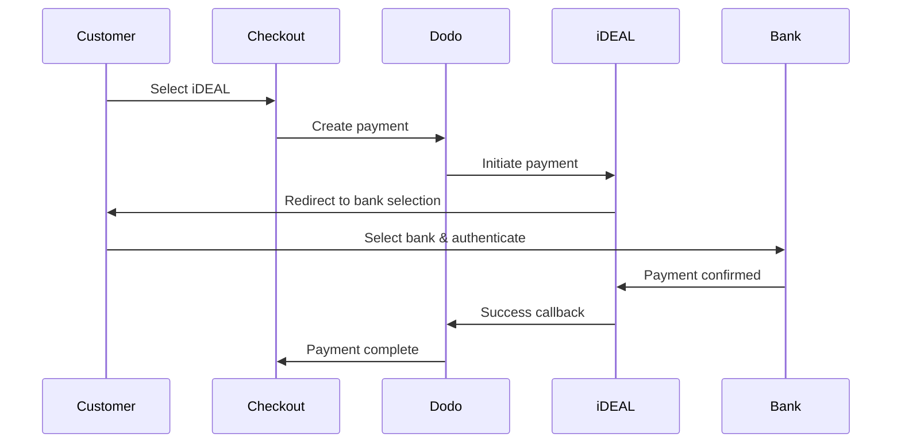

欧洲客户强烈偏好与其银行系统集成的本地支付方式。提供这些方式可以在目标市场中提高 20-40% 的转换率。

## 为什么选择当地的欧洲支付方式？

<CardGroup cols={3}>
<Card title="更高的转换率" icon="chart-line">
iDEAL 占据荷兰在线支付的 ~60%。不提供这项服务意味着会失去客户。
</Card>

<Card title="更低的欺诈风险" icon="shield-check">
银行认证支付几乎没有欺诈率，也没有退款。
</Card>

<Card title="实时结算" icon="bolt">
大多数欧洲支付方式提供即时支付确认。
</Card>
</CardGroup>

## 支持的支付方式

| 方法 | 国家 | 市场份额 | 货币 | 订阅 |
| :----- | :------ | :----------- | :------- | :-----------: |
| **iDEAL** | 荷兰 | ~60% | EUR | 否 |
| **Bancontact** | 比利时 | ~50% | EUR | 否 |
| **EPS** | 奥地利 | ~30% | EUR | 否 |
| **Multibanco** | 葡萄牙 | ~40% | EUR | 否 |

## iDEAL（荷兰）

iDEAL 是荷兰主要的在线支付方式，直接连接所有主要荷兰银行。

### 工作原理



### 支持的银行

所有主要荷兰银行均得到支持：
- ABN AMRO
- ASN Bank
- Bunq
- ING
- Knab
- Rabobank
- RegioBank
- Revolut
- SNS
- Triodos Bank
- Van Lanschot

### 配置

```javascript
const session = await client.checkoutSessions.create({
  product_cart: [{ product_id: 'prod_123', quantity: 1 }],
  allowed_payment_method_types: ['ideal', 'credit', 'debit'],
  billing_currency: 'EUR',
  billing_address: {
    country: 'NL',
    zipcode: '1012JS'
  },
  return_url: 'https://example.com/success'
});
```

## Bancontact（比利时）

Bancontact 是比利时的国家支付方案，几乎所有比利时银行都使用该方案进行在线支付。

### 功能
- 与现有比利时借记卡兼容
- 支持移动应用（Payconiq by Bancontact）
- 实时支付确认
- 客户无需额外注册

### 配置

```javascript
const session = await client.checkoutSessions.create({
  product_cart: [{ product_id: 'prod_123', quantity: 1 }],
  allowed_payment_method_types: ['bancontact_card', 'credit', 'debit'],
  billing_currency: 'EUR',
  billing_address: {
    country: 'BE',
    zipcode: '1000'
  },
  return_url: 'https://example.com/success'
});
```

## EPS（奥地利）

EPS（电子支付标准）使奥地利客户能够进行直接在线银行转账。

### 功能
- 与奥地利银行直接集成
- 实时支付确认
- 在奥地利消费者中具有高度信任
- 无退款

### 支持的银行

包括主要的奥地利银行：
- Erste Bank
- Bank Austria
- Raiffeisen
- BAWAG
- Volksbank

### 配置

```javascript
const session = await client.checkoutSessions.create({
  product_cart: [{ product_id: 'prod_123', quantity: 1 }],
  allowed_payment_method_types: ['eps', 'credit', 'debit'],
  billing_currency: 'EUR',
  billing_address: {
    country: 'AT',
    zipcode: '1010'
  },
  return_url: 'https://example.com/success'
});
```

## Multibanco（葡萄牙）

Multibanco 是葡萄牙的跨银行网络，提供在线支付和 ATM 基于支付。

### 付款选项
1. **在线银行** — 通过互联网银行进行直接银行转账
2. **ATM 支付** — 客户收到一条在任何 Multibanco ATM 上支付的参考信息
3. **移动银行** — 通过银行移动应用进行支付

### ATM 支付的工作原理

对于 ATM 支付，客户会收到一条支付参考：

```
Entity: 12345
Reference: 123 456 789
Amount: €50.00
Expiry: 24 hours
```

客户可以在任何葡萄牙的 ATM 上或通过在线银行使用此参考进行付款。

### 配置

```javascript
const session = await client.checkoutSessions.create({
  product_cart: [{ product_id: 'prod_123', quantity: 1 }],
  allowed_payment_method_types: ['multibanco', 'credit', 'debit'],
  billing_currency: 'EUR',
  billing_address: {
    country: 'PT',
    zipcode: '1000-001'
  },
  return_url: 'https://example.com/success'
});
```

<Note>
Multibanco ATM 支付可能在结账和实际支付之间有延迟。请监控 webhooks 以确认支付。
</Note>

## API 方法类型

| 类型 | 方法 | 国家 |
| :--- | :----- | :------ |
| `ideal` | iDEAL | 荷兰 |
| `bancontact_card` | Bancontact | 比利时 |
| `eps` | EPS | 奥地利 |
| `multibanco` | Multibanco | 葡萄牙 |

## 多国欧洲结账

对于服务于多个欧洲国家的企业，请包括所有区域方法：

```javascript
const session = await client.checkoutSessions.create({
  product_cart: [{ product_id: 'prod_123', quantity: 1 }],
  allowed_payment_method_types: [
    'ideal',           // Netherlands
    'bancontact_card', // Belgium
    'eps',             // Austria
    'multibanco',      // Portugal
    'credit',          // Fallback
    'debit'            // Fallback
  ],
  billing_currency: 'EUR',
  return_url: 'https://example.com/success'
});
```

Dodo 会根据客户的位置自动显示相关的方法。荷兰客户会看到 iDEAL；比利时客户会看到 Bancontact。

## 测试

欧洲支付方法可以在沙箱模式下进行测试。测试流程模拟银行认证过程。

<Steps>
<Step title="启用测试模式">
使用您的 Dodo Payments 测试 API 密钥。
</Step>

<Step title="设置适当的账单地址">
将账单地址国家设置为与付款方法匹配：
- `NL` 用于 iDEAL
- `BE` 用于 Bancontact
- `AT` 用于 EPS
- `PT` 用于 Multibanco
</Step>

<Step title="完成测试流程">
在测试环境中遵循模拟的银行认证流程。
</Step>
</Steps>

## 最佳实践

<AccordionGroup>
<Accordion title="始终为目标市场包含区域方法">
如果您向荷兰客户销售，请包含 iDEAL。不这样做就像在美国不接受 Visa——您会失去大量销售。
</Accordion>

<Accordion title="区域与货币匹配">
欧洲支付方法需要 EUR。确保您的定价支持欧元交易。
</Accordion>

<Accordion title="妥善处理重定向">
所有欧洲方法都涉及重定向到银行网站。确保您的返回 URL 处理是稳健的，并考虑到在流程中放弃的用户。
</Accordion>

<Accordion title="提供卡的备选方案">
并非所有欧洲客户都可以使用这些区域方法（游客、外籍人士等）。始终包含 `credit` 和 `debit` 作为备选。
</Accordion>

<Accordion title="考虑 Multibanco 的时间安排">
Multibanco ATM 支付可能需要几个小时才能完成。请不要在即时支付上阻止履行——使用 webhooks 进行异步确认。
</Accordion>
</AccordionGroup>

## 故障排除

<AccordionGroup>
<Accordion title="欧洲方法未出现">
**检查：**
1. 客户账单国家是否与该方法的国家匹配？
2. 货币是否设置为 EUR？
3. 方法是否包含在 `allowed_payment_method_types`？

**解决方案：**欧洲方法严格区域化。一个账单国家为 `DE`（德国）的客户不会看到仅限于荷兰的 iDEAL。
</Accordion>

<Accordion title="银行认证失败">
**原因：**
- 客户在银行认证过程中取消了
- 银行的认证系统暂时不可用
- 客户输入了错误的凭证

**解决方案：**客户应重试。如果持续，请建议尝试其他支付方式。
</Accordion>

<Accordion title="重定向未完成">
**原因：**
- 客户在银行重定向过程中关闭了浏览器
- 认证过程中网络问题
- 返回 URL 配置错误

**解决方案：**确认返回 URL 正确且可访问。确保它能够处理成功和失败状态。
</Accordion>

<Accordion title="Multibanco 支付待处理">
**原因：** 客户收到支付参考，但尚未付款。

**解决方案：**这是用于基于 ATM 的支付的预期情况。等待 webhook 确认。参考通常在 24-72 小时内过期。
</Accordion>
</AccordionGroup>

## PSD2 合规性

所有欧洲支付方法均符合 PSD2（支付服务指令 2）规定：

- **强客户认证 (SCA)** — 内置于银行认证流程中
- **安全通信** — 所有数据通过安全通道传输
- **消费者保护** — 完全符合 EU 消费者权利

## 相关页面

<CardGroup cols={2}>
<Card title="支付方式概述" icon="credit-card" href="/features/payment-methods">
查看所有支持的支付方式。
</Card>

<Card title="自适应货币" icon="globe" href="/features/adaptive-currency">
货币支持和自动转换。
</Card>

<Card title="结账指南" icon="book" href="/developer-resources/checkout-session">
完整结账实现指南。
</Card>

<Card title="Webhooks" icon="webhook" href="/developer-resources/webhooks">
异步处理支付确认。
</Card>
</CardGroup>

<Card title="Webhooks" icon="webhook" href="/developer-resources/webhooks">
Handle payment confirmations asynchronously.
</Card>
</CardGroup>