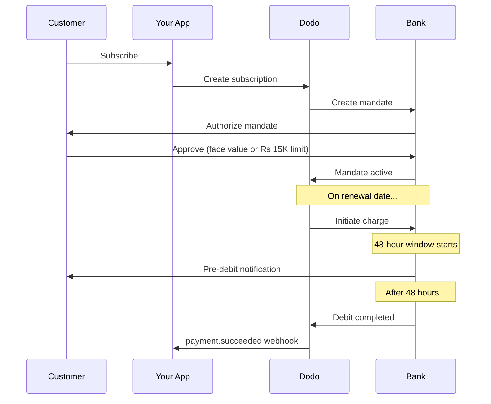

印度拥有独特的支付基础设施，UPI 占据了 60% 以上的数字交易，此外还有印度发行的卡片（Visa、Mastercard、Rupay 等）。Dodo Payments 支持所有这些，并完全符合 RBI 的订阅授权要求。

## 为什么印度的支付方式很重要

UPI 每月处理超过 100 亿笔交易。许多印度客户没有国际卡。

UPI 的交易费用几乎为零。非常适合大批量低价值的交易。

与大多数替代支付方式不同，UPI 和所有印度发行的卡片（Visa、Mastercard、Rupay 等）通过 RBI 授权支持定期支付。

## 支持的方法

| 方法 | 类型 | 订阅 | 最小金额 |
| :----- | :--- | :-----------: | :--------- |
| **UPI 收款** | QR 码 / VPA | 是* | ₹1 |
| **Rupay 信用卡** | 卡 | 是* | ₹1 |
| **Rupay 借记卡** | 卡 | 是* | ₹1 |

*订阅需要符合 RBI 的授权和特殊的处理规则。48 小时的处理延迟适用于所有印度发行的卡和 UPI。

## 配置

### API 方法类型

| 类型 | 描述 |
| :--- | :---------- |
| `upi_collect` | UPI 通过 QR 码或 VPA 输入 |
| `credit` | 包括 Rupay 的信用卡 |
| `debit` | 包括 Rupay 的借记卡 |

### 示例：面向印度的结账

```javascript
const session = await client.checkoutSessions.create({
  product_cart: [{ product_id: 'prod_123', quantity: 1 }],
  allowed_payment_method_types: [
    'upi_collect',
    'credit',
    'debit'
  ],
  billing_currency: 'INR',
  customer: {
    email: 'customer@example.in',
    name: 'Priya Sharma',
    phone_number: '+919876543210'
  },
  billing_address: {
    country: 'IN',
    zipcode: '560001'
  },
  return_url: 'https://example.com/success'
});
```

### UPI 的要求

要在结账时显示 UPI：
1. **账单国家**必须是印度 (`IN`)
2. **货币**必须是 INR
3. 对于非印度商户：必须启用**自适应货币**

如果您是非印度商户且未启用自适应货币，UPI 将无法提供给您的客户。

## 使用 RBI 授权的订阅

印度支付方法订阅在 RBI（印度储备银行）规定下运行，具有独特要求。

### RBI 授权如何运作



### 授权类型

| 订阅金额 | 授权类型 | 限制 |
| :------------------ | :----------- | :---- |
| **低于授权底限** | 按需授权 | 授权底限（默认 ₹15,000） |
| **不低于授权底限** | 固定金额授权 | 精确订阅金额 |

在客户的银行注册的金额是 `max(mandate_floor, billing_amount)`。因此，当充值低于底限时，底限实际上成为客户面向的**授权上限**。

**计划更改的重要事项：**如果升级导致的费用超过现有授权限制，将导致扣费失败，客户必须重新授权。

### 可配置的授权底限

INR 的电子授权底限可以通过 `mandate_min_amount_inr_paise` 字段配置（以 **INR paise** 为单位 — 1 INR = 100 paise）。您可以在三个级别上覆盖系统默认的 ₹15,000：

| 级别 | 设置位置 | 作用范围 |
|-------|--------------|-------|
| **每次请求** | 在结账会话或订阅上设置 `mandate_min_amount_inr_paise` | 一笔交易 |
| **商户** | 业务设置 | 您的所有 INR 订阅 |
| **系统** | — | ₹15,000 默认值 |

解决优先级：每个请求的覆盖 → 商户设置 → 系统默认。

```typescript
// Per-checkout override
const session = await client.checkoutSessions.create({
  product_cart: [{ product_id: 'prod_inr_monthly', quantity: 1 }],
  mandate_min_amount_inr_paise: 2_000_000, // ₹20,000 ceiling
  return_url: 'https://yoursite.com/return'
});

// Per-subscription override
const subscription = await client.subscriptions.create({
  product_id: 'pdt_inr_monthly',
  quantity: 1,
  customer: { email: 'customer@example.in' },
  billing: { country: 'IN', /* ... */ },
  mandate_min_amount_inr_paise: 2_000_000
});
```

| 字段 | 类型 | 验证 | 应用于 |
|-------|------|------------|------------|
| `mandate_min_amount_inr_paise` | `integer` (INR paise) | `>= 1` | 在非 Airwallex 连接器上的印度卡 INR 订阅 |

设置较高的底限可以让您支持以后更大的单次收费（例如，计划升级或基于使用的超额费用），无需强迫客户重新授权。设置较低的底限使客户的授权更接近实际账单金额，但限制了未来可变收费的空间。

此设置仅影响为印度发行的卡（Visa、Mastercard、RuPay）注册的 INR 订阅电子授权。UPI 订阅遵循自己的自动支付流程，不受影响。

### 48 小时处理延迟

这是与国际卡支付最重要的区别：

在预定的续订日期，Dodo 与银行发起扣费。

客户收到银行关于即将扣款的通知。

客户可以在此期间通过其银行应用取消授权。

经过 48 小时（外加银行处理的最多 3 小时）后，资金被扣除。

`payment.succeeded` webhook 会在实际扣费后发送，而不是在发起时。

**不要在扣费发起时急于授予权益。**等待大约 48-51 小时后收到的 `payment.succeeded` webhook。

### 处理 48 小时窗口

```javascript
// DON'T do this:
async function handleSubscriptionRenewal(subscription) {
  // ❌ Bad: Granting access immediately when charge is initiated
  grantPremiumAccess(subscription.customer_id);
}

// DO this:
async function handlePaymentWebhook(event) {
  if (event.type === 'payment.succeeded') {
    // ✅ Good: Only grant access after payment is confirmed
    grantPremiumAccess(event.data.customer_id);
  }
  
  if (event.type === 'payment.failed') {
    // Handle failed payment (mandate cancelled, insufficient funds)
    revokePremiumAccess(event.data.customer_id);
  }
}
```

### 印度订阅的 Webhook 事件

| 事件 | 何时 | 动作 |
| :---- | :--- | :----- |
| `subscription.active` | 授权被批准 | 记录订阅开始 |
| `payment.succeeded` | ~48 小时后扣费日期 | 授予/继续访问 |
| `payment.failed` | 扣款失败 | 通知客户，暂停访问 |
| `subscription.on_hold` | 支付失败 | 提示更新支付方式 |
| `subscription.active` | 付款后重新激活 | 恢复访问 |

## 测试

### UPI 测试 ID

| 状态 | UPI ID |
| :----- | :----- |
| 成功 | `success@upi` |
| 失败 | `failure@upi` |

### 印度卡测试号码

| 品牌 | 场景 | 卡号 | 有效期 | CVV |
| :---- | :------- | :---------- | :----- | :-- |
| Visa | 成功 | `4576238912771450` | 06/32 | 123 |
| Visa | 拒绝 | `4706131211212123` | 06/32 | 123 |
| Mastercard | 成功 | `5409162669381034` | 06/32 | 123 |
| Mastercard | 拒绝 | `5105105105105100` | 06/32 | 123 |

## 最佳实践

构建您的应用程序以处理扣费发起和实际支付之间的差距。考虑：
- 订阅访问的宽限期
- 明确告知客户处理时间
- 基于 webhook 的交付，而不是基于日期的交付

客户可以随时通过其银行应用取消授权。监测 `subscription.on_hold` webhook，并提示客户重新订阅或更新支付方式。

对于可变定价（例如，基于使用的），请考虑 15,000 卢比的按需授权是否足够。如果费用可能超过此额度，客户将需要重新授权。

对于印度客户，UPI 应该是首选支付选项。由于熟悉度和较低的摩擦，许多用户更喜欢它而不是卡片。

## 故障排除

**检查：**
1. 账单国家设置为 `IN`？
2. 货币设置为 `INR`？
3. 如果是非印度商户：启用了自适应货币？
4. `upi_collect` 包含在 `allowed_payment_method_types` 中？

**解决方案：** 验证账单地址是否有 `country: "IN"` 和 `billing_currency: "INR"`。

**原因：** 新的费用金额超过了现有授权限制（15,000 卢比门槛）。

**解决方案：** 客户必须更新支付方式以建立正确限制的新授权。

**原因：** 客户可能在 48 小时窗口期间取消了授权，或者他们的银行拒绝了扣款。

**解决方案：** 客户需要重新授权或更新其支付方式。

**原因：** 银行 API 延迟可以将处理时间延长 2-3 小时。

**解决方案：** 这是预期的。构建您的系统以处理最高约 51 小时的可变延迟。

**原因：** RBI 规定中的边缘情况 — 在 处理中窗口内取消权限不会立即取消订阅。

**解决方案：** 下一个扣费将失败，订阅将移至 `on_hold`。监测 `payment.failed` 的 webhook。

## 相关页面

查看所有支持的支付方式。

完整的订阅文档，包括 RBI 授权。

支付事件的 Webhook 处理。

所有测试数据，包括 UPI ID 和印度卡。