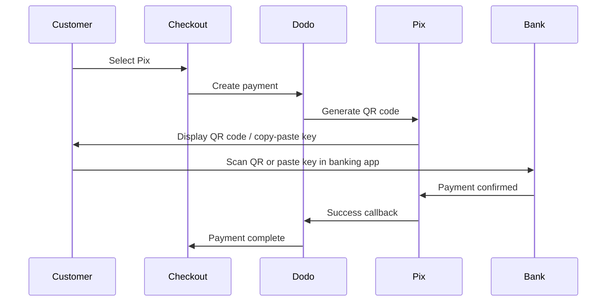

Pix 是巴西中央银行（Banco Central do Brasil）创建的巴西即时支付系统。它支持全天候实时转账，包括周末和假期，已成为巴西最流行的支付方式。

## 为何提供 Pix？

<CardGroup cols={3}>
<Card title="Dominant in Brazil" icon="chart-line">
Pix 是巴西使用最多的付款方式，超越了信用卡和 boleto。
</Card>

<Card title="Instant Settlement" icon="bolt">
付款可在几秒钟内确认，24/7/365 — 无需等待银行处理时间。
</Card>

<Card title="Low Friction" icon="mobile">
客户通过二维码或复制粘贴密钥支付 — 无需卡号或银行详情。
</Card>
</CardGroup>

## 概述

| 细节 | 值 |
| :----- | :---- |
| **计费货币** | BRL |
| **支持国家** | 巴西 |
| **订阅** | 否 |
| **最低金额** | $0.50 |
| **结算** | 即时 |

## 工作原理



## 客户体验

1. 客户在结账时选择 Pix
2. 显示二维码和复制粘贴密钥
3. 客户打开其银行应用扫描二维码或粘贴密钥
4. 付款立即确认
5. 客户被重定向到成功页面

<Info>
Pix 二维码通常在设定时间后过期。如果客户未能及时完成付款，他们需要重新开始结账。
</Info>

## 配置

```javascript
const session = await client.checkoutSessions.create({
  product_cart: [{ product_id: 'prod_123', quantity: 1 }],
  allowed_payment_method_types: ['pix', 'credit', 'debit'],
  billing_currency: 'BRL',
  return_url: 'https://example.com/success'
});
```

## API 方法类型

| 类型 | 方法 | 国家 |
| :--- | :----- | :------ |
| `pix` | Pix | Brazil |

## 测试

<Steps>
<Step title="Enable test mode">
使用您的 Dodo Payments 测试 API 密钥。
</Step>

<Step title="Set billing currency to BRL">
确保计费货币在您结账请求中设置为 `BRL`。
</Step>

<Step title="Enter test CPF and scan the QR code">
当提示输入 Pix CPF 时，输入 `1234567890`。将生成一个测试二维码—用普通的手机摄像头扫描（无需 Pix 应用）。您将被重定向至 Stripe 测试页面，在那里您可以模拟交易成功或失败。
</Step>
</Steps>

## 最佳实践

<AccordionGroup>
<Accordion title="Set billing currency to BRL">
Pix 仅适用于 BRL。确保您的定价支持针对巴西市场的巴西雷亚尔交易。
</Accordion>

<Accordion title="Provide card fallbacks">
并非所有巴西客户可能更喜欢 Pix。始终包括 `credit` 和 `debit` 作为备用选项。
</Accordion>

<Accordion title="Handle QR code expiration">
Pix 二维码在设定的时间后过期。确保您的结账流程妥善处理过期情况，并允许客户重新生成代码。
</Accordion>
</AccordionGroup>

## 故障排除

<AccordionGroup>
<Accordion title="Pix not appearing at checkout">
**检查：**
1. 计费货币设置为 `BRL`？
2. `pix` 包含在 `allowed_payment_method_types`？
3. 客户计费国家是巴西？

**解决方案：** Pix 仅适用于 BRL 交易。在您的 API 请求中验证货币和计费地址。
</Accordion>

<Accordion title="QR code expired">
**原因：** 客户未在过期窗口内完成付款。

**解决方案：** 客户需要重新开始结账以生成新的二维码。
</Accordion>

<Accordion title="Payment pending">
**原因：** Pix 付款在大多数情况下会立即确认，但偶尔可能会出现银行方面的延迟。

**解决方案：** 监控支付确认的 webhook。如果付款在几分钟内未确认，则视为失败。
</Accordion>
</AccordionGroup>

## 相关页面

<CardGroup cols={2}>
<Card title="Payment Methods Overview" icon="credit-card" href="/features/payment-methods">
查看所有支持的付款方式。
</Card>

<Card title="Adaptive Currency" icon="globe" href="/features/adaptive-currency">
货币支持和自动转换。
</Card>

<Card title="Checkout Guide" icon="book" href="/developer-resources/checkout-session">
完整的结账实施指南。
</Card>

<Card title="Webhooks" icon="webhook" href="/developer-resources/webhooks">
异步处理付款确认。
</Card>
</CardGroup>
