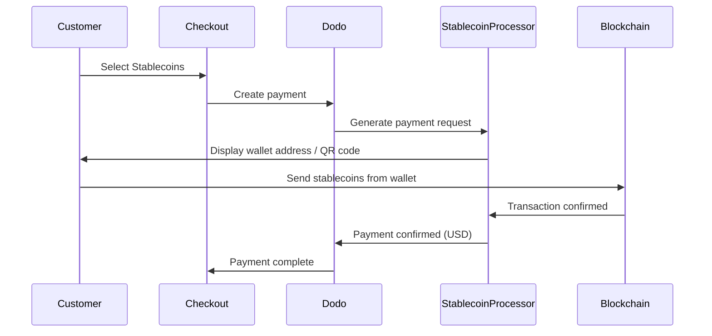

稳定币支付允许客户使用稳定币在世界任何地方支付（印度除外）。交易以美元结算，因此您获得法定货币，而顾客可以用他们首选的稳定币钱包支付。

## 为什么提供稳定币？

<CardGroup cols={3}>
<Card title="Global Reach" icon="globe">
接受来自任何国家的支付——客户不需要银行基础设施。
</Card>

<Card title="No Chargebacks" icon="shield-check">
稳定币交易是不可逆的，彻底消除了退款欺诈。
</Card>

<Card title="USD Settlement" icon="dollar-sign">
您收到美元——无需管理波动性或钱包。
</Card>
</CardGroup>

## 概述

| 详情 | 值 |
| :----- | :---- |
| **结算货币** | USD |
| **支持的国家** | 全球（不含印度） |
| **订阅** | 否 |
| **最低金额** | $0.50 |
| **结算** | USD |

## 如何运作



## 客户体验

1. 客户在结账时选择稳定币
2. 显示钱包地址和二维码，以及稳定币金额
3. 客户从他们的稳定币钱包发送确切金额
4. 交易在区块链上确认
5. 客户被重定向到成功页面

<Info>
稳定币支付以美元结算。结账时显示的稳定币金额反映付款时的实时汇率。
</Info>

## 支持的货币和网络

| 货币 | 网络 |
| :------- | :------- |
| **USDC** | 以太坊, Solana, Polygon, Base |
| **USDP** | 以太坊, Solana |
| **USDG** | 以太坊 |

## 配置

```javascript
const session = await client.checkoutSessions.create({
  product_cart: [{ product_id: 'prod_123', quantity: 1 }],
  allowed_payment_method_types: ['crypto_currency', 'credit', 'debit'],
  return_url: 'https://example.com/success'
});
```

## API 方法类型

| 类型 | 方法 | 国家 |
| :--- | :----- | :------ |
| `crypto` | 稳定币 | 全球（不含印度） |

## 测试

<Steps>
<Step title="Enable test mode">
使用您的 Dodo Payments 测试 API 密钥。
</Step>

<Step title="Create a test checkout">
在允许的支付方法中创建一个结账会话，包含 `crypto`。
</Step>

<Step title="Complete the test flow">
在测试环境中遵循模拟的稳定币支付流程。
</Step>
</Steps>

## 最佳实践

<AccordionGroup>
<Accordion title="Always include card fallbacks">
并非所有客户都有稳定币钱包。始终包含 `credit` 和 `debit` 作为备用付款方式。
</Accordion>

<Accordion title="Set clear expectations on confirmation time">
区块链确认可能需要几分钟，具体取决于网络。确保您的结账过程与客户沟通这一点。
</Accordion>

<Accordion title="Handle underpayments and overpayments">
由于网络费用，稳定币支付可能偶尔与确切金额略有不同。监控网络钩子以获取付款状态更新。
</Accordion>
</AccordionGroup>

## 故障排除

<AccordionGroup>
<Accordion title="Stablecoins not appearing at checkout">
**检查：**
1. `crypto` 是否包含在 `allowed_payment_method_types` 中？
2. 交易金额是否达到最低（$0.50）？

**解决方案：** 验证支付方法类型在您的 API 请求中是否正确传递。
</Accordion>

<Accordion title="Payment not confirming">
**原因：** 区块链确认时间不同。某些网络的速度比其他网络更慢。

**解决方案：** 等待网络钩子确认。在确认窗口结束之前，不要将付款视为失败。
</Accordion>

<Accordion title="Amount mismatch">
**原因：** 网络费用可能导致收到的金额与请求金额略有不同。

**解决方案：** 监控网络钩子以获取最终确认金额。小的差异会自动处理。
</Accordion>
</AccordionGroup>

## 相关页面

<CardGroup cols={2}>
<Card title="Payment Methods Overview" icon="credit-card" href="/features/payment-methods">
查看所有支持的支付方法。
</Card>

<Card title="Checkout Guide" icon="book" href="/developer-resources/checkout-session">
完整的结账实施指南。
</Card>

<Card title="Webhooks" icon="webhook" href="/developer-resources/webhooks">
异步处理支付确认。
</Card>

<Card title="Testing Process" icon="flask" href="/miscellaneous/testing-process">
所有支付方法的完整测试指南。
</Card>
</CardGroup>
