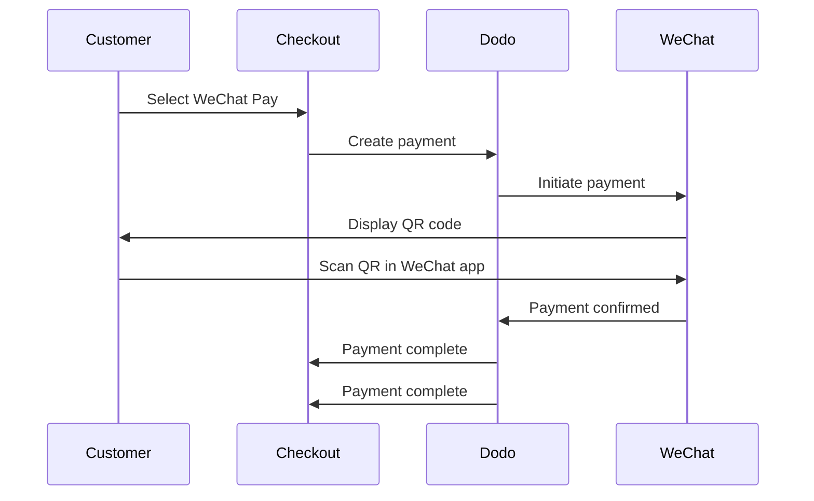

微信支付是中国两大主流移动支付平台之一，拥有超过十亿用户。它通过微信应用内的二维码实现支付，对于针对中国消费者的企业来说至关重要。

## 为什么提供微信支付？

<CardGroup cols={3}>
<Card title="1B+ Users" icon="users">
微信支付拥有超过十亿用户，是全球最大的支付平台之一。
</Card>

<Card title="Mobile-First" icon="mobile">
支付完全在微信应用内完成，对于中国客户而言快速、熟悉且无缝。
</Card>

<Card title="Dual Currency" icon="money-bill-transfer">
接受美元和人民币支付，为跨境和国内交易提供灵活性。
</Card>
</CardGroup>

## 概述

| 细节 | 值 |
| :----- | :---- |
| **结算货币** | 美元, 人民币 |
| **订阅** | 无 |
| **最低金额** | $0.50 / ¥1.00 |
| **结算** | 美元 |

## 工作原理



## 客户体验

1. 客户在结账时选择微信支付
2. 结账页面显示二维码
3. 客户在手机上打开微信并扫描二维码
4. 客户在微信应用中确认支付
5. 支付立即确认，客户被重定向到成功页面

<Info>
客户用美元或人民币支付，您按美元结算。
</Info>

## 配置

```javascript
const session = await client.checkoutSessions.create({
  product_cart: [{ product_id: 'pdt_123', quantity: 1 }],
  allowed_payment_method_types: ['we_chat_pay', 'credit', 'debit'],
  return_url: 'https://example.com/success'
});
```

## API 方法类型

| 类型 | 方法 | 货币 |
| :--- | :----- | :--------- |
| `we_chat_pay` | 微信支付 | 美元, 人民币 |

## 测试

<Steps>
<Step title="Enable test mode">
使用您的 Dodo Payments 测试 API 密钥。
</Step>

<Step title="Create a test checkout">
在允许的支付方式中创建一个结账会话，使用 `we_chat_pay`。
</Step>

<Step title="Scan the QR code">
将生成一个测试二维码——用您的普通手机相机扫描它（不需要微信应用）。您将被重定向到一个测试页面，在那里您可以模拟交易的成功或失败。
</Step>
</Steps>

## 最佳实践

<AccordionGroup>
<Accordion title="Target Chinese customers">
微信支付主要由中国消费者使用。当客户群体包括中国买家或您正面向中国市场时，加入微信支付。
</Accordion>

<Accordion title="Always include card fallbacks">
并非所有客户都拥有微信。始终包括 `credit` 和 `debit` 作为备用支付方式。
</Accordion>

<Accordion title="Optimize for mobile">
许多微信支付用户在手机上浏览。确保您的结账页面具有响应性——二维码扫描效果最好时，结账显示在桌面或平板上，客户用手机扫描。
</Accordion>

<Accordion title="Consider both currencies">
微信支付支持美元和人民币。选择最适合目标市场的结算货币——跨境交易使用美元，国内中国交易使用人民币。
</Accordion>
</AccordionGroup>

## 故障排除

<AccordionGroup>
<Accordion title="WeChat Pay not appearing at checkout">
**检查：**
1. `we_chat_pay` 包含在 `allowed_payment_method_types` 中？
2. 结算货币设置为美元或人民币？
3. 交易金额符合最低要求？

**解决方案：**验证支付方法类型和货币在您的 API 请求中正确传递。
</Accordion>

<Accordion title="QR code not scanning">
**原因：**二维码可能已过期，或者客户的微信版本过时。

**解决方案：**刷新结账页面以生成新的二维码。确保客户使用的是最新版本的微信。
</Accordion>

<Accordion title="Payment not confirming">
**原因：**微信支付通常会立即确认，但可能会发生网络延迟。

**解决方案：**监控网络钩子以确认支付。如果支付在几分钟内没有确认，客户可能需要重新尝试。
</Accordion>
</AccordionGroup>

## 相关页面

<CardGroup cols={2}>
<Card title="Payment Methods Overview" icon="credit-card" href="/features/payment-methods">
查看所有支持的支付方式。
</Card>

<Card title="Checkout Guide" icon="book" href="/developer-resources/checkout-session">
完整的结账实现指南。
</Card>

<Card title="Webhooks" icon="webhook" href="/developer-resources/webhooks">
异步处理支付确认。
</Card>

<Card title="Testing Process" icon="flask" href="/miscellaneous/testing-process">
所有支付方式的完整测试指南。
</Card>
</CardGroup>
