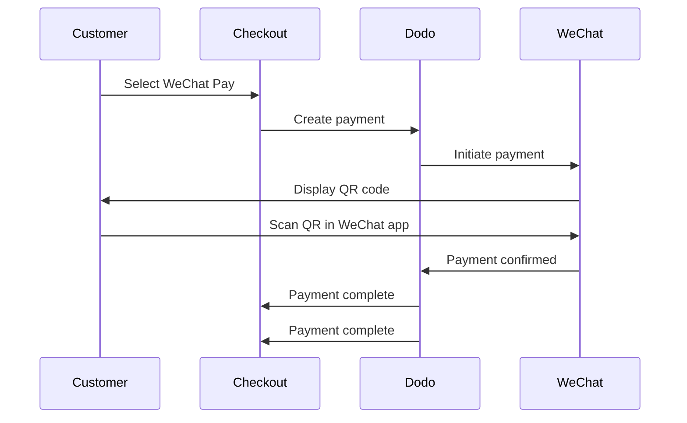

微信支付是中国两大主流移动支付平台之一，拥有超过十亿用户。它通过微信应用内的二维码进行支付，对于目标中国消费者的企业来说至关重要。

## 为什么提供微信支付？

WeChat Pay is used by over a billion people, making it one of the world's largest payment platforms.

Payments are completed entirely within the WeChat app — fast, familiar, and frictionless for Chinese customers.

Accept payments in both USD and CNY, giving flexibility for cross-border and domestic transactions.

## 概述

| 详情 | 值 |
| :----- | :---- |
| **结算货币** | USD, CNY |
| **订阅** | No |
| **最低金额** | $0.50 / ¥1.00 |
| **结算** | USD |

## 工作原理



## 客户体验

1. 客户在结账时选择微信支付
2. 结账页面会显示一个二维码
3. 客户用手机打开微信并扫描二维码
4. 客户在微信应用中确认支付
5. 支付即时确认，客户被重定向到成功页面

Customers pay in USD or CNY, and you receive settlement in USD.

## 配置

```javascript
const session = await client.checkoutSessions.create({
  product_cart: [{ product_id: 'prod_123', quantity: 1 }],
  allowed_payment_method_types: ['wechat_pay', 'credit', 'debit'],
  return_url: 'https://example.com/success'
});
```

## API 方法类型

| 类型 | 方法 | 货币 |
| :--- | :----- | :--------- |
| `wechat_pay` | 微信支付 | 美元，人民币 |

## 测试

Use your Dodo Payments test API keys.

Create a checkout session with `wechat_pay` in the allowed payment methods.

A test QR code will be generated — scan it with your normal phone camera (no WeChat app needed). You'll be redirected to a test page where you can simulate the transaction as a success or failure.

## 最佳实践

WeChat Pay is primarily used by Chinese consumers. Include it when your customer base includes Chinese buyers or you're targeting the Chinese market.

Not all customers have WeChat. Always include `credit` and `debit` as fallback payment methods.

Many WeChat Pay users browse on mobile. Ensure your checkout page is responsive — QR code scanning works best when the checkout is displayed on a desktop or tablet while the customer scans with their phone.

WeChat Pay supports both USD and CNY. Choose the billing currency that best suits your target market — USD for cross-border, CNY for domestic Chinese transactions.

## 故障排除

**检查：**
1. `wechat_pay` included in `allowed_payment_method_types`?
2. 结算货币设置为美元或人民币？
3. 交易金额是否满足最低要求？

**解决方案：** 请验证支付方式类型和货币是否正确传递到您的 API 请求中。

**原因：** 二维码可能已过期，或客户的微信版本已过期。

**解决方案：** 刷新结账页面以生成新的二维码。确保客户使用的是微信的当前版本。

**原因：** 微信支付通常会立即确认，但网络延迟可能会发生。

**解决方案：** 监控网络钩子以确认支付。如果支付在几分钟内未确认，客户可能需要重试。

## 相关页面

See all supported payment methods.

Complete checkout implementation guide.

Handle payment confirmations asynchronously.

Complete testing guide for all payment methods.
