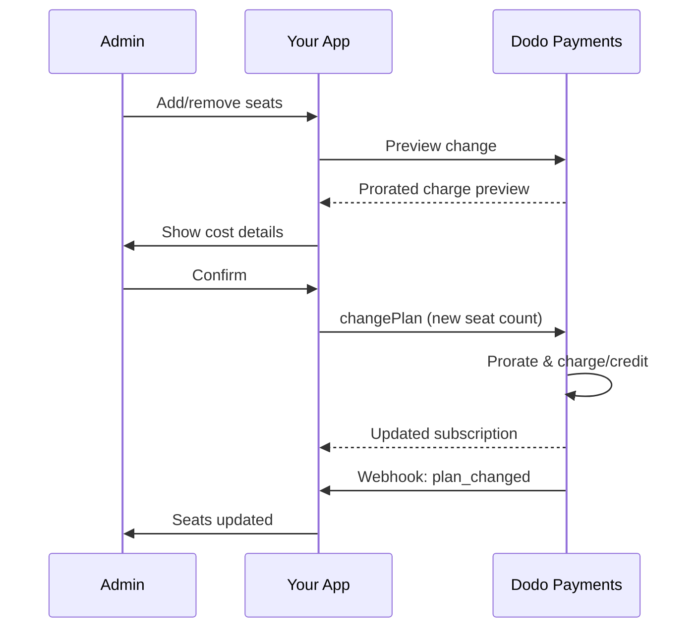

<Info>
基于席位的计费允许您根据客户需要的用户、团队成员或许可证数量收费。它是团队协作工具、企业软件和B2B SaaS产品的标准定价模型。
</Info>

 <CardGroup cols={2}>
<Card title="Implementation Tutorial" icon="code" href="/developer-resources/seat-based-pricing">
  含代码示例的分步指南。
</Card>

 <Card title="Add-ons Documentation" icon="puzzle" href="/features/addons">
  了解支持基于席位计费的附加系统。
</Card>

 <Card title="Subscription Management" icon="repeat" href="/features/subscription">
  管理基于席位的订阅和计划变更。
</Card>

 <Card title="Webhooks" icon="bell" href="/developer-resources/webhooks/intents/subscription">
  通过订阅webhooks跟踪席位变化。
</Card>
</CardGroup>

---

## 什么是基于席位的计费？

基于席位的计费（也称为按用户或按席位定价）根据访问产品的用户数量对客户收费。价格随团队规模增长，而不是固定费用。

### 常见使用场景

| 行业 | 示例 | 定价模型 |
|----------|---------|---------------|
| 团队协作 | Slack, Notion, Asana | 每活跃用户/月 |
| 开发者工具 | GitHub, GitLab, Jira | 每席位/月 |
| CRM软件 | Salesforce, HubSpot | 每用户许可证 |
| 设计工具 | Figma, Canva | 每编辑席位 |
| 安全软件 | 1Password, Okta | 每用户/月 |
| 视频会议 | Zoom, Teams | 每主持许可证 |

### 基于席位定价的好处

**对您的业务：**
- 收入随客户增长自然增加
- 可预测的定价便于客户预算
- 从个人到团队再到企业的明确升级路径
- 随着团队的扩展，更高的用户终生价值

**对您的客户：**
- 仅为使用的部分付费
- 易于理解和预测成本
- 灵活添加/删除用户
- 符合团队规模的公平定价

---

## Dodo Payments中的基于席位的计费如何运作

Dodo Payments使用**附加系统**来实现基于席位的计费。其工作原理如下：

### 架构概述

团队专业订阅费用为$99/月，包含5个席位。如果您有超过5个用户，每额外一个席位则需支付$15/月。

例如，如果您的团队需要15个席位：
- 基本计划：$99/月（包括5个席位）
- 附加项：10个额外席位 × $15/月 = $150/月
- 总月费用：$99 + $150 = $249 对于15个席位

### 关键组件

| 组件 | 目的 | 示例 |
|-----------|---------|---------|
| 基本产品 | 包含席位的核心订阅 | "团队计划 - $99/月（包含5个席位）" |
| 席位附加项 | 额外用户的每席位收费 | "额外席位 - $15/月每个" |
| 数量 | 购买的额外席位数量 | 10个额外席位 |

---

## 定价策略

选择适合您业务的基于席位的定价策略：

### 策略1：基础+每席位附加项

在基础计划中包含一定数量的席位，额外席位收费。

**示例：**

```
Starter Plan: $49/month
├── Includes: 3 seats
├── Extra seats: $10/month each
└── 8 total seats = $49 + (5 × $10) = $99/month
```

**最佳选择：** 小团队可以使用基础产品功能的产品。

### 策略2：纯按席位定价

每席位收费，无基础费用。

**示例：**

```
Per User: $12/month
├── 5 users = $60/month
├── 20 users = $240/month
└── 100 users = $1,200/month
```

**实现：** 将基础计划价格设置为$0，仅使用席位附加项。

**最佳选择：** 简单、透明的定价；基于使用的模型。

### 策略3：阶梯式定价

不同的基本计划具有不同的每席位费率。

**示例：**

```
Starter: $0/month base + $15/seat
├── Lower features, higher per-seat cost

Professional: $99/month base + $10/seat
├── More features, lower per-seat cost

Enterprise: $499/month base + $7/seat
└── All features, volume discount on seats
```

**实现：** 为每个等级创建不同的产品并设定不同的附加价格。

**最佳选择：** 鼓励升级到更高等级；企业销售。

### 策略4：席位捆绑

以包形式出售席位，而不是单独出售。

**示例：**

```
5-Seat Pack: $50/month ($10/seat)
10-Seat Pack: $80/month ($8/seat)
25-Seat Pack: $175/month ($7/seat)
```

**实现：** 为不同的包大小创建多个附加项。

**最佳选择：** 简化购买决策；鼓励更大承诺。

---

## 设置基于席位的计费

### 步骤1：规划您的定价

在实施之前，定义您的定价结构：

 <Steps>
 <Step title="Define Base Plan">
决定基础订阅包括哪些内容：
- 基本价格（纯按席位可为$0）
- 所含席位数量
- 此级别可用的功能
 </Step>

 <Step title="Set Seat Pricing">
确定每席位附加项的成本：
- 每个额外席位的价格
- 任何批量折扣（通过多个附加项）
- 最大允许席位数（如果适用）
 </Step>

 <Step title="Consider Billing Frequency">
将席位定价与您的计费周期对齐：
- 每月订阅 → 每月席位费
- 每年订阅 → 每年席位费（通常享受折扣）
 </Step>
 </Steps>

### 步骤2：创建席位附加项

在您的Dodo Payments仪表板中：

1. 转到**产品** → **附加项**
2. 点击**创建附加项**
3. 配置附加项：

| 字段 | 值 | 备注 |
|-------|-------|-------|
| 名称 | "额外席位"或"团队成员" | 清晰的用户友好名称 |
| 描述 | "在您的工作空间中添加另一个团队成员" | 解释客户获得的内容 |
| 价格 | 您的每席位价格 | 例如，$10.00 |
| 货币 | 与您的基础产品匹配 | 必须为同一货币 |
| 税务类别 | 与基础产品相同 | 确保税务处理的一致性 |

 <Tip>
创建在发票上显得明晰的附加项名称。"额外团队席位"比"席位附加项"对查看账单的客户更为直观。
 </Tip>

### 步骤3：创建基础订阅

创建您的订阅产品：

1. 转到**产品** → **创建产品**
2. 选择**订阅**
3. 配置定价和详细信息
4. 在**附加项**部分，附加您的席位附加项

### 步骤4：将附加项附加到产品

将席位附加项链接到您的订阅：

1. 编辑您的订阅产品
2. 滚动到**附加项**部分
3. 点击**添加附加项**
4. 选择您的席位附加项
5. 保存更改

 <Check>
您的订阅产品现在支持基于席位的定价。在结帐时，客户可以购买任意数量的额外席位。
 </Check>

---

## 管理席位

### 向新订阅添加席位

创建结帐会话时，指定席位数量：

```typescript
const session = await client.checkoutSessions.create({
  product_cart: [{
    product_id: 'prod_team_plan',
    quantity: 1,
    addons: [{
      addon_id: 'addon_seat',
      quantity: 10  // 10 additional seats
    }]
  }],
  customer: { email: 'admin@company.com' },
  return_url: 'https://yourapp.com/success'
});
```

### 更改现有订阅的席位数

使用更改计划API 调整席位：

```typescript
// Add 5 more seats to existing subscription
await client.subscriptions.changePlan('sub_123', {
  product_id: 'prod_team_plan',
  quantity: 1,
  proration_billing_mode: 'prorated_immediately',
  addons: [{
    addon_id: 'addon_seat',
    quantity: 15  // New total: 15 additional seats
  }]
});
```

### 移除席位

要减少席位数，指定较低的数量：

```typescript
// Reduce from 15 to 8 additional seats
await client.subscriptions.changePlan('sub_123', {
  product_id: 'prod_team_plan',
  quantity: 1,
  proration_billing_mode: 'difference_immediately',
  addons: [{
    addon_id: 'addon_seat',
    quantity: 8  // Reduced to 8 additional seats
  }]
});
```

### 移除所有附加席位

传递一个空的附加项数组以移除所有附加项：

```typescript
// Remove all additional seats, keep only base plan seats
await client.subscriptions.changePlan('sub_123', {
  product_id: 'prod_team_plan',
  quantity: 1,
  proration_billing_mode: 'difference_immediately',
  addons: []  // Removes all add-ons
});
```

---

## 变更席位的按比例分配

当客户在周期中途添加或移除席位时，按比例确定如何收费。



### 拟合模式

| 模式 | 添加席位 | 移除席位 | 计费周期 |
|------|-------------|----------------|---------------|
| `prorated_immediately` | 收取周期内剩余天数的费用 | 未使用天数的抵扣 |
| `difference_immediately` | 收取全额席位费用 | 抵扣入未来续费 |
| `full_immediately` | 收取全额席位费用 | 无抵扣 |
| `do_not_bill` | 加入席位，不收费 | 移除席位，无抵扣 |


 <Warning>

`prorated_immediately`、`difference_immediately`和`full_immediately`全部**将计费周期重置为变更日期**—下次续费重新锚定至应用席位变更的日期。只有**`do_not_bill`**保留原始续费日期（新的席位数在下次续费时全额计费，在变更时不收取费用）。
 </Warning>

### 拟合示例

**场景：剩余15天计费周期，新增5个席位，每席位$10**

 <Tabs>
 <Tab title="prorated_immediately">

```
Prorated charge = ($10 × 5 seats) × (15 days / 30 days)
                = $50 × 0.5
                = $25 immediate charge
Billing cycle resets to today
```

客户立即支付按比例费用，并且计费周期重新锚定到变更日期—下次续费（为新增席位支付$50/月）从今天的一个周期后开始，而不是从原始续费日期开始。
 </Tab>

 <Tab title="difference_immediately">

```
Immediate charge = $10 × 5 seats = $50
Billing cycle resets to today
```

无论周期位置如何，客户立即支付全额席位费用，并且计费周期重新锚定到变更日期。
 </Tab>

 <Tab title="full_immediately">

```
Immediate charge = Full subscription + add-ons
Billing cycle resets to today
```

客户支付全额，新计费周期开始。
 </Tab>

 <Tab title="do_not_bill">

```
Immediate charge = $0
Billing cycle unchanged
```

席位立即增加，变更时不收费。保留原续费日期，并在下次续费时按新的席位数全额计费。当您需要保持现有计费周期时使用此模式。
 </Tab>
 </Tabs>

**场景：在周期中途移除3个席位，采用prorated_immediately**

```
Current: Team Plan ($99/month) + 10 extra seats × $10/seat = $199/month
Change: Remove 3 seats (10 → 7 extra seats) on day 20 of 30-day cycle
Remaining: 10 days

Credit for removed seats:
  = ($10 × 3 seats) × (10 days / 30 days)
  = $30 × 0.333
  = $10.00 credit

→ $10.00 credit added to subscription
→ Next renewal: $99 + (7 × $10) = $169.00/month
→ Credit auto-applies: $169.00 − $10.00 = $159.00 on next invoice
```

 <Tip>
**为席位变更选择按比例模式**：经常调整席位时，使用`prorated_immediately`以实现公平的日均计费。使用`difference_immediately`以简单的数学方式收取或扣减全额席位价格。如果需要保持不变的续费日期，请使用`do_not_bill` —唯一不重置计费周期的模式（新席位数将在下次续费时计费）。有关详细比较，请参阅[拟合指南](/developer-resources/subscription-upgrade-downgrade#proration-modes)。
 </Tip>

### 变更前预览

在变更前始终预览拟合：

```typescript
const preview = await client.subscriptions.previewChangePlan('sub_123', {
  product_id: 'prod_team_plan',
  quantity: 1,
  proration_billing_mode: 'prorated_immediately',
  addons: [{ addon_id: 'addon_seat', quantity: 20 }]
});

console.log('Immediate charge:', preview.immediate_charge.summary);
// Show customer: "Adding 5 seats will cost $25 today"
```

---

## 使用Webhooks跟踪席位

通过监听订阅webhooks来监控席位变动：

### 相关事件

| 事件 | 触发时间 | 用例 |
|-------|----------------|----------|
| `subscription.active` | 新订阅激活 | 配置初始席位 |
| `subscription.plan_changed` | 添加/移除席位 | 更新应用中的席位数 |
| `subscription.renewed` | 订阅续费 | 确认席位数未变 |
| `subscription.cancelled` | 订阅取消 | 解除所有席位的配置 |

### Webhook处理示例

```typescript
app.post('/webhooks/dodo', async (req, res) => {
  const event = req.body;

  switch (event.type) {
    case 'subscription.active':
      // New subscription - provision seats
      const seats = calculateTotalSeats(event.data);
      await provisionSeats(event.data.customer_id, seats);
      break;

    case 'subscription.plan_changed':
      // Seats changed - update access
      const newSeats = calculateTotalSeats(event.data);
      await updateSeatCount(event.data.subscription_id, newSeats);
      break;

    case 'subscription.cancelled':
      // Subscription cancelled - deprovision
      await deprovisionAllSeats(event.data.subscription_id);
      break;
  }

  res.json({ received: true });
});

function calculateTotalSeats(subscriptionData) {
  const baseSeats = 5;  // Included in plan
  const addonSeats = subscriptionData.addons?.reduce(
    (total, addon) => total + addon.quantity, 0
  ) || 0;
  return baseSeats + addonSeats;
}
```

---

## 实施席位限制

您的应用程序必须实施席位限制。Dodo Payments负责计费，但您需要控制访问。

### 实施策略

 <Tabs>
 <Tab title="Hard Limit">
严格禁止添加超出席位数的用户。

```typescript
async function inviteUser(teamId: string, email: string) {
  const team = await getTeam(teamId);
  const subscription = await getSubscription(team.subscriptionId);
  const totalSeats = calculateTotalSeats(subscription);
  const usedSeats = await countTeamMembers(teamId);

  if (usedSeats >= totalSeats) {
    throw new Error('No seats available. Please upgrade your plan.');
  }

  await sendInvitation(teamId, email);
}
```

 </Tab>

 <Tab title="Soft Limit with Warning">
允许超出警告和宽限期。

```typescript
async function inviteUser(teamId: string, email: string) {
  const team = await getTeam(teamId);
  const { totalSeats, usedSeats } = await getSeatInfo(team);

  if (usedSeats >= totalSeats) {
    // Allow but flag for billing
    await flagOverage(teamId, usedSeats - totalSeats + 1);
    await notifyAdmin(team.adminEmail, 'You have exceeded your seat limit');
  }

  await sendInvitation(teamId, email);
}
```

 </Tab>

 <Tab title="Auto-Upgrade">
自动在达到限制时增加席位。

```typescript
async function inviteUser(teamId: string, email: string) {
  const team = await getTeam(teamId);
  const { totalSeats, usedSeats, subscriptionId } = await getSeatInfo(team);

  if (usedSeats >= totalSeats) {
    // Automatically add a seat
    await client.subscriptions.changePlan(subscriptionId, {
      product_id: team.productId,
      quantity: 1,
      proration_billing_mode: 'prorated_immediately',
      addons: [{ addon_id: 'addon_seat', quantity: totalSeats - baseSeats + 1 }]
    });

    await notifyAdmin(team.adminEmail, 'A new seat was added to your plan');
  }

  await sendInvitation(teamId, email);
}
```

 </Tab>
 </Tabs>

---

## 高级模式

### 不同的席位类型

提供不同的席位类型并有不同定价：

```
Full Seats: $20/month - Full access to all features
View-Only Seats: $5/month - Read-only access
Guest Seats: $0/month - Limited external collaborator access
```

**实施：** 为每种席位类型创建单独的附加项。

```typescript
const session = await client.checkoutSessions.create({
  product_cart: [{
    product_id: 'prod_team_plan',
    quantity: 1,
    addons: [
      { addon_id: 'addon_full_seat', quantity: 10 },
      { addon_id: 'addon_viewer_seat', quantity: 25 },
      { addon_id: 'addon_guest_seat', quantity: 50 }
    ]
  }]
});
```

### 年度席位折扣

提供折扣的年度席位定价：

```
Monthly: $15/seat/month
Annual: $12/seat/month (20% savings)
```

**实施：** 为月度和年度套餐创建不同产品并设置不同的附加价格。

### 最低席位要求

对某些计划要求最小席位数：

```typescript
async function validateSeatCount(planId: string, seatCount: number) {
  const minimums = {
    'prod_starter': 1,
    'prod_team': 5,
    'prod_enterprise': 25
  };

  if (seatCount < minimums[planId]) {
    throw new Error(`${planId} requires at least ${minimums[planId]} seats`);
  }
}
```

---

## 最佳实践

### 定价最佳实践

- **清晰沟通**：在您的定价页面上突出显示每席位定价
- **包含席位数**：考虑在基础价格中包含几个席位以减少阻力
- **批量折扣**：为较大团队提供更低的每席位费率以赢得企业订单
- **年度激励**：折扣年度计划以改进现金流和保留

### 技术最佳实践

- **缓存席位数**：在本地缓存订阅席位数以避免每次请求时API调用
- **定期同步**：通过API定期与Dodo Payments同步本地席位数
- **处理失败**：如果席位变更失败，显示明确的错误信息和重试选项
- **审计跟踪**：记录所有席位变更以便于计费争议和合规性

### 用户体验最佳实践

- **实时反馈**：在调整席位时显示即时成本影响
- **确认步骤**：在更改计费前要求确认
- **按比例透明**：在应用前明确说明按比例费用
- **轻松降级**：不要使减少席位变得困难（这能建立信任）

---

## 疑难解答

 <AccordionGroup>
 <Accordion title="Seat count mismatch between app and billing">
**症状**：您的应用显示的席位数与订阅中的不同。

**原因**：
- 未收到或处理webhook
- 席位变更期间的竞争条件
- 缓存数据未更新

**解决方案**：
1. 为`subscription.plan_changed`实现webhook处理程序
2. 添加一个"同步与计费"按钮以获取当前订阅
3. 设置缓存TTL以确保定期刷新
 </Accordion>

 <Accordion title="Proration charges unexpected">
**症状**：客户对周期中期的收费金额感到困惑。

**原因**：
- 未明确传达拟合模式
- 客户在确认前未看到预览

**解决方案**：
1. 在变更前始终使用`previewChangePlan`
2. 显示清晰的细分："添加X个席位 = 今日$Y（按比例计Z天）"
3. 在帮助中心记录您的拟合政策
 </Accordion>

 <Accordion title="Add-on not appearing in checkout">
**症状**：在结帐时席位附加项不可用。

**原因**：
- 附加项未附加到产品
- 附加项已存档或删除
- 产品和附加项的货币不匹配

**解决方案**：
1. 验证附加项是否附加在产品设置中
2. 检查附加项在附加项仪表板中的状态
3. 确保货币完全匹配
 </Accordion>

 <Accordion title="Cannot reduce seats below current usage">
**症状**：客户希望减少席位但分配有用户。

**解决方案**：
1. 显示在减少席位前必须移除的用户
2. 实现工作流程：移除用户 → 减少席位
3. 考虑在执行席位减少前给予宽限期
 </Accordion>
 </AccordionGroup>

---

## 相关文档

 <CardGroup cols={2}>
 <Card title="Seat-Based Pricing Tutorial" icon="code" href="/developer-resources/seat-based-pricing">
  完整的实施指南与代码示例。
 </Card>

 <Card title="Add-ons" icon="puzzle" href="/features/addons">
  深入了解附加系统。
 </Card>

 <Card title="Plan Changes & Proration" icon="arrows-rotate" href="/developer-resources/subscription-upgrade-downgrade">
  处理订阅修改。
 </Card>

 <Card title="Subscription Webhooks" icon="bell" href="/developer-resources/webhooks/intents/subscription">
  跟踪订阅事件。
 </Card>
 </CardGroup>