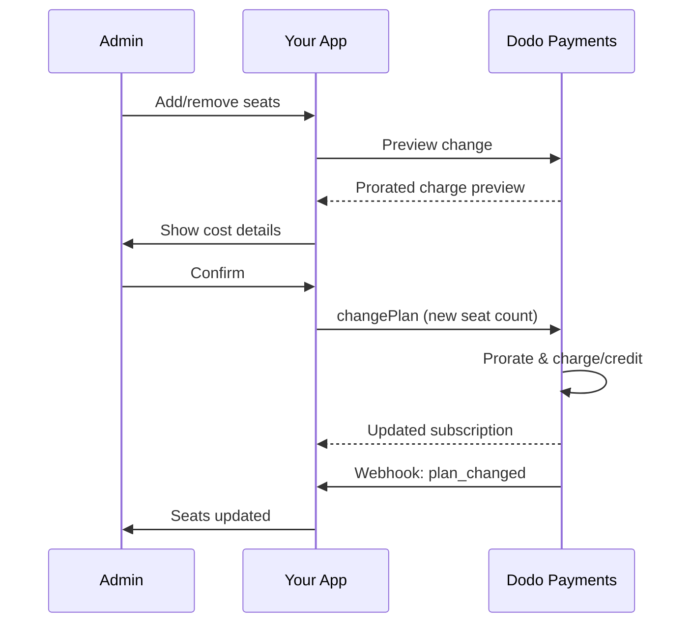

<Info>
Seat-based billing lets you charge customers based on the number of users, team members, or licenses they need. It's the standard pricing model for team collaboration tools, enterprise software, and B2B SaaS products.
</Info>

<CardGroup cols={2}>
<Card title="Implementation Tutorial" icon="code" href="/developer-resources/seat-based-pricing">
  Step-by-step guide with code examples.
</Card>

<Card title="Add-ons Documentation" icon="puzzle" href="/features/addons">
  Learn about the add-on system that powers seat-based billing.
</Card>

<Card title="Subscription Management" icon="repeat" href="/features/subscription">
  Manage seat-based subscriptions and plan changes.
</Card>

<Card title="Webhooks" icon="bell" href="/developer-resources/webhooks/intents/subscription">
  Track seat changes with subscription webhooks.
</Card>
</CardGroup>

---

## What is Seat-Based Billing?

Seat-based billing (also called per-user or per-seat pricing) charges customers based on the number of users who access your product. Instead of a flat fee, the price scales with team size.

### Common Use Cases

| Industry | Example | Pricing Model |
|----------|---------|---------------|
| Team Collaboration | Slack, Notion, Asana | Per active user/month |
| Developer Tools | GitHub, GitLab, Jira | Per seat/month |
| CRM Software | Salesforce, HubSpot | Per user license |
| Design Tools | Figma, Canva | Per editor seat |
| Security Software | 1Password, Okta | Per user/month |
| Video Conferencing | Zoom, Teams | Per host license |

### Benefits of Seat-Based Pricing

**For Your Business:**
- Revenue scales naturally as customers grow
- Predictable pricing customers can budget for
- Clear upgrade path from individual to team to enterprise
- Higher lifetime value as teams expand

**For Your Customers:**
- Pay only for what they use
- Easy to understand and forecast costs
- Flexibility to add/remove users as needed
- Fair pricing that matches team size

---

## How Seat-Based Billing Works in Dodo Payments

Dodo Payments implements seat-based billing using the **Add-ons** system. Here's how it works:

### Architecture Overview

A Team Pro subscription costs $99/month and includes 5 seats. If you have more than 5 users, you pay an additional $15/month for each extra seat. 

For example, if your team needs 15 seats:
- Base Plan: $99/month (includes 5 seats)
- Add-ons: 10 extra seats × $15/month = $150/month
- Total monthly cost: $99 + $150 = $249 for 15 seats

### Key Components

| Component | Purpose | Example |
|-----------|---------|---------|
| Base Product | Core subscription with included seats | "Team Plan - $99/month (5 seats included)" |
| Seat Add-on | Per-seat charge for additional users | "Extra Seat - $15/month each" |
| Quantity | Number of additional seats purchased | 10 extra seats |

---

## Pricing Strategies

Choose the seat-based pricing strategy that fits your business:

### Strategy 1: Base + Per-Seat Add-on

Include a set number of seats in the base plan, charge for additional seats.

**Example:**

```
Starter Plan: $49/month
├── Includes: 3 seats
├── Extra seats: $10/month each
└── 8 total seats = $49 + (5 × $10) = $99/month
```

**Best for:** Products where small teams can function with the base offering.

### Strategy 2: Pure Per-Seat Pricing

Charge a flat rate per seat with no base fee.

**Example:**

```
Per User: $12/month
├── 5 users = $60/month
├── 20 users = $240/month
└── 100 users = $1,200/month
```

**Implementation:** Set base plan price to $0, use only the seat add-on.

**Best for:** Simple, transparent pricing; usage-based models.

### Strategy 3: Tiered Seat Pricing

Different base plans with different per-seat rates.

**Example:**

```
Starter: $0/month base + $15/seat
├── Lower features, higher per-seat cost

Professional: $99/month base + $10/seat
├── More features, lower per-seat cost

Enterprise: $499/month base + $7/seat
└── All features, volume discount on seats
```

**Implementation:** Create separate products for each tier with different add-on prices.

**Best for:** Encouraging upgrades to higher tiers; enterprise sales.

### Strategy 4: Seat Bundles

Sell seats in packs rather than individually.

**Example:**

```
5-Seat Pack: $50/month ($10/seat)
10-Seat Pack: $80/month ($8/seat)
25-Seat Pack: $175/month ($7/seat)
```

**Implementation:** Create multiple add-ons for different pack sizes.

**Best for:** Simplifying purchasing decisions; encouraging larger commitments.

---

## Setting Up Seat-Based Billing

### Step 1: Plan Your Pricing

Before implementation, define your pricing structure:

<Steps>
<Step title="Define Base Plan">
Decide what's included in the base subscription:
- Base price (can be $0 for pure per-seat)
- Number of included seats
- Features available at this tier
</Step>

<Step title="Set Seat Pricing">
Determine the per-seat add-on cost:
- Price per additional seat
- Any volume discounts (via multiple add-ons)
- Maximum seats allowed (if applicable)
</Step>

<Step title="Consider Billing Frequency">
Align seat pricing with your billing cycle:
- Monthly subscriptions → monthly seat charges
- Annual subscriptions → annual seat charges (often discounted)
</Step>
</Steps>

### Step 2: Create the Seat Add-on

In your Dodo Payments dashboard:

1. Navigate to **Products** → **Add-Ons**
2. Click **Create Add-On**
3. Configure the add-on:

| Field | Value | Notes |
|-------|-------|-------|
| Name | "Additional Seat" or "Team Member" | Clear, user-friendly name |
| Description | "Add another team member to your workspace" | Explain what customers get |
| Price | Your per-seat price | e.g., $10.00 |
| Currency | Match your base product | Must be the same currency |
| Tax Category | Same as base product | Ensures consistent tax handling |

<Tip>
Create descriptive add-on names that make sense on invoices. "Additional Team Seat" is clearer than "Seat Add-on" for customers reviewing their bills.
</Tip>

### Step 3: Create the Base Subscription

Create your subscription product:

1. Navigate to **Products** → **Create Product**
2. Select **Subscription**
3. Configure pricing and details
4. In the **Add-Ons** section, attach your seat add-on

### Step 4: Attach Add-on to Product

Link the seat add-on to your subscription:

1. Edit your subscription product
2. Scroll to **Add-Ons** section
3. Click **Add Add-Ons**
4. Select your seat add-on
5. Save changes

<Check>
Your subscription product now supports seat-based pricing. Customers can purchase any quantity of additional seats during checkout.
</Check>

---

## Managing Seats

### Adding Seats to New Subscriptions

When creating a checkout session, specify the seat quantity:

```typescript
const session = await client.checkoutSessions.create({
  product_cart: [{
    product_id: 'prod_team_plan',
    quantity: 1,
    addons: [{
      addon_id: 'addon_seat',
      quantity: 10  // 10 additional seats
    }]
  }],
  customer: { email: 'admin@company.com' },
  return_url: 'https://yourapp.com/success'
});
```

### Changing Seat Count on Existing Subscriptions

Use the Change Plan API to adjust seats:

```typescript
// Add 5 more seats to existing subscription
await client.subscriptions.changePlan('sub_123', {
  product_id: 'prod_team_plan',
  quantity: 1,
  proration_billing_mode: 'prorated_immediately',
  addons: [{
    addon_id: 'addon_seat',
    quantity: 15  // New total: 15 additional seats
  }]
});
```

### Removing Seats

To reduce seat count, specify the lower quantity:

```typescript
// Reduce from 15 to 8 additional seats
await client.subscriptions.changePlan('sub_123', {
  product_id: 'prod_team_plan',
  quantity: 1,
  proration_billing_mode: 'difference_immediately',
  addons: [{
    addon_id: 'addon_seat',
    quantity: 8  // Reduced to 8 additional seats
  }]
});
```

### Removing All Additional Seats

Pass an empty addons array to remove all add-ons:

```typescript
// Remove all additional seats, keep only base plan seats
await client.subscriptions.changePlan('sub_123', {
  product_id: 'prod_team_plan',
  quantity: 1,
  proration_billing_mode: 'difference_immediately',
  addons: []  // Removes all add-ons
});
```

---

## Proration for Seat Changes

When customers add or remove seats mid-cycle, proration determines how they're billed.



### Proration Modes

| 模式 | 添加座位 | 移除座位 | 计费周期 |
|------|-------------|----------------|---------------|
| `prorated_immediately` | 收取周期内剩余天数费用 | 未使用天数的信用 | 重置为今天 |
| `difference_immediately` | 收取座位全价 | 将信用应用于未来续订 | 重置为今天 |
| `full_immediately` | 收取座位全价 | 无信用 | 重置为今天 |
| `do_not_bill` | 添加座位，当前不收费 | 移除座位，无信用 | 保持不变 |

<Warning>
`prorated_immediately`、`difference_immediately` 和 `full_immediately` 都会**将计费周期重置为更改日期**——下次续订将重新锚定到座位更改应用的日期。只有 **`do_not_bill`** 保持原始续订日期（新座位数量将在下次续订时全额计费，变更时不收费）。
</Warning>

### 按比例收费示例

**场景：剩余15天计费周期，添加5个座位，每个座位10美元**

<Tabs>
<Tab title="prorated_immediately">

```
Prorated charge = ($10 × 5 seats) × (15 days / 30 days)
                = $50 × 0.5
                = $25 immediate charge
Billing cycle resets to today
```

客户现在支付按比例费用，计费周期重新锚定到更改日期——下次续订（新增座位每月50美元）将从今天起的一周期后收取，而不是从原续订日期起。
</Tab>

<Tab title="difference_immediately">

```
Immediate charge = $10 × 5 seats = $50
Billing cycle resets to today
```

客户现在支付座位全价，无论周期位置如何，计费周期重新锚定到更改日期。
</Tab>

<Tab title="full_immediately">

```
Immediate charge = Full subscription + add-ons
Billing cycle resets to today
```

支付全额，新的计费周期开始。
</Tab>

<Tab title="do_not_bill">

```
Immediate charge = $0
Billing cycle unchanged
```

座位立即添加，变更时不收费。保留原始续订日期，新的座位数量将在下次续订时全额计费。此模式用于需要保持现有计费周期的情况。
</Tab>
</Tabs>

**场景：周期中期删除3个座位，立即按比例收费**

```
Current: Team Plan ($99/month) + 10 extra seats × $10/seat = $199/month
Change: Remove 3 seats (10 → 7 extra seats) on day 20 of 30-day cycle
Remaining: 10 days

Credit for removed seats:
  = ($10 × 3 seats) × (10 days / 30 days)
  = $30 × 0.333
  = $10.00 credit

→ $10.00 credit added to subscription
→ Next renewal: $99 + (7 × $10) = $169.00/month
→ Credit auto-applies: $169.00 − $10.00 = $159.00 on next invoice
```

<Tip>
**选择座位更改的按比例收费模式**：当团队经常调整座位时，使用 `prorated_immediately` 实现按天收费的公平性。使用 `difference_immediately` 进行更简单的数学运算，收取或抵扣座位全价。如果需要保持现有续订日期不变，请使用 `do_not_bill`——唯一不重置计费周期的模式（新座位数量将在下次续订时收费）。请参见 [Proration Guide](/developer-resources/subscription-upgrade-downgrade#proration-modes) 以获取详细比较。
</Tip>

### 更改前的预览

更改前始终预览按比例收费：

```typescript
const preview = await client.subscriptions.previewChangePlan('sub_123', {
  product_id: 'prod_team_plan',
  quantity: 1,
  proration_billing_mode: 'prorated_immediately',
  addons: [{ addon_id: 'addon_seat', quantity: 20 }]
});

console.log('Immediate charge:', preview.immediate_charge.summary);
// Show customer: "Adding 5 seats will cost $25 today"
```

---

## 使用 Webhooks 跟踪座位

通过监听订阅 Webhooks 来监控座位更改：

### 相关事件

| 事件 | 触发时间 | 用例 |
|-------|----------------|----------|
| `subscription.active` | 新订阅激活 | 配备初始座位 |
| `subscription.plan_changed` | 添加/移除座位 | 更新应用程序中的座位数 |
| `subscription.renewed` | 订阅续订 | 确认座位数未变 |
| `subscription.cancelled` | 订阅取消 | 停用所有座位 |

### Webhook 处理程序示例

```typescript
app.post('/webhooks/dodo', async (req, res) => {
  const event = req.body;

  switch (event.type) {
    case 'subscription.active':
      // New subscription - provision seats
      const seats = calculateTotalSeats(event.data);
      await provisionSeats(event.data.customer_id, seats);
      break;

    case 'subscription.plan_changed':
      // Seats changed - update access
      const newSeats = calculateTotalSeats(event.data);
      await updateSeatCount(event.data.subscription_id, newSeats);
      break;

    case 'subscription.cancelled':
      // Subscription cancelled - deprovision
      await deprovisionAllSeats(event.data.subscription_id);
      break;
  }

  res.json({ received: true });
});

function calculateTotalSeats(subscriptionData) {
  const baseSeats = 5;  // Included in plan
  const addonSeats = subscriptionData.addons?.reduce(
    (total, addon) => total + addon.quantity, 0
  ) || 0;
  return baseSeats + addonSeats;
}
```

---

## 强制执行座位限制

您的应用程序必须强制执行座位限制。Dodo Payments 负责计费，但您控制访问权限。

### 执行策略

<Tabs>
<Tab title="Hard Limit">
严格阻止添加超过座位数的用户。

```typescript
async function inviteUser(teamId: string, email: string) {
  const team = await getTeam(teamId);
  const subscription = await getSubscription(team.subscriptionId);
  const totalSeats = calculateTotalSeats(subscription);
  const usedSeats = await countTeamMembers(teamId);

  if (usedSeats >= totalSeats) {
    throw new Error('No seats available. Please upgrade your plan.');
  }

  await sendInvitation(teamId, email);
}
```

</Tab>

<Tab title="Soft Limit with Warning">
允许超出并带有警告和宽限期。

```typescript
async function inviteUser(teamId: string, email: string) {
  const team = await getTeam(teamId);
  const { totalSeats, usedSeats } = await getSeatInfo(team);

  if (usedSeats >= totalSeats) {
    // Allow but flag for billing
    await flagOverage(teamId, usedSeats - totalSeats + 1);
    await notifyAdmin(team.adminEmail, 'You have exceeded your seat limit');
  }

  await sendInvitation(teamId, email);
}
```

</Tab>

<Tab title="Auto-Upgrade">
当达到限制时自动添加座位。

```typescript
async function inviteUser(teamId: string, email: string) {
  const team = await getTeam(teamId);
  const { totalSeats, usedSeats, subscriptionId } = await getSeatInfo(team);

  if (usedSeats >= totalSeats) {
    // Automatically add a seat
    await client.subscriptions.changePlan(subscriptionId, {
      product_id: team.productId,
      quantity: 1,
      proration_billing_mode: 'prorated_immediately',
      addons: [{ addon_id: 'addon_seat', quantity: totalSeats - baseSeats + 1 }]
    });

    await notifyAdmin(team.adminEmail, 'A new seat was added to your plan');
  }

  await sendInvitation(teamId, email);
}
```

</Tab>
</Tabs>

---

## 高级模式

### 不同类型的座位

提供不同定价的座位类型：

```
Full Seats: $20/month - Full access to all features
View-Only Seats: $5/month - Read-only access
Guest Seats: $0/month - Limited external collaborator access
```

**实现：** 为每种座位类型创建单独的附加组件。

```typescript
const session = await client.checkoutSessions.create({
  product_cart: [{
    product_id: 'prod_team_plan',
    quantity: 1,
    addons: [
      { addon_id: 'addon_full_seat', quantity: 10 },
      { addon_id: 'addon_viewer_seat', quantity: 25 },
      { addon_id: 'addon_guest_seat', quantity: 50 }
    ]
  }]
});
```

### 年度座位折扣

提供年度座位定价折扣：

```
Monthly: $15/seat/month
Annual: $12/seat/month (20% savings)
```

**实现：** 为月度和年度计划创建不同附加价格的单独产品。

### 最低座位要求

对某些计划要求最低座位数：

```typescript
async function validateSeatCount(planId: string, seatCount: number) {
  const minimums = {
    'prod_starter': 1,
    'prod_team': 5,
    'prod_enterprise': 25
  };

  if (seatCount < minimums[planId]) {
    throw new Error(`${planId} requires at least ${minimums[planId]} seats`);
  }
}
```

---

## 最佳实践

### 定价最佳实践

- **清晰沟通**：在定价页面上突出显示每个座位的定价
- **包含座位**：考虑在基本价格中包含一些座位以减少摩擦
- **数量折扣**：为较大的团队提供较低的每座位费率以赢得企业交易
- **年度激励**：年费计划折扣以改善现金流和保留率

### 技术最佳实践

- **缓存座位数**：在本地缓存订阅座位数以避免每次请求时进行 API 调用
- **定期同步**：通过 API 定期将本地座位数与 Dodo Payments 同步
- **处理失败**：如果座位更改失败，显示清晰的错误信息和重试选项
- **审计追踪**：记录所有座位更改以解决计费争议和合规性

### 用户体验最佳实践

- **实时反馈**：在调整座位时立即显示成本影响
- **确认步骤**：在计费变更前要求确认
- **按比例收费透明**：在应用收费前清楚解释按比例收费
- **轻松降级**：不要使减少座位变得困难（这会建立信任）

---

## 故障排除

<AccordionGroup>
<Accordion title="Seat count mismatch between app and billing">
**症状**：您的应用程序显示的座位数与订阅不同。

**原因**：
- 未接收或处理 Webhook
- 座位更改期间的竞争条件
- 缓存数据未更新

**解决方案**：
1. 为 `subscription.plan_changed` 实现 Webhook 处理程序
2. 添加“与计费同步”按钮以获取当前订阅
3. 设置缓存 TTL 以确保定期刷新
</Accordion>

<Accordion title="Proration charges unexpected">
**症状**：客户对周期中期费用金额感到困惑。

**原因**：
- 未清晰传达按比例收费模式
- 客户未看到确认前的预览

**解决方案**：
1. 更改前始终使用 `previewChangePlan`
2. 清晰地展示细分："添加 X 个座位 = 今天 $Y（按 Z 天按比例收费）"
3. 在帮助中心记录您的按比例收费政策
</Accordion>

<Accordion title="Add-on not appearing in checkout">
**症状**：结账时座位附加组件不可用。

**原因**：
- 附加组件未附加到产品
- 附加组件已存档或删除
- 产品和附加组件之间的货币不匹配

**解决方案**：
1. 在产品设置中验证附加组件是否附加
2. 在“附加组件”仪表板中检查附加组件状态
3. 确保货币完全匹配
</Accordion>

<Accordion title="Cannot reduce seats below current usage">
**症状**：客户希望减少座位数量，但已分配用户。

**解决方案**：
1. 显示必须在减少座位数前移除哪些用户
2. 实现工作流程：移除用户 → 减少座位
3. 考虑在实施座位减少前设置宽限期
</Accordion>
</AccordionGroup>

---

## 相关文档

<CardGroup cols={2}>
<Card title="Seat-Based Pricing Tutorial" icon="code" href="/developer-resources/seat-based-pricing">
  完整实现指南，含代码。
</Card>

<Card title="Add-ons" icon="puzzle" href="/features/addons">
  深入了解附加系统。
</Card>

<Card title="Plan Changes & Proration" icon="arrows-rotate" href="/developer-resources/subscription-upgrade-downgrade">
  处理订阅修改。
</Card>

<Card title="Subscription Webhooks" icon="bell" href="/developer-resources/webhooks/intents/subscription">
  跟踪订阅事件。
</Card>
</CardGroup>