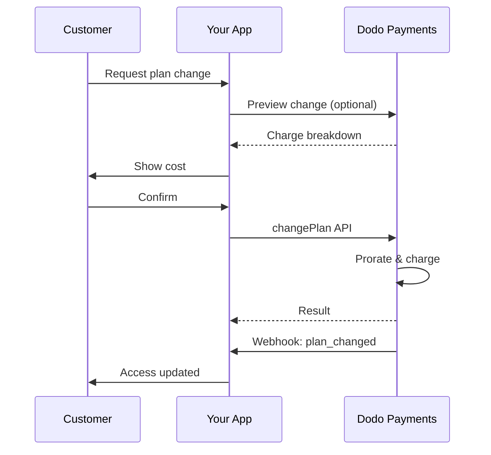
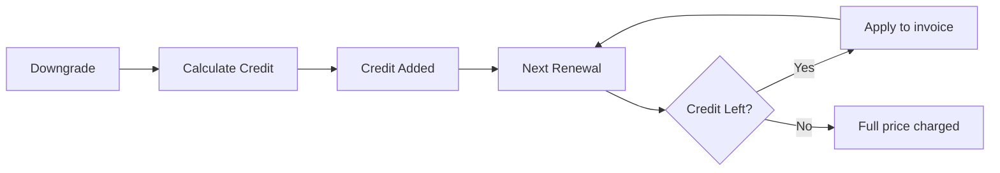

<Info>
订阅让您可以通过自动续订销售持续访问。使用灵活的计费周期、免费试用、计划变更和附加选项来为每个客户量身定制定价。
</Info>

<CardGroup cols={2}>
<Card title="升级与降级" icon="repeat" href="/developer-resources/subscription-upgrade-downgrade">
通过按比例计费和数量更新控制计划变更。
</Card>

<Card title="按需订阅" icon="bolt" href="/developer-resources/ondemand-subscriptions">
立即授权一个授权，并在稍后以自定义金额收费。
</Card>

<Card title="客户门户" icon="id-card" href="/features/customer-portal">
让客户管理计划、账单和取消。
</Card>

<Card title="订阅 Webhooks" icon="code" href="/developer-resources/webhooks/intents/subscription">
对创建、续订和取消等生命周期事件做出反应。
</Card>
</CardGroup>

## 什么是订阅？

订阅是客户按计划购买的定期产品。它们非常适合：

- **SaaS 许可证**：应用程序、API 或平台访问
- **会员**：社区、项目或俱乐部
- **数字内容**：课程、媒体或高级内容
- **支持计划**：服务水平协议、成功包或维护

## 主要好处

- **可预测的收入**：定期计费与自动续订
- **灵活的周期**：每月、每年、自定义间隔和试用
- **计划灵活性**：升级和降级的按比例计费
- **附加选项和席位**：附加可选的、可量化的升级
- **无缝结账**：托管结账和客户门户
- **以开发者为先**：清晰的 API 用于创建、变更和使用跟踪

## 创建订阅

在您的 Dodo Payments 仪表板中创建订阅产品，然后通过结账或 API 销售它们。将产品与活动订阅分开可以让您独立版本定价、附加选项和跟踪性能。

### 订阅产品创建

在仪表板中配置字段，以定义您的订阅如何销售、续订和计费。以下部分直接映射到您在创建表单中看到的内容。

#### 产品详情

- **产品名称**（必填）：在结账、客户门户和发票中显示的名称。
- **产品描述**（必填）：在结账和发票中显示的清晰价值声明。
- **产品图片**（必填）：PNG/JPG/WebP，最大 3 MB。用于结账和发票。
- **品牌**：将产品与特定品牌关联，以便于主题和电子邮件。
- **税务类别**（必填）：选择类别（例如，SaaS）以确定税务规则。

<Tip>
选择最准确的税务类别，以确保按地区正确收取税款。
</Tip>

#### 定价

- **定价类型**：选择 <b>订阅</b>（本指南）。其他选项包括一次性付款和基于使用的计费。
- **价格**（必填）：基础定期价格及其货币。
- **适用折扣 (%)**：可选的百分比折扣，适用于基础价格；在结账和发票中反映。
- **每次重复付款**（必填）：续订的间隔，例如，每 1 个月。选择节奏（按月或按年）和数量。
- **订阅期限**（必填）：订阅保持有效的总期限（例如，10 年）。在此期限结束后，除非延长，否则续订将停止。
- **试用期天数**（必填）：设置试用长度（以天为单位）。使用 0 禁用试用。试用结束时会自动进行第一次收费。
- **选择附加组件**：最多附加 10 个客户可以与基础计划一起购买的附加组件。

<Warning>
更改活动产品的定价会影响新购买。现有订阅遵循您的计划变更和按比例计费设置。
</Warning>

<Info>
附加选项非常适合可量化的额外内容，例如席位或存储。您可以控制客户更改时允许的数量和按比例计费行为。
</Info>

#### 高级设置

- **含税定价**：显示包含适用税款的价格。最终税款计算仍然因客户位置而异。
- **生成许可证密钥**：在购买后向每位客户发放唯一密钥。请参阅 <a href="/features/license-keys">许可证密钥</a> 指南。
- **数字产品交付**：在购买后自动交付文件或内容。了解更多信息，请参阅 <a href="/features/digital-product-delivery">数字产品交付</a>。
- **元数据**：附加自定义键值对以进行内部标记或客户集成。请参阅 <a href="/api-reference/metadata">元数据</a>。

<Tip>
使用元数据存储您系统中的标识符（例如，accountId），以便稍后可以对事件和发票进行对账。
</Tip>

## 订阅试用

试用让客户在没有立即付款的情况下访问订阅。试用结束时会自动进行第一次收费。

### 配置试用

在产品定价部分设置 **试用期天数**（使用 `0` 禁用）。您可以在创建订阅时覆盖此设置：

```typescript
// Via subscription creation
const subscription = await client.subscriptions.create({
  customer_id: 'cus_123',
  product_id: 'prod_monthly',
  trial_period_days: 14  // Overrides product's trial period
});

// Via checkout session
const session = await client.checkoutSessions.create({
  product_cart: [{ product_id: 'prod_monthly', quantity: 1 }],
  subscription_data: { trial_period_days: 14 }
});
```

<Warning>
`trial_period_days` 的值必须在 0 和 10,000 天之间。
</Warning>

### 检测试用状态

<Warning>
目前没有直接字段来检测试用状态。以下是一个需要查询付款的解决方法，这效率较低。我们正在开发更高效的解决方案。
</Warning>

要确定订阅是否在试用中，请检索该订阅的付款列表。如果有且仅有一笔金额为 0 的付款，则该订阅处于试用期：

```typescript
const subscription = await client.subscriptions.retrieve('sub_123');
const payments = await client.payments.list({
  subscription_id: subscription.subscription_id
});

// Check if subscription is in trial
const isInTrial = payments.items.length === 1 && 
                  payments.items[0].total_amount === 0;
```

### 更新试用期

通过更新 `next_billing_date` 来延长试用期：

```typescript
await client.subscriptions.update('sub_123', {
  next_billing_date: '2025-02-15T00:00:00Z'  // New trial end date
});
```

<Warning>
您无法将 `next_billing_date` 设置为过去的时间。日期必须是未来的。
</Warning>

## 订阅计划变更

计划变更让您可以升级或降级订阅、调整数量或迁移到不同的产品。每次变更都会根据您选择的按比例计费模式触发立即收费。

<Tip>
您可以直接从 Dodo Payments 仪表板更改订阅计划并更新下一个账单日期。这为调整客户支持请求、促销升级或计划迁移提供了一种快速的方法，而无需进行 API 调用。
</Tip>

<Tip>
**启用自助服务计划更改：** 想让客户通过客户门户自行升级或降级他们的订阅吗？将您的订阅产品添加到产品集合，并在订阅设置中启用“允许订阅更新”。
</Tip>



<Card title="产品集合" icon="layer-group" href="/features/product-collections">
  将相关产品分组到集合中，以便在客户门户中实现无缝的升级/降级路径。
</Card>

### 分摊模式

选择客户更改计划时的计费方式：

<Info>
**三种分摊模式的快速比较：**

| | `prorated_immediately` | `difference_immediately` | `full_immediately` |
|---|---|---|---|
| **升级** | 剩余天数按比例收费 | 收取全额差价 | 收取全新计划的全额费用 |
| **降级** | 剩余天数按比例抵扣 | 全额差价作为抵扣 | 无抵扣，按全额收费 |
| **计费周期** | 保持不变 | 保持不变 | 重置为今天 |
| **适合** | 公平基于时间的计费 | 简单的级别更改 | 计费周期重置 |
</Info>

#### `prorated_immediately`
根据当前计费周期的剩余时间收取按比例金额。最适合公平计费，考虑未使用的时间。

```typescript
await client.subscriptions.changePlan('sub_123', {
  product_id: 'prod_pro',
  quantity: 1,
  proration_billing_mode: 'prorated_immediately'
});
```

#### `difference_immediately`
立即收取价格差（升级）或为未来续订添加抵扣（降级）。最适合简单的升级/降级场景。

```typescript
// Upgrade: charges $50 (difference between $30 and $80)
// Downgrade: credits remaining value, auto-applied to renewals
await client.subscriptions.changePlan('sub_123', {
  product_id: 'prod_pro',
  quantity: 1,
  proration_billing_mode: 'difference_immediately'
});
```

<Info>
使用 `difference_immediately` 降级时获得的抵扣是订阅范围内的并会自动应用于未来续订。与 <a href="/features/customer-credit">客户抵扣</a> 是不同的。
</Info>

当客户使用 `difference_immediately` 降级时，未使用的价值会成为一个订阅范围内的抵扣，自动抵消未来的续订：



#### `full_immediately`
立即收取全新计划的全额费用，忽略剩余时间。最适合重置计费周期。

```typescript
await client.subscriptions.changePlan('sub_123', {
  product_id: 'prod_monthly',
  quantity: 1,
  proration_billing_mode: 'full_immediately'
});
```

<AccordionGroup>
<Accordion title="示例：按比例升级计算">

**场景**：客户在一个 30 天的周期的第 16 天从基础计划（$30/月）升级到专业计划（$80/月），使用 `prorated_immediately`。

```
Unused credit from Basic = $30 × (15 remaining / 30 total) = $15.00
Prorated cost of Pro     = $80 × (15 remaining / 30 total) = $40.00
────────────────────────────────────────────────────────────────────
Immediate charge         = $40.00 − $15.00 = $25.00
```

下一次续订在原始计费日期： **$80.00/月**。

<Tip>
有关详细的计算示例和边缘情况，请参阅我们的完整 [升级与降级指南](/developer-resources/subscription-upgrade-downgrade)。
</Tip>

</Accordion>
<Accordion title="示例：降级抵扣计算">

**场景**：客户从专业计划（$80/月）降级到入门计划（$20/月），使用 `difference_immediately`。

```
Credit = Old plan − New plan = $80 − $20 = $60.00
```

$60的抵扣自动适用于未来的续订：
- 续订 1：$20 − $20（抵扣） = **$0.00**（残余 $40 抵扣）
- 续订 2：$20 − $20（抵扣） = **$0.00**（残余 $20 抵扣）  
- 续订 3：$20 − $20（抵扣） = **$0.00**（抵扣用尽）
- 续订 4： **$20.00**（全价）

<Info>
了解更多关于抵扣如何管理的信息，请参见 [升级与降级指南](/developer-resources/subscription-upgrade-downgrade)。
</Info>

</Accordion>
</AccordionGroup>

### 更改带附加项的计划

更改计划时修改附加项。附加项包括在分摊计算中：

```typescript
await client.subscriptions.changePlan('sub_123', {
  product_id: 'prod_pro',
  quantity: 1,
  proration_billing_mode: 'difference_immediately',
  addons: [{ addon_id: 'addon_extra_seats', quantity: 2 }]  // Add add-ons
  // addons: []  // Empty array removes all existing add-ons
});
```

<Info>
计划更改将触发立即收费。收费失败可能会使订阅状态变为 `on_hold`。通过 `subscription.plan_changed` webhook 事件跟踪更改。
</Info>

### 预览计划更改

在确认计划更改之前，预览确切的收费和结果订阅：

```typescript
const preview = await client.subscriptions.previewChangePlan('sub_123', {
  product_id: 'prod_pro',
  quantity: 1,
  proration_billing_mode: 'prorated_immediately'
});

// Show customer the charge before confirming
console.log('You will be charged:', preview.immediate_charge.summary);
```

<Card title="预览更改计划 API" icon="eye" href="/api-reference/subscriptions/preview-change-plan">
  在确认之前预览计划更改。
</Card>

## 订阅状态

订阅在整个生命周期中可以处于不同状态：

- **`active`**：订阅处于活动状态并将自动续订
- **`on_hold`**：因支付失败而暂停的订阅。需要更新支付方式以重新激活
- **`cancelled`**：订阅已取消，将不再续订
- **`expired`**：订阅已达到截止日期
- **`pending`**：订阅正在创建或处理

### 暂停状态

当订阅处于 `on_hold` 状态时：

- 续订付款失败（资金不足、卡过期等）
- 更改计划收费失败
- 支付方式授权失败

<Warning>
当订阅处于 `on_hold` 状态时，将无法自动续订。您必须更新支付方式以重新激活订阅。
</Warning>

### 从暂停状态重新激活

要从 `on_hold` 状态重新激活订阅，请更新支付方式。这将自动：

1. 创建剩余欠款的收费
2. 生成发票
3. 使用新支付方式处理付款
4. 在成功付款后将订阅重新激活为 `active` 状态

```typescript
// Reactivate subscription from on_hold
const response = await client.subscriptions.updatePaymentMethod('sub_123', {
  type: 'new',
  return_url: 'https://example.com/return'
});

// For on_hold subscriptions, a charge is automatically created
if (response.payment_id) {
  console.log('Charge created:', response.payment_id);
  // Redirect customer to response.payment_link to complete payment
  // Monitor webhooks for payment.succeeded and subscription.active
}
```

<Info>
成功更新 `on_hold` 订阅的支付方式后，您将收到 `payment.succeeded`，然后是 `subscription.active` webhook 事件。
</Info>

## API 管理

<AccordionGroup>
<Accordion title="创建订阅">
使用 `POST /subscriptions` 从产品以编程方式创建订阅，支持可选的试用和附加项。

<Card title="API 参考" icon="code" href="/api-reference/subscriptions/post-subscriptions">
查看创建订阅的 API。
</Card>
</Accordion>

<Accordion title="更新订阅">
使用 `PATCH /subscriptions/{id}` 更新数量，取消下一个计费日期，或修改元数据。

<Card title="API 参考" icon="code" href="/api-reference/subscriptions/patch-subscriptions">
了解如何更新订阅详细信息。
</Card>
</Accordion>

<Accordion title="更改计划（分摊）">
使用分摊控制更改活动产品和数量。

<Card title="API 参考" icon="code" href="/api-reference/subscriptions/change-plan">
查看计划更改选项。
</Card>
</Accordion>

<Accordion title="按需收费">
对于按需订阅，按需收取特定金额。

<Card title="API 参考" icon="code" href="/api-reference/subscriptions/create-charge">
对按需订阅进行收费。
</Card>
</Accordion>

<Accordion title="列出和检索">
使用 `GET /subscriptions` 列出所有订阅，使用 `GET /subscriptions/{id}` 检索一条。

<Card title="API 参考" icon="code" href="/api-reference/subscriptions/get-subscriptions">
浏览列出和检索的 API。
</Card>
</Accordion>

<Accordion title="使用历史">
获取计量或混合定价模型的记录使用情况。

<Card title="API 参考" icon="code" href="/api-reference/subscriptions/get-usage-history">
查看使用历史 API。
</Card>
</Accordion>

<Accordion title="更新支付方式">
更新订阅的支付方式。对于活动订阅，此操作将更新未来续订的支付方式。对于处于 `on_hold` 状态的订阅，此操作通过创建剩余欠款的收费将订阅重新激活。

<Card title="API 参考" icon="code" href="/api-reference/subscriptions/update-payment-method">
了解如何更新支付方式并重新激活订阅。
</Card>
</Accordion>
</AccordionGroup>

## 常见用例

- **SaaS 和 API**：分层访问和附加座位或使用
- **内容和媒体**：每月访问并提供试用
- **B2B 支持计划**：年合同和高级支持附加项
- **工具和插件**：许可证密钥和版本发布

## 集成示例

### 结帐会话（订阅）
创建结帐会话时，包含您的订阅产品和可选附加项：

```typescript
const session = await client.checkoutSessions.create({
  product_cart: [
    {
      product_id: 'prod_subscription',
      quantity: 1
    }
  ]
});
```

### 更改计划与分摊
升级或降级订阅并控制分摊行为：

```typescript
await client.subscriptions.changePlan('sub_123', {
  product_id: 'prod_new',
  quantity: 1,
  proration_billing_mode: 'difference_immediately'
});
```

### 下一个计费日期取消
安排取消，取消在当前计费周期结束时生效：

```typescript
await client.subscriptions.update('sub_123', {
  cancel_at_next_billing_date: true
});
```

### 按需订阅
创建按需订阅并在需要时稍后收费：

```typescript
const onDemand = await client.subscriptions.create({
  customer_id: 'cus_123',
  product_id: 'prod_on_demand',
  on_demand: true
});

await client.subscriptions.createCharge(onDemand.id, {
  amount: 4900,
  currency: 'USD',
  description: 'Extra usage for September'
});
```

### 更新活动订阅的支付方式
更新活动订阅的支付方式：

```typescript
// Update with new payment method
const response = await client.subscriptions.updatePaymentMethod('sub_123', {
  type: 'new',
  return_url: 'https://example.com/return'
});

// Or use existing payment method
await client.subscriptions.updatePaymentMethod('sub_123', {
  type: 'existing',
  payment_method_id: 'pm_abc123'
});
```

### 从暂停状态重新激活订阅
重新激活因支付失败而暂停的订阅：

```typescript
// Update payment method - automatically creates charge for remaining dues
const response = await client.subscriptions.updatePaymentMethod('sub_123', {
  type: 'new',
  return_url: 'https://example.com/return'
});

if (response.payment_id) {
  // Charge created for remaining dues
  // Redirect customer to response.payment_link
  // Monitor webhooks: payment.succeeded → subscription.active
}
```

## 带有 RBI 合规要求的订阅

UPI 和印度卡订阅根据 RBI（印度储备银行）规定运作，并具有特定的授权要求：

### 授权限制

授权类型和金额取决于您的订阅的经常性收费：

- **费用低于 ₹15,000：** 我们为 ₹15,000 创建按需授权。订阅金额根据您的订阅频率按期收费，直到授权限额。
- **费用 ₹15,000 或以上：** 我们为确切的订阅金额创建订阅授权（或按需授权）。

有关印度支付方式的 RBI 合规授权的详细信息，请参见 <a href="/features/payment-methods/india">印度支付方式</a> 页面。

### 升级和降级的考虑事项

**重要：** 升级或降级订阅时，请仔细考虑授信限制：

- 如果升级/降级导致收取超过 ₹15,000 的费用，并且超过现有的按需支付限额，则交易收费可能会失败。
- 在这种情况下，客户可能需要更新其支付方式或再次更改订阅，以建立具有正确限额的新授权。

### 高价值收费的授权

对于 ₹15,000 或以上的订阅收费：

- 客户将被其银行提示授权交易。
- 如果客户未能授权交易，则交易将失败，订阅将暂停。

### 48 小时处理延迟

**处理时间线：** 印度卡和 UPI 订阅的经常性收费遵循独特的处理模式：

- 收费在根据您的订阅频率预定日期 **启动**。
- 实际从客户账户 **扣除** 只发生在从支付启动 **48 小时** 后。
- 这 48 小时的窗口可能延长到 **额外的 2-3 小时**，具体取决于银行 API 响应。

### 授权取消窗口

在 48 小时处理窗口内：

- 客户可以通过其银行应用程序取消授权。
- 如果客户在此期间取消授权，订阅将保持 **活动**（这是一种特定于印度卡和 UPI 自动支付订阅的边缘情况）。
- 但是，实际扣款可能失败，在这种情况下，我们将把订阅 **暂停**。

**边缘情况处理：** 如果您在收费启动时立即向客户提供好处、抵扣或订阅使用情况，需要在应用程序中适当处理这 48 小时窗口。考虑：

- 在确认支付之前延迟福利激活
- 实施宽限期或临时访问
- 监控订阅状态以获取授权取消情况
- 在应用程序逻辑中处理订阅暂停状态

<Tip>
监控订阅 webhook 以跟踪支付状态变化，并处理在 48 小时窗口期间取消授权的边缘情况。
</Tip>

## 最佳实践

- **从清晰的分层开始**：2-3 种计划，具有明显的差异
- **沟通定价**：显示总额、分摊和下一个续订
- **合理使用试用**：通过入门培训转化，而不仅仅是时间
- **利用附加项**：保持基本计划简单并销售额外服务
- **测试更改**：在测试模式中验证计划更改和分摊

<Info>
订阅是经常性收入的灵活基础。开始时保持简单，进行彻底的测试，并根据采纳率、流失率和扩展指标进行迭代。
</Info>