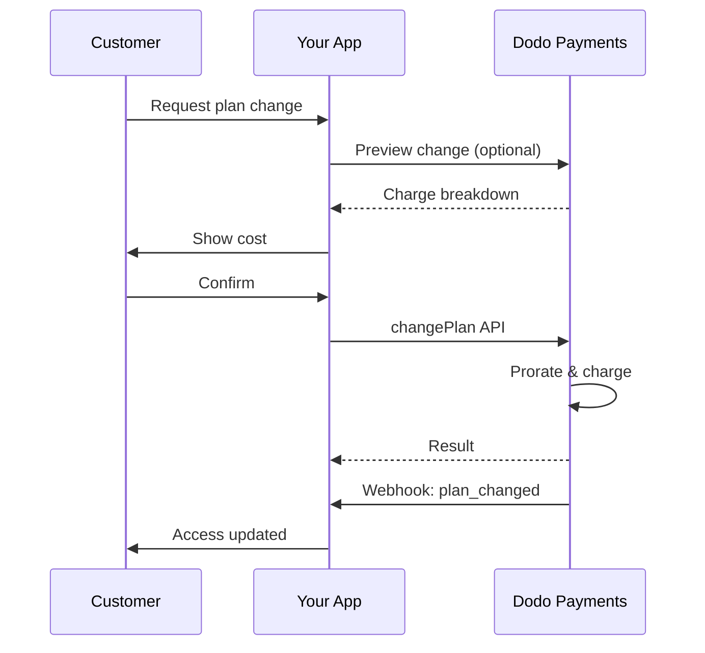
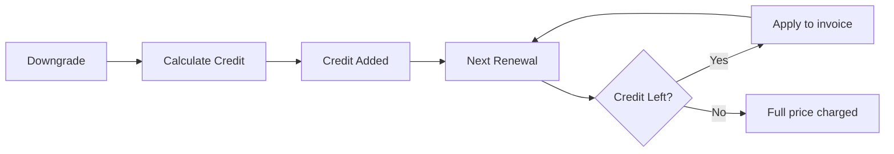
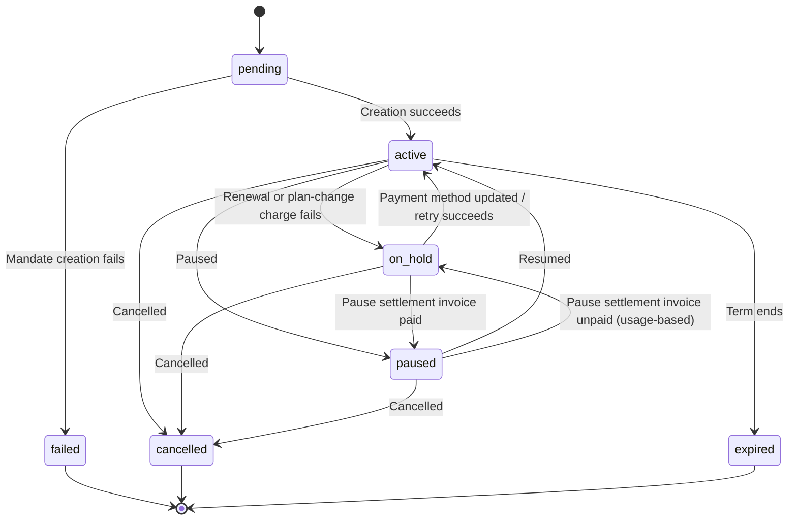

<Info>
Subscriptions let you sell ongoing access with automated renewals. Use flexible billing cycles, free trials, plan changes, and add‑ons to tailor pricing for each customer.
</Info>

<CardGroup cols={2}>
<Card title="Upgrade & Downgrade" icon="repeat" href="/developer-resources/subscription-upgrade-downgrade">
Control plan changes with proration and quantity updates.
</Card>

<Card title="On‑Demand Subscriptions" icon="bolt" href="/developer-resources/ondemand-subscriptions">
Authorize a mandate now and charge later with custom amounts.
</Card>

<Card title="Customer Portal" icon="id-card" href="/features/customer-portal">
Let customers manage plans, billing, and cancellations.
</Card>

<Card title="Subscription Webhooks" icon="code" href="/developer-resources/webhooks/intents/subscription">
React to lifecycle events like created, renewed, and canceled.
</Card>
</CardGroup>

## What Are Subscriptions?

Subscriptions are recurring products customers purchase on a schedule. They’re ideal for:

- **SaaS licenses**: Apps, APIs, or platform access
- **Memberships**: Communities, programs, or clubs
- **Digital content**: Courses, media, or premium content
- **Support plans**: SLAs, success packages, or maintenance

## Key Benefits

- **Predictable revenue**: Recurring billing with automated renewals
- **Flexible cycles**: Monthly, annual, custom intervals, and trials
- **Plan agility**: Proration for upgrades and downgrades
- **Add‑ons and seats**: Attach optional, quantifiable upgrades
- **Seamless checkout**: Hosted checkout and customer portal
- **Developer-first**: Clear APIs for creation, changes, and usage tracking

## Creating Subscriptions

Create subscription products in your Dodo Payments dashboard, then sell them through checkout or your API. Separating products from active subscriptions lets you version pricing, attach add‑ons, and track performance independently.

### Subscription product creation

Configure the fields in the dashboard to define how your subscription sells, renews, and bills. The sections below map directly to what you see in the creation form.

#### Product details

- **Product Name** (required): The display name shown in checkout, customer portal, and invoices.
- **Product Description** (required): A clear value statement that appears in checkout and invoices.
- **Product Image** (required): PNG/JPG/WebP up to 3 MB. Used on checkout and invoices.
- **Brand**: Associate the product with a specific brand for theming and emails.
- **Tax Category** (required): Choose the category (for example, SaaS) to determine tax rules.

<Tip>
Pick the most accurate tax category to ensure correct tax collection per region.
</Tip>

#### Pricing

- **Pricing Type**：选择 <b>Subscription</b>（本指南）。可选项包括 Single Payment 和 Usage Based Billing。
- **Price**（必填）：带货币的基础 recurring price。价格必须至少为 **$1**（或所选货币的等值金额）。不支持低于此最低金额的价格，且订阅将无法正常工作。
- **Discount Applicable (%)**：可选的百分比折扣，应用于基础价格；会反映在结账和发票中。
- **Repeat payment every**（必填）：续订间隔，例如每 1 Month。选择周期（months 或 years）和数量。
- **Subscription Period**（必填）：订阅保持有效的总期限（例如 10 Years）。期限结束后，除非延长，否则将停止续订。
- **Trial Period Days**（必填）：以天为单位设置试用时长。使用 0 可禁用试用。试用结束时会自动进行首次扣款。
- **Trial Amount**：付费试用的可选预付费用。免费试用请留空。请参阅 [Paid Trials](#paid-trials)。
- **Select add‑on**：最多附加 10 个 add‑ons，供客户与基础计划一同购买。

<Warning>
Changing pricing on an active product affects new purchases. Existing subscriptions follow your plan‑change and proration settings.
</Warning>

<Info>
Add‑ons are ideal for quantifiable extras such as seats or storage. You can control allowed quantities and proration behavior when customers change them.
</Info>

#### Advanced settings

- **Tax Inclusive Pricing**: Display prices inclusive of applicable taxes. Final tax calculation still varies by customer location.
- **Generate license keys**: Issue a unique key to each customer after purchase. See the <a href="/features/license-keys">License Keys</a> guide.
- **Digital Product Delivery**: Deliver files or content automatically after purchase. Learn more in <a href="/features/digital-product-delivery">Digital Product Delivery</a>.
- **Metadata**: Attach custom key–value pairs for internal tagging or client integrations. See <a href="/api-reference/metadata">Metadata</a>.

<Tip>
Use metadata to store identifiers from your system (e.g., accountId) so you can reconcile events and invoices later.
</Tip>

## Subscription Trials

试用期让客户可以在支付完整 recurring price 之前评估订阅。试用可以是 **free**，即试用结束前不会收取任何费用；也可以是 **paid**，即预先收取一笔折扣后的金额。在这两种情况下，完整价格都会在试用结束后的首次续订时开始收取。

### Configuring Trials

Set **Trial Period Days** in the product pricing section (use `0` to disable). You can override this when creating subscriptions:

```typescript
// Via subscription creation
const subscription = await client.subscriptions.create({
  customer: { customer_id: 'cus_123' },
  billing: { country: 'US' },
  product_id: 'pdt_monthly',
  quantity: 1,
  trial_period_days: 14  // Overrides product's trial period
});

// Via checkout session
const session = await client.checkoutSessions.create({
  product_cart: [{ product_id: 'pdt_monthly', quantity: 1 }],
  subscription_data: { trial_period_days: 14 }
});
```

<Warning>
The `trial_period_days` value must be between 0 and 10,000 days.
</Warning>

### Paid Trials

试用不一定必须免费。在订阅产品的 recurring price 上设置 **Trial Amount**，即可为试用期收取一笔折扣后的预付费用。随后，完整 recurring price 会在首次续订时开始收取。

<Frame>

</Frame>

付费试用是在产品的 price 上配置的，而不是针对每个 subscription 或 checkout session 配置：

| Field | Type | Description |
|-------|------|-------------|
| `trial_amount` | integer | 今天针对试用收取的金额，以 price currency 的最小单位表示（例如，`500` 表示 $5.00）。需要 `trial_period_days > 0`。省略或设置为 `null` 表示免费试用。 |
| `trial_apply_discounts` | boolean | checkout discount codes 是否会减少试用费用。默认为 `false`，因此即使 recurring price 应用了折扣，试用金额仍会全额收取。 |

```typescript
const product = await client.products.create({
  name: 'Pro Plan',
  tax_category: 'saas',
  price: {
    type: 'recurring_price',
    price: 2900,                      // $29.00 per month after the trial
    currency: 'USD',
    discount: 0,
    purchasing_power_parity: false,
    payment_frequency_count: 1,
    payment_frequency_interval: 'Month',
    subscription_period_count: 1,
    subscription_period_interval: 'Year',
    trial_period_days: 14,            // A paid trial requires a positive trial period
    trial_amount: 500,                // $5.00 charged today
    trial_apply_discounts: false      // Discounts apply to the recurring price only
  }
});
```

付费试用同样会经过 checkout。试用金额会计税，并显示在 checkout session 的计算结果和 payment link 定价中；Adaptive Currency markup 会按货币应用。[preview endpoint](/developer-resources/checkout-session) 会返回 `trial_amount` 和 `trial_period_days`，以便你在创建订阅前显示今天应付的金额。

<Info>
免费试用行为不变。将 **Trial Amount** 留空会保留现有行为：首次扣款为 `0`，并在试用结束时收取完整价格。
</Info>

### Preventing Trial Misuse

**Prevent Trial Misuse** 可防止客户为同一企业反复领取试用。启用后，已经兑换过试用的客户会自动降级为 **paid, no-trial purchase**，而不会获得新的试用期。

<Frame>

</Frame>

在 **Settings** 的 **Subscriptions** 选项卡中启用。启用后：

- 客户会按 **normalized email** 匹配，并移除加号别名，因此 `user+trial@example.com` 和 `user@example.com` 会被视为同一人。
- 兑换记录会在 **trial activation** 时保存，因此当天取消的客户仍然算作已使用试用。
- 现有客户会根据其历史试用记录按 email 回填，因此过去使用过试用的客户会立即被识别。

<Info>
此设置**默认关闭**。完整的企业级订阅控制项列表请参阅 [Subscription Settings](/features/product-collections#subscription-settings)。
</Info>

### Detecting Trial Status

<Warning>
目前没有可直接用于检测试用状态的字段。以下是一种需要查询 payments 的变通方法，但效率较低。我们正在开发更高效的解决方案。
</Warning>

要确定 **free trial** subscription 是否处于试用期，请获取该 subscription 的 payments 列表。如果恰好有一笔金额为 0 的 payment，则该 subscription 处于试用期：

```typescript
const subscription = await client.subscriptions.retrieve('sub_123');
const payments = await client.payments.list({
  subscription_id: subscription.subscription_id
});

// Check if subscription is in trial
const isInTrial = payments.items.length === 1 && 
                  payments.items[0].total_amount === 0;
```

<Warning>
此金额为零的检查方式仅适用于免费试用。对于 [paid trial](#paid-trials)，第一笔 payment 等于试用金额，而不是 `0`。请将第一笔 payment 与 subscription 的 `trial_amount` 比较，或检查 `next_billing_date` 是否仍在试用期内。
</Warning>

### Updating Trial Period

通过更新 `next_billing_date` 延长试用期：

```typescript
await client.subscriptions.update('sub_123', {
  next_billing_date: '2025-02-15T00:00:00Z'  // New trial end date
});
```

<Warning>
不能将 `next_billing_date` 设置为过去的时间。日期必须在未来。
</Warning>

## Subscription Plan Changes

计划变更可用于升级或降级 subscriptions、调整数量，或迁移到不同的 products。根据所选的 proration mode，变更可能触发即时扣款、产生 credit，或不进行任何 billing adjustment。

<Tip>
你可以直接从 Dodo Payments dashboard 更改 subscription plans 并更新 next billing date。这样无需进行 API calls，即可快速响应 customer support requests、promotional upgrades 或 plan migrations。
</Tip>

<Tip>
**Enable self-service plan changes：**希望客户通过 Customer Portal 自行升级或降级 subscriptions？将 subscription products 添加到 Product Collection，并在 Subscription Settings 中启用 "Allow Subscription Updates"。
</Tip>



<Card title="Product Collections" icon="layer-group" href="/features/product-collections">
  将相关 products 分组到 collections 中，以便在 Customer Portal 中启用顺畅的升级/降级路径。
</Card>

### Proration Modes

选择客户变更计划时的计费方式：

<Info>
**四种 proration modes 快速对比：**

| | `prorated_immediately` | `difference_immediately` | `full_immediately` | `do_not_bill` |
|---|---|---|---|---|
| **Upgrade** | 按剩余天数计算的 proration charge | 收取完整价格差额 | 收取新计划的完整价格 | 不收费 — 立即切换 |
| **Downgrade** | 按剩余天数计算的 proration credit | 将完整价格差额作为 credit | 无 credit，收取完整费用 | 无 credit — 立即切换 |
| **Billing cycle** | 重置为今天 | 重置为今天 | 重置为今天 | 保持不变 |
| **Best for** | 公平的按时间计费 | 简单的 tier 变更 | 重置 billing cycle | 免费迁移或礼遇切换 |
</Info>

#### `prorated_immediately`
根据当前 billing cycle 的剩余时间收取按比例计算的金额。适合考虑未使用时间的公平计费。

```typescript
await client.subscriptions.changePlan('sub_123', {
  product_id: 'pdt_pro',
  quantity: 1,
  proration_billing_mode: 'prorated_immediately'
});
```

#### `difference_immediately`
立即收取价格差额（升级），或为未来续订增加 credit（降级）。适合简单的升级/降级场景。

```typescript
// Upgrade: charges $50 (difference between $30 and $80)
// Downgrade: credits remaining value, auto-applied to renewals
await client.subscriptions.changePlan('sub_123', {
  product_id: 'pdt_pro',
  quantity: 1,
  proration_billing_mode: 'difference_immediately'
});
```

<Info>
使用 `difference_immediately` 进行降级产生的 credits 以 subscription 为作用域，并会自动应用于未来续订。它们不同于 <a href="/features/credit-based-billing">Credit-Based Billing</a> entitlements。
</Info>

客户使用 `difference_immediately` 降级时，未使用的价值会变成 subscription-scoped credit，并自动抵扣未来续订：



#### `full_immediately`
立即收取新计划的完整金额，不考虑剩余时间。适合重置 billing cycle。

```typescript
await client.subscriptions.changePlan('sub_123', {
  product_id: 'pdt_monthly',
  quantity: 1,
  proration_billing_mode: 'full_immediately'
});
```

#### `do_not_bill`
切换到新计划，但不进行任何 billing adjustment。不收取 proration charges，也不产生 credits — 客户直接转入新计划。适合礼遇迁移、免费计划切换，或你希望承担价格差额的场景。

```typescript
await client.subscriptions.changePlan('sub_123', {
  product_id: 'pdt_new_plan',
  quantity: 1,
  proration_billing_mode: 'do_not_bill'
});
```

<AccordionGroup>
<Accordion title="Example: Prorated upgrade calculation">

**Scenario**：使用 `prorated_immediately` 时，Basic（$30/month）客户在 30 天 billing cycle 的第 16 天升级到 Pro（$80/month）。

```
Unused credit from Basic = $30 × (15 remaining / 30 total) = $15.00
Prorated cost of Pro     = $80 × (15 remaining / 30 total) = $40.00
────────────────────────────────────────────────────────────────────
Immediate charge         = $40.00 − $15.00 = $25.00
```

下一次续订日期为 **February 15**（January 16 + 30 days）：**$80.00/month**。

<Tip>
如需更详细的计算示例和边界情况，请参阅完整的 [Upgrade & Downgrade Guide](/developer-resources/subscription-upgrade-downgrade)。
</Tip>

</Accordion>
<Accordion title="Example: Downgrade credit calculation">

**Scenario**：Pro（$80/month）客户使用 `difference_immediately` 降级到 Starter（$20/month）。

```
Credit = Old plan − New plan = $80 − $20 = $60.00
```

$60 credit 会自动应用于未来续订：
- Renewal 1：$20 − $20（credit）= **$0.00**（剩余 $40 credit）
- Renewal 2：$20 − $20（credit）= **$0.00**（剩余 $20 credit）  
- Renewal 3：$20 − $20（credit）= **$0.00**（credit 用尽）
- Renewal 4：**$20.00**（完整价格）

<Info>
如需了解 credits 的管理方式，请参阅 [Upgrade & Downgrade Guide](/developer-resources/subscription-upgrade-downgrade)。
</Info>

</Accordion>
</AccordionGroup>

### Changing Plans with Add-ons

更改计划时可以修改 add-ons。Add-ons 会计入 proration calculations：

```typescript
await client.subscriptions.changePlan('sub_123', {
  product_id: 'pdt_pro',
  quantity: 1,
  proration_billing_mode: 'difference_immediately',
  addons: [{ addon_id: 'addon_extra_seats', quantity: 2 }]  // Add add-ons
  // addons: []  // Empty array removes all existing add-ons
});
```

<Info>
默认情况下（`effective_at: 'immediately'`）计划变更会立即触发扣款。传入 `effective_at: 'next_billing_date'` 可将变更安排在下一个计费日期执行，而不是立即执行——待处理的变更会在订阅中以 `scheduled_change` 返回，你可以使用[取消已安排的计划变更](/api-reference/subscriptions/cancel-change-plan)将其取消。扣款失败可能会使订阅进入 `on_hold` 状态，除非你传入 `on_payment_failure: 'prevent_change'`，这样订阅会保持当前计划，直到付款成功。通过 `subscription.plan_changed` webhook 事件跟踪变更。
</Info>

### Previewing Plan Changes

在提交计划变更前，预览确切的扣款金额和变更后的 subscription：

```typescript
const preview = await client.subscriptions.previewChangePlan('sub_123', {
  product_id: 'pdt_pro',
  quantity: 1,
  proration_billing_mode: 'prorated_immediately'
});

// Show customer the charge before confirming
console.log('You will be charged:', preview.immediate_charge.summary);
```

<Card title="Preview Change Plan API" icon="eye" href="/api-reference/subscriptions/preview-change-plan">
  在提交计划变更前进行预览。
</Card>

## 暂停和恢复订阅

暂停会冻结订阅，而不是结束订阅。计费会停止，访问权限会被撤销，同时订阅会保留其方案和历史记录，以便客户准确地从中断处继续使用。可将其作为取消订阅之外的留存方案。

在 **Sales → Subscriptions** 下打开任意活跃订阅，然后点击 **Pause subscription**。状态会变为 `paused`，并且续订会停止，直到订阅恢复。

<Frame>
    
</Frame>

### 暂停后会发生什么

- **续订会停止。** 订阅暂停期间不会生成 invoice，也不会尝试收取续订费用。
- **访问权限会立即撤销。** 暂停会撤销订阅上所有已交付和待处理的 [entitlement grant](/features/entitlements/introduction)，从而禁用其 [license keys](/features/license-keys)，并停止签发新的 [digital product](/features/digital-product-delivery) 下载 URL。恢复订阅后会重新授予这些权限，其方式与从 `on_hold` 恢复相同。
- **计费时钟会冻结。** `next_billing_date` 和 `expires_at` 都会向后顺延与暂停时长完全相等的时间，因此客户可以保留已支付的使用时间。
- **暂停时长没有限制。** 暂停的订阅会一直保持暂停状态，直到有人恢复它。无需预先设置暂停时长。

<Warning>
暂停会立即撤销访问权限，而不是等到计费周期结束。如果订阅用于控制产品访问权限，请在客户确认前向其明确说明这一点。
</Warning>

恢复订阅会将其返回到 `active`，并恢复其 entitlements。由于计费时钟被冻结，下一次续订会比原计划晚暂停时长发生——订阅暂停 12 天，就会延迟 12 天续订。

### 暂停按用量计费的订阅

[按用量计费](/features/usage-based-billing/introduction)的订阅在暂停时可能存在已记录但尚未计费的用量。**Bill Usage at Pause**（位于 **Settings → Subscriptions**）决定如何处理这些用量：

| 设置 | 行为 |
|---------|----------|
| **On**（默认） | Dodo Payments 会为上次计费日期以来累计的用量生成 invoice，并立即收取费用。 |
| **Off** | 应付用量会结转，并在订阅下一张常规 invoice 中计费。 |

只有计量用量会以这种方式结算——暂停时绝不会收取 recurring base fee。Standard 和 on-demand 订阅没有需要结算的用量，因此此设置不会影响它们。

<Info>
**Bill Usage at Pause** 按计费周期记录。在周期中途更改此设置，不会改变当前周期的结算方式；新值从下一个周期开始生效。
</Info>

<Warning>
结算 invoice 会像其他 invoice 一样收取，因此可能会失败。如果在 [dunning](/features/recovery/subscription-dunning) 宽限期结束后仍未支付，订阅会变为 `on_hold`，同时仍会标记为已暂停。
</Warning>

处于该状态的订阅有两种恢复方式，区别在于由谁承担应付用量：

| 退出方式 | 结果 |
|------|--------|
| 结算 invoice 已支付 | 订阅会返回 `paused`，而不是 `active`。客户准备好后，请明确恢复订阅。 |
| 直接恢复订阅 | 订阅会直接变为 `active`，未支付的结算 invoice 会被 **voided**，其待处理重试也会一并取消。应付用量会被核销。 |

<Info>
恢复订阅是退出此暂停状态的有效方式——无需先收取结算 invoice。但请注意，恢复订阅会免除未结清的用量，而不是将其递延。
</Info>

### 让客户自行暂停订阅

**Allow Subscription Pause**（位于 **Settings → Subscriptions**）控制客户是否可以从 Customer Portal 暂停和恢复订阅。该选项**默认关闭**，因此自助暂停需要主动启用。

<Frame>
    
</Frame>

此设置仅控制 Customer Portal。无论开关处于何种状态，你始终可以从控制面板或 API 暂停和恢复订阅。

关闭此选项会阻止客户发起新的暂停，但不会困住已经暂停的客户——他们仍可以恢复自己发起的暂停。由你发起的暂停仍由你控制。

<Card title="Pausing from the Customer Portal" icon="id-card" href="/features/customer-portal#pausing-a-subscription">
查看客户看到的内容，包括确认对话框。
</Card>

### 通过 API 暂停

暂停和恢复通过更新订阅 endpoint 中的 `status` 字段执行。没有单独的暂停 endpoint。

```typescript
// Pause
await client.subscriptions.update('sub_123', { status: 'paused' });

// Resume
await client.subscriptions.update('sub_123', { status: 'active' });
```

<Warning>
单独发送 `paused` 或 `active` —— 将任一字段与其他字段组合发送都会因 `422` 而被拒绝。较旧的布尔型 `pause` 字段已被移除，现在始终会因 `422` 而失败，因此仍在使用该字段的调用方会收到明确的错误，而不是无提示地不执行任何操作。
</Warning>

暂停会发出 `subscription.paused`，恢复会发出 `subscription.unpaused`。两者都会携带完整的订阅对象；暂停时 `paused_at` 会被设置，恢复后则设置 `null`。

### 暂停与其他订阅操作

- **取消仍然有效。** 你可以像取消活跃订阅一样取消已暂停的订阅。执行取消时，暂停产生的任何未结清结算 invoice 都会被作废。
- **已排期的方案变更会延迟，而不会丢失。** 在下一次计费日期执行的 [方案变更](#subscription-plan-changes) 会在订阅暂停期间保持不变，恢复后于顺延后的计费日期应用。其 `scheduled_change.effective_at` 是排期时的快照，不会因暂停而调整，因此可能显示过去的日期——应将其理解为“原计划执行日期”，而不是保证日期。若要放弃变更而不是继续执行，请使用 [Cancel Scheduled Plan Change](/api-reference/subscriptions/cancel-change-plan)。

## 订阅状态

订阅在其生命周期内会经过一组定义明确的状态。下表列出了每种状态、触发原因，以及可以（或无法）采取的恢复方式。

| 状态 | 含义 | 可恢复？ | 恢复路径 / 下一步 |
|--------|---------------|--------------|---------------------------|
| `pending` | 订阅正在创建或处理中 | — | 等待 `subscription.active`（或 `subscription.failed`） |
| `active` | 订阅处于 active 状态，并将自动续订 | — | 无需执行任何操作 |
| `on_hold` | 续订付款（或套餐变更费用）失败；续订已停止 | **是** | 更新付款方式以重新激活——通过 [付款重试](/features/recovery/payment-retries) 和 [催收](/features/recovery/subscription-dunning) 自动完成，或通过 [Update Payment Method API](/api-reference/subscriptions/update-payment-method) 手动完成 |
| `paused` | 订阅被你或客户主动暂停；计费已冻结，访问权限已撤销 | **是** | 使用 `status: active` 恢复订阅，或在启用自助暂停后从 Customer Portal 中恢复——请参阅[暂停和恢复订阅](#pausing-and-resuming-subscriptions) |
| `cancelled` | 订阅已取消且不会续订 | 仅可重新购买 | 客户必须开始新的订阅；[催收](/features/recovery/subscription-dunning) 可以提示客户重新购买 |
| `failed` | 订阅**创建**失败（初始授权或付款未成功） | **否——终止状态** | 客户必须使用有效的付款方式创建新的订阅 |
| `expired` | 订阅已达到期限末尾 | — | 如有需要，客户必须开始新的订阅 |

<Warning>
`on_hold` 和 `failed` 经常被混淆。`on_hold` 是已经活跃的订阅因续订失败而进入的**可恢复**状态。`failed` 是仅在**初始**订阅创建失败时出现的**终止**状态，无法重新激活。
</Warning>

<Info>
`on_hold` 和 `paused` 也有所不同。`on_hold` 是非自愿状态——付款失败。`paused` 是主动状态——你或客户选择冻结订阅，在订阅保持暂停期间不会尝试续订。按用量计费的订阅在暂停时仍可能产生一次性结算 invoice；参见[暂停按用量计费的订阅](#pausing-usage-based-subscriptions)。
</Info>

### 状态机



### 暂停状态

订阅在以下情况下会进入 `on_hold` 状态：

- 续订付款失败（资金不足、卡片过期等）
- 方案变更费用失败
- 支付方式授权失败
- 按用量计费订阅的[暂停结算 invoice](#pausing-usage-based-subscriptions)未支付

<Warning>
订阅处于 `on_hold` 状态时，不会自动续订。必须更新支付方式才能重新激活订阅。
</Warning>

### 从暂停状态重新激活

要从 `on_hold` 状态重新激活订阅，请更新支付方式。系统会自动：

1. 为剩余应付款创建 charge
2. 生成 invoice
3. 使用新的支付方式处理付款
4. 付款成功后，将订阅重新激活为 `active` 状态

<Note>
唯一例外是由未支付的暂停结算 invoice 导致的暂停状态。结清该 invoice 后，订阅会返回 `paused`，而不是 `active`，因为付款失败前订阅处于暂停状态。invoice 结清后，请明确恢复订阅。
</Note>

```typescript
// Reactivate subscription from on_hold
const response = await client.subscriptions.updatePaymentMethod('sub_123', {
  payment_method: {
    type: 'new',
    return_url: 'https://example.com/return'
  }
});

// For on_hold subscriptions, a charge is automatically created
if (response.payment_id) {
  console.log('Charge created:', response.payment_id);
  // Redirect customer to response.payment_link to complete payment
  // Monitor webhooks for payment.succeeded and subscription.active
}
```

<Info>
成功更新 `on_hold` 订阅的支付方式后，你会先收到 `payment.succeeded`，再收到 `subscription.active` webhook events。
</Info>

### 按状态转换划分的 Webhook Events

每次状态转换都会发出 webhook，便于你无需轮询即可驱动 entitlement 逻辑：

| 状态转换 | 事件 |
|------------|-------|
| 订阅已激活 | `subscription.active` |
| 续订成功 | `subscription.renewed` |
| 续订失败 → 暂停 | `subscription.on_hold` |
| 订阅已暂停 | `subscription.paused` |
| 已暂停订阅恢复 | `subscription.unpaused` |
| 创建失败 | `subscription.failed` |
| 方案升级/降级 | `subscription.plan_changed` |
| 已取消 | `subscription.cancelled` |
| 期限结束 | `subscription.expired` |
| 任意字段变更 | `subscription.updated` |

<Card title="Subscription Webhook Payloads" icon="webhook" href="/developer-resources/webhooks/intents/subscription">
查看订阅生命周期事件的完整 payload schema。
</Card>

## API 管理

<AccordionGroup>
<Accordion title="Create subscriptions">
使用 `POST /checkouts` 根据产品以编程方式创建订阅，并可选择添加试用（`subscription_data.trial_period_days`）和附加项（`product_cart[].addons`）。

<Warning>
`POST /subscriptions` 已弃用。现有集成仍可继续使用，但新集成应使用 [Checkout Sessions](/api-reference/checkout-sessions/create)。
</Warning>

<Card title="API Reference" icon="code" href="/api-reference/checkout-sessions/create">
查看 create checkout session API。
</Card>
</Accordion>

<Accordion title="Update subscriptions">
使用 `PATCH /subscriptions/{subscription_id}` 在下一次计费日期取消订阅、延长订阅期限、更新计费详情或修改 metadata。要更改数量，请改用 [Change Plan API](/api-reference/subscriptions/change-plan)——`PATCH` 不接受 `quantity`。

<Card title="API Reference" icon="code" href="/api-reference/subscriptions/patch-subscriptions">
了解如何更新订阅详情。
</Card>
</Accordion>

<Accordion title="Pause and resume subscriptions">
暂停和恢复使用同一个 `PATCH /subscriptions/{subscription_id}` endpoint，并通过 `status` 字段执行：`status: paused` 会暂停 active 订阅，而 `status: active` 会恢复订阅。同一请求中，这两个值都不能与任何其他字段组合使用。有关完整行为、计费影响及相关业务设置，请参阅[暂停和恢复订阅](#pausing-and-resuming-subscriptions)。

<Card title="API Reference" icon="code" href="/api-reference/subscriptions/patch-subscriptions">
查看更新订阅 API，其中包括 `status` 字段。
</Card>
</Accordion>

<Accordion title="Change plans (proration)">
通过 proration 控制项更改活跃产品和数量。

<Card title="API Reference" icon="code" href="/api-reference/subscriptions/change-plan">
查看方案变更选项。
</Card>
</Accordion>

<Accordion title="On‑demand charges">
对于 on-demand 订阅，按需收取指定金额。

<Card title="API Reference" icon="code" href="/api-reference/subscriptions/create-charge">
收取 on-demand 订阅费用。
</Card>
</Accordion>

<Accordion title="List and retrieve">
使用 `GET /subscriptions` 列出所有订阅，使用 `GET /subscriptions/{id}` 获取单个订阅。

<Card title="API Reference" icon="code" href="/api-reference/subscriptions/get-subscriptions">
浏览 list 和 retrieve API。
</Card>
</Accordion>

<Accordion title="Usage history">
获取计量或混合定价模式记录的用量。

<Card title="API Reference" icon="code" href="/api-reference/subscriptions/get-usage-history">
查看用量历史 API。
</Card>
</Accordion>

<Accordion title="Update payment method">
更新订阅的支付方式。对于活跃订阅，这会更新未来续订使用的支付方式。对于处于 `on_hold` 状态的订阅，这会通过为剩余应付款创建 charge 来重新激活订阅。

生成新的 payment-method link（`New` request type）时，可以传入 `allowed_payment_method_types`，以限制客户在该页面上看到的支付方式。客户永远不会看到列表之外的支付方式，但列出某种方式并不保证它会显示（可用性仍取决于客户所在位置和你的业务设置等因素）。

<Card title="API Reference" icon="code" href="/api-reference/subscriptions/update-payment-method">
了解如何更新支付方式并重新激活订阅。
</Card>
</Accordion>
</AccordionGroup>

## 常见用例

- **SaaS 和 API**：分层访问，并为席位或用量提供附加项
- **内容和媒体**：提供带有 introductory trials 的月度访问权限
- **B2B 支持方案**：年度合同，并提供高级支持附加项
- **工具和插件**：license keys 和版本化发布

## 集成示例

### Checkout Sessions（订阅）
创建 checkout sessions 时，请包含订阅产品和可选附加项：

```typescript
const session = await client.checkoutSessions.create({
  product_cart: [
    {
      product_id: 'pdt_subscription',
      quantity: 1
    }
  ]
});
```

### 使用 proration 进行方案变更
升级或降级订阅，并控制 proration 行为：

```typescript
await client.subscriptions.changePlan('sub_123', {
  product_id: 'pdt_new',
  quantity: 1,
  proration_billing_mode: 'difference_immediately'
});
```

### 在下一次计费日期取消
安排在当前计费周期结束时生效的取消操作：

```typescript
await client.subscriptions.update('sub_123', {
  cancel_at_next_billing_date: true
});
```

### 延长订阅期限
向 `PATCH /subscriptions/{subscription_id}` 传入新的 `subscription_period_count` 和 `subscription_period_interval`，以延长订阅的运行时间。系统会根据新的数量和间隔重新计算订阅到期时间——例如，为客户当前方案额外授予一段时间：

```typescript
await client.subscriptions.update('sub_123', {
  subscription_period_count: 5,
  subscription_period_interval: 'Month'
});
```

<Note>
订阅期限只能**延长**，不能缩短。
</Note>

### On-demand 订阅
创建 on-demand 订阅，并在需要时稍后收费：

```typescript
const onDemand = await client.subscriptions.create({
  customer: { customer_id: 'cus_123' },
  billing: { country: 'US' },
  product_id: 'pdt_on_demand',
  quantity: 1,
  on_demand: { mandate_only: true }
});

await client.subscriptions.charge(onDemand.subscription_id, {
  product_price: 4900,
  product_currency: 'USD',
  product_description: 'Extra usage for September'
});
```

### 更新活跃订阅的支付方式
更新活跃订阅的支付方式：

```typescript
// Update with new payment method
const response = await client.subscriptions.updatePaymentMethod('sub_123', {
  payment_method: {
    type: 'new',
    return_url: 'https://example.com/return'
  }
});

// Or use existing payment method
await client.subscriptions.updatePaymentMethod('sub_123', {
  payment_method: {
    type: 'existing',
    payment_method_id: 'pm_abc123'
  }
});
```

### 从 on_hold 重新激活订阅
重新激活因付款失败而进入暂停状态的订阅：

```typescript
// Update payment method - automatically creates charge for remaining dues
const response = await client.subscriptions.updatePaymentMethod('sub_123', {
  payment_method: {
    type: 'new',
    return_url: 'https://example.com/return'
  }
});

if (response.payment_id) {
  // Charge created for remaining dues
  // Redirect customer to response.payment_link
  // Monitor webhooks: payment.succeeded → subscription.active
}
```

## 使用符合 RBI 规范的 mandate 的订阅

  UPI 和印度卡订阅受 RBI（Reserve Bank of India）法规约束，并具有特定的 mandate 要求：

  ### Mandate 限额

  mandate 类型和金额取决于订阅的 recurring charge：

  - **低于 mandate 下限的费用（默认 ₹15,000）：** 我们会为下限金额创建 on-demand mandate。系统会根据订阅频率定期收取订阅金额，但不超过 mandate 限额。
  - **达到或高于 mandate 下限的费用：** 我们会为准确的订阅金额创建 subscription mandate（或 on-demand mandate）。

  mandate 下限可按 merchant 配置，也可以通过每个 request 中的 `mandate_min_amount_inr_paise`（INR paise）配置。向银行注册的金额为 `max(mandate_floor, billing_amount)`——因此，当计费金额较低时，该下限实际上会成为面向客户的授权上限。

有关符合 RBI 规范的 mandate 以及印度支付方式可配置 mandate 下限的详细信息，请参见 <a href="/features/payment-methods/india#configurable-mandate-floor">India Payment Methods</a> 页面。

  ### 升级和降级注意事项

  **重要提示：** 升级或降级订阅时，请仔细考虑 mandate 限额：

  - 如果升级/降级导致费用金额超过 Rs 15,000，并超出已有的 on-demand payment limit，交易费用可能会失败。
  - 在这种情况下，客户可能需要更新支付方式，或再次更改订阅，以便建立具有正确限额的新 mandate。

  ### 高额费用的授权

  对于金额为 Rs 15,000 或以上的订阅费用：

  - 银行会提示客户授权交易。
  - 如果客户未能授权交易，交易会失败，订阅也会进入暂停状态。

  ### 48 小时处理延迟

  **处理时间线：** 印度卡和 UPI 订阅的 recurring charge 遵循独特的处理模式：

  - 费用会根据订阅频率在计划日期**发起**。
  - 客户账户中的实际**扣款**仅会在发起付款 **48 小时**后发生。
  - 根据银行 API 的响应，这个 48 小时窗口可能会额外延长 **2–3 小时**。

  ### Mandate 取消窗口

  在 48 小时处理窗口期间：

  - 客户可以通过银行 app 取消 mandate。
  - 如果客户在此期间取消 mandate，订阅仍会保持**活跃**（这是印度卡和 UPI AutoPay 订阅特有的边缘情况）。
  - 但是，实际扣款可能会失败；在这种情况下，我们会将订阅置于**暂停状态**。

  **边缘情况处理：** 如果你在费用发起后立即向客户提供权益、额度或订阅用量，则需要在应用中妥善处理这 48 小时窗口。请考虑：

  - 延迟权益激活，直到付款确认
  - 实现宽限期或临时访问权限
  - 监控订阅状态，以发现 mandate 取消
  - 在应用逻辑中处理订阅暂停状态

  <Tip>
  监控订阅 webhook，以跟踪付款状态变化，并处理 mandate 在 48 小时窗口期间被取消的边缘情况。
  </Tip>

## 最佳实践

- **从清晰的层级开始：** 设置 2–3 个差异明显的方案
- **清楚传达价格：** 展示总额、proration 和下一次续订
- **合理使用试用：** 通过 onboarding 转化客户，而不只是延长时间
- **利用附加项：** 保持基础方案简单，并通过额外功能进行 upsell
- **测试变更：** 在 test mode 中验证方案变更和 proration

<Info>
订阅是 recurring revenue 的灵活基础。先从简单方案开始，进行充分测试，再根据采用率、流失率和扩展指标持续迭代。
</Info>