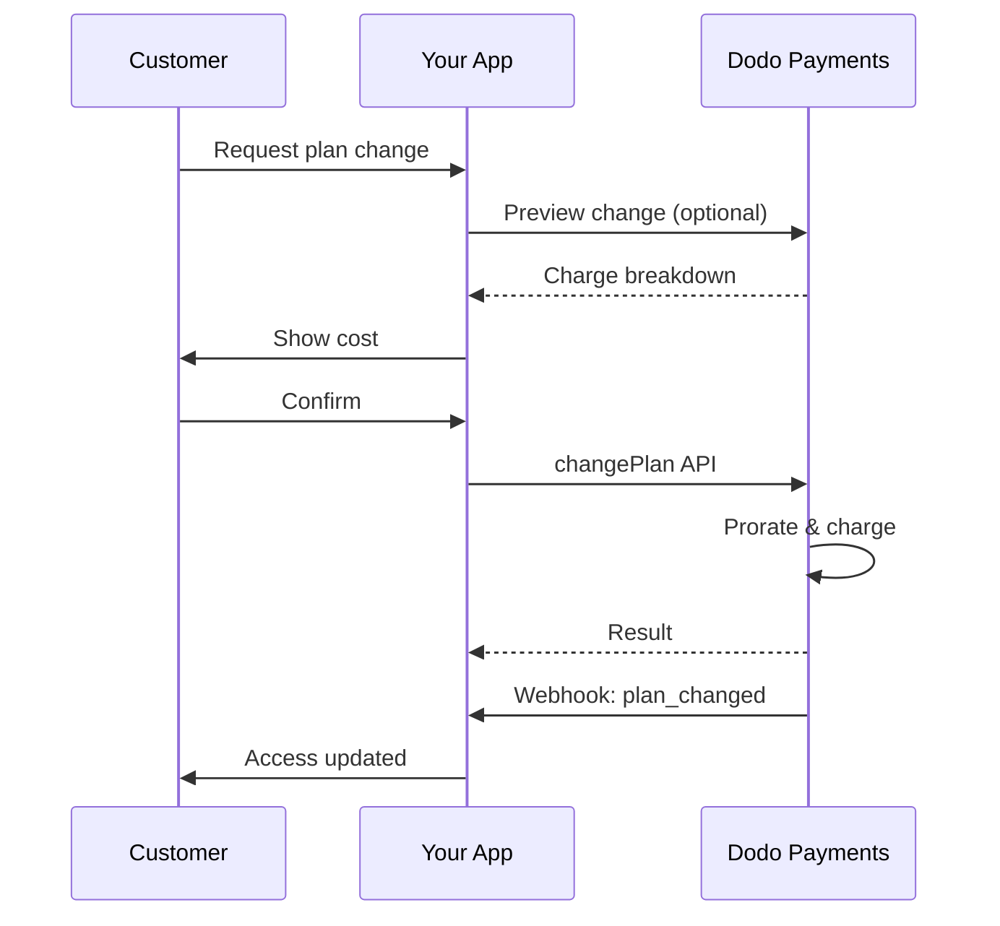
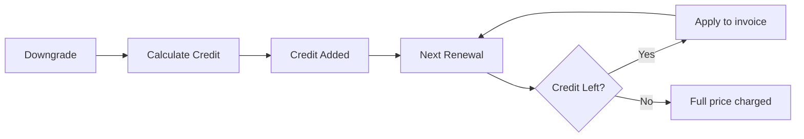
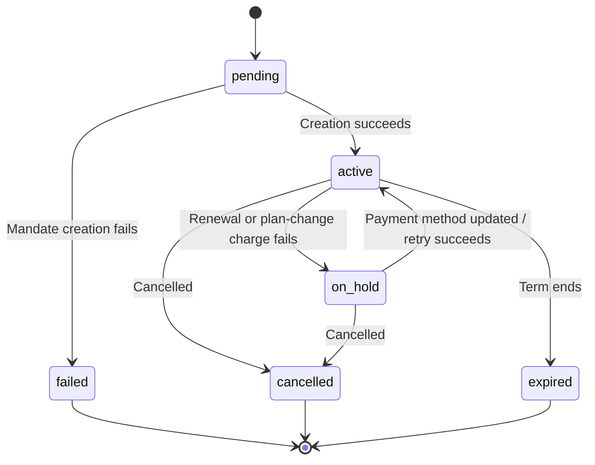

<Info>
Subscriptions let you sell ongoing access with automated renewals. Use flexible billing cycles, free trials, plan changes, and add‑ons to tailor pricing for each customer.
</Info>

<CardGroup cols={2}>
<Card title="Upgrade & Downgrade" icon="repeat" href="/developer-resources/subscription-upgrade-downgrade">
Control plan changes with proration and quantity updates.
</Card>

<Card title="On‑Demand Subscriptions" icon="bolt" href="/developer-resources/ondemand-subscriptions">
Authorize a mandate now and charge later with custom amounts.
</Card>

<Card title="Customer Portal" icon="id-card" href="/features/customer-portal">
Let customers manage plans, billing, and cancellations.
</Card>

<Card title="Subscription Webhooks" icon="code" href="/developer-resources/webhooks/intents/subscription">
React to lifecycle events like created, renewed, and canceled.
</Card>
</CardGroup>

## What Are Subscriptions?

Subscriptions are recurring products customers purchase on a schedule. They’re ideal for:

- **SaaS licenses**: Apps, APIs, or platform access
- **Memberships**: Communities, programs, or clubs
- **Digital content**: Courses, media, or premium content
- **Support plans**: SLAs, success packages, or maintenance

## Key Benefits

- **Predictable revenue**: Recurring billing with automated renewals
- **Flexible cycles**: Monthly, annual, custom intervals, and trials
- **Plan agility**: Proration for upgrades and downgrades
- **Add‑ons and seats**: Attach optional, quantifiable upgrades
- **Seamless checkout**: Hosted checkout and customer portal
- **Developer-first**: Clear APIs for creation, changes, and usage tracking

## Creating Subscriptions

Create subscription products in your Dodo Payments dashboard, then sell them through checkout or your API. Separating products from active subscriptions lets you version pricing, attach add‑ons, and track performance independently.

### Subscription product creation

Configure the fields in the dashboard to define how your subscription sells, renews, and bills. The sections below map directly to what you see in the creation form.

#### Product details

- **Product Name** (required): The display name shown in checkout, customer portal, and invoices.
- **Product Description** (required): A clear value statement that appears in checkout and invoices.
- **Product Image** (required): PNG/JPG/WebP up to 3 MB. Used on checkout and invoices.
- **Brand**: Associate the product with a specific brand for theming and emails.
- **Tax Category** (required): Choose the category (for example, SaaS) to determine tax rules.

<Tip>
Pick the most accurate tax category to ensure correct tax collection per region.
</Tip>

#### Pricing

- **定价类型**: 选择 <b>订阅</b>（本指南适用）。替代选项为单次付款和基于使用的计费。
- **价格**（必填）: 基本重复价格及货币。价格必须至少为 **$1**（或您选择货币的等值金额）。低于此最低值的金额不支持，订阅将无法工作。
- **适用折扣 (%)**: 可选，针对基本价格应用的百分比折扣；在结账和发票中体现。
- **每隔多久重复付款**（必填）: 续订的间隔，例如，每1个月。选择频率（月或年）和数量。
- **订阅期限**（必填）: 订阅保持活跃的总期限（例如，10年）。在该期限结束后，将停止续订，除非延长。
- **试用期天数**（必填）: 设置试用长度（以天为单位）。使用0以禁用试用期。试用结束时，首次收费自动发生。
- **选择附加服务**: 附加最多10个附加服务，客户可以在基本计划的同时购买这些服务。

<Warning>
Changing pricing on an active product affects new purchases. Existing subscriptions follow your plan‑change and proration settings.
</Warning>

<Info>
Add‑ons are ideal for quantifiable extras such as seats or storage. You can control allowed quantities and proration behavior when customers change them.
</Info>

#### Advanced settings

- **Tax Inclusive Pricing**: Display prices inclusive of applicable taxes. Final tax calculation still varies by customer location.
- **Generate license keys**: Issue a unique key to each customer after purchase. See the <a href="/features/license-keys">License Keys</a> guide.
- **Digital Product Delivery**: Deliver files or content automatically after purchase. Learn more in <a href="/features/digital-product-delivery">Digital Product Delivery</a>.
- **Metadata**: Attach custom key–value pairs for internal tagging or client integrations. See <a href="/api-reference/metadata">Metadata</a>.

<Tip>
Use metadata to store identifiers from your system (e.g., accountId) so you can reconcile events and invoices later.
</Tip>

## Subscription Trials

Trials let customers access subscriptions without immediate payment. The first charge occurs automatically when the trial ends.

### Configuring Trials

Set **Trial Period Days** in the product pricing section (use `0` to disable). You can override this when creating subscriptions:

```typescript
// Via subscription creation
const subscription = await client.subscriptions.create({
  customer_id: 'cus_123',
  product_id: 'prod_monthly',
  trial_period_days: 14  // Overrides product's trial period
});

// Via checkout session
const session = await client.checkoutSessions.create({
  product_cart: [{ product_id: 'prod_monthly', quantity: 1 }],
  subscription_data: { trial_period_days: 14 }
});
```

<Warning>
The `trial_period_days` value must be between 0 and 10,000 days.
</Warning>

### Detecting Trial Status

<Warning>
Currently, there is no direct field to detect trial status. The following is a workaround that requires querying payments, which is inefficient. We are working on a more efficient solution.
</Warning>

To determine if a subscription is in trial, retrieve the list of payments for the subscription. If there is exactly one payment with amount 0, the subscription is in trial period:

```typescript
const subscription = await client.subscriptions.retrieve('sub_123');
const payments = await client.payments.list({
  subscription_id: subscription.subscription_id
});

// Check if subscription is in trial
const isInTrial = payments.items.length === 1 && 
                  payments.items[0].total_amount === 0;
```

### Updating Trial Period

Extend the trial by updating `next_billing_date`:

```typescript
await client.subscriptions.update('sub_123', {
  next_billing_date: '2025-02-15T00:00:00Z'  // New trial end date
});
```

<Warning>
You cannot set `next_billing_date` to a past time. The date must be in the future.
</Warning>

## Subscription Plan Changes

Plan changes let you upgrade or downgrade subscriptions, adjust quantities, or migrate to different products. Depending on the proration mode you select, a change may trigger an immediate charge, create credit, or apply no billing adjustment.

<Tip>
You can change subscription plans and update the next billing date directly from the Dodo Payments dashboard. This provides a quick way to adjust subscriptions for customer support requests, promotional upgrades, or plan migrations without making API calls.
</Tip>

<Tip>
**Enable self-service plan changes:** Want customers to upgrade or downgrade their own subscriptions via the Customer Portal? Add your subscription products to a Product Collection and enable "Allow Subscription Updates" in your Subscription Settings.
</Tip>



<Card title="Product Collections" icon="layer-group" href="/features/product-collections">
  Group related products into collections to enable seamless upgrade/downgrade paths in the Customer Portal.
</Card>

### Proration Modes

Choose how customers are billed when changing plans:

<Info>
**Quick comparison of the four proration modes:**

| | `prorated_immediately` | `difference_immediately` | `full_immediately` | `do_not_bill` |
|---|---|---|---|---|
| **升级** | 剩余天数的按比例收费 | 收取价格差额的全额 | 收取全新计划的全额 | 无需收费 — 立即切换 |
| **降级** | 剩余天数的按比例信用 | 全额价格差作为信用 | 无信用，全额收费 | 无信用 — 立即切换 |
| **计费周期** | 重置为今天 | 重置为今天 | 重置为今天 | 保持不变 |
| **最佳用途** | 公平的基于时间的计费 | 简单的阶梯更改 | 计费周期重置 | 免费迁移或礼节性切换 |
</Info>

#### `prorated_immediately`
Charges prorated amount based on remaining time in the current billing cycle. Best for fair billing that accounts for unused time.

```typescript
await client.subscriptions.changePlan('sub_123', {
  product_id: 'prod_pro',
  quantity: 1,
  proration_billing_mode: 'prorated_immediately'
});
```

#### `difference_immediately`
Charges the price difference immediately (upgrade) or adds credit for future renewals (downgrade). Best for simple upgrade/downgrade scenarios.

```typescript
// Upgrade: charges $50 (difference between $30 and $80)
// Downgrade: credits remaining value, auto-applied to renewals
await client.subscriptions.changePlan('sub_123', {
  product_id: 'prod_pro',
  quantity: 1,
  proration_billing_mode: 'difference_immediately'
});
```

<Info>
Credits from downgrades using `difference_immediately` are subscription-scoped and auto-applied to future renewals. They're distinct from <a href="/features/credit-based-billing">Credit-Based Billing</a> entitlements.
</Info>

When a customer downgrades with `difference_immediately`, the unused value becomes a subscription-scoped credit that automatically offsets future renewals:



#### `full_immediately`
Charges full new plan amount immediately, ignoring remaining time. Best for resetting billing cycles.

```typescript
await client.subscriptions.changePlan('sub_123', {
  product_id: 'prod_monthly',
  quantity: 1,
  proration_billing_mode: 'full_immediately'
});
```

#### `do_not_bill`
Switches to the new plan without any billing adjustment. No proration charges, no credits — the customer simply moves to the new plan. Best for courtesy migrations, free plan switches, or scenarios where you want to absorb the cost difference.

```typescript
await client.subscriptions.changePlan('sub_123', {
  product_id: 'prod_new_plan',
  quantity: 1,
  proration_billing_mode: 'do_not_bill'
});
```

<AccordionGroup>
<Accordion title="Example: Prorated upgrade calculation">

**Scenario**: Customer on Basic ($30/month) upgrades to Pro ($80/month) on day 16 of a 30-day cycle using `prorated_immediately`.

```
Unused credit from Basic = $30 × (15 remaining / 30 total) = $15.00
Prorated cost of Pro     = $80 × (15 remaining / 30 total) = $40.00
────────────────────────────────────────────────────────────────────
Immediate charge         = $40.00 − $15.00 = $25.00
```

下一次续订日期为**2月15日**（1月16日 + 30天）：**$80.00/月**。

<Tip>
For more detailed calculation examples and edge cases, see our full [Upgrade & Downgrade Guide](/developer-resources/subscription-upgrade-downgrade).
</Tip>

</Accordion>
<Accordion title="Example: Downgrade credit calculation">

**Scenario**: Customer on Pro ($80/month) downgrades to Starter ($20/month) using `difference_immediately`.

```
Credit = Old plan − New plan = $80 − $20 = $60.00
```

The $60 credit auto-applies to future renewals:
- Renewal 1: $20 − $20 (credit) = **$0.00** ($40 credit remaining)
- Renewal 2: $20 − $20 (credit) = **$0.00** ($20 credit remaining)  
- Renewal 3: $20 − $20 (credit) = **$0.00** (credit exhausted)
- Renewal 4: **$20.00** (full price)

<Info>
Learn more about how credits are managed in the [Upgrade & Downgrade Guide](/developer-resources/subscription-upgrade-downgrade).
</Info>

</Accordion>
</AccordionGroup>

### Changing Plans with Add-ons

Modify add-ons when changing plans. Add-ons are included in proration calculations:

```typescript
await client.subscriptions.changePlan('sub_123', {
  product_id: 'prod_pro',
  quantity: 1,
  proration_billing_mode: 'difference_immediately',
  addons: [{ addon_id: 'addon_extra_seats', quantity: 2 }]  // Add add-ons
  // addons: []  // Empty array removes all existing add-ons
});
```

<Info>
Plan changes trigger immediate charges. Failed charges may move the subscription to `on_hold` status. Track changes via `subscription.plan_changed` webhook events.
</Info>

### Previewing Plan Changes

Before committing to a plan change, preview the exact charge and resulting subscription:

```typescript
const preview = await client.subscriptions.previewChangePlan('sub_123', {
  product_id: 'prod_pro',
  quantity: 1,
  proration_billing_mode: 'prorated_immediately'
});

// Show customer the charge before confirming
console.log('You will be charged:', preview.immediate_charge.summary);
```

<Card title="Preview Change Plan API" icon="eye" href="/api-reference/subscriptions/preview-change-plan">
  Preview plan changes before committing to them.
</Card>

## Subscription States

订阅在其生命周期中会经历一组定义的状态。本表提供每个状态的参考，其原因，以及您可以如何（或是否）恢复它。

| 状态 | 含义 | 可恢复？ | 恢复路径 / 下一步 |
|--------|---------------|--------------|---------------------------|
| `pending` | 订阅正在创建或处理 | — | 等待 `subscription.active`（或 `subscription.failed`）|
| `active` | 订阅处于活动状态并会自动续订 | — | 无需操作 |
| `on_hold` | 续订付款（或计划更改费用）失败；订阅已暂停 | **是** | 更新支付方式以重新激活 - 自动通过[支付重试](/features/recovery/payment-retries)和[扣款](/features/recovery/subscription-dunning)，或手动通过[更新支付方式API](/api-reference/subscriptions/update-payment-method) |
| `cancelled` | 订阅已取消且不会续订 | 仅可重新购买 | 客户需开始新订阅；[扣款](/features/recovery/subscription-dunning)可以提示重新购买 |
| `failed` | 订阅**创建**失败（初始授权或付款未成功） | **否 — 终态** | 客户需使用有效的支付方式创建新订阅 |
| `expired` | 订阅已到期 | — | 如果需要，客户需启动新订阅 |

<Warning>
`on_hold` 和 `failed` 经常被混淆。`on_hold` 是一个**可恢复**的状态，针对的是已激活的订阅，其续订失败。`failed` 是一个**终态**，仅发生在**初始**订阅创建失败时，无法重新激活。
</Warning>

### 状态机



### 暂停状态

订阅进入 `on_hold` 状态时：

- 续订付款失败（资金不足、卡片过期等）
- 计划更改费用失败
- 支付方式授权失败

<Warning>
订阅处于 `on_hold` 状态时，不会自动续订。您必须更新支付方式以重新激活订阅。
</Warning>

### 从暂停状态重新激活

要从 `on_hold` 状态重新激活订阅，更新支付方式。这会自动：

1. 为未付金额创建扣款
2. 生成发票
3. 使用新支付方式处理付款
4. 成功付款后将订阅重新激活到 `active` 状态

```typescript
// Reactivate subscription from on_hold
const response = await client.subscriptions.updatePaymentMethod('sub_123', {
  payment_method: {
    type: 'new',
    return_url: 'https://example.com/return'
  }
});

// For on_hold subscriptions, a charge is automatically created
if (response.payment_id) {
  console.log('Charge created:', response.payment_id);
  // Redirect customer to response.payment_link to complete payment
  // Monitor webhooks for payment.succeeded and subscription.active
}
```

<Info>
成功更新 `on_hold` 状态订阅的支付方式后，您将收到 `payment.succeeded` 随后是 `subscription.active` 的 Webhook 事件。
</Info>

### 按转换发送的 Webhook 事件

每次转换都会发出一个 Webhook，因此您可以在无需轮询的情况下驱动授权逻辑：

| 转换 | 事件 |
|------------|-------|
| 订阅激活 | `subscription.active` |
| 续订成功 | `subscription.renewed` |
| 续订失败 → 暂停 | `subscription.on_hold` |
| 创建失败 | `subscription.failed` |
| 计划升级/降级 | `subscription.plan_changed` |
| 已取消 | `subscription.cancelled` |
| 期限结束 | `subscription.expired` |
| 任一字段更改 | `subscription.updated` |

<Card title="Subscription Webhook Payloads" icon="webhook" href="/developer-resources/webhooks/intents/subscription">
查看订阅生命周期事件的完整负载架构。
</Card>

## API 管理

<AccordionGroup>
<Accordion title="Create subscriptions">
使用 `POST /subscriptions` 从产品中以编程方式创建订阅，带有可选的试用期和附加组件。

<Card title="API Reference" icon="code" href="/api-reference/subscriptions/post-subscriptions">
查看创建订阅的 API。
</Card>
</Accordion>

<Accordion title="Update subscriptions">
使用 `PATCH /subscriptions/{id}` 更新数量、在下一个计费日期取消或修改元数据。

<Card title="API Reference" icon="code" href="/api-reference/subscriptions/patch-subscriptions">
了解如何更新订阅详细信息。
</Card>
</Accordion>

<Accordion title="Change plans (proration)">
使用比例分配控制更改活动产品和数量。

<Card title="API Reference" icon="code" href="/api-reference/subscriptions/change-plan">
查看计划更改选项。
</Card>
</Accordion>

<Accordion title="On‑demand charges">
对于按需订阅，按需收取特定金额。

<Card title="API Reference" icon="code" href="/api-reference/subscriptions/create-charge">
收取按需订阅费用。
</Card>
</Accordion>

<Accordion title="List and retrieve">
使用 `GET /subscriptions` 列出所有订阅，使用 `GET /subscriptions/{id}` 检索一个订阅。

<Card title="API Reference" icon="code" href="/api-reference/subscriptions/get-subscriptions">
浏览列表和检索 API。
</Card>
</Accordion>

<Accordion title="Usage history">
获取按量计费或混合定价模型的记录使用情况。

<Card title="API Reference" icon="code" href="/api-reference/subscriptions/get-usage-history">
查看使用历史 API。
</Card>
</Accordion>

<Accordion title="Update payment method">
更新订阅的支付方式。对于活动订阅，这会更新未来续订的支付方式。对于处于 `on_hold` 状态的订阅，这会通过为剩余金额创建扣款来重新激活订阅。

当生成新的支付方式链接（`New` 请求类型）时，您可以传递 `allowed_payment_method_types` 来限制客户在该页面上看到的支付方式。客户永远不会看到列表中没有的方法，虽然包括一种方法并不保证它会出现（可用性仍然取决于客户位置和您的业务设置等因素）。

<Card title="API Reference" icon="code" href="/api-reference/subscriptions/update-payment-method">
了解如何更新支付方式并重新激活订阅。
</Card>
</Accordion>
</AccordionGroup>

## 常见使用案例

- **SaaS 和 API**：提供分级访问及增加席位或用量的附加组件
- **内容和媒体**：每月访问，带有入门试用
- **B2B 支持计划**：年度合同，带有高级支持附加组件
- **工具和插件**：许可证密钥和版本发布

## 集成示例

### 结帐会话（订阅）
创建结帐会话时，请包含您的订阅产品和可选的附加组件：

```typescript
const session = await client.checkoutSessions.create({
  product_cart: [
    {
      product_id: 'prod_subscription',
      quantity: 1
    }
  ]
});
```

### 具有比例分配的计划更改
升级或降级订阅并控制比例分配行为：

```typescript
await client.subscriptions.changePlan('sub_123', {
  product_id: 'prod_new',
  quantity: 1,
  proration_billing_mode: 'difference_immediately'
});
```

### 在下一个计费日期取消
安排在当前计费周期结束时生效的取消：

```typescript
await client.subscriptions.update('sub_123', {
  cancel_at_next_billing_date: true
});
```

### 延长订阅期限
通过传递新的 `subscription_period_count` 和 `subscription_period_interval` 到 `PATCH /subscriptions/{id}` 来延长订阅的运行时间。订阅的到期时间将根据新的计数和间隔重新计算——例如，给予客户当前计划的额外时间：

```typescript
await client.subscriptions.update('sub_123', {
  subscription_period_count: 5,
  subscription_period_interval: 'Month'
});
```

<Note>
订阅的期限只能**增加**，不能缩短。
</Note>

### 按需订阅
创建按需订阅，并在需要时收费：

```typescript
const onDemand = await client.subscriptions.create({
  customer_id: 'cus_123',
  product_id: 'prod_on_demand',
  on_demand: { mandate_only: true }
});

await client.subscriptions.charge(onDemand.id, {
  product_price: 4900,
  product_currency: 'USD',
  product_description: 'Extra usage for September'
});
```

### 更新活动订阅的付款方式
更新活动订阅的付款方式：

```typescript
// Update with new payment method
const response = await client.subscriptions.updatePaymentMethod('sub_123', {
  payment_method: {
    type: 'new',
    return_url: 'https://example.com/return'
  }
});

// Or use existing payment method
await client.subscriptions.updatePaymentMethod('sub_123', {
  payment_method: {
    type: 'existing',
    payment_method_id: 'pm_abc123'
  }
});
```

### 从 on_hold 中重新激活订阅
重新激活因付款失败而暂停的订阅：

```typescript
// Update payment method - automatically creates charge for remaining dues
const response = await client.subscriptions.updatePaymentMethod('sub_123', {
  payment_method: {
    type: 'new',
    return_url: 'https://example.com/return'
  }
});

if (response.payment_id) {
  // Charge created for remaining dues
  // Redirect customer to response.payment_link
  // Monitor webhooks: payment.succeeded → subscription.active
}
```

## 符合 RBI 规定的订阅

  UPI 和印度卡订阅在符合印度储备银行 (RBI) 的法规下运行，并具有特定的授权要求：

  ### 授权限制

  授权类型和金额取决于您的订阅的周期性费用：

  - **低于授权底限（默认为 ₹15,000）的费用：** 我们为底限金额创建一个按需授权。根据您的订阅频率定期收取订阅金额，直至达到授权限额。
  - **费用等于或超过授权底限：** 我们为确切的订阅金额创建一个订阅授权（或按需授权）。

  授权底限可按商家或请求通过 `mandate_min_amount_inr_paise` （以印度卢比派士为单位）配置。向银行注册的金额为 `max(mandate_floor, billing_amount)` ——因此当账单更低时，底限实际上成为客户可见的授权上限。

有关符合 RBI 规定的授权和印度支付方式的可配置授权底限的详细信息，请参阅 <a href="/features/payment-methods/india#configurable-mandate-floor">India Payment Methods</a> 页面。

  ### 升级和降级注意事项

  **重要：** 在升级或降级订阅时，请仔细考虑授权限额：

  - 如果升级/降级导致收费金额超过 ₹15,000 并超过现有的按需付款限额，则交易费用可能会失败。
  - 在这种情况下，客户可能需要更新其付款方式或再次更改订阅，以建立具有正确限额的新授权。

  ### 高额费用的授权

  对于 ₹15,000 或更多的订阅费用：

  - 客户将被其银行提示授权交易。
  - 如果客户未能授权交易，交易将失败，订阅将被暂停。

  ### 48 小时处理延迟

  **处理时间线：** 印度卡和 UPI 订阅的周期性费用遵循独特的处理模式：

  - 根据您的订阅频率在计划日期**启动**费用。
  - 从付款启动后 **48 小时** 起才从客户账户中实际**扣除**。
  - 此 48 小时窗口可能会根据银行的 API 响应延长 **2-3 小时**。

  ### 授权取消窗口

  在 48 小时的处理窗口内：

  - 客户可以通过其银行应用取消授权。
  - 如果客户在此期间取消授权，订阅将保持**活动**（这是印度卡和 UPI AutoPay 订阅特有的极端情况）。
  - 但是，实际扣款可能会失败，在这种情况下，我们将把订阅设置为**暂停**。

  **极端情况处理：** 如果您在费用启动后立即为客户提供福利、积分或订阅使用权限，您需要在应用中适当处理这个 48 小时窗口。考虑以下做法：

  - 延迟福利激活直到付款确认
  - 实施宽限期或临时访问
  - 监控订阅状态以防授权取消
  - 在您的应用逻辑中处理订阅暂停状态

  <Tip>
  监控订阅 webhook 以跟踪付款状态的变化，并处理授权在 48 小时窗口内取消的极端情况。
  </Tip>

## 最佳实践

- **从清晰的层级开始**：2-3 个计划，区别明显
- **沟通价格**：显示总额、按比例分摊和下次续订时间
- **谨慎使用试用期**：通过入门转换用户，而不仅仅是时间
- **利用附加功能**：保持基础计划简单，向上销售额外功能
- **测试更改**：在测试模式下验证计划更改和按比例分摊

<Info>
订阅是产生经常性收入的灵活基础。简化开始，充分测试，然后根据采纳率、流失率和扩展指标进行迭代。
</Info>