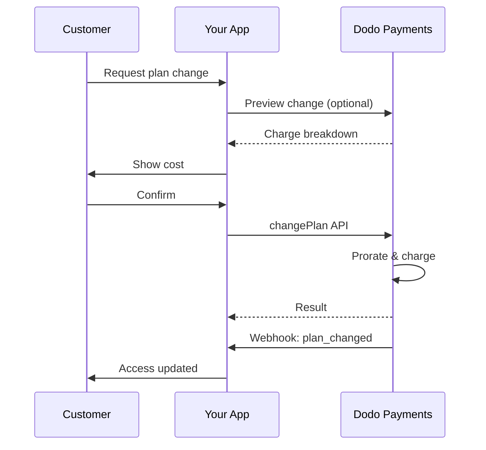
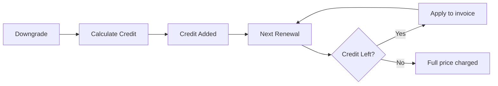

<Info>
订阅让您销售持续访问并自动续订。使用灵活的计费周期、免费试用、计划变更和附加组件，为每位客户定制价格。
</Info>

<CardGroup cols={2}>
<Card title="Upgrade & Downgrade" icon="repeat" href="/developer-resources/subscription-upgrade-downgrade">
通过按比例计费和数量更新来控制计划变更。
</Card>

<Card title="On‑Demand Subscriptions" icon="bolt" href="/developer-resources/ondemand-subscriptions">
现在授权 mandate，稍后按照自定义金额收费。
</Card>

<Card title="Customer Portal" icon="id-card" href="/features/customer-portal">
让客户自行管理计划、计费和取消。
</Card>

<Card title="Subscription Webhooks" icon="code" href="/developer-resources/webhooks/intents/subscription">
响应诸如创建、续订和取消等生命周期事件。
</Card>
</CardGroup>

## 什么是订阅？

订阅是客户按计划购买的定期产品。它们非常适合：

- **SaaS 许可证**：应用程序、API 或平台访问
- **会员**：社区、项目或俱乐部
- **数字内容**：课程、媒体或高级内容
- **支持计划**：服务水平协议、成功包或维护

## 主要好处

- **可预测的收入**：定期计费与自动续订
- **灵活的周期**：每月、每年、自定义间隔和试用
- **计划灵活性**：升级和降级的按比例计费
- **附加选项和席位**：附加可选的、可量化的升级
- **无缝结账**：托管结账和客户门户
- **以开发者为先**：清晰的 API 用于创建、变更和使用跟踪

## 创建订阅

在您的 Dodo Payments 仪表板中创建订阅产品，然后通过结账或 API 销售它们。将产品与活动订阅分开可以让您独立版本定价、附加选项和跟踪性能。

### 订阅产品创建

在仪表板中配置字段，以定义您的订阅如何销售、续订和计费。以下部分直接映射到您在创建表单中看到的内容。

#### 产品详情

- **产品名称**（必填）：在结账、客户门户和发票中显示的名称。
- **产品描述**（必填）：在结账和发票中显示的清晰价值声明。
- **产品图片**（必填）：PNG/JPG/WebP，最大 3 MB。用于结账和发票。
- **品牌**：将产品与特定品牌关联，以便于主题和电子邮件。
- **税务类别**（必填）：选择类别（例如，SaaS）以确定税务规则。

<Tip>
选择最准确的税收类别，以确保按地区正确征税。
</Tip>

#### 定价

- **定价类型**：选择 <b>订阅</b>（本指南）。其他选项包括一次性付款和基于使用的计费。
- **价格**（必填）：基础定期价格及其货币。
- **适用折扣 (%)**：可选的百分比折扣，适用于基础价格；在结账和发票中反映。
- **每次重复付款**（必填）：续订的间隔，例如，每 1 个月。选择节奏（按月或按年）和数量。
- **订阅期限**（必填）：订阅保持有效的总期限（例如，10 年）。在此期限结束后，除非延长，否则续订将停止。
- **试用期天数**（必填）：设置试用长度（以天为单位）。使用 0 禁用试用。试用结束时会自动进行第一次收费。
- **选择附加组件**：最多附加 10 个客户可以与基础计划一起购买的附加组件。

<Warning>
更改活动产品的定价会影响新购买。现有订阅将遵循您的计划变更和按比例设定。
</Warning>

<Info>
附加组件非常适合可量化的额外项目，如席位或存储。您可以在客户更改时控制允许的数量和按比例行为。
</Info>

#### 高级设置

- **含税定价**：显示包含适用税款的价格。最终税款计算仍然因客户位置而异。
- **生成许可证密钥**：在购买后向每位客户发放唯一密钥。请参阅 <a href="/features/license-keys">许可证密钥</a> 指南。
- **数字产品交付**：在购买后自动交付文件或内容。了解更多信息，请参阅 <a href="/features/digital-product-delivery">数字产品交付</a>。
- **元数据**：附加自定义键值对以进行内部标记或客户集成。请参阅 <a href="/api-reference/metadata">元数据</a>。

<Tip>
使用元数据存储来自您系统的标识符（例如 accountId），以便稍后对事件和发票进行对账。
</Tip>

## 订阅试用

试用让客户在没有立即付款的情况下访问订阅。试用结束时会自动进行第一次收费。

### 配置试用

在产品定价部分设置 **Trial Period Days**（使用 `0` 以禁用）。创建订阅时可以覆盖此设置：

```typescript
// Via subscription creation
const subscription = await client.subscriptions.create({
  customer_id: 'cus_123',
  product_id: 'prod_monthly',
  trial_period_days: 14  // Overrides product's trial period
});

// Via checkout session
const session = await client.checkoutSessions.create({
  product_cart: [{ product_id: 'prod_monthly', quantity: 1 }],
  subscription_data: { trial_period_days: 14 }
});
```

<Warning>
`trial_period_days` 的值必须介于 0 到 10,000 天之间。
</Warning>

### 检测试用状态

<Warning>
目前没有直接字段来检测试用状态。以下是一个需要查询付款的解决方法，效率较低。我们正在研究更高效的方案。
</Warning>

要确定订阅是否在试用中，请检索该订阅的付款列表。如果有且仅有一笔金额为 0 的付款，则该订阅处于试用期：

```typescript
const subscription = await client.subscriptions.retrieve('sub_123');
const payments = await client.payments.list({
  subscription_id: subscription.subscription_id
});

// Check if subscription is in trial
const isInTrial = payments.items.length === 1 && 
                  payments.items[0].total_amount === 0;
```

### 更新试用期

通过更新 `next_billing_date` 来延长试用期：

```typescript
await client.subscriptions.update('sub_123', {
  next_billing_date: '2025-02-15T00:00:00Z'  // New trial end date
});
```

<Warning>
不能将 `next_billing_date` 设置为过去的时间。日期必须位于未来。
</Warning>

## 订阅计划变更

计划变更使您可以升级或降级订阅、调整数量或迁移到不同的产品。根据您选择的按比例模式，变更可能会触发即时收费、产生信用或不进行任何计费调整。

<Tip>
您可以直接在 Dodo Payments 仪表板更改订阅计划并更新下一次账单日期。这为客户支持请求、促销升级或计划迁移提供了一种无需调用 API 的快速调整方式。
</Tip>

<Tip>
**启用自助计划变更：** 想让客户通过客户门户自行升级或降级订阅？将订阅产品添加到产品集合，并在订阅设置中启用“允许订阅更新”。
</Tip>



<Card title="Product Collections" icon="layer-group" href="/features/product-collections">
  将相关产品分组到集合中，以在客户门户中实现无缝的升级/降级路径。
</Card>

### 按比例模式

选择客户更改计划时的计费方式：

<Info>
**四种按比例模式的快速比较：**

| | `prorated_immediately` | `difference_immediately` | `full_immediately` | `do_not_bill` |
|---|---|---|---|---|
| **升级** | 剩余天数的按比例收费 | 收取全价差额 | 收取全新计划价格 | 无收费 — 立即切换 |
| **降级** | 剩余天数的按比例信用 | 全价差额作为信用 | 无信用，全额收费 | 无信用 — 立即切换 |
| **计费周期** | 保持不变 | 保持不变 | 重置为今天 | 保持不变 |
| **最佳用例** | 公平的基于时间的计费 | 简单的层级变化 | 计费周期重置 | 免费迁移或礼貌性切换 |
</Info>

#### `prorated_immediately`
根据当前账单周期剩余时间按比例计费。最适合基于剩余时间的公平计费。

```typescript
await client.subscriptions.changePlan('sub_123', {
  product_id: 'prod_pro',
  quantity: 1,
  proration_billing_mode: 'prorated_immediately'
});
```

#### `difference_immediately`
立即收取价格差额（升级）或为未来续订增加信用（降级）。最适合简单的升级/降级场景。

```typescript
// Upgrade: charges $50 (difference between $30 and $80)
// Downgrade: credits remaining value, auto-applied to renewals
await client.subscriptions.changePlan('sub_123', {
  product_id: 'prod_pro',
  quantity: 1,
  proration_billing_mode: 'difference_immediately'
});
```

<Info>
使用 `difference_immediately` 降级获得的额度是订阅范围内的，并会自动应用于未来的续订。它们与<a href="/features/credit-based-billing">Credit-Based Billing</a> 的权益不同。
</Info>

当客户使用 `difference_immediately` 降级时，未使用的价值会成为订阅范围内的信用，自动抵消未来续订：



#### `full_immediately`
立即收取新计划全额，忽略剩余时间。最适合重置计费周期。

```typescript
await client.subscriptions.changePlan('sub_123', {
  product_id: 'prod_monthly',
  quantity: 1,
  proration_billing_mode: 'full_immediately'
});
```

#### `do_not_bill`
切换到新计划而无需任何计费调整。无按比例收费，无信用 — 客户仅转换到新计划。最适用于礼貌性迁移、免费计划切换或您希望承担成本差异的情况。

```typescript
await client.subscriptions.changePlan('sub_123', {
  product_id: 'prod_new_plan',
  quantity: 1,
  proration_billing_mode: 'do_not_bill'
});
```

<AccordionGroup>
<Accordion title="Example: Prorated upgrade calculation">

**场景**：在 30 天周期第 16 天，客户从 Basic ($30/月) 升级到 Pro ($80/月) 使用 `prorated_immediately`。

```
Unused credit from Basic = $30 × (15 remaining / 30 total) = $15.00
Prorated cost of Pro     = $80 × (15 remaining / 30 total) = $40.00
────────────────────────────────────────────────────────────────────
Immediate charge         = $40.00 − $15.00 = $25.00
```

原始计费日期的下次续订：**$80.00/月**。

<Tip>
有关更详细的计算示例和极端情况，请参阅我们的完整 [升级和降级指南](/developer-resources/subscription-upgrade-downgrade)。
</Tip>

</Accordion>
<Accordion title="Example: Downgrade credit calculation">

**场景**：使用 `difference_immediately`，客户从 Pro ($80/月) 降级到 Starter ($20/月)。

```
Credit = Old plan − New plan = $80 − $20 = $60.00
```

$60 信用自动应用于未来续订：
- 续订 1：$20 − $20 (信用) = **$0.00** ($40 信用剩余)
- 续订 2：$20 − $20 (信用) = **$0.00** ($20 信用剩余)  
- 续订 3：$20 − $20 (信用) = **$0.00** (信用耗尽)
- 续订 4：**$20.00** (全价)

<Info>
了解有关信用管理的更多信息，请参阅 [升级和降级指南](/developer-resources/subscription-upgrade-downgrade)。
</Info>

</Accordion>
</AccordionGroup>

### 更改附加组件计划

更改计划时修改附加组件。附加组件包括在按比例计算中：

```typescript
await client.subscriptions.changePlan('sub_123', {
  product_id: 'prod_pro',
  quantity: 1,
  proration_billing_mode: 'difference_immediately',
  addons: [{ addon_id: 'addon_extra_seats', quantity: 2 }]  // Add add-ons
  // addons: []  // Empty array removes all existing add-ons
});
```

<Info>
计划变更会触发即时收费。失败的收费可能会使订阅转为 `on_hold` 状态。通过 `subscription.plan_changed` webhook 事件跟踪变更。
</Info>

### 预览计划变更

在提交计划变更之前，预览精确的费用和结果订阅：

```typescript
const preview = await client.subscriptions.previewChangePlan('sub_123', {
  product_id: 'prod_pro',
  quantity: 1,
  proration_billing_mode: 'prorated_immediately'
});

// Show customer the charge before confirming
console.log('You will be charged:', preview.immediate_charge.summary);
```

<Card title="Preview Change Plan API" icon="eye" href="/api-reference/subscriptions/preview-change-plan">
  在提交之前预览计划变更。
</Card>

## 订阅状态

订阅在其生命周期中可以处于不同的状态：

- **`active`**：订阅处于活动状态并将自动续订
- **`on_hold`**：因付款失败，订阅暂停。需要更新付款方式以重新激活
- **`cancelled`**：订阅已取消，不再续订
- **`expired`**：订阅已到达其结束日期
- **`pending`**：订阅正在创建或处理中

### 暂停状态

当订阅进入 `on_hold` 状态时：

- 更新付款失败（资金不足、卡过期等）
- 计划变更收费失败
- 付款方式授权失败

<Warning>
当订阅处于 `on_hold` 状态时，它不会自动续订。您必须更新付款方式以重新激活订阅。
</Warning>

### 从暂停状态重新激活

要从 `on_hold` 状态重新激活订阅，请更新付款方式。这会自动：

1. 为剩余款项创建收费
2. 生成发票
3. 使用新付款方式进行付款
4. 支付成功后将订阅重新激活为 `active` 状态

```typescript
// Reactivate subscription from on_hold
const response = await client.subscriptions.updatePaymentMethod('sub_123', {
  type: 'new',
  return_url: 'https://example.com/return'
});

// For on_hold subscriptions, a charge is automatically created
if (response.payment_id) {
  console.log('Charge created:', response.payment_id);
  // Redirect customer to response.payment_link to complete payment
  // Monitor webhooks for payment.succeeded and subscription.active
}
```

<Info>
成功更新 `on_hold` 订阅的付款方式后，您将收到 `payment.succeeded` 随后是 `subscription.active` webhook 事件。
</Info>

## API 管理

<AccordionGroup>
{/* LOCKED_PATTERN_90c830137a1db85369b1d7f3d01ae82f*/}
使用 `POST /subscriptions` 从产品中以编程方式创建订阅，附带可选的试用和附加组件。

{/*LOCKED_PATTERN_80e2d112f65019b30c4a8db2b540611a */}
查看创建订阅的API。
{/*LOCKED_PATTERN_4ceaf3811b39bde3b7bfedbcf0487a0b */}
{/*LOCKED_PATTERN_aae63d8bf6b6da4ac6fb501e13691e4d */}

{/*LOCKED_PATTERN_7db9c1f9990c40bba57aa6671f00c67e */}
使用 `PATCH /subscriptions/{id}` 更新数量、在下一个计费日期取消或修改元数据。

{/*LOCKED_PATTERN_adf0aff0c53ede544a3b9267991da09d */}
了解如何更新订阅详细信息。
{/*LOCKED_PATTERN_4ceaf3811b39bde3b7bfedbcf0487a0b */}
{/*LOCKED_PATTERN_aae63d8bf6b6da4ac6fb501e13691e4d */}

{/*LOCKED_PATTERN_c014ed82995c82db7ff5269f5df46531 */}
通过按比例控制更改活动产品和数量。

{/*LOCKED_PATTERN_afa3d1700c97ae5510a3b95972626011 */}
查看计划变更选项。
{/*LOCKED_PATTERN_4ceaf3811b39bde3b7bfedbcf0487a0b */}
{/*LOCKED_PATTERN_aae63d8bf6b6da4ac6fb501e13691e4d */}

{/*LOCKED_PATTERN_e4be3d5898d68fb2f2f5f0e8fdf83e30 */}
对于按需订阅，根据需要收费。

{/*LOCKED_PATTERN_6a5c708696bc00ef7568a4d6821875e9 */}
对按需订阅收费。
{/*LOCKED_PATTERN_4ceaf3811b39bde3b7bfedbcf0487a0b */}
{/*LOCKED_PATTERN_aae63d8bf6b6da4ac6fb501e13691e4d */}

{/*LOCKED_PATTERN_ea724d9cdc0d6cfdcd00675dcff1781c */}
使用 `GET /subscriptions` 列出所有订阅，使用 `GET /subscriptions/{id}` 检索一个。

{/*LOCKED_PATTERN_4728f8e0407f9ffad5b85b7c77f6a7a1 */}
浏览列表和检索API。
{/*LOCKED_PATTERN_4ceaf3811b39bde3b7bfedbcf0487a0b */}
{/*LOCKED_PATTERN_aae63d8bf6b6da4ac6fb501e13691e4d */}

{/*LOCKED_PATTERN_7f09c790a6d7f4120accee35e87f16ba */}
获取已记录使用情况，用于计量或混合定价模型。

{/*LOCKED_PATTERN_f3047e02844ecc96a820a081613f8e53 */}
查看使用历史API。
{/*LOCKED_PATTERN_4ceaf3811b39bde3b7bfedbcf0487a0b */}
{/*LOCKED_PATTERN_aae63d8bf6b6da4ac6fb501e13691e4d */}

{/*LOCKED_PATTERN_ccdbd0043049c6f6310fb5a44a412ebf */}
更新订阅的付款方式。对于活跃的订阅，这将更新未来续订的付款方式。对于处于 `on_hold` 状态的订阅，这将通过为剩余费用创建收费来重新激活订阅。

{/*LOCKED_PATTERN_d8ea2b81f4bc1c8e6e864e29c8b258c6 */}
了解如何更新付款方式并重新激活订阅。
{/*LOCKED_PATTERN_4ceaf3811b39bde3b7bfedbcf0487a0b */}
{/*LOCKED_PATTERN_aae63d8bf6b6da4ac6fb501e13691e4d */}
{/*LOCKED_PATTERN_7a451aee1061c1cf2a4108f13acbafff */}

## 常见用例

- **SaaS 和 API**：分级访问，附加座位或使用
- **内容与媒体**：每月访问，配有介绍性试用
- **B2B 支持计划**：年度合同，配有高级支持附加组件
- **工具和插件**：许可证密钥和版本发布

## 集成示例

### 结帐会话（订阅）
创建结帐会话时，包括您的订阅产品和可选附加组件：

```typescript
const session = await client.checkoutSessions.create({
  product_cart: [
    {
      product_id: 'prod_subscription',
      quantity: 1
    }
  ]
});
```

### 带有按比例的计划变更
升级或降级订阅并控制按比例行为：

```typescript
await client.subscriptions.changePlan('sub_123', {
  product_id: 'prod_new',
  quantity: 1,
  proration_billing_mode: 'difference_immediately'
});
```

### 在下一个计费日期取消
安排在当前计费期结束时生效的取消：

```typescript
await client.subscriptions.update('sub_123', {
  cancel_at_next_billing_date: true
});
```

### 按需订阅
创建按需订阅，并在需要时稍后收费：

```typescript
const onDemand = await client.subscriptions.create({
  customer_id: 'cus_123',
  product_id: 'prod_on_demand',
  on_demand: true
});

await client.subscriptions.createCharge(onDemand.id, {
  amount: 4900,
  currency: 'USD',
  description: 'Extra usage for September'
});
```

### 更新活动订阅的付款方式
更新活动订阅的付款方式：

```typescript
// Update with new payment method
const response = await client.subscriptions.updatePaymentMethod('sub_123', {
  type: 'new',
  return_url: 'https://example.com/return'
});

// Or use existing payment method
await client.subscriptions.updatePaymentMethod('sub_123', {
  type: 'existing',
  payment_method_id: 'pm_abc123'
});
```

### 从暂停状态重新激活订阅
重新激活因付款失败而暂停的订阅：

```typescript
// Update payment method - automatically creates charge for remaining dues
const response = await client.subscriptions.updatePaymentMethod('sub_123', {
  type: 'new',
  return_url: 'https://example.com/return'
});

if (response.payment_id) {
  // Charge created for remaining dues
  // Redirect customer to response.payment_link
  // Monitor webhooks: payment.succeeded → subscription.active
}
```

## 符合RBI规定的订阅

  UPI 和印度卡订阅根据 RBI（印度储备银行）法规进行操作，具有特定的授权要求：

  ### 授权限制

  授权类型和金额取决于您订阅的定期收费：

  - **收费低于 15,000 卢比：**我们创建印度卢比 15,000 的按需授权。根据您的订阅频率，订阅金额会定期收取，直至达到授权限额。
  - **收费为 15,000 卢比或以上：**我们为确切的订阅金额创建一个订阅授权（或按需授权）。

有关印度支付方式的符合 RBI 合规授权的详细信息，请参阅 <a href="/features/payment-methods/india">印度支付方式</a>页面。

  ### 升级和降级注意事项

  **重要：**在升级或降级订阅时，务必仔细考虑授权限制：

  - 如果升级/降级导致费用金额超过 15,000 卢比并超出现有的按需支付限额，可能会导致交易失败。
  - 在这种情况下，客户可能需要更新其付款方式，或者再次更改订阅以建立新的正确限额授权。

  ### 高价值收费的授权

  对于15,000卢比或以上的订阅费用：

  - 客户将被其银行提示授权交易。
  - 如果客户未能授权交易，则交易将失败，订阅将被暂停。

  ### 48小时处理延迟

  **处理时间线：**印度卡和 UPI 订阅的定期费用遵循独特的处理模式：

  - 根据您的订阅频率，费用将在计划日期**启动**。
  - 从付款启动到客户账户的实际**扣款**需要 **48 小时**。
  - 根据银行 API 响应，这个 48 小时窗口可能会延长到 **2-3 小时**。

  ### 授权取消窗口

  在48小时处理期间：

  - 客户可以通过他们的银行应用程序取消授权。
  - 如果客户在此期间取消授权，订阅将保持**活跃**（这是印度卡和 UPI 自动支付的特定边缘情况）。
  - 但是，实际扣款可能会失败，在这种情况下，我们将暂停订阅。

  **边缘情况处理：**如果您在启动收费时立即向客户提供利益、信用或订阅使用，您需要在应用程序中正确处理此 48 小时窗口。考虑：

  - 延迟福利激活直至付款确认
  - 实施宽限期或临时访问
  - 监测授权取消时的订阅状态
  - 在您的应用逻辑中处理订阅暂停状态

  <Tip>
  监控订阅 webhooks 以跟踪付款状态更改，并处理在 48 小时窗口期间授权被取消的边缘情况。
  </Tip>

## 最佳实践

- **从清晰的层级开始**：2-3 个计划，区别明显
- **沟通定价**：显示总计、按比例和下次续订
- **明智地使用试用**：通过入职转化，而不仅仅是时间
- **利用附加组件**：保持基本计划简单，向上销售额外功能
- **测试变更**：在测试模式下验证计划变更和按比例

<Info>
订阅是循环收入的灵活基础。简化开始，彻底测试，并根据采用、流失和扩展指标进行迭代。
</Info>