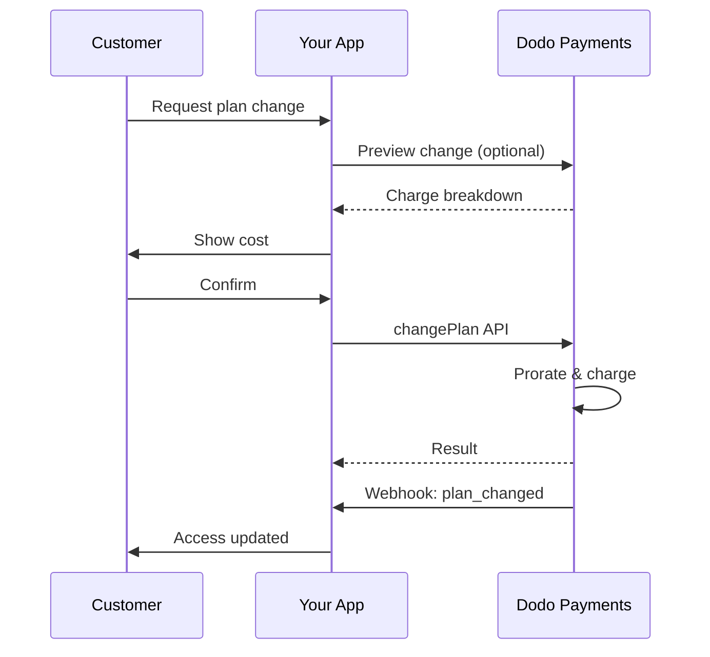
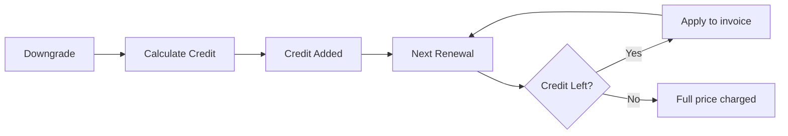
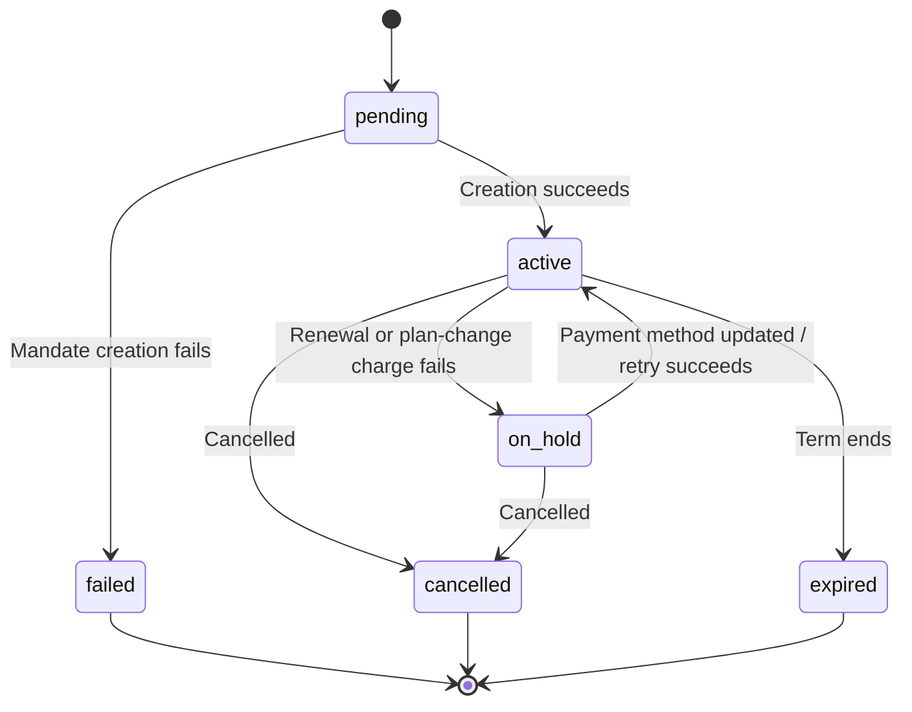

<Info>
Subscriptions let you sell ongoing access with automated renewals. Use flexible billing cycles, free trials, plan changes, and add‑ons to tailor pricing for each customer.
</Info>

<CardGroup cols={2}>
<Card title="Upgrade & Downgrade" icon="repeat" href="/developer-resources/subscription-upgrade-downgrade">
Control plan changes with proration and quantity updates.
</Card>

<Card title="On‑Demand Subscriptions" icon="bolt" href="/developer-resources/ondemand-subscriptions">
Authorize a mandate now and charge later with custom amounts.
</Card>

<Card title="Customer Portal" icon="id-card" href="/features/customer-portal">
Let customers manage plans, billing, and cancellations.
</Card>

<Card title="Subscription Webhooks" icon="code" href="/developer-resources/webhooks/intents/subscription">
React to lifecycle events like created, renewed, and canceled.
</Card>
</CardGroup>

## What Are Subscriptions?

Subscriptions are recurring products customers purchase on a schedule. They’re ideal for:

- **SaaS licenses**: Apps, APIs, or platform access
- **Memberships**: Communities, programs, or clubs
- **Digital content**: Courses, media, or premium content
- **Support plans**: SLAs, success packages, or maintenance

## Key Benefits

- **Predictable revenue**: Recurring billing with automated renewals
- **Flexible cycles**: Monthly, annual, custom intervals, and trials
- **Plan agility**: Proration for upgrades and downgrades
- **Add‑ons and seats**: Attach optional, quantifiable upgrades
- **Seamless checkout**: Hosted checkout and customer portal
- **Developer-first**: Clear APIs for creation, changes, and usage tracking

## Creating Subscriptions

Create subscription products in your Dodo Payments dashboard, then sell them through checkout or your API. Separating products from active subscriptions lets you version pricing, attach add‑ons, and track performance independently.

### Subscription product creation

Configure the fields in the dashboard to define how your subscription sells, renews, and bills. The sections below map directly to what you see in the creation form.

#### Product details

- **Product Name** (required): The display name shown in checkout, customer portal, and invoices.
- **Product Description** (required): A clear value statement that appears in checkout and invoices.
- **Product Image** (required): PNG/JPG/WebP up to 3 MB. Used on checkout and invoices.
- **Brand**: Associate the product with a specific brand for theming and emails.
- **Tax Category** (required): Choose the category (for example, SaaS) to determine tax rules.

<Tip>
Pick the most accurate tax category to ensure correct tax collection per region.
</Tip>

#### Pricing

- **Pricing Type**：选择 <b>Subscription</b>（本指南）。可选项包括 Single Payment 和 Usage Based Billing。
- **Price**（必填）：带货币的基础 recurring price。价格必须至少为 **$1**（或所选货币的等值金额）。不支持低于此最低金额的价格，且订阅将无法正常工作。
- **Discount Applicable (%)**：可选的百分比折扣，应用于基础价格；会反映在结账和发票中。
- **Repeat payment every**（必填）：续订间隔，例如每 1 Month。选择周期（months 或 years）和数量。
- **Subscription Period**（必填）：订阅保持有效的总期限（例如 10 Years）。期限结束后，除非延长，否则将停止续订。
- **Trial Period Days**（必填）：以天为单位设置试用时长。使用 0 可禁用试用。试用结束时会自动进行首次扣款。
- **Trial Amount**：付费试用的可选预付费用。免费试用请留空。请参阅 [Paid Trials](#paid-trials)。
- **Select add‑on**：最多附加 10 个 add‑ons，供客户与基础计划一同购买。

<Warning>
Changing pricing on an active product affects new purchases. Existing subscriptions follow your plan‑change and proration settings.
</Warning>

<Info>
Add‑ons are ideal for quantifiable extras such as seats or storage. You can control allowed quantities and proration behavior when customers change them.
</Info>

#### Advanced settings

- **Tax Inclusive Pricing**: Display prices inclusive of applicable taxes. Final tax calculation still varies by customer location.
- **Generate license keys**: Issue a unique key to each customer after purchase. See the <a href="/features/license-keys">License Keys</a> guide.
- **Digital Product Delivery**: Deliver files or content automatically after purchase. Learn more in <a href="/features/digital-product-delivery">Digital Product Delivery</a>.
- **Metadata**: Attach custom key–value pairs for internal tagging or client integrations. See <a href="/api-reference/metadata">Metadata</a>.

<Tip>
Use metadata to store identifiers from your system (e.g., accountId) so you can reconcile events and invoices later.
</Tip>

## Subscription Trials

试用期让客户可以在支付完整 recurring price 之前评估订阅。试用可以是 **free**，即试用结束前不会收取任何费用；也可以是 **paid**，即预先收取一笔折扣后的金额。在这两种情况下，完整价格都会在试用结束后的首次续订时开始收取。

### Configuring Trials

Set **Trial Period Days** in the product pricing section (use `0` to disable). You can override this when creating subscriptions:

```typescript
// Via subscription creation
const subscription = await client.subscriptions.create({
  customer_id: 'cus_123',
  product_id: 'prod_monthly',
  trial_period_days: 14  // Overrides product's trial period
});

// Via checkout session
const session = await client.checkoutSessions.create({
  product_cart: [{ product_id: 'prod_monthly', quantity: 1 }],
  subscription_data: { trial_period_days: 14 }
});
```

<Warning>
The `trial_period_days` value must be between 0 and 10,000 days.
</Warning>

### Paid Trials

试用不一定必须免费。在订阅产品的 recurring price 上设置 **Trial Amount**，即可为试用期收取一笔折扣后的预付费用。随后，完整 recurring price 会在首次续订时开始收取。

<Frame>

</Frame>

付费试用是在产品的 price 上配置的，而不是针对每个 subscription 或 checkout session 配置：

| Field | Type | Description |
|-------|------|-------------|
| `trial_amount` | integer | 今天针对试用收取的金额，以 price currency 的最小单位表示（例如，`500` 表示 $5.00）。需要 `trial_period_days > 0`。省略或设置为 `null` 表示免费试用。 |
| `trial_apply_discounts` | boolean | checkout discount codes 是否会减少试用费用。默认为 `false`，因此即使 recurring price 应用了折扣，试用金额仍会全额收取。 |

```typescript
const product = await client.products.create({
  name: 'Pro Plan',
  tax_category: 'saas',
  price: {
    type: 'recurring_price',
    price: 2900,                      // $29.00 per month after the trial
    currency: 'USD',
    payment_frequency_count: 1,
    payment_frequency_interval: 'Month',
    subscription_period_count: 1,
    subscription_period_interval: 'Year',
    trial_period_days: 14,            // A paid trial requires a positive trial period
    trial_amount: 500,                // $5.00 charged today
    trial_apply_discounts: false      // Discounts apply to the recurring price only
  }
});
```

付费试用同样会经过 checkout。试用金额会计税，并显示在 checkout session 的计算结果和 payment link 定价中；Adaptive Currency markup 会按货币应用。[preview endpoint](/developer-resources/checkout-session) 会返回 `trial_amount` 和 `trial_period_days`，以便你在创建订阅前显示今天应付的金额。

<Info>
免费试用行为不变。将 **Trial Amount** 留空会保留现有行为：首次扣款为 `0`，并在试用结束时收取完整价格。
</Info>

### Preventing Trial Misuse

**Prevent Trial Misuse** 可防止客户为同一企业反复领取试用。启用后，已经兑换过试用的客户会自动降级为 **paid, no-trial purchase**，而不会获得新的试用期。

<Frame>

</Frame>

在 **Settings** 的 **Subscriptions** 选项卡中启用。启用后：

- 客户会按 **normalized email** 匹配，并移除加号别名，因此 `user+trial@example.com` 和 `user@example.com` 会被视为同一人。
- 兑换记录会在 **trial activation** 时保存，因此当天取消的客户仍然算作已使用试用。
- 现有客户会根据其历史试用记录按 email 回填，因此过去使用过试用的客户会立即被识别。

<Info>
此设置**默认关闭**。完整的企业级订阅控制项列表请参阅 [Subscription Settings](/features/product-collections#subscription-settings)。
</Info>

### Detecting Trial Status

<Warning>
目前没有可直接用于检测试用状态的字段。以下是一种需要查询 payments 的变通方法，但效率较低。我们正在开发更高效的解决方案。
</Warning>

要确定 **free trial** subscription 是否处于试用期，请获取该 subscription 的 payments 列表。如果恰好有一笔金额为 0 的 payment，则该 subscription 处于试用期：

```typescript
const subscription = await client.subscriptions.retrieve('sub_123');
const payments = await client.payments.list({
  subscription_id: subscription.subscription_id
});

// Check if subscription is in trial
const isInTrial = payments.items.length === 1 && 
                  payments.items[0].total_amount === 0;
```

<Warning>
此金额为零的检查方式仅适用于免费试用。对于 [paid trial](#paid-trials)，第一笔 payment 等于试用金额，而不是 `0`。请将第一笔 payment 与 subscription 的 `trial_amount` 比较，或检查 `next_billing_date` 是否仍在试用期内。
</Warning>

### Updating Trial Period

通过更新 `next_billing_date` 延长试用期：

```typescript
await client.subscriptions.update('sub_123', {
  next_billing_date: '2025-02-15T00:00:00Z'  // New trial end date
});
```

<Warning>
不能将 `next_billing_date` 设置为过去的时间。日期必须在未来。
</Warning>

## Subscription Plan Changes

计划变更可用于升级或降级 subscriptions、调整数量，或迁移到不同的 products。根据所选的 proration mode，变更可能触发即时扣款、产生 credit，或不进行任何 billing adjustment。

<Tip>
你可以直接从 Dodo Payments dashboard 更改 subscription plans 并更新 next billing date。这样无需进行 API calls，即可快速响应 customer support requests、promotional upgrades 或 plan migrations。
</Tip>

<Tip>
**Enable self-service plan changes：**希望客户通过 Customer Portal 自行升级或降级 subscriptions？将 subscription products 添加到 Product Collection，并在 Subscription Settings 中启用 "Allow Subscription Updates"。
</Tip>



<Card title="Product Collections" icon="layer-group" href="/features/product-collections">
  将相关 products 分组到 collections 中，以便在 Customer Portal 中启用顺畅的升级/降级路径。
</Card>

### Proration Modes

选择客户变更计划时的计费方式：

<Info>
**四种 proration modes 快速对比：**

| | `prorated_immediately` | `difference_immediately` | `full_immediately` | `do_not_bill` |
|---|---|---|---|---|
| **Upgrade** | 按剩余天数计算的 proration charge | 收取完整价格差额 | 收取新计划的完整价格 | 不收费 — 立即切换 |
| **Downgrade** | 按剩余天数计算的 proration credit | 将完整价格差额作为 credit | 无 credit，收取完整费用 | 无 credit — 立即切换 |
| **Billing cycle** | 重置为今天 | 重置为今天 | 重置为今天 | 保持不变 |
| **Best for** | 公平的按时间计费 | 简单的 tier 变更 | 重置 billing cycle | 免费迁移或礼遇切换 |
</Info>

#### `prorated_immediately`
根据当前 billing cycle 的剩余时间收取按比例计算的金额。适合考虑未使用时间的公平计费。

```typescript
await client.subscriptions.changePlan('sub_123', {
  product_id: 'prod_pro',
  quantity: 1,
  proration_billing_mode: 'prorated_immediately'
});
```

#### `difference_immediately`
立即收取价格差额（升级），或为未来续订增加 credit（降级）。适合简单的升级/降级场景。

```typescript
// Upgrade: charges $50 (difference between $30 and $80)
// Downgrade: credits remaining value, auto-applied to renewals
await client.subscriptions.changePlan('sub_123', {
  product_id: 'prod_pro',
  quantity: 1,
  proration_billing_mode: 'difference_immediately'
});
```

<Info>
使用 `difference_immediately` 进行降级产生的 credits 以 subscription 为作用域，并会自动应用于未来续订。它们不同于 <a href="/features/credit-based-billing">Credit-Based Billing</a> entitlements。
</Info>

客户使用 `difference_immediately` 降级时，未使用的价值会变成 subscription-scoped credit，并自动抵扣未来续订：



#### `full_immediately`
立即收取新计划的完整金额，不考虑剩余时间。适合重置 billing cycle。

```typescript
await client.subscriptions.changePlan('sub_123', {
  product_id: 'prod_monthly',
  quantity: 1,
  proration_billing_mode: 'full_immediately'
});
```

#### `do_not_bill`
切换到新计划，但不进行任何 billing adjustment。不收取 proration charges，也不产生 credits — 客户直接转入新计划。适合礼遇迁移、免费计划切换，或你希望承担价格差额的场景。

```typescript
await client.subscriptions.changePlan('sub_123', {
  product_id: 'prod_new_plan',
  quantity: 1,
  proration_billing_mode: 'do_not_bill'
});
```

<AccordionGroup>
<Accordion title="Example: Prorated upgrade calculation">

**Scenario**：使用 `prorated_immediately` 时，Basic（$30/month）客户在 30 天 billing cycle 的第 16 天升级到 Pro（$80/month）。

```
Unused credit from Basic = $30 × (15 remaining / 30 total) = $15.00
Prorated cost of Pro     = $80 × (15 remaining / 30 total) = $40.00
────────────────────────────────────────────────────────────────────
Immediate charge         = $40.00 − $15.00 = $25.00
```

下一次续订日期为 **February 15**（January 16 + 30 days）：**$80.00/month**。

<Tip>
如需更详细的计算示例和边界情况，请参阅完整的 [Upgrade & Downgrade Guide](/developer-resources/subscription-upgrade-downgrade)。
</Tip>

</Accordion>
<Accordion title="Example: Downgrade credit calculation">

**Scenario**：Pro（$80/month）客户使用 `difference_immediately` 降级到 Starter（$20/month）。

```
Credit = Old plan − New plan = $80 − $20 = $60.00
```

$60 credit 会自动应用于未来续订：
- Renewal 1：$20 − $20（credit）= **$0.00**（剩余 $40 credit）
- Renewal 2：$20 − $20（credit）= **$0.00**（剩余 $20 credit）  
- Renewal 3：$20 − $20（credit）= **$0.00**（credit 用尽）
- Renewal 4：**$20.00**（完整价格）

<Info>
如需了解 credits 的管理方式，请参阅 [Upgrade & Downgrade Guide](/developer-resources/subscription-upgrade-downgrade)。
</Info>

</Accordion>
</AccordionGroup>

### Changing Plans with Add-ons

更改计划时可以修改 add-ons。Add-ons 会计入 proration calculations：

```typescript
await client.subscriptions.changePlan('sub_123', {
  product_id: 'prod_pro',
  quantity: 1,
  proration_billing_mode: 'difference_immediately',
  addons: [{ addon_id: 'addon_extra_seats', quantity: 2 }]  // Add add-ons
  // addons: []  // Empty array removes all existing add-ons
});
```

<Info>
计划变更会触发即时扣款。扣款失败可能会使 subscription 进入 `on_hold` status。通过 `subscription.plan_changed` webhook events 跟踪变更。
</Info>

### Previewing Plan Changes

在提交计划变更前，预览确切的扣款金额和变更后的 subscription：

```typescript
const preview = await client.subscriptions.previewChangePlan('sub_123', {
  product_id: 'prod_pro',
  quantity: 1,
  proration_billing_mode: 'prorated_immediately'
});

// Show customer the charge before confirming
console.log('You will be charged:', preview.immediate_charge.summary);
```

<Card title="Preview Change Plan API" icon="eye" href="/api-reference/subscriptions/preview-change-plan">
  在提交计划变更前进行预览。
</Card>

## Subscription States

Subscription 在其生命周期中会经过一组定义明确的 statuses。此表列出每个 status、其触发原因，以及如何（或是否可以）恢复。

| Status | What it means | Recoverable? | Recovery path / next step |
|--------|---------------|--------------|---------------------------|
| `pending` | subscription 正在创建或处理 | — | 等待 `subscription.active`（或 `subscription.failed`） |
| `active` | subscription 处于 active 状态，并会自动续订 | — | 无需操作 |
| `on_hold` | renewal payment（或 plan-change charge）失败；subscription 已暂停 | **Yes** | 更新 payment method 以重新激活 — 可通过 [Payment Retries](/features/recovery/payment-retries) 和 [Dunning](/features/recovery/subscription-dunning) 自动完成，或通过 [Update Payment Method API](/api-reference/subscriptions/update-payment-method) 手动完成 |
| `cancelled` | subscription 已取消，不会续订 | 仅可重新购买 | 客户必须开始新的 subscription；[Dunning](/features/recovery/subscription-dunning) 可以提示重新购买 |
| `failed` | subscription **creation** 失败（初始 mandate 或 payment 未成功） | **No — terminal** | 客户必须使用有效的 payment method 创建新的 subscription |
| `expired` | subscription 已达到其期限末尾 | — | 如有需要，客户必须开始新的 subscription |

<Warning>
`on_hold` 和 `failed` 经常被混淆。对于已经 active 但续订失败的 subscription，`on_hold` 是**可恢复**状态。`failed` 是**终止**状态，仅在 subscription **初始**创建失败时发生，无法重新激活。
</Warning>

### State Machine



### On Hold State

Subscription 在以下情况下会进入 `on_hold` state：

- renewal payment 失败（余额不足、卡片过期等）
- plan change charge 失败
- payment method authorization 失败

<Warning>
当 subscription 处于 `on_hold` state 时，不会自动续订。你必须更新 payment method 以重新激活 subscription。
</Warning>

### Reactivating from On Hold

要从 `on_hold` state 重新激活 subscription，请更新 payment method。系统会自动：

1. 为剩余应付款创建 charge
2. 生成 invoice
3. 使用新的 payment method 处理 payment
4. payment 成功后，将 subscription 重新激活为 `active` state

```typescript
// Reactivate subscription from on_hold
const response = await client.subscriptions.updatePaymentMethod('sub_123', {
  payment_method: {
    type: 'new',
    return_url: 'https://example.com/return'
  }
});

// For on_hold subscriptions, a charge is automatically created
if (response.payment_id) {
  console.log('Charge created:', response.payment_id);
  // Redirect customer to response.payment_link to complete payment
  // Monitor webhooks for payment.succeeded and subscription.active
}
```

<Info>
成功更新 `on_hold` subscription 的 payment method 后，你会收到 `payment.succeeded`，随后会收到 `subscription.active` webhook events。
</Info>

### Webhook Events by Transition

每次状态转换都会发出 webhook，因此你可以在无需轮询的情况下驱动 entitlement logic：

| Transition | Event |
|------------|-------|
| Subscription activated | `subscription.active` |
| Renewal succeeds | `subscription.renewed` |
| Renewal fails → paused | `subscription.on_hold` |
| Creation fails | `subscription.failed` |
| Plan upgraded/downgraded | `subscription.plan_changed` |
| Cancelled | `subscription.cancelled` |
| Term ended | `subscription.expired` |
| Any field changes | `subscription.updated` |

<Card title="Subscription Webhook Payloads" icon="webhook" href="/developer-resources/webhooks/intents/subscription">
查看 subscription lifecycle events 的完整 payload schema。
</Card>

## API Management

<AccordionGroup>
<Accordion title="Create subscriptions">
使用 `POST /subscriptions` 根据 products 以编程方式创建 subscriptions，并可选用 trials 和 add‑ons。

<Card title="API Reference" icon="code" href="/api-reference/subscriptions/post-subscriptions">
查看 create subscription API。
</Card>
</Accordion>

<Accordion title="Update subscriptions">
使用 `PATCH /subscriptions/{id}` 更新数量、在 next billing date 取消，或修改 metadata。

<Card title="API Reference" icon="code" href="/api-reference/subscriptions/patch-subscriptions">
了解如何更新 subscription details。
</Card>
</Accordion>

<Accordion title="Change plans (proration)">
通过 proration controls 更改 active product 和数量。

<Card title="API Reference" icon="code" href="/api-reference/subscriptions/change-plan">
查看 plan change options。
</Card>
</Accordion>

<Accordion title="On‑demand charges">
对于 on‑demand subscriptions，按需收取特定金额。

<Card title="API Reference" icon="code" href="/api-reference/subscriptions/create-charge">
收取 on‑demand subscription 的费用。
</Card>
</Accordion>

<Accordion title="List and retrieve">
使用 `GET /subscriptions` 列出所有 subscriptions，并使用 `GET /subscriptions/{id}` 获取单个 subscription。

<Card title="API Reference" icon="code" href="/api-reference/subscriptions/get-subscriptions">
浏览 listing 和 retrieval APIs。
</Card>
</Accordion>

<Accordion title="Usage history">
获取 metered 或 hybrid pricing models 的已记录 usage。

<Card title="API Reference" icon="code" href="/api-reference/subscriptions/get-usage-history">
查看 usage history API。
</Card>
</Accordion>

<Accordion title="Update payment method">
更新 subscription 的 payment method。对于 active subscriptions，这会更新未来续订使用的 payment method。对于处于 `on_hold` state 的 subscriptions，这会通过为剩余应付款创建 charge 来重新激活 subscription。

生成新的 payment-method link（`New` request type）时，可以传入 `allowed_payment_method_types`，以限制客户在该页面上看到的 payment methods。客户永远不会看到列表中未包含的方法，但包含某种方法并不保证它一定会显示（可用性仍取决于客户所在地和企业设置等因素）。

<Card title="API Reference" icon="code" href="/api-reference/subscriptions/update-payment-method">
了解如何更新 payment methods 和重新激活 subscriptions。
</Card>
</Accordion>
</AccordionGroup>

## Common Use Cases

- **SaaS and APIs**：通过 add‑ons 为 seats 或 usage 提供分级访问
- **Content and media**：提供每月访问权限和 introductory trials
- **B2B support plans**：提供包含 premium support add‑ons 的年度合同
- **Tools and plugins**：提供 license keys 和 versioned releases

## Integration Examples

### Checkout Sessions (subscriptions)
创建 checkout sessions 时，加入 subscription product 和可选的 add‑ons：

```typescript
const session = await client.checkoutSessions.create({
  product_cart: [
    {
      product_id: 'prod_subscription',
      quantity: 1
    }
  ]
});
```

### Plan changes with proration
升级或降级 subscription，并控制 proration behavior：

```typescript
await client.subscriptions.changePlan('sub_123', {
  product_id: 'prod_new',
  quantity: 1,
  proration_billing_mode: 'difference_immediately'
});
```

### Cancel at next billing date
安排在当前 billing period 结束时生效的取消操作：

```typescript
await client.subscriptions.update('sub_123', {
  cancel_at_next_billing_date: true
});
```

### Extend the subscription period
通过向 `PATCH /subscriptions/{id}` 传入新的 `subscription_period_count` 和 `subscription_period_interval`，延长 subscription 的运行时间。系统会根据新的 count 和 interval 重新计算 subscription 的 expiry — 例如，为客户当前计划增加额外时间：

```typescript
await client.subscriptions.update('sub_123', {
  subscription_period_count: 5,
  subscription_period_interval: 'Month'
});
```

<Note>
Subscription 的 period 只能**延长**，不能缩短。
</Note>

### On‑demand subscriptions
创建 on‑demand subscription，并在需要时稍后收取费用：

```typescript
const onDemand = await client.subscriptions.create({
  customer_id: 'cus_123',
  product_id: 'prod_on_demand',
  on_demand: { mandate_only: true }
});

await client.subscriptions.charge(onDemand.subscription_id, {
  product_price: 4900,
  product_currency: 'USD',
  product_description: 'Extra usage for September'
});
```

### Update payment method for active subscription
更新 active subscription 的 payment method：

```typescript
// Update with new payment method
const response = await client.subscriptions.updatePaymentMethod('sub_123', {
  payment_method: {
    type: 'new',
    return_url: 'https://example.com/return'
  }
});

// Or use existing payment method
await client.subscriptions.updatePaymentMethod('sub_123', {
  payment_method: {
    type: 'existing',
    payment_method_id: 'pm_abc123'
  }
});
```

### Reactivate subscription from on_hold
重新激活因 payment 失败而进入 on hold 的 subscription：

```typescript
// Update payment method - automatically creates charge for remaining dues
const response = await client.subscriptions.updatePaymentMethod('sub_123', {
  payment_method: {
    type: 'new',
    return_url: 'https://example.com/return'
  }
});

if (response.payment_id) {
  // Charge created for remaining dues
  // Redirect customer to response.payment_link
  // Monitor webhooks: payment.succeeded → subscription.active
}
```

## Subscriptions with RBI-Compliant Mandates

  UPI 和 Indian card subscriptions 受 RBI（Reserve Bank of India）法规约束，并有特定的 mandate 要求：

  ### Mandate Limits

  mandate type 和 amount 取决于 subscription 的 recurring charge：

  - **Charges below the mandate floor (default ₹15,000)：** 我们会创建金额为 mandate floor 的 on-demand mandate。系统会根据 subscription frequency 定期收取 subscription amount，最高不超过 mandate limit。
  - **Charges at or above the mandate floor：** 我们会为确切的 subscription amount 创建 subscription mandate（或 on-demand mandate）。

  mandate floor 可按 merchant 配置，也可通过 `mandate_min_amount_inr_paise`（INR paise）按 request 配置。向银行注册的金额为 `max(mandate_floor, billing_amount)` — 因此，当 billing 金额较低时，floor 实际上会成为面向客户的授权上限。

有关 RBI-compliant mandates 以及 Indian payment methods 可配置 mandate floor 的详细信息，请参阅 <a href="/features/payment-methods/india#configurable-mandate-floor">India Payment Methods</a> 页面。

  ### Upgrade and Downgrade Considerations

  **Important：**升级或降级 subscriptions 时，请仔细考虑 mandate limits：

  - 如果升级/降级导致 charge amount 超过 Rs 15,000，并超出已有的 on-demand payment limit，则 transaction charge 可能会失败。
  - 在这种情况下，客户可能需要更新 payment method，或再次更改 subscription，以使用正确的 limit 建立新的 mandate。

  ### Authorization for High-Value Charges

  对于金额为 Rs 15,000 或以上的 subscription charges：

  - 客户的银行会提示其授权该 transaction。
  - 如果客户未能授权该 transaction，transaction 将失败，subscription 会被 put on hold。

  ### 48-Hour Processing Delay

  **Processing Timeline：**Indian cards 和 UPI subscriptions 的 recurring charges 遵循独特的处理模式：

  - charges 会根据 subscription frequency 在计划日期**发起**。
  - 客户账户的实际**扣款**仅会在 payment initiation 后 **48 hours** 发生。
  - 根据 bank API responses，该 48-hour window 可能额外延长 **2-3 additional hours**。

  ### Mandate Cancellation Window

  在 48-hour processing window 期间：

  - 客户可以通过 banking apps 取消 mandate。
  - 如果客户在此期间取消 mandate，subscription 仍会保持 **active**（这是 Indian card 和 UPI AutoPay subscriptions 特有的边界情况）。
  - 但是，实际扣款可能会失败；在这种情况下，我们会将 subscription **on hold**。

  **Edge Case Handling：**如果你在 charge initiation 后立即向客户提供 benefits、credits 或 subscription usage，就需要在应用中妥善处理此 48-hour window。请考虑：

  - 延迟 benefit activation，直到 payment confirmation
  - 实现 grace periods 或 temporary access
  - 监控 subscription status，以检测 mandate cancellations
  - 在应用逻辑中处理 subscription hold states

  <Tip>
  监控 subscription webhooks，以跟踪 payment status changes，并处理 mandate 在 48-hour window 期间被取消的边界情况。
  </Tip>

## Best Practices

- **从清晰的 tiers 开始**：设置 2–3 个差异明显的 plans
- **清晰传达定价**：显示 totals、proration 和 next renewal
- **合理使用 trials**：通过 onboarding 转化，而不只是依靠时间
- **充分利用 add‑ons**：保持基础 plans 简洁，并追加销售额外功能
- **测试变更**：在 test mode 中验证 plan changes 和 proration

<Info>
Subscriptions 是 recurring revenue 的灵活基础。先从简单方案开始，进行充分测试，并根据 adoption、churn 和 expansion metrics 迭代。
</Info>