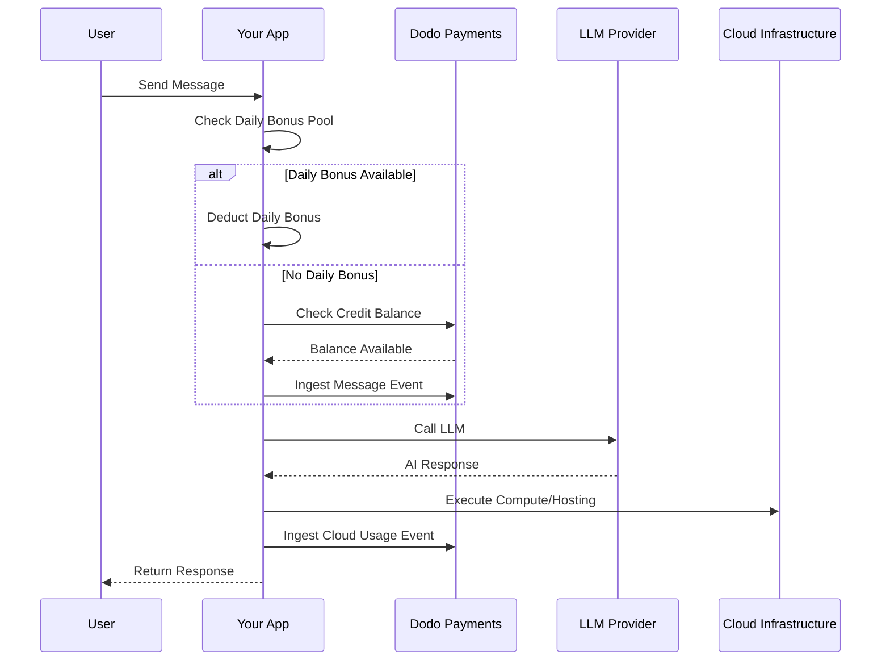

Lovable (lovable.dev) ist ein KI-Web-App-Builder, der ein kreditbasiertes Abonnementmodell verwendet. Im Gegensatz zu tokenbasierten Systemen vereinfacht Lovable die Benutzererfahrung, indem es pro Nachricht einen Kredit berechnet. Dieses Modell kombiniert einen monatlichen Kreditpool mit einem täglichen Bonustropfen, um konstantes Engagement zu fördern und gleichzeitig Spitzenbelastungen zu ermöglichen.

## Lovables Abrechnungsmodell

Die Preisgestaltung von Lovable basiert auf Nachrichtenguthaben und separater verbrauchsabhängiger Abrechnung für Cloud-Infrastruktur.

| Plan | Preis | Monatliche Credits | Täglicher Bonus | Hauptmerkmale |
| :--- | :--- | :--- | :--- | :--- |
| Kostenlos | 0 $/Monat | 0 | 5/Tag (bis zu 30/Monat) | Nur öffentliche Projekte |
| Pro | 25 $/Monat | 100 | 5/Tag (bis zu 150/Monat insgesamt) | Bedarfsgerechte Aufstockungen, nutzungsbasierte Cloud + KI, benutzerdefinierte Domains |
| Business | 50 $/Monat | 100 | 5/Tag | SSO, Teamarbeitsbereich, Designvorlagen, Sicherheitscenter |
| Enterprise | Anpassbar | Anpassbar | Anpassbar | SCIM, dedizierter Support, Prüfprotokolle |

- **Kreditbasiertes Abonnement**: 1 Kredit = 1 Nachricht/Aufforderung an die KI.
- **Credits werden über unbegrenzte Benutzer geteilt**: Teamweiter Pool, nicht pro Sitzplatz.
- **Credits werden in jedem Abrechnungszyklus zurückgesetzt**: Monatliche Credits werden bei Verlängerung erneuert.
- **Bedarfsgerechte Aufstockungen**: Nutzer können mehr Credits kaufen, wenn diese aufgebraucht sind.
- **Separate nutzungsabhängige Cloud + KI-Abrechnung**: Verbrauchsunabhängige Abrechnung für Hosting und Compute.
- **Tägliche Bonus-Credits werden täglich zurückgesetzt**: Ein täglicher Tropf von 5 Credits, die verwendet werden müssen oder verfallen.

## Was es einzigartig macht

- **Nachrichtenbasierte Einfachheit**: 1 Kredit = 1 Nachricht, unabhängig von der Komplexität. Kein Token-Counting oder Modellgewichtung.
- **Täglicher Tropf + monatlicher Pool Hybrid**: Die 5 täglichen Bonus-Credits schaffen einen täglichen Engagement-Anreiz, während die 100 monatlichen Credits Spitzenbelastungen ermöglichen.
- **Teamweiter geteilter Pool**: Credits werden über unbegrenzte Benutzer für einen festen Teampreis geteilt, nicht pro Sitzplatz.
- **Zwei-Schichten-Abrechnung**: Credits für KI-Interaktionen + separate verbrauchsabhängige Abrechnung für Cloud-Infrastruktur.

## Bauen Sie das mit Dodo Payments auf

Sie können Lovables Hybridmodell mit den Credit-Berechtigungen und nutzungsabhängigen Zählern von Dodo Payments nachbilden.

<Steps>
  <Step title="Create a Custom Unit Credit Entitlement">
    Definieren Sie das Nachrichtenguthabensystem in Ihrem Dodo Payments-Dashboard. Diese Berechtigung verwaltet den monatlichen Kreditpool.

    - **Kredittyp**: Benutzerdefinierte Einheit
    - **Einheitenname**: "Nachrichten"
    - **Präzision**: 0
    - **Guthabenablauf**: 30 Tage
    - **Überziehung**: Deaktiviert (harte Grenze, wenn Credits auf 0 fallen)
  </Step>

  <Step title="Create Subscription Products">
    Erstellen Sie Ihre Pläne und fügen Sie die Credit-Berechtigung hinzu. Für den kostenlosen Plan verwalten Sie den täglichen Bonus über die Anwendungslogik.

    - **Kostenlos**: 0 $/Monat, 0 Credits (täglicher Bonus über Anwendungslogik)
    - **Pro**: 25 $/Monat, 100 Credits/Zyklus, Credit-Berechtigung hinzufügen
    - **Business**: 50 $/Monat, 100 Credits/Zyklus, Credit-Berechtigung hinzufügen

    ```typescript
    import DodoPayments from 'dodopayments';

    const client = new DodoPayments({
      bearerToken: process.env.DODO_PAYMENTS_API_KEY,
    });

    const session = await client.checkoutSessions.create({
      product_cart: [
        { product_id: 'prod_lovable_pro', quantity: 1 }
      ],
      customer: { email: 'user@example.com' },
      return_url: 'https://lovable.dev/dashboard'
    });
    ```

  </Step>

  <Step title="Create a Usage Meter for Cloud + AI">
    Lovable berechnet die Cloud-Infrastruktur separat. Erstellen Sie einen Zähler, um diese Kosten zu verfolgen.

    - **Zählername**: `cloud.compute_seconds`
    - **Aggregation**: Summe auf `compute_seconds` Eigenschaft

    Verknüpfen Sie diesen Zähler mit Ihren Abonnementprodukten mit Stückpreis. Wenn Sie Nutzung erfassen, berechnet Dodo die Kosten basierend auf Ihren Tarifen.

    ```typescript
    await client.usageEvents.ingest({
      events: [{
        event_id: `compute_${Date.now()}`,
        customer_id: 'cust_123',
        event_name: 'cloud.compute_seconds',
        timestamp: new Date().toISOString(),
        metadata: {
          compute_seconds: 3600,
          project_id: 'proj_abc'
        }
      }]
    });
    ```

  </Step>

  <Step title="Implement Daily Bonus Credits (Application Logic)">
    Der tägliche Bonustropfen wird auf der Anwendungsebene verwaltet. Sie können einen Cron-Job verwenden, um diese Credits zu gewähren, oder sie separat in Ihrer Datenbank verfolgen.

    Um die Nutzung dieser Bonus-Credits in Dodo zu verfolgen, ohne das Haupguthaben sofort zu erschöpfen, können Sie einen separaten Ereignisnamen verwenden oder die Logik in Ihrer App verwalten, um zuerst den Bonuspool zu prüfen.

    ```typescript
    // Example cron job logic (pseudo-code)
    // Every day at midnight UTC:
    // 1. Reset 'daily_bonus_used' to 0 for all users in your DB
    
    // When a user sends a message:
    async function handleMessage(userId: string) {
      const user = await db.users.findUnique({ where: { id: userId } });
      
      if (user.daily_bonus_used < 5) {
        // Use daily bonus
        await db.users.update({
          where: { id: userId },
          data: { daily_bonus_used: { increment: 1 } }
        });
        // Track for analytics but don't deduct from Dodo credits yet
        await client.usageEvents.ingest({
          events: [{
            event_id: `msg_bonus_${Date.now()}`,
            customer_id: userId,
            event_name: 'ai.message.bonus',
            timestamp: new Date().toISOString(),
            metadata: { type: 'daily_bonus' }
          }]
        });
      } else {
        // Deduct from Dodo credit entitlement
        await client.usageEvents.ingest({
          events: [{
            event_id: `msg_${Date.now()}`,
            customer_id: userId,
            event_name: 'ai.message',
            timestamp: new Date().toISOString(),
            metadata: { type: 'subscription_credit' }
          }]
        });
      }
    }
    ```

  </Step>

  <Step title="Send Usage Events for Messages">
    Verfolgen Sie jede KI-Nachricht als Nutzungsevent. Verknüpfen Sie das `ai.message` Event mit Ihrer "Nachrichten"-Credit-Berechtigung im Dodo-Dashboard.

    ```typescript
    await client.usageEvents.ingest({
      events: [{
        event_id: `msg_${Date.now()}`,
        customer_id: 'cust_123',
        event_name: 'ai.message',
        timestamp: new Date().toISOString(),
        metadata: {
          content_length: 450,
          project_id: 'proj_abc',
          feature_type: 'editor'
        }
      }]
    });
    ```

  </Step>

  <Step title="Handle Webhooks for Low Balance">
    Benachrichtigen Sie die Benutzer, wenn sie wenige Credits haben, damit sie aufladen oder upgraden können.

    ```typescript
    import DodoPayments from 'dodopayments';
    import express from 'express';

    const app = express();
    app.use(express.raw({ type: 'application/json' }));

    const client = new DodoPayments({
      bearerToken: process.env.DODO_PAYMENTS_API_KEY,
      webhookKey: process.env.DODO_PAYMENTS_WEBHOOK_KEY,
    });

    app.post('/webhooks/dodo', async (req, res) => {
      try {
        const event = client.webhooks.unwrap(req.body.toString(), {
          headers: {
            'webhook-id': req.headers['webhook-id'] as string,
            'webhook-signature': req.headers['webhook-signature'] as string,
            'webhook-timestamp': req.headers['webhook-timestamp'] as string,
          },
        });

        if (event.type === 'credit.balance_low') {
          const { customer_id, available_balance } = event.data;
          await notifyUser(customer_id, `Your balance is low: ${available_balance} messages left.`);
        }

        res.json({ received: true });
      } catch (error) {
        res.status(401).json({ error: 'Invalid signature' });
      }
    });
    ```

  </Step>
</Steps>

## Beschleunigung mit dem LLM Ingestion Blueprint

Der [LLM Ingestion Blueprint](/developer-resources/ingestion-blueprints/llm) vereinfacht das Tracking, indem er Ihren KI-Client umschließt.

```typescript
import { createLLMTracker } from '@dodopayments/ingestion-blueprints';
import OpenAI from 'openai';

const tracker = createLLMTracker({
  apiKey: process.env.DODO_PAYMENTS_API_KEY,
  environment: 'live_mode',
  eventName: 'ai.message',
});

const trackedClient = tracker.wrap({
  client: new OpenAI(),
  customerId: 'cust_123',
});

// Automatically tracks the message and deducts 1 credit (if configured)
await trackedClient.chat.completions.create({
  model: 'gpt-4o',
  messages: [{ role: 'user', content: 'Build a landing page' }],
});
```

<Tip>
  Sehen Sie sich die [vollständige Blue-Print-Dokumentation](/developer-resources/ingestion-blueprints/llm) für weitere Details zur automatischen Verfolgung an.
</Tip>

## Architekturübersicht



## Wichtige Dodo-Features verwendet

Entdecken Sie die Features, die diese Implementierung möglich machen.

<CardGroup cols={2}>
  <Card title="Credit-Based Billing" icon="coins" href="/features/credit-based-billing">
    Verwalten Sie Nachrichtenguthaben und geteilte Team-Pool.
  </Card>
  <Card title="Subscriptions" icon="calendar" href="/features/subscription">
    Richten Sie wiederkehrende Pläne für die Pro- und Business-Ebenen ein.
  </Card>
  <Card title="Usage-Based Billing" icon="chart-line" href="/features/usage-based-billing/introduction">
    Messen Sie die Cloud-Infrastruktur-Nutzung separat von den KI-Credits.
  </Card>
  <Card title="Event Ingestion" icon="bolt" href="/features/usage-based-billing/event-ingestion">
    Senden Sie Nachrichten und Compute-Events mit hohem Volumen an Dodo.
  </Card>
  <Card title="Webhooks" icon="webhook" href="/developer-resources/webhooks/intents/credit">
    Automatisieren Sie Benachrichtigungen für niedrige Balancen.
  </Card>
  <Card title="LLM Ingestion Blueprint" icon="brain-circuit" href="/developer-resources/ingestion-blueprints/llm">
    Vereinfachen Sie das KI-Nutzungstracking mit vorgefertigten Integrationen.
  </Card>
</CardGroup>
