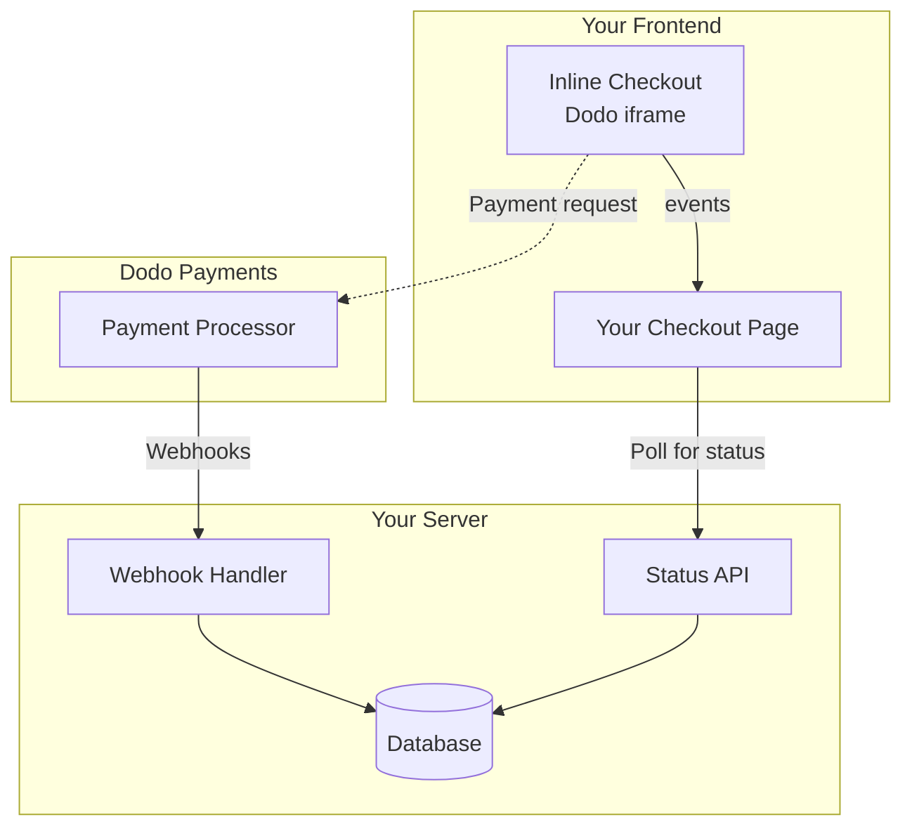

## Übersicht

Der Inline-Checkout ermöglicht es Ihnen, vollständig integrierte Checkout-Erlebnisse zu schaffen, die nahtlos mit Ihrer Website oder Anwendung verschmelzen. Im Gegensatz zum [Overlay-Checkout](/developer-resources/overlay-checkout), der als Modal über Ihrer Seite geöffnet wird, bettet der Inline-Checkout das Zahlungsformular direkt in Ihr Seitenlayout ein.

Mit dem Inline-Checkout können Sie:

- Checkout-Erlebnisse erstellen, die vollständig in Ihre App oder Website integriert sind
- Dodo Payments sicher die Kunden- und Zahlungsinformationen in einem optimierten Checkout-Rahmen erfassen lassen
- Artikel, Gesamtsummen und andere Informationen von Dodo Payments auf Ihrer Seite anzeigen
- SDK-Methoden und -Ereignisse verwenden, um fortschrittliche Checkout-Erlebnisse zu erstellen

<Frame>
    
</Frame>

## Funktionsweise

Der Inline-Checkout funktioniert, indem ein sicherer Dodo Payments-Rahmen in Ihre Website oder App eingebettet wird.

Der Checkout-Rahmen kümmert sich um das Sammeln von Kundeninformationen und das Erfassen von Zahlungsdetails. Ihre Seite zeigt die Artikelliste, Gesamtsummen und Optionen zum Ändern der Checkout-Inhalte an. Das SDK ermöglicht es Ihrer Seite und dem Checkout-Rahmen, miteinander zu interagieren.

Dodo Payments erstellt automatisch ein Abonnement, wenn ein Checkout abgeschlossen ist, bereit für Sie zur Bereitstellung.

<Note>
Der Inline-Checkout-Rahmen verarbeitet sicher alle sensiblen Zahlungsinformationen und gewährleistet die PCI-Konformität, ohne dass zusätzliche Zertifizierungen Ihrerseits erforderlich sind.
</Note>

## Was macht einen guten Inline-Checkout aus?

Es ist wichtig, dass die Kunden wissen, von wem sie kaufen, was sie kaufen und wie viel sie bezahlen.

Um einen Inline-Checkout zu erstellen, der konform und optimiert für Konversionen ist, muss Ihre Implementierung Folgendes enthalten:

<Frame caption="Beispiel für ein Inline-Checkout-Layout mit erforderlichen Elementen">
    
</Frame>

1. **Wiederkehrende Informationen**: Wenn es sich um wiederkehrende Zahlungen handelt, wie oft sie wiederkehren und der Gesamtbetrag bei der Erneuerung. Wenn es sich um eine Testversion handelt, wie lange die Testversion dauert.
2. **Artikelbeschreibungen**: Eine Beschreibung dessen, was gekauft wird.
3. **Transaktionssummen**: Transaktionssummen, einschließlich Zwischensumme, Gesamtsteuer und Gesamtsumme. Stellen Sie sicher, dass auch die Währung angegeben ist.
4. **Dodo Payments-Fußzeile**: Der vollständige Inline-Checkout-Rahmen, einschließlich der Checkout-Fußzeile, die Informationen über Dodo Payments, unsere Verkaufsbedingungen und unsere Datenschutzrichtlinie enthält.
5. **Rückerstattungsrichtlinie**: Ein Link zu Ihrer Rückerstattungsrichtlinie, falls diese von der Standard-Rückerstattungsrichtlinie von Dodo Payments abweicht.

<Warning>
Zeigen Sie immer den vollständigen Inline-Checkout-Rahmen, einschließlich der Fußzeile, an. Das Entfernen oder Verstecken von rechtlichen Informationen verstößt gegen die Compliance-Anforderungen.
</Warning>

## Kundenreise

Der Checkout-Fluss wird durch Ihre Konfiguration der Checkout-Sitzung bestimmt. Je nachdem, wie Sie die Checkout-Sitzung konfigurieren, erleben die Kunden einen Checkout, der möglicherweise alle Informationen auf einer einzigen Seite oder über mehrere Schritte hinweg präsentiert.

<Steps>
<Step title="Kunde öffnet den Checkout">

Sie können den Inline-Checkout öffnen, indem Sie Artikel oder eine vorhandene Transaktion übergeben. Verwenden Sie das SDK, um Informationen auf der Seite anzuzeigen und zu aktualisieren, und SDK-Methoden, um Artikel basierend auf der Interaktion des Kunden zu aktualisieren.
    

</Step>

<Step title="Kunde gibt seine Daten ein">

Der Inline-Checkout fordert die Kunden zunächst auf, ihre E-Mail-Adresse einzugeben, ihr Land auszuwählen und (wo erforderlich) ihre PLZ oder Postleitzahl einzugeben. Dieser Schritt sammelt alle notwendigen Informationen, um Steuern und verfügbare Zahlungsmethoden zu bestimmen.

Sie können die Kundendaten vorab ausfüllen und gespeicherte Adressen anzeigen, um das Erlebnis zu optimieren.

</Step>

<Step title="Kunde wählt Zahlungsmethode">

Nachdem sie ihre Daten eingegeben haben, werden den Kunden verfügbare Zahlungsmethoden und das Zahlungsformular angezeigt. Die Optionen können Kredit- oder Debitkarte, PayPal, Apple Pay, Google Pay und andere lokale Zahlungsmethoden basierend auf ihrem Standort umfassen.

Zeigen Sie gespeicherte Zahlungsmethoden an, wenn verfügbar, um den Checkout zu beschleunigen.


</Step>

<Step title="Checkout abgeschlossen">

Dodo Payments leitet jede Zahlung an den besten Acquirer für diesen Verkauf weiter, um die bestmögliche Erfolgsquote zu erzielen. Die Kunden gelangen in einen Erfolgsworkflow, den Sie erstellen können.


</Step>

<Step title="Dodo Payments erstellt Abonnement">

Dodo Payments erstellt automatisch ein Abonnement für den Kunden, bereit für Sie zur Bereitstellung. Die Zahlungsmethode, die der Kunde verwendet hat, wird für Erneuerungen oder Änderungen des Abonnements gespeichert.


</Step>
</Steps>

## Schnellstart

Starten Sie mit dem Dodo Payments Inline Checkout in nur wenigen Zeilen Code:

```typescript
import { DodoPayments } from "dodopayments-checkout";

// Initialize the SDK for inline mode
DodoPayments.Initialize({
  mode: "test",
  displayType: "inline",
  onEvent: (event) => {
    console.log("Checkout event:", event);
  },
});

// Open checkout in a specific container
DodoPayments.Checkout.open({
  checkoutUrl: "https://test.dodopayments.com/session/cks_123",
  elementId: "dodo-inline-checkout" // ID of the container element
});
```

<Tip>
Stellen Sie sicher, dass Sie ein Container-Element mit dem entsprechenden `id` auf Ihrer Seite haben: `<div id="dodo-inline-checkout"></div>`.
</Tip>

## Schritt-für-Schritt-Integrationsanleitung

<Steps>
<Step title="Installieren Sie das SDK">

Installieren Sie das Dodo Payments Checkout SDK:

<CodeGroup>

```bash npm
npm install dodopayments-checkout
```

```bash yarn
yarn add dodopayments-checkout
```

```bash pnpm
pnpm add dodopayments-checkout
```

</CodeGroup>

</Step>

<Step title="SDK für Inline-Anzeige initialisieren">

Initialisieren Sie das SDK und geben Sie `displayType: 'inline'` an. Sie sollten auch das `checkout.breakdown`-Ereignis abhören, um Ihre UI mit Echtzeitsteuer- und Gesamtrechnungen zu aktualisieren.

```typescript
import { DodoPayments } from "dodopayments-checkout";

DodoPayments.Initialize({
  mode: "test",
  displayType: "inline",
  onEvent: (event) => {
    if (event.event_type === "checkout.breakdown") {
      const breakdown = event.data?.message;
      // Update your UI with breakdown.subTotal, breakdown.tax, breakdown.total, etc.
    }
  },
});
```

</Step>

<Step title="Erstellen Sie ein Container-Element">

Fügen Sie ein Element zu Ihrem HTML hinzu, in das der Checkout-Rahmen eingefügt wird:

```html
<div id="dodo-inline-checkout"></div>
```

</Step>

<Step title="Öffnen Sie den Checkout">

Rufen Sie `DodoPayments.Checkout.open()` mit dem `checkoutUrl` und dem `elementId` Ihres Containers auf:

```typescript
DodoPayments.Checkout.open({
  checkoutUrl: "https://test.dodopayments.com/session/cks_123",
  elementId: "dodo-inline-checkout"
});
```

</Step>

<Step title="Testen Sie Ihre Integration">

1. Starten Sie Ihren Entwicklungsserver:

```bash
npm run dev
```

2. Testen Sie den Checkout-Fluss:
   - Geben Sie Ihre E-Mail- und Adressdaten im Inline-Rahmen ein.
   - Überprüfen Sie, ob Ihre benutzerdefinierte Bestellübersicht in Echtzeit aktualisiert wird.
   - Testen Sie den Zahlungsfluss mit Testanmeldeinformationen.
   - Bestätigen Sie, dass die Weiterleitungen korrekt funktionieren.

<Check>
Sie sollten `checkout.breakdown`-Ereignisse in Ihrer Browser-Konsole protokolliert sehen, wenn Sie ein Console-Log im `onEvent`-Rückruf hinzugefügt haben.
</Check>

</Step>

<Step title="Live gehen">

Wenn Sie bereit für die Produktion sind:

1. Ändern Sie den Modus zu `'live'`:

```typescript
DodoPayments.Initialize({
  mode: "live",
  displayType: "inline",
  onEvent: (event) => {
    // Handle events
  }
});
```

2. Aktualisieren Sie Ihre Checkout-URLs, um Live-Checkout-Sitzungen von Ihrem Backend zu verwenden.
3. Testen Sie den gesamten Fluss in der Produktion.

</Step>
</Steps>

## Vollständiges React-Beispiel

Dieses Beispiel zeigt, wie man eine benutzerdefinierte Bestellzusammenfassung neben dem Inline-Checkout implementiert und diese mithilfe des `checkout.breakdown`-Ereignisses synchron hält.

```tsx
"use client";

import { useEffect, useState } from 'react';
import { DodoPayments, CheckoutBreakdownData } from 'dodopayments-checkout';

export default function CheckoutPage() {
  const [breakdown, setBreakdown] = useState<Partial<CheckoutBreakdownData>>({});

  useEffect(() => {
    // 1. Initialize the SDK
    DodoPayments.Initialize({
      mode: 'test',
      displayType: 'inline',
      onEvent: (event) => {
        // 2. Listen for the 'checkout.breakdown' event
        if (event.event_type === "checkout.breakdown") {
          const message = event.data?.message as CheckoutBreakdownData;
          if (message) setBreakdown(message);
        }
      }
    });

    // 3. Open the checkout in the specified container
    DodoPayments.Checkout.open({
      checkoutUrl: 'https://test.dodopayments.com/session/cks_123',
      elementId: 'dodo-inline-checkout'
    });

    return () => DodoPayments.Checkout.close();
  }, []);

  const format = (amt: number | null | undefined, curr: string | null | undefined) => 
    amt != null && curr ? `${curr} ${(amt/100).toFixed(2)}` : '0.00';

  const currency = breakdown.currency ?? breakdown.finalTotalCurrency ?? '';

  return (
    <div className="flex flex-col md:flex-row min-h-screen">
      {/* Left Side - Checkout Form */}
      <div className="w-full md:w-1/2 flex items-center">
        <div id="dodo-inline-checkout" className='w-full' />
      </div>

      {/* Right Side - Custom Order Summary */}
      <div className="w-full md:w-1/2 p-8 bg-gray-50">
        <h2 className="text-2xl font-bold mb-4">Order Summary</h2>
        <div className="space-y-2">
          {breakdown.subTotal && (
            <div className="flex justify-between">
              <span>Subtotal</span>
              <span>{format(breakdown.subTotal, currency)}</span>
            </div>
          )}
          {breakdown.discount && (
            <div className="flex justify-between">
              <span>Discount</span>
              <span>{format(breakdown.discount, currency)}</span>
            </div>
          )}
          {breakdown.tax != null && (
            <div className="flex justify-between">
              <span>Tax</span>
              <span>{format(breakdown.tax, currency)}</span>
            </div>
          )}
          <hr />
          {(breakdown.finalTotal ?? breakdown.total) && (
            <div className="flex justify-between font-bold text-xl">
              <span>Total</span>
              <span>{format(breakdown.finalTotal ?? breakdown.total, breakdown.finalTotalCurrency ?? currency)}</span>
            </div>
          )}
        </div>
      </div>
    </div>
  );
}

```

## API-Referenz

### Konfiguration

#### Initialisierungsoptionen

```typescript
interface InitializeOptions {
  mode: "test" | "live";
  displayType: "inline"; // Required for inline checkout
  onEvent: (event: CheckoutEvent) => void;
}
```

| Option | Typ | Erforderlich | Beschreibung |
|--------|------|----------|-------------|
| `mode` | `"test" \| "live"` | Ja | Umgebungsmodus. |
| `displayType` | `"inline" \| "overlay"` | Ja | Muss auf `"inline"` gesetzt werden, um den Checkout einzubetten. |
| `onEvent` | `function` | Ja | Rückruffunktion zur Verarbeitung von Checkout-Ereignissen. |

#### Checkout-Optionen

```typescript
export type FontSize = "xs" | "sm" | "md" | "lg" | "xl" | "2xl";
export type FontWeight = "normal" | "medium" | "bold" | "extraBold";

interface CheckoutOptions {
  checkoutUrl: string;
  elementId: string; // Required for inline checkout
  options?: {
    showTimer?: boolean;
    showSecurityBadge?: boolean;
    manualRedirect?: boolean;
    themeConfig?: ThemeConfig;
    payButtonText?: string;
    fontSize?: FontSize;
    fontWeight?: FontWeight;
  };
}
```

| Option | Typ | Erforderlich | Beschreibung |
|--------|------|----------|-------------|
| `checkoutUrl` | `string` | Ja | URL der Checkout-Sitzung. |
| `elementId` | `string` | Ja | Die `id` des DOM-Elements, in dem der Checkout gerendert werden soll. |
| `options.showTimer` | `boolean` | Nein | Den Checkout-Timer anzeigen oder ausblenden. Standardmäßig ist es `true`. Wenn deaktiviert, erhalten Sie das `checkout.link_expired`-Ereignis, wenn die Sitzung abläuft. |
| `options.showSecurityBadge` | `boolean` | Nein | Das Sicherheitsabzeichen anzeigen oder ausblenden. Standardmäßig ist es `true`. |
| `options.manualRedirect` | `boolean` | Nein | Wenn aktiviert, wird der Checkout nach Abschluss nicht automatisch umgeleitet. Stattdessen erhalten Sie `checkout.status`- und `checkout.redirect_requested`-Ereignisse, um die Umleitung selbst zu handhaben. |
| `options.themeConfig` | `ThemeConfig` | Nein | Benutzerdefinierte Themenkonfiguration. |
| `options.payButtonText` | `string` | Nein | Benutzerdefinierter Text, der auf der Zahlungsmethode angezeigt wird. |
| `options.fontSize` | `FontSize` | Nein | Globale Schriftgröße für den Checkout. |
| `options.fontWeight` | `FontWeight` | Nein | Globale Schriftstärke für den Checkout. |

### Methoden

#### Checkout öffnen

Öffnet den Checkout-Rahmen im angegebenen Container.

```typescript
DodoPayments.Checkout.open({
  checkoutUrl: "https://test.dodopayments.com/session/cks_123",
  elementId: "dodo-inline-checkout"
});
```

Sie können auch zusätzliche Optionen übergeben, um das Checkout-Verhalten anzupassen:

```typescript
DodoPayments.Checkout.open({
  checkoutUrl: "https://test.dodopayments.com/session/cks_123",
  elementId: "dodo-inline-checkout",
  options: {
    showTimer: false,
    showSecurityBadge: false,
    manualRedirect: true,
    payButtonText: "Pay Now",
  },
});
```

Beim Verwenden von `manualRedirect` behandeln Sie den Abschluss des Checkouts in Ihrem `onEvent`-Rückruf:

```typescript
DodoPayments.Initialize({
  mode: "test",
  displayType: "inline",
  onEvent: (event) => {
    if (event.event_type === "checkout.status") {
      const status = event.data?.message?.status;
      // Handle status: "succeeded", "failed", or "processing"
    }
    if (event.event_type === "checkout.redirect_requested") {
      const redirectUrl = event.data?.message?.redirect_to;
      // Redirect the customer manually
      window.location.href = redirectUrl;
    }
    if (event.event_type === "checkout.link_expired") {
      // Handle expired checkout session
    }
  },
});
```

#### Checkout schließen

Entfernt programmgesteuert den Checkout-Rahmen und bereinigt die Ereignis-Listener.

```typescript
DodoPayments.Checkout.close();
```

#### Status überprüfen

Gibt zurück, ob der Checkout-Rahmen derzeit injiziert ist.

```typescript
const isOpen = DodoPayments.Checkout.isOpen();
// Returns: boolean
```

### Ereignisse

Das SDK bietet Echtzeitereignisse über den `onEvent`-Rückruf. Für den Inline-Checkout ist `checkout.breakdown` besonders nützlich, um Ihre UI zu synchronisieren.

| Ereignistyp | Beschreibung |
|------------|-------------|
| `checkout.opened` | Checkout-Rahmen wurde geladen. |
| `checkout.form_ready` | Checkout-Formular ist bereit, Benutzereingaben zu empfangen. Nützlich, um Ladezustände auszublenden und die Checkout-UI anzuzeigen. |
| `checkout.breakdown` | Wird ausgelöst, wenn Preise, Steuern oder Rabatte aktualisiert werden. |
| `checkout.customer_details_submitted` | Kundendaten wurden übermittelt. |
| `checkout.pay_button_clicked` | Wird ausgelöst, wenn der Kunde die Zahlungsschaltfläche klickt. Nützlich für Analysen und zur Verfolgung von Konvertierungstrichtern. |
| `checkout.redirect` | Checkout führt eine Umleitung durch (z. B. zu einer Bankseite). |
| `checkout.error` | Ein Fehler ist während des Checkouts aufgetreten. |
| `checkout.link_expired` | Wird ausgelöst, wenn die Checkout-Sitzung abläuft. Nur erhalten, wenn `showTimer` auf `false` gesetzt ist. |
| `checkout.status` | Wird ausgelöst, wenn `manualRedirect` aktiviert ist. Enthält den Checkout-Status (`succeeded`, `failed` oder `processing`). |
| `checkout.redirect_requested` | Wird ausgelöst, wenn `manualRedirect` aktiviert ist. Enthält die URL, zu der der Kunde umgeleitet wird. |

#### Checkout-Daten zur Aufschlüsselung

Das `checkout.breakdown`-Ereignis liefert die folgenden Daten:

```typescript
interface CheckoutBreakdownData {
  subTotal?: number;          // Amount in cents
  discount?: number;         // Amount in cents
  tax?: number;              // Amount in cents
  total?: number;            // Amount in cents
  currency?: string;         // e.g., "USD"
  finalTotal?: number;       // Final amount including adjustments
  finalTotalCurrency?: string; // Currency for the final total
}
```

#### Checkout-Status-Ereignisdaten

Wenn `manualRedirect` aktiviert ist, erhalten Sie das `checkout.status`-Ereignis mit den folgenden Daten:

```typescript
interface CheckoutStatusEventData {
  message: {
    status?: "succeeded" | "failed" | "processing";
  };
}
```

#### Checkout-Umleitungsanforderungs-Ereignisdaten

Wenn `manualRedirect` aktiviert ist, erhalten Sie das `checkout.redirect_requested`-Ereignis mit den folgenden Daten:

```typescript
interface CheckoutRedirectRequestedEventData {
  message: {
    redirect_to?: string;
  };
}
```

#### Verständnis des Aufschlüsselungsereignisses

Das `checkout.breakdown`-Ereignis ist der primäre Weg, um die UI Ihrer Anwendung mit dem Dodo Payments-Checkout-Zustand synchron zu halten.

**Wann es ausgelöst wird:**
- **Bei der Initialisierung**: Sofort nachdem der Checkout-Rahmen geladen und bereit ist.
- **Bei Adressänderung**: Immer wenn der Kunde ein Land auswählt oder eine Postleitzahl eingibt, die zu einer Steuerneuberechnung führt.

**Feld Details:**

| Feld | Beschreibung |
|-------|-------------|
| `subTotal` | Die Summe aller Artikel in der Sitzung, bevor Rabatte oder Steuern angewendet werden. |
| `discount` | Der Gesamtwert aller angewendeten Rabatte. |
| `tax` | Der berechnete Steuerbetrag. Im `inline`-Modus wird dies dynamisch aktualisiert, während der Benutzer mit den Adressfeldern interagiert. |
| `total` | Das mathematische Ergebnis von `subTotal - discount + tax` in der Basiswährung der Sitzung. |
| `currency` | Der ISO-Währungs-Code (z. B. `"USD"`) für die Standard-Zwischensumme, Rabatte und Steuerwerte. |
| `finalTotal` | Der tatsächliche Betrag, den der Kunde bezahlt. Dies kann zusätzliche Fremdwährungsanpassungen oder lokale Zahlungsgebühren umfassen, die nicht Teil der grundlegenden Preisaufgliederung sind. |
| `finalTotalCurrency` | Die Währung, in der der Kunde tatsächlich zahlt. Dies kann von `currency` abweichen, wenn Kaufkraftparität oder lokale Währungsumrechnung aktiv ist. |

**Wichtige Integrationstipps:**

1.  **Währungsformatierung**: Preise werden immer als Ganzzahlen in der kleinsten Währungseinheit (z. B. Cent für USD, Yen für JPY) zurückgegeben. Um sie anzuzeigen, teilen Sie durch 100 (oder die entsprechende Zehnerpotenz) oder verwenden Sie eine Formatierungsbibliothek wie `Intl.NumberFormat`.
2.  **Umgang mit Anfangszuständen**: Wenn der Checkout zum ersten Mal geladen wird, können `tax` und `discount` `0` oder `null` sein, bis der Benutzer seine Rechnungsinformationen bereitstellt oder einen Code anwendet. Ihre UI sollte diese Zustände elegant handhaben (z. B. eine Strich `—` anzeigen oder die Zeile ausblenden).
3.  **Der „Endgültige Gesamtbetrag“ vs „Gesamt“**: Während `total` Ihnen die standardmäßige Preiskalkulation liefert, ist `finalTotal` die Quelle der Wahrheit für die Transaktion. Wenn `finalTotal` vorhanden ist, spiegelt dies genau wider, was auf die Karte des Kunden belastet wird, einschließlich aller dynamischen Anpassungen.
4.  **Echtzeit-Feedback**: Verwenden Sie das `tax`-Feld, um Benutzern anzuzeigen, dass Steuern in Echtzeit berechnet werden. Dies verleiht Ihrer Checkout-Seite ein „Live“-Gefühl und verringert die Reibung während des Adressentry-Schrittes.

## Implementierungsoptionen

### Installation über Paketmanager

Installieren Sie über npm, yarn oder pnpm wie im [Schritt-für-Schritt-Integrationsleitfaden](#step-by-step-integration-guide) gezeigt.

### CDN-Implementierung

Für eine schnelle Integration ohne Build-Schritt können Sie unser CDN verwenden:

```html
<!DOCTYPE html>
<html lang="en">
<head>
    <meta charset="UTF-8">
    <meta name="viewport" content="width=device-width, initial-scale=1.0">
    <title>Dodo Payments Inline Checkout</title>
    
    <!-- Load DodoPayments -->
    <script src="https://cdn.jsdelivr.net/npm/dodopayments-checkout@latest/dist/index.js"></script>
    <script>
        // Initialize the SDK
        DodoPaymentsCheckout.DodoPayments.Initialize({
            mode: "test",
            displayType: "inline",
            onEvent: (event) => {
                console.log('Checkout event:', event);
            }
        });
    </script>
</head>
<body>
    <div id="dodo-inline-checkout"></div>

    <script>
        // Open the checkout
        DodoPaymentsCheckout.DodoPayments.Checkout.open({
            checkoutUrl: "https://test.dodopayments.com/session/cks_123",
            elementId: "dodo-inline-checkout"
        });
    </script>
</body>
</html>
```

### Theme-Anpassung

Sie können das Erscheinungsbild des Checkouts anpassen, indem Sie ein `themeConfig`-Objekt im `options`-Parameter beim Öffnen des Checkouts übergeben. Die Themenkonfiguration unterstützt sowohl helle als auch dunkle Modi, sodass Sie Farben, Ränder, Text, Schaltflächen und den Randradius anpassen können.

<Info>
Dieser Abschnitt behandelt die **client-seitige** Themenkonfiguration unter Verwendung des Checkout SDK. Sie können Themen auch **server-seitig** konfigurieren, wenn Sie eine Checkout-Sitzung über die API mit dem `theme_config`-Parameter erstellen. Siehe [Checkout-Theme-Anpassung](/features/checkout#checkout-theme-customization) für API-konforme Konfiguration.
</Info>

#### Grundlegende Themenkonfiguration

```typescript
DodoPayments.Checkout.open({
  checkoutUrl: "https://checkout.dodopayments.com/session/cks_123",
  options: {
    themeConfig: {
      light: {
        bgPrimary: "#FFFFFF",
        textPrimary: "#344054",
        buttonPrimary: "#A6E500",
      },
      dark: {
        bgPrimary: "#0D0D0D",
        textPrimary: "#FFFFFF",
        buttonPrimary: "#A6E500",
      },
      radius: "8px",
    },
  },
});
```

#### Vollständige Themenkonfiguration

Alle verfügbaren Themenattribute:

```typescript
DodoPayments.Checkout.open({
  checkoutUrl: "https://checkout.dodopayments.com/session/cks_123",
  options: {
    themeConfig: {
      light: {
        // Background colors
        bgPrimary: "#FFFFFF",        // Primary background color
        bgSecondary: "#F9FAFB",      // Secondary background color (e.g., tabs)
        
        // Border colors
        borderPrimary: "#D0D5DD",     // Primary border color
        borderSecondary: "#6B7280",  // Secondary border color
        inputFocusBorder: "#D0D5DD", // Input focus border color
        
        // Text colors
        textPrimary: "#344054",       // Primary text color
        textSecondary: "#6B7280",    // Secondary text color
        textPlaceholder: "#667085",  // Placeholder text color
        textError: "#D92D20",        // Error text color
        textSuccess: "#10B981",      // Success text color
        
        // Button colors
        buttonPrimary: "#A6E500",           // Primary button background
        buttonPrimaryHover: "#8CC500",      // Primary button hover state
        buttonTextPrimary: "#0D0D0D",       // Primary button text color
        buttonSecondary: "#F3F4F6",         // Secondary button background
        buttonSecondaryHover: "#E5E7EB",     // Secondary button hover state
        buttonTextSecondary: "#344054",     // Secondary button text color
      },
      dark: {
        // Background colors
        bgPrimary: "#0D0D0D",
        bgSecondary: "#1A1A1A",
        
        // Border colors
        borderPrimary: "#323232",
        borderSecondary: "#D1D5DB",
        inputFocusBorder: "#323232",
        
        // Text colors
        textPrimary: "#FFFFFF",
        textSecondary: "#909090",
        textPlaceholder: "#9CA3AF",
        textError: "#F97066",
        textSuccess: "#34D399",
        
        // Button colors
        buttonPrimary: "#A6E500",
        buttonPrimaryHover: "#8CC500",
        buttonTextPrimary: "#0D0D0D",
        buttonSecondary: "#2A2A2A",
        buttonSecondaryHover: "#3A3A3A",
        buttonTextSecondary: "#FFFFFF",
      },
      radius: "8px", // Border radius for inputs, buttons, and tabs
    },
  },
});
```

#### Nur heller Modus

Wenn Sie nur das helle Thema anpassen möchten:

```typescript
DodoPayments.Checkout.open({
  checkoutUrl: "https://checkout.dodopayments.com/session/cks_123",
  options: {
    themeConfig: {
      light: {
        bgPrimary: "#FFFFFF",
        textPrimary: "#000000",
        buttonPrimary: "#0070F3",
      },
      radius: "12px",
    },
  },
});
```

#### Nur dunkler Modus

Wenn Sie nur das dunkle Thema anpassen möchten:

```typescript
DodoPayments.Checkout.open({
  checkoutUrl: "https://checkout.dodopayments.com/session/cks_123",
  options: {
    themeConfig: {
      dark: {
        bgPrimary: "#000000",
        textPrimary: "#FFFFFF",
        buttonPrimary: "#0070F3",
      },
      radius: "12px",
    },
  },
});
```

#### Teilweise Themenüberschreibung

Sie können nur bestimmte Attribute überschreiben. Der Checkout verwendet Standardwerte für Attribute, die Sie nicht angeben:

```typescript
DodoPayments.Checkout.open({
  checkoutUrl: "https://checkout.dodopayments.com/session/cks_123",
  options: {
    themeConfig: {
      light: {
        buttonPrimary: "#FF6B6B", // Only override primary button color
      },
      radius: "16px", // Override border radius
    },
  },
});
```

#### Themenkonfiguration mit anderen Optionen

Sie können die Themenkonfiguration mit anderen Checkout-Optionen kombinieren:

```typescript
DodoPayments.Checkout.open({
  checkoutUrl: "https://checkout.dodopayments.com/session/cks_123",
  options: {
    showTimer: true,
    showSecurityBadge: true,
    manualRedirect: false,
    themeConfig: {
      light: {
        bgPrimary: "#FFFFFF",
        buttonPrimary: "#A6E500",
      },
      dark: {
        bgPrimary: "#0D0D0D",
        buttonPrimary: "#A6E500",
      },
      radius: "8px",
    },
  },
});
```

#### TypeScript-Typen

Für TypeScript-Nutzer sind alle Typen der Themenkonfiguration exportiert:

```typescript
import { ThemeConfig, ThemeModeConfig } from "dodopayments-checkout";

const themeConfig: ThemeConfig = {
  light: {
    bgPrimary: "#FFFFFF",
    // ... other properties
  },
  dark: {
    bgPrimary: "#0D0D0D",
    // ... other properties
  },
  radius: "8px",
};
```

## Zahlungsmethode aktualisieren

Der Inline-Checkout unterstützt **Zahlungsmethodenaktualisierungen** für Abonnements. Wenn ein Kunde seine Zahlungsmethode aktualisieren muss – sei es für ein aktives Abonnement oder um ein pausiertes Abonnement reaktivieren zu können – können Sie den Aktualisierungsablauf direkt innerhalb Ihres Seitenlayouts rendern.

### So funktioniert's

1. Rufen Sie die [Update Payment Method API](/features/subscription#update-payment-method-for-active-subscription) auf, um ein `payment_link` zu erhalten:

```typescript
const response = await client.subscriptions.updatePaymentMethod('sub_123', {
  type: 'new',
  return_url: 'https://example.com/return'
});
```

2. Übergeben Sie das zurückgegebene `payment_link` als `checkoutUrl`, um den Inline-Checkout zu öffnen:

```typescript
DodoPayments.Checkout.open({
  checkoutUrl: response.payment_link,
  elementId: "dodo-inline-checkout"
});
```

Das Inline-Frame rendert nur das Formular zur Erhebung der Zahlungsmethode. Kunden können neue Kartendaten eingeben oder eine gespeicherte Zahlungsmethode auswählen, ohne Ihre Seite zu verlassen.

### Für pausierte Abonnements

Wenn Sie die Zahlungsmethode für ein Abonnement im `on_hold`-Status aktualisieren, erstellt Dodo Payments automatisch eine Gebühr für alle noch ausstehenden Beträge. Überwachen Sie die `payment.succeeded`- und `subscription.active`-Webhooks, um die Reaktivierung zu bestätigen.

```typescript
const response = await client.subscriptions.updatePaymentMethod('sub_123', {
  type: 'new',
  return_url: 'https://example.com/return'
});

if (response.payment_id) {
  // Charge created for remaining dues
  // Open inline checkout for payment collection
  DodoPayments.Checkout.open({
    checkoutUrl: response.payment_link,
    elementId: "dodo-inline-checkout"
  });
}
```

<Tip>
Sie können auch eine vorhandene, gespeicherte Zahlungsmethode verwenden, anstatt neue Details zu erfassen, indem Sie `type: 'existing'` mit einem `payment_method_id` an die Update Payment Method API übergeben.
</Tip>

## Fehlerbehandlung

Das SDK bietet detaillierte Fehlerinformationen über das Ereignissystem. Implementieren Sie immer eine ordnungsgemäße Fehlerbehandlung in Ihrem `onEvent`-Rückruf:

```typescript
DodoPayments.Initialize({
  mode: "test",
  displayType: "inline",
  onEvent: (event: CheckoutEvent) => {
    if (event.event_type === "checkout.error") {
      console.error("Checkout error:", event.data?.message);
      // Handle error appropriately
    }
  }
});
```

<Warning>
Behandeln Sie immer das `checkout.error`-Ereignis, um eine gute Benutzererfahrung bei Problemen zu gewährleisten.
</Warning>

## Best Practices

1. **Responsives Design**: Stellen Sie sicher, dass Ihr Container-Element ausreichend Breite und Höhe hat. Das iframe wird normalerweise so erweitert, dass es seinen Container ausfüllt.
2. **Synchronisierung**: Verwenden Sie das `checkout.breakdown`-Ereignis, um Ihre benutzerdefinierte Bestellzusammenfassung oder Preistabellen synchron mit dem zu halten, was der Benutzer im Checkout-Rahmen sieht.
3. **Skeleton States**: Zeigen Sie einen Ladeindikator in Ihrem Container an, bis das `checkout.opened`-Ereignis ausgelöst wird.
4. **Bereinigung**: Rufen Sie `DodoPayments.Checkout.close()` auf, wenn Ihre Komponente unmontiert wird, um das iframe und die Ereignis-Listener zu bereinigen.

<Info>
Für Dunkelmodus-Implementierungen wird empfohlen, `#0d0d0d` als Hintergrundfarbe für eine optimale visuelle Integration mit dem Inline-Checkout-Rahmen zu verwenden.
</Info>

## Validierung des Zahlungsstatus

<Warning>
Verlassen Sie sich nicht ausschließlich auf Inline-Checkout-Ereignisse, um den Zahlungserfolg oder -fehler zu bestimmen. Implementieren Sie immer eine serverseitige Validierung mithilfe von Webhooks und/oder Abfragen.
</Warning>

### Warum serverseitige Validierung wichtig ist

Während Inline-Checkout-Ereignisse wie `checkout.status` Echtzeit-Feedback bieten, sollten sie **nicht** Ihre einzige Informationsquelle für den Zahlungsstatus sein. Netzwerkprobleme, Browserabstürze oder Benutzer, die die Seite schließen, können dazu führen, dass Ereignisse verpasst werden. Um zuverlässige Zahlungsvalidierungen zu gewährleisten:

1. **Ihr Server sollte auf Webhook-Ereignisse hören** - Dodo Payments sendet Webhooks für Änderungen des Zahlungsstatus
2. **Implementieren Sie einen Abfragemechanismus** - Ihre Frontend-Anwendung sollte Ihren Server nach Statusaktualisierungen abfragen
3. **Kombinieren Sie beide Ansätze** - Verwenden Sie Webhooks als primäre Quelle und Abfragen als Fallback

### Empfohlene Architektur



### Implementierungsschritte

**1. Hören Sie auf Checkout-Ereignisse** - Wenn der Benutzer auf zahlen klickt, bereiten Sie sich darauf vor, den Status zu überprüfen:

```typescript
onEvent: (event) => {
  if (event.event_type === 'checkout.status') {
    // Start polling your server for confirmed status
    startPolling();
  }
}
```

**2. Abfragen Sie Ihren Server** - Erstellen Sie einen Endpunkt, der Ihre Datenbank nach dem Zahlungsstatus überprüft (aktualisiert durch Webhooks):

```typescript
// Poll every 2 seconds until status is confirmed
const interval = setInterval(async () => {
  const { status } = await fetch(`/api/payments/${paymentId}/status`).then(r => r.json());
  if (status === 'succeeded' || status === 'failed') {
    clearInterval(interval);
    handlePaymentResult(status);
  }
}, 2000);
```

**3. Behandeln Sie Webhooks serverseitig** - Aktualisieren Sie Ihre Datenbank, wenn Dodo `payment.succeeded` oder `payment.failed`-Webhooks sendet. Siehe unsere [Webhook-Dokumentation](/developer-resources/webhooks) für Details.

### Umleitungen behandeln (3DS, Google Pay, UPI)

Bei Verwendung von `manualRedirect: true` erfordern bestimmte Zahlungsmethoden, dass der Benutzer zur Authentifizierung von Ihrer Seite umgeleitet wird:

- **3D-Secure (3DS)** - Kartenauthentifizierung
- **Google Pay** - Wallet-Authentifizierung in einigen Abläufen
- **UPI** - Indische Zahlungsmethoden-Umleitungen

Wenn eine Umleitung erforderlich ist, erhalten Sie das `checkout.redirect_requested`-Ereignis. Leiten Sie den Benutzer auf die bereitgestellte URL um:

```typescript
if (event.event_type === 'checkout.redirect_requested') {
  const redirectUrl = event.data?.message?.redirect_to;
  // Save payment ID before redirect, then redirect
  sessionStorage.setItem('pendingPaymentId', paymentId);
  window.location.href = redirectUrl;
}
```

Nach Abschluss der Authentifizierung (Erfolg oder Fehler) kehrt der Benutzer zu Ihrer Seite zurück. **Gehen Sie nicht davon aus, dass der Erfolg vorliegt, nur weil der Benutzer zurückgekehrt ist.** Stattdessen:

1. Überprüfen Sie, ob der Benutzer von einer Umleitung zurückkehrt (z. B. über `sessionStorage`)
2. Beginnen Sie, Ihren Server nach dem bestätigten Zahlungsstatus abzufragen
3. Zeigen Sie einen Zustand „Zahlung wird überprüft...“ während der Abfrage an
4. Zeigen Sie die Benutzeroberfläche für Erfolg oder Fehler basierend auf dem serverbestätigten Status an

<Tip>
Überprüfen Sie immer den Zahlungsstatus serverseitig nach Umleitungen. Dass der Benutzer zu Ihrer Seite zurückgekehrt ist, bedeutet nur, dass die Authentifizierung abgeschlossen wurde – es zeigt nicht an, ob die Zahlung erfolgreich oder fehlgeschlagen ist.
</Tip>

## Fehlersuche

<AccordionGroup>
<Accordion title="Checkout-Rahmen wird nicht angezeigt">
- Überprüfen Sie, ob `elementId` mit der `id` eines `div` übereinstimmt, der tatsächlich im DOM vorhanden ist.
- Stellen Sie sicher, dass `displayType: 'inline'` an `Initialize` übergeben wurde.
- Überprüfen Sie, ob das `checkoutUrl` gültig ist.
</Accordion>

<Accordion title="Steuern werden in meiner UI nicht aktualisiert">
- Stellen Sie sicher, dass Sie auf das `checkout.breakdown`-Ereignis hören.
- Steuern werden nur berechnet, nachdem der Benutzer ein gültiges Land und eine Postleitzahl im Checkout-Rahmen eingegeben hat.
</Accordion>
</AccordionGroup>

## Aktivierung digitaler Geldbörsen

Für detaillierte Informationen zur Einrichtung von Apple Pay, Google Pay und anderen digitalen Geldbörsen siehe die <a href="/features/payment-methods/digital-wallets">Digital Wallets</a>-Seite.

### Schnelleinrichtung für Apple Pay

<Steps>
<Step title="Laden Sie die Domain-Zuordnungsdatei herunter">
Laden Sie die [Apple Pay-Domain-Zuordnungsdatei](http://checkout.dodopayments.com/.well-known/apple-developer-merchantid-domain-association) herunter.
</Step>

<Step title="Aktivierung anfordern">
E-Mail an **support@dodopayments.com** mit Ihrer Produktions-Domain-URL und anfordern, dass Apple Pay aktiviert wird.
</Step>

<Step title="Testen nach Bestätigung">
Verifizieren Sie, dass Apple Pay im Checkout erscheint, und testen Sie den vollständigen Ablauf, sobald dies bestätigt wurde.
</Step>
</Steps>

<Warning>
Apple Pay erfordert eine Domainverifizierung, bevor es in der Produktion erscheint. Kontaktieren Sie den Support, bevor Sie live gehen, wenn Sie Apple Pay anbieten möchten.
</Warning>

## Browserunterstützung

Das Dodo Payments Checkout SDK unterstützt die folgenden Browser:

- Chrome (aktuell)
- Firefox (aktuell)
- Safari (aktuell)
- Edge (aktuell)
- IE11+

## Inline vs Overlay Checkout

Wählen Sie den richtigen Checkout-Typ für Ihren Anwendungsfall:

| Funktion | Inline-Checkout | Overlay-Checkout |
|---------|-----------------|------------------|
| Integrationstiefe | Vollständig in die Seite eingebettet | Modal über der Seite |
| Layoutsteuerung | Volle Kontrolle | Begrenzte |
| Branding | Nahtlos | Getrennt von der Seite |
| Implementierungsaufwand | Höher | Niederiger |
| Am besten geeignet für | Benutzerdefinierte Checkout-Seiten, Hochkonversionsflüsse | Schnelle Integration, bestehende Seiten |

<Tip>
Verwenden Sie **Inline-Checkout**, wenn Sie die maximale Kontrolle über das Checkout-Erlebnis und nahtloses Branding wünschen. Verwenden Sie **Overlay-Checkout** für eine schnellere Integration mit minimalen Änderungen an Ihren bestehenden Seiten.
</Tip>

## Verwandte Ressourcen

<CardGroup cols={2}>
<Card title="Overlay Checkout" icon="layer-group" href="/developer-resources/overlay-checkout">
    Verwenden Sie den Overlay-Checkout für eine schnelle modalbasierte Integration.
</Card>

<Card title="Checkout Sessions API" icon="code" href="/api-reference/checkout-sessions/create">
    Erstellen Sie Checkout-Sitzungen, um Ihre Checkout-Erlebnisse zu unterstützen.
</Card>

<Card title="Webhooks" icon="webhook" href="/developer-resources/webhooks">
    Verarbeiten Sie Zahlungsereignisse serverseitig mit Webhooks.
</Card>

<Card title="Integrationsleitfaden" icon="book" href="/developer-resources/integration-guide">
    Vollständiger Leitfaden zur Integration von Dodo Payments.
</Card>
</CardGroup>

Für weitere Hilfe besuchen Sie unsere [Discord-Community](https://discord.gg/bYqAp4ayYh) oder kontaktieren Sie unser Entwickler-Support-Team.
