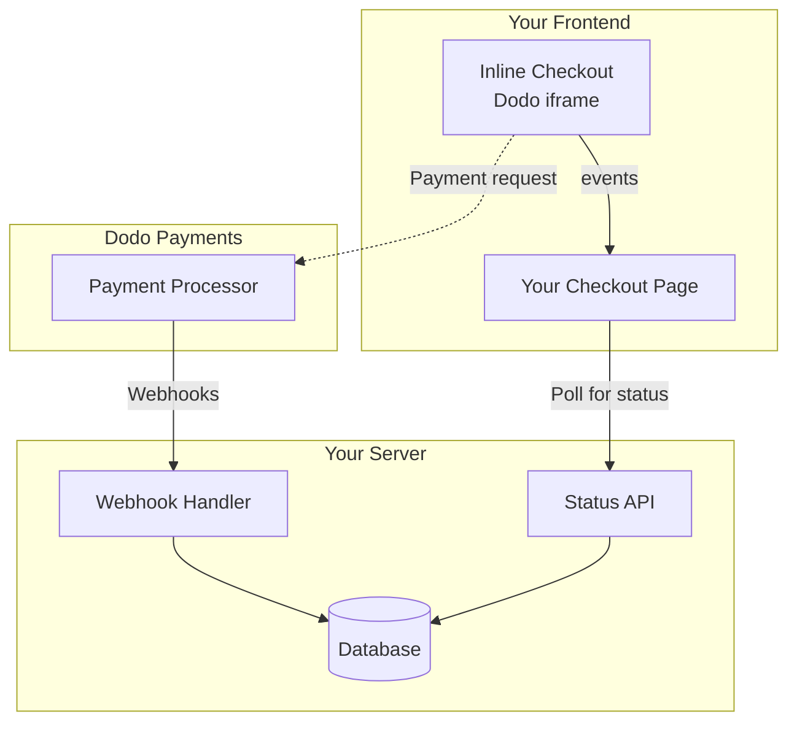

## Overview

Inline checkout lets you create fully integrated checkout experiences that blend seamlessly with your website or application. Unlike the [overlay checkout](/developer-resources/overlay-checkout), which opens as a modal on top of your page, inline checkout embeds the payment form directly into your page layout.

Using inline checkout, you can:

- Create checkout experiences that are fully integrated with your app or website
- Let Dodo Payments securely capture customer and payment information in an optimized checkout frame
- Display items, totals, and other information from Dodo Payments on your page
- Use SDK methods and events to build advanced checkout experiences

<Frame>
    
</Frame>

## How It Works

Inline checkout works by embedding a secure Dodo Payments frame into your website or app.

The checkout frame handles collecting customer information and capturing payment details. Your page displays the items list, totals, and options for changing what's on the checkout. The SDK lets your page and the checkout frame interact with each other.

Dodo Payments automatically creates a subscription when a checkout completes, ready for you to provision.

<Note>
The inline checkout frame securely handles all sensitive payment information, ensuring PCI compliance without additional certification on your end.
</Note>

## What Makes a Good Inline Checkout?

It's important that customers know who they're buying from, what they're buying, and how much they're paying.

To build an inline checkout that's compliant and optimized for conversion, your implementation must include:

<Frame caption="Example inline checkout layout showing required elements">
    
</Frame>

1. **Recurring information**: If recurring, how often it recurs and the total to pay on renewal. If a trial, how long the trial lasts.
2. **Item descriptions**: A description of what's being purchased.
3. **Transaction totals**: Transaction totals, including subtotal, total tax, and grand total. Be sure to include the currency too.
4. **Dodo Payments footer**: The full inline checkout frame, including the checkout footer that has information about Dodo Payments, our terms of sale, and our privacy policy.
5. **Refund policy**: A link to your refund policy, if it differs from the Dodo Payments standard refund policy.

<Warning>
Always display the complete inline checkout frame, including the footer. Removing or hiding legal information violates compliance requirements.
</Warning>

## Customer Journey

The checkout flow is determined by your checkout session configuration. Depending on how you configure the checkout session, customers will experience a checkout that may present all information on a single page or across multiple steps.

<Steps>
<Step title="Customer opens checkout">

Sie können den Inline-Checkout öffnen, indem Sie Artikel oder eine bestehende Transaktion übergeben. Verwenden Sie das SDK, um Informationen auf der Seite anzuzeigen und zu aktualisieren, und SDK-Methoden, um Artikel basierend auf der Kundeninteraktion zu aktualisieren.
    

</Step>

<Step title="Customer enters their details">

Inline checkout first asks customers to enter their email address, select their country, and (where required) enter their ZIP or postal code. This step gathers all necessary information to determine taxes and available payment options.

You can prefill customer details and present saved addresses to streamline the experience.

</Step>

<Step title="Customer selects payment method">

After entering their details, customers are presented with available payment methods and the payment form. Options may include credit or debit card, PayPal, Apple Pay, Google Pay, and other local payment methods based on their location.

Display saved payment methods if available to speed up checkout.


</Step>

<Step title="Checkout completed">

Dodo Payments routes every payment to the best acquirer for that sale to get the best possible chance of success. Customers enter a success workflow that you can build.


</Step>

<Step title="Dodo Payments creates subscription">

Dodo Payments automatically creates a subscription for the customer, ready for you to provision. The payment method the customer used is held on file for renewals or subscription changes.


</Step>
</Steps>

## Quick Start

Get started with the Dodo Payments Inline Checkout in just a few lines of code:

```typescript
import { DodoPayments } from "dodopayments-checkout";

// Initialize the SDK for inline mode
DodoPayments.Initialize({
  mode: "test",
  displayType: "inline",
  onEvent: (event) => {
    console.log("Checkout event:", event);
  },
});

// Open checkout in a specific container
DodoPayments.Checkout.open({
  checkoutUrl: "https://test.checkout.dodopayments.com/session/cks_123",
  elementId: "dodo-inline-checkout" // ID of the container element
});
```

<Tip>
Ensure you have a container element with the corresponding `id` on your page: `<div id="dodo-inline-checkout"></div>`.
</Tip>

## Step-by-Step Integration Guide

<Steps>
<Step title="Install the SDK">

Install the Dodo Payments Checkout SDK:

<CodeGroup>

```bash npm
npm install dodopayments-checkout
```

```bash yarn
yarn add dodopayments-checkout
```

```bash pnpm
pnpm add dodopayments-checkout
```

</CodeGroup>

</Step>

<Step title="Initialize the SDK for Inline Display">

Initialize the SDK and specify `displayType: 'inline'`. You should also listen for the `checkout.breakdown` event to update your UI with real-time tax and total calculations.

```typescript
import { DodoPayments } from "dodopayments-checkout";

DodoPayments.Initialize({
  mode: "test",
  displayType: "inline",
  onEvent: (event) => {
    if (event.event_type === "checkout.breakdown") {
      const breakdown = event.data?.message;
      // Update your UI with breakdown.subTotal, breakdown.tax, breakdown.total, etc.
    }
  },
});
```

</Step>

<Step title="Create a Container Element">

Add an element to your HTML where the checkout frame will be injected:

```html
<div id="dodo-inline-checkout"></div>
```

</Step>

<Step title="Open the Checkout">

Call `DodoPayments.Checkout.open()` with the `checkoutUrl` and the `elementId` of your container:

```typescript
DodoPayments.Checkout.open({
  checkoutUrl: "https://test.checkout.dodopayments.com/session/cks_123",
  elementId: "dodo-inline-checkout"
});
```

</Step>

<Step title="Test Your Integration">

1. Start your development server:

```bash
npm run dev
```

2. Test the checkout flow:
   - Enter your email and address details in the inline frame.
   - Verify that your custom order summary updates in real-time.
   - Test the payment flow using test credentials.
   - Confirm redirects work correctly.

<Check>
You should see `checkout.breakdown` events logged in your browser console if you added a console log in the `onEvent` callback.
</Check>

</Step>

<Step title="Go Live">

When you're ready for production:

1. Change the mode to `'live'`:

```typescript
DodoPayments.Initialize({
  mode: "live",
  displayType: "inline",
  onEvent: (event) => {
    // Handle events
  }
});
```

2. Update your checkout URLs to use live checkout sessions from your backend.
3. Test the complete flow in production.

</Step>
</Steps>

## Complete React Example

This example demonstrates how to implement a custom order summary alongside the inline checkout, keeping them in sync using the `checkout.breakdown` event.

```tsx
"use client";

import { useEffect, useState } from 'react';
import { DodoPayments, CheckoutBreakdownData } from 'dodopayments-checkout';

export default function CheckoutPage() {
  const [breakdown, setBreakdown] = useState<Partial<CheckoutBreakdownData>>({});

  useEffect(() => {
    // 1. Initialize the SDK
    DodoPayments.Initialize({
      mode: 'test',
      displayType: 'inline',
      onEvent: (event) => {
        // 2. Listen for the 'checkout.breakdown' event
        if (event.event_type === "checkout.breakdown") {
          const message = event.data?.message as CheckoutBreakdownData;
          if (message) setBreakdown(message);
        }
      }
    });

    // 3. Open the checkout in the specified container
    DodoPayments.Checkout.open({
      checkoutUrl: 'https://test.checkout.dodopayments.com/session/cks_123',
      elementId: 'dodo-inline-checkout'
    });

    return () => DodoPayments.Checkout.close();
  }, []);

  const format = (amt: number | null | undefined, curr: string | null | undefined) => 
    amt != null && curr ? `${curr} ${(amt/100).toFixed(2)}` : '0.00';

  const currency = breakdown.currency ?? breakdown.finalTotalCurrency ?? '';

  return (
    <div className="flex flex-col md:flex-row min-h-screen">
      {/* Left Side - Checkout Form */}
      <div className="w-full md:w-1/2 flex items-center">
        <div id="dodo-inline-checkout" className='w-full' />
      </div>

      {/* Right Side - Custom Order Summary */}
      <div className="w-full md:w-1/2 p-8 bg-gray-50">
        <h2 className="text-2xl font-bold mb-4">Order Summary</h2>
        <div className="space-y-2">
          {breakdown.subTotal && (
            <div className="flex justify-between">
              <span>Subtotal</span>
              <span>{format(breakdown.subTotal, currency)}</span>
            </div>
          )}
          {breakdown.discount && (
            <div className="flex justify-between">
              <span>Discount</span>
              <span>{format(breakdown.discount, currency)}</span>
            </div>
          )}
          {breakdown.tax != null && (
            <div className="flex justify-between">
              <span>Tax</span>
              <span>{format(breakdown.tax, currency)}</span>
            </div>
          )}
          <hr />
          {(breakdown.finalTotal ?? breakdown.total) && (
            <div className="flex justify-between font-bold text-xl">
              <span>Total</span>
              <span>{format(breakdown.finalTotal ?? breakdown.total, breakdown.finalTotalCurrency ?? currency)}</span>
            </div>
          )}
        </div>
      </div>
    </div>
  );
}

```

## API Reference

### Configuration

#### Initialize Options

```typescript
interface InitializeOptions {
  mode: "test" | "live";
  displayType: "inline"; // Required for inline checkout
  onEvent: (event: CheckoutEvent) => void;
}
```

| Option | Type | Required | Description |
|--------|------|----------|-------------|
| `mode` | `"test" \| "live"` | Yes | Environment mode. |
| `displayType` | `"inline" \| "overlay"` | Yes | Must be set to `"inline"` to embed the checkout. |
| `onEvent` | `function` | Yes | Callback function for handling checkout events. |

#### Checkout Options

```typescript
export type FontSize = "xs" | "sm" | "md" | "lg" | "xl" | "2xl";
export type FontWeight = "normal" | "medium" | "bold" | "extraBold";

interface CheckoutOptions {
  checkoutUrl: string;
  elementId: string; // Required for inline checkout
  options?: {
    showTimer?: boolean;
    showSecurityBadge?: boolean;
    payButtonText?: string;
    fontSize?: FontSize;
    fontWeight?: FontWeight;
  };
}
```

| Option | Type | Required | Beschreibung |
|--------|------|----------|-------------|
| `checkoutUrl` | `string` | Ja | URL der Checkout-Sitzung. |
| `elementId` | `string` | Ja | Das `id` des DOM-Elements, in dem der Checkout gerendert werden soll. |
| `options.showTimer` | `boolean` | Nein | Den Checkout-Timer anzeigen oder ausblenden. Standard ist `true`. Wenn deaktiviert, erhalten Sie das `checkout.link_expired`-Ereignis, wenn die Sitzung abläuft. |
| `options.showSecurityBadge` | `boolean` | Nein | Das Sicherheitsabzeichen anzeigen oder ausblenden. Standard ist `true`. |
| `options.payButtonText` | `string` | Nein | Benutzerdefinierter Text, der auf der Bezahltaste angezeigt wird. |
| `options.fontSize` | `FontSize` | Nein | Globale Schriftgröße für den Checkout. |
| `options.fontWeight` | `FontWeight` | Nein | Globales Schriftgewicht für den Checkout. |

### Methods

#### Open Checkout

Opens the checkout frame in the specified container.

```typescript
DodoPayments.Checkout.open({
  checkoutUrl: "https://test.checkout.dodopayments.com/session/cks_123",
  elementId: "dodo-inline-checkout"
});
```

You can also pass additional options to customize the checkout behavior:

```typescript
DodoPayments.Checkout.open({
  checkoutUrl: "https://test.checkout.dodopayments.com/session/cks_123",
  elementId: "dodo-inline-checkout",
  options: {
    showTimer: false,
    showSecurityBadge: false,
    payButtonText: "Pay Now",
  },
});
```

#### Checkout-Schließen

Entfernt das Checkout-Frame programmgesteuert und bereinigt Ereignislistener.

```typescript
DodoPayments.Checkout.close();
```

#### Status überprüfen

Gibt zurück, ob das Checkout-Frame derzeit injiziert ist.

```typescript
const isOpen = DodoPayments.Checkout.isOpen();
// Returns: boolean
```

### Ereignisse

Das SDK bietet Echtzeit-Ereignisse über den `onEvent`-Rückruf. Für den Inline-Checkout ist `checkout.breakdown` besonders nützlich für die Synchronisierung Ihrer Benutzeroberfläche.

| Ereignistyp | Beschreibung |
|------------|-------------|
| `checkout.opened` | Checkout-Frame wurde geladen. |
| `checkout.form_ready` | Checkout-Formular ist bereit, Benutzereingaben zu empfangen. Nützlich zum Verbergen von Ladezuständen und Anzeigen der Checkout-Benutzeroberfläche. |
| `checkout.breakdown` | Ausgelöst, wenn Preise, Steuern oder Rabatte aktualisiert werden. |
| `checkout.customer_details_submitted` | Kundendetails wurden übermittelt. |
| `checkout.pay_button_clicked` | Ausgelöst, wenn der Kunde auf die Bezahltaste klickt. Nützlich für Analysen und das Tracking von Conversion-Trichtern. |
| `checkout.redirect` | Der Checkout wird eine Weiterleitung durchführen (z.B. zu einer Bankseite). |
| `checkout.error` | Ein Fehler ist während des Checkouts aufgetreten. |
| `checkout.link_expired` | Ausgelöst, wenn die Checkout-Sitzung abläuft. Nur empfangen, wenn `showTimer` auf `false` eingestellt ist. |

#### Checkout-Breakdown-Daten

Das `checkout.breakdown`-Ereignis liefert die folgenden Daten:

```typescript
interface CheckoutBreakdownData {
  subTotal?: number;          // Amount in cents
  discount?: number;         // Amount in cents
  tax?: number;              // Amount in cents
  total?: number;            // Amount in cents
  currency?: string;         // e.g., "USD"
  finalTotal?: number;       // Final amount including adjustments
  finalTotalCurrency?: string; // Currency for the final total
}
```

#### Verständnis des Breakdown-Ereignisses

Das `checkout.breakdown`-Ereignis ist der Hauptweg, um die Benutzeroberfläche Ihrer Anwendung mit dem Dodo Payments Checkout-Status zu synchronisieren.

**Wann es ausgelöst wird:**
- **Bei der Initialisierung**: Unmittelbar nachdem das Checkout-Frame geladen und bereit ist.
- **Bei Adressänderung**: Jedes Mal, wenn der Kunde ein Land auswählt oder eine Postleitzahl eingibt, die eine Steuerneuberechnung zur Folge hat.

**Felddetails:**

| Field | Description |
|-------|-------------|
| `subTotal` | Die Summe aller Einzelposten in der Sitzung, bevor Rabatte oder Steuern angewendet werden. |
| `discount` | Der Gesamtwert aller angewendeten Rabatte. |
| `tax` | Der berechnete Steuerbetrag. Im Modus `inline` wird dieser dynamisch aktualisiert, während der Benutzer mit den Adressfeldern interagiert. |
| `total` | Das mathematische Ergebnis von `subTotal - discount + tax` in der Basiswährung der Sitzung. |
| `currency` | Der ISO-Währungscode (z. B. `"USD"`) für die Standardwerte von Zwischensumme, Rabatt und Steuer. |
| `finalTotal` | Der tatsächliche Betrag, der dem Kunden berechnet wird. Dieser kann zusätzliche Wechselkursanpassungen oder Gebühren für lokale Zahlungsmethoden enthalten, die nicht Teil der grundlegenden Preisaufschlüsselung sind. |
| `finalTotalCurrency` | Die Währung, in der der Kunde tatsächlich bezahlt. Diese kann sich von `currency` unterscheiden, wenn [Kaufkraftparität](/features/purchasing-power-parity) oder die Umrechnung in die lokale Währung aktiv ist. |

**Wichtige Integrationstipps:**

1.  **Währungsformatierung**: Preise werden immer als ganze Zahlen in der kleinsten Währungseinheit zurückgegeben (z.B. Cent für USD, Yen für JPY). Um sie anzuzeigen, dividieren Sie durch 100 (oder die entsprechende Zehnerpotenz) oder verwenden Sie eine Formatbibliothek wie `Intl.NumberFormat`.
2.  **Umgang mit Anfangszuständen**: Wenn der Checkout zum ersten Mal geladen wird, können `tax` und `discount` `0` oder `null` sein, bis der Benutzer seine Rechnungsinformationen bereitstellt oder einen Code anwendet. Ihre Benutzeroberfläche sollte diese Zustände elegant behandeln (z.B. ein Strich `—` zeigen oder die Zeile ausblenden).
3.  **Der "endgültige Gesamtbetrag" vs. "Gesamtbetrag"**: Während `total` Ihnen die Standardpreiskalkulation gibt, ist `finalTotal` die Quelle der Wahrheit für die Transaktion. Wenn `finalTotal` vorhanden ist, spiegelt es genau wider, was der Karte des Kunden belastet wird, einschließlich aller dynamischen Anpassungen.
4.  **Echtzeitrückmeldung**: Verwenden Sie das Feld `tax`, um den Benutzern anzuzeigen, dass Steuern in Echtzeit berechnet werden. Dies vermittelt ein "Live"-Gefühl zu Ihrer Checkout-Seite und reduziert Reibungen während des Adresseingabeschritts.

## Implementierungsoptionen

### Paketmanager-Installation

Installieren Sie über npm, yarn oder pnpm wie im [Schritt-für-Schritt-Integrationsleitfaden](#step-by-step-integration-guide) gezeigt.

### CDN-Implementierung

Für schnelle Integration ohne Build-Schritt, können Sie unser CDN verwenden:

```html
<!DOCTYPE html>
<html lang="en">
<head>
    <meta charset="UTF-8">
    <meta name="viewport" content="width=device-width, initial-scale=1.0">
    <title>Dodo Payments Inline Checkout</title>
    
    <!-- Load DodoPayments -->
    <script src="https://cdn.jsdelivr.net/npm/dodopayments-checkout@latest/dist/index.js"></script>
    <script>
        // Initialize the SDK
        DodoPaymentsCheckout.DodoPayments.Initialize({
            mode: "test",
            displayType: "inline",
            onEvent: (event) => {
                console.log('Checkout event:', event);
            }
        });
    </script>
</head>
<body>
    <div id="dodo-inline-checkout"></div>

    <script>
        // Open the checkout
        DodoPaymentsCheckout.DodoPayments.Checkout.open({
            checkoutUrl: "https://test.checkout.dodopayments.com/session/cks_123",
            elementId: "dodo-inline-checkout"
        });
    </script>
</body>
</html>
```

## Zahlungsart aktualisieren

Inline-Checkout unterstützt **Updates der Zahlungsmethode** für Abonnements. Wenn ein Kunde seine Zahlungsmethode aktualisieren muss - sei es für ein aktives Abonnement oder um ein pausiertes Abonnement zu reaktivieren - können Sie den Aktualisierungsablauf direkt in Ihrem Seitenlayout rendern.

### So funktioniert’s

1. Rufen Sie die [Update Payment Method API](/features/subscription#update-payment-method-for-active-subscription) auf, um eine `payment_link` zu erhalten:

```typescript
const response = await client.subscriptions.updatePaymentMethod('sub_123', {
  payment_method: { type: 'new', return_url: 'https://example.com/return' }
});
```

2. Geben Sie das zurückgegebene `payment_link` als `checkoutUrl` weiter, um den Inline-Checkout zu öffnen:

```typescript
DodoPayments.Checkout.open({
  checkoutUrl: response.payment_link,
  elementId: "dodo-inline-checkout"
});
```

Der Inline-Frame rendert nur das Erfassungsformular für die Zahlungsmethode. Kunden können neue Kartendetails eingeben oder eine gespeicherte Zahlungsmethode auswählen, ohne Ihre Seite zu verlassen.

### Für pausierte Abonnements

Wenn Sie die Zahlungsmethode für ein Abonnement im `on_hold`-Status aktualisieren, erstellt Dodo Payments automatisch eine Belastung für alle ausstehenden Beträge. Überwachen Sie die `payment.succeeded` und `subscription.active` Webhooks, um die Reaktivierung zu bestätigen.

```typescript
const response = await client.subscriptions.updatePaymentMethod('sub_123', {
  payment_method: { type: 'new', return_url: 'https://example.com/return' }
});

if (response.payment_id) {
  // Charge created for remaining dues
  // Open inline checkout for payment collection
  DodoPayments.Checkout.open({
    checkoutUrl: response.payment_link,
    elementId: "dodo-inline-checkout"
  });
}
```

<Tip>
Sie können auch eine vorhandene gespeicherte Zahlungsmethode verwenden, anstatt neue Details zu erfassen, indem Sie `type: 'existing'` mit einer `payment_method_id` an die Update Payment Method API übergeben.
</Tip>

## Fehlerbehandlung

Das SDK bietet detaillierte Fehlerinformationen über das Ereignissystem. Implementieren Sie immer eine ordnungsgemäße Fehlerbehandlung in Ihrem `onEvent`-Rückruf:

```typescript
DodoPayments.Initialize({
  mode: "test",
  displayType: "inline",
  onEvent: (event: CheckoutEvent) => {
    if (event.event_type === "checkout.error") {
      console.error("Checkout error:", event.data?.message);
      // Handle error appropriately
    }
  }
});
```

<Warning>
Immer das `checkout.error`-Ereignis behandeln, um eine gute Benutzererfahrung bei Problemen zu bieten.
</Warning>

## Best Practices

1. **Responsives Design**: Stellen Sie sicher, dass Ihr Containerelement genügend Breite und Höhe hat. Das iFrame wird typischerweise seine Containergröße ausfüllen.
2. **Synchronisation**: Verwenden Sie das `checkout.breakdown`-Ereignis, um Ihre benutzerdefinierte Bestellübersicht oder Preistabellen mit dem, was der Benutzer im Checkout-Frame sieht, synchron zu halten.
3. **Zustände des Skeletts**: Zeigen Sie einen Ladeindikator in Ihrem Container, bis das `checkout.opened`-Ereignis ausgelöst wird.
4. **Bereinigung**: Rufen Sie `DodoPayments.Checkout.close()` auf, wenn Ihre Komponente demontiert wird, um das iFrame und die Ereignislistener zu bereinigen.

<Info>
Für Implementierungen im Dunkelmodus wird empfohlen, `#0d0d0d` als Hintergrundfarbe zu verwenden, um eine optimale visuelle Integration mit dem Inline-Checkout-Frame zu gewährleisten.
</Info>

## Zahlungsstatusüberprüfung

<Warning>
Verlassen Sie sich nicht ausschließlich auf Inline-Checkout-Ereignisse, um Zahlungserfolg oder -fehler zu bestimmen. Implementieren Sie immer serverseitige Validierung mit Webhooks und/oder Polling.
</Warning>

### Warum serverseitige Validierung unerlässlich ist

Obwohl Inline-Checkout-Ereignisse Echtzeit-Feedback bieten, sollten sie **nicht** Ihre einzige Wahrheitsquelle für den Zahlungsstatus sein. Netzwerkprobleme, Browserabstürze oder das Schließen der Seite durch Benutzer können dazu führen, dass Ereignisse verpasst werden. Um eine zuverlässige Zahlungsvalidierung sicherzustellen:

1. **Ihr Server sollte Webhook-Ereignisse abhören** - Dodo Payments sendet Webhooks für Zahlungsstatusänderungen
2. **Implementieren Sie einen Polling-Mechanismus** - Ihr Frontend sollte Ihren Server auf Statusaktualisierungen abfragen
3. **Kombinieren Sie beide Ansätze** - Verwenden Sie Webhooks als primäre Quelle und Polling als Fallback

### Empfohlene Architektur



### Implementierungsschritte

**1. Zuhören nach Checkout-Ereignissen** - Wenn der Benutzer auf Bezahlen klickt, beginnen Sie mit der Vorbereitung zur Statusüberprüfung:

```typescript
onEvent: (event) => {
  if (event.event_type === 'checkout.pay_button_clicked') {
    // Start polling your server for confirmed status
    startPolling();
  }
}
```

**2. Ihren Server abfragen** - Erstellen Sie einen Endpunkt, der Ihre Datenbank auf den Zahlungsstatus überprüft (aktualisiert durch Webhooks):

```typescript
// Poll every 2 seconds until status is confirmed
const interval = setInterval(async () => {
  const { status } = await fetch(`/api/payments/${paymentId}/status`).then(r => r.json());
  if (status === 'succeeded' || status === 'failed') {
    clearInterval(interval);
    handlePaymentResult(status);
  }
}, 2000);
```

**3. Webhooks serverseitig behandeln** - Aktualisieren Sie Ihre Datenbank, wenn Dodo `payment.succeeded` oder `payment.failed` Webhooks sendet. Siehe unsere [Webhooks-Dokumentation](/developer-resources/webhooks) für Details.

## Fehlerbehebung

<AccordionGroup>
<Accordion title="Checkout frame is not appearing">
- Überprüfen Sie, dass `elementId` mit dem `id` eines tatsächlich im DOM vorhandenen `div` übereinstimmt.
- Stellen Sie sicher, dass `displayType: 'inline'` an `Initialize` übergeben wurde.
- Überprüfen Sie, ob das `checkoutUrl` gültig ist.
</Accordion>

<Accordion title="Taxes are not updating in my UI">
- Stellen Sie sicher, dass Sie das `checkout.breakdown`-Ereignis anhören.
- Steuern werden nur berechnet, nachdem der Benutzer ein gültiges Land und eine Postleitzahl im Checkout-Frame eingegeben hat.
</Accordion>
</AccordionGroup>

## Digitale Geldbörsen aktivieren

Für detaillierte Informationen zum Einrichten von Apple Pay, Google Pay und anderen digitalen Geldbörsen, siehe die Seite <a href="/features/payment-methods/digital-wallets">Digitale Geldbörsen</a>.

### Schnellsetup für Apple Pay

<Info>
Die Domainverifizierung ist nur für **Inline (embedded) Checkout** erforderlich. Für Hosted Checkout ist sie nicht erforderlich.
</Info>

<Warning>
Apple Pay ist für Overlay Checkout nicht verfügbar.
</Warning>

Apple Pay wird pro Domain über das Dashboard verifiziert.

<Steps>
<Step title="Open Wallet domains">
Gehe zu **Settings → Payment Methods** und klicke in der Zeile **Apple Pay** auf **Manage domains**.

<Frame caption="Open Wallet domains from the Apple Pay row">
  
</Frame>
</Step>

<Step title="Download the domain association file">
Lade im Bereich „Wallet domains“ die Zuordnungsdatei herunter.

<Frame caption="Download the Apple Pay domain association file">
  
</Frame>
</Step>

<Step title="Register your domain">
Klicke auf **Register domain** und gib die Domain ein, auf der du Inline Checkout einbindest (z. B. `shop.example.com`). Klicke anschließend auf **Continue**.

<Frame caption="Register the domain where you embed inline checkout">
  
</Frame>
</Step>

<Step title="Host the file on your domain">
Stelle sie unter folgender Adresse bereit:

```
https://shop.example.com/.well-known/apple-developer-merchantid-domain-association
```

Die Datei muss über HTTPS bereitgestellt werden, ohne Weiterleitungen erreichbar sein und mit `Content-Type: application/octet-stream` oder `text/plain` bereitgestellt werden.
</Step>

<Step title="Verify the domain">
Klicke auf **Verify domain**. Dodo Payments bestätigt, dass die Datei verfügbar ist, und übermittelt deine Domain an Apple.

<Frame caption="Verify the hosted association file">
  
</Frame>
</Step>

<Step title="Confirm it's active">
Wenn der Status **Active** anzeigt, ist Apple Pay für diese Domain aktiviert. Verwende den Schalter **Enabled**, um Apple Pay pro Domain ein- oder auszuschalten.

<Frame caption="Verified domains show an Active status">
  
</Frame>
</Step>

<Step title="Test the integration">
1. Öffne den Checkout auf einem Apple-Gerät
2. Überprüfe, ob die Apple-Pay-Schaltfläche angezeigt wird
3. Führe eine Testtransaktion durch
</Step>
</Steps>

## Browser-Unterstützung

Das Dodo Payments Checkout SDK unterstützt die folgenden Browser:

- Chrome (aktuell)
- Firefox (aktuell)
- Safari (aktuell)
- Edge (aktuell)
- IE11+

## Inline vs. Overlay Checkout

Wähle den passenden Checkout-Typ für deinen Anwendungsfall:

| Feature | Inline Checkout | Overlay Checkout |
|---------|-----------------|------------------|
| Integrationstiefe | Vollständig in die Seite eingebettet | Modal über der Seite |
| Layoutkontrolle | Vollständige Kontrolle | Eingeschränkt |
| Branding | Nahtlos | Von der Seite getrennt |
| Implementierungsaufwand | Höher | Geringer |
| Am besten geeignet für | Individuelle Checkout-Seiten, Flows mit hoher Conversion | Schnelle Integration, bestehende Seiten |

<Tip>
Verwende **Inline Checkout**, wenn du maximale Kontrolle über das Checkout-Erlebnis und nahtloses Branding möchtest. Verwende **Overlay Checkout** für eine schnellere Integration mit minimalen Änderungen an deinen bestehenden Seiten.
</Tip>

## Verwandte Ressourcen

<CardGroup cols={2}>
<Card title="Overlay Checkout" icon="layer-group" href="/developer-resources/overlay-checkout">
    Verwende Overlay Checkout für eine schnelle, modalbasierte Integration.
</Card>

<Card title="Checkout Sessions API" icon="code" href="/api-reference/checkout-sessions/create">
    Erstelle Checkout-Sessions, um deine Checkout-Erlebnisse zu ermöglichen.
</Card>

<Card title="Webhooks" icon="webhook" href="/developer-resources/webhooks">
    Verarbeite Payment-Events serverseitig mit Webhooks.
</Card>

<Card title="Integration Guide" icon="book" href="/developer-resources/integration-guide">
    Vollständiger Leitfaden zur Integration von Dodo Payments.
</Card>
</CardGroup>

Weitere Unterstützung erhältst du in unserer [Discord-Community](https://discord.gg/bYqAp4ayYh) oder bei unserem Entwickler-Supportteam.
