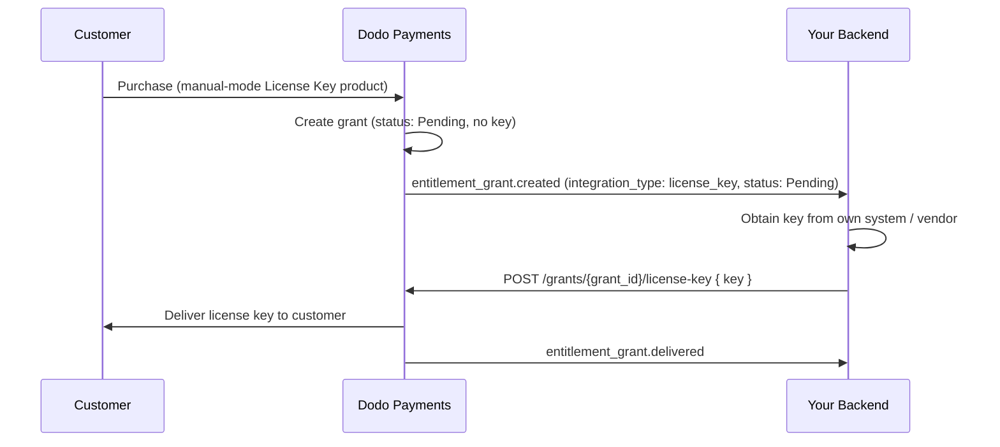

This guide walks through building a **manual license key fulfillment** system end to end. Instead of Dodo Payments auto-generating a key on payment, each purchase creates a `Pending` grant and waits for *you* to supply the key value from your own system, a third-party vendor, or a finite pool of codes.

By the end you will have:

- A product with a License Key entitlement set to `manual` fulfillment.
- A webhook listener that detects when a customer is waiting for a key.
- A fulfillment call that delivers the key and notifies the customer automatically.

<CardGroup cols={2}>
<Card title="License Keys overview" icon="key" href="/features/license-keys">
The full license key lifecycle and the `fulfillment_mode` setting.
</Card>
<Card title="Fulfill License Key Grant API" icon="code" href="/api-reference/entitlements/fulfill-license-key">
API reference for the endpoint you call to deliver a key.
</Card>
</CardGroup>

## How It Works



Manual fulfillment changes only the **issuance** step. Activation, validation, deactivation, expiry, and revocation behave exactly like an auto-generated key once delivered.

## Prerequisites

To follow this guide you'll need:

- Ein Dodo Payments-Händlerkonto.
- Ihren API-Schlüssel (`DODO_PAYMENTS_API_KEY`) und Webhook-Secret-Key aus dem Dashboard. Weitere Informationen finden Sie im [Leitfaden zur Generierung von API-Schlüsseln](/api-reference/introduction#api-key-management-and-authentication).
- Einen Backend-Endpunkt, der Webhooks empfangen kann.

<Info>
Use `https://test.dodopayments.com` and test-mode credentials while building. Switch to `https://live.dodopayments.com` and live keys when you go to production.
</Info>

## Step 1 — Create a License Key Entitlement in Manual Mode

An **entitlement** is a reusable definition of what you deliver. Create a License Key entitlement and set its `fulfillment_mode` to `manual`.

<Tabs>
<Tab title="Dashboard">
<Steps>
<Step title="Open Entitlements">
Go to **Entitlements** in your dashboard and click **+** to create a new entitlement.
</Step>
<Step title="Choose License Key">
Select **License Key** as the integration and give it a **Name**. The form exposes these fields:

- **Fulfillment Mode** — `Automatic` by default. This is the setting that enables manual fulfillment; you change it in the next step.
- **License Length** — how long each issued key stays valid, or **No expiration**.
- **Activations Limit** — maximum activations per key, or **Unlimited**.
- **Activation Message** — optional customer-facing message shown when they activate the key.

<Frame>

</Frame>
</Step>
<Step title="Set Fulfillment Mode to Manual">
Open the **Fulfillment Mode** dropdown and change it from **Automatic** to **Manual**. This is the setting that drives this entire guide — without it, keys are generated and emailed automatically and no pending grant is created. With **Manual** selected, each purchase creates a `Pending` grant for you to fulfill. Click **Create Entitlement** to save.
</Step>
</Steps>
</Tab>

<Tab title="API">
Create the entitlement with `integration_config.fulfillment_mode` set to `manual`.

<CodeGroup>

```typescript Node.js theme={null}
import DodoPayments from 'dodopayments';

const client = new DodoPayments({
  bearerToken: process.env.DODO_PAYMENTS_API_KEY,
  environment: 'test_mode', // defaults to 'live_mode'
});

const entitlement = await client.entitlements.create({
  name: 'Pro License (Manual)',
  integration_type: 'license_key',
  integration_config: {
    fulfillment_mode: 'manual',
    activations_limit: 5,
    duration_count: 1,
    duration_interval: 'Year',
  },
});

console.log(entitlement.id); // ent_...
```

```python Python theme={null}
import os
from dodopayments import DodoPayments

client = DodoPayments(
    bearer_token=os.environ.get("DODO_PAYMENTS_API_KEY"),
    environment="test_mode",  # defaults to "live_mode"
)

entitlement = client.entitlements.create(
    name="Pro License (Manual)",
    integration_type="license_key",
    integration_config={
        "fulfillment_mode": "manual",
        "activations_limit": 5,
        "duration_count": 1,
        "duration_interval": "Year",
    },
)

print(entitlement.id)
```

```bash cURL theme={null}
curl -X POST https://test.dodopayments.com/entitlements \
  -H "Authorization: Bearer $DODO_PAYMENTS_API_KEY" \
  -H "Content-Type: application/json" \
  -d '{
    "name": "Pro License (Manual)",
    "integration_type": "license_key",
    "integration_config": {
      "fulfillment_mode": "manual",
      "activations_limit": 5,
      "duration_count": 1,
      "duration_interval": "Year"
    }
  }'
```

</CodeGroup>
</Tab>
</Tabs>

<Note>
`fulfillment_mode` defaults to `auto`. Omitting it, or leaving an existing entitlement unchanged, keeps the automatic behavior. Only entitlements explicitly set to `manual` create pending grants.
</Note>

## Step 2 — Attach the Entitlement to a Product

Open the product you want to sell, expand **Advanced Settings → Entitlements & Credits**, and select the **License Key entitlement you set to Manual** in Step 1. A single product can deliver this license key alongside other entitlements on the same purchase.

<Frame caption="Selecting the License Key entitlement in the product entitlements panel.">

</Frame>

<Note>
Fulfillment mode is a property of the **entitlement**, not the product. Because you set it to **Manual** in Step 1, every product this entitlement is attached to creates `Pending` license-key grants on purchase — there is nothing extra to configure here.
</Note>

<Tip>
If you don't have a product yet, create one first (one-time or subscription). See the [One-time Payments Integration Guide](/developer-resources/integration-guide) for selling the product through checkout.
</Tip>

## Step 3 — Detect Pending Grants

When a customer buys the product, Dodo Payments creates a grant in `Pending` status with **no key attached** and fires an `entitlement_grant.created` webhook. This is your signal that a customer is waiting for a key.

### Listen for the webhook

Set up a webhook endpoint (Developer → Webhooks in the dashboard) and act on pending license-key grants. The implementation follows the [Standard Webhooks](https://standardwebhooks.com/) specification.

```typescript theme={null}
import { Webhook } from 'standardwebhooks';

const webhook = new Webhook(process.env.DODO_WEBHOOK_KEY!);

export async function POST(request: Request) {
  const rawBody = await request.text();
  const headers = {
    'webhook-id': request.headers.get('webhook-id') || '',
    'webhook-signature': request.headers.get('webhook-signature') || '',
    'webhook-timestamp': request.headers.get('webhook-timestamp') || '',
  };

  await webhook.verify(rawBody, headers);
  const event = JSON.parse(rawBody);

  // A customer bought a manual-mode license key and is waiting for it.
  if (
    event.type === 'entitlement_grant.created' &&
    event.data.integration_type === 'license_key' &&
    event.data.status === 'Pending'
  ) {
    await queueLicenseKeyFulfillment({
      grantId: event.data.id,
      customerId: event.data.customer_id,
    });
  }

  return new Response('ok');
}
```

The grant payload carries `integration_type: "license_key"`, so you can recognize a license-key grant without an extra lookup. See the [Entitlement Grant webhook reference](/developer-resources/webhooks/intents/entitlement-grant) for the full payload.

### Or poll the List Grants API

If you'd rather not rely on webhooks, list the grants for your License Key entitlement and filter by `status`. Every grant on a License Key entitlement is already a license-key grant, so no `integration_type` filter is needed:

<CodeGroup>

```typescript Node.js theme={null}
const pending = await client.entitlements.grants.list('ent_license_key_id', {
  status: 'Pending',
});

for (const grant of pending.items) {
  console.log(`Grant ${grant.id} for customer ${grant.customer_id} needs a key`);
}
```

```bash cURL theme={null}
curl -G https://test.dodopayments.com/entitlements/ent_license_key_id/grants \
  -H "Authorization: Bearer $DODO_PAYMENTS_API_KEY" \
  --data-urlencode "status=Pending"
```

</CodeGroup>

## Step 4 — Deliver the Key

Obtain the key value from your own system, then submit it with the [Fulfill License Key Grant](/api-reference/entitlements/fulfill-license-key) endpoint. This requires your secret API key (Editor permission); it is **not** one of the public license endpoints.

<CodeGroup>

```typescript Node.js theme={null}
async function fulfill(grantId: string, key: string) {
  const res = await fetch(
    `https://test.dodopayments.com/grants/${grantId}/license-key`,
    {
      method: 'POST',
      headers: {
        'Content-Type': 'application/json',
        Authorization: `Bearer ${process.env.DODO_PAYMENTS_API_KEY}`,
      },
      body: JSON.stringify({
        key,
        // Optional — fall back to the entitlement config when omitted
        activations_limit: 5,
        expires_at: '2027-05-01T00:00:00Z',
      }),
    },
  );

  if (!res.ok) {
    // See the status code table below for handling
    throw new Error(`Fulfillment failed: ${res.status}`);
  }

  return res.json(); // updated grant, now status: "Delivered"
}
```

```bash cURL theme={null}
curl -X POST https://test.dodopayments.com/grants/grant_8VbC6JDZ/license-key \
  -H "Authorization: Bearer $DODO_PAYMENTS_API_KEY" \
  -H "Content-Type: application/json" \
  -d '{
    "key": "PRO-AAAA-BBBB-CCCC-DDDD",
    "activations_limit": 5,
    "expires_at": "2027-05-01T00:00:00Z"
  }'
```

</CodeGroup>

### Request fields

<ParamField body="key" type="string" required>
The license key string to deliver to the customer. Whitespace is trimmed; an empty or whitespace-only value is rejected.
</ParamField>

<ParamField body="activations_limit" type="integer">
Per-key activation limit. Falls back to the entitlement config when omitted.
</ParamField>

<ParamField body="expires_at" type="string">
Per-key expiry (ISO 8601). Falls back to the entitlement config's duration when omitted. For subscription-issued grants, validity remains tied to the subscription regardless.
</ParamField>

On success the grant moves to `Delivered`, the customer is sent the key automatically (the same email they'd receive under auto fulfillment), and the `license_key.created` and `entitlement_grant.delivered` webhook events fire.

The customer receives an email with the license key, the product, activation limit, expiry, and your activation instructions:

<Frame caption="The license key email the customer receives once you fulfill the grant.">

</Frame>

<Check>
You do not need to email the key yourself — delivery happens automatically when the grant is fulfilled.
</Check>

## Step 5 — Handle Errors and Retries

The endpoint validates the grant before delivering anything. Handle these responses:

| Status | Meaning | What to do |
|---|---|---|
| `200` | Key delivered, grant is now `Delivered`. | Done. |
| `400` | Not a license-key grant, or the key is empty/whitespace. | Fix the request; do not retry as-is. |
| `404` | No grant with that ID for your business. | Verify the `grant_id`. |
| `409` | Grant not awaiting fulfillment (already delivered or already has a key), **or** the key value already exists. | If already delivered, treat as success. If a duplicate key, supply a different key. |
| `422` | Request body failed validation (e.g. `activations_limit < 1`). | Correct the field and retry. |

<Warning>
Fulfillment is safe to retry on transient errors (timeouts, `5xx`). Each grant can be fulfilled only once, so a retry after a successful-but-unacknowledged call returns `409` rather than issuing a second key or sending a duplicate email. Use the grant `id` as your idempotency key.
</Warning>

## Verify the Flow

1. Buy the product in test mode (see the [checkout guides](/developer-resources/integration-guide)).
2. Confirm your webhook received `entitlement_grant.created` with `status: "Pending"` and `integration_type: "license_key"`, or that the grant appears in the List Grants response with those filters.
3. Call the fulfill endpoint with a test key.
4. Confirm the response shows `status: "Delivered"` with a populated `license_key`, the customer receives the key email, and `entitlement_grant.delivered` fires.

<Check>
Once delivered, the customer can [activate and validate](/features/license-keys#activation-validation-deactivation) the key against the public license endpoints exactly like an auto-generated key.
</Check>

## Related API Reference

<CardGroup cols={2}>
<Card title="Create Entitlement" icon="plus" href="/api-reference/entitlements/create-entitlement">
Create the License Key entitlement with `fulfillment_mode: manual`.
</Card>
<Card title="List Grants" icon="users" href="/api-reference/entitlements/list-grants">
Filter by `status` and `customer_id` to find pending grants.
</Card>
<Card title="Fulfill License Key Grant" icon="code" href="/api-reference/entitlements/fulfill-license-key">
Deliver the key value and transition the grant to delivered.
</Card>
<Card title="Entitlement Grant Webhooks" icon="webhook" href="/developer-resources/webhooks/intents/entitlement-grant">
The `entitlement_grant.*` events that signal pending and delivered grants.
</Card>
</CardGroup>
