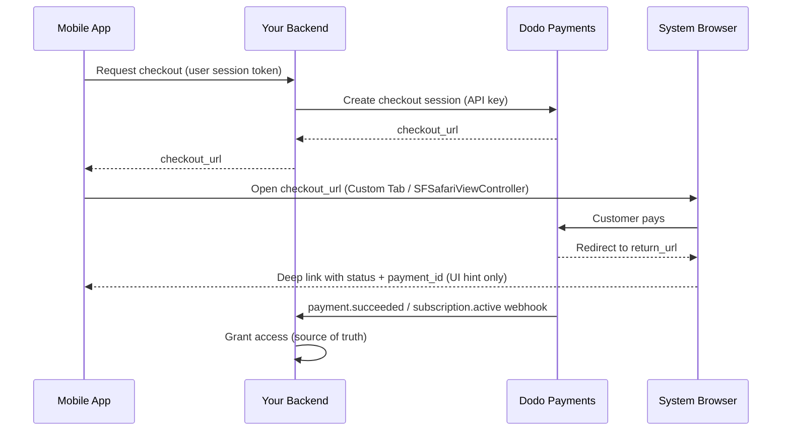

<CardGroup cols={4}>
<Card title="Quick Start" icon="rocket" href="#integration-workflow">
  Bringen Sie Ihre mobile Zahlungsintegration in 4 einfachen Schritten zum Laufen
</Card>

<Card title="Platform Examples" icon="code" href="#choose-your-sdk">
  Vollständige Codebeispiele für Android, iOS, React Native und Flutter
</Card>

<Card title="Checkout Customization" icon="sliders" href="#checkout-page-customization">
  Konfigurieren Sie Themes, Vorausfüllung und 14 mobile-spezifische Parameter
</Card>

<Card title="Mobile Recipes" icon="flask" href="#mobile-optimized-recipes">
  Checkout-Konfigurationen zum Kopieren und Einfügen für 5 häufige mobile Szenarien
</Card>
</CardGroup>

<Info>
Dodo Payments stellt ein offizielles Checkout-SDK für **Android, iOS, React Native,
und Flutter** bereit. Jedes SDK kapselt das unten dokumentierte Muster (Checkout-
URL öffnen, Rückgabe erfassen, Ergebnis analysieren) hinter einem einzigen typisierten `start(...)`-Aufruf und bietet eine integrierte Wiederherstellung abgebrochener Sitzungen. Verwenden Sie nur dann eine manuelle WebView, wenn keines der SDKs zu Ihrem Stack passt.
</Info>

## Voraussetzungen

Bevor Sie Dodo Payments in Ihre mobile App integrieren, stellen Sie sicher, dass Sie über Folgendes verfügen:

- **Dodo Payments-Konto**: Aktives Händlerkonto mit API-Zugriff
- **API-Zugangsdaten**: API-Schlüssel und Webhook-Secret-Key aus Ihrem Dashboard
- **Mobiles App-Projekt**: Android-, iOS-, React-Native- oder Flutter-Anwendung
- **Backend-Server**: Zur sicheren Erstellung von Checkout-Sitzungen

## Integrationsablauf

Die mobile Integration folgt einem sicheren Prozess in 4 Schritten, bei dem Ihr Backend die API-Aufrufe verarbeitet und Ihre mobile App die Benutzererfahrung steuert.



<Info>
Der Deep-Link `status` ist lediglich ein **UI-Hinweis** darauf, was dem Benutzer angezeigt werden soll. Gewähren Sie Zugriff immer über den `payment.succeeded` / `subscription.active` **Webhook** in Ihrem Backend – niemals allein auf Grundlage des mobilen Ergebnisses.
</Info>

<Steps>
<Step title="Backend: Create Checkout Session">
<Card title="Checkout Session API Docs" icon="book" href="/developer-resources/checkout-session">
Erfahren Sie, wie Sie eine Checkout-Sitzung in Ihrem Backend mit Node.js, Python und weiteren Technologien erstellen. Vollständige Beispiele und Parameterreferenzen finden Sie in der speziellen Dokumentation zur <strong>Checkout Sessions API</strong>.
</Card>
<Note>
**Sicherheit**: Checkout-Sitzungen müssen auf Ihrem Backend-Server erstellt werden, niemals in der mobilen App. Dadurch werden Ihre API-Schlüssel geschützt und eine korrekte Validierung sichergestellt.
</Note>

</Step>

<Step title="Mobile: Get Checkout URL">

Ihre mobile App ruft Ihr Backend auf, um die Checkout-URL abzurufen. Authentifizieren Sie diese Anfrage mit dem Sitzungstoken des angemeldeten Benutzers.

<Tabs>
<Tab title="iOS (Swift)">

```swift
func getCheckoutURL(productId: String, customerEmail: String, customerName: String) async throws -> String {
    let url = URL(string: "https://your-backend.com/api/create-checkout-session")!
    var request = URLRequest(url: url)
    request.httpMethod = "POST"
    request.setValue("application/json", forHTTPHeaderField: "Content-Type")
    request.setValue("Bearer \(userSessionToken)", forHTTPHeaderField: "Authorization")
    
    let requestData: [String: Any] = [
        "productId": productId,
        "customerEmail": customerEmail,
        "customerName": customerName
    ]
    request.httpBody = try JSONSerialization.data(withJSONObject: requestData)
    
    let (data, _) = try await URLSession.shared.data(for: request)
    let response = try JSONDecoder().decode(CheckoutResponse.self, from: data)
    return response.checkout_url
}
```

</Tab>
<Tab title="Android (Kotlin)">

```kotlin
suspend fun getCheckoutURL(productId: String, customerEmail: String, customerName: String): String {
    val client = OkHttpClient()
    val requestBody = JSONObject().apply {
        put("productId", productId)
        put("customerEmail", customerEmail)
        put("customerName", customerName)
    }.toString().toRequestBody("application/json".toMediaType())
    
    val request = Request.Builder()
        .url("https://your-backend.com/api/create-checkout-session")
        .header("Authorization", "Bearer $userSessionToken")
        .post(requestBody)
        .build()
    
    val response = client.newCall(request).execute()
    val responseBody = response.body?.string()
    val jsonResponse = JSONObject(responseBody ?: "")
    return jsonResponse.getString("checkout_url")
}
```

</Tab>
<Tab title="React Native (JavaScript)">

```javascript
const getCheckoutURL = async (productId, customerEmail, customerName) => {
  try {
    const response = await fetch('https://your-backend.com/api/create-checkout-session', {
      method: 'POST',
      headers: {
        'Content-Type': 'application/json',
        'Authorization': `Bearer ${userSessionToken}`,
      },
      body: JSON.stringify({
        productId,
        customerEmail,
        customerName
      })
    });
    
    const data = await response.json();
    return data.checkout_url;
  } catch (error) {
    console.error('Failed to get checkout URL:', error);
    throw error;
  }
};
```

</Tab>
<Tab title="Flutter (Dart)">

```dart
import 'dart:convert';
import 'package:http/http.dart' as http;

Future<String> getCheckoutUrl({
  required String productId,
  required String customerEmail,
  required String customerName,
}) async {
  final response = await http.post(
    Uri.parse('https://your-backend.com/api/create-checkout-session'),
    headers: {
      'Content-Type': 'application/json',
      'Authorization': 'Bearer $userSessionToken',
    },
    body: jsonEncode({
      'productId': productId,
      'customerEmail': customerEmail,
      'customerName': customerName,
    }),
  );

  if (response.statusCode != 200) {
    throw Exception('Failed to get checkout URL: ${response.statusCode}');
  }
  return jsonDecode(response.body)['checkout_url'] as String;
}
```

</Tab>
</Tabs>
<Note>
**Sicherheit**: Mobile Apps kommunizieren ausschließlich mit Ihrem Backend, niemals direkt mit der Dodo Payments API.
</Note>
</Step>

<Step title="Mobile: Open Checkout in Browser">
Öffnen Sie die Checkout-URL zur Zahlungsabwicklung in einem sicheren In-App-Browser.
Oder überspringen Sie die manuelle Einrichtung vollständig mit dem offiziellen Checkout-SDK für Ihre Plattform.

<Card title="Pick your mobile SDK" icon="box" href="#choose-your-sdk">
  Installationsschritte und Einrichtungsanweisungen für Android, iOS, React Native und Flutter.
</Card>

</Step>

<Step title="Backend: Handle Payment Completion">
Verarbeiten Sie den Abschluss der Zahlung über Webhooks und Redirect-URLs, um den Zahlungsstatus zu bestätigen.
</Step>
</Steps>

## SDK auswählen

Jedes mobile SDK stellt denselben Vertrag bereit: Ein `start(...)`-Aufruf öffnet den gehosteten Checkout von Dodo im nativen Browser der Plattform und gibt ein typisiertes `CheckoutResult` zurück, dessen `status` `succeeded`, `failed`, `cancelled`, `pending` oder `expired` ist. Keines davon enthält einen API-Schlüssel oder ruft die Dodo Payments API auf; alle vier unterstützen die Wiederherstellung abgebrochener Sitzungen.

<CardGroup cols={2}>
<Card title="Android" icon="android" href="/developer-resources/sdks/android">
  `com.dodopayments.api:checkout-android` öffnet einen Chrome Custom Tab. Erfordert `minSdk` 23.
</Card>
<Card title="iOS" icon="apple" href="/developer-resources/sdks/ios">
  `dodopayments-mobile-sdk-ios` öffnet `SFSafariViewController`. Erfordert iOS 16+.
</Card>
<Card title="React Native" icon="react" href="/developer-resources/sdks/react-native">
  `@dodopayments/react-native-checkout`, ein Turbo Module über beide nativen Kerne. Erfordert React Native 0.76+.
</Card>
<Card title="Flutter" icon="layer-group" href="/developer-resources/sdks/flutter">
  `dodopayments_checkout`, ein Pigeon-Kanal über beide nativen Kerne. Erfordert Flutter 3.44+.
</Card>
</CardGroup>

<Warning>
Der zurückgegebene `status` ist ein UI-Hinweis, kein Zahlungsnachweis. Bestätigen Sie jede Zahlung über Ihr Backend anhand des `payment.succeeded` / `subscription.active` Webhooks oder rufen Sie die Zahlung mit Ihrem Secret Key ab.
</Warning>

### Callback-URL-Schema registrieren

Alle vier SDKs übergeben die Kontrolle über ein benutzerdefiniertes URL-Schema an Ihre App, das Sie selbst auswählen, zum Beispiel `myapp://checkout/return`. Registrieren Sie es einmal pro Plattform:

<Tabs>
<Tab title="Android">

```kotlin android/app/build.gradle
android {
    defaultConfig {
        manifestPlaceholders["dodoCallbackScheme"] = "myapp"
    }
}
```

Das Manifest des SDKs deklariert die Redirect-Aktivität bereits, daher müssen Sie kein Manifest-XML hinzufügen.
</Tab>
<Tab title="iOS">

```xml Info.plist
<key>CFBundleURLTypes</key>
<array>
  <dict>
    <key>CFBundleURLName</key>
    <string>myapp</string>
    <key>CFBundleURLSchemes</key>
    <array>
      <string>myapp</string>
    </array>
  </dict>
</array>
```

Unter iOS müssen Sie eingehende URLs außerdem an das SDK weiterleiten, da `SFSafariViewController` seine eigene Rückgabe-URL nicht abfangen kann. Ausführliche Handler finden Sie auf der Seite [iOS](/developer-resources/sdks/ios) oder [React Native](/developer-resources/sdks/react-native).
</Tab>
<Tab title="Expo">
`@dodopayments/react-native-checkout` stellt ein Config-Plugin bereit, das das Schema für beide Plattformen unter `prebuild` registriert. Übergeben Sie ihm eine `scheme`-Option:

```json app.json
{
  "expo": {
    "scheme": "myapp",
    "plugins": [
      [
        "@dodopayments/react-native-checkout",
        { "scheme": "myappcheckout" }
      ]
    ]
  }
}
```

`scheme` muss mit `returnUrl` übereinstimmen und sich von `expo.scheme` unterscheiden, das Expo bereits unter `MainActivity` registriert. Einzelheiten finden Sie auf der Seite zum [React Native SDK](/developer-resources/sdks/react-native).

Wenn `android/app/build.gradle` ohne einen standardmäßigen `defaultConfig { }`-Block manuell gepflegt wird, setzen Sie den Platzhalter stattdessen manuell (siehe Tab „Android“).

Funktioniert nur mit Development Builds, nicht mit Expo Go. Führen Sie nach der Bearbeitung von `app.json` `npx expo prebuild --clean` aus.
</Tab>
</Tabs>

<Note>
Möchten Sie die Implementierung selbst erstellen? Öffnen Sie `checkout_url` im Systembrowser der Plattform (Android Custom Tabs / iOS `SFSafariViewController`), fangen Sie die Navigation zu `return_url` ab und lesen Sie anschließend die Query-Parameter `status` und `payment_id` aus. Die oben genannten SDKs erledigen dies für Sie.
</Note>

<Warning>
**Öffnen Sie den Checkout nicht in einer eingebetteten WebView (`WKWebView` / Android `WebView`).** Dies ist das häufigste Problem bei mobilen Integrationen: Eine eingebettete WebView **unterdrückt Apple Pay und Google Pay** und kann außerdem 3-D-Secure-Herausforderungen sowie das automatische Ausfüllen gespeicherter Karten beeinträchtigen. Dadurch sehen Kunden weniger Zahlungsoptionen und es treten mehr Fehler auf. Verwenden Sie immer das SDK oder öffnen Sie `checkout_url` im Systembrowser (Custom Tabs / `SFSafariViewController`). Genau deshalb funktionieren Apple Pay und Google Pay in dieser nativen Browseroberfläche weiterhin.
</Warning>

## Darstellung anpassen

Jedes SDK akzeptiert einen optionalen `customization`-Parameter für `start(...)` / `CheckoutParams`, der Darstellung und Verhalten der nativen Browseroberfläche steuert – Symbolleiste, Schaltflächen und Präsentation. Dies ist vom eigenen Theme der Checkout-Seite getrennt, das Sie serverseitig über [`customization.theme_config`](/developer-resources/checkout-session) in der Checkout-Sitzung konfigurieren.

Die Optionen sind nach Plattform gruppiert, da Android Custom Tab und iOS `SFSafariViewController` unterschiedliche native Steuerelemente bereitstellen. Alle Felder sind optional; wenn `customization` vollständig weggelassen wird, verwendet jede Plattform ihre Standarddarstellung.

<AccordionGroup>
<Accordion title="Android - Custom Tab">

<ParamField body="toolbarColor" type="Color">
Hintergrundfarbe der Symbolleiste.
</ParamField>

<ParamField body="navigationBarColor" type="Color">
Farbe der Navigationsleiste.
</ParamField>

<ParamField body="navigationBarDividerColor" type="Color">
Farbe der Trennlinie über der Navigationsleiste.
</ParamField>

<ParamField body="closeButtonStyle" type="'default' | 'back'">
`default` zeigt das systemeigene „X“-Symbol an; `back` zeichnet stattdessen einen Zurück-Pfeil.
</ParamField>

<ParamField body="closeButtonPosition" type="'start' | 'end'">
Auf welcher Seite der Symbolleiste die Schaltfläche zum Schließen angezeigt wird.
</ParamField>

<ParamField body="shareButtonEnabled" type="boolean">
Zeigt das Teilen-Symbol der Symbolleiste an.
</ParamField>

<ParamField body="showTitleEnabled" type="boolean">
Zeigt den Seitentitel unter der URL in der Symbolleiste an.
</ParamField>

<ParamField body="urlBarHidingEnabled" type="boolean">
Ermöglicht das automatische Ausblenden der Symbolleiste beim Scrollen.
</ParamField>

<ParamField body="bookmarksButtonEnabled" type="boolean">
Zeigt „Diese Seite als Lesezeichen speichern“ im Überlaufmenü an.
</ParamField>

<ParamField body="downloadsButtonEnabled" type="boolean">
Zeigt „Seite herunterladen“ im Überlaufmenü an.
</ParamField>

<ParamField body="colorScheme" type="'system' | 'light' | 'dark'">
Erzwingt eine helle oder dunkle Darstellung unabhängig von der Systemeinstellung des Geräts.
</ParamField>

</Accordion>

<Accordion title="iOS - SFSafariViewController">

<ParamField body="dismissButtonStyle" type="'done' | 'close' | 'cancel'">
Beschriftung oder Symbol der Schaltfläche zum Schließen.
</ParamField>

<ParamField body="presentationStyle" type="'pageSheet' | 'fullScreen'">
`pageSheet` wird als Karte mit „Zum Schließen wischen“ angezeigt; `fullScreen` nimmt den gesamten Bildschirm ein.
</ParamField>

<ParamField body="barCollapsingEnabled" type="boolean">
Ermöglicht das Einklappen der Symbolleiste beim Scrollen. Nur sichtbar, wenn `presentationStyle` `fullScreen` ist – `pageSheet` hält die Leisten unabhängig von dieser Einstellung fixiert.
</ParamField>

<ParamField body="colorScheme" type="'system' | 'light' | 'dark'">
Erzwingt eine helle oder dunkle Darstellung unabhängig von der Systemeinstellung des Geräts.
</ParamField>

</Accordion>
</AccordionGroup>

<Tabs>
<Tab title="React Native">

```typescript
const result = await DodoCheckout.start({
  checkoutUrl,
  returnUrl: 'myapp://checkout/return',
  customization: {
    android: { toolbarColor: '#6366F1', closeButtonStyle: 'back' },
    ios: { presentationStyle: 'fullScreen', colorScheme: 'dark' },
  },
});
```

</Tab>
<Tab title="Flutter">

```dart
final result = await DodoCheckout.instance.start(
  CheckoutParams(
    checkoutUrl: Uri.parse(checkoutUrl),
    returnUrl: Uri.parse('myapp://checkout/return'),
    customization: BrowserCustomization(
      android: AndroidBrowserOptions(
        toolbarColor: Color(0xFF6366F1),
        closeButtonStyle: CloseButtonStyle.back,
      ),
      ios: IosBrowserOptions(
        presentationStyle: PresentationStyle.fullScreen,
        colorScheme: BrowserColorScheme.dark,
      ),
    ),
  ),
);
```

</Tab>
<Tab title="Android (Kotlin)">

```kotlin
val result = DodoCheckout.start(
    activity,
    CheckoutParams(
        checkoutUrl = checkoutUrl,
        returnUrl = "myapp://checkout/return",
        customization = BrowserCustomization(
            toolbarColor = Color.parseColor("#6366F1"),
            closeButtonStyle = BrowserCustomization.CloseButtonStyle.BACK,
        )
    )
) { event -> }
```

</Tab>
<Tab title="iOS (Swift)">

```swift
let result = try await DodoCheckout.start(
    checkoutUrl: checkoutUrl,
    returnUrl: URL(string: "myapp://checkout/return")!,
    customization: BrowserCustomization(
        presentationStyle: .fullScreen,
        colorScheme: .dark
    )
)
```

</Tab>
</Tabs>

## Checkout-Seite anpassen

Der Abschnitt [Darstellung anpassen](#appearance-customization) oben steuert die native Browseroberfläche – Symbolleiste, Schaltflächen und Farbschema. Die *Checkout-Seite selbst* – die angezeigten Felder, das Theme und die verfügbaren Zahlungsmethoden – wird serverseitig bei der Erstellung der Checkout-Sitzung konfiguriert. Diese Parameter haben den größten Einfluss auf die mobile Conversion.

Die folgenden Parameter befinden sich an drei verschiedenen Stellen der Checkout-Sitzungsanfrage – in der Spalte **Ziel** sehen Sie, zu welchem Objekt der jeweilige Parameter gehört. Dies falsch zu konfigurieren ist der häufigste Fehler: Ein Parameter im falschen Objekt wird stillschweigend ignoriert.

| Parameter | Ziel | Mobiler Vorteil | Standard | Festlegen, wenn … |
|-----------|---------------|---------------|---------|-----------|
| `show_order_details` | `customization` | Klappt die Bestellübersicht ein, sodass Zahlungsmethoden oben auf dem Bildschirm erscheinen | `true` | Auf Mobilgeräten immer `false` setzen – Zahlungsmethoden oberhalb des sichtbaren Bereichs zu platzieren, reduziert Abbrüche deutlich |
| `minimal_address` | oberste Ebene | Erfordert nur eine Postleitzahl; blendet Straße, Stadt und Bundesland aus | `false` | Auf Mobilgeräten fast immer – jedes zusätzliche Feld kostet Conversions |
| `theme` | `customization` | Steuert die helle oder dunkle Darstellung der Checkout-Seite | Unternehmensstandard | `"system"` verwenden, um die Präferenz des Gerätebetriebssystems zu übernehmen |
| `theme_config` | `customization` | Vollständige Markenpalette – Farben, Schriftarten, Eckenradius und Beschriftung der Bezahlschaltfläche | Keine | Wenn sich der Checkout wie ein Teil Ihrer App anfühlen soll |
| `force_language` | `customization` | Überschreibt die Erkennung der Browsersprache | Automatische Erkennung | Aus dem App-Locale setzen, statt sich auf den Browser zu verlassen |
| `show_on_demand_tag` | `customization` | Zeigt die Beschriftung „on-demand“ auf der Checkout-Seite an oder blendet sie aus | `true` | `false` setzen, wenn Sie On-Demand-Abrechnung ausschließlich zur Kartentokenisierung verwenden |
| `show_saved_payment_methods` | oberste Ebene | Zeigt die gespeicherten Karten eines wiederkehrenden Kunden für die Zahlung mit einem Tippen an | `false` | Für angemeldete Benutzer aktivieren, die bereits bezahlt haben |
| `allow_discount_code` | `feature_flags` | Zeigt das Eingabefeld für Promo-Codes an | `true` | `false` setzen, um das Formular zu verkürzen; Benutzer, die zum Suchen eines Codes die Seite verlassen, kehren selten zurück |
| `allow_currency_selection` | `feature_flags` | Ermöglicht dem Kunden, die Abrechnungswährung zu wechseln | `true` | `false` setzen, wenn Sie die Währung mit `billing_currency` festlegen |
| `redirect_immediately` | `feature_flags` | Überspringt die Erfolgsseite und springt direkt zu `return_url` | `false` | Für eine nahtlose Übergabe zurück an Ihre App aktivieren |
| `confirm` | oberste Ebene | Schließt die Zahlung ohne zusätzlichen Bestätigungsschritt ab | `false` | Zusammen mit `payment_method_id` für einen Checkout mit einem Klick verwenden |
| `short_link` | oberste Ebene | Gibt eine kürzere Checkout-URL zurück | `false` | Nützlich, wenn die URL in eine Push-Benachrichtigung oder SMS passen muss |
| `payment_method_id` | oberste Ebene | Wählt eine gespeicherte Zahlungsmethode vorab aus | - | Zusammen mit `confirm: true` für einen Checkout mit einem Klick übergeben |
| `allowed_payment_method_types` | oberste Ebene | Beschränkt die angezeigten Zahlungsmethoden auf eine Positivliste | Alle aktiviert | Auf die für Ihren Produkttyp geeigneten Methoden beschränken |

<Warning>
**Übergeben Sie `billing_currency` und `billing_address.country` immer gemeinsam.** Wenn einer der beiden Parameter fehlt, kann Adaptive Currency die Abrechnungswährung anhand der IP-Adresse des Kunden stillschweigend ändern. Bei einem Händler wurde ein US-Abonnement in EUR umgewandelt, als der Kunde nach Europa reiste – weil das Abrechnungsland nicht explizit festgelegt war.
</Warning>

<Tip>
**Der größte einzelne Conversion-Hebel auf Mobilgeräten:** `show_order_details: false` und `minimal_address: true` setzen. Zahlungsmethoden oberhalb des sichtbaren Bereichs zu platzieren und die Anzahl der Formularfelder zu reduzieren, sind die beiden wirkungsvollsten Änderungen.
</Tip>

<Frame caption="show_order_details: false moves the contact and payment fields above the fold, instead of behind the order summary.">
  
</Frame>

Setzen Sie `minimal_address: true`, um nur eine Postleitzahl statt der vollständigen Felder für Straße, Stadt und Bundesland zu erfassen:

<Frame caption="minimal_address: true reduces the billing address to a single postcode field.">
  
</Frame>

Setzen Sie `theme: "system"`, damit der Checkout die helle oder dunkle Darstellung des Geräts übernimmt:

<Frame caption="With theme: system, the checkout follows the device's light or dark appearance automatically.">
  
</Frame>

<Info>
**Die Verfügbarkeit von Zahlungsmethoden variiert je nach Produkttyp.** Apple Pay und Cash App werden für wiederkehrende Abonnements mit einem Betrag ungleich null unterstützt. Für einmalige Zahlungen sind alle aktivierten Methoden verfügbar.
</Info>

<Card title="Full checkout session parameter reference" icon="book" href="/developer-resources/checkout-session">
  Alle verfügbaren Parameter, Typen und Standardwerte finden Sie im Leitfaden zu Checkout-Sitzungen.
</Card>

## Für Mobilgeräte optimierte Rezepte

Jedes der folgenden Rezepte ist ein vollständiger Request-Body für eine Checkout-Sitzung. Kopieren Sie das passende Rezept, ersetzen Sie die Produkt-ID und übergeben Sie es an den Endpoint Ihres Backends zur Sitzungserstellung.

<AccordionGroup>
<Accordion title="Minimal Mobile Checkout - fastest path to payment">

Verwenden Sie dies, wenn Sie das kürzestmögliche Formular wünschen: Zahlungsmethoden oben, für die Adresse nur eine Postleitzahl erforderlich, kein Rabattfeld und ein Theme passend zum Gerät.

<Tabs>
<Tab title="Node.js SDK">

```javascript expandable
import DodoPayments from 'dodopayments';

const client = new DodoPayments({
  bearerToken: process.env.DODO_PAYMENTS_API_KEY,
  environment: 'test_mode',
});

const session = await client.checkoutSessions.create({
  product_cart: [{ product_id: 'pdt_your_product_id', quantity: 1 }],
  customer: { email: 'user@example.com', name: 'Jane Smith' },
  billing_address: { country: 'US' },
  return_url: 'myapp://checkout/success',
  cancel_url: 'myapp://checkout/cancelled',
  billing_currency: 'USD',
  minimal_address: true,
  customization: {
    show_order_details: false,
    theme: 'system',
  },
  feature_flags: {
    allow_discount_code: false,
    allow_currency_selection: false,
  },
});

console.log(session.checkout_url);
```

</Tab>
<Tab title="Python SDK">

```python expandable
import os
import dodopayments

client = dodopayments.DodoPayments(
    bearer_token=os.environ.get("DODO_PAYMENTS_API_KEY"),
    environment="test_mode",
)

session = client.checkout_sessions.create(
    product_cart=[{"product_id": "pdt_your_product_id", "quantity": 1}],
    customer={"email": "user@example.com", "name": "Jane Smith"},
    billing_address={"country": "US"},
    return_url="myapp://checkout/success",
    cancel_url="myapp://checkout/cancelled",
    billing_currency="USD",
    minimal_address=True,
    customization={
        "show_order_details": False,
        "theme": "system",
    },
    feature_flags={
        "allow_discount_code": False,
        "allow_currency_selection": False,
    },
)

print(session.checkout_url)
```

</Tab>
</Tabs>

<Note>
Alle verfügbaren Parameter und ihre Standardwerte finden Sie unter [Checkout Sessions](/developer-resources/checkout-session).
</Note>
</Accordion>

<Accordion title="Branded Mobile Checkout - custom colors, fonts, and button label">

Verwenden Sie dies, wenn sich die Checkout-Seite wie ein Teil Ihrer App anfühlen soll. Legen Sie Ihre Markenfarben, eine benutzerdefinierte Schriftart und eine lokalisierte Beschriftung der Bezahlschaltfläche fest.

<Frame>
  
</Frame>

<Tabs>
<Tab title="Node.js SDK">

```javascript expandable
const session = await client.checkoutSessions.create({
  product_cart: [{ product_id: 'pdt_your_product_id', quantity: 1 }],
  customer: { email: 'user@example.com', name: 'Jane Smith' },
  billing_address: { country: 'US' },
  billing_currency: 'USD',
  return_url: 'myapp://checkout/success',
  minimal_address: true,
  customization: {
    show_order_details: false,
    theme: 'dark',
    theme_config: {
      dark: {
        button_primary: '#7C3AED',
        button_primary_hover: '#6D28D9',
        button_text_primary: '#FFFFFF',
        bg_primary: '#1A1A2E',
        bg_secondary: '#16213E',
        text_primary: '#E2E8F0',
      },
      pay_button_text: 'Complete Purchase',
      radius: '8px',
    },
  },
});
```

</Tab>
<Tab title="Python SDK">

```python expandable
session = client.checkout_sessions.create(
    product_cart=[{"product_id": "pdt_your_product_id", "quantity": 1}],
    customer={"email": "user@example.com", "name": "Jane Smith"},
    billing_address={"country": "US"},
    billing_currency="USD",
    return_url="myapp://checkout/success",
    minimal_address=True,
    customization={
        "show_order_details": False,
        "theme": "dark",
        "theme_config": {
            "dark": {
                "button_primary": "#7C3AED",
                "button_primary_hover": "#6D28D9",
                "button_text_primary": "#FFFFFF",
                "bg_primary": "#1A1A2E",
                "bg_secondary": "#16213E",
                "text_primary": "#E2E8F0",
            },
            "pay_button_text": "Complete Purchase",
            "radius": "8px",
        },
    },
)
```

</Tab>
</Tabs>

<Note>
`theme_config` akzeptiert separate `dark`- und `light`-Objekte, damit sich die Palette an die aktuelle Darstellung des Geräts anpassen kann. Die vollständige Referenz der Farbschlüssel finden Sie unter [Checkout Sessions](/developer-resources/checkout-session).
</Note>
</Accordion>

<Accordion title="One-Click Returning Customer - saved card, instant confirmation">

Verwenden Sie dies für angemeldete Benutzer, die bereits bezahlt haben. Kombinieren Sie eine Kunden-ID, die gespeicherte Zahlungsmethode des Kunden und `confirm: true`, um das Checkout-Formular vollständig zu überspringen.

<Tabs>
<Tab title="Node.js SDK">

```javascript expandable
const session = await client.checkoutSessions.create({
  product_cart: [{ product_id: 'pdt_your_product_id', quantity: 1 }],
  customer: { customer_id: 'cus_returning_customer_id' },
  billing_address: { country: 'US' },
  billing_currency: 'USD',
  return_url: 'myapp://checkout/success',
  payment_method_id: 'pm_saved_payment_method_id',
  confirm: true,
  show_saved_payment_methods: true,           // top-level parameter
  feature_flags: { redirect_immediately: true },
});
```

</Tab>
<Tab title="Python SDK">

```python expandable
session = client.checkout_sessions.create(
    product_cart=[{"product_id": "pdt_your_product_id", "quantity": 1}],
    customer={"customer_id": "cus_returning_customer_id"},
    billing_address={"country": "US"},
    billing_currency="USD",
    return_url="myapp://checkout/success",
    payment_method_id="pm_saved_payment_method_id",
    confirm=True,
    show_saved_payment_methods=True,           # top-level parameter
    feature_flags={"redirect_immediately": True},
)
```

</Tab>
</Tabs>

<Note>
`status` in der Deep-Link-Rückgabe ist lediglich ein UI-Hinweis. Bestätigen Sie den Zugriff, indem Sie den `payment.succeeded`-Webhook in Ihrem Backend empfangen.
</Note>
</Accordion>

<Accordion title="Subscription with Free Trial - trial before first charge">

Verwenden Sie dies für Abonnementprodukte, die vor dem ersten Abrechnungszyklus eine kostenlose Testphase anbieten.

<Tabs>
<Tab title="Node.js SDK">

```javascript expandable
const session = await client.checkoutSessions.create({
  product_cart: [{ product_id: 'pdt_your_subscription_product_id', quantity: 1 }],
  customer: { email: 'user@example.com', name: 'Jane Smith' },
  billing_address: { country: 'US' },
  billing_currency: 'USD',
  return_url: 'myapp://subscription/activated',
  cancel_url: 'myapp://subscription/cancelled',
  minimal_address: true,
  customization: {
    show_order_details: false,
    theme: 'system',
  },
  subscription_data: { trial_period_days: 14 },
});
```

</Tab>
<Tab title="Python SDK">

```python expandable
session = client.checkout_sessions.create(
    product_cart=[{"product_id": "pdt_your_subscription_product_id", "quantity": 1}],
    customer={"email": "user@example.com", "name": "Jane Smith"},
    billing_address={"country": "US"},
    billing_currency="USD",
    return_url="myapp://subscription/activated",
    cancel_url="myapp://subscription/cancelled",
    minimal_address=True,
    customization={"show_order_details": False, "theme": "system"},
    subscription_data={"trial_period_days": 14},
)
```

</Tab>
</Tabs>

<Note>
Gewähren Sie Zugriff auf das Feature, wenn Ihr Backend den `subscription.active`-Webhook empfängt – nicht wenn das mobile SDK zurückkehrt. Den vollständigen Webhook-Ablauf finden Sie im [Leitfaden zur Abonnementintegration](/developer-resources/subscription-integration-guide).
</Note>
</Accordion>

<Accordion title="On-Demand Mandate - save a card for future variable charges">

Verwenden Sie dies, um die Karte eines Kunden für spätere Abbuchungen zu tokenisieren (Wallet-Aufladungen, Pay-as-you-go, BNPL), ohne die Beschriftung „subscription“ anzuzeigen. Der Kunde autorisiert seine Zahlungsmethode einmal; später berechnen Sie variable Beträge nach Bedarf.

<Info>
Dieses Muster wird von Apps verwendet, die nutzungsabhängig abrechnen – beispielsweise eine Astrologie-App, die pro Sitzung eine vorab autorisierte Karte belastet, statt nach einem festen Zeitplan.
</Info>

<Tabs>
<Tab title="Node.js SDK">

```javascript expandable
// Step 1: Authorize the mandate (no charge yet)
const session = await client.checkoutSessions.create({
  product_cart: [{ product_id: 'pdt_your_subscription_product_id', quantity: 1 }],
  customer: { email: 'user@example.com', name: 'Jane Smith' },
  billing_address: { country: 'US' },
  billing_currency: 'USD',
  return_url: 'myapp://mandate/authorized',
  cancel_url: 'myapp://mandate/cancelled',
  minimal_address: true,
  customization: {
    show_order_details: false,
    show_on_demand_tag: false, // hides the "on-demand" / "subscription" label
    theme: 'system',
  },
  subscription_data: {
    on_demand: { mandate_only: true },
  },
});

// Step 2: Later, charge any amount using the subscription ID
// (received via the subscription.active webhook after mandate authorization)
// await client.subscriptions.charge(subscriptionId, {
//   product_price: 2000,         // $20.00 in cents
//   product_currency: 'USD',
//   product_description: 'Session credits',
// });
```

</Tab>
<Tab title="Python SDK">

```python expandable
# Step 1: Authorize the mandate (no charge yet)
session = client.checkout_sessions.create(
    product_cart=[{"product_id": "pdt_your_subscription_product_id", "quantity": 1}],
    customer={"email": "user@example.com", "name": "Jane Smith"},
    billing_address={"country": "US"},
    billing_currency="USD",
    return_url="myapp://mandate/authorized",
    cancel_url="myapp://mandate/cancelled",
    minimal_address=True,
    customization={
        "show_order_details": False,
        "show_on_demand_tag": False,  # hides the "on-demand" / "subscription" label
        "theme": "system",
    },
    subscription_data={"on_demand": {"mandate_only": True}},
)

# Step 2: Later, charge any amount using the subscription ID
# client.subscriptions.charge(subscription_id, {
#     "product_price": 2000,  # $20.00 in cents
#     "product_currency": "USD",
#     "product_description": "Session credits",
# })
```

</Tab>
</Tabs>

<Warning>
On-Demand-Abbuchungen erfordern mindestens 1 USD (100 Cent). Beträge unter 1 USD werden mit `"value out of range"` abgelehnt. Für eine Autorisierung über null verwenden Sie wie oben gezeigt `mandate_only: true` und belasten Sie in nachfolgenden Aufrufen mindestens 1 USD.
</Warning>

<Note>
Den vollständigen Abbuchungsablauf, Webhook-Ereignisse und Wiederholungsrichtlinien finden Sie unter [On-Demand-Abonnements](/developer-resources/ondemand-subscriptions).
</Note>
</Accordion>
</AccordionGroup>

## Abonnementabläufe auf Mobilgeräten

Abonnements werden über denselben Checkout-Sitzungsablauf wie einmalige Zahlungen erstellt – das mobile SDK öffnet den gehosteten Checkout, der Kunde schließt das Abonnement ab und Ihre App verarbeitet die Deep-Link-Rückgabe. Der Lebenszyklus des Abonnements wird anschließend vollständig im Backend verwaltet.

### Reguläre wiederkehrende Abonnements

Für Abrechnungen in festen Intervallen (monatlich, jährlich) erstellen Sie eine Checkout-Sitzung mit einem Abonnementprodukt und einem Deep-Link `return_url`. Ihr Backend empfängt `subscription.active`, sobald das Abonnement bestätigt wurde.

<Info>
**Apple Pay** und **Cash App** werden für wiederkehrende Abonnements mit einem Betrag ungleich null unterstützt.
</Info>

Den vollständigen Backend-Webhook-Ablauf finden Sie im [Leitfaden zur Abonnementintegration](/developer-resources/subscription-integration-guide).

---

### On-Demand-Abonnements

Mit On-Demand-Abonnements autorisieren Sie die Zahlungsmethode eines Kunden einmal und belasten später variable Beträge – ideal für Wallet-Aufladungen, Pay-as-you-go und alle Szenarien, in denen der Zahlungsbetrag im Voraus nicht bekannt ist. Den vollständigen Request-Body finden Sie im oben genannten Rezept **On-Demand-Mandat**.

Wichtige mobile Aspekte:

- Setzen Sie `show_on_demand_tag: false`, damit die Checkout-Seite keine Begriffe wie „subscription“ oder „on-demand“ anzeigt. Bei Anwendungsfällen zur Kartentokenisierung erwarten Kunden keine Abonnementterminologie.
- Nachdem das Mandat autorisiert wurde, empfängt Ihr Backend `subscription.active`. Speichern Sie `subscription_id` – Sie verwenden es für alle zukünftigen Abbuchungen.

<Warning>
Der Mindestbetrag beträgt 1 USD (100 Cent). On-Demand-Abbuchungen unter 1 USD werden mit `"value out of range"` abgelehnt. Belasten Sie entweder mindestens 1 USD oder verwenden Sie `mandate_only: true`, um ohne Belastung zu autorisieren und den ersten tatsächlichen Betrag später einzuziehen.
</Warning>

<Warning>
**Vermeiden Sie zu schnelle Wiederholungsversuche.** Wenn eine vorherige Abbuchung noch verarbeitet wird, schlägt eine neue Abbuchung für dasselbe Abonnement mit `"Cannot create new charge as previous payment is not successful yet"` fehl. Dies kommt besonders häufig bei indischen Zahlungsmethoden (UPI, indischen Debit- und Kreditkarten) vor, bei denen RBI-Mandatsregeln eine Transaktion bis zu 48 Stunden im Verarbeitungsstatus halten können. Fügen Sie vor einem erneuten Versuch eine Cooldown-Prüfung in Ihre Abbuchungslogik ein.
</Warning>

Den vollständigen Abbuchungs-Endpoint, Webhook-Ereignisse und Wiederholungsrichtlinien finden Sie unter [On-Demand-Abonnements](/developer-resources/ondemand-subscriptions).

---

### Abonnement mit kostenloser Testphase

Übergeben Sie `subscription_data.trial_period_days` in der Checkout-Sitzung, um vor dem ersten Abrechnungszyklus eine Testphase anzubieten. Der Kunde autorisiert seine Zahlungsmethode bei der Anmeldung zur Testphase; die erste Abbuchung erfolgt automatisch nach deren Ende. Den vollständigen Request-Body finden Sie im oben genannten Rezept **Abonnement mit kostenloser Testphase**.

---

### Upgrades und Downgrades

Planänderungen werden über die API in Ihrem Backend vorgenommen, nicht über eine neue Checkout-Sitzung. Dodo Payments berechnet die anteilige Abrechnung automatisch. Um Kunden eine Self-Service-Option zu bieten, betten Sie das [Customer Portal](/features/customer-portal) ein oder verlinken Sie darauf.

<CardGroup cols={2}>
<Card title="Subscription Integration Guide" icon="repeat" href="/developer-resources/subscription-integration-guide">
  Vollständige Backend-Einrichtung: Webhook-Ablauf, Zugriffsbereitstellung und Kündigung
</Card>
<Card title="On-Demand Subscriptions" icon="bolt" href="/developer-resources/ondemand-subscriptions">
  Mandatsautorisierung, variable Abbuchungen und Wiederholungsrichtlinien
</Card>
<Card title="Upgrade / Downgrade" icon="arrows-up-down" href="/developer-resources/subscription-upgrade-downgrade">
  Strategien für anteilige Abrechnung, Planänderungen und Anpassungen der Sitzanzahl
</Card>
<Card title="Customer Portal" icon="user" href="/features/customer-portal">
  Self-Service-Abonnementverwaltung für Ihre Kunden
</Card>
</CardGroup>

## Checkout-Abbrüche reduzieren

Bei mobilen Checkouts kommt es häufiger zu Abbrüchen als im Web – kleinere Bildschirme, mehr Ablenkungen und längere Formulare tragen dazu bei. Die schnellsten Verbesserungen erzielen Sie direkt über die Konfiguration der Checkout-Sitzung.

### Formular optimieren

| Einstellung | Empfohlener Wert | Auswirkung |
|---------|------------------|--------|
| `show_order_details` | `false` | Klappt die Bestellübersicht ein; Zahlungsmethoden erscheinen oben |
| `minimal_address` | `true` | Nur eine Postleitzahl ist erforderlich; Straße, Stadt und Bundesland entfallen |
| `show_saved_payment_methods` | `true` | Zahlung mit einem Tippen für wiederkehrende Kunden |
| `allow_discount_code` | `false` | Entfernt das Promo-Code-Feld |
| `theme` | `"system"` | Übernimmt die helle oder dunkle Darstellung des Geräts |
| `force_language` | Locale Ihrer App | Verhindert, dass der Checkout standardmäßig die Browsersprache verwendet |

### Kundendaten vorausfüllen

Jedes Feld, das der Kunde nicht selbst eingeben muss, verringert die Wahrscheinlichkeit eines Abbruchs:

- **Neue Kunden** – `customer.email` und `customer.name` aus Ihrer Authentifizierungssitzung setzen.
- **Wiederkehrende Kunden** – `customer.customer_id` setzen, um alle gespeicherten Daten automatisch vorauszufüllen.
- **Währung** – `billing_currency` und `billing_address.country` immer gemeinsam übergeben.

### Tools zur Wiederherstellung

<CardGroup cols={2}>
<Card title="Abandoned Cart Recovery" icon="cart-shopping" href="/features/recovery/abandoned-cart-recovery">
  Automatisierte E-Mail-Sequenzen für unvollständige Checkouts
</Card>
<Card title="Payment Retries" icon="rotate" href="/features/recovery/payment-retries">
  Intelligente Wiederholungslogik für fehlgeschlagene Abonnementverlängerungen
</Card>
<Card title="Subscription Dunning" icon="envelope" href="/features/recovery/subscription-dunning">
  Reaktivierungs-E-Mails für ausgelaufene Abonnements
</Card>
<Card title="Recovery Overview" icon="chart-line" href="/features/recovery/overview">
  Alle Wiederherstellungstools und ihre gemeinsame Umsatzwirkung
</Card>
</CardGroup>

<Tip>
**Testen Sie E-Mails zur Warenkorbwiederherstellung, bevor Sie sie aktivieren.** Erstellen Sie eine Checkout-Sitzung im Live-Modus und geben Sie ungültige Kartendaten ein. Die fehlgeschlagene Zahlung löst den Wiederherstellungsablauf per E-Mail aus, sodass Sie genau sehen können, was Ihre Kunden erhalten.
</Tip>

## Best Practices

- **Sicherheit**: Liefern Sie niemals einen API-Schlüssel in Ihrer App aus. Erstellen Sie Checkout-Sitzungen in Ihrem Backend und übergeben Sie dem Client nur das resultierende `checkout_url`.
- **Berechtigung**: Behandeln Sie `CheckoutResult.status` als UI-Hinweis. Gewähren Sie Zugriff erst, nachdem Ihr Backend die Zahlung bestätigt hat.
- **Benutzererfahrung**: Zeigen Sie einen Ladestatus an, während Ihr Backend die Sitzung erstellt, und behandeln Sie `cancelled` als normales Ergebnis, nicht als Fehler.
- **Tests**: Verwenden Sie den Testmodus und Testkarten und überprüfen Sie den Roundtrip der Rückgabe-URL sowohl auf einem echten Gerät als auch in einem Simulator.
- **Conversion**: Setzen Sie `show_order_details: false` und `minimal_address: true`, um die besten Abschlussraten beim mobilen Checkout zu erzielen. Zahlungsmethoden oberhalb des sichtbaren Bereichs zu platzieren und Formularfelder zu reduzieren, sind die wirkungsvollsten Änderungen.
- **Währung**: Übergeben Sie `billing_currency` und `billing_address.country` immer explizit – fehlt einer der beiden, kann Adaptive Currency die Abrechnungswährung anhand der IP-Adresse des Kunden ändern.
- **On-Demand-Abrechnung**: Setzen Sie `show_on_demand_tag: false`, wenn Sie On-Demand-Abonnements zur Kartentokenisierung verwenden. Kunden in einem Wallet-Aufladungsablauf erwarten keine Begriffe wie „subscription“.
- **Wiederherstellung**: Aktivieren Sie die Wiederherstellung abgebrochener Warenkörbe in Ihrem Dodo Payments-Dashboard, um Kunden, die den Checkout nicht abschließen, automatisch erneut anzusprechen.

## Fehlerbehebung

### Häufige Probleme

- **Callback trifft nie ein**: Das Schema in `returnUrl` muss mit dem registrierten Schema übereinstimmen. Unter Android ist dies der `dodoCallbackScheme`-Manifest-Platzhalter, unter iOS und React Native der `Info.plist`-URL-Typ.
- **Checkout kehrt unter iOS zum Browser statt zur App zurück**: Sie haben die eingehende URL nicht weitergeleitet. Rufen Sie `DodoCheckout.handleOpenURL(url)` aus `.onOpenURL`, `scene(_:openURLContexts:)` oder einem React-Native-Listener `Linking` auf.
- **`PLATFORM_ERROR` unter Android**: Meist liegt ein nicht übereinstimmendes Schema vor. Der Fehler kann auch auftreten, wenn `MainActivity` `android:taskAffinity=""` setzt (den standardmäßigen `flutter create`), wodurch einige OEM-Builds den laufenden Checkout verlieren können.
- **`ALREADY_IN_PROGRESS`**: Ein Checkout ist noch geöffnet. Warten Sie den vorherigen Checkout ab oder schließen Sie ihn, bevor Sie einen neuen starten.
- **Build schlägt mit einem nicht aufgelösten Platzhalter fehl**: Sie haben das Android SDK hinzugefügt, aber `manifestPlaceholders["dodoCallbackScheme"]` nicht gesetzt.
- **Zahlung erfolgreich, aber kein Zugriff gewährt**: Das ist zu erwarten, wenn Sie sich auf das mobile Ergebnis stützen. Gewähren Sie Zugriff stattdessen über den `payment.succeeded` / `subscription.active` Webhook.
- **Apple Pay / Google Pay werden mobil nicht angezeigt**: Der Checkout wird in einer eingebetteten WebView (`WKWebView` / Android `WebView`) geladen, die Wallets unterdrückt und 3-D Secure beeinträchtigen kann. Öffnen Sie ihn stattdessen mit dem SDK oder im Systembrowser (Custom Tabs / `SFSafariViewController`).

## Zusätzliche Ressourcen
- [Leitfaden zur Zahlungsintegration](/developer-resources/integration-guide)
- [Webhook-Dokumentation](/developer-resources/webhooks/intents/webhook-events-guide)
- [Testprozess](/miscellaneous/testing-process)
- [Technische FAQs](/miscellaneous/faq)
- [Anpassung von Checkout-Sitzungen](/developer-resources/checkout-session)
- [On-Demand-Abonnements](/developer-resources/ondemand-subscriptions)
- [Upgrade/Downgrade von Abonnements](/developer-resources/subscription-upgrade-downgrade)
- [Wiederherstellung abgebrochener Warenkörbe](/features/recovery/abandoned-cart-recovery)
- [Customer Portal](/features/customer-portal)

<Check>
Bei Fragen oder für Support wenden Sie sich an <a href="mailto:support@dodopayments.com">support@dodopayments.com</a>.
</Check>