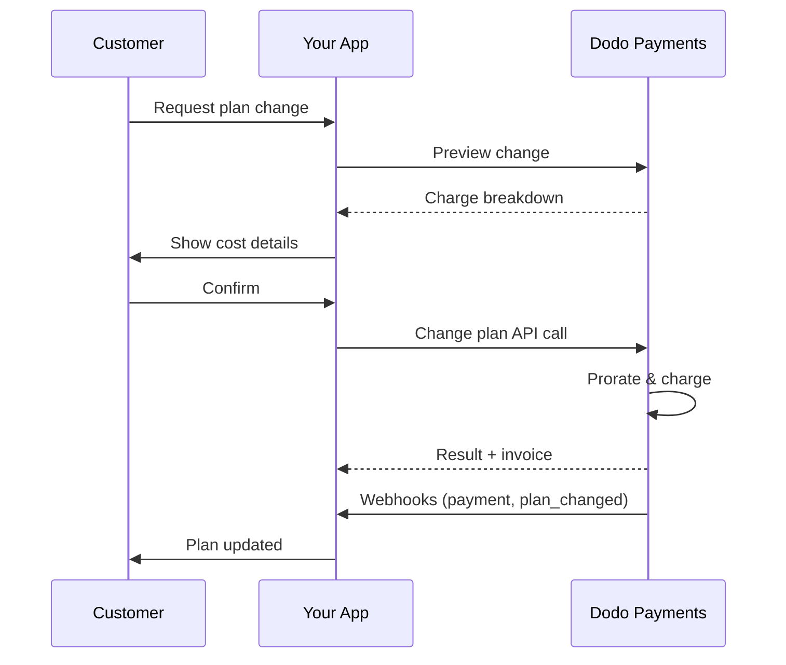
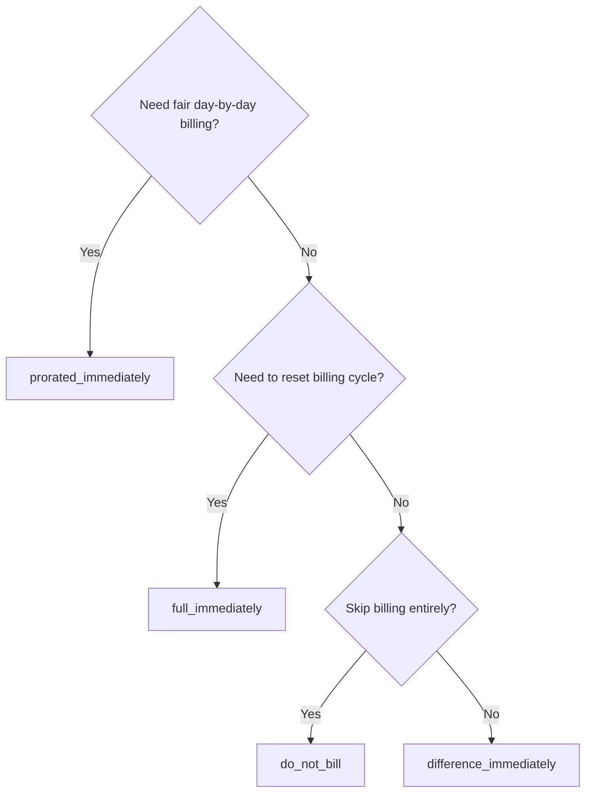
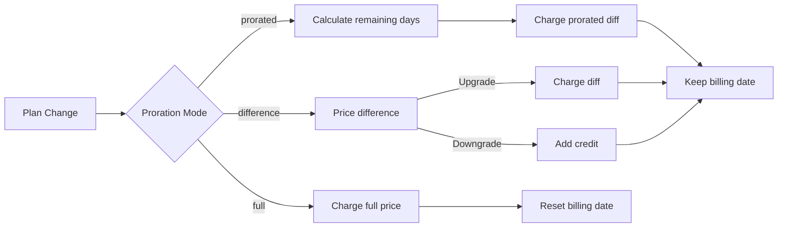

<CardGroup cols={3}>
<Card title="Change Plan API" icon="code" href="/api-reference/subscriptions/change-plan">
  Full API docs for updating subscriptions.
</Card>
<Card title="Plan Change Preview" icon="eye" href="/api-reference/subscriptions/preview-change-plan">
  See charge amounts before changing plans.
</Card>
<Card title="Integration Guide" icon="book" href="/developer-resources/subscription-integration-guide">
  Step-by-step subscription setup.
</Card>
</CardGroup>

## What is a subscription upgrade or downgrade?

Changing plans lets you move a customer between subscription tiers or quantities. Use it to:
- Align pricing with usage or features
- Move from monthly to annual (or vice versa)
- Adjust quantity for seat-based products

<Info>
Plan changes can trigger an immediate charge depending on the proration mode you choose.
</Info>

## When to use plan changes

- Upgrade when a customer needs more features, usage, or seats
- Downgrade when usage decreases
- Migrate users to a new product or price without cancelling their subscription

## Plan Change Flow



## Prerequisites

Before implementing subscription plan changes, ensure you have:

- A Dodo Payments merchant account with active subscription products
- API credentials (API key and webhook secret key) from the dashboard
- An existing active subscription to modify
- Webhook endpoint configured to handle subscription events

<Info>
For detailed setup instructions, see our [Integration Guide](/developer-resources/integration-guide#dashboard-setup).
</Info>

## Step-by-Step Implementation Guide

Follow this comprehensive guide to implement subscription plan changes in your application:

<Steps>
<Step title="Understand Plan Change Requirements">
Before implementing, determine:
- Which subscription products can be changed to which others
- What proration mode fits your business model
- How to handle failed plan changes gracefully
- Which webhook events to track for state management

<Tip>
Test plan changes thoroughly in test mode before implementing in production.
</Tip>
</Step>

<Step title="Choose Your Proration Strategy">
Select the billing approach that aligns with your business needs:

<Tabs>
<Tab title="prorated_immediately">
Best for: SaaS applications wanting to charge fairly for unused time
- Calculates exact prorated amount based on remaining cycle time
- Charges a prorated amount based on unused time remaining in the cycle
- Provides transparent billing to customers
</Tab>

<Tab title="difference_immediately">
Best for: Clear upgrade/downgrade scenarios
- Upgrade: Charge immediate difference (e.g., $30→$80 = charge $50)
- Downgrade: Credit remaining value for future renewals
- Simplifies billing logic and customer communication
</Tab>

<Tab title="full_immediately">
Am besten geeignet für: Wenn Sie den Abrechnungszyklus zurücksetzen möchten
- Berechnet sofort den vollen Betrag des neuen Plans
- Ignoriert die verbleibende Zeit aus dem alten Plan
- Nützlich für Übergänge von jährlich zu monatlich
</Tab>

{/* LOCKED_PATTERN_7fa7f81fc66b83c441dd56aff76d586c */}
Am besten geeignet für: Kostenlose Migrationen, Kulanzwechsel oder die Übernahme von Kostenunterschieden
- Es werden keine Gebühren oder Gutschriften berechnet
- Kunde wechselt sofort zum neuen Plan ohne Abrechnungsanpassung
- Der Abrechnungszyklus bleibt unverändert
</Tab>
</Tabs>
</Step>

<Step title="Implement the Change Plan API">
Verwenden Sie die Change Plan API, um Abonnementdetails zu ändern:

<ParamField path="subscription_id" type="string" required>
Die ID des zu ändernden aktiven Abonnements.
</ParamField>

<ParamField path="product_id" type="string" required>
Die neue Produkt-ID, auf die das Abonnement geändert werden soll.
</ParamField>

<ParamField path="quantity" type="integer" default="1">
Anzahl der Einheiten für den neuen Plan (für sitzbasierte Produkte).
</ParamField>

<ParamField path="proration_billing_mode" type="string" required>
Wie sofortige Abrechnung gehandhabt werden soll: `prorated_immediately`, `full_immediately`, `difference_immediately` oder `do_not_bill`.
</ParamField>

<ParamField path="addons" type="array">
Optionale Addons für den neuen Plan. Wenn leer gelassen, werden alle vorhandenen Addons entfernt.
</ParamField>

<ParamField path="on_payment_failure" type="string">
Steuert das Verhalten bei Zahlungsausfall beim Planwechsel:
- `prevent_change`: Halten Sie das Abonnement im aktuellen Plan, bis die Zahlung erfolgreich ist
- `apply_change` (Standard): Planwechsel sofort anwenden, unabhängig vom Zahlungsergebnis

If not specified, uses the business-level default setting.
</ParamField>

<ParamField path="discount_code" type="string">
Optionaler Rabattcode zur Anwendung auf den neuen Plan. Wenn angegeben, validieren und den Rabatt auf den Planwechsel anwenden. Wenn nicht angegeben und das Abonnement einen bestehenden Rabatt mit `preserve_on_plan_change=true` hat, bleibt der bestehende Rabatt erhalten (wenn anwendbar auf das neue Produkt).
</ParamField>
</Step>

<Step title="Handle Webhook Events">
Richten Sie das Webhook-Handling ein, um die Ergebnisse von Planänderungen zu verfolgen:

- `subscription.active`: Planänderung erfolgreich, Abonnement aktualisiert
- `subscription.plan_changed`: Abonnementplan geändert (Upgrade/Downgrade/Add-on-Update)
- `subscription.on_hold`: Planänderungsgebühr fehlgeschlagen, Abonnement pausiert
- `payment.succeeded`: Sofortige Gebühr für Planänderung erfolgreich
- `payment.failed`: Sofortige Gebühr fehlgeschlagen

<Warning>
Überprüfen Sie immer Webhook-Signaturen und implementieren Sie idempotente Ereignisverarbeitung.
</Warning>
</Step>

<Step title="Update Your Application State">
Basierend auf Webhook-Ereignissen aktualisieren Sie Ihre Anwendung:
- Funktionen basierend auf dem neuen Plan gewähren/entziehen
- Kunden-Dashboard mit neuen Plan-Details aktualisieren
- Bestätigungs-E-Mails über Planänderungen senden
- Abrechnungsänderungen für Prüfzwecke protokollieren
</Step>

<Step title="Test and Monitor">
Testen Sie Ihre Implementierung gründlich:
- Testen Sie alle Berechnungsmodi mit verschiedenen Szenarien
- Überprüfen Sie, ob das Webhook-Handling korrekt funktioniert
- Planänderungserfolgsraten überwachen
- Warnungen für fehlgeschlagene Planänderungen einrichten

<Check>
Ihre Implementierung des Abonnementplanwechsels ist nun bereit für den Produktionseinsatz.
</Check>
</Step>
</Steps>

## Vorschau von Planänderungen

Verwenden Sie die Preview API, um den Kunden genau zu zeigen, was ihnen in Rechnung gestellt wird, bevor Sie sich auf einen Planwechsel festlegen:

<Tabs>
<Tab title="Node.js SDK">

```javascript
const preview = await client.subscriptions.previewChangePlan('sub_123', {
  product_id: 'prod_pro',
  quantity: 1,
  proration_billing_mode: 'prorated_immediately'
});

// Show customer the charge before confirming
console.log('Immediate charge:', preview.immediate_charge.summary);
console.log('New plan details:', preview.new_plan);
```

</Tab>

<Tab title="Python SDK">

```python
preview = client.subscriptions.preview_change_plan(
    subscription_id="sub_123",
    product_id="prod_pro",
    quantity=1,
    proration_billing_mode="prorated_immediately"
)

# Show customer the charge before confirming
print("Immediate charge:", preview.immediate_charge.summary)
print("New plan details:", preview.new_plan)
```

</Tab>
</Tabs>

<Tip>
Verwenden Sie die Preview API, um Bestätigungsdialoge zu erstellen, die den Kunden den genauen Betrag anzeigen, der ihnen in Rechnung gestellt wird, bevor sie einem Planwechsel zustimmen.
</Tip>

## Change Plan API

Verwenden Sie die Change Plan API, um Produkt, Menge und Berechnungsverhalten für ein aktives Abonnement zu ändern.

### Schnellstart-Beispiele

<Tabs>
  <Tab title="Node.js SDK">

    ```javascript
    import DodoPayments from 'dodopayments';

    const client = new DodoPayments({
      bearerToken: process.env.DODO_PAYMENTS_API_KEY,
      environment: 'test_mode', // defaults to 'live_mode'
    });

    async function changePlan() {
      const result = await client.subscriptions.changePlan('sub_123', {
        product_id: 'prod_new',
        quantity: 3,
        proration_billing_mode: 'prorated_immediately',
        on_payment_failure: 'prevent_change', // Optional: control behavior on payment failure
      });
      console.log(result.status, result.invoice_id, result.payment_id);
    }

    changePlan();
    ```

  </Tab>
  <Tab title="Python SDK">

    ```python
    import os
    from dodopayments import DodoPayments

    client = DodoPayments(
        bearer_token=os.environ.get("DODO_PAYMENTS_API_KEY"),
        environment="test_mode",  # defaults to "live_mode"
    )

    result = client.subscriptions.change_plan(
        subscription_id="sub_123",
        product_id="prod_new",
        quantity=3,
        proration_billing_mode="prorated_immediately",
        on_payment_failure="prevent_change",  # Optional: control behavior on payment failure
    )
    print(result.status, result.get("invoice_id"), result.get("payment_id"))
    ```

  </Tab>
  <Tab title="Go SDK">

    ```go
    package main

    import (
      "context"
      "fmt"
      "github.com/dodopayments/dodopayments-go"
      "github.com/dodopayments/dodopayments-go/option"
    )

    func main() {
      client := dodopayments.NewClient(option.WithBearerToken("YOUR_TOKEN"))
      res, err := client.Subscriptions.ChangePlan(context.TODO(), dodopayments.SubscriptionChangePlanParams{
        SubscriptionID: dodopayments.F("sub_123"),
        ProductID:             dodopayments.F("prod_new"),
        Quantity:              dodopayments.F(int64(3)),
        ProrationBillingMode:  dodopayments.F(dodopayments.SubscriptionChangePlanParamsProrationBillingModeProratedImmediately),
        OnPaymentFailure:      dodopayments.F(dodopayments.OnPaymentFailurePreventChange), // Optional
      })
      if err != nil { panic(err) }
      fmt.Println(res.Status, res.InvoiceID, res.PaymentID)
    }
    ```

  </Tab>
  <Tab title="HTTP">

    ```bash
    curl -X POST "$DODO_API_BASE/subscriptions/sub_123/change-plan" \
      -H "Authorization: Bearer $DODO_PAYMENTS_API_KEY" \
      -H "Content-Type: application/json" \
      -d '{
        "product_id": "prod_new",
        "quantity": 3,
        "proration_billing_mode": "prorated_immediately",
        "on_payment_failure": "prevent_change"
      }'
    ```

  </Tab>
</Tabs>

```json Success
{
  "status": "processing",
  "subscription_id": "sub_123",
  "invoice_id": "inv_789",
  "payment_id": "pay_456",
  "proration_billing_mode": "prorated_immediately"
}
```

<Note>
Felder wie <code>invoice_id</code> und <code>payment_id</code> werden nur dann zurückgegeben, wenn während des Planwechsels eine sofortige Gebühr und/oder Rechnung erstellt wird. Verlassen Sie sich immer auf Webhook-Ereignisse (z. B. <code>payment.succeeded</code>, <code>subscription.plan_changed</code>), um Ergebnisse zu bestätigen.
</Note>

<Warning>
Wenn die sofortige Gebühr fehlschlägt, kann das Abonnement zu `subscription.on_hold` wechseln, bis die Zahlung erfolgreich ist.
</Warning>

## Verwaltung von Addons

Beim Ändern von Abonnementplänen können Sie auch Addons ändern:

```javascript
// Add addons to the new plan
await client.subscriptions.changePlan('sub_123', {
  product_id: 'prod_new',
  quantity: 1,
  proration_billing_mode: 'difference_immediately',
  addons: [
    { addon_id: 'addon_123', quantity: 2 }
  ]
});

// Remove all existing addons
await client.subscriptions.changePlan('sub_123', {
  product_id: 'prod_new',
  quantity: 1,
  proration_billing_mode: 'difference_immediately',
  addons: [] // Empty array removes all existing addons
});
```

<Info>
Addons sind in der Berechnungsberechnung enthalten und werden gemäß dem ausgewählten Berechnungsmodus berechnet.
</Info>

## Anwendung von Rabattcodes

Sie können einen Rabattcode anwenden, wenn Sie Abonnementpläne ändern. Dies ist nützlich, um Aktionspreise für Upgrades oder Migrationen anzubieten.

<Tabs>
<Tab title="Node.js SDK">

```javascript
// Apply a discount code during plan change
await client.subscriptions.changePlan('sub_123', {
  product_id: 'prod_pro',
  quantity: 1,
  proration_billing_mode: 'prorated_immediately',
  discount_code: 'UPGRADE20'
});
```

</Tab>
<Tab title="Python SDK">

```python
# Apply a discount code during plan change
client.subscriptions.change_plan(
    subscription_id="sub_123",
    product_id="prod_pro",
    quantity=1,
    proration_billing_mode="prorated_immediately",
    discount_code="UPGRADE20"
)
```

</Tab>
<Tab title="HTTP">

```bash
curl -X POST "$DODO_API_BASE/subscriptions/sub_123/change-plan" \
  -H "Authorization: Bearer $DODO_PAYMENTS_API_KEY" \
  -H "Content-Type: application/json" \
  -d '{
    "product_id": "prod_pro",
    "quantity": 1,
    "proration_billing_mode": "prorated_immediately",
    "discount_code": "UPGRADE20"
  }'
```

</Tab>
</Tabs>

### Rabattverhalten bei Planänderung

| Szenario | Verhalten |
|----------|----------|
| `discount_code` angegeben | Validiert und wendet den Rabatt auf den neuen Plan an. |
| Kein Code angegeben, bestehender Rabatt mit `preserve_on_plan_change=true` | Bestehender Rabatt wird automatisch beibehalten, wenn anwendbar auf das neue Produkt. |
| Kein Code angegeben, kein beibehaltbarer Rabatt | Kein Rabatt auf den neuen Plan angewendet. |

<Tip>
Verwenden Sie die [Vorschau-Planwechsel-API](/api-reference/subscriptions/preview-change-plan) mit einem `discount_code`, um den Kunden genau zu zeigen, wie viel sie sparen, bevor sie den Planwechsel bestätigen.
</Tip>

## Berechnungsmodi

Wählen Sie, wie der Kunde bei Planänderungen abgerechnet werden soll:

#### `prorated_immediately`
- Berechnet die teilweise Differenz im aktuellen Zyklus
- Bei Probezeit wird sofort berechnet und wechselt jetzt zum neuen Plan
- Downgrade: kann eine anteilige Gutschrift erzeugen, die auf zukünftige Erneuerungen angewendet wird

#### `full_immediately`
- Berechnet sofort den vollen Betrag des neuen Plans
- Ignoriert die verbleibende Zeit aus dem alten Plan

<Info>
Gutschriften, die durch Downgrades mit <code>difference_immediately</code> erstellt werden, sind abonnementgebunden und unterscheiden sich von <a href="/features/credit-based-billing">credit-based billing</a> Ansprüchen. Sie werden automatisch auf zukünftige Erneuerungen desselben Abonnements angewendet und können nicht zwischen Abonnements übertragen werden.
</Info>

#### `difference_immediately`
- Upgrade: Berechnet sofort die Preisdifferenz zwischen alten und neuen Plänen
- Downgrade: fügt verbleibenden Wert als interne Gutschrift zum Abonnement hinzu und wendet diese automatisch bei Erneuerungen an

#### `do_not_bill`
- Es werden keine Gebühren oder Gutschriften berechnet
- Kunde wechselt sofort zum neuen Plan ohne Abrechnungsanpassung
- Der Abrechnungszyklus bleibt unverändert
- Am besten geeignet für Kulanzmigrationen, kostenlose Planwechsel oder das Übernehmen von Kostenunterschieden

| Feature | `prorated_immediately` | `difference_immediately` | `full_immediately` | `do_not_bill` |
|---------|----------------------|------------------------|-------------------|--------------|
| **Upgrade-Gebühr** | Anteilige Differenz für verbleibende Tage | Volle Preisdifferenz zwischen Plänen | Voller neuer Planpreis | Keine Gebühr |
| **Downgrade-Gutschrift** | Anteiligige Gutschrift für verbleibende Tage | Volle Preisdifferenz als Gutschrift | Keine Gutschrift | Keine Gutschrift |
| **Abrechnungszyklus** | Unverändert | Unverändert | Setzt sich heute zurück | Unverändert |
| **Verhalten bei Probezeit** | Beendet Probezeit, berechnet sofort | Beendet Probezeit, berechnet sofort | Beendet Probezeit, berechnet vollen Betrag | Beendet Probezeit, keine Gebühr |
| **Am besten geeignet für** | Faire zeitbasierte Abrechnung | Einfache Upgrade/Downgrade-Mathematik | Rücksetzung von Abrechnungszyklen | Kostenlose Migrationen oder Kulanzwechsel |
| **Komplexität** | Mittel (Tagesberechnung) | Niedrig (einfache Subtraktion) | Niedrig (volle Gebühr) | Keine |



### Beispiel-Szenarien

Verwenden Sie diese Standardwerte durchgehend:
- Aktueller Plan: **Basic** zu **30$/Monat**
- Upgrade-Ziel: **Pro** zu **80$/Monat**
- Downgrade-Ziel (von Pro): **Starter** zu **20$/Monat**
- Abrechnungszyklus: **30 Tage**, gestartet am **1. Januar**
- Planänderung erfolgt am **16. Januar** (15 Tage verbleibend, 15 Tage genutzt)

<AccordionGroup>
  <Accordion title="Upgrade: Basic ($30) → Pro ($80) with prorated_immediately">

    ```
    Step 1: Calculate unused credit from current plan
      Unused days = 15 out of 30 days
      Credit = $30 × (15/30) = $15.00

    Step 2: Calculate prorated cost of new plan
      Remaining days = 15 out of 30 days
      New plan cost = $80 × (15/30) = $40.00

    Step 3: Calculate immediate charge
      Charge = New plan cost − Credit
      Charge = $40.00 − $15.00 = $25.00

    → Customer pays $25.00 now
    → Next renewal (Feb 1): $80.00/month
    ```

    ```javascript
    await client.subscriptions.changePlan('sub_123', {
      product_id: 'prod_pro',
      quantity: 1,
      proration_billing_mode: 'prorated_immediately'
    })
    ```

  </Accordion>

  <Accordion title="Downgrade: Pro ($80) → Starter ($20) with prorated_immediately">

    ```
    Step 1: Calculate unused credit from current plan
      Unused days = 15 out of 30 days
      Credit = $80 × (15/30) = $40.00

    Step 2: Calculate prorated cost of new plan
      Remaining days = 15 out of 30 days
      New plan cost = $20 × (15/30) = $10.00

    Step 3: Calculate credit balance
      Credit = $40.00 − $10.00 = $30.00

    → No charge — $30.00 credit added to subscription
    → Credit auto-applies to future renewals
    → Next renewal (Feb 1): $20.00 − $30.00 credit = $0.00
    → Following renewal (Mar 1): $20.00 − $10.00 remaining credit = $10.00
    ```

    ```javascript
    await client.subscriptions.changePlan('sub_123', {
      product_id: 'prod_starter',
      quantity: 1,
      proration_billing_mode: 'prorated_immediately'
    })
    ```

  </Accordion>

  <Accordion title="Upgrade: Basic ($30) → Pro ($80) with difference_immediately">

    ```
    Immediate charge = New plan price − Old plan price
                     = $80 − $30
                     = $50.00

    → Customer pays $50.00 now (regardless of cycle position)
    → Next renewal (Feb 1): $80.00/month
    ```

    ```javascript
    await client.subscriptions.changePlan('sub_123', {
      product_id: 'prod_pro',
      quantity: 1,
      proration_billing_mode: 'difference_immediately'
    })
    ```

  </Accordion>

  <Accordion title="Downgrade: Pro ($80) → Starter ($20) with difference_immediately">

    ```
    Credit = Old plan price − New plan price
           = $80 − $20
           = $60.00

    → No charge — $60.00 credit added to subscription
    → Credit auto-applies to future renewals
    → Next renewal: $20.00 − $20.00 (from credit) = $0.00
    → Following renewal: $20.00 − $20.00 (from credit) = $0.00
    → Third renewal: $20.00 − $20.00 (from remaining credit) = $0.00
    ```

    ```javascript
    await client.subscriptions.changePlan('sub_123', {
      product_id: 'prod_starter',
      quantity: 1,
      proration_billing_mode: 'difference_immediately'
    })
    ```

  </Accordion>

  <Accordion title="Upgrade: Basic ($30) → Pro ($80) with full_immediately">

    ```
    Immediate charge = Full new plan price = $80.00

    → Customer pays $80.00 now
    → No credit for unused time on old plan
    → Billing cycle resets to today (January 16)
    → Next renewal: February 16 at $80.00/month
    ```

    ```javascript
    await client.subscriptions.changePlan('sub_123', {
      product_id: 'prod_pro',
      quantity: 1,
      proration_billing_mode: 'full_immediately'
    })
    ```

  </Accordion>

  <Accordion title="Mid-cycle upgrade with add-ons using prorated_immediately">

    ```
    Current: Basic plan ($30/month), no add-ons
    New: Pro plan ($80/month) + Extra Seats add-on ($10/seat × 3 seats = $30/month)
    Change on day 16 of 30 (15 days remaining)

    Step 1: Credit from current plan
      Credit = $30 × (15/30) = $15.00

    Step 2: Prorated cost of new plan + add-ons
      New plan = $80 × (15/30) = $40.00
      Add-ons = $30 × (15/30) = $15.00
      Total new = $55.00

    Step 3: Immediate charge
      Charge = $55.00 − $15.00 = $40.00

    → Customer pays $40.00 now
    → Next renewal: $80.00 + $30.00 = $110.00/month
    ```

    ```javascript
    await client.subscriptions.changePlan('sub_123', {
      product_id: 'prod_pro',
      quantity: 1,
      proration_billing_mode: 'prorated_immediately',
      addons: [
        { addon_id: 'addon_seats', quantity: 3 }
      ]
    })
    ```

  </Accordion>
</AccordionGroup>

### Wie jeder Modus die Abrechnung verarbeitet



<Tip>
Wählen Sie `prorated_immediately` für faire Zeitabrechnung; wählen Sie `full_immediately`, um die Abrechnung neu zu starten; verwenden Sie `difference_immediately` für einfache Upgrades und automatische Gutschrift bei Downgrades; oder verwenden Sie `do_not_bill`, um Pläne ohne Abrechnungsanpassung zu wechseln.
</Tip>

## Umgang mit Zahlungsfehlern

Steuern Sie, was passiert, wenn eine Planwechselzahlung mit dem Parameter `on_payment_failure` fehlschlägt.

### Zahlungsfehler-Modi

<Tabs>
<Tab title="prevent_change (Recommended for critical upgrades)">
**Verhalten**: Halten Sie das Abonnement auf seinem aktuellen Plan, bis die Zahlung erfolgreich ist.

- Der Planwechsel wird als "ausstehend" markiert
- Der Kunde behält den Zugang zu seinem aktuellen Plan
- Das Abonnement wechselt erst nach erfolgreicher Zahlung in den `active`-Zustand
- Nützlich, wenn Sie die Zahlung sicherstellen möchten, bevor Sie aufgerüstete Funktionen gewähren

```javascript
await client.subscriptions.changePlan('sub_123', {
  product_id: 'prod_pro',
  quantity: 1,
  proration_billing_mode: 'prorated_immediately',
  on_payment_failure: 'prevent_change'
});
```

</Tab>

<Tab title="apply_change (Default)">
**Verhalten**: Wenden Sie den Planwechsel sofort an, unabhängig vom Zahlungsergebnis.

- Der Planwechsel wird auch dann angewendet, wenn die Zahlung fehlschlägt
- Der Kunde erhält sofort Zugang zum neuen Plan
- Das Abonnement kann in den `on_hold`-Zustand wechseln, wenn die Zahlung fehlschlägt
- Gut für unkritische Upgrades oder wenn Sie dem Kunden vertrauen

```javascript
await client.subscriptions.changePlan('sub_123', {
  product_id: 'prod_pro',
  quantity: 1,
  proration_billing_mode: 'prorated_immediately',
  on_payment_failure: 'apply_change' // This is the default
});
```

</Tab>
</Tabs>

<Info>
Wenn nicht angegeben, verwendet der Parameter `on_payment_failure` Ihre auf Geschäfts-Ebene konfigurierte Standardeinstellung im Dashboard.
</Info>

### Wann Sie jeden Modus verwenden sollten

| Szenario | Empfohlener Modus | Grund |
|----------|------------------|--------|
| Upgrade auf Premium-Funktionen | `prevent_change` | Zahlung sicherstellen, bevor Zugriff gewährt wird |
| Mengensteigerung (mehr Sitze) | `prevent_change` | Nutzung ohne Zahlung verhindern |
| Downgraden von Plänen | `apply_change` | Kunde reduziert die Ausgaben |
| Vertrauenswürdige Unternehmenskunden | `apply_change` | Geringeres Risiko der Nichtzahlung |
| Umwandlung von Probezeit in bezahltes Abo | `prevent_change` | Kritischer Zahlungszeitpunkt |

## Umgang mit Webhooks

Verfolgen Sie den Abonnementstatus über Webhooks, um Planänderungen und Zahlungen zu bestätigen.

### Zu behandelnde Ereignistypen
- `subscription.active`: Abonnement aktiviert
- `subscription.plan_changed`: Abonnementplan geändert (Upgrade/Downgrade/Add-on-Änderungen)
- `subscription.on_hold`: Gebühr fehlgeschlagen, Abonnement pausiert
- `subscription.renewed`: Erneuerung erfolgreich
- `payment.succeeded`: Zahlung für Planwechsel oder Erneuerung erfolgreich
- `payment.failed`: Zahlung fehlgeschlagen

<Info>
Wir empfehlen, Geschäftslogik von Abonnementereignissen abzuleiten und Zahlungsevents zur Bestätigung und Abstimmung zu verwenden.
</Info>

### Signaturen verifizieren und Absichten handhaben

<Tabs>
  <Tab title="Next.js Route Handler">

    ```javascript
    import { NextRequest, NextResponse } from 'next/server';
    
    export async function POST(req) {
      const webhookId = req.headers.get('webhook-id');
      const webhookSignature = req.headers.get('webhook-signature');
      const webhookTimestamp = req.headers.get('webhook-timestamp');
      const secret = process.env.DODO_WEBHOOK_SECRET;
    
      const payload = await req.text();
      // verifySignature is a placeholder – in production, use a Standard Webhooks library
      const { valid, event } = await verifySignature(
        payload,
        { id: webhookId, signature: webhookSignature, timestamp: webhookTimestamp },
        secret
      );
      if (!valid) return NextResponse.json({ error: 'Invalid signature' }, { status: 400 });
    
      switch (event.type) {
        case 'subscription.active':
          // mark subscription active in your DB
          break;
        case 'subscription.plan_changed':
          // refresh entitlements and reflect the new plan in your UI
          break;
        case 'subscription.on_hold':
          // notify user to update payment method
          break;
        case 'subscription.renewed':
          // extend access window
          break;
        case 'payment.succeeded':
          // reconcile payment for plan change
          break;
        case 'payment.failed':
          // log and alert
          break;
        default:
          // ignore unknown events
          break;
      }
    
      return NextResponse.json({ received: true });
    }
    ```

  </Tab>
  <Tab title="Express.js">

    ```javascript
    import express from 'express';
    
    const app = express();
    app.post('/webhooks/dodo', express.raw({ type: 'application/json' }), async (req, res) => {
      const webhookId = req.header('webhook-id');
      const webhookSignature = req.header('webhook-signature');
      const webhookTimestamp = req.header('webhook-timestamp');
      const secret = process.env.DODO_WEBHOOK_SECRET;
      const payload = req.body.toString('utf8');
    
      const { valid, event } = await verifySignature(
        payload,
        { id: webhookId, signature: webhookSignature, timestamp: webhookTimestamp },
        secret
      );
      if (!valid) return res.status(400).send('Invalid signature');
    
      // handle events like above
      res.json({ received: true });
    });
    
    app.listen(3000);
    ```

  </Tab>
</Tabs>

<Note>
Für detaillierte Payload-Schemata, siehe die <a href="/developer-resources/webhooks/intents/subscription">Abonnement-Webhooks-Payloads</a> und <a href="/developer-resources/webhooks/intents/payment">Zahlungs-Webhooks-Payloads</a>.
</Note>

## Best Practices

Befolgen Sie diese Empfehlungen für zuverlässige Abonnementplanänderungen:

### Planänderungsstrategie
- **Gründlich testen**: Testen Sie Planänderungen immer im Testmodus, bevor Sie in die Produktion gehen
- **Berechnung sorgfältig auswählen**: Wählen Sie den Berechnungsmodus, der zu Ihrem Geschäftsmodell passt
- **Fehler behutsam behandeln**: Implementieren Sie ordnungsgemäßes Fehlermanagement und Wiederholungslogik
- **Erfolgsraten überwachen**: Verfolgen Sie Erfolgs-/Fehlerraten von Planänderungen und untersuchen Sie Probleme

### Webhook-Implementierung
- **Signaturen überprüfen**: Validieren Sie immer Webhook-Signaturen, um die Authentizität sicherzustellen
- **Idempotenz implementieren**: Behandeln Sie doppelte Webhook-Ereignisse behutsam
- **Asynchron verarbeiten**: Blockieren Sie nicht Webhook-Antworten mit umfangreichen Operationen
- **Alles protokollieren**: Führen Sie detaillierte Protokolle zur Fehlerbehebung und zu Prüfzwecken

### Benutzererfahrung
- **Klar kommunizieren**: Informieren Sie Kunden über Abrechnungsänderungen und Zeitpläne
- **Bestätigungen bereitstellen**: Senden Sie E-Mail-Bestätigungen für erfolgreiche Planänderungen
- **Randfälle behandeln**: Berücksichtigen Sie Probezeiten, Berechnungen und fehlgeschlagene Zahlungen
- **UI sofort aktualisieren**: Planänderungen in Ihrer Anwendungsoberfläche widerspiegeln

## Häufige Probleme und Lösungen

Lösen Sie typische Probleme, die bei Abonnementplanänderungen auftreten:

<AccordionGroup>
<Accordion title="Charge created but subscription not updated">
**Symptome**: API-Aufruf erfolgreich, aber Abonnement bleibt auf altem Plan

**Häufige Ursachen**:
- Webhook-Verarbeitung fehlgeschlagen oder verzögert
- Anwendungszustand nicht aktualisiert, nachdem Webhooks empfangen wurden
- Probleme bei der Datenbanktransaktion während der Zustandsaktualisierung

**Lösungen**:
- Robuste Webhook-Verarbeitung mit Wiederholungslogik implementieren
- Idempotente Operationen für Zustandsaktualisierungen verwenden
- Monitoring einrichten, um verpasste Webhook-Ereignisse zu erkennen und zu alarmieren
- Überprüfen, ob der Webhook-Endpunkt zugänglich ist und korrekt reagiert
</Accordion>

<Accordion title="Credits not applied after downgrade">
**Symptome**: Kunde downgrades, sieht aber keinen Guthabenstand

**Häufige Ursachen**:
- Erwartungen des Berechnungsmodus: Downgrades gutschreiben die volle Preisdifferenz des Plans mit `difference_immediately`, während `prorated_immediately` einen anteiligen Kredit basierend auf verbleibender Zeit im Zyklus erstellt
- Gutschriften sind abonnementspezifisch und nicht zwischen Abonnements übertragbar
- Guthabenstand im Kunden-Dashboard nicht sichtbar

**Lösungen**:
- Verwenden Sie `difference_immediately` für Downgrades, wenn Sie automatische Gutschriften wünschen
- Erklären Sie den Kunden, dass Gutschriften auf zukünftige Erneuerungen desselben Abonnements angewendet werden
- Kundenportal implementieren, um Guthabenstände anzuzeigen
- Nächste Rechnungsvorschau überprüfen, um angewendete Gutschriften zu sehen
</Accordion>

<Accordion title="Webhook signature verification fails">
**Symptome**: Webhook-Ereignisse aufgrund ungültiger Signatur abgelehnt

**Häufige Ursachen**:
- Falscher Webhook-Schlüssel
- Rohdatenanforderungskörper wurde vor der Signaturverifizierung geändert
- Falscher Signaturverifizierungsalgorithmus

**Lösungen**:
- Überprüfen, ob Sie das korrekte `DODO_WEBHOOK_SECRET` aus dem Dashboard verwenden
- Rohdatenanforderungskörper vor jeder JSON-Parsing-Middleware lesen
- Bibliothek zur Standard-Webhook-Verifizierung für Ihre Plattform verwenden
- Signaturverifizierung von Webhooks in der Entwicklungsumgebung testen
</Accordion>

<Accordion title="Plan change fails with 422 error">
**Symptome**: API gibt 422 Unprocessable Entity-Fehler zurück

**Häufige Ursachen**:
- Ungültige Abonnement-ID oder Produkt-ID
- Abonnement nicht im aktiven Zustand
- Fehlende erforderliche Parameter
- Produkt nicht für Planänderungen verfügbar

**Lösungen**:
- Überprüfen, ob Abonnement existiert und aktiv ist
- Überprüfen, ob die Produkt-ID gültig und verfügbar ist
- Sicherstellen, dass alle erforderlichen Parameter angegeben sind
- API-Dokumentation für Parameteranforderungen überprüfen
</Accordion>

<Accordion title="Immediate charge fails during plan change">
**Symptome**: Planänderung initiiert, aber sofortige Gebühr fehlgeschlagen

**Häufige Ursachen**:
- Unzureichende Mittel auf der Zahlungsmethode des Kunden
- Zahlungsmethode abgelaufen oder ungültig
- Bank hat Transaktion abgelehnt
- Betrugserkennung blockierte die Gebühr

**Lösungen**:
- Entsprechende Webhook-Ereignisse für `payment.failed` behandeln
- Kunde benachrichtigen, Zahlungsweise zu aktualisieren
- Wiederholungslogik für temporäre Fehler implementieren
- Erwägen, Planänderungen mit fehlgeschlagenen sofortigen Gebühren zuzulassen
</Accordion>

<Accordion title="Subscription on hold after plan change">
**Symptome**: Planänderungsguthaben schlägt fehl und das Abonnement wechselt in den `on_hold`-Zustand

**Was passiert**:
Wenn eine Planänderungsguthaben fehlgeschlagen ist, wird das Abonnement automatisch in den `on_hold`-Zustand versetzt. Das Abonnement wird nicht automatisch verlängert, bis die Zahlungsmethode aktualisiert ist.

**Lösung**: Aktualisieren Sie die Zahlungsmethode, um das Abonnement zu reaktivieren

Um ein Abonnement aus dem Zustand `on_hold` nach einer fehlgeschlagenen Planänderung zu reaktivieren:

1. **Die Zahlungsmethode aktualisieren** mittels der Update Payment Method API
2. **Automatische Gebühreneinrichtung**: Die API erstellt automatisch eine Gebühr für verbleibende Forderungen
3. **Rechnungsgenerierung**: Eine Rechnung wird für die Gebühr erstellt
4. **Zahlungsverarbeitung**: Die Zahlung wird mit der neuen Zahlungsmethode verarbeitet
5. **Reaktivierung**: Nach erfolgreicher Zahlung wird das Abonnement auf den Zustand `active` reaktiviert

<CodeGroup>

```javascript Node.js
// Reactivate subscription from on_hold after failed plan change
async function reactivateAfterFailedPlanChange(subscriptionId) {
  // Update payment method - automatically creates charge for remaining dues
  const response = await client.subscriptions.updatePaymentMethod(subscriptionId, {
    type: 'new',
    return_url: 'https://example.com/return'
  });
  
  if (response.payment_id) {
    console.log('Charge created for remaining dues:', response.payment_id);
    console.log('Payment link:', response.payment_link);
    
    // Redirect customer to payment_link to complete payment
    // Monitor webhooks for:
    // 1. payment.succeeded - charge succeeded
    // 2. subscription.active - subscription reactivated
  }
  
  return response;
}

// Or use existing payment method if available
async function reactivateWithExistingPaymentMethod(subscriptionId, paymentMethodId) {
  const response = await client.subscriptions.updatePaymentMethod(subscriptionId, {
    type: 'existing',
    payment_method_id: paymentMethodId
  });
  
  // Monitor webhooks for payment.succeeded and subscription.active
  return response;
}
```

```python Python
# Reactivate subscription from on_hold after failed plan change
def reactivate_after_failed_plan_change(subscription_id):
    # Update payment method - automatically creates charge for remaining dues
    response = client.subscriptions.update_payment_method(
        subscription_id=subscription_id,
        type="new",
        return_url="https://example.com/return"
    )
    
    if response.payment_id:
        print("Charge created for remaining dues:", response.payment_id)
        print("Payment link:", response.payment_link)
        
        # Redirect customer to payment_link to complete payment
        # Monitor webhooks for:
        # 1. payment.succeeded - charge succeeded
        # 2. subscription.active - subscription reactivated
    
    return response

# Or use existing payment method if available
def reactivate_with_existing_payment_method(subscription_id, payment_method_id):
    response = client.subscriptions.update_payment_method(
        subscription_id=subscription_id,
        type="existing",
        payment_method_id=payment_method_id
    )
    
    # Monitor webhooks for payment.succeeded and subscription.active
    return response
```

</CodeGroup>

**Zu überwachende Webhook-Ereignisse**:
- `subscription.on_hold`: Abonnement pausiert (empfangen, wenn die Planänderungsgebühr fehlgeschlagen ist)
- `payment.succeeded`: Zahlung für verbleibende Forderungen erfolgreich (nach Aktualisierung der Zahlungsmethode)
- `subscription.active`: Abonnement nach erfolgreicher Zahlung reaktiviert

**Best Practices**:
- Kunden unverzüglich benachrichtigen, wenn eine Planänderungsgebühr fehlgeschlagen ist
- Klare Anweisungen bereitstellen, wie sie ihre Zahlungsmethode aktualisieren können
- Webhook-Ereignisse überwachen, um den Reaktivierungsstatus zu verfolgen
- Erwägen, automatische Wiederholungslogik für temporäre Zahlungsfehler zu implementieren

<Card title="Update Payment Method API Reference" icon="code" href="/api-reference/subscriptions/update-payment-method">
Sehen Sie sich die vollständige API-Dokumentation zum Aktualisieren von Zahlungsmethoden und Reaktivieren von Abonnements an.
</Card>
</Accordion>
</AccordionGroup>

## Testen Ihrer Implementierung

Befolgen Sie diese Schritte, um Ihre Implementierung der Abonnementplanänderung gründlich zu testen:

<Steps>
<Step title="Set up test environment">
- Test-API-Schlüssel und Testprodukte verwenden
- Testabonnements mit verschiedenen Plantypen erstellen
- Test-Webhook-Endpunkt konfigurieren
- Monitoring und Logging einrichten
</Step>

<Step title="Test different proration modes">
- Testen Sie `prorated_immediately` mit verschiedenen Positionen im Abrechnungszyklus
- Testen Sie `difference_immediately` für Upgrades und Downgrades
- Testen Sie `full_immediately`, um Abrechnungszyklen zurückzusetzen
- Testen Sie `do_not_bill` für Planwechsel ohne Gebühr/Gutschrift
- Überprüfen Sie, ob die Guthabenberechnungen korrekt sind
</Step>

<Step title="Test webhook handling">
- Bestätigen Sie, dass alle relevanten Webhook-Ereignisse empfangen werden
- Webhook-Signaturüberprüfung testen
- Doppelte Webhook-Ereignisse behutsam behandeln
- Szenarien mit Webhook-Verarbeitungsfehlern testen
</Step>

<Step title="Test error scenarios">
- Testen Sie mit ungültigen Abonnement-IDs
- Testen Sie mit abgelaufenen Zahlungsmethoden
- Netzwerkfehler und Zeitüberschreitungen testen
- Testen Sie mit unzureichenden Mitteln
</Step>

<Step title="Monitor in production">
- Warnungen für fehlgeschlagene Planänderungen einrichten
- Webhook-Verarbeitungszeiten überwachen
- Erfolgsraten von Planänderungen verfolgen
- Kundendiensttickets für Planänderungsprobleme überprüfen
</Step>
</Steps>

## Fehlerbehebung

Behandeln Sie häufige API-Fehler in Ihrer Implementierung behutsam:

### HTTP-Statuscodes

<AccordionGroup>
<Accordion title="200 OK">
Planänderungsanforderung erfolgreich verarbeitet. Das Abonnement wird aktualisiert und die Zahlungsabwicklung hat begonnen.
</Accordion>

<Accordion title="400 Bad Request">
Ungültige Anforderungsparameter. Überprüfen Sie, ob alle erforderlichen Felder bereitgestellt und ordnungsgemäß formatiert sind.
</Accordion>

<Accordion title="401 Unauthorized">
Ungültiger oder fehlender API-Schlüssel. Überprüfen Sie, ob Ihr `DODO_PAYMENTS_API_KEY` korrekt ist und die richtigen Berechtigungen hat.
</Accordion>

<Accordion title="404 Not Found">
Abonnement-ID nicht gefunden oder gehört nicht zu Ihrem Konto.
</Accordion>

<Accordion title="422 Unprocessable Entity">
Das Abonnement kann nicht geändert werden (z.B. bereits storniert, Produkt nicht verfügbar, usw.).
</Accordion>

<Accordion title="500 Internal Server Error">
Serverfehler aufgetreten. Versuchen Sie die Anfrage nach einer kurzen Verzögerung erneut.
</Accordion>
</AccordionGroup>

### Fehlerantwortformat

```json
{
  "error": {
    "code": "subscription_not_found",
    "message": "The subscription with ID 'sub_123' was not found",
    "details": {
      "subscription_id": "sub_123"
    }
  }
}
```

## Nächste Schritte

- Überprüfen Sie die <a href="/api-reference/subscriptions/change-plan">Change Plan API</a>
- Erkunden Sie <a href="/features/credit-based-billing">credit-based billing</a>
- Implementieren Sie Warnungen für `subscription.on_hold`
- Sehen Sie sich unseren <a href="/developer-resources/webhooks">Webhook-Integrationsleitfaden</a> an
