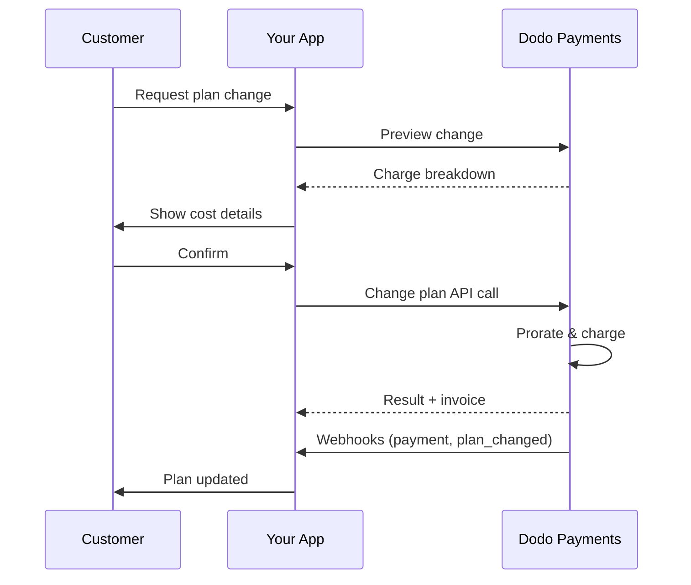

<CardGroup cols={3}>
<Card title="Change Plan API" icon="code" href="/api-reference/subscriptions/change-plan">
  Full API docs for updating subscriptions.
</Card>
<Card title="Plan Change Preview" icon="eye" href="/api-reference/subscriptions/preview-change-plan">
  See charge amounts before changing plans.
</Card>
<Card title="Integration Guide" icon="book" href="/developer-resources/subscription-integration-guide">
  Step-by-step subscription setup.
</Card>
</CardGroup>

## What is a subscription upgrade or downgrade?

Changing plans lets you move a customer between subscription tiers or quantities. Use it to:
- Align pricing with usage or features
- Move from monthly to annual (or vice versa)
- Adjust quantity for seat-based products

<Info>
Plan changes can trigger an immediate charge depending on the proration mode you choose.
</Info>

## When to use plan changes

- Upgrade when a customer needs more features, usage, or seats
- Downgrade when usage decreases
- Migrate users to a new product or price without cancelling their subscription

## Plan Change Flow



## Prerequisites

Before implementing subscription plan changes, ensure you have:

- A Dodo Payments merchant account with active subscription products
- API credentials (API key and webhook secret key) from the dashboard
- An existing active subscription to modify
- Webhook endpoint configured to handle subscription events

<Info>
For detailed setup instructions, see our [Integration Guide](/developer-resources/integration-guide#dashboard-setup).
</Info>

## Step-by-Step Implementation Guide

Follow this comprehensive guide to implement subscription plan changes in your application:

<Steps>
<Step title="Understand Plan Change Requirements">
Before implementing, determine:
- Which subscription products can be changed to which others
- What proration mode fits your business model
- How to handle failed plan changes gracefully
- Which webhook events to track for state management

<Tip>
Test plan changes thoroughly in test mode before implementing in production.
</Tip>
</Step>

<Step title="Choose Your Proration Strategy">
Select the billing approach that aligns with your business needs:

<Tabs>
<Tab title="prorated_immediately">
Best for: SaaS applications wanting to charge fairly for unused time
- Calculates exact prorated amount based on remaining cycle time
- Charges a prorated amount based on unused time remaining in the cycle
- Provides transparent billing to customers
</Tab>

<Tab title="difference_immediately">
Best for: Clear upgrade/downgrade scenarios
- Upgrade: Charge immediate difference (e.g., $30→$80 = charge $50)
- Downgrade: Credit remaining value for future renewals
- Simplifies billing logic and customer communication
</Tab>

<Tab title="full_immediately">
Best for: When you want to reset the billing cycle
- Charges full amount of new plan immediately
- Ignores remaining time from old plan
- Useful for annual to monthly transitions
</Tab>

<Tab title="do_not_bill">
Best for: Free migrations, courtesy switches, or absorbing cost differences
- No charges or credits calculated
- Customer moves to the new plan immediately without any billing adjustment
- Billing cycle remains unchanged
</Tab>
</Tabs>
</Step>

<Step title="Implement the Change Plan API">
Use the Change Plan API to modify subscription details:

<ParamField path="subscription_id" type="string" required>
The ID of the active subscription to modify.
</ParamField>

<ParamField path="product_id" type="string" required>
The new product ID to change the subscription to.
</ParamField>

<ParamField path="quantity" type="integer" default="1">
Number of units for the new plan (for seat-based products).
</ParamField>

<ParamField path="proration_billing_mode" type="string" required>
How to handle immediate billing: `prorated_immediately`, `full_immediately`, `difference_immediately`, or `do_not_bill`.
</ParamField>

<ParamField path="addons" type="array">
Optional addons for the new plan. Leaving this empty removes any existing addons.
</ParamField>

<ParamField path="on_payment_failure" type="string">
Controls behavior when the plan change payment fails:
- `prevent_change`: Keep subscription on current plan until payment succeeds
- `apply_change` (default): Apply plan change immediately regardless of payment outcome

If not specified, uses the business-level default setting.
</ParamField>

Optional **stapelbare** Rabattcodes, die auf den neuen Plan angewendet werden (max. 20, in Array-Reihenfolge angewendet). Das Verhalten hängt davon ab, was Sie übergeben:

- **Nicht angegeben / `null`** — bestehende Rabatte mit `preserve_on_plan_change=true` bleiben erhalten, wenn sie auf das neue Produkt anwendbar sind.
- **`[]` (leeres Array)** — entfernt alle bestehenden Rabatte aus dem Abonnement.
- **`["CODE_A", "CODE_B", ...]`** — ersetzt alle bestehenden Rabatte durch diesen gestapelten Satz.

**Veraltet** — bevorzugen Sie `discount_codes` für neue Integrationen. Dieses Feld funktioniert weiterhin zur Rückwärtskompatibilität, kann jedoch nicht mit `discount_codes` in derselben Anfrage kombiniert werden.

Wann die Planänderung angewendet wird:
- `immediately` (standard): Die Planänderung sofort anwenden
- `next_billing_date`: Die Änderung wird für das nächste Abrechnungsdatum eingeplant. Der Kunde behält seinen aktuellen Plan bis zum Ende der Abrechnungsperiode.

Verwenden Sie `next_billing_date` für Downgrades, damit Kunden ihre aktuellen Planvorteile bis zum Ende der Abrechnungsperiode behalten.

Richten Sie die Webhook-Verarbeitung ein, um die Ergebnisse der Planänderung zu verfolgen:

- `subscription.active`: Planänderung erfolgreich, Abonnement aktualisiert
- `subscription.plan_changed`: Abonnementplan geändert (Upgrade/Downgrade/Add-on-Aktualisierung)
- `subscription.on_hold`: Planänderungsgebühr fehlgeschlagen, Abonnement pausiert
- `payment.succeeded`: Sofortige Gebühr für Planänderung erfolgreich
- `payment.failed`: Sofortige Gebühr fehlgeschlagen

Webhook-Signaturen immer verifizieren und ein idempotentes Event-Processing implementieren.

Basierend auf Webhook-Ereignissen aktualisieren Sie Ihre Anwendung:
- Gewähren/entziehen Sie Funktionen basierend auf dem neuen Plan
- Aktualisieren Sie das Kunden-Dashboard mit neuen Plandetails
- Senden Sie Bestätigungs-E-Mails über Planänderungen
- Protokollieren Sie Abrechnungsänderungen zu Prüfzwecken

Testen Sie Ihre Implementierung gründlich:
- Testen Sie alle Prorationsmodi mit verschiedenen Szenarien
- Überprüfen Sie, ob die Webhook-Verarbeitung korrekt funktioniert
- Überwachen Sie die Erfolgsraten von Planänderungen
- Richten Sie Alarme für fehlgeschlagene Planänderungen ein

Ihre Implementierung zur Änderung von Abonnementplänen ist jetzt einsatzbereit.

## Planänderungen Vorschau

Verwenden Sie die Vorschau-API, um Kunden genau zu zeigen, was ihnen berechnet wird, bevor sie eine Planänderung vornehmen:

Verwenden Sie die Vorschau-API, um Bestätigungsdialoge zu erstellen, die den Kunden den genauen Betrag anzeigen, der ihnen berechnet wird, bevor sie eine Planänderung bestätigen.

```javascript
const preview = await client.subscriptions.previewChangePlan('sub_123', {
  product_id: 'prod_pro',
  quantity: 1,
  proration_billing_mode: 'prorated_immediately'
});

// Show customer the charge before confirming
console.log('Immediate charge:', preview.immediate_charge.summary);
console.log('New plan details:', preview.new_plan);
```

Verwenden Sie die Change Plan API, um Produkt, Menge und Prorationsverhalten für ein aktives Abonnement zu ändern.

### Schnellstartbeispiele

```python
preview = client.subscriptions.preview_change_plan(
    subscription_id="sub_123",
    product_id="prod_pro",
    quantity=1,
    proration_billing_mode="prorated_immediately"
)

# Show customer the charge before confirming
print("Immediate charge:", preview.immediate_charge.summary)
print("New plan details:", preview.new_plan)
```

    ```javascript
    import DodoPayments from 'dodopayments';

    const client = new DodoPayments({
      bearerToken: process.env.DODO_PAYMENTS_API_KEY,
      environment: 'test_mode', // defaults to 'live_mode'
    });

    async function changePlan() {
      const result = await client.subscriptions.changePlan('sub_123', {
        product_id: 'prod_new',
        quantity: 3,
        proration_billing_mode: 'prorated_immediately',
        on_payment_failure: 'prevent_change', // Optional: control behavior on payment failure
      });
      console.log(result.status, result.invoice_id, result.payment_id);
    }

    changePlan();
    ```

Felder wie <code>invoice_id</code> und <code>payment_id</code> werden nur zurückgegeben, wenn im Rahmen der Planänderung eine sofortige Zahlung und/oder Rechnung erstellt wird. Verlassen Sie sich immer auf Webhook-Ereignisse (z.B. <code>payment.succeeded</code>, <code>subscription.plan_changed</code>), um Ergebnisse zu bestätigen.

Sind die sofortigen Abbuchungen fehlgeschlagen, kann das Abonnement zu `subscription.on_hold` wechseln, bis die Zahlung erfolgreich ist.

## Add-ons verwalten

Beim Ändern von Abonnementplänen können Sie auch Add-ons ändern:

```javascript
// Add addons to the new plan
await client.subscriptions.changePlan('sub_123', {
  product_id: 'prod_new',
  quantity: 1,
  proration_billing_mode: 'difference_immediately',
  addons: [
    { addon_id: 'addon_123', quantity: 2 }
  ]
});

// Remove all existing addons
await client.subscriptions.changePlan('sub_123', {
  product_id: 'prod_new',
  quantity: 1,
  proration_billing_mode: 'difference_immediately',
  addons: [] // Empty array removes all existing addons
});
```

Add-ons sind in die Prorationsberechnung einbezogen und werden gemäß dem ausgewählten Prorationsmodus abgerechnet.

## Rabattcodes anwenden

Beim Ändern von Abonnementplänen können ein oder mehrere **stapelbare Rabattcodes** angewendet werden (maximal 20, in Array-Reihenfolge angewendet). Dies ist nützlich, um bei Upgrades oder Migrationen Aktionspreise anzubieten.

### Rabattverhalten bei Planänderungen

| `discount_codes` Wert | Verhalten |
|------------------------|----------|
| Nicht angegeben / `null` | Bestehende Rabatte mit `preserve_on_plan_change=true` werden automatisch beibehalten, wenn sie auf das neue Produkt anwendbar sind. |
| `[]` (leeres Array) | Alle bestehenden Rabatte werden aus dem Abonnement entfernt. |
| `["CODE_A", "CODE_B", ...]` | Ersetzt alle bestehenden Rabatte durch diese gestapelten Sätze, die in Array-Reihenfolge validiert und angewendet werden. |

Das einzelne `discount_code` Feld auf diesem Endpunkt ist **veraltet**, funktioniert jedoch noch zur Rückwärtskompatibilität — bestehende Integrationen müssen nicht sofort geändert werden. Es kann nicht mit `discount_codes` in derselben Anfrage kombiniert werden. Migrieren Sie zur Array-Form, wenn es bequem ist.

Verwenden Sie die [Preview Plan Change API](/api-reference/subscriptions/preview-change-plan) mit `discount_codes`, um den Kunden genau zu zeigen, wie viel sie sparen, bevor sie die Planänderung bestätigen.

## Prorationsmodi

Wählen Sie, wie der Kunde bei Planänderungen abgerechnet wird:

#### `prorated_immediately`
- Belastet die anteilige Differenz im aktuellen Zyklus
- Wenn in der Testphase, wird sofort berechnet und auf den neuen Tarif umgestellt
- Downgrade: kann eine anteilige Gutschrift erzeugen, die auf künftige Erneuerungen angewendet wird

#### `full_immediately`
- Belastet den vollen Betrag des neuen Tarifs sofort
- Ignoriert die verbleibende Zeit des alten Tarifs

Gutschriften, die durch Downgrades unter Verwendung von <code>difference_immediately</code> erzeugt werden, sind abonnementspezifisch und unterscheiden sich von <a href="/features/credit-based-billing">guthabenbasierter Abrechnung</a>. Sie werden automatisch auf künftige Erneuerungen desselben Abonnements angewendet und sind nicht zwischen Abonnements übertragbar.

#### `difference_immediately`
- Upgrade: berechnet sofort die Preisdifferenz zwischen alten und neuen Plänen
- Downgrade: fügt den verbleibenden Wert als interne Gutschrift zum Abonnement hinzu und wendet sie bei Erneuerungen automatisch an

#### `do_not_bill`
- Es werden keine Gebühren oder Gutschriften berechnet
- Der Kunde wechselt sofort zum neuen Plan ohne Rechnungsanpassung
- Der Abrechnungszyklus bleibt unverändert
- Am besten für Höflichkeitsmigrationen, kostenlose Planwechsel oder das Übernehmen von Kostendifferenzen geeignet

| Merkmal | `prorated_immediately` | `difference_immediately` | `full_immediately` | `do_not_bill` |
|---------|----------------------|------------------------|-------------------|--------------|
| **Upgrade-Gebühr** | Prorierte Differenz für verbleibende Tage | Volle Preisdifferenz zwischen den Plänen | Voller neuer Planpreis | Keine Gebühr |
| **Downgrade-Gutschrift** | Prorierte Gutschrift für verbleibende Tage | Volle Preisdifferenz als Gutschrift | Keine Gutschrift | Keine Gutschrift |
| **Abrechnungszyklus** | Unverändert | Unverändert | Setzt sich auf heute zurück | Unverändert |
| **Testverhalten** | Beendet Test, berechnet sofort | Beendet Test, berechnet sofort | Beendet Test, berechnet den vollen Betrag | Beendet Test, keine Berechnung |
| **Am besten für** | Faire zeitbasierte Abrechnung | Einfache Upgrade/Downgrade-Mathematik | Abrechnungszyklen zurücksetzen | Kostenlose Migrationen oder Höflichkeitswechsel |
| **Komplexität** | Mittel (Tagesberechnung) | Niedrig (einfache Subtraktion) | Niedrig (volle Berechnung) | Keine |

### Beispiel-Szenarien

Verwenden Sie diese kanonischen Zahlen konsistent:
- Aktueller Plan: **Basic** zu **$30/Monat**
- Upgrade-Ziel: **Pro** zu **$80/Monat**
- Downgrade-Ziel (von Pro): **Starter** zu **$20/Monat**
- Abrechnungszyklus: **30 Tage**, begann am **1. Januar**
- Planänderung erfolgt am **16. Januar** (15 Tage verbleiben, 15 Tage verwendet)

Wie jeder Modus die Abrechnung verarbeitet

Wählen Sie `prorated_immediately` für eine faire Zeitberechnung; `full_immediately`, um Abrechnungen neu zu starten; `difference_immediately` für einfache Upgrades und automatische Gutschriften bei Downgrades; oder `do_not_bill`, um Tarife ohne Rechnungsanpassung zu wechseln.

## Zahlungsfehler behandeln

Steuern Sie, was passiert, wenn eine Planänderungszahlung mit dem Parameter `on_payment_failure` fehlschlägt.

### Zahlungsfehlermodi

**Verhalten**: Belassen Sie das Abonnement auf seinem aktuellen Plan, bis die Zahlung erfolgreich ist.

- Planänderung ist als "ausstehend" markiert
- Der Kunde behält den Zugriff auf seinen aktuellen Plan
- Das Abonnement wechselt erst nach erfolgreicher Zahlung in den Zustand `active`
- Nützlich, wenn Sie sicherstellen möchten, dass die Zahlung erfolgt, bevor erweiterte Funktionen gewährt werden

```javascript
await client.subscriptions.changePlan('sub_123', {
  product_id: 'prod_pro',
  quantity: 1,
  proration_billing_mode: 'prorated_immediately',
  on_payment_failure: 'prevent_change'
});
```

**Verhalten**: Wenden Sie die Planänderung unabhängig vom Zahlungsergebnis sofort an.

- Die Planänderung wird angewendet, auch wenn die Zahlung fehlschlägt
- Der Kunde erhält sofort Zugriff auf den neuen Plan
- Das Abonnement kann zu `on_hold` wechseln, wenn die Zahlung fehlschlägt
- Gut für nicht kritische Upgrades oder wenn Sie dem Kunden vertrauen

```javascript
await client.subscriptions.changePlan('sub_123', {
  product_id: 'prod_pro',
  quantity: 1,
  proration_billing_mode: 'prorated_immediately',
  on_payment_failure: 'apply_change' // This is the default
});
```

Wird nicht spezifiziert, verwendet der Parameter `on_payment_failure` Ihre auf Geschäftsebene konfigurierten Standardeinstellung im Dashboard.

### Wann jeder Modus verwendet wird

| Szenario | Empfohlener Modus | Grund |
|----------|------------------|--------|
| Upgrade auf Premium-Funktionen | `prevent_change` | Sicherstellung der Zahlung vor dem Zugriff |
| Mengensteigerung (mehr Sitze) | `prevent_change` | Nutzung ohne Zahlung verhindern |
| Plan-Downgrades | `apply_change` | Der Kunde reduziert die Ausgaben |
| Vertrauenswürdige Unternehmenskunden | `apply_change` | Geringeres Risiko von Nichtzahlungen |
| Umstellung von Testversion auf bezahltes Abonnement | `prevent_change` | Kritischer Zahlungszeitpunkt |

## Webhooks verarbeiten

Verfolgen Sie den Abonnementstatus durch Webhooks, um Planänderungen und Zahlungen zu bestätigen.

### Zu bearbeitende Ereignistypen
- `subscription.active`: Abonnement aktiviert
- `subscription.plan_changed`: Abonnementplan geändert (Upgrade/Downgrade/Addon-Änderungen)
- `subscription.on_hold`: Zahlung fehlgeschlagen, Abonnement pausiert
- `subscription.renewed`: Erneuerung erfolgreich
- `payment.succeeded`: Zahlung für Planänderung oder Erneuerung erfolgreich
- `payment.failed`: Zahlung fehlgeschlagen

Wir empfehlen, die Geschäftslogik von Abonnementereignissen zu leiten und Zahlungsevents zu Bestätigungs- und Abstimmungszwecken zu verwenden.

### Signaturen verifizieren und Absichten bearbeiten

Für detaillierte Schema-Informationen, siehe die <a href="/developer-resources/webhooks/intents/subscription">Subscription webhook payloads</a> und <a href="/developer-resources/webhooks/intents/payment">Payment webhook payloads</a>.

## Best Practices

Befolgen Sie diese Empfehlungen für zuverlässige Änderungen von Abonnementplänen:

### Planänderungsstrategie
- **Gründlich testen**: Testen Sie Planänderungen immer im Testmodus, bevor Sie sie in die Produktion bringen
- **Proration sorgfältig wählen**: Wählen Sie den Prorationsmodus, der Ihrem Geschäftsmodell entspricht
- **Fehler elegant handhaben**: Implementieren Sie eine ordnungsgemäße Fehlerbehandlung und Wiederholungslogik
- **Erfolgsraten überwachen**: Verfolgen Sie die Erfolgs-/Fehlerraten von Planänderungen und untersuchen Sie Probleme

### Webhook-Implementierung
- **Signaturen verifizieren**: Validieren Sie immer Webhook-Signaturen, um die Authentizität sicherzustellen
- **Idempotenz implementieren**: Bearbeiten Sie doppelte Webhook-Ereignisse elegant
- **Asynchron verarbeiten**: Blockieren Sie Webhook-Antworten nicht mit schweren Operationen
- **Alles protokollieren**: Führen Sie detaillierte Protokolle zu Debug- und Prüfzwecken

### Benutzererfahrung
- **Klar kommunizieren**: Informieren Sie Kunden über Abrechnungsänderungen und deren Timing
- **Bestätigungen bereitstellen**: Senden Sie E-Mail-Bestätigungen für erfolgreiche Planänderungen
- **Außenseiterfälle handhaben**: Berücksichtigen Sie Testphasen, Prorations- und fehlgeschlagene Zahlungen
- **UI sofort aktualisieren**: Spiegelt Planänderungen in Ihrer Anwendungsoberfläche wider

## Häufige Probleme und Lösungen

Lösen Sie typische Probleme, die bei Änderungen von Abonnementplänen auftreten:

**Symptome**: API-Anruf erfolgreich, aber das Abonnement bleibt im alten Plan

**Häufige Ursachen**:
- Webhook-Verarbeitung fehlgeschlagen oder verzögert
- Anwendungsstatus nicht aktualisiert nach Empfang von Webhooks
- Datenbanktransaktionsprobleme während der Statusaktualisierung

**Lösungen**:
- Robuste Webhook-Verarbeitung mit Wiederholungslogik implementieren
- Idempotente Operationen für Statusaktualisierungen verwenden
- Monitoring hinzufügen, um verpasste Webhook-Ereignisse zu erkennen und zu alarmieren
- Verifizieren, dass der Webhook-Endpunkt zugänglich ist und korrekt antwortet

**Symptome**: Kunde wechselt auf einen günstigeren Plan, sieht aber keinen Guthabensaldo

**Häufige Ursachen**:
- Erwartung des Prorationsmodi: Downgrades gutschreiben die volle Planpreisdifferenz mit `difference_immediately`, während `prorated_immediately` eine anteilige Gutschrift basierend auf der verbleibenden Zeit im Zyklus erzeugt
- Gutschriften sind abonnementspezifisch und werden nicht zwischen Abonnements übertragen
- Guthabensaldo nicht im Kundenerlebnis sichtbar

**Lösungen**:
- Verwenden Sie `difference_immediately` für Downgrades, wenn Sie automatische Gutschriften erhalten möchten
- Erklären Sie den Kunden, dass die Guthaben auf zukünftige Erneuerungen desselben Abonnements anwendbar sind
- Implementieren Sie ein Kundenportal zur Anzeige der Guthabensalden
- Nächste Rechnungsvorschau prüfen, um angewendete Guthaben zu sehen

**Symptome**: Webhook-Ereignisse aufgrund ungültiger Signatur abgelehnt

**Häufige Ursachen**:
- Falscher Webhook-Schlüssel
- Roher Anfragekörper vor Signaturprüfung geändert
- Falscher Algorithmus zur Signaturprüfung

**Lösungen**:
- Überprüfen, ob der korrekte `DODO_WEBHOOK_SECRET` vom Dashboard verwendet wird
- Rohdaten-Request-Body lesen, bevor JSON-Parsing-Middleware
- Verwenden Sie die Standard-Webhook-Verifizierungsbibliothek für Ihre Plattform
- Webhook-Signaturprüfung in der Entwicklungsumgebung testen

**Symptome**: API gibt 422 Unprocessable Entity-Fehler zurück

**Häufige Ursachen**:
- Ungültige Abonnement-ID oder Produkt-ID
- Abonnement nicht im aktiven Zustand
- Fehlende erforderliche Parameter
- Produkt nicht für Planänderungen verfügbar

**Lösungen**:
- Überprüfen, ob das Abonnement existiert und aktiv ist
- Überprüfen, ob die Produkt-ID gültig und verfügbar ist
- Sicherstellen, dass alle erforderlichen Parameter bereitgestellt werden
- Überprüfen Sie die API-Dokumentation für Parameteranforderungen

**Symptome**: Planänderung initiiert, aber Sofortgebühr schlägt fehl

**Häufige Ursachen**:
- Unzureichende Mittel auf dem Zahlungsmittel des Kunden
- Zahlungsmittel abgelaufen oder ungültig
- Bank hat die Transaktion abgelehnt
- Betrugserkennung hat die Abhebung blockiert

**Lösungen**:
- `payment.failed` Webhook-Ereignisse angemessen handhaben
- Kunden benachrichtigen, Zahlungsmittel zu aktualisieren
- Wiederholungslogik für temporäre Fehlschläge implementieren
- Erwägen Sie, Planänderungen bei fehlgeschlagener Sofortabbuchung zu ermöglichen

**Symptoms**: Planänderungszahlung schlägt fehl und das Abonnement wechselt in den Zustand `on_hold`

**Was geschieht**:
Wenn eine Planänderungszahlung fehlschlägt, wird das Abonnement automatisch in den Zustand `on_hold` gesetzt. Das Abonnement wird nicht automatisch erneuert, bis das Zahlungsmittel aktualisiert ist.

**Lösung**: Zahlungsmethode aktualisieren, um das Abonnement zu reaktivieren

Um ein Abonnement aus dem Zustand `on_hold` nach einer fehlgeschlagenen Planänderung zu reaktivieren:

1. **Aktualisieren Sie die Zahlungsmethode** mit der API für die Aktualisierung der Zahlungsmethode
2. **Automatische Charge-Erstellung**: Die API erzeugt automatisch eine Gebühr für ausstehende Beträge
3. **Rechnungserstellung**: Eine Rechnung wird für die Abbuchung generiert
4. **Zahlungsabwicklung**: Die Zahlung wird mit der neuen Zahlungsmethode verarbeitet
5. **Reaktivierung**: Bei erfolgreicher Zahlung wird das Abonnement auf den Zustand `active` reaktiviert

**Webhook-Ereignisse zum Überwachen**:
- `subscription.on_hold`: Abonnement in Schwebe gesetzt (erhalten, wenn Planänderungszahlung fehlschlägt)
- `payment.succeeded`: Zahlung für ausstehende Beträge erfolgreich (nach Aktualisierung der Zahlungsmethode)
- `subscription.active`: Abonnement reaktiviert nach erfolgreicher Zahlung

Vollständige API-Dokumentation für die Aktualisierung von Zahlungsmethoden und die Reaktivierung von Abonnements anzeigen.

## Testen Ihrer Implementierung

Befolgen Sie diese Schritte, um Ihre Implementierung der Änderung von Abonnementplänen gründlich zu testen:

- Test-API-Schlüssel und Testprodukte verwenden
- Testabonnements mit verschiedenen Plantypen erstellen
- Test-Webhook-Endpunkt konfigurieren
- Monitoring und Logging einrichten

- `prorated_immediately` mit verschiedenen Positionen im Abrechnungszyklus testen
- `difference_immediately` für Upgrades und Downgrades testen
- `full_immediately` zur Zurücksetzung von Abrechnungszyklen testen
- `do_not_bill` für gebührenfreie/gutschriftenfreie Planwechsel testen
- Überprüfen, ob die Kreditberechnungen korrekt sind

- Überprüfen, ob alle relevanten Webhook-Ereignisse empfangen werden
- Webhook-Signaturprüfung testen
- Doppelte Webhook-Ereignisse elegant handhaben
- Szenarien für Webhook-Verarbeitungsfehler testen

- Mit ungültigen Abonnement-IDs testen
- Mit abgelaufenen Zahlungsmethoden testen
- Netzwerkfehler und Zeitüberschreitungen testen
- Mit unzureichenden Mitteln testen

- Alarme für fehlgeschlagene Planänderungen einrichten
- Webhook-Verarbeitungszeiten überwachen
- Erfolgsraten von Planänderungen verfolgen
- Kundensupport-Tickets für Planänderungsprobleme überprüfen

## Fehlerbehandlung

Häufige API-Fehler in Ihrer Implementierung elegant handhaben:

### HTTP-Statuscodes

Planänderungsanforderung erfolgreich verarbeitet. Das Abonnement wird aktualisiert und die Zahlung wird verarbeitet.

Ungültige Anforderungsparameter. Überprüfen Sie, ob alle erforderlichen Felder angegeben und ordnungsgemäß formatiert sind.

Ungültiger oder fehlender API-Schlüssel. Überprüfen Sie, ob Ihre `DODO_PAYMENTS_API_KEY` korrekt und ordnungsgemäß berechtigt ist.

Abonnement-ID nicht gefunden oder gehört nicht zu Ihrem Konto.

Das Abonnement kann nicht geändert werden (z.B. bereits gekündigt, Produkt nicht verfügbar, etc.).

Serverfehler aufgetreten. Versuchen Sie die Anfrage nach einer kurzen Verzögerung erneut.

### Fehlerantwortformat

## Nächste Schritte

- Überprüfen Sie die <a href="/api-reference/subscriptions/change-plan">Change Plan API</a>
- Entdecken Sie <a href="/features/credit-based-billing">guthabenbasierte Abrechnung</a>
- Implementieren Sie Alarme für `subscription.on_hold`
- Sehen Sie sich unseren <a href="/developer-resources/webhooks">Webhook-Integration Guide</a> an

    ```javascript
    import express from 'express';
    
    const app = express();
    app.post('/webhooks/dodo', express.raw({ type: 'application/json' }), async (req, res) => {
      const webhookId = req.header('webhook-id');
      const webhookSignature = req.header('webhook-signature');
      const webhookTimestamp = req.header('webhook-timestamp');
      const secret = process.env.DODO_WEBHOOK_SECRET;
      const payload = req.body.toString('utf8');
    
      const { valid, event } = await verifySignature(
        payload,
        { id: webhookId, signature: webhookSignature, timestamp: webhookTimestamp },
        secret
      );
      if (!valid) return res.status(400).send('Invalid signature');
    
      // handle events like above
      res.json({ received: true });
    });
    
    app.listen(3000);
    ```

  </Tab>
</Tabs>

<Note>
For detailed payload schemas, see the <a href="/developer-resources/webhooks/intents/subscription">Subscription webhook payloads</a> and <a href="/developer-resources/webhooks/intents/payment">Payment webhook payloads</a>.
</Note>

## Best Practices

Follow these recommendations for reliable subscription plan changes:

### Plan Change Strategy
- **Test thoroughly**: Always test plan changes in test mode before production
- **Choose proration carefully**: Select the proration mode that aligns with your business model
- **Handle failures gracefully**: Implement proper error handling and retry logic
- **Monitor success rates**: Track plan change success/failure rates and investigate issues

### Webhook Implementation
- **Verify signatures**: Always validate webhook signatures to ensure authenticity
- **Implement idempotency**: Handle duplicate webhook events gracefully
- **Process asynchronously**: Don't block webhook responses with heavy operations
- **Log everything**: Maintain detailed logs for debugging and audit purposes

### User Experience
- **Communicate clearly**: Inform customers about billing changes and timing
- **Provide confirmations**: Send email confirmations for successful plan changes
- **Handle edge cases**: Consider trial periods, prorations, and failed payments
- **Update UI immediately**: Reflect plan changes in your application interface

## Common Issues and Solutions

Resolve typical problems encountered during subscription plan changes:

<AccordionGroup>
<Accordion title="Charge created but subscription not updated">
**Symptoms**: API call succeeds but subscription remains on old plan

**Common causes**:
- Webhook processing failed or was delayed
- Application state not updated after receiving webhooks
- Database transaction issues during state update

**Solutions**:
- Implement robust webhook handling with retry logic
- Use idempotent operations for state updates
- Add monitoring to detect and alert on missed webhook events
- Verify webhook endpoint is accessible and responding correctly
</Accordion>

<Accordion title="Credits not applied after downgrade">
**Symptoms**: Customer downgrades but doesn't see credit balance

**Common causes**:
- Proration mode expectations: downgrades credit the full plan price difference with `difference_immediately`, while `prorated_immediately` creates a prorated credit based on remaining time in the cycle
- Credits are subscription-specific and don't transfer between subscriptions
- Credit balance not visible in customer dashboard

**Solutions**:
- Use `difference_immediately` for downgrades when you want automatic credits
- Explain to customers that credits apply to future renewals of the same subscription
- Implement customer portal to show credit balances
- Check next invoice preview to see applied credits
</Accordion>

<Accordion title="Webhook signature verification fails">
**Symptoms**: Webhook events rejected due to invalid signature

**Common causes**:
- Incorrect webhook secret key
- Raw request body modified before signature verification
- Wrong signature verification algorithm

**Solutions**:
- Verify you're using the correct `DODO_WEBHOOK_SECRET` from dashboard
- Read raw request body before any JSON parsing middleware
- Use the standard webhook verification library for your platform
- Test webhook signature verification in development environment
</Accordion>

<Accordion title="Plan change fails with 422 error">
**Symptoms**: API returns 422 Unprocessable Entity error

**Common causes**:
- Invalid subscription ID or product ID
- Subscription not in active state
- Missing required parameters
- Product not available for plan changes

**Solutions**:
- Verify subscription exists and is active
- Check product ID is valid and available
- Ensure all required parameters are provided
- Review API documentation for parameter requirements
</Accordion>

<Accordion title="Immediate charge fails during plan change">
**Symptoms**: Plan change initiated but immediate charge fails

**Common causes**:
- Insufficient funds on customer's payment method
- Payment method expired or invalid
- Bank declined the transaction
- Fraud detection blocked the charge

**Solutions**:
- Handle `payment.failed` webhook events appropriately
- Notify customer to update payment method
- Implement retry logic for temporary failures
- Consider allowing plan changes with failed immediate charges
</Accordion>

<Accordion title="Subscription on hold after plan change">
**Symptoms**: Plan change charge fails and subscription moves to `on_hold` state

**What happens**:
When a plan change charge fails, the subscription is automatically placed in `on_hold` state. The subscription will not renew automatically until the payment method is updated.

**Solution**: Update the payment method to reactivate the subscription

To reactivate a subscription from `on_hold` state after a failed plan change:

1. **Update the payment method** using the Update Payment Method API
2. **Automatic charge creation**: The API automatically creates a charge for remaining dues
3. **Invoice generation**: An invoice is generated for the charge
4. **Payment processing**: The payment is processed using the new payment method
5. **Reactivation**: Upon successful payment, the subscription is reactivated to `active` state

<CodeGroup>

```javascript Node.js
// Reactivate subscription from on_hold after failed plan change
async function reactivateAfterFailedPlanChange(subscriptionId) {
  // Update payment method - automatically creates charge for remaining dues
  const response = await client.subscriptions.updatePaymentMethod(subscriptionId, {
    type: 'new',
    return_url: 'https://example.com/return'
  });
  
  if (response.payment_id) {
    console.log('Charge created for remaining dues:', response.payment_id);
    console.log('Payment link:', response.payment_link);
    
    // Redirect customer to payment_link to complete payment
    // Monitor webhooks for:
    // 1. payment.succeeded - charge succeeded
    // 2. subscription.active - subscription reactivated
  }
  
  return response;
}

// Or use existing payment method if available
async function reactivateWithExistingPaymentMethod(subscriptionId, paymentMethodId) {
  const response = await client.subscriptions.updatePaymentMethod(subscriptionId, {
    type: 'existing',
    payment_method_id: paymentMethodId
  });
  
  // Monitor webhooks for payment.succeeded and subscription.active
  return response;
}
```

```python Python
# Reactivate subscription from on_hold after failed plan change
def reactivate_after_failed_plan_change(subscription_id):
    # Update payment method - automatically creates charge for remaining dues
    response = client.subscriptions.update_payment_method(
        subscription_id=subscription_id,
        type="new",
        return_url="https://example.com/return"
    )
    
    if response.payment_id:
        print("Charge created for remaining dues:", response.payment_id)
        print("Payment link:", response.payment_link)
        
        # Redirect customer to payment_link to complete payment
        # Monitor webhooks for:
        # 1. payment.succeeded - charge succeeded
        # 2. subscription.active - subscription reactivated
    
    return response

# Or use existing payment method if available
def reactivate_with_existing_payment_method(subscription_id, payment_method_id):
    response = client.subscriptions.update_payment_method(
        subscription_id=subscription_id,
        type="existing",
        payment_method_id=payment_method_id
    )
    
    # Monitor webhooks for payment.succeeded and subscription.active
    return response
```

</CodeGroup>

**Webhook events to monitor**:
- `subscription.on_hold`: Subscription placed on hold (received when plan change charge fails)
- `payment.succeeded`: Payment for remaining dues succeeded (after updating payment method)
- `subscription.active`: Subscription reactivated after successful payment

**Best practices**:
- Notify customers immediately when a plan change charge fails
- Provide clear instructions on how to update their payment method
- Monitor webhook events to track reactivation status
- Consider implementing automatic retry logic for temporary payment failures

<Card title="Update Payment Method API Reference" icon="code" href="/api-reference/subscriptions/update-payment-method">
View the complete API documentation for updating payment methods and reactivating subscriptions.
</Card>
</Accordion>
</AccordionGroup>

## Testing Your Implementation

Follow these steps to thoroughly test your subscription plan change implementation:

<Steps>
<Step title="Set up test environment">
- Use test API keys and test products
- Create test subscriptions with different plan types
- Configure test webhook endpoint
- Set up monitoring and logging
</Step>

<Step title="Test different proration modes">
- Test `prorated_immediately` with various billing cycle positions
- Test `difference_immediately` for upgrades and downgrades
- Test `full_immediately` to reset billing cycles
- Test `do_not_bill` for no-charge/no-credit plan switches
- Verify credit calculations are correct
</Step>

<Step title="Test webhook handling">
- Verify all relevant webhook events are received
- Test webhook signature verification
- Handle duplicate webhook events gracefully
- Test webhook processing failure scenarios
</Step>

<Step title="Test error scenarios">
- Test with invalid subscription IDs
- Test with expired payment methods
- Test network failures and timeouts
- Test with insufficient funds
</Step>

<Step title="Monitor in production">
- Set up alerts for failed plan changes
- Monitor webhook processing times
- Track plan change success rates
- Review customer support tickets for plan change issues
</Step>
</Steps>

## Error Handling

Handle common API errors gracefully in your implementation:

### HTTP Status Codes

<AccordionGroup>
<Accordion title="200 OK">
Plan change request processed successfully. The subscription is being updated and payment processing has begun.
</Accordion>

<Accordion title="400 Bad Request">
Invalid request parameters. Check that all required fields are provided and properly formatted.
</Accordion>

<Accordion title="401 Unauthorized">
Invalid or missing API key. Verify your `DODO_PAYMENTS_API_KEY` is correct and has proper permissions.
</Accordion>

<Accordion title="404 Not Found">
Subscription ID not found or doesn't belong to your account.
</Accordion>

<Accordion title="422 Unprocessable Entity">
The subscription cannot be changed (e.g., already cancelled, product not available, etc.).
</Accordion>

<Accordion title="500 Internal Server Error">
Server error occurred. Retry the request after a brief delay.
</Accordion>
</AccordionGroup>

### Error Response Format

```json
{
  "error": {
    "code": "subscription_not_found",
    "message": "The subscription with ID 'sub_123' was not found",
    "details": {
      "subscription_id": "sub_123"
    }
  }
}
```

## Next steps

- Review the <a href="/api-reference/subscriptions/change-plan">Change Plan API</a>
- Explore <a href="/features/credit-based-billing">Credit-Based Billing</a>
- Implement alerts for `subscription.on_hold`
- Check out our <a href="/developer-resources/webhooks">Webhook Integration Guide</a>

```json
{
  "error": {
    "code": "subscription_not_found",
    "message": "The subscription with ID 'sub_123' was not found",
    "details": {
      "subscription_id": "sub_123"
    }
  }
}
```

## Next steps

- Review the <a href="/api-reference/subscriptions/change-plan">Change Plan API</a>
- Explore <a href="/features/credit-based-billing">Credit-Based Billing</a>
- Implement alerts for `subscription.on_hold`
- Check out our <a href="/developer-resources/webhooks">Webhook Integration Guide</a>
