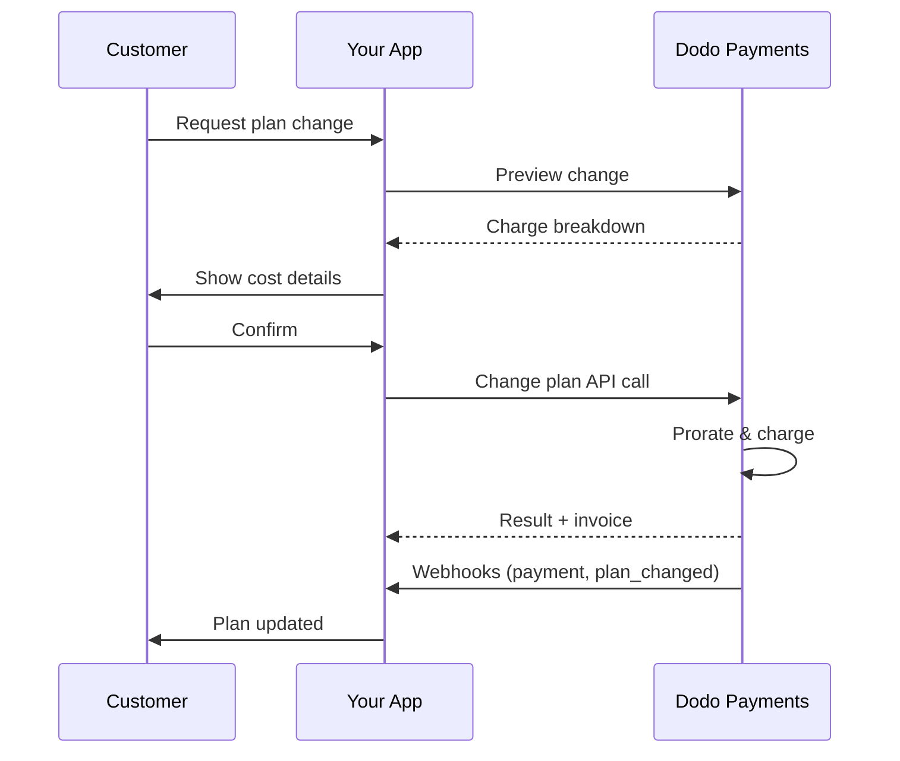
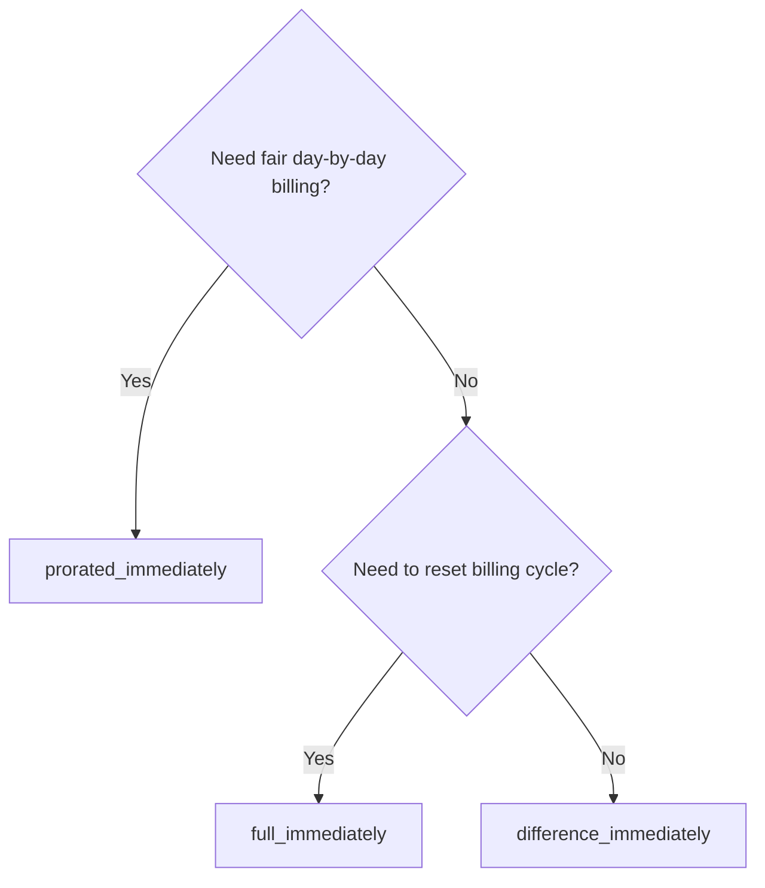
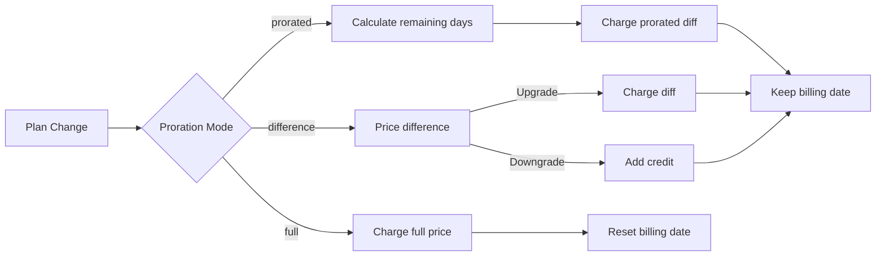

<CardGroup cols={3}>
<Card title="Change Plan API" icon="code" href="/api-reference/subscriptions/change-plan">
  Full API docs for updating subscriptions.
</Card>
<Card title="Plan Change Preview" icon="eye" href="/api-reference/subscriptions/preview-change-plan">
  See charge amounts before changing plans.
</Card>
<Card title="Integration Guide" icon="book" href="/developer-resources/subscription-integration-guide">
  Step-by-step subscription setup.
</Card>
</CardGroup>

## What is a subscription upgrade or downgrade?

Changing plans lets you move a customer between subscription tiers or quantities. Use it to:
- Align pricing with usage or features
- Move from monthly to annual (or vice versa)
- Adjust quantity for seat-based products

<Info>
Plan changes can trigger an immediate charge depending on the proration mode you choose.
</Info>

## When to use plan changes

- Upgrade when a customer needs more features, usage, or seats
- Downgrade when usage decreases
- Migrate users to a new product or price without cancelling their subscription

## Plan Change Flow



## Prerequisites

Before implementing subscription plan changes, ensure you have:

- A Dodo Payments merchant account with active subscription products
- API credentials (API key and webhook secret key) from the dashboard
- An existing active subscription to modify
- Webhook endpoint configured to handle subscription events

<Info>
For detailed setup instructions, see our [Integration Guide](/developer-resources/integration-guide#dashboard-setup).
</Info>

## Step-by-Step Implementation Guide

Follow this comprehensive guide to implement subscription plan changes in your application:

<Steps>
<Step title="Understand Plan Change Requirements">
Before implementing, determine:
- Which subscription products can be changed to which others
- What proration mode fits your business model
- How to handle failed plan changes gracefully
- Which webhook events to track for state management

<Tip>
Test plan changes thoroughly in test mode before implementing in production.
</Tip>
</Step>

<Step title="Choose Your Proration Strategy">
Select the billing approach that aligns with your business needs:

<Tabs>
<Tab title="prorated_immediately">
Best for: SaaS applications wanting to charge fairly for unused time
- Calculates exact prorated amount based on remaining cycle time
- Charges a prorated amount based on unused time remaining in the cycle
- Provides transparent billing to customers
</Tab>

<Tab title="difference_immediately">
Best for: Clear upgrade/downgrade scenarios
- Upgrade: Charge immediate difference (e.g., $30→$80 = charge $50)
- Downgrade: Credit remaining value for future renewals
- Simplifies billing logic and customer communication
</Tab>

<Tab title="full_immediately">
Best for: When you want to reset the billing cycle
- Charges full amount of new plan immediately
- Ignores remaining time from old plan
- Useful for annual to monthly transitions
</Tab>
</Tabs>
</Step>

<Step title="Implement the Change Plan API">
Use the Change Plan API to modify subscription details:

<ParamField path="subscription_id" type="string" required>
The ID of the active subscription to modify.
</ParamField>

<ParamField path="product_id" type="string" required>
The new product ID to change the subscription to.
</ParamField>

<ParamField path="quantity" type="integer" default="1">
Number of units for the new plan (for seat-based products).
</ParamField>

<ParamField path="proration_billing_mode" type="string" required>
How to handle immediate billing: `prorated_immediately`, `full_immediately`, or `difference_immediately`.
</ParamField>

<ParamField path="addons" type="array">
Optional addons for the new plan. Leaving this empty removes any existing addons.
</ParamField>

<ParamField path="on_payment_failure" type="string">
Controls behavior when the plan change payment fails:
- `prevent_change`: Keep subscription on current plan until payment succeeds
- `apply_change` (default): Apply plan change immediately regardless of payment outcome

Wenn nicht angegeben, wird die standardmäßige Einstellung auf Geschäftsebene verwendet.
</ParamField>

<ParamField path="discount_code" type="string">
Optionaler Rabattcode, der auf den neuen Plan angewendet werden kann. Wenn angegeben, wird der Rabatt validiert und auf die Planänderung angewendet. Wenn nicht angegeben und das Abonnement bereits einen bestehenden Rabatt mit `preserve_on_plan_change=true` hat, wird der bestehende Rabatt erhalten bleiben (wenn er auf das neue Produkt anwendbar ist).
</ParamField>
</Step>

<Step title="Handle Webhook Events">
Richten Sie die Webhook-Verarbeitung ein, um die Ergebnisse der Planänderung zu verfolgen:

- `subscription.active`: Planänderung erfolgreich, Abonnement aktualisiert
- `subscription.plan_changed`: Abonnementplan geändert (Upgrade/Downgrade/Add-On-Update)
- `subscription.on_hold`: Planänderungsgebühr fehlgeschlagen, Abonnement pausiert
- `payment.succeeded`: Sofortige Gebühr für Planänderung erfolgreich
- `payment.failed`: Sofortige Gebühr fehlgeschlagen

<Warning>
Überprüfen Sie immer Webhook-Signaturen und implementieren Sie eine idempotente Ereignisverarbeitung.
</Warning>
</Step>

<Step title="Update Your Application State">
Basierend auf Webhook-Ereignissen, aktualisieren Sie Ihre Anwendung:
- Gewähren/entziehen Sie Funktionen basierend auf dem neuen Plan
- Aktualisieren Sie das Kundendashboard mit neuen Plandetails
- Senden Sie Bestätigungs-E-Mails über Planänderungen
- Protokollieren Sie Abrechnungsänderungen für Prüfungszwecke
</Step>

<Step title="Test and Monitor">
Testen Sie Ihre Implementierung gründlich:
- Testen Sie alle Prorationsmodi mit verschiedenen Szenarien
- Stellen Sie sicher, dass die Webhook-Verarbeitung korrekt funktioniert
- Überwachen Sie die Erfolgsraten von Planänderungen
- Richten Sie Benachrichtigungen für fehlgeschlagene Planänderungen ein

<Check>
Ihre Implementierung zur Änderung von Abonnementplänen ist jetzt bereit für den Produktiveinsatz.
</Check>
</Step>
</Steps>

## Planungsvorschau

Bevor Sie eine Planänderung festlegen, verwenden Sie die Vorschau-API, um Kunden genau zu zeigen, was ihnen berechnet wird:

<Tabs>
<Tab title="Node.js SDK">

```javascript
const preview = await client.subscriptions.previewChangePlan('sub_123', {
  product_id: 'prod_pro',
  quantity: 1,
  proration_billing_mode: 'prorated_immediately'
});

// Show customer the charge before confirming
console.log('Immediate charge:', preview.immediate_charge.summary);
console.log('New plan details:', preview.new_plan);
```

</Tab>

<Tab title="Python SDK">

```python
preview = client.subscriptions.preview_change_plan(
    subscription_id="sub_123",
    product_id="prod_pro",
    quantity=1,
    proration_billing_mode="prorated_immediately"
)

# Show customer the charge before confirming
print("Immediate charge:", preview.immediate_charge.summary)
print("New plan details:", preview.new_plan)
```

</Tab>
</Tabs>

<Tip>
Verwenden Sie die Vorschau-API, um Bestätigungsdialoge zu erstellen, die Kunden den genauen Betrag anzeigen, der berechnet wird, bevor sie eine Planänderung bestätigen.
</Tip>

## Plan API ändern

Verwenden Sie die API zur Planänderung, um Produkt, Menge und Prorationsverhalten für ein aktives Abonnement zu ändern.

### Beispiele für einen schnellen Einstieg

<Tabs>
  <Tab title="Node.js SDK">

    ```javascript
    import DodoPayments from 'dodopayments';

    const client = new DodoPayments({
      bearerToken: process.env.DODO_PAYMENTS_API_KEY,
      environment: 'test_mode', // defaults to 'live_mode'
    });

    async function changePlan() {
      const result = await client.subscriptions.changePlan('sub_123', {
        product_id: 'prod_new',
        quantity: 3,
        proration_billing_mode: 'prorated_immediately',
        on_payment_failure: 'prevent_change', // Optional: control behavior on payment failure
      });
      console.log(result.status, result.invoice_id, result.payment_id);
    }

    changePlan();
    ```

  </Tab>
  <Tab title="Python SDK">

    ```python
    import os
    from dodopayments import DodoPayments

    client = DodoPayments(
        bearer_token=os.environ.get("DODO_PAYMENTS_API_KEY"),
        environment="test_mode",  # defaults to "live_mode"
    )

    result = client.subscriptions.change_plan(
        subscription_id="sub_123",
        product_id="prod_new",
        quantity=3,
        proration_billing_mode="prorated_immediately",
        on_payment_failure="prevent_change",  # Optional: control behavior on payment failure
    )
    print(result.status, result.get("invoice_id"), result.get("payment_id"))
    ```

  </Tab>
  <Tab title="Go SDK">

    ```go
    package main

    import (
      "context"
      "fmt"
      "github.com/dodopayments/dodopayments-go"
      "github.com/dodopayments/dodopayments-go/option"
    )

    func main() {
      client := dodopayments.NewClient(option.WithBearerToken("YOUR_TOKEN"))
      res, err := client.Subscriptions.ChangePlan(context.TODO(), dodopayments.SubscriptionChangePlanParams{
        SubscriptionID: dodopayments.F("sub_123"),
        ProductID:             dodopayments.F("prod_new"),
        Quantity:              dodopayments.F(int64(3)),
        ProrationBillingMode:  dodopayments.F(dodopayments.SubscriptionChangePlanParamsProrationBillingModeProratedImmediately),
        OnPaymentFailure:      dodopayments.F(dodopayments.OnPaymentFailurePreventChange), // Optional
      })
      if err != nil { panic(err) }
      fmt.Println(res.Status, res.InvoiceID, res.PaymentID)
    }
    ```

  </Tab>
  <Tab title="HTTP">

    ```bash
    curl -X POST "$DODO_API_BASE/subscriptions/sub_123/change-plan" \
      -H "Authorization: Bearer $DODO_PAYMENTS_API_KEY" \
      -H "Content-Type: application/json" \
      -d '{
        "product_id": "prod_new",
        "quantity": 3,
        "proration_billing_mode": "prorated_immediately",
        "on_payment_failure": "prevent_change"
      }'
    ```

  </Tab>
</Tabs>

```json Success
{
  "status": "processing",
  "subscription_id": "sub_123",
  "invoice_id": "inv_789",
  "payment_id": "pay_456",
  "proration_billing_mode": "prorated_immediately"
}
```

<Note>
Felder wie <code>invoice_id</code> und <code>payment_id</code> werden nur zurückgegeben, wenn während der Planänderung eine sofortige Gebühr und/oder Rechnung erstellt wird. Verlassen Sie sich immer auf Webhook-Ereignisse (z.B. <code>payment.succeeded</code>, <code>subscription.plan_changed</code>), um Ergebnisse zu bestätigen.
</Note>

<Warning>
Wenn die sofortige Gebühr fehlschlägt, kann das Abonnement auf `subscription.on_hold` wechseln, bis die Zahlung erfolgreich ist.
</Warning>

## Addons verwalten

Beim Ändern von Abonnementplänen können Sie auch Addons ändern:

```javascript
// Add addons to the new plan
await client.subscriptions.changePlan('sub_123', {
  product_id: 'prod_new',
  quantity: 1,
  proration_billing_mode: 'difference_immediately',
  addons: [
    { addon_id: 'addon_123', quantity: 2 }
  ]
});

// Remove all existing addons
await client.subscriptions.changePlan('sub_123', {
  product_id: 'prod_new',
  quantity: 1,
  proration_billing_mode: 'difference_immediately',
  addons: [] // Empty array removes all existing addons
});
```

<Info>
Addons werden in die Prorationsberechnung einbezogen und entsprechend dem ausgewählten Prorationsmodus berechnet.
</Info>

## Rabattcodes anwenden

Sie können einen Rabattcode anwenden, wenn Sie Abonnementpläne ändern. Dies ist nützlich, um Aktionspreise für Upgrades oder Migrationen anzubieten.

<Tabs>
<Tab title="Node.js SDK">

```javascript
// Apply a discount code during plan change
await client.subscriptions.changePlan('sub_123', {
  product_id: 'prod_pro',
  quantity: 1,
  proration_billing_mode: 'prorated_immediately',
  discount_code: 'UPGRADE20'
});
```

</Tab>
<Tab title="Python SDK">

```python
# Apply a discount code during plan change
client.subscriptions.change_plan(
    subscription_id="sub_123",
    product_id="prod_pro",
    quantity=1,
    proration_billing_mode="prorated_immediately",
    discount_code="UPGRADE20"
)
```

</Tab>
<Tab title="HTTP">

```bash
curl -X POST "$DODO_API_BASE/subscriptions/sub_123/change-plan" \
  -H "Authorization: Bearer $DODO_PAYMENTS_API_KEY" \
  -H "Content-Type: application/json" \
  -d '{
    "product_id": "prod_pro",
    "quantity": 1,
    "proration_billing_mode": "prorated_immediately",
    "discount_code": "UPGRADE20"
  }'
```

</Tab>
</Tabs>

### Rabattverhalten bei Planänderung

| Szenario | Verhalten |
|----------|----------|
| `discount_code` bereitgestellt | Validiert und wendet den Rabatt auf den neuen Plan an. |
| Kein Code bereitgestellt, bestehender Rabatt mit `preserve_on_plan_change=true` | Bestehender Rabatt wird automatisch beibehalten, wenn anwendbar auf das neue Produkt. |
| Kein Code bereitgestellt, kein erhaltbarer Rabatt | Kein Rabatt auf den neuen Plan angewendet. |

<Tip>
Verwenden Sie die [Vorschau-Plan-API](/api-reference/subscriptions/preview-change-plan) mit einem `discount_code`, um Kunden genau zu zeigen, wie viel sie sparen, bevor sie die Planänderung bestätigen.
</Tip>

## Prorationsmodi

Wählen Sie aus, wie Sie den Kunden bei Planänderungen berechnen möchten:

#### `prorated_immediately`
- Berechnet die partielle Differenz im aktuellen Zyklus
- Wenn im Versuch, wird sofort berechnet und wechselt jetzt zum neuen Plan
- Downgrade: könnte ein proratiertes Guthaben erzeugen, das auf zukünftige Erneuerungen angewendet wird

#### `full_immediately`
- Berechnet sofort den vollen Betrag des neuen Plans
- Ignoriert verbleibende Zeit vom alten Plan

<Info>
Die durch Downgrades mit <code>difference_immediately</code> erstellten Guthaben sind abonnementbezogen und unterscheiden sich von <a href="/features/credit-based-billing">kreditbasierter Abrechnungsberechtigung</a>. Sie gelten automatisch für zukünftige Erneuerungen desselben Abonnements und sind nicht zwischen Abonnements übertragbar.
</Info>

#### `difference_immediately`
- Upgrade: berechnet sofort die Preisdifferenz zwischen alten und neuen Plänen
- Downgrade: fügt den verbleibenden Wert als internes Guthaben zum Abonnement hinzu und wendet es automatisch auf Erneuerungen an

| Feature | `prorated_immediately` | `difference_immediately` | `full_immediately` |
|---------|----------------------|------------------------|-------------------|
| **Upgrade-Gebühr** | Proratiertes Differenz für verbleibende Tage | Voller Preisunterschied zwischen Plänen | Voller neuer Planpreis |
| **Downgrade-Guthaben** | Proratiertes Guthaben für verbleibende Tage | Voller Preisunterschied als Guthaben | Kein Guthaben |
| **Abrechnungszyklus** | Unverändert | Unverändert | Wird auf heute zurückgesetzt |
| **Testverhalten** | Beendet den Test, berechnet sofort | Beendet den Test, berechnet sofort | Beendet den Test, berechnet vollen Betrag |
| **Beste für** | Faire zeitbasierte Abrechnung | Einfache Upgrade/Downgrade-Rechnung | Zurücksetzen von Abrechnungszyklen |
| **Komplexität** | Mittel (Tagesberechnung) | Niedrig (einfache Subtraktion) | Niedrig (volle Belastung) |



### Beispiel-Szenarien

Verwenden Sie diese kanonischen Zahlen konsistent:
- Aktueller Plan: **Basic** zu **30 $/Monat**
- Upgrade-Ziel: **Pro** zu **80 $/Monat**
- Downgrade-Ziel (von Pro): **Starter** zu **20 $/Monat**
- Abrechnungszyklus: **30 Tage**, begann am **1. Januar**
- Planänderung erfolgt am **16. Januar** (15 Tage verbleiben, 15 Tage verwendet)

<AccordionGroup>
  <Accordion title="Upgrade: Basic ($30) → Pro ($80) with prorated_immediately">

    ```
    Step 1: Calculate unused credit from current plan
      Unused days = 15 out of 30 days
      Credit = $30 × (15/30) = $15.00

    Step 2: Calculate prorated cost of new plan
      Remaining days = 15 out of 30 days
      New plan cost = $80 × (15/30) = $40.00

    Step 3: Calculate immediate charge
      Charge = New plan cost − Credit
      Charge = $40.00 − $15.00 = $25.00

    → Customer pays $25.00 now
    → Next renewal (Feb 1): $80.00/month
    ```

    ```javascript
    await client.subscriptions.changePlan('sub_123', {
      product_id: 'prod_pro',
      quantity: 1,
      proration_billing_mode: 'prorated_immediately'
    })
    ```

  </Accordion>

  <Accordion title="Downgrade: Pro ($80) → Starter ($20) with prorated_immediately">

    ```
    Step 1: Calculate unused credit from current plan
      Unused days = 15 out of 30 days
      Credit = $80 × (15/30) = $40.00

    Step 2: Calculate prorated cost of new plan
      Remaining days = 15 out of 30 days
      New plan cost = $20 × (15/30) = $10.00

    Step 3: Calculate credit balance
      Credit = $40.00 − $10.00 = $30.00

    → No charge — $30.00 credit added to subscription
    → Credit auto-applies to future renewals
    → Next renewal (Feb 1): $20.00 − $30.00 credit = $0.00
    → Following renewal (Mar 1): $20.00 − $10.00 remaining credit = $10.00
    ```

    ```javascript
    await client.subscriptions.changePlan('sub_123', {
      product_id: 'prod_starter',
      quantity: 1,
      proration_billing_mode: 'prorated_immediately'
    })
    ```

  </Accordion>

  <Accordion title="Upgrade: Basic ($30) → Pro ($80) with difference_immediately">

    ```
    Immediate charge = New plan price − Old plan price
                     = $80 − $30
                     = $50.00

    → Customer pays $50.00 now (regardless of cycle position)
    → Next renewal (Feb 1): $80.00/month
    ```

    ```javascript
    await client.subscriptions.changePlan('sub_123', {
      product_id: 'prod_pro',
      quantity: 1,
      proration_billing_mode: 'difference_immediately'
    })
    ```

  </Accordion>

  <Accordion title="Downgrade: Pro ($80) → Starter ($20) with difference_immediately">

    ```
    Credit = Old plan price − New plan price
           = $80 − $20
           = $60.00

    → No charge — $60.00 credit added to subscription
    → Credit auto-applies to future renewals
    → Next renewal: $20.00 − $20.00 (from credit) = $0.00
    → Following renewal: $20.00 − $20.00 (from credit) = $0.00
    → Third renewal: $20.00 − $20.00 (from remaining credit) = $0.00
    ```

    ```javascript
    await client.subscriptions.changePlan('sub_123', {
      product_id: 'prod_starter',
      quantity: 1,
      proration_billing_mode: 'difference_immediately'
    })
    ```

  </Accordion>

  <Accordion title="Upgrade: Basic ($30) → Pro ($80) with full_immediately">

    ```
    Immediate charge = Full new plan price = $80.00

    → Customer pays $80.00 now
    → No credit for unused time on old plan
    → Billing cycle resets to today (January 16)
    → Next renewal: February 16 at $80.00/month
    ```

    ```javascript
    await client.subscriptions.changePlan('sub_123', {
      product_id: 'prod_pro',
      quantity: 1,
      proration_billing_mode: 'full_immediately'
    })
    ```

  </Accordion>

  <Accordion title="Mid-cycle upgrade with add-ons using prorated_immediately">

    ```
    Current: Basic plan ($30/month), no add-ons
    New: Pro plan ($80/month) + Extra Seats add-on ($10/seat × 3 seats = $30/month)
    Change on day 16 of 30 (15 days remaining)

    Step 1: Credit from current plan
      Credit = $30 × (15/30) = $15.00

    Step 2: Prorated cost of new plan + add-ons
      New plan = $80 × (15/30) = $40.00
      Add-ons = $30 × (15/30) = $15.00
      Total new = $55.00

    Step 3: Immediate charge
      Charge = $55.00 − $15.00 = $40.00

    → Customer pays $40.00 now
    → Next renewal: $80.00 + $30.00 = $110.00/month
    ```

    ```javascript
    await client.subscriptions.changePlan('sub_123', {
      product_id: 'prod_pro',
      quantity: 1,
      proration_billing_mode: 'prorated_immediately',
      addons: [
        { addon_id: 'addon_seats', quantity: 3 }
      ]
    })
    ```

  </Accordion>
</AccordionGroup>

### Wie jeder Modus die Abrechnungsprozesse behandelt



<Tip>
Wählen Sie `prorated_immediately` für eine faire zeitbasierte Abrechnung; wählen Sie `full_immediately`, um die Abrechnung neu zu starten; verwenden Sie `difference_immediately` für einfache Upgrades und automatische Guthaben bei Downgrades.
</Tip>

## Behandlung von Zahlungsfehlern

Bestimmen Sie, was passiert, wenn eine Planänderungszahlung fehlschlägt, indem Sie den `on_payment_failure`-Parameter verwenden.

### Zahlungsfehler-Modi

<Tabs>
<Tab title="prevent_change (Recommended for critical upgrades)">
**Verhalten**: Halten Sie das Abonnement auf dem aktuellen Plan, bis die Zahlung erfolgreich ist.

- Planänderung wird als "ausstehend" markiert
- Kunde behält Zugriff auf seinen aktuellen Plan
- Abonnement wechselt erst nach erfolgreicher Zahlung in den Zustand `active`
- Nützlich, wenn Sie sicherstellen möchten, dass die Zahlung erfolgt, bevor verbesserte Funktionen gewährt werden

```javascript
await client.subscriptions.changePlan('sub_123', {
  product_id: 'prod_pro',
  quantity: 1,
  proration_billing_mode: 'prorated_immediately',
  on_payment_failure: 'prevent_change'
});
```

</Tab>

<Tab title="apply_change (Default)">
**Verhalten**: Wendet die Planänderung unabhängig vom Zahlungsergebnis sofort an.

- Planänderung wird auch bei Zahlungsausfall sofort angewendet
- Kunde erhält sofortigen Zugriff auf den neuen Plan
- Das Abonnement kann in den Zustand `on_hold` wechseln, wenn die Zahlung fehlschlägt
- Gut für nicht kritische Upgrades oder wenn Sie dem Kunden vertrauen

```javascript
await client.subscriptions.changePlan('sub_123', {
  product_id: 'prod_pro',
  quantity: 1,
  proration_billing_mode: 'prorated_immediately',
  on_payment_failure: 'apply_change' // This is the default
});
```

</Tab>
</Tabs>

<Info>
Wenn nicht angegeben, wird der `on_payment_failure`-Parameter auf Ihre auf dem Dashboard konfigurierte, geschäftliche Standardeinstellung zurückgesetzt.
</Info>

### Wann man jeden Modus verwenden sollte

| Szenario | Empfohlener Modus | Grund |
|----------|------------------|--------|
| Upgrade auf Premium-Funktionen | `prevent_change` | Zahlung sicherstellen, bevor Zugriff gewährt wird |
| Mengenerhöhung (mehr Plätze) | `prevent_change` | Nutzung ohne Zahlung verhindern |
| Plansenkungen | `apply_change` | Kunde reduziert Ausgaben |
| Vertrauenswürdige Unternehmenskunden | `apply_change` | Geringeres Risiko der Nichtzahlung |
| Umstellung von Testversion auf bezahlte Version | `prevent_change` | Kritischer Zahlungszeitpunkt |

## Umgang mit Webhooks

Verfolgen Sie den Abonnementstatus über Webhooks, um Planänderungen und Zahlungen zu bestätigen.

### Zu behandelnde Ereignistypen
- `subscription.active`: Abonnement aktiviert
- `subscription.plan_changed`: Abonnementplan geändert (Upgrade/Downgrade/Add-On-Änderungen)
- `subscription.on_hold`: Aufladen fehlgeschlagen, Abonnement pausiert
- `subscription.renewed`: Erneuerung erfolgreich
- `payment.succeeded`: Zahlung für Planänderung oder Erneuerung erfolgreich
- `payment.failed`: Zahlung fehlgeschlagen

<Info>
Wir empfehlen, Geschäftslogik von Abonnementereignissen zu leiten und Zahlungsevents zur Bestätigung und Abgleich zu verwenden.
</Info>

### Signaturen verifizieren und Absichten handhaben

<Tabs>
  <Tab title="Next.js Route Handler">

    ```javascript
    import { NextRequest, NextResponse } from 'next/server';
    
    export async function POST(req) {
      const webhookId = req.headers.get('webhook-id');
      const webhookSignature = req.headers.get('webhook-signature');
      const webhookTimestamp = req.headers.get('webhook-timestamp');
      const secret = process.env.DODO_WEBHOOK_SECRET;
    
      const payload = await req.text();
      // verifySignature is a placeholder – in production, use a Standard Webhooks library
      const { valid, event } = await verifySignature(
        payload,
        { id: webhookId, signature: webhookSignature, timestamp: webhookTimestamp },
        secret
      );
      if (!valid) return NextResponse.json({ error: 'Invalid signature' }, { status: 400 });
    
      switch (event.type) {
        case 'subscription.active':
          // mark subscription active in your DB
          break;
        case 'subscription.plan_changed':
          // refresh entitlements and reflect the new plan in your UI
          break;
        case 'subscription.on_hold':
          // notify user to update payment method
          break;
        case 'subscription.renewed':
          // extend access window
          break;
        case 'payment.succeeded':
          // reconcile payment for plan change
          break;
        case 'payment.failed':
          // log and alert
          break;
        default:
          // ignore unknown events
          break;
      }
    
      return NextResponse.json({ received: true });
    }
    ```

  </Tab>
  <Tab title="Express.js">

    ```javascript
    import express from 'express';
    
    const app = express();
    app.post('/webhooks/dodo', express.raw({ type: 'application/json' }), async (req, res) => {
      const webhookId = req.header('webhook-id');
      const webhookSignature = req.header('webhook-signature');
      const webhookTimestamp = req.header('webhook-timestamp');
      const secret = process.env.DODO_WEBHOOK_SECRET;
      const payload = req.body.toString('utf8');
    
      const { valid, event } = await verifySignature(
        payload,
        { id: webhookId, signature: webhookSignature, timestamp: webhookTimestamp },
        secret
      );
      if (!valid) return res.status(400).send('Invalid signature');
    
      // handle events like above
      res.json({ received: true });
    });
    
    app.listen(3000);
    ```

  </Tab>
</Tabs>

<Note>
Für detaillierte Payload-Schemata sehen Sie sich die <a href="/developer-resources/webhooks/intents/subscription">Abonnement-Webhook-Payloads</a> und <a href="/developer-resources/webhooks/intents/payment">Zahlungs-Webhook-Payloads</a> an.
</Note>

## Best Practices

Befolgen Sie diese Empfehlungen für zuverlässige Änderungen von Abonnementplänen:

### Planänderungsstrategie
- **Gründlich testen**: Testen Sie Planänderungen immer im Testmodus vor dem Produktionseinsatz
- **Proration sorgfältig auswählen**: Wählen Sie den Prorationsmodus, der Ihrem Geschäftsmodell entspricht
- **Fehlerausfälle ordentlich verwalten**: Implementieren Sie angemessene Fehlerbehandlung und Wiederholungslogik
- **Erfolgsraten überwachen**: Verfolgen Sie die Erfolgs-/Fehlerraten von Planänderungen und untersuchen Sie Probleme

### Webhook-Implementierung
- **Signaturen verifizieren**: Validieren Sie immer Webhook-Signaturen, um die Authentizität sicherzustellen
- **Idempotenz implementieren**: Behandeln Sie doppelte Webhook-Ereignisse ordnungsgemäß
- **Asynchron verarbeiten**: Blockieren Sie Webhook-Antworten nicht mit schweren Operationen
- **Alles protokollieren**: Führen Sie detaillierte Protokolle für Debugging- und Prüfungszwecke

### Benutzererfahrung
- **Klar kommunizieren**: Informieren Sie Kunden über Abrechnungsänderungen und Zeitpunkte
- **Bestätigungen bereitstellen**: Senden Sie Bestätigungs-E-Mails für erfolgreiche Planänderungen
- **Randfälle behandeln**: Berücksichtigen Sie Testphasen, Prorationen und fehlgeschlagene Zahlungen
- **Benutzeroberfläche sofort aktualisieren**: Spiegeln Sie Planänderungen in Ihrer Anwendungsoberfläche wider

## Häufige Probleme und Lösungen

Lösen Sie typische Probleme, die bei Änderungen von Abonnementplänen auftreten:

<AccordionGroup>
<Accordion title="Charge created but subscription not updated">
**Symptome**: API-Aufruf erfolgreich, aber Abonnement bleibt beim alten Plan

**Häufige Ursachen**:
- Webhook-Verarbeitung fehlgeschlagen oder verzögert
- Anwendungsstatus nach Erhalt der Webhooks nicht aktualisiert
- Datenbanktransaktionsprobleme während der Status-Aktualisierung

**Lösungen**:
- Implementieren Sie eine robuste Webhook-Verarbeitung mit Wiederholungslogik
- Verwenden Sie idempotente Operationen für Statusaktualisierungen
- Fügen Sie Monitoring hinzu, um übersehene Webhook-Ereignisse zu erkennen und zu warnen
- Stellen Sie sicher, dass der Webhook-Endpunkt zugänglich und korrekt antwortet
</Accordion>

<Accordion title="Credits not applied after downgrade">
**Symptome**: Kunde führt ein Downgrade durch, sieht aber kein Guthaben

**Häufige Ursachen**:
- Prorationsmodus-Erwartungen: Downgrades kreieren den vollen Planpreisunterschied mit `difference_immediately`, während `prorated_immediately` ein proratiertes Guthaben basierend auf verbleibender Zeit im Zyklus erzeugt
- Guthaben sind abonnementspezifisch und werden nicht zwischen Abonnements übertragen
- Guthabensaldo nicht im Kundendashboard sichtbar

**Lösungen**:
- Verwenden Sie `difference_immediately` für Downgrades, wenn automatische Guthaben gewünscht sind
- Erklären Sie den Kunden, dass Guthaben auf zukünftige Erneuerungen desselben Abonnements angewendet werden
- Implementieren Sie ein Kundenportal, um Guthabensalden anzuzeigen
- Prüfen Sie die Vorschau der nächsten Rechnung, um angewendete Guthaben zu sehen
</Accordion>

<Accordion title="Webhook signature verification fails">
**Symptome**: Webhook-Ereignisse aufgrund ungültiger Signatur abgelehnt

**Häufige Ursachen**:
- Falscher Webhook-Schlüssel
- Rohes Anforderungs-Body vor Signaturüberprüfung geändert
- Falscher Signaturüberprüfungsalgorithmus

**Lösungen**:
- Überprüfen Sie, ob das richtige `DODO_WEBHOOK_SECRET` aus dem Dashboard verwendet wird
- Lesen Sie das rohe Anforderungs-Body vor jeder JSON-Parsing-Middleware
- Verwenden Sie die Standard-Webhook-Verifizierungsbibliothek für Ihre Plattform
- Testen Sie die Webhook-Signaturverifizierung in der Entwicklungsumgebung
</Accordion>

<Accordion title="Plan change fails with 422 error">
**Symptome**: API gibt 422 Unprocessable Entity Fehler zurück

**Häufige Ursachen**:
- Ungültige Abonnement-ID oder Produkt-ID
- Abonnement nicht im aktiven Zustand
- Fehlende erforderliche Parameter
- Produkt nicht für Planänderungen verfügbar

**Lösungen**:
- Überprüfen Sie, ob das Abonnement existiert und aktiv ist
- Prüfen Sie, ob die Produkt-ID gültig und verfügbar ist
- Stellen Sie sicher, dass alle erforderlichen Parameter angegeben sind
- Lesen Sie die API-Dokumentation zu den Parameteranforderungen
</Accordion>

<Accordion title="Immediate charge fails during plan change">
**Symptome**: Planänderung initiiert, aber sofortige Gebühr fehlgeschlagen

**Häufige Ursachen**:
- Unzureichende Mittel auf dem Zahlungsmittel des Kunden
- Zahlungsmittel abgelaufen oder ungültig
- Bank hat die Transaktion abgelehnt
- Betrugsdetektionssystem hat die Gebühr blockiert

**Lösungen**:
- Behandeln Sie `payment.failed` Webhook-Ereignisse angemessen
- Benachrichtigen Sie den Kunden, seine Zahlungsmittel zu aktualisieren
- Implementieren Sie Retry-Logik bei temporären Ausfällen
- Erlauben Sie gegebenenfalls Planänderungen mit fehlgeschlagenen sofortigen Gebühren
</Accordion>

<Accordion title="Subscription on hold after plan change">
**Symptome**: Planänderungsgebühr schlägt fehl und das Abonnement wechselt in den Zustand `on_hold`

**Was passiert**:
Wenn eine Planänderungsgebühr fehlschlägt, wird das Abonnement automatisch in den Zustand `on_hold` versetzt. Das Abonnement wird erst dann automatisch erneuert, wenn das Zahlungsmittel aktualisiert wird.

**Lösung**: Aktualisieren Sie das Zahlungsmittel, um das Abonnement wieder zu aktivieren

So reaktivieren Sie ein Abonnement aus dem Zustand `on_hold` nach einer fehlgeschlagenen Planänderung:

1. **Aktualisieren Sie das Zahlungsmittel** mit der API zur Aktualisierung des Zahlungsmittels
2. **Automatische Gebührenerstellung**: Die API erstellt automatisch eine Gebühr für offene Posten
3. **Rechnungserstellung**: Eine Rechnung wird für die Gebühr erstellt
4. **Zahlungsabwicklung**: Die Zahlung wird mit dem neuen Zahlungsmittel verarbeitet
5. **Reaktivierung**: Nach erfolgreicher Zahlung wird das Abonnement in den Zustand `active` reaktiviert

<CodeGroup>

```javascript Node.js
// Reactivate subscription from on_hold after failed plan change
async function reactivateAfterFailedPlanChange(subscriptionId) {
  // Update payment method - automatically creates charge for remaining dues
  const response = await client.subscriptions.updatePaymentMethod(subscriptionId, {
    type: 'new',
    return_url: 'https://example.com/return'
  });
  
  if (response.payment_id) {
    console.log('Charge created for remaining dues:', response.payment_id);
    console.log('Payment link:', response.payment_link);
    
    // Redirect customer to payment_link to complete payment
    // Monitor webhooks for:
    // 1. payment.succeeded - charge succeeded
    // 2. subscription.active - subscription reactivated
  }
  
  return response;
}

// Or use existing payment method if available
async function reactivateWithExistingPaymentMethod(subscriptionId, paymentMethodId) {
  const response = await client.subscriptions.updatePaymentMethod(subscriptionId, {
    type: 'existing',
    payment_method_id: paymentMethodId
  });
  
  // Monitor webhooks for payment.succeeded and subscription.active
  return response;
}
```

```python Python
# Reactivate subscription from on_hold after failed plan change
def reactivate_after_failed_plan_change(subscription_id):
    # Update payment method - automatically creates charge for remaining dues
    response = client.subscriptions.update_payment_method(
        subscription_id=subscription_id,
        type="new",
        return_url="https://example.com/return"
    )
    
    if response.payment_id:
        print("Charge created for remaining dues:", response.payment_id)
        print("Payment link:", response.payment_link)
        
        # Redirect customer to payment_link to complete payment
        # Monitor webhooks for:
        # 1. payment.succeeded - charge succeeded
        # 2. subscription.active - subscription reactivated
    
    return response

# Or use existing payment method if available
def reactivate_with_existing_payment_method(subscription_id, payment_method_id):
    response = client.subscriptions.update_payment_method(
        subscription_id=subscription_id,
        type="existing",
        payment_method_id=payment_method_id
    )
    
    # Monitor webhooks for payment.succeeded and subscription.active
    return response
```

</CodeGroup>

**Zu überwachende Webhook-Ereignisse**:
- `subscription.on_hold`: Abonnement auf Halten gesetzt (erhalten, wenn Planänderungsgebühr fehlschlägt)
- `payment.succeeded`: Zahlung für verbleibende Posten erfolgreich (nach Aktualisierung des Zahlungsmittels)
- `subscription.active`: Abonnement nach erfolgreicher Zahlung reaktiviert

**Beste Praktiken**:
- Benachrichtigung der Kunden sofort, wenn eine Planänderungsgebühr fehlschlägt
- Klare Anweisungen geben, wie das Zahlungsmittel aktualisiert werden kann
- Webhook-Ereignisse überwachen, um den Reaktivierungsstatus zu verfolgen
- Erwägen Sie die Implementierung automatischer Wiederholungslogik bei temporären Zahlungsausfällen

<Card title="Update Payment Method API Reference" icon="code" href="/api-reference/subscriptions/update-payment-method">
Sehen Sie sich die vollständige API-Dokumentation zur Aktualisierung von Zahlungsmitteln und Reaktivierung von Abonnements an.
</Card>
</Accordion>
</AccordionGroup>

## Testen Sie Ihre Implementierung

Befolgen Sie diese Schritte, um Ihre Implementierung zur Änderung von Abonnementplänen gründlich zu testen:

<Steps>
<Step title="Set up test environment">
- Verwenden Sie Test-API-Schlüssel und Testprodukte
- Erstellen Sie Testabonnements mit verschiedenen Plantypen
- Konfigurieren Sie den Test-Webhook-Endpunkt
- Richten Sie Überwachung und Protokollierung ein
</Step>

<Step title="Test different proration modes">
- Testen Sie `prorated_immediately` mit verschiedenen Abrechnungszykluspositionen
- Testen Sie `difference_immediately` für Upgrades und Downgrades
- Testen Sie `full_immediately`, um Abrechnungszyklen zurückzusetzen
- Stellen Sie sicher, dass die Kreditberechnungen korrekt sind
</Step>

<Step title="Test webhook handling">
- Stellen Sie sicher, dass alle relevanten Webhook-Ereignisse empfangen werden
- Testen Sie die Webhook-Signaturüberprüfung
- Behandeln Sie doppelte Webhook-Ereignisse ordnungsgemäß
- Testen Sie Fehler bei der Webhook-Verarbeitung
</Step>

<Step title="Test error scenarios">
- Testen Sie mit ungültigen Abonnement-IDs
- Testen Sie mit abgelaufenen Zahlungsmitteln
- Testen Sie Netzwerkfehler und Timeouts
- Testen Sie mit unzureichenden Mitteln
</Step>

<Step title="Monitor in production">
- Richten Sie Alarme für fehlgeschlagene Planänderungen ein
- Überwachen Sie Webhook-Verarbeitungszeiten
- Verfolgen Sie Erfolgsraten von Planänderungen
- Überprüfen Sie Bedienerunterstützungstickets auf Planwechselprobleme
</Step>
</Steps>

## Fehlerbehandlung

Behandeln Sie häufige API-Fehler in Ihrer Implementierung ordnungsgemäß:

### HTTP-Statuscodes

<AccordionGroup>
<Accordion title="200 OK">
Planänderungsanforderung erfolgreich verarbeitet. Das Abonnement wird aktualisiert und die Zahlungsabwicklung hat begonnen.
</Accordion>

<Accordion title="400 Bad Request">
Ungültige Anfrageparameter. Stellen Sie sicher, dass alle erforderlichen Felder vorhanden und ordnungsgemäß formatiert sind.
</Accordion>

<Accordion title="401 Unauthorized">
Ungültiger oder fehlender API-Schlüssel. Überprüfen Sie, ob Ihr `DODO_PAYMENTS_API_KEY` korrekt ist und über die entsprechenden Berechtigungen verfügt.
</Accordion>

<Accordion title="404 Not Found">
Abonnement-ID nicht gefunden oder gehört nicht zu Ihrem Konto.
</Accordion>

<Accordion title="422 Unprocessable Entity">
Das Abonnement kann nicht geändert werden (z. B. bereits gekündigt, Produkt nicht verfügbar, etc.).
</Accordion>

<Accordion title="500 Internal Server Error">
Es ist ein Serverfehler aufgetreten. Versuchen Sie die Anfrage nach einer kurzen Verzögerung erneut.
</Accordion>
</AccordionGroup>

### Fehlerantwortformat

```json
{
  "error": {
    "code": "subscription_not_found",
    "message": "The subscription with ID 'sub_123' was not found",
    "details": {
      "subscription_id": "sub_123"
    }
  }
}
```

## Nächste Schritte

- Überprüfen Sie die <a href="/api-reference/subscriptions/change-plan">API zur Planänderung</a>
- Erforsche <a href="/features/credit-based-billing">kreditbasierte Abrechnung</a>
- Implementieren Sie Warnungen für `subscription.on_hold`
- Entdecken Sie unseren <a href="/developer-resources/webhooks">Webhook-Integrationsleitfaden</a>
