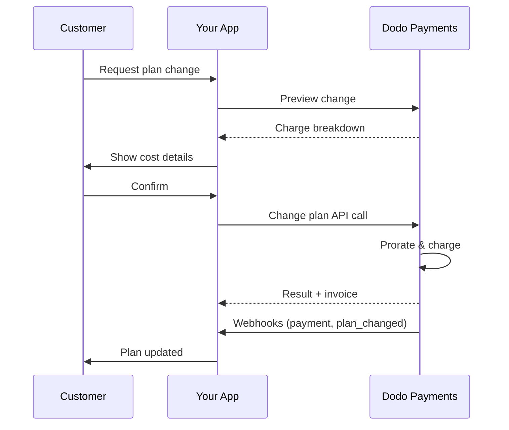
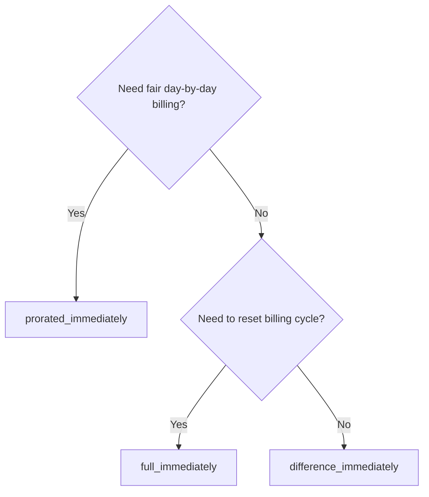
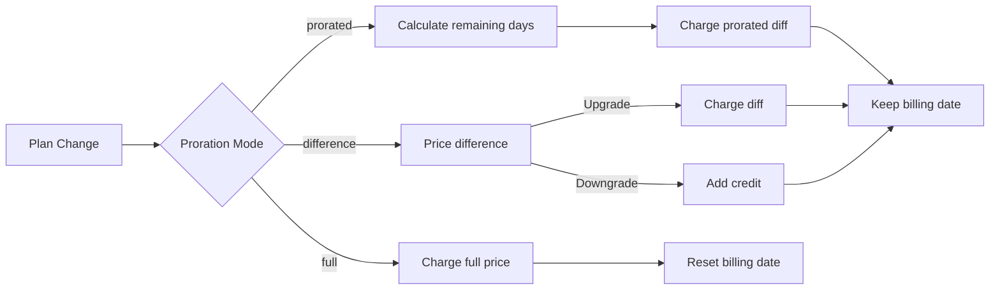

<CardGroup cols={3}>
<Card title="Change Plan API" icon="code" href="/api-reference/subscriptions/change-plan">
  Vollständige API-Dokumentation zum Aktualisieren von Abonnements.
</Card>
<Card title="Planänderungsvorschau" icon="eye" href="/api-reference/subscriptions/preview-change-plan">
  Sehen Sie die Gebührenbeträge vor der Änderung von Plänen.
</Card>
<Card title="Integrationshandbuch" icon="book" href="/developer-resources/subscription-integration-guide">
  Schritt-für-Schritt-Anleitung zur Einrichtung von Abonnements.
</Card>
</CardGroup>

## Was ist eine Abonnement-Upgrade oder -Downgrade?

Pläne zu ändern ermöglicht es Ihnen, einen Kunden zwischen Abonnement-Ebenen oder -Mengen zu verschieben. Nutzen Sie es, um:
- Preise mit der Nutzung oder den Funktionen in Einklang zu bringen
- Von monatlich zu jährlich (oder umgekehrt) zu wechseln
- Menge für sitzbasierte Produkte anzupassen

<Info>
Planänderungen können je nach gewähltem Prorationsmodus eine sofortige Gebühr auslösen.
</Info>

## Wann sollten Planänderungen verwendet werden

- Upgrade, wenn ein Kunde mehr Funktionen, Nutzung oder Plätze benötigt
- Downgrade, wenn die Nutzung abnimmt
- Benutzer ohne Kündigung ihres Abonnements auf ein neues Produkt oder einen neuen Preis migrieren

## Ablauf der Planänderung



## Voraussetzungen

Bevor Sie Änderungen an Abonnementplänen implementieren, stellen Sie sicher, dass Sie:

- Ein Dodo Payments-Händlerkonto mit aktiven Abonnementprodukten haben
- API-Anmeldeinformationen (API-Schlüssel und Webhook-Geheimschlüssel) aus dem Dashboard haben
- Ein bestehendes aktives Abonnement zur Modifikation haben
- Einen Webhook-Endpunkt konfiguriert haben, um Abonnementereignisse zu verarbeiten

<Info>
Für detaillierte Einrichtungsanleitungen siehe unseren [Integrationsleitfaden](/developer-resources/integration-guide#dashboard-setup).
</Info>

## Schritt-für-Schritt-Implementierungsleitfaden

Befolgen Sie diesen umfassenden Leitfaden, um Änderungen an Abonnementplänen in Ihrer Anwendung zu implementieren:

<Steps>
<Step title="Verstehen Sie die Anforderungen an Planänderungen">
Bevor Sie implementieren, bestimmen Sie:
- Welche Abonnementprodukte auf welche anderen geändert werden können
- Welcher Proratisierungsmodus zu Ihrem Geschäftsmodell passt
- Wie Sie fehlgeschlagene Planänderungen elegant handhaben
- Welche Webhook-Ereignisse Sie zur Statusverwaltung verfolgen sollten

<Tip>
Testen Sie Planänderungen gründlich im Testmodus, bevor Sie sie in der Produktion implementieren.
</Tip>
</Step>

<Step title="Wählen Sie Ihre Proratisierungsstrategie">
Wählen Sie den Abrechnungsansatz, der zu Ihren Geschäftsbedürfnissen passt:

<Tabs>
<Tab title="prorated_immediately">
Am besten geeignet für: SaaS-Anwendungen, die fair für ungenutzte Zeit abrechnen möchten
- Berechnet den genauen proratisierten Betrag basierend auf der verbleibenden Zykluszeit
- Berechnet einen proratisierten Betrag basierend auf der verbleibenden ungenutzten Zeit im Zyklus
- Bietet transparente Abrechnung für Kunden
</Tab>

<Tab title="difference_immediately">
Am besten geeignet für: Klare Upgrade/Downgrade-Szenarien
- Upgrade: Sofortige Gebühr für die Differenz (z. B. $30→$80 = Gebühr $50)
- Downgrade: Gutschrift des verbleibenden Wertes für zukünftige Erneuerungen
- Vereinfacht die Abrechnungslogik und die Kommunikation mit Kunden
</Tab>

<Tab title="full_immediately">
Am besten geeignet für: Wenn Sie den Abrechnungszyklus zurücksetzen möchten
- Berechnet den vollen Betrag des neuen Plans sofort
- Ignoriert die verbleibende Zeit des alten Plans
- Nützlich für Übergänge von jährlich zu monatlich
</Tab>
</Tabs>
</Step>

<Step title="Implementieren Sie die Change Plan API">
Verwenden Sie die Change Plan API, um Abonnementdetails zu ändern:

<ParamField path="subscription_id" type="string" required>
Die ID des aktiven Abonnements, das geändert werden soll.
</ParamField>

<ParamField path="product_id" type="string" required>
Die neue Produkt-ID, auf die das Abonnement geändert werden soll.
</ParamField>

<ParamField path="quantity" type="integer" default="1">
Anzahl der Einheiten für den neuen Plan (für sitzbasierte Produkte).
</ParamField>

<ParamField path="proration_billing_mode" type="string" required>
Wie mit sofortiger Abrechnung umgegangen werden soll: `prorated_immediately`, `full_immediately` oder `difference_immediately`.
</ParamField>

<ParamField path="addons" type="array">
Optionale Addons für den neuen Plan. Wenn dies leer gelassen wird, werden vorhandene Addons entfernt.
</ParamField>

<ParamField path="on_payment_failure" type="string">
Steuert das Verhalten, wenn die Zahlung für die Planänderung fehlschlägt:
- `prevent_change`: Abonnement bleibt auf dem aktuellen Plan, bis die Zahlung erfolgreich ist
- `apply_change` (Standard): Planänderung wird sofort unabhängig vom Zahlungsergebnis angewendet

Wenn nicht angegeben, wird die standardmäßige Unternehmenseinstellung verwendet.
</ParamField>
</Step>

<Step title="Webhook-Ereignisse verwalten">
Richten Sie die Verarbeitung von Webhooks ein, um die Ergebnisse der Planänderung zu verfolgen:

- `subscription.active`: Planänderung erfolgreich, Abonnement aktualisiert
- `subscription.plan_changed`: Abonnementplan geändert (Upgrade/Downgrade/Addon-Update)
- `subscription.on_hold`: Planänderungsgebühr fehlgeschlagen, Abonnement pausiert
- `payment.succeeded`: Sofortige Gebühr für die Planänderung erfolgreich
- `payment.failed`: Sofortige Gebühr fehlgeschlagen

<Warning>
Überprüfen Sie immer die Signaturen von Webhooks und implementieren Sie idempotente Ereignisverarbeitung.
</Warning>
</Step>

<Step title="Aktualisieren Sie den Status Ihrer Anwendung">
Basierend auf den Webhook-Ereignissen aktualisieren Sie Ihre Anwendung:
- Gewähren/entziehen Sie Funktionen basierend auf dem neuen Plan
- Aktualisieren Sie das Kunden-Dashboard mit den neuen Plandetails
- Senden Sie Bestätigungs-E-Mails über Planänderungen
- Protokollieren Sie Abrechnungsänderungen zu Prüfungszwecken
</Step>

<Step title="Testen und Überwachen">
Testen Sie Ihre Implementierung gründlich:
- Testen Sie alle Prorationsmodi mit unterschiedlichen Szenarien
- Überprüfen Sie, ob die Webhook-Verarbeitung korrekt funktioniert
- Überwachen Sie die Erfolgsraten von Planänderungen
- Richten Sie Alarme für fehlgeschlagene Planänderungen ein

<Check>
Ihre Implementierung zur Planänderungsabonnierung ist nun bereit für den Produktionseinsatz.
</Check>
</Step>
</Steps>

## Planänderungen Vorschau

Bevor Sie sich für eine Planänderung entscheiden, nutzen Sie die Vorschau-API, um den Kunden genau anzuzeigen, was ihnen berechnet wird:

<Tabs>
<Tab title="Node.js SDK">

```javascript
const preview = await client.subscriptions.previewChangePlan('sub_123', {
  product_id: 'prod_pro',
  quantity: 1,
  proration_billing_mode: 'prorated_immediately'
});

// Show customer the charge before confirming
console.log('Immediate charge:', preview.immediate_charge.summary);
console.log('New plan details:', preview.new_plan);
```

</Tab>

<Tab title="Python SDK">

```python
preview = client.subscriptions.preview_change_plan(
    subscription_id="sub_123",
    product_id="prod_pro",
    quantity=1,
    proration_billing_mode="prorated_immediately"
)

# Show customer the charge before confirming
print("Immediate charge:", preview.immediate_charge.summary)
print("New plan details:", preview.new_plan)
```

</Tab>
</Tabs>

<Tip>
Verwenden Sie die Vorschau-API, um Bestätigungsdialoge zu erstellen, die den Kunden den genauen Betrag anzeigen, den sie vor der Bestätigung einer Planänderung berechnet werden.
</Tip>

## Change Plan API

Verwenden Sie die Change Plan API, um Produkt, Menge und Prorationsverhalten für ein aktives Abonnement zu ändern.

### Schnellstartbeispiele

<Tabs>
  <Tab title="Node.js SDK">

    ```javascript
    import DodoPayments from 'dodopayments';

    const client = new DodoPayments({
      bearerToken: process.env.DODO_PAYMENTS_API_KEY,
      environment: 'test_mode', // defaults to 'live_mode'
    });

    async function changePlan() {
      const result = await client.subscriptions.changePlan('sub_123', {
        product_id: 'prod_new',
        quantity: 3,
        proration_billing_mode: 'prorated_immediately',
        on_payment_failure: 'prevent_change', // Optional: control behavior on payment failure
      });
      console.log(result.status, result.invoice_id, result.payment_id);
    }

    changePlan();
    ```

  </Tab>
  <Tab title="Python SDK">

    ```python
    import os
    from dodopayments import DodoPayments

    client = DodoPayments(
        bearer_token=os.environ.get("DODO_PAYMENTS_API_KEY"),
        environment="test_mode",  # defaults to "live_mode"
    )

    result = client.subscriptions.change_plan(
        subscription_id="sub_123",
        product_id="prod_new",
        quantity=3,
        proration_billing_mode="prorated_immediately",
        on_payment_failure="prevent_change",  # Optional: control behavior on payment failure
    )
    print(result.status, result.get("invoice_id"), result.get("payment_id"))
    ```

  </Tab>
  <Tab title="Go SDK">

    ```go
    package main

    import (
      "context"
      "fmt"
      "github.com/dodopayments/dodopayments-go"
      "github.com/dodopayments/dodopayments-go/option"
    )

    func main() {
      client := dodopayments.NewClient(option.WithBearerToken("YOUR_TOKEN"))
      res, err := client.Subscriptions.ChangePlan(context.TODO(), dodopayments.SubscriptionChangePlanParams{
        SubscriptionID: dodopayments.F("sub_123"),
        ProductID:             dodopayments.F("prod_new"),
        Quantity:              dodopayments.F(int64(3)),
        ProrationBillingMode:  dodopayments.F(dodopayments.SubscriptionChangePlanParamsProrationBillingModeProratedImmediately),
        OnPaymentFailure:      dodopayments.F(dodopayments.OnPaymentFailurePreventChange), // Optional
      })
      if err != nil { panic(err) }
      fmt.Println(res.Status, res.InvoiceID, res.PaymentID)
    }
    ```

  </Tab>
  <Tab title="HTTP">

    ```bash
    curl -X POST "$DODO_API_BASE/subscriptions/sub_123/change-plan" \
      -H "Authorization: Bearer $DODO_PAYMENTS_API_KEY" \
      -H "Content-Type: application/json" \
      -d '{
        "product_id": "prod_new",
        "quantity": 3,
        "proration_billing_mode": "prorated_immediately",
        "on_payment_failure": "prevent_change"
      }'
    ```

  </Tab>
</Tabs>

```json Success
{
  "status": "processing",
  "subscription_id": "sub_123",
  "invoice_id": "inv_789",
  "payment_id": "pay_456",
  "proration_billing_mode": "prorated_immediately"
}
```

<Note>
Felder wie <code>invoice_id</code> und <code>payment_id</code> werden nur zurückgegeben, wenn während der Planänderung eine sofortige Gebühr und/oder Rechnung erstellt wird. Verlassen Sie sich immer auf Webhook-Ereignisse (z.B. <code>payment.succeeded</code>, <code>subscription.plan_changed</code>), um Ergebnisse zu bestätigen.
</Note>

<Warning>
Wenn die sofortige Gebühr fehlschlägt, kann das Abonnement in den Zustand `subscription.on_hold` wechseln, bis die Zahlung erfolgreich ist.
</Warning>

## Verwaltung von Addons

Bei Planänderungen können Sie auch Addons ändern:

```javascript
// Add addons to the new plan
await client.subscriptions.changePlan('sub_123', {
  product_id: 'prod_new',
  quantity: 1,
  proration_billing_mode: 'difference_immediately',
  addons: [
    { addon_id: 'addon_123', quantity: 2 }
  ]
});

// Remove all existing addons
await client.subscriptions.changePlan('sub_123', {
  product_id: 'prod_new',
  quantity: 1,
  proration_billing_mode: 'difference_immediately',
  addons: [] // Empty array removes all existing addons
});
```

<Info>
Addons sind in die Prorationsberechnung einbezogen und werden gemäß dem gewählten Prorationsmodus berechnet.
</Info>

## Prorationsmodi

Wählen Sie aus, wie der Kunde bei Planänderungen abgerechnet wird:

#### `prorated_immediately`
- Berechnungen für die partielle Differenz im aktuellen Zyklus
- Wenn sich in der Testphase befindet, werden sofortige Gebühren erfasst und wechselt jetzt zu dem neuen Plan
- Downgrade: Kann einen anteiligen Kredit erzeugen, der auf zukünftige Erneuerungen angewendet wird

#### `full_immediately`
- Berechnet den vollen Betrag des neuen Plans sofort
- Ignoriert verbleibende Zeit vom alten Plan

<Info>
Kredite, die durch Abwertungen mit <code>difference_immediately</code> erzeugt werden, sind abonnement-spezifisch und unterscheiden sich von <a href="/features/customer-credit">Kundenkrediten</a>. Sie gelten automatisch für die zukünftigen Erneuerungen desselben Abonnements und sind nicht übertragbar zwischen Abonnements.
</Info>

#### `difference_immediately`
- Upgrade: Sofortige Erhebung des Preisunterschieds zwischen alten und neuen Plänen
- Downgrade: Fügen Sie den verbleibenden Wert als internes Guthaben zum Abonnement hinzu und wenden Sie es bei Erneuerungen automatisch an

| Funktion | `prorated_immediately` | `difference_immediately` | `full_immediately` |
|---------|----------------------|------------------------|-------------------|
| **Upgrade-Gebühr** | Proratisierter Unterschied für verbleibende Tage | Voller Preisunterschied zwischen den Plänen | Voller Preis des neuen Plans |
| **Downgrade-Kredit** | Proratisierter Kredit für verbleibende Tage | Voller Preisunterschied als Kredit | Kein Kredit |
| **Abrechnungszyklus** | Unverändert | Unverändert | Wird auf heute zurückgesetzt |
| **Testverhalten** | Beendet die Testphase, erhebt sofort Gebühren | Beendet die Testphase, erhebt sofort Gebühren | Beendet die Testphase, erhebt den vollen Betrag |
| **Am besten für** | Faire zeitbasierte Abrechnung | Einfache Upgrade-/Downgrade-Berechnung | Zurücksetzen von Abrechnungszyklen |
| **Komplexität** | Mittel (Tagesberechnung) | Niedrig (einfache Subtraktion) | Niedrig (volle Gebühr) |



### Beispielszenarien

Verwenden Sie diese kanonischen Zahlen konsequent:
- Aktueller Plan: **Basic** zu **30 $/Monat**
- Upgrade-Ziel: **Pro** zu **80 $/Monat**
- Downgrade-Ziel (von Pro): **Starter** zu **20 $/Monat**
- Abrechnungszyklus: **30 Tage**, gestartet am **1. Januar**
- Planänderung erfolgt am **16. Januar** (15 Tage verbleibend, 15 Tage genutzt)

<AccordionGroup>
  <Accordion title="Upgrade: Basic ($30) → Pro ($80) mit prorated_immediately">

    ```
    Step 1: Calculate unused credit from current plan
      Unused days = 15 out of 30 days
      Credit = $30 × (15/30) = $15.00

    Step 2: Calculate prorated cost of new plan
      Remaining days = 15 out of 30 days
      New plan cost = $80 × (15/30) = $40.00

    Step 3: Calculate immediate charge
      Charge = New plan cost − Credit
      Charge = $40.00 − $15.00 = $25.00

    → Customer pays $25.00 now
    → Next renewal (Feb 1): $80.00/month
    ```

    ```javascript
    await client.subscriptions.changePlan('sub_123', {
      product_id: 'prod_pro',
      quantity: 1,
      proration_billing_mode: 'prorated_immediately'
    })
    ```

  </Accordion>

  <Accordion title="Downgrade: Pro ($80) → Starter ($20) mit prorated_immediately">

    ```
    Step 1: Calculate unused credit from current plan
      Unused days = 15 out of 30 days
      Credit = $80 × (15/30) = $40.00

    Step 2: Calculate prorated cost of new plan
      Remaining days = 15 out of 30 days
      New plan cost = $20 × (15/30) = $10.00

    Step 3: Calculate credit balance
      Credit = $40.00 − $10.00 = $30.00

    → No charge — $30.00 credit added to subscription
    → Credit auto-applies to future renewals
    → Next renewal (Feb 1): $20.00 − $30.00 credit = $0.00
    → Following renewal (Mar 1): $20.00 − $10.00 remaining credit = $10.00
    ```

    ```javascript
    await client.subscriptions.changePlan('sub_123', {
      product_id: 'prod_starter',
      quantity: 1,
      proration_billing_mode: 'prorated_immediately'
    })
    ```

  </Accordion>

  <Accordion title="Upgrade: Basic ($30) → Pro ($80) mit difference_immediately">

    ```
    Immediate charge = New plan price − Old plan price
                     = $80 − $30
                     = $50.00

    → Customer pays $50.00 now (regardless of cycle position)
    → Next renewal (Feb 1): $80.00/month
    ```

    ```javascript
    await client.subscriptions.changePlan('sub_123', {
      product_id: 'prod_pro',
      quantity: 1,
      proration_billing_mode: 'difference_immediately'
    })
    ```

  </Accordion>

  <Accordion title="Downgrade: Pro ($80) → Starter ($20) mit difference_immediately">

    ```
    Credit = Old plan price − New plan price
           = $80 − $20
           = $60.00

    → No charge — $60.00 credit added to subscription
    → Credit auto-applies to future renewals
    → Next renewal: $20.00 − $20.00 (from credit) = $0.00
    → Following renewal: $20.00 − $20.00 (from credit) = $0.00
    → Third renewal: $20.00 − $20.00 (from remaining credit) = $0.00
    ```

    ```javascript
    await client.subscriptions.changePlan('sub_123', {
      product_id: 'prod_starter',
      quantity: 1,
      proration_billing_mode: 'difference_immediately'
    })
    ```

  </Accordion>

  <Accordion title="Upgrade: Basic ($30) → Pro ($80) mit full_immediately">

    ```
    Immediate charge = Full new plan price = $80.00

    → Customer pays $80.00 now
    → No credit for unused time on old plan
    → Billing cycle resets to today (January 16)
    → Next renewal: February 16 at $80.00/month
    ```

    ```javascript
    await client.subscriptions.changePlan('sub_123', {
      product_id: 'prod_pro',
      quantity: 1,
      proration_billing_mode: 'full_immediately'
    })
    ```

  </Accordion>

  <Accordion title="Upgrade zur Mitte des Zyklus mit Add-ons unter Verwendung von prorated_immediately">

    ```
    Current: Basic plan ($30/month), no add-ons
    New: Pro plan ($80/month) + Extra Seats add-on ($10/seat × 3 seats = $30/month)
    Change on day 16 of 30 (15 days remaining)

    Step 1: Credit from current plan
      Credit = $30 × (15/30) = $15.00

    Step 2: Prorated cost of new plan + add-ons
      New plan = $80 × (15/30) = $40.00
      Add-ons = $30 × (15/30) = $15.00
      Total new = $55.00

    Step 3: Immediate charge
      Charge = $55.00 − $15.00 = $40.00

    → Customer pays $40.00 now
    → Next renewal: $80.00 + $30.00 = $110.00/month
    ```

    ```javascript
    await client.subscriptions.changePlan('sub_123', {
      product_id: 'prod_pro',
      quantity: 1,
      proration_billing_mode: 'prorated_immediately',
      addons: [
        { addon_id: 'addon_seats', quantity: 3 }
      ]
    })
    ```

  </Accordion>
</AccordionGroup>

### Wie jeder Modus die Abrechnung verarbeitet



<Tip>
Wählen Sie `prorated_immediately` für eine faire zeitliche Abrechnung; wählen Sie `full_immediately`, um die Abrechnung zurückzusetzen; verwenden Sie `difference_immediately` für einfache Upgrades und automatisches Guthaben bei Downgrades.
</Tip>

## Umgang mit Zahlungsfehlern

Steuern Sie, was passiert, wenn eine Zahlung für die Planänderung fehlschlägt, indem Sie den `on_payment_failure` Parameter verwenden.

### Zahlungsfehlermodi

<Tabs>
<Tab title="prevent_change (Empfohlen für kritische Upgrades)">
**Verhalten**: Halten Sie das Abonnement auf dem aktuellen Plan, bis die Zahlung erfolgreich ist.

- Planänderung wird als "ausstehend" markiert
- Kunde behält Zugang zu seinem aktuellen Plan
- Abonnement wechselt erst nach erfolgreicher Zahlung in den `active` Zustand
- Nützlich, wenn Sie sicherstellen möchten, dass die Zahlung erfolgt, bevor Sie aktualisierte Funktionen gewähren

```javascript
await client.subscriptions.changePlan('sub_123', {
  product_id: 'prod_pro',
  quantity: 1,
  proration_billing_mode: 'prorated_immediately',
  on_payment_failure: 'prevent_change'
});
```

</Tab>

<Tab title="apply_change (Standard)">
**Verhalten**: Wenden Sie die Planänderung sofort unabhängig vom Zahlungsergebnis an.

- Planänderung wird auch bei Zahlungsfehler angewendet
- Kunde erhält sofortigen Zugang zum neuen Plan
- Abonnement kann in den `on_hold` Zustand wechseln, wenn die Zahlung fehlschlägt
- Gut für nicht-kritische Upgrades oder wenn Sie dem Kunden vertrauen

```javascript
await client.subscriptions.changePlan('sub_123', {
  product_id: 'prod_pro',
  quantity: 1,
  proration_billing_mode: 'prorated_immediately',
  on_payment_failure: 'apply_change' // This is the default
});
```

</Tab>
</Tabs>

<Info>
Wenn nicht angegeben, verwendet der `on_payment_failure` Parameter Ihre standardmäßige Unternehmenseinstellung, die im Dashboard konfiguriert ist.
</Info>

### Wann jeder Modus verwendet werden sollte

| Szenario | Empfohlener Modus | Grund |
|----------|------------------|--------|
| Upgrade auf Premium-Funktionen | `prevent_change` | Zahlung sicherstellen, bevor Zugang gewährt wird |
| Menge erhöhen (mehr Plätze) | `prevent_change` | Nutzung ohne Zahlung verhindern |
| Downgrading von Plänen | `apply_change` | Kunde reduziert Ausgaben |
| Vertrauenswürdige Unternehmenskunden | `apply_change` | Geringeres Risiko von Nichtzahlung |
| Umwandlung von Test zu bezahlt | `prevent_change` | Kritischer Zahlungszeitpunkt |

## Umgang mit Webhooks

Verfolgen Sie den Abonnementstatus über Webhooks, um Planänderungen und Zahlungen zu bestätigen.

### Ereignistypen, die behandelt werden müssen
- `subscription.active`: Abonnement aktiviert
- `subscription.plan_changed`: Abonnementplan geändert (Upgrade/Downgrade/Addon-Änderungen)
- `subscription.on_hold`: Gebühr fehlgeschlagen, Abonnement pausiert
- `subscription.renewed`: Erneuerung erfolgreich
- `payment.succeeded`: Zahlung für Planänderung oder Erneuerung erfolgreich
- `payment.failed`: Zahlung fehlgeschlagen

<Info>
Wir empfehlen, Geschäftslogik aus Abonnementereignissen abzuleiten und Zahlungen für Bestätigungen und Abgleiche zu verwenden.
</Info>

### Signaturen überprüfen und Absichten behandeln

<Tabs>
  <Tab title="Next.js Route Handler">

    ```javascript
    import { NextRequest, NextResponse } from 'next/server';
    
    export async function POST(req) {
      const webhookId = req.headers.get('webhook-id');
      const webhookSignature = req.headers.get('webhook-signature');
      const webhookTimestamp = req.headers.get('webhook-timestamp');
      const secret = process.env.DODO_WEBHOOK_SECRET;
    
      const payload = await req.text();
      // verifySignature is a placeholder – in production, use a Standard Webhooks library
      const { valid, event } = await verifySignature(
        payload,
        { id: webhookId, signature: webhookSignature, timestamp: webhookTimestamp },
        secret
      );
      if (!valid) return NextResponse.json({ error: 'Invalid signature' }, { status: 400 });
    
      switch (event.type) {
        case 'subscription.active':
          // mark subscription active in your DB
          break;
        case 'subscription.plan_changed':
          // refresh entitlements and reflect the new plan in your UI
          break;
        case 'subscription.on_hold':
          // notify user to update payment method
          break;
        case 'subscription.renewed':
          // extend access window
          break;
        case 'payment.succeeded':
          // reconcile payment for plan change
          break;
        case 'payment.failed':
          // log and alert
          break;
        default:
          // ignore unknown events
          break;
      }
    
      return NextResponse.json({ received: true });
    }
    ```

  </Tab>
  <Tab title="Express.js">

    ```javascript
    import express from 'express';
    
    const app = express();
    app.post('/webhooks/dodo', express.raw({ type: 'application/json' }), async (req, res) => {
      const webhookId = req.header('webhook-id');
      const webhookSignature = req.header('webhook-signature');
      const webhookTimestamp = req.header('webhook-timestamp');
      const secret = process.env.DODO_WEBHOOK_SECRET;
      const payload = req.body.toString('utf8');
    
      const { valid, event } = await verifySignature(
        payload,
        { id: webhookId, signature: webhookSignature, timestamp: webhookTimestamp },
        secret
      );
      if (!valid) return res.status(400).send('Invalid signature');
    
      // handle events like above
      res.json({ received: true });
    });
    
    app.listen(3000);
    ```

  </Tab>
</Tabs>

<Note>
Für detaillierte Payload-Schemata siehe die <a href="/developer-resources/webhooks/intents/subscription">Payloads von Subscription-Webhooks</a> und <a href="/developer-resources/webhooks/intents/payment">Payloads von Payment-Webhooks</a>.
</Note>

## Best Practices

Befolgen Sie diese Empfehlungen für zuverlässige Änderungen von Abonnementplänen:

### Planänderungsstrategie
- **Gründlich testen**: Testen Sie Planänderungen immer im Testmodus vor der Produktion
- **Prorationsmodus sorgfältig auswählen**: Wählen Sie den Prorationsmodus, der zu Ihrem Geschäftsmodell passt
- **Fehler ordentlich behandeln**: Implementieren Sie eine ordnungsgemäße Fehlerbehandlung und Wiederholungslogik
- **Erfolgsquoten überwachen**: Verfolgen Sie die Erfolgs-/Fehlerraten von Planänderungen und untersuchen Sie Probleme

### Webhook-Implementierung
- **Signaturen überprüfen**: Validieren Sie immer die Signaturen von Webhooks, um die Authentizität sicherzustellen
- **Idempotenz implementieren**: Behandeln Sie doppelte Webhook-Ereignisse ordnungsgemäß
- **Asynchron verarbeiten**: Blockieren Sie keine Webhook-Antworten mit schwerfälligen Operationen
- **Alles protokollieren**: Führen Sie detaillierte Protokolle für Debugging- und Prüfungszwecke

### Benutzererfahrung
- **Klar kommunizieren**: Informieren Sie die Kunden über Abrechnungsänderungen und Zeitrahmen
- **Bestätigungen bereitstellen**: Senden Sie E-Mail-Bestätigungen für erfolgreiche Planänderungen
- **Randfälle behandeln**: Berücksichtigen Sie Testphasen, Prorationen und fehlgeschlagene Zahlungen
- **UI sofort aktualisieren**: Reflektieren Sie Planänderungen in Ihrer Anwendungsschnittstelle

## Häufige Probleme und Lösungen

Beheben Sie typische Probleme, die bei Änderungen der Abonnementpläne auftreten:

<AccordionGroup>
<Accordion title="Gebühr erstellt, aber Abonnement nicht aktualisiert">
**Symptome**: API-Aufruf war erfolgreich, aber Abonnement bleibt auf altem Plan

**Häufige Ursachen**:
- Verarbeitung des Webhooks fehlgeschlagen oder war verzögert
- Anwendungsstatus nicht aktualisiert nach Erhalt von Webhooks
- Probleme mit Datenbanktransaktionen während der Statusaktualisierung

**Lösungen**:
- Implementieren Sie eine robuste Verarbeitung von Webhooks mit Wiederholungslogik
- Verwenden Sie idempotente Operationen für Statusupdates
- Fügen Sie Überwachung hinzu, um verpasste Webhook-Ereignisse zu erkennen und zu alarmieren
- Überprüfen Sie, ob der Webhook-Endpunkt erreichbar und korrekt antwortet
</Accordion>

<Accordion title="Kredite werden nach Downgrade nicht angewendet">
**Symptome**: Kunde stuft herunter, sieht aber keinen Kreditbetrag

**Häufige Ursachen**:
- Erwartungen an den Prorationsmodus: Rabatte belasten den vollen Preisunterschied des Plans mit `difference_immediately`, während `prorated_immediately` einen anteiligen Kredit basierend auf der verbleibenden Zeit im Zyklus erzeugt
- Kredite sind abonnementspezifisch und übertragen sich nicht zwischen Abonnements
- Kreditbetrag in Kunden-Dashboard nicht sichtbar

**Lösungen**:
- Verwenden Sie `difference_immediately` für Abwertungen, wenn Sie automatische Kredite wünschen
- Erklären Sie den Kunden, dass Kredite auf zukünftige Erneuerungen desselben Abonnements angewendet werden
- Implementieren Sie ein Kundenportal, um Kreditbeträge anzuzeigen
- Überprüfen Sie die Vorschau der nächsten Rechnung, um angewandte Kredite zu sehen
</Accordion>

<Accordion title="Überprüfung der Webhook-Signatur schlägt fehl">
**Symptome**: Webhook-Ereignisse wurden aufgrund einer ungültigen Signatur abgelehnt

**Häufige Ursachen**:
- Falscher Webhook-Geheimschlüssel
- Rohes Anfrageverfahren wurde bearbeitet, bevor die Signaturüberprüfung stattfand
- Falsches Signaturüberprüfungsverfahren

**Lösungen**:
- Überprüfen Sie, ob Sie den richtigen `DODO_WEBHOOK_SECRET` aus dem Dashboard verwenden
- Lesen Sie den Rohkörper der Anfrage, bevor Sie eine JSON-Paketierungssoftware verwenden
- Verwenden Sie die Standardbibliothek zur Verifizierung von Webhooks für Ihre Plattform
- Testen Sie die Überprüfung der Webhook-Signatur im Entwicklungsumfeld
</Accordion>

<Accordion title="Planänderung schlägt mit Fehler 422 fehl">
**Symptome**: API gibt den Fehler 422 Unprocessable Entity zurück


**Häufige Ursachen**:
- Ungültige Abonnement-ID oder Produkt-ID
- Abonnement nicht im aktiven Zustand
- Fehlende erforderliche Parameter
- Produkt nicht für Planänderungen verfügbar

**Lösungen**:
- Überprüfen Sie, ob das Abonnement existiert und aktiv ist
- Überprüfen Sie die Produkt-ID, ob sie gültig und verfügbar ist
- Stellen Sie sicher, dass alle erforderlichen Parameter angegeben werden
- Überprüfen Sie die API-Dokumentation auf Parameteranforderungen
</Accordion>

<Accordion title="Sofortige Gebühr schlägt während der Planänderung fehl">
**Symptome**: Planänderung eingeleitet, aber sofortige Gebühr schlägt fehl

**Häufige Ursachen**:
- Unzureichendes Guthaben auf dem Zahlungsmittel des Kunden
- Zahlungsmittel abgelaufen oder ungültig
- Bank hat die Transaktion abgelehnt
- Betrugserkennung blockierte die Gebühr

**Lösungen**:
- Behandeln Sie `payment.failed` Webhook-Ereignisse entsprechend
- Benachrichtigen Sie den Kunden, um das Zahlungsmittel zu aktualisieren
- Implementieren Sie Wiederholungslogik für temporäre Fehler
- Überlegen Sie, ob Sie Planänderungen zulassen, wenn sofortige Gebühren fehlschlagen
</Accordion>

<Accordion title="Abonnement steht nach Planänderung still">
**Symptome**: Gebühren für Planänderung schlagen fehl und Abonnement wechselt in `on_hold` Zustand

**Was passiert**:
Wenn eine Gebührenänderung fehlschlägt, wird das Abonnement automatisch in den `on_hold` Zustand versetzt. Das Abonnement wird nicht automatisch erneuert, bis das Zahlungsmittel aktualisiert wurde.

**Lösung**: Aktualisieren Sie das Zahlungsmittel, um das Abonnement wieder zu aktivieren

Um ein Abonnement aus dem `on_hold` Zustand nach einer fehlgeschlagenen Planänderung wieder zu aktivieren:

1. **Zahlungsmittel aktualisieren** mithilfe der Update Payment Method API
2. **Automatische Erstellung von Gebühren**: Die API erstellt automatisch eine Gebühr für ausstehende Beträge
3. **Rechnungserstellung**: Eine Rechnung wird für die Gebühr erstellt
4. **Zahlungsabwicklung**: Die Zahlung wird mit dem neuen Zahlungsmittel verarbeitet
5. **Wiederaktivierung**: Nach erfolgreicher Zahlung wird das Abonnement wieder in den `active` Zustand aktiviert

<CodeGroup>

```javascript Node.js
// Reactivate subscription from on_hold after failed plan change
async function reactivateAfterFailedPlanChange(subscriptionId) {
  // Update payment method - automatically creates charge for remaining dues
  const response = await client.subscriptions.updatePaymentMethod(subscriptionId, {
    type: 'new',
    return_url: 'https://example.com/return'
  });
  
  if (response.payment_id) {
    console.log('Charge created for remaining dues:', response.payment_id);
    console.log('Payment link:', response.payment_link);
    
    // Redirect customer to payment_link to complete payment
    // Monitor webhooks for:
    // 1. payment.succeeded - charge succeeded
    // 2. subscription.active - subscription reactivated
  }
  
  return response;
}

// Or use existing payment method if available
async function reactivateWithExistingPaymentMethod(subscriptionId, paymentMethodId) {
  const response = await client.subscriptions.updatePaymentMethod(subscriptionId, {
    type: 'existing',
    payment_method_id: paymentMethodId
  });
  
  // Monitor webhooks for payment.succeeded and subscription.active
  return response;
}
```

```python Python
# Reactivate subscription from on_hold after failed plan change
def reactivate_after_failed_plan_change(subscription_id):
    # Update payment method - automatically creates charge for remaining dues
    response = client.subscriptions.update_payment_method(
        subscription_id=subscription_id,
        type="new",
        return_url="https://example.com/return"
    )
    
    if response.payment_id:
        print("Charge created for remaining dues:", response.payment_id)
        print("Payment link:", response.payment_link)
        
        # Redirect customer to payment_link to complete payment
        # Monitor webhooks for:
        # 1. payment.succeeded - charge succeeded
        # 2. subscription.active - subscription reactivated
    
    return response

# Or use existing payment method if available
def reactivate_with_existing_payment_method(subscription_id, payment_method_id):
    response = client.subscriptions.update_payment_method(
        subscription_id=subscription_id,
        type="existing",
        payment_method_id=payment_method_id
    )
    
    # Monitor webhooks for payment.succeeded and subscription.active
    return response
```

</CodeGroup>

**Webhook-Ereignisse, die überwacht werden müssen**:
- `subscription.on_hold`: Abonnement pausiert (erhalten, wenn die Gebühr für die Planänderung fehlschlägt)
- `payment.succeeded`: Zahlung für ausstehende Beträge erfolgreich (nach Aktualisierung des Zahlungsmittels)
- `subscription.active`: Abonnement nach erfolgreicher Zahlung reaktiviert

**Beste Praktiken**:
- Benachrichtigen Sie die Kunden sofort, wenn die Gebühren für die Planänderung fehlschlagen
- Geben Sie klare Anweisungen an, wie sie ihr Zahlungsmittel aktualisieren können
- Überwachen Sie Webhook-Ereignisse, um den Reaktivierungsstatus zu verfolgen
- Erwägen Sie, eine automatische Wiederholungslogik für vorübergehende Zahlungsfehler zu implementieren

<Card title="Update Payment Method API Referenz" icon="code" href="/api-reference/subscriptions/update-payment-method">
Sehen Sie die vollständige API-Dokumentation zur Aktualisierung von Zahlungsmethoden und zur Reaktivierung von Abonnements.
</Card>
</Accordion>
</AccordionGroup>

## Testen Ihrer Implementierung

Befolgen Sie diese Schritte, um Ihre Implementierung zur Änderung des Abonnementplans gründlich zu testen:

<Steps>
<Step title="Testumgebung einrichten">
- Verwenden Sie Test-API-Schlüssel und Testprodukte
- Erstellen Sie Testabonnements mit verschiedenen Plantypen
- Konfigurieren Sie den Test-Webhooks-Endpunkt
- Richten Sie Überwachung und Protokollierung ein
</Step>

<Step title="Testen verschiedener Prorationsmodi">
- Testen Sie `prorated_immediately` mit verschiedenen Positionen im Abrechnungszyklus
- Testen Sie `difference_immediately` für Upgrades und Downgrades
- Testen Sie `full_immediately`, um Abrechnungszyklen zurückzusetzen
- Überprüfen Sie, ob die Kreditberechnungen korrekt sind
</Step>

<Step title="Webhook-Verarbeitung testen">
- Überprüfen Sie, ob alle relevanten Webhook-Ereignisse empfangen werden
- Testen Sie die Überprüfung der Webhook-Signatur
- Behandeln Sie doppelte Webhook-Ereignisse ordnungsgemäß
- Testen Sie Szenarien für das Fehlschlagen der Webhook-Verarbeitung
</Step>

<Step title="Testen von Fehlerszenarien">
- Testen Sie mit ungültigen Abonnement-IDs
- Testen Sie mit abgelaufenen Zahlungsmethoden
- Testen Sie Netzwerkfehler und Zeitüberschreitungen
- Testen Sie mit unzureichendem Guthaben
</Step>

<Step title="Überwachung in der Produktion">
- Richten Sie Alarme für fehlgeschlagene Planänderungen ein
- Überwachen Sie die Verarbeitungszeiten von Webhooks
- Verfolgen Sie die Erfolgsquoten von Planänderungen
- Überprüfen Sie Kundensupport-Tickets auf Probleme mit Planänderungen
</Step>
</Steps>

## Fehlerbehandlung

Behandeln Sie häufige API-Fehler in Ihrer Implementierung ordentlich:

### HTTP-Statuscodes

<AccordionGroup>
<Accordion title="200 OK">
Die Anfrage zur Planänderung wurde erfolgreich verarbeitet. Das Abonnement wird aktualisiert und die Zahlungsabwicklung hat begonnen.
</Accordion>

<Accordion title="400 Bad Request">
Ungültige Anfrageparameter. Überprüfen Sie, ob alle erforderlichen Felder angegeben und korrekt formatiert sind.
</Accordion>

<Accordion title="401 Unauthorized">
Ungültiger oder fehlender API-Schlüssel. Überprüfen Sie, ob Ihr `DODO_PAYMENTS_API_KEY` korrekt ist und die entsprechenden Berechtigungen hat.
</Accordion>

<Accordion title="404 Not Found">
Abonnement-ID nicht gefunden oder gehört nicht zu Ihrem Konto.
</Accordion>

<Accordion title="422 Unprocessable Entity">
Das Abonnement kann nicht geändert werden (z.B. bereits gekündigt, Produkt nicht verfügbar usw.).
</Accordion>

<Accordion title="500 Internal Server Error">
Es ist ein Serverfehler aufgetreten. Wiederholen Sie die Anfrage nach einer kurzen Pause.
</Accordion>
</AccordionGroup>

### Fehlerantwortformat

```json
{
  "error": {
    "code": "subscription_not_found",
    "message": "The subscription with ID 'sub_123' was not found",
    "details": {
      "subscription_id": "sub_123"
    }
  }
}
```

## Nächste Schritte

- Überprüfen Sie die <a href="/api-reference/subscriptions/change-plan">Change Plan API</a>
- Erkunden Sie <a href="/features/customer-credit">Kundenkredite</a>
- Implementieren Sie Alarme für `subscription.on_hold`
- Schauen Sie in unser <a href="/developer-resources/webhooks">Webhook-Integrationshandbuch</a>
