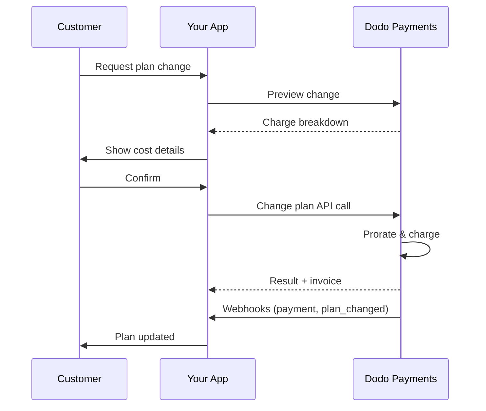

<CardGroup cols={3}>
<Card title="Change Plan API" icon="code" href="/api-reference/subscriptions/change-plan">
  Full API docs for updating subscriptions.
</Card>
<Card title="Plan Change Preview" icon="eye" href="/api-reference/subscriptions/preview-change-plan">
  See charge amounts before changing plans.
</Card>
<Card title="Integration Guide" icon="book" href="/developer-resources/subscription-integration-guide">
  Step-by-step subscription setup.
</Card>
</CardGroup>

## What is a subscription upgrade or downgrade?

Changing plans lets you move a customer between subscription tiers or quantities. Use it to:
- Align pricing with usage or features
- Move from monthly to annual (or vice versa)
- Adjust quantity for seat-based products

<Info>
Plan changes can trigger an immediate charge depending on the proration mode you choose.
</Info>

## When to use plan changes

- Upgrade when a customer needs more features, usage, or seats
- Downgrade when usage decreases
- Migrate users to a new product or price without cancelling their subscription

## Plan Change Flow

## Prerequisites

Before implementing subscription plan changes, ensure you have:

- A Dodo Payments merchant account with active subscription products
- API credentials (API key and webhook secret key) from the dashboard
- An existing active subscription to modify
- Webhook endpoint configured to handle subscription events

<Info>
For detailed setup instructions, see our [Integration Guide](/developer-resources/integration-guide#dashboard-setup).
</Info>

## Step-by-Step Implementation Guide

Follow this comprehensive guide to implement subscription plan changes in your application:

<Steps>
<Step title="Understand Plan Change Requirements">
Before implementing, determine:
- Which subscription products can be changed to which others
- What proration mode fits your business model
- How to handle failed plan changes gracefully
- Which webhook events to track for state management

<Tip>
Test plan changes thoroughly in test mode before implementing in production.
</Tip>
</Step>

<Step title="Choose Your Proration Strategy">
Select the billing approach that aligns with your business needs:

<Tabs>
<Tab title="prorated_immediately">
Best for: SaaS applications wanting to charge fairly for unused time
- Calculates exact prorated amount based on remaining cycle time
- Charges a prorated amount based on unused time remaining in the cycle
- Provides transparent billing to customers
</Tab>

<Tab title="difference_immediately">
Best for: Clear upgrade/downgrade scenarios
- Upgrade: Charge immediate difference (e.g., $30→$80 = charge $50)
- Downgrade: Credit remaining value for future renewals
- Simplifies billing logic and customer communication
</Tab>

<Tab title="full_immediately">
Best for: When you want to reset the billing cycle
- Charges full amount of new plan immediately
- Ignores remaining time from old plan
- Useful for annual to monthly transitions
</Tab>

<Tab title="do_not_bill">
Best for: Free migrations, courtesy switches, or absorbing cost differences
- No charges or credits calculated
- Customer moves to the new plan immediately without any billing adjustment
- Billing cycle remains unchanged
</Tab>
</Tabs>
</Step>

<Step title="Implement the Change Plan API">
Use the Change Plan API to modify subscription details:

<ParamField path="subscription_id" type="string" required>
The ID of the active subscription to modify.
</ParamField>

<ParamField path="product_id" type="string" required>
The new product ID to change the subscription to.
</ParamField>

<ParamField path="quantity" type="integer" default="1">
Number of units for the new plan (for seat-based products).
</ParamField>

<ParamField path="proration_billing_mode" type="string" required>
How to handle immediate billing: `prorated_immediately`, `full_immediately`, `difference_immediately`, or `do_not_bill`.
</ParamField>

<ParamField path="addons" type="array">
Optional addons for the new plan. Leaving this empty removes any existing addons.
</ParamField>

<ParamField path="on_payment_failure" type="string">
Controls behavior when the plan change payment fails:
- `prevent_change`: Keep subscription on current plan until payment succeeds
- `apply_change` (default): Apply plan change immediately regardless of payment outcome

If not specified, uses the business-level default setting.
</ParamField>

Optionaler Rabattcode zur Anwendung auf den neuen Plan. Wenn angegeben, wird der Rabatt validiert und auf die Planänderung angewendet. Wenn kein Code angegeben ist und das Abonnement bereits einen bestehenden Rabatt mit `preserve_on_plan_change=true` hat, wird der bestehende Rabatt beibehalten (falls für das neue Produkt anwendbar).

Wann die Planänderung angewendet werden soll:
- `immediately` (Standard): Die Planänderung sofort anwenden
- `next_billing_date`: Die Änderung für das nächste Abrechnungsdatum planen. Der Kunde behält seinen aktuellen Plan bis zum Ende des Abrechnungszeitraums.

Verwenden Sie `next_billing_date` für Downgrades, damit Kunden ihre aktuellen Planvorteile bis zum Ende des Abrechnungszeitraums behalten.

Richten Sie das Webhook-Handling ein, um Ergebnisse der Planänderung nachzuverfolgen:

- `subscription.active`: Planänderung erfolgreich, Abonnement aktualisiert
- `subscription.plan_changed`: Abonnementplan geändert (Upgrade/Downgrade/Add-On-Update)
- `subscription.on_hold`: Planänderungsgebühr fehlgeschlagen, Abonnement pausiert
- `payment.succeeded`: Sofortige Gebühr für Planänderung erfolgreich
- `payment.failed`: Sofortige Gebühr fehlgeschlagen

Überprüfen Sie immer die Webhook-Signaturen und implementieren Sie die idempotente Ereignisverarbeitung.

Basierend auf Webhook-Ereignissen, aktualisieren Sie Ihre Anwendung:
- Funktionen je nach neuem Plan gewähren/entziehen
- Kunden-Dashboard mit neuen Plan-Details aktualisieren
- Bestätigungs-E-Mails über Planänderungen senden
- Abrechnungsänderungen für Prüfzwecke protokollieren

Testen Sie Ihre Implementierung gründlich:
- Testen Sie alle Prorationsmodi mit unterschiedlichen Szenarien
- Überprüfen Sie, dass das Webhook-Handling korrekt funktioniert
- Überwachen Sie Erfolgsraten von Planänderungen
- Richten Sie Warnungen für fehlgeschlagene Planänderungen ein

Ihre Implementierung der Abonnement-Planänderung ist nun für den Produktionseinsatz bereit.

## Planänderungen Vorschau

Bevor Sie sich für eine Planänderung entscheiden, verwenden Sie die Preview-API, um Kunden genau zu zeigen, was Ihnen berechnet wird:

Verwenden Sie die Preview-API, um Bestätigungsdialoge zu erstellen, die Kunden den genauen Betrag anzeigen, der ihnen berechnet wird, bevor sie eine Planänderung bestätigen.

## Planänderungs-API

Verwenden Sie die Planänderungs-API, um Produkt, Menge und Prorationsverhalten für ein aktives Abonnement zu ändern.

### Schnellstart-Beispiele

Felder wie <code>invoice_id</code> und <code>payment_id</code> werden nur zurückgegeben, wenn eine sofortige Gebühr und/oder Rechnung während der Planänderung erstellt wird. Verlassen Sie sich immer auf Webhook-Ereignisse (z.B. <code>payment.succeeded</code>, <code>subscription.plan_changed</code>), um Ergebnisse zu bestätigen.

Wenn die sofortige Gebühr fehlschlägt, kann das Abonnement zu `subscription.on_hold` wechseln, bis die Zahlung erfolgreich ist.

## Verwaltung von Add-Ons

Wenn Sie Abonnementpläne ändern, können Sie auch Add-Ons ändern:

Add-Ons werden in die Prorationsberechnung einbezogen und entsprechend dem gewählten Prorationsmodus berechnet.

## Anwendung von Rabattcodes

Sie können einen Rabattcode anwenden, wenn Sie Abonnementpläne ändern. Dies ist nützlich, um Aktionspreise bei Upgrades oder Migrationen anzubieten.

### Rabattverhalten bei Planänderung

| Szenario | Verhalten |
|----------|----------|
| `discount_code` angegeben | Validiert und wendet den Rabatt auf den neuen Plan an. |
| Kein Code angegeben, bestehender Rabatt mit `preserve_on_plan_change=true` | Bestehender Rabatt wird automatisch beibehalten, wenn für das neue Produkt anwendbar. |
| Kein Code angegeben, kein erhaltbarer Rabatt | Kein Rabatt auf den neuen Plan angewendet. |

Verwenden Sie die [Preview Plan Change API](/api-reference/subscriptions/preview-change-plan) mit einer `discount_code`, um Kunden genau zu zeigen, wie viel sie sparen werden, bevor sie die Planänderung bestätigen.

## Prorationsmodi

Wählen Sie, wie Kunden bei Planänderungen abgerechnet werden sollen:

#### `prorated_immediately`
- Berechnet die Teil-Differenz im aktuellen Zyklus
- Bei Probe wird sofort abgerechnet und auf den neuen Plan umgestellt
- Downgrade: kann ein prorationiertes Guthaben erzeugen, das auf zukünftige Verlängerungen angewendet wird

#### `full_immediately`
- Berechnet sofort den vollen Betrag des neuen Plans
- Ignoriert die verbleibende Zeit vom alten Plan

Guthaben, die durch Downgrades mit <code>difference_immediately</code> erstellt werden, sind abonnement-spezifisch und unterscheiden sich von <a href="/features/credit-based-billing">Kreditbasierten Abrechnungsberechtigungen</a>. Sie werden automatisch auf zukünftige Verlängerungen desselben Abonnements angewendet und sind nicht zwischen Abonnements übertragbar.

#### `difference_immediately`
- Upgrade: sofort die Preis-Differenz zwischen altem und neuem Plan berechnen
- Downgrade: verbleibender Wert als internes Guthaben zum Abonnement hinzufügen und automatisch auf Verlängerungen anwenden

#### `do_not_bill`
- Keine Berechnungen für Gebühren oder Gutschriften
- Kunde wechselt sofort zum neuen Plan ohne Abrechnungsanpassung
- Abrechnungszyklus bleibt unverändert
- Am besten für Höflichkeitsmigrationen, kostenlose Planwechsel oder Kostenübernahme

| Funktion | `prorated_immediately` | `difference_immediately` | `full_immediately` | `do_not_bill` |
|---------|----------------------|------------------------|-------------------|--------------|
| **Upgrade-Gebühr** | Prorationierte Differenz für verbleibende Tage | Volle Preisdifferenz zwischen Plänen | Voller neuer Planpreis | Keine Gebühr |
| **Downgrade-Guthaben** | Prorationiertes Guthaben für verbleibende Tage | Volle Preisdifferenz als Guthaben | Kein Guthaben | Kein Guthaben |
| **Abrechnungszyklus** | Unverändert | Unverändert | Setzt sich auf heute zurück | Unverändert |
| **Verhalten bei Proben** | Endet Probe, berechnet sofort | Endet Probe, berechnet sofort | Endet Probe, berechnet vollen Betrag | Endet Probe, keine Gebühr |
| **Am besten für** | Faire zeitbasierte Abrechnung | Einfache Upgrade/Downgrade-Mathematik | Rücksetzung von Abrechnungszyklen | Kostenlose Migrationen oder Höflichkeitswechsel |
| **Komplexität** | Mittel (Tageberechnung) | Niedrig (einfache Subtraktion) | Niedrig (volle Gebühr) | Keine |

### Beispiel-Szenarien

Verwenden Sie diese kanonischen Nummern konsequent:
- Aktueller Plan: **Basic** bei **30 €/Monat**
- Upgradeziel: **Pro** bei **80 €/Monat**
- Downgradeziel (von Pro): **Starter** bei **20 €/Monat**
- Abrechnungszyklus: **30 Tage**, begonnen am **1. Januar**
- Planänderung erfolgt am **16. Januar** (15 Tage verbleibend, 15 Tage genutzt)

Wählen Sie `prorated_immediately` für eine faire Zeitabrechnung; wählen Sie `full_immediately`, um die Abrechnung neu zu starten; verwenden Sie `difference_immediately` für einfache Upgrades und automatische Gutschrift bei Downgrades; oder verwenden Sie `do_not_bill`, um Pläne ohne Abrechnungsanpassung zu wechseln.

## Umgang mit Zahlungsfehlern

Kontrollieren Sie, was passiert, wenn eine Planänderung-Zahlung mit dem `on_payment_failure`-Parameter fehlschlägt.

### Zahlungsfehler-Modi

**Verhalten**: Halten Sie das Abonnement auf seinem aktuellen Plan, bis die Zahlung erfolgreich ist.

- Planänderung wird als "ausstehend" markiert
- Kunde behält Zugang zu seinem aktuellen Plan
- Abonnement wechselt erst nach erfolgreicher Zahlung in den `active`-Zustand
- Nützlich, wenn Sie sicherstellen möchten, dass die Zahlung vor der Gewährung von Upgrade-Funktionen erfolgt

**Verhalten**: Planänderung sofort anwenden, unabhängig vom Zahlungsergebnis.

- Planänderung wird auch bei Zahlungsfehler angewendet
- Kunde erhält sofortigen Zugang zum neuen Plan
- Das Abonnement kann bei Zahlungsfehler in den `on_hold`-Zustand wechseln
- Gut für unkritische Upgrades oder wenn Sie dem Kunden vertrauen

Wenn nicht angegeben, verwendet der `on_payment_failure`-Parameter die auf Geschäftsebene festgelegte Standardeinstellung, die im Dashboard konfiguriert ist.

### Wann welcher Modus verwendet werden sollte

| Szenario | Empfohlener Modus | Grund |
|----------|------------------|--------|
| Upgrade auf Premium-Funktionen | `prevent_change` | Sicherstellen der Zahlung vor Gewährung von Zugang |
| Mengenvergrößerung (mehr Sitze) | `prevent_change` | Vermeiden von Nutzung ohne Zahlung |
| Downgrading von Plänen | `apply_change` | Kunde reduziert Ausgaben |
| Vertrauenswürdige Unternehmenskunden | `apply_change` | Geringeres Risiko von Nichtzahlung |
| Konvertierung von Probe zu Bezahlung | `prevent_change` | Kritischer Zahlungszeitpunkt |

## Umgang mit Webhooks

Verfolgen Sie den Abonnementzustand durch Webhooks, um Planänderungen und Zahlungen zu bestätigen.

### Ereignistypen, die gehandhabt werden sollen
- `subscription.active`: Abonnement aktiviert
- `subscription.plan_changed`: Abonnementplan geändert (Upgrade/Downgrade/Add-On-Änderungen)
- `subscription.on_hold`: Gebühr fehlgeschlagen, Abonnement pausiert
- `subscription.renewed`: Verlängerung erfolgreich
- `payment.succeeded`: Zahlung für Planänderung oder Verlängerung erfolgreich
- `payment.failed`: Zahlung fehlgeschlagen

Wir empfehlen, Geschäftslogik aus Abonnement-Ereignissen zu steuern und Zahlungsevents für Bestätigung und Abstimmung zu verwenden.

### Signaturen überprüfen und Absichten handhaben

Für detaillierte Payload-Schemata siehe die <a href="/developer-resources/webhooks/intents/subscription">Abonnement-Webhook-Payloads</a> und <a href="/developer-resources/webhooks/intents/payment">Zahlungs-Webhook-Payloads</a>.

## Best Practices

Befolgen Sie diese Empfehlungen für zuverlässige Abonnementplanänderungen:

### Planänderungsstrategie
- **Gründlich testen**: Testen Sie Planänderungen immer im Testmodus, bevor sie in Produktion gehen
- **Prorierung sorgfältig auswählen**: Wählen Sie den Prorierungsmodus, der zu Ihrem Geschäftsmodell passt
- **Fehler ordentlich behandeln**: Implementieren Sie eine ordnungsgemäße Fehlerbehandlung und Wiederholungslogik
- **Erfolgsraten überwachen**: Verfolgen Sie Erfolg/Misserfolgsraten von Planänderungen und untersuchen Sie Probleme

### Webhook-Implementierung
- **Signaturen überprüfen**: Validieren Sie immer Webhook-Signaturen, um Authentizität sicherzustellen
- **Idempotenz implementieren**: Handhaben Sie doppelte Webhook-Ereignisse ordentlich
- **Asynchron verarbeiten**: Blockieren Sie nicht Webhook-Antworten mit schweren Operationen
- **Alles protokollieren**: Führen Sie detaillierte Protokolle zur Fehlerbehebung und für Prüfungszwecke

### Benutzererfahrung
- **Klar kommunizieren**: Informieren Sie Kunden über Abrechnungsänderungen und Zeitpläne
- **Bestätigungen bereitstellen**: Senden Sie E-Mail-Bestätigungen für erfolgreiche Planänderungen
- **Randfälle handhaben**: Berücksichtigen Sie Probezeiten, Prorationen und fehlgeschlagene Zahlungen
- **UI sofort aktualisieren**: Spiegeln Sie Planänderungen in Ihrer Anwendungsoberfläche wider

## Häufige Probleme und Lösungen

Lösen Sie typische Probleme, die bei Abonnementplanänderungen auftreten:

**Symptome**: API-Aufruf erfolgreich, aber das Abonnement bleibt auf dem alten Plan

**Häufige Ursachen**:
- Webhook-Verarbeitung fehlgeschlagen oder verzögert
- Anwendungszustand nicht nach Erhalt von Webhooks aktualisiert
- Datenbanktransaktionsprobleme bei der Zustandsaktualisierung

**Lösungen**:
- Implementieren Sie eine robuste Webhook-Verarbeitung mit Wiederholungslogik
- Verwenden Sie idempotente Operationen für Zustandsaktualisierungen
- Fügen Sie eine Überwachung hinzu, um verpasste Webhook-Ereignisse zu erkennen
- Überprüfen Sie, dass der Webhook-Endpunkt zugänglich ist und korrekt antwortet

**Symptome**: Kunde downgrades, sieht aber kein Guthaben

**Häufige Ursachen**:
- Prorationsmoduserwartungen: Downgrades gutschreiben die volle Planpreisdifferenz mit `difference_immediately`, während `prorated_immediately` ein prorationiertes Guthaben basierend auf der verbleibenden Zeit im Zyklus erzeugt
- Guthaben sind abonnement-spezifisch und werden nicht zwischen Abonnements übertragen
- Guthaben nicht sichtbar im Kunden-Dashboard

**Lösungen**:
- Verwenden Sie `difference_immediately` für Downgrades, wenn Sie automatische Gutschriften möchten
- Erklären Sie den Kunden, dass Guthaben auf zukünftige Verlängerungen desselben Abonnements angewendet werden
- Implementieren Sie ein Kunden-Portal, um Guthaben anzuzeigen
- Überprüfen Sie die Vorschau der nächsten Rechnung, um angewendete Guthaben zu sehen

**Symptome**: Webhook-Ereignisse abgelehnt aufgrund ungültiger Signatur

**Häufige Ursachen**:
- Falscher Webhook-Secret Key
- Unveränderter Raw-Request-Body vor Signaturüberprüfung
- Falscher Signaturüberprüfungsalgorithmus

**Lösungen**:
- Vergewissern Sie sich, dass Sie den richtigen `DODO_WEBHOOK_SECRET` aus dem Dashboard verwenden
- Lesen Sie den Raw-Request-Body vor jeder JSON-Parsing-Middleware
- Verwenden Sie die Standard-Webhook-Verifizierung für Ihre Plattform
- Testen Sie die Webhook-Signaturüberprüfung in der Entwicklungsumgebung

**Symptome**: API gibt 422 Unprocessable Entity-Fehler zurück

**Häufige Ursachen**:
- Ungültige Abonnement-ID oder Produkt-ID
- Abonnement nicht im aktiven Zustand
- Fehlende erforderliche Parameter
- Produkt nicht verfügbar für Planänderungen

**Lösungen**:
- Überprüfen Sie, ob das Abonnement existiert und aktiv ist
- Stellen Sie sicher, dass die Produkt-ID gültig und verfügbar ist
- Vergewissern Sie sich, dass alle erforderlichen Parameter angegeben sind
- Überprüfen Sie die API-Dokumentation auf Parameteranforderungen

**Symptome**: Planänderung initiiert, aber sofortige Gebühr fehlschlägt

**Häufige Ursachen**:
- Unzureichende Mittel auf der Zahlungsmethode des Kunden
- Zahlungsmethode abgelaufen oder ungültig
- Bank lehnte die Transaktion ab
- Betrugserkennung blockierte die Gebühr

**Lösungen**:
- Handhaben Sie `payment.failed` Webhook-Ereignisse angemessen
- Benachrichtigen Sie den Kunden, um die Zahlungsmethode zu aktualisieren
- Implementieren Sie eine Wiederholungslogik für vorübergehende Fehler
- Erwägen Sie, Planänderungen mit fehlgeschlagenen sofortigen Gebühren zuzulassen

**Symptome**: Planänderungsgebühr schlägt fehl und das Abonnement wechselt in den `on_hold`-Zustand

**Was passiert**:
Wenn eine Planänderungsgebühr fehlschlägt, wird das Abonnement automatisch in den `on_hold`-Zustand versetzt. Das Abonnement wird erst erneuert, wenn die Zahlungsmethode aktualisiert wird.

**Lösung**: Zahlungsmethode aktualisieren, um das Abonnement wieder zu aktivieren

So reaktivieren Sie ein Abonnement aus dem `on_hold`-Zustand nach einer fehlgeschlagenen Planänderung:

1. **Aktualisieren Sie die Zahlungsmethode** mit der Update Payment Method API
2. **Automatische Gebührenerstellung**: Die API erstellt automatisch eine Gebühr für ausstehende Beträge
3. **Rechnungserstellung**: Eine Rechnung wird für die Gebühr erstellt
4. **Zahlungsabwicklung**: Die Zahlung wird mit der neuen Zahlungsmethode verarbeitet
5. **Reaktivierung**: Bei erfolgreicher Zahlung wird das Abonnement in den `active`-Zustand reaktiviert

**Zu überwachende Webhook-Ereignisse**:
- `subscription.on_hold`: Abonnement auf Eis gelegt (erhalten, wenn Planänderungsgebühr fehlschlägt)
- `payment.succeeded`: Zahlung für ausstehende Beträge erfolgreich (nach Aktualisierung der Zahlungsmethode)
- `subscription.active`: Abonnement nach erfolgreicher Zahlung reaktiviert

**Best Practices**:
- Benachrichtigen Sie die Kunden sofort, wenn eine Planänderungsgebühr fehlschlägt
- Geben Sie klare Anweisungen, wie sie ihre Zahlungsmethode aktualisieren können
- Überwachen Sie Webhook-Ereignisse, um den Reaktivierungsstatus zu verfolgen
- Erwägen Sie die Implementierung automatischer Wiederholungslogik für vorübergehende Zahlungsfehler

Sehen Sie die komplette API-Dokumentation für die Aktualisierung von Zahlungsmethoden und die Reaktivierung von Abonnements.

## Testen Ihrer Implementierung

Folgen Sie diesen Schritten, um Ihre Implementierung von Abonnementplanänderungen gründlich zu testen:

- Verwenden Sie Test-API-Schlüssel und Testprodukte
- Erstellen Sie Testabonnements mit verschiedenen Plantypen
- Konfigurieren Sie den Test-Webhook-Endpunkt
- Richten Sie Überwachung und Protokollierung ein

- Testen Sie `prorated_immediately` mit verschiedenen Abrechnungszyklus-Positionen
- Testen Sie `difference_immediately` für Upgrades und Downgrades
- Testen Sie `full_immediately`, um Abrechnungszyklen zurückzusetzen
- Testen Sie `do_not_bill` für keinen Gebühren/keinen Gutschriftn-Planwechsel
- Überprüfen Sie, dass Guthaben richtig berechnet werden

- Vergewissern Sie sich, dass alle relevanten Webhook-Ereignisse empfangen werden
- Testen Sie die Webhook-Signaturverifizierung
- Handhaben Sie doppelte Webhook-Ereignisse ordentlich
- Testen Sie Webhook-Verarbeitungsausfall-Szenarien

- Testen Sie mit ungültigen Abonnement-IDs
- Testen Sie mit abgelaufenen Zahlungsmethoden
- Testen Sie Netzwerkfehler und Zeitüberschreitungen
- Testen Sie mit unzureichenden Mitteln

- Richten Sie Warnungen für fehlgeschlagene Planänderungen ein
- Überwachen Sie Webhook-Verarbeitungszeiten
- Verfolgen Sie Erfolgsraten von Planänderungen
- Überprüfen Sie Kunden-Support-Tickets für Planänderungsprobleme

## Fehlerbehandlung

Behandeln Sie häufige API-Fehler in Ihrer Implementierung ordentlich:

### HTTP-Statuscodes

Anfrage zur Planänderung erfolgreich verarbeitet. Das Abonnement wird aktualisiert und die Zahlung wird verarbeitet.

Ungültige Anfrageparameter. Überprüfen Sie, dass alle erforderlichen Felder bereitgestellt und richtig formatiert sind.

Ungültiger oder fehlender API-Schlüssel. Überprüfen Sie, dass Ihr `DODO_PAYMENTS_API_KEY` korrekt ist und die richtigen Berechtigungen hat.

Abonnement-ID nicht gefunden oder gehört nicht zu Ihrem Konto.

Das Abonnement kann nicht geändert werden (z.B. bereits gekündigt, Produkt nicht verfügbar, etc.).

Ein Serverfehler ist aufgetreten. Versuchen Sie die Anfrage nach einer kurzen Verzögerung erneut.

### Fehlerantwortformat

## Nächste Schritte

- Überprüfen Sie die <a href="/api-reference/subscriptions/change-plan">Planänderungs-API</a>
- Erkunden Sie <a href="/features/credit-based-billing">Kreditbasierte Abrechnung</a>
- Implementieren Sie Warnungen für `subscription.on_hold`
- Schauen Sie sich unseren <a href="/developer-resources/webhooks">Webhook-Integrationsleitfaden</a> an
