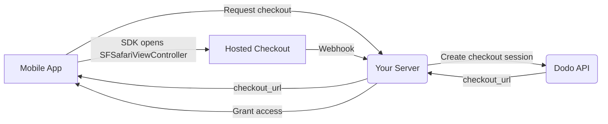

## Einführung

Dodo Payments ermöglicht Entwicklern den Verkauf digitaler Waren und Dienstleistungen in iOS-Apps und kümmert sich um komplexe Aspekte wie Steuerkonformität, Währungsumrechnung und Auszahlungen. Dieser umfassende Leitfaden beschreibt, wie Sie Dodo Payments in Ihre iOS-App integrieren, insbesondere für SaaS-Tools, Inhaltsabonnements und digitale Dienstleistungen.

## Übersicht

Dodo Payments fungiert als Ihr **Merchant of Record (MoR)** und verwaltet kritische Aspekte Ihres digitalen Geschäfts:

<Tabs>
<Tab title="What We Handle">
- Steuererhebung und -abführung (MwSt, GST und andere regionale Steuern)
- Globale Zahlungen gemäß Richtlinien und lokalen Zahlungsmethoden
- Währungsumrechnung und Devisen
- Rückbelastungen und Betrugsprävention
- Rechnungsstellung und Belege für Endkunden
- Einhaltung regionaler Vorschriften
</Tab>

<Tab title="What You Get">
- Eine einheitliche API für Web- und Mobilplattformen
- Unterstützung für In-App-Checkouts (UPI, Karten, Wallets, BNPL)
- Globale Auszahlungsunterstützung (Payoneer, Wise, lokale Banküberweisungen)
- Analyse- und Reporting-Dashboard
- Sichere Zahlungsabwicklung
</Tab>
</Tabs>

## Anwendungsfälle

<CardGroup cols={2}>
<Card title="Subscriptions" icon="repeat">
- Premium-Inhalte oder Funktionszugriff
- Wiederkehrende Abrechnung mit flexiblen Optionen, kostenlose Testzeiträume, anteilige Abrechnung oder Upgrades und Downgrades
</Card>

<Card title="Courses and Learning" icon="graduation-cap">
- Zugriff pro Kurs
- Bündelpakete für Inhalte
- Lebenslange oder erneuerbare Lizenzen
- Integration der Fortschrittsverfolgung
</Card>

<Card title="Digital Downloads" icon="download">
- Einmalkäufe (PDFs, Musik, Tools)
- Lieferung digitaler Assets
- Verwaltung von Lizenzschlüsseln
</Card>

<Card title="SaaS Tools" icon="screwdriver-wrench">
- Software-as-a-Service-Abonnements
- Nutzungsbasierte Abrechnung
- Team- und Enterprise-Pläne
</Card>
</CardGroup>

## Integrationsablauf

Deine App öffnet Dodos gehosteten Checkout mit dem
[iOS checkout SDK](/developer-resources/sdks/ios), das ihn in
`SFSafariViewController` anzeigt und ein typisiertes Ergebnis zurückgibt.

<Warning>
Verwende das SDK, anstatt den Checkout in einem `WebView` einzubetten. Apple Pay ist nur
in einer echten Browser-Oberfläche verfügbar. Daher entgehen dir durch ein `WebView` unbemerkt Wallet-
Conversions – und Zahlungsabläufe innerhalb eines `WebView` sind ein häufiger Grund für
Ablehnungen bei der App-Store-Prüfung.
</Warning>

### Integrationsschritte

<Steps>
<Step title="Mobile App to Your Server">
Deine App fordert bei deinem eigenen Backend eine Checkout-URL an, authentifiziert mit dem
Sitzungstoken des angemeldeten Benutzers.
</Step>

<Step title="Your Server to Dodo API">
Dein Backend erstellt eine [checkout session](/developer-resources/checkout-session)
mit deinem API key und gibt den `checkout_url` an die App zurück.

<Warning>
Erstelle Checkout-Sitzungen auf deinem Server, niemals in der App. Ein API key, der
innerhalb eines App-Binaries ausgeliefert wird, kann aus dem Bundle extrahiert werden.
</Warning>
</Step>

<Step title="Mobile App Opens Checkout">
Übergib `checkout_url` an `DodoCheckout.start(...)`. Das SDK zeigt ihn in
`SFSafariViewController` an und löst ein typisiertes Ergebnis auf, sobald der Kunde
den Checkout abschließt oder schließt.
</Step>

<Step title="Dodo Payments to Your Server">
Dodo Payments ruft deinen Webhook-Endpunkt auf, wenn die Zahlung erfolgreich ist oder das
Abonnement aktiviert wird.
</Step>

<Step title="Your Server Grants Access">
Schalte die gekauften Inhalte über diesen Webhook frei, nicht über das Ergebnis, das die App
erhalten hat. Das SDK-Ergebnis ist ein UI-Hinweis, kein Zahlungsnachweis.
</Step>
</Steps>

<CardGroup cols={2}>
<Card title="iOS Checkout SDK" icon="apple" href="/developer-resources/sdks/ios">
  Installationsschritte und die vollständige `start(...)`-Spezifikation für Swift.
</Card>
<Card title="Mobile Integration Guide" icon="mobile" href="/developer-resources/mobile-integration">
  Der End-to-End-Ablauf sowie dieselbe Spezifikation für Android, React Native und Flutter.
</Card>
</CardGroup>

## Regionale Verfügbarkeit

Dodo Payments ermöglicht alternative In-App-Kaufabläufe nur in App-Store-Regionen, in denen Apple externe Zahlungen ausdrücklich erlaubt oder eine Regulierungsbehörde beziehungsweise ein Gericht dies anordnet.

### Unterstützte Regionen

<AccordionGroup>
<Accordion title="United States">
Unterstützt, soweit dies nach den aktuellen Gerichtsanordnungen und den aktualisierten Richtlinien von Apple zulässig ist.

- Verfügbar im Rahmen bestimmter gerichtlicher Anordnungen
- Abhängig von Apples Einhaltung gesetzlicher Anforderungen
- Muss Apples Implementierungsrichtlinien befolgen
</Accordion>

<Accordion title="European Union (EU) App Store">
Unterstützt über Apples EU Alternative Terms und External Purchase Entitlement.

- Über Apples EU Alternative Terms aktiviert
- Erfordert die Genehmigung des External Purchase Entitlement
- Muss den Anforderungen des Gesetzes über digitale Märkte der EU entsprechen
</Accordion>

<Accordion title="South Korea">
Unterstützt über das StoreKit External Purchase Entitlement für ausschließlich für Korea bestimmte Binaries.

- Über das StoreKit External Purchase Entitlement verfügbar
- Erfordert ein Korea-spezifisches App-Binary
- Muss dem koreanischen Telekommunikationsrecht entsprechen
</Accordion>
</AccordionGroup>

<Warning>
Prüfe und befolge stets die regionsspezifischen Entitlements von Apple und die Anforderungen von App Store Connect, bevor du Dodo Payments für einen Storefront aktivierst. Die Verwendung alternativer Zahlungsabläufe in nicht unterstützten Regionen kann zur Ablehnung oder Entfernung der App führen.
</Warning>

<Note>
Für einige Geschäftsmodelle – beispielsweise Dienstleistungen oder bestimmte Inhaltskategorien – verlangt Apple möglicherweise überhaupt nicht die Verwendung von In-App Purchase (IAP). Dodo Payments unterstützt auch diese Modelle. Prüfe stets die Einstufung deiner App und die aktuellen Richtlinien von Apple, um festzustellen, ob IAP für deinen Anwendungsfall verpflichtend ist.
</Note>

### Mehr erfahren

Eine ausführliche Übersicht über globale Richtlinien, rechtliche Präzedenzfälle und strategische Ansätze zur Umgehung von App-Store-Gebühren findest du in unserem umfassenden Leitfaden:

<Card title="Bypassing App Store & Play Store Fees: A Strategic and Legal Playbook" icon="shield-check" href="/features/bypassing-app-store-fees">
Erfahre, wo und wie du alternative Zahlungsabläufe rechtmäßig implementieren kannst – mit aktuellen regionalen Hinweisen und Tipps zur Compliance.
</Card>