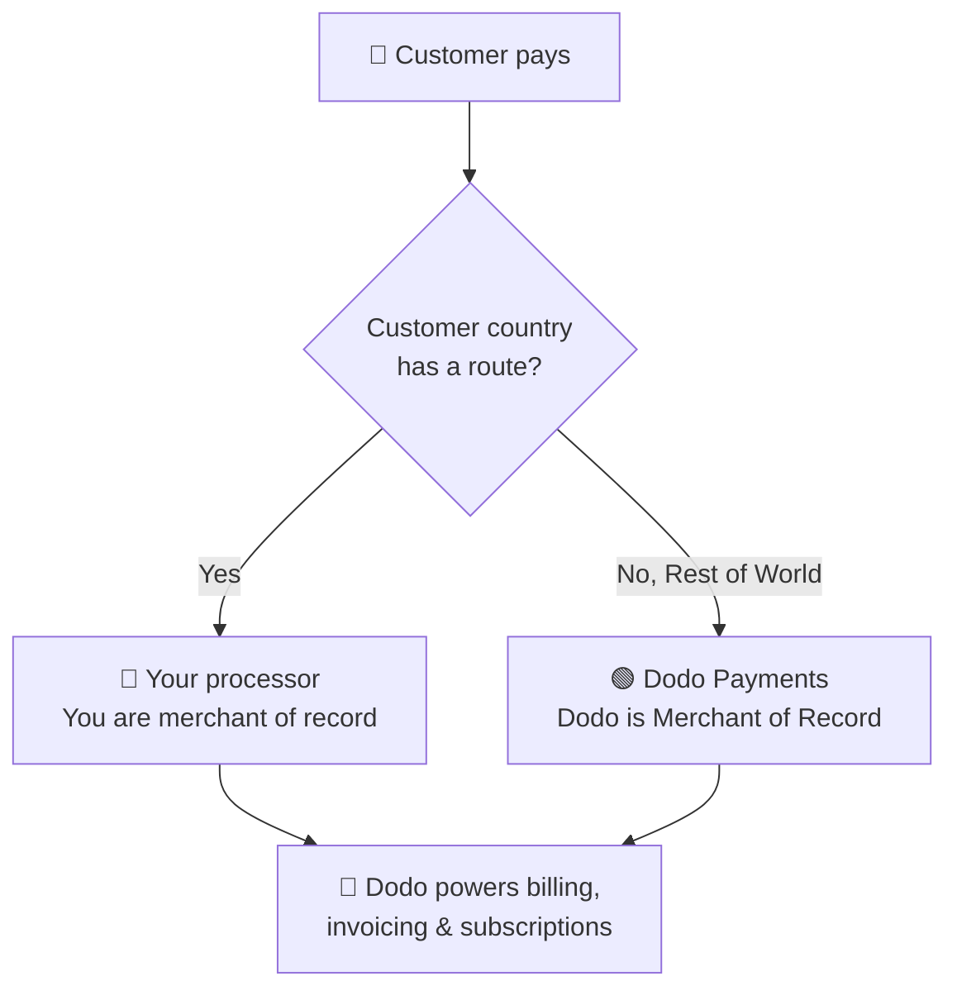

**Bring Your Own Processor (BYOP)** ermöglicht es Ihnen, Ihren eigenen Zahlungsprozessor zu verbinden — derzeit **Stripe** oder **Adyen**, mit Unterstützung für weitere Prozessoren in Kürze — und Dodo Payments weiterhin für alles zu nutzen, was über die Transaktion hinausgeht: Produkte, Abonnements, Lizenzschlüssel und den Berechtigungsmechanismus, Rechnungsstellung, das Kundenportal und Analysen.

Sie entscheiden pro Kundenland, ob eine Zahlung von **Ihrem Prozessor** (Sie bleiben der Händler des Datensatzes für diese Route) oder von **Dodo Payments** als Ihr Full-Service-Händler des Datensatzes verarbeitet wird. Länder, die Sie nicht ausdrücklich routen, fallen automatisch auf Dodo zurück.

<CardGroup cols={2}>
<Card title="Route by geography" icon="globe">
Senden Sie Zahlungen aus bestimmten Ländern an Ihren eigenen Prozessor und alles andere an Dodo.
</Card>

<Card title="Keep your processor accounts" icon="plug">
Verwenden Sie weiterhin Ihre bestehenden Stripe- oder Adyen-Konten und -Beziehungen.
</Card>

<Card title="Stay the merchant of record" icon="building">
Auf Ihren eigenen Routen bleiben Sie der rechtliche Verkäufer und kontrollieren Steuern, Streitigkeiten und Auszahlungen.
</Card>

<Card title="One billing layer" icon="layer-group">
Dodo unterstützt Produkte, Abonnements, Rechnungen und Analysen auf beiden Routen.
</Card>
</CardGroup>

## BYOP vs. Dodo als Händler des Datensatzes

Wenn Sie BYOP aktivieren, entscheiden Sie, wie jede Zahlung abgewickelt wird. Die beiden Modelle können nebeneinander laufen, geroutet nach Kundenland.

| Funktion | Dodo als Händler des Datensatzes | Bring Your Own Processor |
|---------|----------------------------|--------------------------|
| Rechtlicher Verkäufer des Datensatzes | Dodo Payments | Ihr Unternehmen |
| Steuer (MwSt, GST & Umsatzsteuer) | Für Sie berechnet, eingezogen & abgeführt | Sie registrieren, erheben & machen Steueranmeldungen |
| Chargebacks & Betrug | Haftung & Schutz von Dodo gehandhabt | Sie verwalten mit den eigenen Tools Ihres Prozessors |
| PCI-Konformität | Von Dodo gehandhabt | Sie verwalten |
| Zahlungsmethoden | 30+ global & lokal, mehrere Währungen | Nur Karten (Kredit/Debit) |
| Auszahlungen | Aggregierte globale Auszahlungen | Direkt von Ihrem Prozessor |
| Einrichtung | Einfach, in Minuten live gehen | Mittel, Schlüssel hinzufügen & Routing |
| Am besten geeignet für | Weltweiter Verkauf, Hands-Off-Compliance | Bestehender Prozessor & regionale Kontrolle |

<Tip>
Ein gängiges Setup ist **hybrid**: Routen Sie ein Land, in dem Sie bereits eine registrierte Einheit und einen Prozessor haben (zum Beispiel Ihren Heimatmarkt), zu Ihrem eigenen Prozessor und lassen Sie Dodo den Rest der Welt als Händler des Datensatzes verwalten.
</Tip>

## Unterstützte Prozessoren

Heute können Sie **Stripe** oder **Adyen** verbinden. Unterstützung für weitere Prozessoren ist unterwegs.

<CardGroup cols={2}>
<Card title="Stripe" icon="stripe" />
<Card title="Adyen" icon="/images/logos/adyen.svg" />
</CardGroup>

<Note>
Zahlungen, die über Ihren eigenen Prozessor geleitet werden, unterstützen derzeit **nur Kredit- und Debitkarten**. Wir fügen bald weitere Zahlungsmethoden hinzu.
</Note>

<Warning>
Sowohl **Stripe** als auch **Adyen** erfordern, dass **roher Karten-API-Zugriff** in Ihrem Konto aktiviert ist, damit Dodo die Abrechnung über Ihren Prozessor durchführen kann. Jeder Prozessor gewährt dies auf Anfrage – Sie arrangieren dies, indem Sie den Support des Prozessors kontaktieren, bevor Sie eine Verbindung herstellen. Siehe die [Stripe](/features/byop/stripe) und [Adyen](/features/byop/adyen) Anleitungen für Details.
</Warning>

<Info>
Verbindungen werden **pro Umgebung** konfiguriert. Der Prozessor, den Sie im **Testmodus** (Sandbox) verbinden, ist getrennt von dem im **Live-Modus** (Produktion); richten Sie beide ein, wenn Sie vor dem Livegang testen möchten. Der Setup-Assistent folgt dem globalen Test-/Livemodus-Umschalter Ihres Dashboards.
</Info>

## BYOP einrichten

Öffnen Sie **Einstellungen → BYOP** im Dashboard und wählen Sie **Konfigurieren** auf der *Bring Your Own Processor* Karte, um den Setup-Assistenten zu starten.

<Frame>

</Frame>

<Steps>
<Step title="Choose a payment processor">
Wählen Sie den Prozessor, den Sie verbinden möchten, **Stripe** oder **Adyen**, und fahren Sie fort.

<Frame>

</Frame>
</Step>

<Step title="Connect your account">
Geben Sie der Verbindung einen **Anbieternamen** (nützlich, wenn Sie mehrere Konten von demselben Prozessor haben, z. B. *Stripe US* und *Stripe UK*), dann geben Sie den **Secret Key** Ihres Prozessors ein (für Stripe, Ihr `sk_...` Schlüssel).

Für **Adyen** geben Sie auch Ihre **Merchant Account** Kennung ein.

<Frame>

</Frame>

Das Speichern erstellt die Verbindung und erzeugt einen **Webhook-Endpunkt**, der einzigartig dazu ist. Fügen Sie diese URL als Webhook-Ziel im Dashboard Ihres Prozessors hinzu, und fügen Sie dann das **Webhook-Unterschriftengeheimnis** in Dodo ein, um abzuschließen:

- **Stripe**: Fügen Sie das Unterschriftengeheimnis vom hinzugefügten Webhook-Endpunkt ein.
- **Adyen**: Fügen Sie den **HMAC-Schlüssel** von *Kundenbereich → Webhooks* ein.

<Note>
Ihr Geheimschlüssel wird sicher gespeichert und kann nach dem Speichern nicht angezeigt oder geändert werden. Sie konfigurieren nur die von Dodo generierte Webhook-URL in Ihrem Prozessor; Sie interagieren nie direkt mit der zugrunde liegenden Infrastruktur.
</Note>

<Tip>
Verwenden Sie **Verbindung überprüfen** nach dem Speichern, um einen Testaufruf gegen Ihren Prozessor durchzuführen und zu bestätigen, dass die Schlüssel und das Webhook-Geheimnis gültig sind, bevor Sie live gehen.
</Tip>
</Step>

<Step title="Configure payment routing">
Fügen Sie **Routing-Regeln** hinzu, die Kundennationen einem Prozessor zuordnen. Jedes Land kann genau einem Prozessor zugeordnet werden.

- **Ihr Prozessor** bearbeitet Zahlungen aus den Ländern, die Sie ihm zuweisen.
- **Dodo Payments** bearbeitet **den Rest der Welt** (jedes Land, das Sie nicht explizit routen) als Händler des Datensatzes.

<Frame>

</Frame>

Verwenden Sie **Route hinzufügen**, um einem Prozessor ein oder mehrere Länder zuzuweisen.

<Frame>

</Frame>

<Info>
**Richtlinien für Routing**
- "Rest der Welt" umfasst alle oben nicht aufgeführten Länder.
- Dodo Payments MoR-Routen handeln automatisch Compliance und Steuern.
- Ihre eigenen Prozessor-Routen erfordern eine separate Steuereinrichtung, falls benötigt.
</Info>
</Step>

<Step title="Configure invoice information">
Für Zahlungen, die über Ihren eigenen Prozessor geleitet werden, **sind Sie** der Verkäufer auf der Rechnung. Geben Sie die Geschäftsinformationen ein, die auf diesen Rechnungen erscheinen sollen:

- **Registrierter Geschäftsname** (erforderlich)
- **Steuer-ID** (EIN, SSN, etc.; optional, mit Formatvalidierung für US-EINs verfügbar)
- **Statement Descriptor** (erforderlich): was Kunden auf ihrem Kontoauszug sehen (5 bis 22 Zeichen)
- **Registrierte Geschäftsadresse** (erforderlich): beginnen Sie mit der Eingabe, um Ihre Adresse zu suchen und automatisch auszufüllen
- **Datenschutzerklärung** und **Nutzungsbedingungen** Links (erforderlich)

Eine Live-**Rechnungskopf-Vorschau** zeigt, wie die Details erscheinen. Diese Details gelten **nur** für Rechnungen für Routen, die Sie über Ihren eigenen Prozessor abwickeln; Dodo-geroutete Zahlungen verwenden weiterhin die Händler des Datensatzes Details von Dodo.

<Frame>

</Frame>
</Step>

<Step title="Review and finish">
Überprüfen Sie Ihre Prozessorverbindung, die Routing-Regeln und die Rechnungsdetails. Bestätigen Sie, dass die Routing- und Rechnungsdetails korrekt sind, und wählen Sie **Setup abschließen**.

<Frame>

</Frame>
</Step>
</Steps>

Nach der Konfiguration zeigt die BYOP-Karte **Konfiguration bearbeiten**, und Sie können jederzeit mit **Routing-Regeln bearbeiten** zu MoR-only zurückkehren.

<Frame>

</Frame>

## Wie Routing funktioniert

Das Routing wird durch das **Land des Kunden** zum Zahlungszeitpunkt bestimmt. Die gleiche Logik gilt für einmalige Zahlungen, Checkout-Sessions und Abonnement-Anmeldungen. Erneuerungen verwenden den Prozessor, auf dem das Abonnement erstellt wurde (siehe [Abonnements](#subscriptions)).

Auf einer Route, die von **Ihrem Prozessor** gehandhabt wird:

- Die Zahlung wird auf dem **Konto Ihres** Prozessors in der Abrechnungswährung verarbeitet.
- **Keine Steuer wird von Dodo berechnet oder eingezogen**; Sie bleiben für die Steuer auf dieser Route verantwortlich.
- Rechnungen verwenden die von Ihnen konfigurierten **Geschäftsdaten und Statement-Beschreiber**, ohne Verweise auf den Händler des Datensatzes.
- Auszahlungen erfolgen **direkt an Sie** von Ihrem Prozessor; nichts fließt durch die Geldbörse von Dodo.

Auf einer Route, die von **Dodo** (Rest der Welt) gehandhabt wird, verhält sich Dodo genau wie Ihr Full-Service-Händler des Datensatzes, der Steuern, Compliance, Streitigkeiten, Betrug und aggregierte Auszahlungen handhabt.

## Abonnements

Abonnements verbleiben auf dem Prozessor, auf dem sie erstellt wurden. Bei Erneuerung belastet Dodo denselben Zahlungsprozessor, der zum Kauf des Abonnements verwendet wurde, und verwendet das Zahlungsmandat, das dagegen gespeichert ist. Die Routing-Regeln werden bei jeder Erneuerung nicht neu bewertet.

## Sehen, welcher Prozessor eine Zahlung abgewickelt hat

Sobald BYOP konfiguriert ist, zeigen die **Zahlungen** und **Streitigkeiten** Tabellen ein Prozessor-Symbol (Stripe, Adyen oder Dodo) neben jeder Zeile, und die Detailseiten von Zahlungen und Streitigkeiten enthalten ein **Zahlungsprozessor**-Feld, damit Sie immer erkennen können, welche Route eine bestimmte Transaktion bearbeitet hat.

## Rückerstattungen, Streitigkeiten & Auszahlungen

<Tabs>
<Tab title="Refunds">
Sie starten Rückerstattungen wie gewohnt im Dodo-Dashboard. Für Zahlungen, die über Ihren eigenen Prozessor geroutet werden, wird die Rückerstattung auf diesem Prozessor ausgeführt; für Dodo-geroutete Zahlungen bearbeitet Dodo die Rückerstattung.
</Tab>

<Tab title="Disputes">
Das Dodo-Dashboard zeigt Streitigkeiten nur für **von Dodo verarbeitete** Zahlungen an.

> Nur Dodo-verarbeitete Streitigkeiten werden hier angezeigt. Streitigkeiten auf Ihrem eigenen Prozessor (z. B. Stripe) werden im Dashboard dieses Prozessors verwaltet.

Beweis-Uploads sowie Annahme- und Anfechtungsaktionen sind nur für Dodo-verarbeitete Streitigkeiten verfügbar. Streitigkeiten auf Ihrem Prozessor werden mit den eigenen Tools Ihres Prozessors gehandhabt.
</Tab>

<Tab title="Payouts">
Für Routen auf Ihrem eigenen Prozessor zahlt Ihr Prozessor Sie **direkt**; diese Auszahlungen erscheinen nicht in Dodo.

> Nur Dodo-Auszahlungen sind hier sichtbar. Auszahlungen auf Ihrem eigenen Prozessor erfolgen in diesem Prozessor.

Dodo-Auszahlungen (für Rest-of-World MoR-Volumen) folgen der Standard-[Auszahlungsstruktur](/features/payouts/payout-structure).
</Tab>
</Tabs>

## Analysen

Umsatz-, Steuer- und Abonnementanalysen umfassen **beide** Routen, damit Sie den vollständigen Überblick über Ihre Abrechnung haben. Streitigkeiten und Auszahlungen zeigen **nur von Dodo verarbeitete** Aktivitäten an, mit einem Banner, das darauf hinweist, dass die Aktivitäten auf Ihrem eigenen Prozessor im Dashboard dieses Prozessors leben.

## Abrechnungsgebühr

Dodo erhebt eine kleine **BYOP-Abrechnungsgebühr** auf Zahlungen, die über Ihren eigenen Prozessor erfolgen, da Dodo immer noch Ihre Produkte, Abonnements, Rechnungsstellung und Analysen bei diesen Transaktionen unterstützt. Sie erscheint als `byop_fee` Zeile in Ihrem Saldenkonto. Der Standardtarif beträgt **0,5%**; der genaue Tarif wird als Teil der Aktivierung von BYOP für Ihr Konto bestätigt. [Kontaktieren Sie uns](mailto:founders@dodopayments.com) für Details.

## Häufig gestellte Fragen

<AccordionGroup>
<Accordion title="Which processors can I connect?">
Stripe und Adyen werden heute unterstützt, mit Unterstützung für weitere Prozessoren in Kürze. Beide erfordern, dass **roher Karten-API-Zugriff** in Ihrem Konto aktiviert ist, was Sie durch Kontaktaufnahme mit dem Support des Prozessors arrangieren. Siehe die [Stripe](/features/byop/stripe) und [Adyen](/features/byop/adyen) Anleitungen für Details.
</Accordion>

<Accordion title="Can I route only some countries to my processor?">
Ja. Weisen Sie Ihrem Prozessor bestimmte Länder zu und lassen Sie den Rest als **Rest der Welt**, das Dodo als Händler des Datensatzes verwaltet. Jedes Land wird genau einem Prozessor zugeordnet.
</Accordion>

<Accordion title="Who is the merchant of record on BYOP routes?">
Sie sind es. Auf Routen, die über Ihren eigenen Prozessor abgewickelt werden, bleiben Sie der rechtliche Verkäufer und sind verantwortlich für die Steuer, Rückbelastungen, PCI-Konformität und Auszahlungen bei diesen Transaktionen.
</Accordion>

<Accordion title="Does Dodo calculate tax on my processor's routes?">
Nein. Steuer wird auf Routen, die über Ihren eigenen Prozessor abgewickelt werden, nicht berechnet oder eingezogen; Sie verwalten die Steuer für diese Transaktionen. Dodo handhabt weiterhin die Steuern auf Dodo-geroutete (Händler des Datensatzes) Zahlungen.
</Accordion>

<Accordion title="What happens to active subscriptions if I disable a processor?">
Erneuerungen auf diesem Prozessor werden fehlschlagen und als fehlgeschlagene Zahlungen im Dashboard angezeigt. Reaktivieren Sie den Prozessor, um Erneuerungen wiederherzustellen.
</Accordion>
</AccordionGroup>

## Erste Schritte

<Card title="What is Merchant of Record?" icon="building-columns" href="/features/mor-introduction">
Verstehen Sie, wie das Full-Service-Modell von Dodo als Händler des Datensatzes funktioniert.
</Card>
