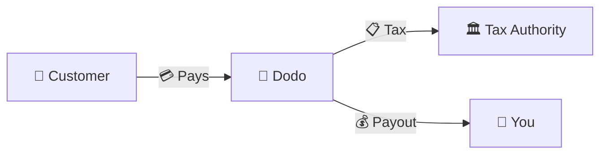
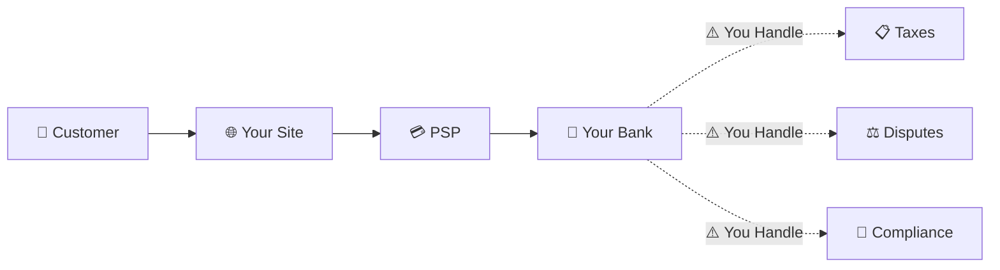
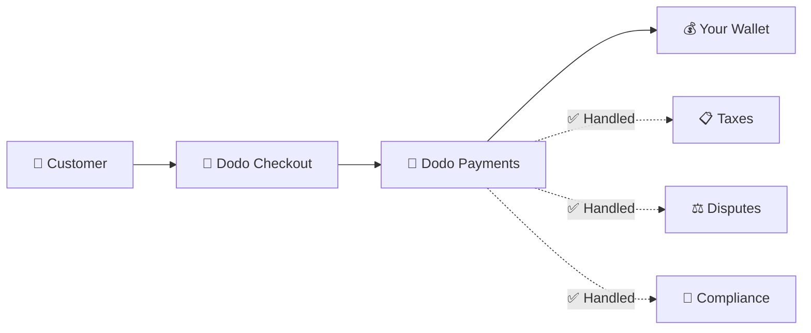
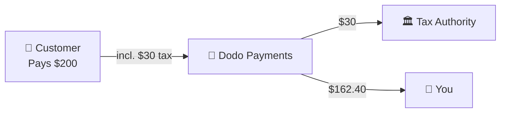

Dodo Payments agiert als **Merchant of Record (MoR)** – wir werden zum rechtlichen Verkäufer Ihrer digitalen Produkte und übernehmen die Verantwortung für Zahlungen, Steuern, Betrug und Compliance, damit Sie sich vollständig auf die Entwicklung Ihres Produkts konzentrieren können.

<CardGroup cols={3}>
<Card title="220+ Regions" icon="globe">
Steuerkonformität automatisch erledigt
</Card>

<Card title="30+ Payment Methods" icon="credit-card">
Karten, Wallets und lokale Zahlungsmethoden
</Card>

<Card title="Zero Tax Filing" icon="file-invoice">
Wir kümmern uns um alle Auszahlungen
</Card>
</CardGroup>

## Was ist ein Merchant of Record?

Ein **Merchant of Record** ist die rechtliche Einheit, die auf der Kreditkartenabrechnung Ihrer Kunden erscheint und die Verantwortung für die Transaktion übernimmt. Wenn Sie Dodo Payments als Ihren MoR verwenden:

- **Wir sind der rechtliche Verkäufer** – Dodo erscheint auf Kontoauszügen und Belegen
- **Sie sind der Produktersteller** – Sie entwickeln, bepreisen und liefern Ihr Produkt
- **Wir kümmern uns um das Backoffice** – Steuern, Streitfälle, Compliance und Unterstützung bei der Abrechnung
- **Sie erhalten Nettoauszahlungen** – Einnahmen werden direkt auf Ihr Konto überwiesen

<Note>
Stellen Sie sich einen Merchant of Record wie ein globales Finanzteam vor, das die Rechnungsstellung, Steuern und Abrechnung in jedem Land übernimmt – ohne dass Sie einen Finger rühren müssen.
</Note>

## Warum einen Merchant of Record verwenden?

Der weltweite Verkauf digitaler Produkte bedeutet, dass Sie sich mit VAT in Europa, GST in Australien, Sales Tax in den USA und unzähligen weiteren Anforderungen auseinandersetzen müssen. Jede Rechtsordnung hat unterschiedliche Regeln, Sätze, Schwellenwerte und Abgabefristen.

| Ihre Verantwortung | Ohne MoR | Mit Dodo als MoR |
|---------------------|:-----------:|:----------------:|
| VAT/GST-Registrierung | ❌ Sie | ✅ Dodo |
| Steuerberechnung | ❌ Sie | ✅ Dodo |
| Steuererklärung und Abführung | ❌ Sie | ✅ Dodo |
| Haftung für Rückbuchungen | ❌ Sie | ✅ Dodo |
| PCI-Compliance | ❌ Sie | ✅ Dodo |
| Unterstützung mehrerer Währungen | ❌ Komplex | ✅ Integriert |
| Lokale Zahlungsmethoden | ❌ Jede einzeln integrieren | ✅ Mehr als 30 enthalten |

<Tip>
**Beispiel**: Sie verkaufen einem französischen Kunden ein Abonnement für 50 € pro Monat?

**Ohne MoR**: Für die französische VAT registrieren, 60 € berechnen (20 % VAT), vierteljährliche französische Steuererklärungen einreichen und Prüfungen auf Französisch bearbeiten.

**Mit Dodo**: Wir ziehen 60 € ein, führen 10 € VAT an Frankreich ab und zahlen Ihnen 50 € abzüglich Gebühren aus. Sie schreiben Code.
</Tip>

## PSP vs. MoR: Die wichtigsten Unterschiede

Es ist entscheidend, den Unterschied zwischen einem **Payment Service Provider** (wie Stripe) und einem **Merchant of Record** zu verstehen.

### Payment Service Provider (PSP)

Ein PSP verarbeitet Transaktionen, lässt Sie jedoch als rechtlichen Verkäufer bestehen:

<Warning>
Mit einem PSP sind **Sie** für die Steuerregistrierung, den Steuereinzug, die Abgabe von Steuererklärungen und die Steuerabführung in jeder Rechtsordnung verantwortlich, in der Sie Kunden haben.
</Warning>

### Merchant of Record (Dodo)

Ein MoR wird zum rechtlichen Verkäufer und übernimmt die Compliance vollständig:

<Check>
Mit Dodo als MoR kümmern wir uns um Steuern, Streitfälle und Compliance. Sie erhalten Nettoauszahlungen ohne Papierkram.
</Check>

### Vergleich nebeneinander

| Aspekt | PSP (Stripe usw.) | MoR (Dodo) |
|--------|:------------------:|:----------:|
| Rechtlicher Verkäufer | Ihr Unternehmen | Dodo |
| Auf dem Kontoauszug des Kunden | Ihr Name | Dodo |
| Steuerregistrierung | ❌ Sie | ✅ Dodo |
| Steuerberechnung | ❌ Sie | ✅ Dodo |
| Steuerabführung | ❌ Sie | ✅ Dodo |
| Rückbuchungsrisiko | ❌ Sie | ✅ Dodo |
| PCI-Compliance | ❌ Sie | ✅ Dodo |
| Einrichtung für den globalen Verkauf | Komplex | Einfach |

<Info>
**Wichtig**: Sowohl PSPs als auch MoRs übernehmen die Zahlungsabwicklung. Der entscheidende Unterschied besteht darin, **wer rechtlich verantwortlich** für Steuerkonformität und Transaktionshaftung ist.
</Info>

## So funktioniert Steuerkonformität

Dodo übernimmt den gesamten Steuerlebenszyklus automatisch:

<Steps>
<Step title="Customer Location">
Wir erkennen das Land des Kunden und bestimmen, welche Steuervorschriften gelten – VAT, GST, Sales Tax oder andere lokale Anforderungen.
</Step>

<Step title="Rate Calculation">
Der korrekte Steuersatz wird anhand des Produkttyps, des Standorts des Kunden und des B2B-/B2C-Status berechnet. Für EU-Geschäftskunden mit gültiger VAT-Nummer wird automatisch das Reverse-Charge-Verfahren angewendet.
</Step>

<Step title="Collection at Checkout">
Die Steuer wird beim Checkout deutlich angezeigt und eingezogen. Kunden sehen genau, was sie bezahlen.
</Step>

<Step title="Filing & Remittance">
Wir reichen Erklärungen ein und zahlen die eingezogenen Steuern fristgerecht an die zuständigen Behörden. Sie sehen niemals ein Steuerformular.
</Step>
</Steps>

## Zahlungsfluss

So bewegt sich das Geld vom Kunden auf Ihr Konto:

### Beispiel für eine Auszahlungsaufstellung

| Position | Betrag |
|-----------|-------:|
| Kundenzahlung | $200.00 |
| Sales Tax (15 % VAT) | −$30.00 |
| Dodo-Plattformgebühr (4 %) | −$8.00 |
| Zahlungsabwicklung | −$0.60 |
| **Ihre Auszahlung** | **$162.40** |

## Wann Sie MoR statt PSP wählen sollten

<Tabs>
<Tab title="Choose Dodo (MoR)">
**Dodo Payments ist ideal, wenn Sie:**

- digitale Produkte, SaaS oder Abonnements verkaufen
- Kunden in mehreren Ländern haben
- den Aufwand für Steuerregistrierungen vermeiden möchten
- planbare, ausgelagerte Compliance bevorzugen
- eine schnelle Markteinführung wichtiger finden als maximale Kontrolle
- Streitfälle und Betrug nicht selbst verwalten möchten
</Tab>

<Tab title="Consider a PSP">
**Ein PSP könnte für Sie geeignet sein, wenn Sie:**

- hauptsächlich in einem Land tätig sind
- interne Finanz- und Compliance-Teams haben
- absolute Kontrolle über die Checkout-UX benötigen
- mit äußerst geringen Margen arbeiten
- physische Waren verkaufen (MoRs konzentrieren sich auf digitale Produkte)
</Tab>
</Tabs>

<Note>
Viele Unternehmen beginnen mit einem PSP und wechseln zu einem MoR, wenn sie international expandieren. Dodo bietet Unterstützung bei der Migration, um diesen Übergang nahtlos zu gestalten.
</Note>

## Häufig gestellte Fragen

<AccordionGroup>
<Accordion title="What appears on my customer's credit card statement?">
Dodo Payments erscheint als Händler. Wir fügen, sofern die Zeichenbegrenzung dies zulässt, einen Verweis auf Ihr Produkt bzw. Ihre Marke hinzu. Kunden erhalten detaillierte Belege mit Informationen zu Ihrem Produkt.
</Accordion>

<Accordion title="Do I still own the customer relationship?">
Ja. Sie kontrollieren Preise, Branding, Produktbereitstellung und die direkte Kommunikation. Dodo übernimmt die Abrechnungsmechanik, aber Kunden wissen, dass sie bei Ihnen kaufen. Ihre Marke erscheint prominent im Checkout, in E-Mails und auf Rechnungen.
</Accordion>

<Accordion title="How does B2B VAT reverse charge work?">
Bei B2B-Verkäufen in der EU können Kunden ihre VAT-Nummer beim Checkout eingeben. Wir validieren sie und wenden automatisch das Reverse-Charge-Verfahren an – die Steuer wird auf die VAT-Erklärung des Käufers verlagert, statt eingezogen zu werden.
</Accordion>

<Accordion title="Can I use my own payment processor?">
Ja. Mit [Bring Your Own Processor (BYOP)](/features/byop) können Sie Ihr eigenes Stripe- oder Adyen-Konto verbinden und Zahlungen aus ausgewählten Ländern darüber abwickeln, während Dodo Payments weiterhin Produkte, Abonnements, Rechnungsstellung und Analysen unterstützt. Länder, die Sie nicht ausdrücklich weiterleiten, werden weiterhin über Dodo Payments als Ihren umfassenden Merchant of Record abgewickelt. Dadurch können wir auf diesen Routen die Steuer- und Betrugshaftung übernehmen.
</Accordion>

<Accordion title="How do refunds work?">
Veranlassen Sie Rückerstattungen über Ihr Dashboard. Wir führen die Rückerstattung über die ursprüngliche Zahlungsmethode und in der ursprünglichen Währung des Kunden durch. Steuerbeträge werden automatisch angepasst und abgeglichen.
</Accordion>

<Accordion title="What about my income tax?">
Dodo übernimmt **Sales Taxes** (VAT, GST, Sales Tax) auf Kundentransaktionen. Sie bleiben für die Einkommensteuer, Körperschaftsteuer und steuerlichen Verpflichtungen Ihres Unternehmens auf die erhaltenen Auszahlungen verantwortlich.
</Accordion>

<Accordion title="Which countries can I sell to?">
Wir akzeptieren Zahlungen aus mehr als 220 Ländern und Regionen und erweitern dieses Angebot kontinuierlich. Die vollständige Liste finden Sie hier:

<Card title="Supported Regions" icon="globe" href="/miscellaneous/list-of-countries-we-accept-payments-from">
Alle mehr als 220 Länder und Regionen anzeigen, aus denen wir Zahlungen akzeptieren.
</Card>
</Accordion>
</AccordionGroup>

## Erste Schritte

<CardGroup cols={2}>
<Card title="Create Account" icon="rocket" href="https://app.dodopayments.com/signup">
Kostenlos registrieren und in wenigen Minuten globale Zahlungen akzeptieren.
</Card>

<Card title="MoR vs PG Deep Dive" icon="scale-balanced" href="/features/mor-vs-pg">
Detaillierter Vergleich mit Beispielen und Anwendungsfällen.
</Card>

<Card title="Acceptance Policy" icon="building-shield" href="/miscellaneous/merchant-acceptance">
Erfahren Sie, welche Unternehmen wir unterstützen.
</Card>

<Card title="Talk to Us" icon="envelope" href="mailto:founders@dodopayments.com">
Erhalten Sie eine individuelle Beratung von unserem Team.
</Card>
</CardGroup>
