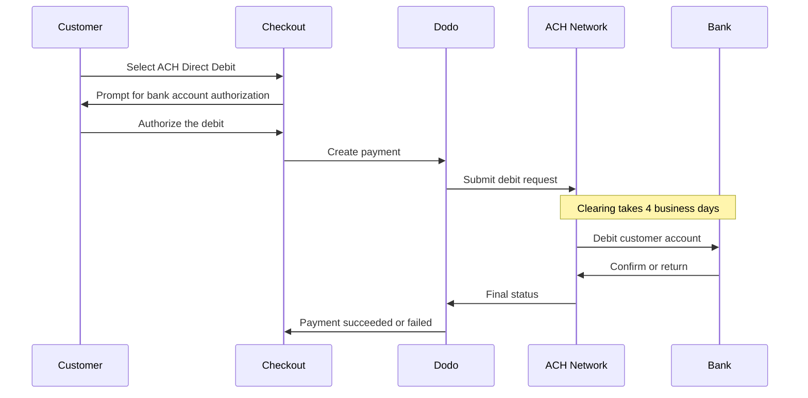

Mit ACH Direct Debit können Kunden in den Vereinigten Staaten direkt von ihrem Bankkonto bezahlen, anstatt eine Karte zu verwenden. Die Zahlungen werden über das Automated Clearing House-Netzwerk abgewickelt und stehen bei Checkouts in USD für einmalige Zahlungen zur Verfügung.

## Warum ACH Direct Debit anbieten?

<CardGroup cols={3}>
<Card title="Lower Processing Cost" icon="piggy-bank">
Banklastschriften sind in der Abwicklung typischerweise günstiger als Kartenzahlungen, insbesondere bei Bestellungen mit hohem Wert.
</Card>

<Card title="No Card Required" icon="building-columns">
Erreichen Sie US-Kunden, die lieber von einem Bankkonto bezahlen oder bei größeren Käufen keine Karte verwenden möchten.
</Card>

<Card title="Higher Value Orders" icon="chart-line">
Der Kostenvorteil gegenüber Karten wächst mit dem Bestellwert. Dadurch eignet sich ACH besonders für große einmalige Käufe.
</Card>
</CardGroup>

## Überblick

| Detail | Wert |
| :----- | :---- |
| **Abrechnungswährung** | USD |
| **Unterstützte Länder** | Vereinigte Staaten |
| **Abonnements** | Nein |
| **Mindestbetrag** | $0.50 |
| **Abwicklung** | 4 Werktage |

<Warning>
ACH Direct Debit ist nicht sofort. Die Bestätigung einer Zahlung dauert **4 Werktage**. Behandeln Sie daher die Autorisierung nicht als Abwicklung — erfüllen Sie die Bestellung erst, wenn die Zahlung den Status succeeded erreicht hat.
</Warning>

## So funktioniert es



## Kundenerfahrung

1. Der Kunde wählt ACH Direct Debit beim Checkout aus
2. Der Kunde autorisiert die Lastschrift von seinem US-Bankkonto
3. Die Zahlung wird an das ACH-Netzwerk übermittelt und erhält den Status processing
4. Die Verrechnung wird in den darauffolgenden Werktagen abgeschlossen
5. Die Zahlung erhält den Status succeeded oder schlägt fehl, wenn die Bank sie zurückgibt

<Info>
Da die Verrechnung asynchron erfolgt, sollten Sie sich auf [Webhooks](/developer-resources/webhooks) verlassen, um das endgültige Ergebnis zu erfahren, statt auf die Weiterleitung nach dem Checkout. Eine erfolgreiche Weiterleitung bedeutet lediglich, dass der Kunde die Lastschrift autorisiert hat.

Die Zahlung gibt `payment.processing` aus, sobald die Lastschrift übermittelt wurde, und anschließend `payment.succeeded` oder `payment.failed`, sobald die Verrechnung abgeschlossen ist. Nur `payment.succeeded` ist sicher für die Erfüllung der Bestellung.
</Info>

## Verfügbarkeit

ACH Direct Debit wird beim Checkout angezeigt, wenn alle folgenden Bedingungen erfüllt sind:

- **Abrechnungswährung** ist `USD`
- **Abrechnungsland** ist `US`
- Die Transaktion ist eine **einmalige Zahlung**

<Note>
ACH Direct Debit ist für Abonnements nicht verfügbar. Das mehrtägige Abwicklungsfenster macht die Methode für wiederkehrende Abrechnungszyklen ungeeignet. Verwenden Sie für wiederkehrende Zahlungen Karten oder eine andere Methode, die Abonnements unterstützt — siehe die [Übersicht der Zahlungsmethoden](/features/payment-methods).
</Note>

## Konfiguration

```javascript
const session = await client.checkoutSessions.create({
  product_cart: [{ product_id: 'pdt_123', quantity: 1 }],
  allowed_payment_method_types: ['ach', 'credit', 'debit'],
  billing_currency: 'USD',
  billing_address: {
    country: 'US',
    zipcode: '94102'
  },
  return_url: 'https://example.com/success'
});
```

<Note>
ACH Direct Debit erfordert die Abrechnungswährung **USD** und eine **US**-Abrechnungsadresse. Wenn Sie Ihre Preise in einer anderen Währung angeben, aktivieren Sie [Adaptive Currency](/features/adaptive-currency), damit US-Kunden in USD abgerechnet werden und ACH verfügbar wird.
</Note>

## API-Methodentyp

| Typ | Methode | Land |
| :--- | :----- | :------ |
| `ach` | ACH Direct Debit | Vereinigte Staaten |

## Rückerstattungen und Disputes

Rückerstattungen und Disputes für ACH-Zahlungen verwenden dieselben APIs und Dashboard-Abläufe wie alle anderen Zahlungsmethoden — es ist keine ACH-spezifische Implementierung erforderlich.

<Warning>
Da ACH-Zahlungen von der Bank des Kunden zurückgegeben werden können, nachdem sie scheinbar erfolgreich durchgeführt wurden, sollten Sie keine Rückerstattung ausstellen, bevor die ursprüngliche Zahlung den Status succeeded erreicht hat.
</Warning>

## Testen

<Steps>
<Step title="Enable test mode">
Verwenden Sie Ihre Test-API-Schlüssel von Dodo Payments.
</Step>

<Step title="Set currency and billing address">
Legen Sie die Abrechnungswährung auf `USD` und das Land der Abrechnungsadresse auf `US` fest.
</Step>

<Step title="Include `ach` in allowed methods">
Übergeben Sie `ach` in `allowed_payment_method_types` oder lassen Sie das Feld vollständig weg, um alle geeigneten Methoden anzuzeigen.
</Step>

<Step title="Enter the test bank details">
Geben Sie eines der unten aufgeführten Testpaare aus Routing- und Kontonummer ein und bestätigen Sie anschließend, dass Ihr Webhook-Handler den endgültigen Zahlungsstatus empfängt.
</Step>
</Steps>

### Testbankkonten

Kunden geben ihre Konto- und Routingnummer direkt beim Checkout ein. Verwenden Sie im Testmodus die Routingnummer `110000000` zusammen mit einer der unten aufgeführten Kontonummern, um ein bestimmtes Ergebnis zu erzwingen.

| Kontonummer | Routingnummer | Verhalten |
| :------------- | :------------- | :------- |
| `000123456789` | `110000000` | Die Zahlung ist erfolgreich. |
| `000222222227` | `110000000` | Die Zahlung schlägt wegen unzureichender Deckung fehl. |
| `000111111113` | `110000000` | Die Zahlung schlägt fehl, weil das Konto geschlossen ist. |
| `000111111116` | `110000000` | Die Zahlung schlägt fehl, weil kein Konto gefunden wurde. |
| `000333333335` | `110000000` | Die Zahlung schlägt fehl, weil Lastschriften für das Konto nicht autorisiert sind. |
| `000444444440` | `110000000` | Die Zahlung schlägt wegen einer ungültigen Währung fehl. |
| `000555555559` | `110000000` | Die Zahlung ist erfolgreich und löst anschließend einen Dispute aus. |
| `000000000009` | `110000000` | Die Zahlung bleibt dauerhaft im Status processing. Dies eignet sich zum Testen einer Benutzeroberfläche für ausstehende Zahlungen. |

<Note>
Die meisten Testzahlungen erreichen ihren endgültigen Status deutlich schneller als im Livebetrieb. Sie müssen daher nicht mehrere Tage warten, um Ihre Integration zu überprüfen. Die Ausnahme ist `000000000009`, das so konzipiert ist, dass es im Status processing bleibt.
</Note>

## Best Practices

<AccordionGroup>
<Accordion title="Don't fulfill on authorization">
Eine ACH-Autorisierung ist keine Zahlung. Warten Sie, bis die Zahlung den Status succeeded erreicht hat, bevor Sie Zugriff gewähren oder Waren versenden — eine Lastschrift kann von der Bank des Kunden weiterhin zurückgegeben werden.
</Accordion>

<Accordion title="Set customer expectations at checkout">
Informieren Sie Kunden darüber, dass Bankzahlungen nicht sofort verrechnet werden. Dadurch vermeiden Sie Supportanfragen, warum eine Bestellung noch aussteht.
</Accordion>

<Accordion title="Provide card fallbacks">
Fügen Sie `credit` und `debit` immer zusammen mit `ach` ein, damit Kunden, die sofortigen Zugriff auf Ihr Produkt benötigen, eine schnellere Methode wählen können.
</Accordion>

<Accordion title="Use ACH for high-value one-time purchases">
Der Kostenvorteil von ACH wächst mit dem Bestellwert. Daher eignet sich ACH besonders für große einmalige Käufe und weniger für kleine Käufe.
</Accordion>
</AccordionGroup>

## Fehlerbehebung

<AccordionGroup>
<Accordion title="ACH not appearing at checkout">
**Prüfen Sie:**
1. Ist die Abrechnungswährung auf `USD` festgelegt?
2. Ist das Abrechnungsland des Kunden `US`?
3. Ist `ach` in `allowed_payment_method_types` enthalten?
4. Handelt es sich um eine einmalige Zahlung? ACH wird für Abonnements nicht angeboten.

**Lösung:** Entfernen Sie `allowed_payment_method_types` vorübergehend, um alle geeigneten Methoden anzuzeigen. Überprüfen Sie anschließend die Abrechnungswährung und das Land der Adresse in Ihrer API-Anfrage.
</Accordion>

<Accordion title="ACH not appearing on a subscription checkout">
**Ursache:** ACH Direct Debit wird nur für einmalige Zahlungen angeboten.

**Lösung:** Verwenden Sie für wiederkehrende Abrechnungen Karten oder eine andere abonnementsfähige Methode.
</Accordion>

<Accordion title="Payment stuck in processing">
**Ursache:** Dies ist erwartetes Verhalten. ACH-Zahlungen bleiben während des gesamten Abwicklungsfensters im Status processing — deutlich länger als Kartenzahlungen.

**Lösung:** Warten Sie auf den abschließenden Webhook. Wiederholen Sie die Zahlung nicht — durch eine Wiederholung könnte der Kunde zweimal belastet werden.
</Accordion>

<Accordion title="Payment failed after initially succeeding at checkout">
**Ursache:** Die Bank des Kunden hat die Lastschrift zurückgegeben — meist wegen unzureichender Deckung oder eines geschlossenen Kontos.

**Lösung:** Behandeln Sie die Zahlung als fehlgeschlagen und bitten Sie den Kunden, es mit einer anderen Zahlungsmethode erneut zu versuchen. Stellen Sie die Erfüllung immer erst beim Status succeeded frei, um dies zu vermeiden.
</Accordion>
</AccordionGroup>

## Verwandte Seiten

<CardGroup cols={2}>
<Card title="Payment Methods Overview" icon="credit-card" href="/features/payment-methods">
Alle unterstützten Zahlungsmethoden anzeigen.
</Card>

<Card title="Adaptive Currency" icon="globe" href="/features/adaptive-currency">
Unterstützte Währungen und automatische Umrechnung.
</Card>

<Card title="Checkout Guide" icon="book" href="/developer-resources/checkout-session">
Vollständige Anleitung zur Checkout-Implementierung.
</Card>

<Card title="Webhooks" icon="webhook" href="/developer-resources/webhooks">
Verzögerte Zahlungsbestätigungen asynchron verarbeiten.
</Card>
</CardGroup>
