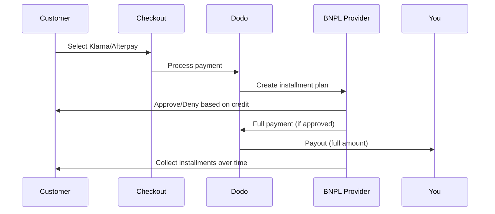

Jetzt kaufen, später bezahlen (BNPL) ermöglicht es Kunden, Käufe in zinsfreie Raten zu unterteilen, wodurch der durchschnittliche Bestellwert um 20-50% und die Conversion-Rate um 10-30% für berechtigte Transaktionen erhöht wird.

## Warum BNPL anbieten?

<CardGroup cols={3}>
<Card title="Higher AOV" icon="chart-line">
Kunden geben mehr aus, wenn sie Zahlungen über die Zeit verteilen können. Der durchschnittliche Bestellwert steigt um 20–50 %.
</Card>

<Card title="Better Conversion" icon="percent">
Entfernung von Zahlungsreibung beim Checkout. Die Conversion-Rate verbessert sich um 10–30 % bei hochpreisigen Artikeln.
</Card>

<Card title="Zero Risk" icon="shield-check">
BNPL-Anbieter übernehmen das Kreditrisiko und Inkasso. Sie erhalten die volle Zahlung im Voraus.
</Card>
</CardGroup>

## Unterstützte Anbieter

### Klarna

| Funktion | Details |
| :------ | :------ |
| **Verfügbarkeit** | USA + 19 europäische Länder |
| **Währungen** | USD, EUR, GBP, DKK, NOK, SEK, CZK, RON, PLN, CHF |
| **Mindestbetrag** | $50,01 (oder Äquivalent) |
| **Abonnements** | Ja |

**Unterstützte Länder:** Österreich, Belgien, Tschechische Republik, Dänemark, Finnland, Frankreich, Deutschland, Griechenland, Irland, Italien, Niederlande, Norwegen, Polen, Portugal, Rumänien, Spanien, Schweden, Schweiz, Vereinigtes Königreich, Vereinigte Staaten

**Zahlungsoptionen:**
- **In 4 Raten zahlen** — Aufteilen in 4 zinsfreie Zahlungen
- **In 30 Tagen zahlen** — Vollständige Zahlung fällig in 30 Tagen
- **Finanzierung** — Langfristige Ratenpläne

### Afterpay (Clearpay)

| Funktion | Einzelheiten |
| :------ | :------ |
| **Verfügbarkeit** | USA, UK |
| **Währungen** | USD, GBP |
| **Mindestbetrag** | 50,01 USD (oder Äquivalent) |
| **Abonnements** | Nein |

**Zahlungsoptionen:**
- **In 4 Raten zahlen** — 4 zinsfreie Zahlungen alle 2 Wochen

<Note>
Im Vereinigten Königreich tritt Afterpay unter dem Namen „Clearpay“ auf, verwendet aber denselben API-Typ (`afterpay_clearpay`).
</Note>

### Billie

| Funktion | Einzelheiten |
| :------ | :------ |
| **Verfügbarkeit** | Global |
| **Währungen** | GBP |
| **Mindestbetrag** | Keine |
| **Abonnements** | Nein |

**Über Billie:**
Billie ist eine B2B-Now-Pay-Later-Lösung, die Unternehmen ermöglicht, ihren Kunden flexible Zahlungsbedingungen anzubieten. Sie ist für Geschäftstransaktionen konzipiert, bei denen Käufer rechnungsbasierte Zahlungsoptionen benötigen.

**Zahlungsoptionen:**
- **Rechnungszahlung** — Zahlung innerhalb der vereinbarten Zahlungsbedingungen
- **Flexible Bedingungen** — Kundenfreundliche Zahlungspläne

## Konfiguration

### API-Methodentypen

| Typ | Anbieter |
| :--- | :------- |
| `klarna` | Klarna |
| `afterpay_clearpay` | Afterpay / Clearpay |
| `billie` | Billie (B2B) |

### Beispiel

```javascript
const session = await client.checkoutSessions.create({
  product_cart: [{ product_id: 'pdt_123', quantity: 1 }],
  allowed_payment_method_types: [
    'klarna',
    'afterpay_clearpay',
    'credit',
    'debit'
  ],
  customer: {
    email: 'customer@example.com',
    name: 'Jane Smith'
  },
  billing_address: {
    country: 'US',
    zipcode: '10001'
  },
  return_url: 'https://example.com/success'
});
```

<Warning>
Fügen Sie `credit` und `debit` immer als Fallbacks hinzu. Nicht alle Kunden sind für BNPL berechtigt, und Transaktionen unterhalb des Mindestbetrags des Anbieters sind nicht zulässig.
</Warning>

## Grenzen des Transaktionsbetrags

Jeder BNPL-Anbieter hat einen eigenen Mindest- (und manchmal auch Höchst-)Transaktionsbetrag:

| Anbieter | Minimum | Maximum |
| :------- | :------ | :------ |
| Klarna | $50.01 | — |
| Afterpay | $50.01 | — |

Transaktionen außerhalb dieser Grenzen:
- BNPL-Optionen werden beim Checkout nicht angezeigt
- Es wird kein Fehler ausgegeben – die Optionen werden einfach nicht angezeigt
- Kartenzahlungen bleiben verfügbar

Dies ist das erwartete Verhalten. Fügen Sie keine BNPL-Methode in `allowed_payment_method_types` ein, wenn der Produktpreis voraussichtlich nicht innerhalb des unterstützten Bereichs dieses Anbieters liegt.

## Funktionsweise von Ratenzahlungen



**Wichtige Punkte:**
- Sie erhalten die **vollständige Zahlung im Voraus** vom BNPL-Anbieter
- Der BNPL-Anbieter übernimmt **Kreditrisiko und Inkasso**
- Der Kunde zahlt den Anbieter in der Regel direkt in **4 Raten**
- **Keine Rückbuchungen** aufgrund fehlgeschlagener Ratenzahlungen – dieses Risiko trägt der Anbieter

## Testen

### Klarna-Testdaten

Verwenden Sie diese Angaben im Testmodus:

| Feld | Genehmigt | Abgelehnt |
| :---- | :------- | :----- |
| **Geburtsdatum** | 07-10-1970 | 07-10-1970 |
| **Vorname** | Test | Test |
| **Nachname** | Person-us | Person-us |
| **E-Mail** | customer@email.us | customer+denied@email.us |
| **Straße** | Amsterdam Ave | Amsterdam Ave |
| **Hausnummer** | 509 | 509 |
| **Stadt** | New York | New York |
| **Bundesstaat** | New York | New York |
| **Postleitzahl** | 10024-3941 | 10024-3941 |
| **Telefon** | +13106683312 | +13106354386 |

<Note>
Die Transaktion muss mindestens $50 betragen, damit Klarna als Option angezeigt wird.
</Note>

### Afterpay-Tests

<Steps>
<Step title="Select Afterpay">
Wählen Sie Afterpay im Checkout aus und klicken Sie auf „Bezahlen“.
</Step>

<Step title="Successful payment">
Verwenden Sie eine beliebige gültige E-Mail-Adresse und Lieferadresse.
</Step>

<Step title="Failed authentication">
So testen Sie einen Fehler: Schließen Sie das Afterpay-Modal auf der Weiterleitungsseite. Der Zahlungsstatus wechselt zu `requires_payment_method`.
</Step>
</Steps>

## Best Practices

<AccordionGroup>
<Accordion title="Target high-ticket items">
BNPL eignet sich am besten für Produkte im Wert von $100–$1000. Das Wertversprechen „später bezahlen“ ist in diesem Bereich besonders überzeugend.
</Accordion>

<Accordion title="Show installment amounts">
„4 Zahlungen zu je $25“ ist überzeugender als „$100 mit Klarna“. Zeigen Sie nach Möglichkeit den Betrag pro Zahlung an.
</Accordion>

<Accordion title="Don't force BNPL for low-value products">
Unter $50 wird BNPL ohnehin nicht angezeigt. Unter $100 bevorzugen die meisten Kunden Karten. Bewerben Sie BNPL gezielt für Produkte mit höherem Preis.
</Accordion>

<Accordion title="Collect billing address">
BNPL-Anbieter benötigen für die Kreditprüfung Rechnungsinformationen. Stellen Sie sicher, dass Ihr Checkout vollständige Adressdaten erfasst.
</Accordion>

<Accordion title="Set clear expectations">
Kunden sollten verstehen, dass sie einen Kreditvertrag mit Klarna/Afterpay und nicht mit Ihnen abschließen.
</Accordion>
</AccordionGroup>

## Einschränkungen

### Keine Abonnements
BNPL-Zahlungsmethoden **unterstützen keine wiederkehrenden Zahlungen**. Verwenden Sie für Abonnementprodukte Karten oder andere Methoden, die wiederkehrende Zahlungen unterstützen.

### Kreditbasierte Genehmigung
BNPL-Anbieter führen sofortige Kreditprüfungen durch. Nicht alle Kunden werden genehmigt. Die Genehmigungsraten variieren je nach:
- Kredithistorie des Kunden beim Anbieter
- Transaktionsbetrag
- Standort des Kunden

### Zuordnung von Währung und Land

Jede Währung ist auf die entsprechende Region beschränkt:

| Währung | Unterstützte Länder |
| :------- | :------------------ |
| **USD** | Nur Vereinigte Staaten |
| **EUR** | Alle unterstützten europäischen Länder (Österreich, Belgien, Tschechien, Dänemark, Finnland, Frankreich, Deutschland, Griechenland, Irland, Italien, Niederlande, Norwegen, Polen, Portugal, Rumänien, Spanien, Schweden, Schweiz) |
| **GBP** | Vereinigtes Königreich und alle unterstützten europäischen Länder |

Andere von Klarna unterstützte Währungen (DKK, NOK, SEK, CZK, RON, PLN, CHF) funktionieren in den jeweiligen Ländern.

<Info>
Beispielsweise werden BNPL-Optionen für eine USD-Transaktion nur Kunden in den USA angezeigt. Eine EUR-Transaktion zeigt BNPL-Optionen in allen unterstützten europäischen Ländern an. Eine GBP-Transaktion zeigt BNPL-Optionen Kunden im Vereinigten Königreich und in allen unterstützten europäischen Ländern an.
</Info>

| Anbieter | Unterstützte Währungen |
| :------- | :------------------- |
| Klarna | USD, EUR, GBP, DKK, NOK, SEK, CZK, RON, PLN, CHF |
| Afterpay | USD (US), GBP (UK) |

## Fehlerbehebung

<AccordionGroup>
<Accordion title="BNPL not appearing at checkout">
**Prüfen Sie:**
1. Liegt der Transaktionsbetrag innerhalb des vom Anbieter unterstützten Bereichs? (Klarna/Afterpay: min. $50.01)
2. Befindet sich der Kunde in einem unterstützten Land?
3. Wird die Währung vom BNPL-Anbieter unterstützt?
4. Ist die BNPL-Methode in `allowed_payment_method_types` enthalten?

**Lösung:** In den meisten Fällen liegt die Transaktion unter dem Mindest- oder über dem Höchstbetrag. Überprüfen Sie, ob der Betrag innerhalb des vom Anbieter unterstützten Bereichs liegt.
</Accordion>

<Accordion title="Customer denied by BNPL provider">
**Ursachen:**
- Unzureichende Kredithistorie beim Anbieter
- Zu viele aktive Ratenzahlungspläne
- Fehlgeschlagene Identitätsprüfung

**Lösung:** Bei einigen Kunden ist dies zu erwarten. Stellen Sie sicher, dass Karten-Fallbacks verfügbar sind. Zeigen Sie keine spezifischen Ablehnungsgründe an.
</Accordion>

<Accordion title="Payment stuck in pending">
**Ursache:** Der Kunde hat den Authentifizierungsablauf beim BNPL-Anbieter nicht abgeschlossen.

**Lösung:** Die Zahlung läuft ab und schlägt fehl. Der Kunde kann es erneut versuchen oder eine andere Methode verwenden.
</Accordion>
</AccordionGroup>

## Verwandte Seiten

<CardGroup cols={2}>
<Card title="Payment Methods Overview" icon="credit-card" href="/features/payment-methods">
Alle unterstützten Zahlungsmethoden anzeigen.
</Card>

<Card title="Checkout Guide" icon="book" href="/developer-resources/checkout-session">
Vollständiger Leitfaden zur Checkout-Implementierung.
</Card>

<Card title="Testing Process" icon="flask" href="/miscellaneous/testing-process">
Alle Testdaten für Zahlungsmethoden.
</Card>

<Card title="Adaptive Currency" icon="globe" href="/features/adaptive-currency">
Währungsunterstützung und -umrechnung.
</Card>
</CardGroup>