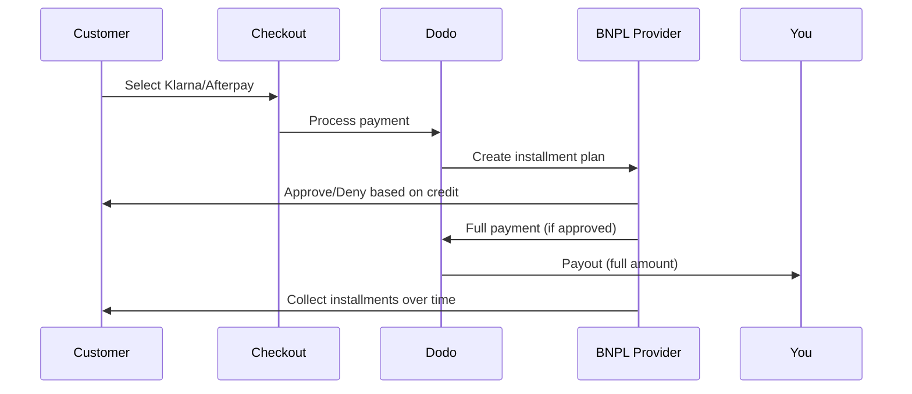

Jetzt kaufen, später bezahlen (BNPL) ermöglicht es Kunden, Käufe in zinsfreie Raten zu unterteilen, wodurch der durchschnittliche Bestellwert um 20-50% und die Conversion-Rate um 10-30% für berechtigte Transaktionen erhöht wird.

## Warum BNPL anbieten?

<CardGroup cols={3}>
<Card title="Higher AOV" icon="chart-line">
Kunden geben mehr aus, wenn sie Zahlungen über die Zeit verteilen können. Der durchschnittliche Bestellwert steigt um 20–50 %.
</Card>

<Card title="Better Conversion" icon="percent">
Entfernung von Zahlungsreibung beim Checkout. Die Conversion-Rate verbessert sich um 10–30 % bei hochpreisigen Artikeln.
</Card>

<Card title="Zero Risk" icon="shield-check">
BNPL-Anbieter übernehmen das Kreditrisiko und Inkasso. Sie erhalten die volle Zahlung im Voraus.
</Card>
</CardGroup>

## Unterstützte Anbieter

### Klarna

| Funktion | Einzelheiten |
| :------ | :------ |
| **Verfügbarkeit** | USA + 19 europäische Länder |
| **Währungen** | USD, EUR, GBP, DKK, NOK, SEK, CZK, RON, PLN, CHF |
| **Mindestbetrag** | 50,01 USD (oder Äquivalent) |
| **Abonnements** | Nein |

**Unterstützte Länder:** Österreich, Belgien, Tschechische Republik, Dänemark, Finnland, Frankreich, Deutschland, Griechenland, Irland, Italien, Niederlande, Norwegen, Polen, Portugal, Rumänien, Spanien, Schweden, Schweiz, Vereinigtes Königreich, Vereinigte Staaten

**Zahlungsoptionen:**
- **In 4 Raten zahlen** — Aufteilen in 4 zinsfreie Zahlungen
- **In 30 Tagen zahlen** — Vollständige Zahlung fällig in 30 Tagen
- **Finanzierung** — Langfristige Ratenpläne

### Afterpay (Clearpay)

| Funktion | Einzelheiten |
| :------ | :------ |
| **Verfügbarkeit** | USA, UK |
| **Währungen** | USD, GBP |
| **Mindestbetrag** | 50,01 USD (oder Äquivalent) |
| **Abonnements** | Nein |

**Zahlungsoptionen:**
- **In 4 Raten zahlen** — 4 zinsfreie Zahlungen alle 2 Wochen

<Note>
Im Vereinigten Königreich tritt Afterpay unter dem Namen „Clearpay“ auf, verwendet aber denselben API-Typ (`afterpay_clearpay`).
</Note>

### Billie

| Funktion | Einzelheiten |
| :------ | :------ |
| **Verfügbarkeit** | Global |
| **Währungen** | GBP |
| **Mindestbetrag** | Keine |
| **Abonnements** | Nein |

**Über Billie:**
Billie ist eine B2B-Now-Pay-Later-Lösung, die Unternehmen ermöglicht, ihren Kunden flexible Zahlungsbedingungen anzubieten. Sie ist für Geschäftstransaktionen konzipiert, bei denen Käufer rechnungsbasierte Zahlungsoptionen benötigen.

**Zahlungsoptionen:**
- **Rechnungszahlung** — Zahlung innerhalb der vereinbarten Zahlungsbedingungen
- **Flexible Bedingungen** — Kundenfreundliche Zahlungspläne

### Sunbit

| Funktion | Details |
| :------ | :------ |
| **Verfügbarkeit** | USA |
| **Währungen** | USD |
| **Mindestbetrag** | $60.00 |
| **Maximal** | $19,999.00 |
| **Abonnements** | Nein |

**Zahlungsoptionen:**
- **Ratenfinanzierung** — Käufe in überschaubare monatliche Zahlungen aufteilen

## Konfiguration

### API-Methode Typen

| Typ | Anbieter |
| :--- | :------- |
| `klarna` | Klarna |
| `afterpay_clearpay` | Afterpay / Clearpay |
| `billie` | Billie (B2B) |
| `sunbit` | Sunbit |

### Beispiel

```javascript
const session = await client.checkoutSessions.create({
  product_cart: [{ product_id: 'prod_123', quantity: 1 }],
  allowed_payment_method_types: [
    'klarna',
    'afterpay_clearpay',
    'credit',
    'debit'
  ],
  customer: {
    email: 'customer@example.com',
    name: 'Jane Smith'
  },
  billing_address: {
    country: 'US',
    zipcode: '10001'
  },
  return_url: 'https://example.com/success'
});
```

<Warning>
Immer `credit` und `debit` als Fallbacks einbeziehen. Nicht alle Kunden sind für BNPL berechtigt, und Transaktionen unter dem Mindestbetrag des Anbieters qualifizieren sich nicht.
</Warning>

## Transaktionsbetragsgrenzen

Jeder BNPL-Anbieter hat seinen eigenen Mindest- (und manchmal auch Höchst-) Transaktionsbetrag:

| Anbieter | Mindestbetrag | Maximal |
| :------- | :------ | :------ |
| Klarna | $50.01 | — |
| Afterpay | $50.01 | — |
| Sunbit | $60.00 | $19,999.00 |

Transaktionen außerhalb dieser Schwellenwerte:
- BNPL-Optionen erscheinen nicht an der Kasse
- Es wird kein Fehler geworfen — Optionen werden einfach nicht angezeigt
- Kartenzahlungen bleiben verfügbar

Dies ist das erwartete Verhalten. Integrieren Sie keine BNPL-Methode in `allowed_payment_method_types`, wenn der Produktpreis wahrscheinlich nicht in den unterstützten Bereich des Anbieters fällt.

## Wie Raten funktionieren



**Wichtige Punkte:**
- Sie erhalten die **volle Zahlung im Voraus** vom BNPL-Anbieter
- Der BNPL-Anbieter übernimmt das **Kreditrisiko und das Inkasso**
- Der Kunde zahlt den Anbieter direkt über **4 Raten** (typischerweise)
- **Keine Rückbuchungen** aus Ratenausfällen — das ist das Risiko des Anbieters

## Testen

### Klarna Testdaten

Verwenden Sie diese Daten im Testmodus:

| Feld | Genehmigt | Abgelehnt |
| :---- | :------- | :----- |
| **Geburtsdatum** | 07-10-1970 | 07-10-1970 |
| **Vorname** | Test | Test |
| **Nachname** | Person-us | Person-us |
| **E-Mail** | customer@email.us | customer+denied@email.us |
| **Straße** | Amsterdam Ave | Amsterdam Ave |
| **Hausnummer** | 509 | 509 |
| **Stadt** | New York | New York |
| **Bundesland** | New York | New York |
| **Postleitzahl** | 10024-3941 | 10024-3941 |
| **Telefon** | +13106683312 | +13106354386 |

<Note>
Die Transaktion muss mindestens $50 betragen, damit Klarna als Option erscheint.
</Note>

### Afterpay Testen

<Steps>
<Step title="Select Afterpay">
Wählen Sie Afterpay im Checkout und klicken Sie auf Bezahlen.
</Step>

<Step title="Successful payment">
Verwenden Sie eine gültige E-Mail und Versandadresse.
</Step>

<Step title="Failed authentication">
Um einen Fehler zu testen: Schließen Sie das Afterpay-Modul auf der Weiterleitungsseite. Der Zahlungsstatus wechselt zu `requires_payment_method`.
</Step>
</Steps>

### Sunbit Testen

<Steps>
<Step title="Set billing country and currency">
Stellen Sie sicher, dass die Checkout-Sitzung `billing_address.country` auf `US` und `billing_currency` auf `USD` eingestellt ist.
</Step>

<Step title="Use a qualifying amount">
Legen Sie den Transaktionsbetrag zwischen **$60.00 und $19,999.00** fest. Sunbit wird außerhalb dieses Bereichs nicht angezeigt.
</Step>

<Step title="Select Sunbit">
Wählen Sie Sunbit beim Checkout aus und schließen Sie den Finanzierungsantragsprozess im Sunbit-Modul ab.
</Step>

<Step title="Test failure">
Um einen abgelehnten Antrag zu simulieren, schließen Sie das Sunbit-Modul, bevor Sie den Prozess abschließen. Die Zahlung wechselt zu `requires_payment_method`.
</Step>
</Steps>

<Note>
Sunbit ist nur für US-Kunden verfügbar, die in USD mit einem Transaktionsbetrag zwischen $60.00 und $19,999.00 bezahlen.
</Note>

## Beste Praktiken

<AccordionGroup>
<Accordion title="Target high-ticket items">
BNPL funktioniert am besten für Produkte in Höhe von $100-$1000. Der Wertvorschlag "später zahlen" ist in diesem Bereich am überzeugendsten.
</Accordion>

<Accordion title="Show installment amounts">
"4 Zahlungen von $25" sind überzeugender als "$100 mit Klarna". Zeigen Sie nach Möglichkeit den Betrag pro Zahlung an.
</Accordion>

<Accordion title="Don't force BNPL for low-value products">
Unter $50 wird BNPL sowieso nicht angezeigt. Unter $100 bevorzugen die meisten Kunden Karten. Konzentrieren Sie die BNPL-Werbung auf teurere Artikel.
</Accordion>

<Accordion title="Collect billing address">
BNPL-Anbieter benötigen Rechnungsinformationen für Bonitätsprüfungen. Stellen Sie sicher, dass Ihr Checkout vollständige Adressdaten erhebt.
</Accordion>

<Accordion title="Set clear expectations">
Kunden sollten verstehen, dass sie eine Kreditvereinbarung mit Klarna/Afterpay eingehen, nicht mit Ihnen.
</Accordion>
</AccordionGroup>

## Einschränkungen

### Keine Abonnements
BNPL-Zahlungsmethoden **unterstützen keine wiederkehrenden Zahlungen**. Für Abonnementprodukte verwenden Sie Karten oder andere methoden die wiederkehrend kompatibel sind.

### Kreditbasierte Genehmigung
BNPL-Anbieter führen sofortige Bonitätsprüfungen durch. Nicht alle Kunden werden genehmigt. Die Genehmigungsraten variieren je nach:
- Kreditgeschichte des Kunden mit dem Anbieter
- Transaktionsbetrag
- Kundenstandort

### Währungs- und Landeszuordnung

Jede Währung ist auf ihre entsprechende Region beschränkt:

| Währung | Unterstützte Länder |
| :------- | :------------------ |
| **USD** | Nur Vereinigte Staaten |
| **EUR** | Alle unterstützten europäischen Länder (Österreich, Belgien, Tschechische Republik, Dänemark, Finnland, Frankreich, Deutschland, Griechenland, Irland, Italien, Niederlande, Norwegen, Polen, Portugal, Rumänien, Spanien, Schweden, Schweiz) |
| **GBP** | Vereinigtes Königreich und alle unterstützten europäischen Länder |

Andere von Klarna unterstützte Währungen (DKK, NOK, SEK, CZK, RON, PLN, CHF) funktionieren in ihren jeweiligen Ländern.

<Info>
Zum Beispiel wird eine USD-Transaktion nur BNPL-Optionen für Kunden in den USA anzeigen. Eine EUR-Transaktion wird BNPL-Optionen in allen unterstützten europäischen Ländern anzeigen. Eine GBP-Transaktion wird BNPL-Optionen für Kunden im Vereinigten Königreich und allen unterstützten europäischen Ländern anzeigen.
</Info>

| Anbieter | Unterstützte Währungen |
| :------- | :-------------------- |
| Klarna | USD, EUR, GBP, DKK, NOK, SEK, CZK, RON, PLN, CHF |
| Afterpay | USD (USA), GBP (Vereinigtes Königreich) |
| Sunbit | USD (USA) |

## Fehlerbehebung

<AccordionGroup>
<Accordion title="BNPL not appearing at checkout">
**Prüfen:**
1. Transaktionsbetrag innerhalb des unterstützten Bereichs des Anbieters? (Klarna/Afterpay: min $50.01; Sunbit: $60.00–$19,999.00)
2. Kundenstandort im unterstützten Land?
3. Währung wird vom BNPL-Anbieter unterstützt?
4. BNPL-Methode in `allowed_payment_method_types` enthalten?

**Lösung:** Am häufigsten liegt die Transaktion unter dem Minimum oder über dem Maximum. Überprüfen Sie, ob der Betrag innerhalb des vom Anbieter unterstützten Bereichs liegt.
</Accordion>

<Accordion title="Customer denied by BNPL provider">
**Ursachen:**
- Unzureichende Kreditgeschichte mit dem Anbieter
- Zu viele aktive Ratenverträge
- Identitätsüberprüfung fehlgeschlagen

**Lösung:** Dies ist bei einigen Kunden zu erwarten. Stellen Sie sicher, dass Karten-Fallbacks verfügbar sind. Geben Sie keine spezifischen Ablehnungsgründe an.
</Accordion>

<Accordion title="Payment stuck in pending">
**Ursache:** Der Kunde hat den Authentifizierungsfluss mit dem BNPL-Anbieter nicht abgeschlossen.

**Lösung:** Die Zahlung wird zeitlich ablaufen und fehlschlagen. Der Kunde kann es erneut versuchen oder eine andere Methode verwenden.
</Accordion>
</AccordionGroup>

## Verwandte Seiten

<CardGroup cols={2}>
<Card title="Payment Methods Overview" icon="credit-card" href="/features/payment-methods">
Alle unterstützten Zahlungsmethoden anzeigen.
</Card>

<Card title="Checkout Guide" icon="book" href="/developer-resources/checkout-session">
Komplette Checkout-Implementierungsanleitung.
</Card>

<Card title="Testing Process" icon="flask" href="/miscellaneous/testing-process">
Alle Testdaten für Zahlungsmethoden.
</Card>

<Card title="Adaptive Currency" icon="globe" href="/features/adaptive-currency">
Währungsunterstützung und Umrechnung.
</Card>
</CardGroup>