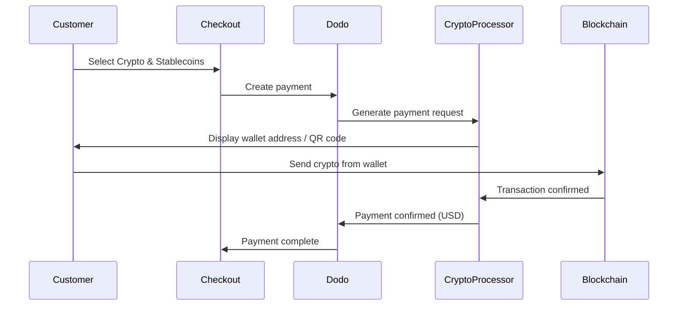

Zahlungen mit Krypto & Stablecoins ermöglichen es Kunden, mit Kryptowährungen und Stablecoins von überall auf der Welt (außer Indien) zu bezahlen. Transaktionen werden in USD abgerechnet, sodass Sie Fiat-Währung erhalten, während Kunden mit ihrem bevorzugten Krypto-Wallet bezahlen.

## Warum Krypto & Stablecoins anbieten?

<CardGroup cols={3}>
<Card title="Global Reach" icon="globe">
Akzeptieren Sie Zahlungen aus jedem Land – keine Bankinfrastruktur auf Kundenseite erforderlich.
</Card>

<Card title="No Chargebacks" icon="shield-check">
Krypto-Transaktionen sind irreversibel, wodurch Chargeback-Betrug vollständig eliminiert wird.
</Card>

<Card title="USD Settlement" icon="dollar-sign">
Sie erhalten USD — keine Notwendigkeit, Krypto-Volatilität oder Wallets zu verwalten.
</Card>
</CardGroup>

## Überblick

| Detail | Wert |
| :----- | :---- |
| **Abrechnungswährung** | USD |
| **Unterstützte Länder** | Global (außer IN) |
| **Abonnements** | Nein |
| **Mindestbetrag** | $0,50 |
| **Abwicklung** | USD |

## Wie es funktioniert



## Kundenerfahrung

1. Kunde wählt beim Checkout Krypto & Stablecoins
2. Eine Wallet-Adresse und ein QR-Code werden mit dem Betrag in Krypto angezeigt
3. Kunde sendet den genauen Betrag aus seinem Krypto-Wallet
4. Transaktion wird auf der Blockchain bestätigt
5. Kunde wird zur Erfolgsseite weitergeleitet

<Info>
Krypto-Zahlungen werden in USD abgerechnet. Der Krypto-Betrag, der beim Checkout angezeigt wird, spiegelt den Echtzeit-Wechselkurs zum Zeitpunkt der Zahlung wider.
</Info>

## Unterstützte Währungen & Netzwerke

| Währung | Netzwerke |
| :------- | :------- |
| **USDC** | Ethereum, Solana, Polygon, Base |
| **USDP** | Ethereum, Solana |
| **USDG** | Ethereum |

## Konfiguration

```javascript
const session = await client.checkoutSessions.create({
  product_cart: [{ product_id: 'prod_123', quantity: 1 }],
  allowed_payment_method_types: ['crypto', 'credit', 'debit'],
  return_url: 'https://example.com/success'
});
```

## API Methode Typ

| Typ | Methode | Land |
| :--- | :----- | :------ |
| `crypto` | Krypto & Stablecoins | Global (außer IN) |

## Testen

<Steps>
<Step title="Enable test mode">
Verwenden Sie Ihre Dodo Payments Test-API-Schlüssel.
</Step>

<Step title="Create a test checkout">
Erstellen Sie eine Checkout-Sitzung mit `crypto` in den erlaubten Zahlungsmethoden.
</Step>

<Step title="Complete the test flow">
Folgen Sie dem simulierten Krypto-Zahlungsfluss in der Testumgebung.
</Step>
</Steps>

## Best Practices

<AccordionGroup>
<Accordion title="Always include card fallbacks">
Nicht alle Kunden haben Krypto-Wallets. Immer `credit` und `debit` als alternative Zahlungsmethoden einschließen.
</Accordion>

<Accordion title="Set clear expectations on confirmation time">
Blockchain-Bestätigungen können je nach Netzwerk Minuten dauern. Stellen Sie sicher, dass Ihr Checkout dies den Kunden kommuniziert.
</Accordion>

<Accordion title="Handle underpayments and overpayments">
Krypto-Zahlungen können gelegentlich leicht von dem genauen Betrag abweichen, aufgrund von Netzwerkgebühren. Überwachen Sie Webhooks für Zahlungsstatus-Updates.
</Accordion>
</AccordionGroup>

## Fehlersuche

<AccordionGroup>
<Accordion title="Crypto not appearing at checkout">
**Prüfen:**
1. `crypto` in `allowed_payment_method_types` enthalten?
2. Transaktionsbetrag erfüllt Mindestbetrag ($0,50)?

**Lösung:** Stellen Sie sicher, dass der Zahlungstyp in Ihrer API-Anfrage korrekt übergeben wird.
</Accordion>

<Accordion title="Payment not confirming">
**Ursache:** Bestätigungszeiten der Blockchain variieren. Einige Netzwerke benötigen länger als andere.

**Lösung:** Warten Sie auf die Bestätigung per Webhook. Behandeln Sie die Zahlung nicht als fehlgeschlagen, bis das Bestätigungsfenster abgelaufen ist.
</Accordion>

<Accordion title="Amount mismatch">
**Ursache:** Krypto-Wechselkurse schwanken zwischen Initiierung und Versand der Zahlung.

**Lösung:** Überwachen Sie Webhooks für den endgültig bestätigten Betrag. Kleine Abweichungen werden automatisch behandelt.
</Accordion>
</AccordionGroup>

## Verwandte Seiten

<CardGroup cols={2}>
<Card title="Payment Methods Overview" icon="credit-card" href="/features/payment-methods">
Alle unterstützten Zahlungsmethoden anzeigen.
</Card>

<Card title="Checkout Guide" icon="book" href="/developer-resources/checkout-session">
Vollständiger Leitfaden zur Implementierung von Checkouts.
</Card>

<Card title="Webhooks" icon="webhook" href="/developer-resources/webhooks">
Zahlungsbestätigungen asynchron behandeln.
</Card>

<Card title="Testing Process" icon="flask" href="/miscellaneous/testing-process">
Vollständiger Testleitfaden für alle Zahlungsmethoden.
</Card>
</CardGroup>
