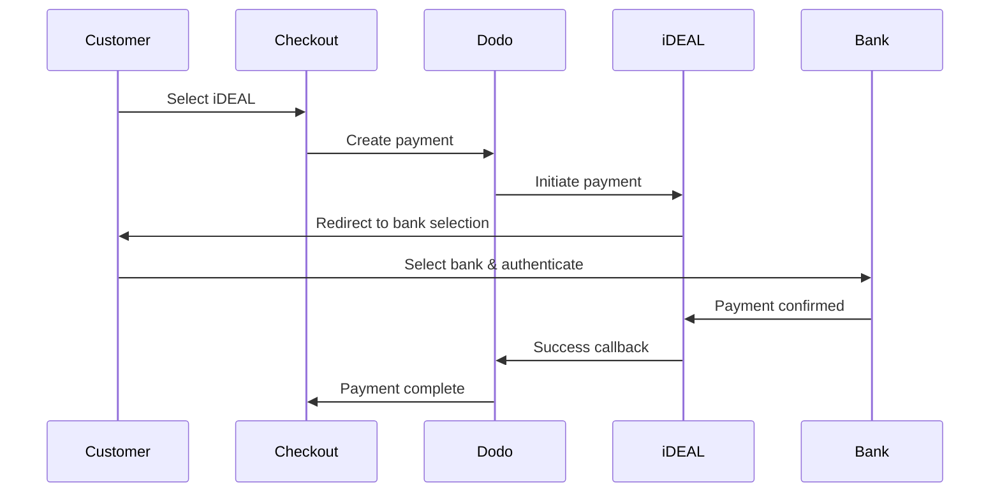
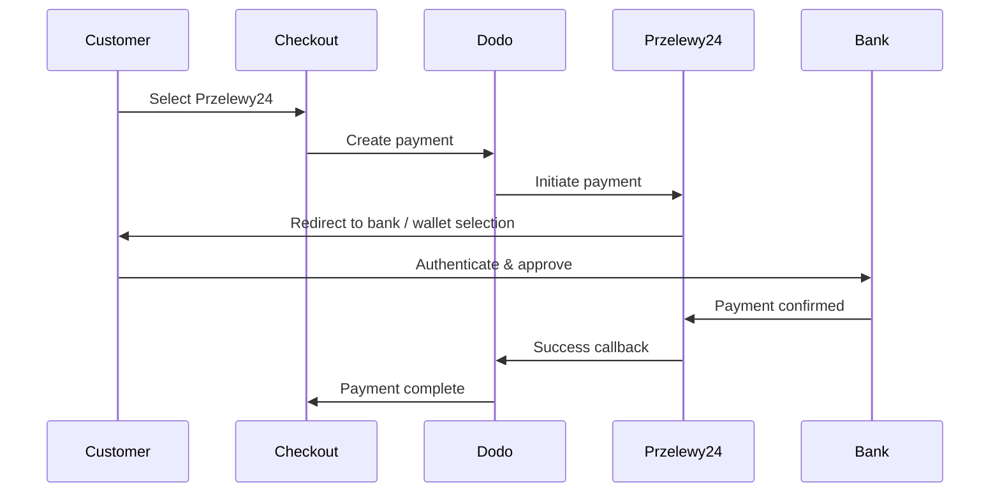
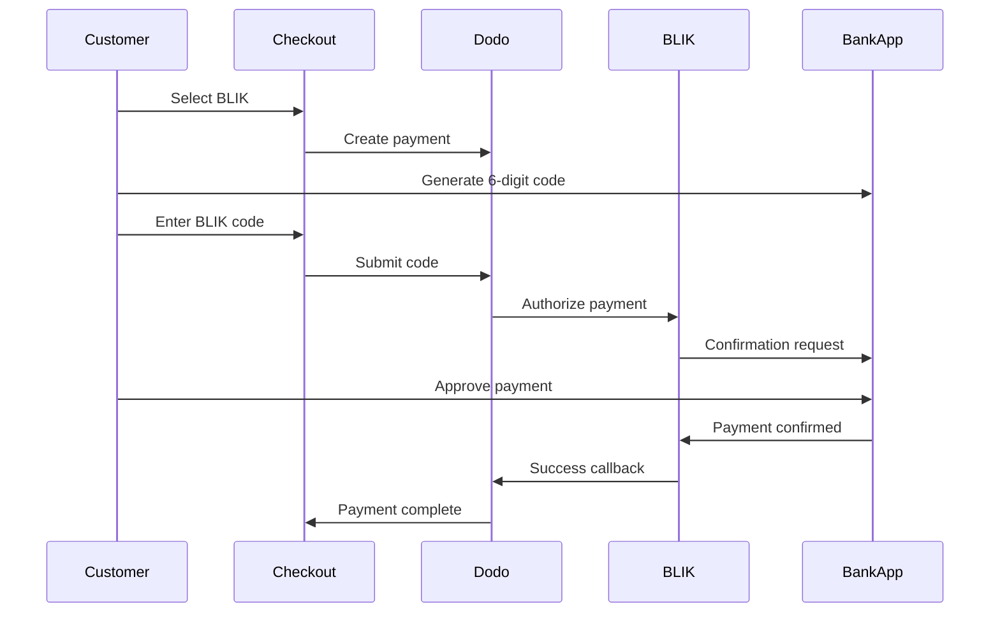

Europäische Kunden bevorzugen stark lokale Zahlungsmethoden, die sich in ihre Banksysteme integrieren. Diese Methoden anzubieten, kann die Konversionsraten in Zielmärkten um 20-40 % erhöhen.

## Warum lokale europäische Zahlungsmethoden?

<CardGroup cols={3}>
<Card title="Higher Conversion" icon="chart-line">
iDEAL erfasst ~60 % der niederländischen Online-Zahlungen. Wenn Sie es nicht anbieten, verlieren Sie Kunden.
</Card>

<Card title="Lower Fraud" icon="shield-check">
Bankauthentifizierte Zahlungen haben nahezu null Betrugsraten und keine Rückbuchungen.
</Card>

<Card title="Real-Time Settlement" icon="bolt">
Die meisten europäischen Methoden liefern sofortige Zahlungsbestätigungen.
</Card>
</CardGroup>

## Unterstützte Methoden

| Methode | Land | Marktanteil | Währung | Abonnements |
| :----- | :------ | :----------- | :------- | :-----------: |
| **iDEAL** | Niederlande | ~60 % | EUR | Nein |
| **Bancontact** | Belgien | ~50 % | EUR | Nein |
| **EPS** | Österreich | ~30 % | EUR | Nein |
| **Multibanco** | Portugal | ~40 % | EUR | Nein |
| **Przelewy24 (P24)** | Polen | ~30 % | PLN | Nein |
| **BLIK** | Polen | ~60 % | PLN | Nein |
| **SEPA Direct Debit** | Eurozone | Weit verbreitet | EUR | Nein |
| **Satispay** | Europa (Italien) | Wachsend | EUR | Ja |

## iDEAL (Niederlande)

iDEAL ist die dominierende Online-Zahlungsmethode in den Niederlanden und verbindet sich direkt mit allen großen niederländischen Banken.

### Funktionsweise



### Unterstützte Banken

Alle großen niederländischen Banken werden unterstützt:
- ABN AMRO
- ASN Bank
- Bunq
- ING
- Knab
- Rabobank
- RegioBank
- Revolut
- SNS
- Triodos Bank
- Van Lanschot

### Konfiguration

```javascript
const session = await client.checkoutSessions.create({
  product_cart: [{ product_id: 'prod_123', quantity: 1 }],
  allowed_payment_method_types: ['ideal', 'credit', 'debit'],
  billing_currency: 'EUR',
  billing_address: {
    country: 'NL',
    zipcode: '1012JS'
  },
  return_url: 'https://example.com/success'
});
```

## Bancontact (Belgien)

Bancontact ist das nationale Zahlungssystem Belgiens, das von nahezu allen belgischen Banken für Online-Zahlungen genutzt wird.

### Funktionen
- Funktioniert mit bestehenden belgischen Debitkarten
- Unterstützung durch Mobile Apps (Payconiq von Bancontact)
- Sofortige Zahlungsbestätigung
- Keine zusätzliche Registrierung für Kunden erforderlich

### Konfiguration

```javascript
const session = await client.checkoutSessions.create({
  product_cart: [{ product_id: 'prod_123', quantity: 1 }],
  allowed_payment_method_types: ['bancontact_card', 'credit', 'debit'],
  billing_currency: 'EUR',
  billing_address: {
    country: 'BE',
    zipcode: '1000'
  },
  return_url: 'https://example.com/success'
});
```

## EPS (Österreich)

EPS (Electronic Payment Standard) ermöglicht direkte Online-Banküberweisungen für österreichische Kunden.

### Funktionen
- Direkte Integration mit österreichischen Banken
- Echtzeit-Zahlungsbestätigung
- Hohe Vertrauenswürdigkeit bei österreichischen Verbrauchern
- Keine Rückbuchungen

### Unterstützte Banken

Wichtige österreichische Banken, darunter:
- Erste Bank
- Bank Austria
- Raiffeisen
- BAWAG
- Volksbank

### Konfiguration

```javascript
const session = await client.checkoutSessions.create({
  product_cart: [{ product_id: 'prod_123', quantity: 1 }],
  allowed_payment_method_types: ['eps', 'credit', 'debit'],
  billing_currency: 'EUR',
  billing_address: {
    country: 'AT',
    zipcode: '1010'
  },
  return_url: 'https://example.com/success'
});
```

## Multibanco (Portugal)

Multibanco ist Portugals Interbanken-Netzwerk, das sowohl Online-Zahlungen als auch Zahlungen über Geldautomaten anbietet.

### Zahlungsoptionen

1. **Online-Banking** — Direkte Banküberweisung über Internet-Banking
2. **Zahlung am Geldautomaten** — Kunde erhält eine Referenz, um an jedem Multibanco-Geldautomaten zu zahlen
3. **Mobile Banking** — Zahlung über Bank-Apps

### Funktionsweise der Geldautomaten-Zahlung

Bei Zahlungen am Geldautomaten erhält der Kunde eine Zahlungsreferenz:

```
Entity: 12345
Reference: 123 456 789
Amount: €50.00
Expiry: 24 hours
```

Der Kunde kann an jedem portugiesischen Geldautomaten oder über Internet-Banking mit dieser Referenz bezahlen.

### Konfiguration

```javascript
const session = await client.checkoutSessions.create({
  product_cart: [{ product_id: 'prod_123', quantity: 1 }],
  allowed_payment_method_types: ['multibanco', 'credit', 'debit'],
  billing_currency: 'EUR',
  billing_address: {
    country: 'PT',
    zipcode: '1000-001'
  },
  return_url: 'https://example.com/success'
});
```

<Note>
Multibanco-Geldautomaten-Zahlungen können eine Verzögerung zwischen Checkout und tatsächlicher Zahlung aufweisen. Überwachen Sie Webhooks zur Zahlungsbestätigung.
</Note>

## Przelewy24 (Polen)

Przelewy24 (P24) ist Polens führende Online-Zahlungsmethode und aggregiert Banküberweisungen und lokale Wallets aller großen polnischen Banken. Im Gegensatz zu den anderen europäischen Methoden wird Przelewy24 in **PLN** (Polnischer Złoty) und nicht in EUR abgerechnet.

### Funktionsweise



### Verfügbarkeit

- **Abrechnungswährung:** Nur PLN
- **Transaktionstyp:** Nur einmalige Zahlungen (nicht verfügbar für Abonnements)
- **Abdeckung:** Alle großen polnischen Banken plus beliebte lokale Wallets

### Konfiguration

```javascript
const session = await client.checkoutSessions.create({
  product_cart: [{ product_id: 'prod_123', quantity: 1 }],
  allowed_payment_method_types: ['przelewy24', 'credit', 'debit'],
  billing_currency: 'PLN',
  billing_address: {
    country: 'PL',
    zipcode: '00-001'
  },
  return_url: 'https://example.com/success'
});
```

<Note>
Przelewy24 erfordert eine **PLN**-Abrechnungswährung. Wenn Sie Ihre Preise in EUR angeben, aktivieren Sie [Adaptive Currency](/features/adaptive-currency), damit polnische Kunden in PLN abgerechnet werden und Przelewy24 verfügbar wird.
</Note>

## BLIK (Polen)

BLIK ist die beliebteste mobile Zahlungsmethode in Polen und ermöglicht Kunden, mit einem einmaligen 6-stelligen Code zu bezahlen, der in ihrer Banking-App generiert wird. Wie Przelewy24 wird BLIK in **PLN** (Polnischer Złoty) und nicht in EUR abgerechnet.

### Funktionsweise



### Verfügbarkeit

- **Abrechnungswährung:** Nur PLN
- **Transaktionstyp:** Nur Einmalzahlungen (nicht verfügbar für Abonnements)
- **Abdeckung:** Alle großen polnischen Banken unterstützen BLIK

### Konfiguration

```javascript
const session = await client.checkoutSessions.create({
  product_cart: [{ product_id: 'prod_123', quantity: 1 }],
  allowed_payment_method_types: ['blik', 'credit', 'debit'],
  billing_currency: 'PLN',
  billing_address: {
    country: 'PL',
    zipcode: '00-001'
  },
  return_url: 'https://example.com/success'
});
```

<Note>
BLIK erfordert eine **PLN**-Abrechnungswährung. Wenn Sie Ihre Preise in EUR angeben, aktivieren Sie [Adaptive Currency](/features/adaptive-currency), damit polnische Kunden in PLN abgerechnet werden und BLIK verfügbar wird.
</Note>

## SEPA Direct Debit (Eurozone)

Mit SEPA Direct Debit können Kunden in der gesamten Eurozone direkt von ihrem Bankkonto bezahlen, anstatt eine Karte zu verwenden. Die Zahlungsmethode wird bei EUR-checkouts für einmalige Zahlungen angeboten.

### Funktionsweise

Der Kunde autorisiert die Lastschrift während des checkouts, und die Zahlung wird von seinem Bankkonto eingezogen. Anders als bei den meisten europäischen Zahlungsmethoden auf dieser Seite erfolgt die Bestätigung nicht sofort.

<Warning>
SEPA Direct Debit ist nicht sofort. Die Bestätigung einer Zahlung dauert **6 Werktage**. Behandeln Sie die Autorisierung daher nicht als Abrechnung — führen Sie die Bestellung erst aus, wenn die Zahlung den Status „succeeded“ erreicht.
</Warning>

### Verfügbarkeit

- **Abrechnungswährung:** EUR
- **Transaktionstyp:** Nur einmalige Zahlungen (nicht für Abonnements verfügbar)

### Konfiguration

```javascript
const session = await client.checkoutSessions.create({
  product_cart: [{ product_id: 'prod_123', quantity: 1 }],
  allowed_payment_method_types: ['sepa', 'credit', 'debit'],
  billing_currency: 'EUR',
  billing_address: {
    country: 'DE',
    zipcode: '10115'
  },
  return_url: 'https://example.com/success'
});
```

## Satispay (Europa)

Satispay ist ein beliebtes europäisches mobiles Zahlungsnetzwerk, insbesondere in Italien. Kunden können damit direkt über ihre Satispay-App bezahlen, ohne Karten- oder Bankdaten zu teilen. Satispay rechnet in **EUR** ab.

### Funktionen

- App-basierte Zahlungen unabhängig von Kartennetzwerken
- Hohe Verbreitung in Italien und zunehmende Nutzung in anderen europäischen Märkten
- Unterstützt sowohl einmalige Zahlungen als auch Abonnements

### Verfügbarkeit

- **Abrechnungswährung:** EUR
- **Transaktionstyp:** Einmalige Zahlungen und Abonnements

### Konfiguration

```javascript
const session = await client.checkoutSessions.create({
  product_cart: [{ product_id: 'prod_123', quantity: 1 }],
  allowed_payment_method_types: ['satispay', 'credit', 'debit'],
  billing_currency: 'EUR',
  billing_address: {
    country: 'IT',
    zipcode: '00100'
  },
  return_url: 'https://example.com/success'
});
```

## API-Methodentypen

| Typ | Methode | Land |
| :--- | :----- | :------ |
| `ideal` | iDEAL | Niederlande |
| `bancontact_card` | Bancontact | Belgien |
| `eps` | EPS | Österreich |
| `multibanco` | Multibanco | Portugal |
| `przelewy24` | Przelewy24 (P24) | Polen |
| `blik` | BLIK | Polen |
| `sepa` | SEPA Direct Debit | Eurozone |
| `satispay` | Satispay | Europa (Italien) |

## Europäischer Checkout für mehrere Länder

Unternehmen, die Kunden in mehreren europäischen Ländern bedienen, sollten alle regionalen Zahlungsmethoden einbinden:

```javascript
const session = await client.checkoutSessions.create({
  product_cart: [{ product_id: 'prod_123', quantity: 1 }],
  allowed_payment_method_types: [
    'ideal',           // Netherlands
    'bancontact_card', // Belgium
    'eps',             // Austria
    'multibanco',      // Portugal
    'przelewy24',      // Poland (requires PLN billing currency)
    'blik',            // Poland (requires PLN billing currency)
    'sepa',            // Eurozone (one-time payments only)
    'satispay',        // Europe / Italy
    'credit',          // Fallback
    'debit'            // Fallback
  ],
  billing_currency: 'EUR',
  return_url: 'https://example.com/success'
});
```

Dodo zeigt automatisch nur die relevanten Zahlungsmethoden basierend auf dem Standort des Kunden an. Ein niederländischer Kunde sieht iDEAL, ein belgischer Kunde Bancontact.

## Testen

Europäische Zahlungsmethoden können im Sandbox-Modus getestet werden. Der Testablauf simuliert den Bankauthentifizierungsprozess.

<Steps>
<Step title="Enable test mode">
Verwenden Sie Ihre Test-API-Schlüssel von Dodo Payments.
</Step>

<Step title="Set appropriate billing address">
Legen Sie das Land der Rechnungsadresse passend zur Zahlungsmethode fest:
- `NL` für iDEAL
- `BE` für Bancontact
- `AT` für EPS
- `PT` für Multibanco
- `PL` für Przelewy24 und BLIK (mit PLN als Abrechnungswährung)
- `IT` für Satispay
</Step>

<Step title="Complete the test flow">
Folgen Sie dem simulierten Bankauthentifizierungsprozess in der Testumgebung.
</Step>
</Steps>

## Best Practices

<AccordionGroup>
<Accordion title="Always include regional methods for target markets">
Wenn Sie an niederländische Kunden verkaufen, binden Sie iDEAL ein. Darauf zu verzichten ist so, als würden Sie in den USA keine Visa akzeptieren — Sie verlieren dadurch erhebliche Umsätze.
</Accordion>

<Accordion title="Match currency to region">
Die meisten europäischen Zahlungsmethoden erfordern EUR — stellen Sie sicher, dass Ihre Preisgestaltung Transaktionen in Euro unterstützt. Die einzige Ausnahme ist Przelewy24, das ausschließlich mit **PLN** (Polnischer Złoty) als Abrechnungswährung angeboten wird.
</Accordion>

<Accordion title="Handle redirects gracefully">
Alle europäischen Zahlungsmethoden leiten auf Bank-Websites weiter. Stellen Sie sicher, dass die Verarbeitung Ihrer Rückgabe-URL robust ist und Nutzer berücksichtigt, die den Ablauf mittendrin abbrechen.
</Accordion>

<Accordion title="Provide card fallbacks">
Nicht alle europäischen Kunden haben Zugriff auf diese regionalen Zahlungsmethoden (Touristen, Expats usw.). Binden Sie immer `credit` und `debit` als Fallbacks ein.
</Accordion>

<Accordion title="Consider Multibanco timing">
Zahlungen an Multibanco-Geldautomaten können mehrere Stunden dauern. Blockieren Sie die Ausführung der Bestellung nicht wegen einer sofortigen Zahlung — verwenden Sie Webhooks für die asynchrone Bestätigung.
</Accordion>
</AccordionGroup>

## Fehlerbehebung

<AccordionGroup>
<Accordion title="European method not appearing">
**Prüfen Sie:**
1. Stimmt das Rechnungsland des Kunden mit dem Land der Zahlungsmethode überein?
2. Ist die Währung auf EUR festgelegt?
3. Ist die Zahlungsmethode in `allowed_payment_method_types` enthalten?

**Lösung:** Europäische Zahlungsmethoden sind streng regional begrenzt. Ein Kunde mit dem Rechnungsland `DE` (Deutschland) sieht iDEAL nicht, da diese Zahlungsmethode ausschließlich in den Niederlanden verfügbar ist.
</Accordion>

<Accordion title="Bank authentication failed">
**Ursachen:**
- Der Kunde hat die Bankauthentifizierung abgebrochen
- Das Authentifizierungssystem der Bank ist vorübergehend nicht verfügbar
- Der Kunde hat falsche Anmeldedaten eingegeben

**Lösung:** Der Kunde sollte es erneut versuchen. Wenn das Problem weiterhin besteht, empfehlen Sie eine andere Zahlungsmethode.
</Accordion>

<Accordion title="Redirect not completing">
**Ursachen:**
- Der Kunde hat den Browser während der Weiterleitung zur Bank geschlossen
- Netzwerkprobleme während der Authentifizierung
- Die Rückgabe-URL ist falsch konfiguriert

**Lösung:** Überprüfen Sie, ob die Rückgabe-URL korrekt und erreichbar ist. Stellen Sie sicher, dass sie sowohl Erfolgs- als auch Fehlerstatus verarbeitet.
</Accordion>

<Accordion title="Multibanco payment pending">
**Ursache:** Der Kunde hat eine Zahlungsreferenz erhalten, aber noch nicht bezahlt.

**Lösung:** Dies ist bei Zahlungen an Geldautomaten erwartungsgemäß. Warten Sie auf die Bestätigung per Webhook. Die Referenz läuft normalerweise nach 24–72 Stunden ab.
</Accordion>
</AccordionGroup>

## PSD2-Konformität

Alle europäischen Zahlungsmethoden erfüllen die PSD2-Vorschriften (Payment Services Directive 2):

- **Starke Kundenauthentifizierung (SCA)** — In den Bankauthentifizierungsprozess integriert
- **Sichere Kommunikation** — Alle Daten werden über sichere Kanäle übertragen
- **Verbraucherschutz** — Vollständige Einhaltung der EU-Verbraucherrechte

## Verwandte Seiten

<CardGroup cols={2}>
<Card title="Payment Methods Overview" icon="credit-card" href="/features/payment-methods">
Alle unterstützten Zahlungsmethoden anzeigen.
</Card>

<Card title="Adaptive Currency" icon="globe" href="/features/adaptive-currency">
Unterstützte Währungen und automatische Konvertierung.
</Card>

<Card title="Checkout Guide" icon="book" href="/developer-resources/checkout-session">
Vollständiger Leitfaden zur Implementierung des checkouts.
</Card>

<Card title="Webhooks" icon="webhook" href="/developer-resources/webhooks">
Zahlungsbestätigungen asynchron verarbeiten.
</Card>
</CardGroup>