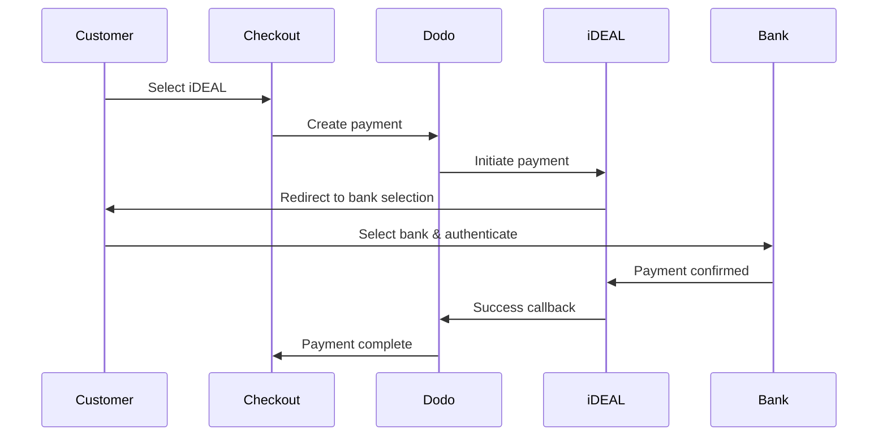
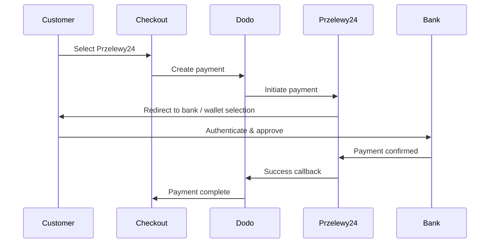
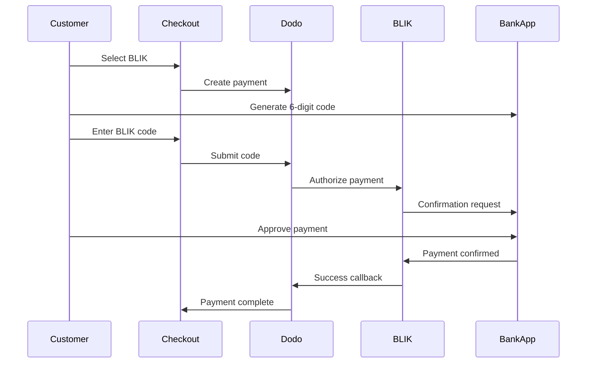

Europäische Kunden bevorzugen stark lokale Zahlungsmethoden, die sich in ihre Banksysteme integrieren. Diese Methoden anzubieten, kann die Konversionsraten in Zielmärkten um 20-40 % erhöhen.

## Warum lokale europäische Zahlungsmethoden?

<CardGroup cols={3}>
<Card title="Higher Conversion" icon="chart-line">
iDEAL erfasst ~60 % der niederländischen Online-Zahlungen. Wenn Sie es nicht anbieten, verlieren Sie Kunden.
</Card>

<Card title="Lower Fraud" icon="shield-check">
Bankauthentifizierte Zahlungen haben nahezu null Betrugsraten und keine Rückbuchungen.
</Card>

<Card title="Real-Time Settlement" icon="bolt">
Die meisten europäischen Methoden liefern sofortige Zahlungsbestätigungen.
</Card>
</CardGroup>

## Unterstützte Methoden

| Methode | Land | Marktanteil | Währung | Abonnements |
| :------ | :--- | :---------- | :------ | :----------: |
| **iDEAL** | Niederlande | ~60% | EUR | Nein |
| **Bancontact** | Belgien | ~50% | EUR | Nein |
| **EPS** | Österreich | ~30% | EUR | Nein |
| **Multibanco** | Portugal | ~40% | EUR | Nein |
| **Przelewy24 (P24)** | Polen | ~30% | PLN | Nein |
| **BLIK** | Polen | ~60% | PLN | Nein |
| **Satispay** | Europa (Italien) | Wachsend | EUR | Ja |

## iDEAL (Niederlande)

iDEAL ist die dominierende Online-Zahlungsmethode in den Niederlanden und verbindet sich direkt mit allen großen niederländischen Banken.

### Funktionsweise



### Unterstützte Banken

Alle großen niederländischen Banken werden unterstützt:
- ABN AMRO
- ASN Bank
- Bunq
- ING
- Knab
- Rabobank
- RegioBank
- Revolut
- SNS
- Triodos Bank
- Van Lanschot

### Konfiguration

```javascript
const session = await client.checkoutSessions.create({
  product_cart: [{ product_id: 'prod_123', quantity: 1 }],
  allowed_payment_method_types: ['ideal', 'credit', 'debit'],
  billing_currency: 'EUR',
  billing_address: {
    country: 'NL',
    zipcode: '1012JS'
  },
  return_url: 'https://example.com/success'
});
```

## Bancontact (Belgien)

Bancontact ist das nationale Zahlungssystem Belgiens, das von nahezu allen belgischen Banken für Online-Zahlungen genutzt wird.

### Funktionen
- Funktioniert mit bestehenden belgischen Debitkarten
- Unterstützung durch Mobile Apps (Payconiq von Bancontact)
- Sofortige Zahlungsbestätigung
- Keine zusätzliche Registrierung für Kunden erforderlich

### Konfiguration

```javascript
const session = await client.checkoutSessions.create({
  product_cart: [{ product_id: 'prod_123', quantity: 1 }],
  allowed_payment_method_types: ['bancontact_card', 'credit', 'debit'],
  billing_currency: 'EUR',
  billing_address: {
    country: 'BE',
    zipcode: '1000'
  },
  return_url: 'https://example.com/success'
});
```

## EPS (Österreich)

EPS (Electronic Payment Standard) ermöglicht direkte Online-Banküberweisungen für österreichische Kunden.

### Funktionen
- Direkte Integration mit österreichischen Banken
- Echtzeit-Zahlungsbestätigung
- Hohe Vertrauenswürdigkeit bei österreichischen Verbrauchern
- Keine Rückbuchungen

### Unterstützte Banken

Wichtige österreichische Banken, darunter:
- Erste Bank
- Bank Austria
- Raiffeisen
- BAWAG
- Volksbank

### Konfiguration

```javascript
const session = await client.checkoutSessions.create({
  product_cart: [{ product_id: 'prod_123', quantity: 1 }],
  allowed_payment_method_types: ['eps', 'credit', 'debit'],
  billing_currency: 'EUR',
  billing_address: {
    country: 'AT',
    zipcode: '1010'
  },
  return_url: 'https://example.com/success'
});
```

## Multibanco (Portugal)

Multibanco ist Portugals Interbanken-Netzwerk, das sowohl Online-Zahlungen als auch Zahlungen über Geldautomaten anbietet.

### Zahlungsoptionen

1. **Online-Banking** — Direkte Banküberweisung über Internet-Banking
2. **Zahlung am Geldautomaten** — Kunde erhält eine Referenz, um an jedem Multibanco-Geldautomaten zu zahlen
3. **Mobile Banking** — Zahlung über Bank-Apps

### Funktionsweise der Geldautomaten-Zahlung

Bei Zahlungen am Geldautomaten erhält der Kunde eine Zahlungsreferenz:

```
Entity: 12345
Reference: 123 456 789
Amount: €50.00
Expiry: 24 hours
```

Der Kunde kann an jedem portugiesischen Geldautomaten oder über Internet-Banking mit dieser Referenz bezahlen.

### Konfiguration

```javascript
const session = await client.checkoutSessions.create({
  product_cart: [{ product_id: 'prod_123', quantity: 1 }],
  allowed_payment_method_types: ['multibanco', 'credit', 'debit'],
  billing_currency: 'EUR',
  billing_address: {
    country: 'PT',
    zipcode: '1000-001'
  },
  return_url: 'https://example.com/success'
});
```

<Note>
Multibanco-Geldautomaten-Zahlungen können eine Verzögerung zwischen Checkout und tatsächlicher Zahlung aufweisen. Überwachen Sie Webhooks zur Zahlungsbestätigung.
</Note>

## Przelewy24 (Polen)

Przelewy24 (P24) ist Polens führende Online-Zahlungsmethode und aggregiert Banküberweisungen und lokale Wallets aller großen polnischen Banken. Im Gegensatz zu den anderen europäischen Methoden wird Przelewy24 in **PLN** (Polnischer Złoty) und nicht in EUR abgerechnet.

### Funktionsweise



### Verfügbarkeit

- **Abrechnungswährung:** Nur PLN
- **Transaktionstyp:** Nur einmalige Zahlungen (nicht verfügbar für Abonnements)
- **Abdeckung:** Alle großen polnischen Banken plus beliebte lokale Wallets

### Konfiguration

```javascript
const session = await client.checkoutSessions.create({
  product_cart: [{ product_id: 'prod_123', quantity: 1 }],
  allowed_payment_method_types: ['przelewy24', 'credit', 'debit'],
  billing_currency: 'PLN',
  billing_address: {
    country: 'PL',
    zipcode: '00-001'
  },
  return_url: 'https://example.com/success'
});
```

<Note>
Przelewy24 erfordert eine **PLN**-Abrechnungswährung. Wenn Sie Ihre Preise in EUR angeben, aktivieren Sie [Adaptive Currency](/features/adaptive-currency), damit polnische Kunden in PLN abgerechnet werden und Przelewy24 verfügbar wird.
</Note>

## BLIK (Polen)

BLIK ist die beliebteste mobile Zahlungsmethode in Polen und ermöglicht Kunden, mit einem einmaligen 6-stelligen Code zu bezahlen, der in ihrer Banking-App generiert wird. Wie Przelewy24 wird BLIK in **PLN** (Polnischer Złoty) und nicht in EUR abgerechnet.

### Funktionsweise



### Verfügbarkeit

- **Abrechnungswährung:** Nur PLN
- **Transaktionstyp:** Nur Einmalzahlungen (nicht verfügbar für Abonnements)
- **Abdeckung:** Alle großen polnischen Banken unterstützen BLIK

### Konfiguration

```javascript
const session = await client.checkoutSessions.create({
  product_cart: [{ product_id: 'prod_123', quantity: 1 }],
  allowed_payment_method_types: ['blik', 'credit', 'debit'],
  billing_currency: 'PLN',
  billing_address: {
    country: 'PL',
    zipcode: '00-001'
  },
  return_url: 'https://example.com/success'
});
```

<Note>
BLIK erfordert eine **PLN**-Abrechnungswährung. Wenn Sie Ihre Preise in EUR angeben, aktivieren Sie [Adaptive Currency](/features/adaptive-currency), damit polnische Kunden in PLN abgerechnet werden und BLIK verfügbar wird.
</Note>

## Satispay (Europa)

Satispay ist ein beliebtes europäisches mobiles Zahlungsnetzwerk, besonders in Italien, das es Kunden ermöglicht, direkt über ihre Satispay-App zu bezahlen, ohne Karten- oder Bankdaten zu teilen. Satispay wird in **EUR** abgerechnet.

### Funktionen

- App-basierte Zahlungen unabhängig von Kartennetzwerken
- Starke Akzeptanz in Italien und wachsend in anderen europäischen Märkten
- Unterstützt sowohl Einmalzahlungen als auch Abonnements

### Verfügbarkeit

- **Abrechnungswährung:** EUR
- **Transaktionstyp:** Einmalzahlungen und Abonnements

### Konfiguration

```javascript
const session = await client.checkoutSessions.create({
  product_cart: [{ product_id: 'prod_123', quantity: 1 }],
  allowed_payment_method_types: ['satispay', 'credit', 'debit'],
  billing_currency: 'EUR',
  billing_address: {
    country: 'IT',
    zipcode: '00100'
  },
  return_url: 'https://example.com/success'
});
```

## API-Methodentypen

| Typ | Methode | Land |
| :--- | :------ | :--- |
| `ideal` | iDEAL | Niederlande |
| `bancontact_card` | Bancontact | Belgien |
| `eps` | EPS | Österreich |
| `multibanco` | Multibanco | Portugal |
| `przelewy24` | Przelewy24 (P24) | Polen |
| `blik` | BLIK | Polen |
| `satispay` | Satispay | Europa (Italien) |

## Europäischer Multi-Länder-Checkout

Für Unternehmen, die mehrere europäische Länder bedienen, beinhalten Sie alle regionalen Methoden:

```javascript
const session = await client.checkoutSessions.create({
  product_cart: [{ product_id: 'prod_123', quantity: 1 }],
  allowed_payment_method_types: [
    'ideal',           // Netherlands
    'bancontact_card', // Belgium
    'eps',             // Austria
    'multibanco',      // Portugal
    'przelewy24',      // Poland (requires PLN billing currency)
    'blik',            // Poland (requires PLN billing currency)
    'satispay',        // Europe / Italy
    'credit',          // Fallback
    'debit'            // Fallback
  ],
  billing_currency: 'EUR',
  return_url: 'https://example.com/success'
});
```

Dodo zeigt automatisch nur die relevanten Methoden basierend auf dem Standort des Kunden an. Ein niederländischer Kunde sieht iDEAL; ein belgischer Kunde sieht Bancontact.

## Testing

Europäische Zahlungsmethoden können im Sandkastenmodus getestet werden. Der Testfluss simuliert den Bank-Authentifizierungsprozess.

<Steps>
<Step title="Enable test mode">
Verwenden Sie Ihre Dodo Payments Test-API-Schlüssel.
</Step>

<Step title="Set appropriate billing address">
Setzen Sie das Abrechnungsland, um die Zahlungsmethode abzugleichen:
- `NL` für iDEAL
- `BE` für Bancontact
- `AT` für EPS
- `PT` für Multibanco
- `PL` für Przelewy24 und BLIK (bei PLN-Abrechnung)
- `IT` für Satispay
</Step>

<Step title="Complete the test flow">
Folgen Sie dem simulierten Bank-Authentifizierungsfluss in der Testumgebung.
</Step>
</Steps>

## Best Practices

<AccordionGroup>
<Accordion title="Always include regional methods for target markets">
Wenn Sie an niederländische Kunden verkaufen, fügen Sie iDEAL hinzu. Wenn nicht, verlieren Sie erhebliche Einnahmen, ähnlich wie bei der Nichtakzeptanz von Visa in den USA.
</Accordion>

<Accordion title="Match currency to region">
Die meisten europäischen Zahlungsmethoden erfordern EUR — stellen Sie sicher, dass Ihre Preisgestaltung Euro-Transaktionen unterstützt. Die einzige Ausnahme ist Przelewy24, das nur für **PLN**-Abrechnung angeboten wird.
</Accordion>

<Accordion title="Handle redirects gracefully">
Alle europäischen Methoden beinhalten Umleitungen zu Bankseiten. Stellen Sie sicher, dass Ihre Handhabung der Rückkehr-URL robust ist und auch für Benutzer gilt, die den Fluss abbrechen.
</Accordion>

<Accordion title="Provide card fallbacks">
Nicht alle europäischen Kunden haben Zugang zu diesen regionalen Methoden (Touristen, Expats, etc.). Fügen Sie immer `credit` und `debit` als Fallbacks hinzu.
</Accordion>

<Accordion title="Consider Multibanco timing">
Multibanco-ATM-Zahlungen können Stunden dauern, bis sie abgeschlossen sind. Blockieren Sie die Erfüllung nicht auf unmittelbare Zahlung — nutzen Sie Webhooks für asynchrone Bestätigung.
</Accordion>
</AccordionGroup>

## Fehlerbehebung

<AccordionGroup>
<Accordion title="European method not appearing">
**Prüfen:**
1. Abrechnungsland des Kunden entspricht dem Land der Methode?
2. Währung auf EUR gesetzt?
3. Methode in `allowed_payment_method_types` enthalten?

**Lösung:** Europäische Methoden sind strikt regional. Ein Kunde mit dem Abrechnungsland `DE` (Deutschland) wird iDEAL nicht sehen, welches nur in den Niederlanden verfügbar ist.
</Accordion>

<Accordion title="Bank authentication failed">
**Ursachen:**
- Kunde hat während der Bankauthentifizierung abgebrochen
- Authentifizierungssystem der Bank vorübergehend nicht verfügbar
- Kunde hat falsche Zugangsdaten eingegeben

**Lösung:** Kunde sollte es erneut versuchen. Bei anhaltenden Problemen empfehlen Sie, eine andere Zahlungsmethode auszuprobieren.
</Accordion>

<Accordion title="Redirect not completing">
**Ursachen:**
- Kunde hat den Browser während der Bankumleitung geschlossen
- Netzwerkprobleme während der Authentifizierung
- Rückkehr-URL falsch konfiguriert

**Lösung:** Überprüfen Sie, ob die Rückkehr-URL korrekt und zugänglich ist. Stellen Sie sicher, dass sie sowohl Erfolg- als auch Fehlerzustände behandelt.
</Accordion>

<Accordion title="Multibanco payment pending">
**Ursache:** Kunde hat Zahlungsreferenz erhalten, aber noch nicht bezahlt.

**Lösung:** Dies ist bei ATM-basierten Zahlungen zu erwarten. Warten Sie auf die Webhook-Bestätigung. Die Referenz läuft in der Regel in 24-72 Stunden ab.
</Accordion>
</AccordionGroup>

## PSD2-Konformität

Alle europäischen Zahlungsmethoden entsprechen den PSD2 (Payment Services Directive 2) Richtlinien:

- **Starke Kundenauthentifizierung (SCA)** — Eingebaut in den Bank-Authentifizierungsfluss
- **Sichere Kommunikation** — Alle Daten werden über sichere Kanäle übertragen
- **Verbraucherschutz** — Volle Konformität mit den Rechten der EU-Verbraucher

## Verwandte Seiten

<CardGroup cols={2}>
<Card title="Payment Methods Overview" icon="credit-card" href="/features/payment-methods">
Alle unterstützten Zahlungsmethoden anzeigen.
</Card>

<Card title="Adaptive Currency" icon="globe" href="/features/adaptive-currency">
Währungsunterstützung und automatische Konvertierung.
</Card>

<Card title="Checkout Guide" icon="book" href="/developer-resources/checkout-session">
Komplettes Checkout-Implementierungshandbuch.
</Card>

<Card title="Webhooks" icon="webhook" href="/developer-resources/webhooks">
Zahlungsbestätigungen asynchron bearbeiten.
</Card>
</CardGroup>