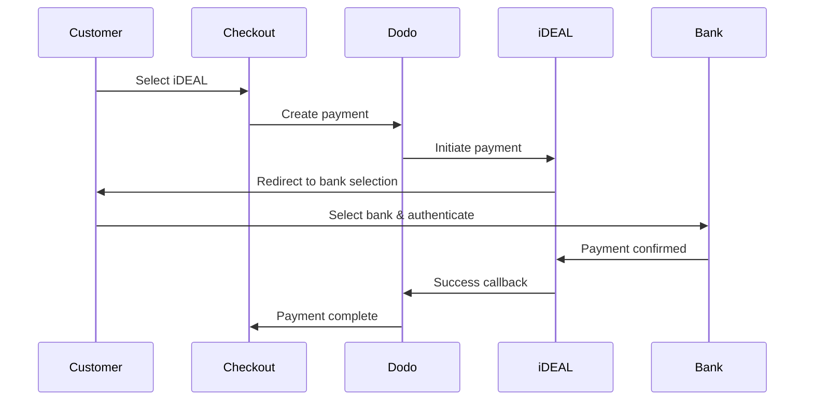
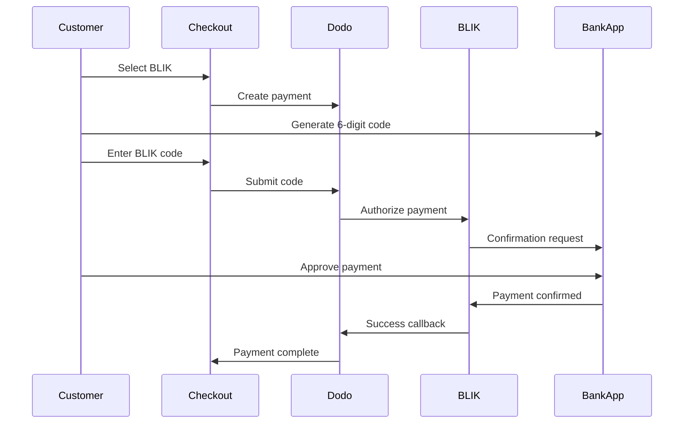
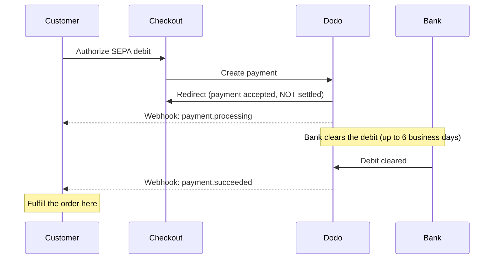

Europäische Kunden bevorzugen stark lokale Zahlungsmethoden, die sich in ihre Banksysteme integrieren. Diese Methoden anzubieten, kann die Konversionsraten in Zielmärkten um 20-40 % erhöhen.

## Warum lokale europäische Zahlungsmethoden?

<CardGroup cols={3}>
<Card title="Higher Conversion" icon="chart-line">
iDEAL erfasst ~60 % der niederländischen Online-Zahlungen. Wenn Sie es nicht anbieten, verlieren Sie Kunden.
</Card>

<Card title="Lower Fraud" icon="shield-check">
Bankauthentifizierte Zahlungen haben nahezu null Betrugsraten und keine Rückbuchungen.
</Card>

<Card title="Real-Time Settlement" icon="bolt">
Die meisten europäischen Methoden liefern sofortige Zahlungsbestätigungen.
</Card>
</CardGroup>

## Unterstützte Methoden

| Methode | Land | Marktanteil | Währung | Abonnements |
| :----- | :------ | :----------- | :------- | :-----------: |
| **iDEAL** | Niederlande | ~60 % | EUR | Nein |
| **Bancontact** | Belgien | ~50 % | EUR | Nein |
| **EPS** | Österreich | ~30 % | EUR | Nein |
| **Multibanco** | Portugal | ~40 % | EUR | Nein |
| **BLIK** | Polen | ~60 % | PLN | Nein |
| **SEPA Direct Debit** | Eurozone | Weit verbreitet | EUR | Nein |
| **Satispay** | Europa (Italien) | Wachsend | EUR | Ja |

## iDEAL (Niederlande)

iDEAL ist die dominierende Online-Zahlungsmethode in den Niederlanden und verbindet sich direkt mit allen großen niederländischen Banken.

### Funktionsweise



### Unterstützte Banken

Alle großen niederländischen Banken werden unterstützt:
- ABN AMRO
- ASN Bank
- Bunq
- ING
- Knab
- Rabobank
- RegioBank
- Revolut
- SNS
- Triodos Bank
- Van Lanschot

### Konfiguration

```javascript
const session = await client.checkoutSessions.create({
  product_cart: [{ product_id: 'pdt_123', quantity: 1 }],
  allowed_payment_method_types: ['ideal', 'credit', 'debit'],
  billing_currency: 'EUR',
  billing_address: {
    country: 'NL',
    zipcode: '1012JS'
  },
  return_url: 'https://example.com/success'
});
```

## Bancontact (Belgien)

Bancontact ist das nationale Zahlungssystem Belgiens, das von nahezu allen belgischen Banken für Online-Zahlungen genutzt wird.

### Funktionen
- Funktioniert mit bestehenden belgischen Debitkarten
- Unterstützung durch Mobile Apps (Payconiq von Bancontact)
- Sofortige Zahlungsbestätigung
- Keine zusätzliche Registrierung für Kunden erforderlich

### Konfiguration

```javascript
const session = await client.checkoutSessions.create({
  product_cart: [{ product_id: 'pdt_123', quantity: 1 }],
  allowed_payment_method_types: ['bancontact_card', 'credit', 'debit'],
  billing_currency: 'EUR',
  billing_address: {
    country: 'BE',
    zipcode: '1000'
  },
  return_url: 'https://example.com/success'
});
```

## EPS (Österreich)

EPS (Electronic Payment Standard) ermöglicht direkte Online-Banküberweisungen für österreichische Kunden.

### Funktionen
- Direkte Integration mit österreichischen Banken
- Echtzeit-Zahlungsbestätigung
- Hohe Vertrauenswürdigkeit bei österreichischen Verbrauchern
- Keine Rückbuchungen

### Unterstützte Banken

Wichtige österreichische Banken, darunter:
- Erste Bank
- Bank Austria
- Raiffeisen
- BAWAG
- Volksbank

### Konfiguration

```javascript
const session = await client.checkoutSessions.create({
  product_cart: [{ product_id: 'pdt_123', quantity: 1 }],
  allowed_payment_method_types: ['eps', 'credit', 'debit'],
  billing_currency: 'EUR',
  billing_address: {
    country: 'AT',
    zipcode: '1010'
  },
  return_url: 'https://example.com/success'
});
```

## Multibanco (Portugal)

Multibanco ist Portugals Interbanken-Netzwerk, das sowohl Online-Zahlungen als auch Zahlungen über Geldautomaten anbietet.

### Zahlungsoptionen

1. **Online-Banking** — Direkte Banküberweisung über Internet-Banking
2. **Zahlung am Geldautomaten** — Kunde erhält eine Referenz, um an jedem Multibanco-Geldautomaten zu zahlen
3. **Mobile Banking** — Zahlung über Bank-Apps

### Funktionsweise der Geldautomaten-Zahlung

Bei Zahlungen am Geldautomaten erhält der Kunde eine Zahlungsreferenz:

```
Entity: 12345
Reference: 123 456 789
Amount: €50.00
Expiry: 24 hours
```

Der Kunde kann an jedem portugiesischen Geldautomaten oder über Internet-Banking mit dieser Referenz bezahlen.

### Konfiguration

```javascript
const session = await client.checkoutSessions.create({
  product_cart: [{ product_id: 'pdt_123', quantity: 1 }],
  allowed_payment_method_types: ['multibanco', 'credit', 'debit'],
  billing_currency: 'EUR',
  billing_address: {
    country: 'PT',
    zipcode: '1000-001'
  },
  return_url: 'https://example.com/success'
});
```

<Note>
Multibanco-Geldautomaten-Zahlungen können eine Verzögerung zwischen Checkout und tatsächlicher Zahlung aufweisen. Überwachen Sie Webhooks zur Zahlungsbestätigung.
</Note>

## BLIK (Polen)

BLIK ist Polens beliebteste mobile Zahlungsmethode. Kunden können damit über einen einmaligen 6-stelligen Code bezahlen, der in ihrer Banking-App generiert wird. BLIK wird in **PLN** (Polnischen Złoty) und nicht in EUR abgewickelt.

### Funktionsweise



### Verfügbarkeit

- **Abrechnungswährung:** Nur PLN
- **Transaktionstyp:** Nur einmalige Zahlungen (nicht für Abonnements verfügbar)
- **Abdeckung:** Alle großen polnischen Banken, die BLIK unterstützen

### Konfiguration

```javascript
const session = await client.checkoutSessions.create({
  product_cart: [{ product_id: 'pdt_123', quantity: 1 }],
  allowed_payment_method_types: ['blik', 'credit', 'debit'],
  billing_currency: 'PLN',
  billing_address: {
    country: 'PL',
    zipcode: '00-001'
  },
  return_url: 'https://example.com/success'
});
```

<Note>
BLIK erfordert eine **PLN**-Abrechnungswährung. Wenn Sie Ihre Preise in EUR angeben, aktivieren Sie [Adaptive Currency](/features/adaptive-currency), damit polnische Kunden in PLN abgerechnet werden und BLIK verfügbar wird.
</Note>

## SEPA Direct Debit (Eurozone)

Mit SEPA Direct Debit können Kunden in der gesamten Eurozone direkt von ihrem Bankkonto bezahlen, anstatt eine Karte zu verwenden. Die Methode wird bei EUR-Checkouts für einmalige Zahlungen angeboten.

<Warning>
**SEPA Direct Debit ist nicht sofort — die Bestätigung einer Zahlung kann bis zu 6 Werktage dauern.** Anders als bei jeder anderen Methode auf dieser Seite bedeutet die Autorisierung der Lastschrift durch den Kunden beim Checkout **nicht**, dass das Geld bereits eingegangen ist. Erfülle die Bestellung niemals nach der Checkout-Weiterleitung oder bei `payment.processing`; warte auf den `payment.succeeded`-Webhook.
</Warning>

### Funktionsweise

Der Kunde autorisiert die Lastschrift während des Checkouts, woraufhin Dodo Payments die Beträge von seinem Bankkonto einzieht. Da die Bank die Lastschrift asynchron verrechnet, durchläuft die Zahlung einen `processing`-Status, bevor sie ein endgültiges Ergebnis erreicht:



### Zahlungsverlauf

| Phase | Zeitpunkt | Zahlungsstatus | Bedeutung |
| :---- | :--- | :------------- | :------------ |
| **Autorisierung** | Beim Checkout | `processing` | Der Kunde hat die Lastschrift genehmigt und wurde zurückgeleitet. Das Geld wurde **noch nicht** bewegt — erfülle die Bestellung nicht. |
| **Bestätigung** | Bis zu **6 Werktage** später | `succeeded` | Die Bank hat die Lastschrift verrechnet. Erfülle die Bestellung jetzt. |
| **Fehlgeschlagen** | Bis zu **6 Werktage** später | `failed` | Die Lastschrift konnte nicht eingezogen werden (z. B. unzureichendes Guthaben). Erfülle die Bestellung nicht; benachrichtige den Kunden. |

Da die Bestätigung erst Tage nach dem Verlassen deiner Website eintrifft, muss dein Webhook-Handler — nicht die Checkout-Weiterleitung — den Zugriff gewähren. Siehe unten [Umgang mit der Bestätigungsverzögerung](#handling-the-confirmation-delay).

### Verfügbarkeit

- **Abrechnungswährung:** EUR
- **Transaktionstyp:** Nur einmalige Zahlungen (nicht für Abonnements verfügbar)

### Konfiguration

```javascript
const session = await client.checkoutSessions.create({
  product_cart: [{ product_id: 'pdt_123', quantity: 1 }],
  allowed_payment_method_types: ['sepa', 'credit', 'debit'],
  billing_currency: 'EUR',
  billing_address: {
    country: 'DE',
    zipcode: '10115'
  },
  return_url: 'https://example.com/success'
});
```

### SEPA-Test-IBANs

Gib im Testmodus beim Checkout eine der folgenden IBANs ein, um ein bestimmtes Ergebnis zu erzwingen.

| Test-IBAN | Verhalten |
| :-------- | :------- |
| `DE89370400440532013000` | Die Zahlung ist erfolgreich. |
| `DE08370400440532013003` | Die Zahlung ist nach einer Verzögerung von mindestens drei Minuten erfolgreich. |
| `DE62370400440532013001` | Die Zahlung schlägt fehl. |
| `DE78370400440532013004` | Die Zahlung schlägt nach einer Verzögerung von mindestens drei Minuten fehl. |
| `DE35370400440532013002` | Die Zahlung ist erfolgreich und wird anschließend sofort angefochten. |
| `DE65370400440002222227` | Die Zahlung schlägt wegen unzureichenden Guthabens fehl. |
| `DE18370400440000066666` | Das Bankkonto ist nicht verwendbar, daher kann die Zahlungsmethode nicht erstellt werden. |

Um länderspezifisches Verhalten zu testen, verwende die entsprechende Erfolgs-IBAN für ein anderes Land der Eurozone:

| Land | Erfolgs-IBAN |
| :------ | :----------- |
| Österreich | `AT611904300234573201` |
| Belgien | `BE62510007547061` |
| Estland | `EE382200221020145685` |
| Finnland | `FI2112345600000785` |
| Frankreich | `FR1420041010050500013M02606` |
| Irland | `IE29AIBK93115212345678` |
| Luxemburg | `LU280019400644750000` |

<Note>
Die verzögerten Test-IBANs sind nützlich, um zu bestätigen, dass dein Webhook-Handler — und nicht die Checkout-Weiterleitung — den Zugriff gewährt, da SEPA-Zahlungen erst lange nach dem Verlassen des Checkouts durch den Kunden bestätigt werden.
</Note>

### Umgang mit der Bestätigungsverzögerung

Da SEPA bis zu 6 Werktage nach dem Checkout abgerechnet wird, kannst du dich nicht auf die Browser-Weiterleitung verlassen, um zu erkennen, ob eine Zahlung eingegangen ist. Steuere die Erfüllung stattdessen über Webhook-Events. Aktiviere `payload.type` und verarbeite jede Phase:

| Event-Typ | Zeitpunkt | Maßnahme |
| :--------- | :------------ | :--------- |
| `payment.processing` | Der Kunde hat die Lastschrift beim Checkout autorisiert und wurde zurückgeleitet. | **Nicht erfüllen.** Markiere die Bestellung als ausstehend und teile dem Kunden optional mit, dass seine Zahlung verarbeitet wird. |
| `payment.succeeded` | Die Bank hat die Lastschrift verrechnet (bis zu 6 Werktage später). | Erfülle die Bestellung — gewähre Zugriff, stelle das Produkt bereit und sende den Beleg. |
| `payment.failed` | Die Lastschrift konnte nicht eingezogen werden. | Benachrichtige den Kunden und fordere ihn zu einem erneuten Versuch auf; erfülle die Bestellung nicht. |

```javascript Handling SEPA payment events expandable
app.post('/webhooks/dodo', async (req, res) => {
  const event = req.body;

  switch (event.type) {
    case 'payment.processing': {
      // SEPA debit authorized but NOT settled — this can last up to 6 business days.
      // Record the order as pending; do not grant access yet.
      await markOrderPending(event.data.payment_id);
      break;
    }
    case 'payment.succeeded': {
      // The debit cleared — safe to fulfill now.
      await fulfillOrder(event.data.payment_id);
      break;
    }
    case 'payment.failed': {
      // The debit could not be collected (e.g. insufficient funds).
      await markOrderFailed(event.data.payment_id);
      // Notify the customer and prompt a retry.
      break;
    }
  }

  res.json({ received: true });
});
```

<Tip>
Erfülle die Bestellung immer über den Webhook bei `payment.succeeded`, niemals über die Checkout-Weiterleitung oder bei `payment.processing`. Die Weiterleitung wird ausgelöst, sobald der Kunde die Lastschrift autorisiert — Tage bevor das Geld tatsächlich eingeht. Überprüfe vor der Verarbeitung die Webhook-Signatur. Informationen zur Einrichtung findest du im [Webhooks-Leitfaden](/developer-resources/webhooks), die vollständige Event-Liste im [Webhook Event Guide](/developer-resources/webhooks/intents/webhook-events-guide).
</Tip>

<Warning>
Setze beim Checkout die richtigen Erwartungen. Da der Zugriff erst gewährt wird, nachdem die Lastschrift eingegangen ist, teile SEPA-Kunden mit, dass ihre Bestellung verarbeitet wird und sie benachrichtigt werden, sobald die Zahlung bestätigt wurde — andernfalls erwarten sie möglicherweise wie bei einer Kartenzahlung sofortigen Zugriff.
</Warning>

## Satispay (Europa)

Satispay ist ein beliebtes europäisches mobiles Zahlungsnetzwerk, insbesondere in Italien. Kunden können damit direkt über ihre Satispay-App bezahlen, ohne Karten- oder Bankdaten zu teilen. Satispay rechnet in **EUR** ab.

### Funktionen

- App-basierte Zahlungen unabhängig von Kartennetzwerken
- Hohe Verbreitung in Italien und zunehmende Nutzung in anderen europäischen Märkten
- Unterstützt sowohl einmalige Zahlungen als auch Abonnements

### Verfügbarkeit

- **Abrechnungswährung:** EUR
- **Transaktionstyp:** Einmalige Zahlungen und Abonnements

### Konfiguration

```javascript
const session = await client.checkoutSessions.create({
  product_cart: [{ product_id: 'pdt_123', quantity: 1 }],
  allowed_payment_method_types: ['satispay', 'credit', 'debit'],
  billing_currency: 'EUR',
  billing_address: {
    country: 'IT',
    zipcode: '00100'
  },
  return_url: 'https://example.com/success'
});
```

## API-Methodentypen

| Typ | Methode | Land |
| :--- | :----- | :------ |
| `ideal` | iDEAL | Niederlande |
| `bancontact_card` | Bancontact | Belgien |
| `eps` | EPS | Österreich |
| `multibanco` | Multibanco | Portugal |
| `blik` | BLIK | Polen |
| `sepa` | SEPA Direct Debit | Eurozone |
| `satispay` | Satispay | Europa (Italien) |

## Europäischer Checkout für mehrere Länder

Wenn du Kunden in mehreren europäischen Ländern bedienst, schließe alle regionalen Methoden ein:

```javascript
const session = await client.checkoutSessions.create({
  product_cart: [{ product_id: 'pdt_123', quantity: 1 }],
  allowed_payment_method_types: [
    'ideal',           // Netherlands
    'bancontact_card', // Belgium
    'eps',             // Austria
    'multibanco',      // Portugal
    'blik',            // Poland (requires PLN billing currency)
    'sepa',            // Eurozone (one-time payments only)
    'satispay',        // Europe / Italy
    'credit',          // Fallback
    'debit'            // Fallback
  ],
  billing_currency: 'EUR',
  return_url: 'https://example.com/success'
});
```

Dodo zeigt automatisch nur die relevanten Methoden basierend auf dem Standort des Kunden an. Ein niederländischer Kunde sieht iDEAL, ein belgischer Kunde Bancontact.

## Testen

Europäische Zahlungsmethoden können im Testmodus getestet werden. Der Testablauf simuliert den Bankauthentifizierungsprozess.

<Note>
SEPA Direct Debit wird anders getestet — statt eines simulierten Bankablaufs gibst du direkt eine Test-IBAN ein. Siehe [SEPA-Test-IBANs](#sepa-test-ibans).
</Note>

<Steps>
<Step title="Enable test mode">
Verwende deine Dodo Payments-Test-API-Schlüssel.
</Step>

<Step title="Set appropriate billing address">
Setze das Land der Rechnungsadresse passend zur Zahlungsmethode:
- `NL` für iDEAL
- `BE` für Bancontact
- `AT` für EPS
- `PT` für Multibanco
- `PL` für BLIK (mit PLN-Abrechnungswährung)
- `IT` für Satispay
</Step>

<Step title="Complete the test flow">
Folge im Testumfeld dem simulierten Bankauthentifizierungsprozess.
</Step>
</Steps>

## Best Practices

<AccordionGroup>
<Accordion title="Always include regional methods for target markets">
Wenn du an niederländische Kunden verkaufst, schließe iDEAL ein. Das wäre so, als würdest du in den USA Visa nicht akzeptieren — du wirst erhebliche Umsätze verlieren.
</Accordion>

<Accordion title="Match currency to region">
Die meisten europäischen Zahlungsmethoden erfordern EUR — stelle sicher, dass deine Preise Euro-Transaktionen unterstützen. Die einzige Ausnahme ist BLIK, das nur in **PLN** (Polnischen Złoty) angeboten wird.
</Accordion>

<Accordion title="Handle redirects gracefully">
Alle europäischen Methoden beinhalten Weiterleitungen zu Bank-Websites. Stelle sicher, dass die Verarbeitung deiner Rückgabe-URL robust ist und Benutzer berücksichtigt, die den Ablauf abbrechen.
</Accordion>

<Accordion title="Provide card fallbacks">
Nicht alle europäischen Kunden haben Zugriff auf diese regionalen Methoden (Touristen, Expats usw.). Biete immer `credit` und `debit` als Fallbacks an.
</Accordion>

<Accordion title="Consider Multibanco timing">
Multibanco-ATM-Zahlungen können mehrere Stunden dauern. Blockiere die Erfüllung nicht aufgrund einer sofortigen Zahlung — verwende Webhooks für die asynchrone Bestätigung.
</Accordion>

<Accordion title="Account for the SEPA 6-day delay">
Die Bestätigung von SEPA Direct Debit kann bis zu **6 Werktage** dauern. Erfülle die Bestellung niemals über die Checkout-Weiterleitung oder bei `payment.processing` — gewähre Zugriff ausschließlich über den `payment.succeeded`-Webhook und setze beim Checkout die richtigen Erwartungen, damit Kunden wissen, dass ihre Bestellung ausstehend ist. Siehe [Umgang mit der Bestätigungsverzögerung](#handling-the-confirmation-delay).
</Accordion>
</AccordionGroup>

## Fehlerbehebung

<AccordionGroup>
<Accordion title="European method not appearing">
**Prüfe:**
1. Entspricht das Rechnungsland des Kunden dem Land der Methode?
2. Ist die Währung auf EUR gesetzt?
3. Ist die Methode in `allowed_payment_method_types` enthalten?

**Lösung:** Europäische Methoden sind strikt regional. Ein Kunde mit dem Rechnungsland `DE` (Deutschland) sieht iDEAL nicht, da diese Methode nur in den Niederlanden verfügbar ist.
</Accordion>

<Accordion title="Bank authentication failed">
**Ursachen:**
- Der Kunde hat die Bankauthentifizierung abgebrochen
- Das Authentifizierungssystem der Bank ist vorübergehend nicht verfügbar
- Der Kunde hat falsche Zugangsdaten eingegeben

**Lösung:** Der Kunde sollte es erneut versuchen. Wenn das Problem weiterhin besteht, schlage eine andere Zahlungsmethode vor.
</Accordion>

<Accordion title="Redirect not completing">
**Ursachen:**
- Der Kunde hat den Browser während der Bankweiterleitung geschlossen
- Netzwerkprobleme während der Authentifizierung
- Die Rückgabe-URL ist falsch konfiguriert

**Lösung:** Überprüfe, ob die Rückgabe-URL korrekt und erreichbar ist. Stelle sicher, dass sie sowohl Erfolgs- als auch Fehlerstatus verarbeitet.
</Accordion>

<Accordion title="Multibanco payment pending">
**Ursache:** Der Kunde hat eine Zahlungsreferenz erhalten, aber noch nicht bezahlt.

**Lösung:** Das ist bei Zahlungen über Geldautomaten zu erwarten. Warte auf die Bestätigung per Webhook. Die Referenz läuft normalerweise nach 24–72 Stunden ab.
</Accordion>

<Accordion title="SEPA payment stuck in processing">
**Ursache:** SEPA Direct Debit wird asynchron über die Bank des Kunden verrechnet.

**Lösung:** Das ist zu erwarten. Ein `payment.processing`-Status kann bis zu **6 Werktage** bestehen, bevor die Lastschrift verrechnet wird. Warte auf den endgültigen `payment.succeeded`-Webhook (erfüllen) oder `payment.failed`-Webhook (nicht erfüllen) — behandle die Checkout-Weiterleitung nicht als Bestätigung. Siehe [Umgang mit der Bestätigungsverzögerung](#handling-the-confirmation-delay).
</Accordion>
</AccordionGroup>

## PSD2-Konformität

Alle europäischen Zahlungsmethoden erfüllen die PSD2-Vorschriften (Payment Services Directive 2):

- **Strong Customer Authentication (SCA)** — In den Bankauthentifizierungsprozess integriert
- **Sichere Kommunikation** — Alle Daten werden über sichere Kanäle übertragen
- **Verbraucherschutz** — Vollständige Einhaltung der Verbraucherrechte der EU

## Verwandte Seiten

<CardGroup cols={2}>
<Card title="Payment Methods Overview" icon="credit-card" href="/features/payment-methods">
Siehe alle unterstützten Zahlungsmethoden.
</Card>

<Card title="Adaptive Currency" icon="globe" href="/features/adaptive-currency">
Währungsunterstützung und automatische Umrechnung.
</Card>

<Card title="Checkout Guide" icon="book" href="/developer-resources/checkout-session">
Vollständiger Leitfaden zur Checkout-Implementierung.
</Card>

<Card title="Webhooks" icon="webhook" href="/developer-resources/webhooks">
Verarbeite Zahlungsbestätigungen asynchron.
</Card>
</CardGroup>