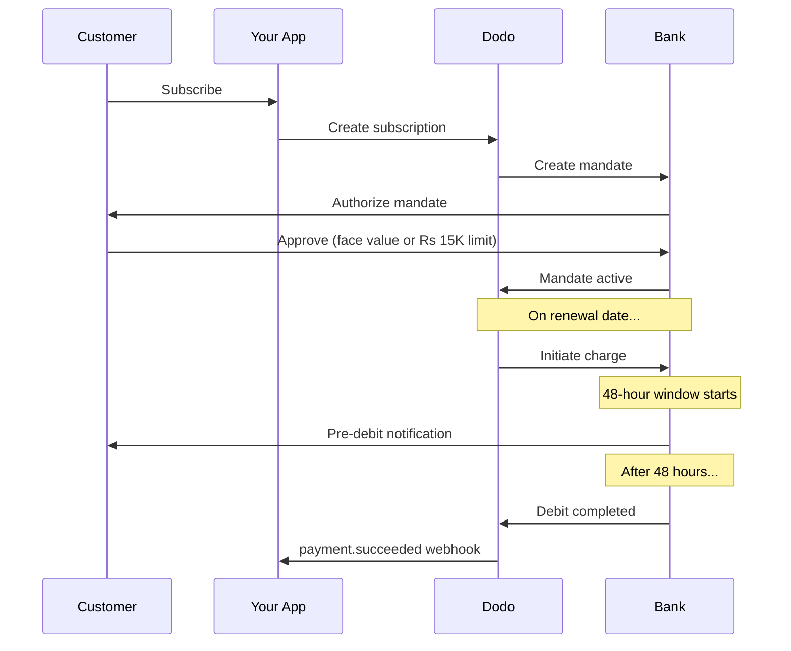

Indien verfügt über eine einzigartige Zahlungsinfrastruktur, die von UPI (mehr als 60 % der digitalen Transaktionen) und in Indien ausgestellten Karten (Visa, Mastercard, Rupay usw.) dominiert wird. Dodo Payments unterstützt all diese Methoden und gewährleistet die vollständige RBI-Konformität für Abonnementmandate.

## Warum indische Zahlungsmethoden wichtig sind

<CardGroup cols={3}>
<Card title="UPI Dominance" icon="mobile">
UPI verarbeitet mehr als 10 Mrd. Transaktionen pro Monat. Viele indische Kunden besitzen keine internationalen Karten.
</Card>

<Card title="Low Transaction Costs" icon="indian-rupee-sign">
Bei UPI fallen nahezu keine Transaktionsgebühren an. Das ist ideal für Transaktionen mit hohem Volumen und geringerem Wert.
</Card>

<Card title="Subscription Support" icon="repeat">
Im Gegensatz zu den meisten alternativen Zahlungsmethoden unterstützen UPI und alle in Indien ausgestellten Karten (Visa, Mastercard, Rupay usw.) wiederkehrende Zahlungen über RBI-Mandate.
</Card>
</CardGroup>

## Unterstützte Methoden

| Methode | Typ | Abonnements | Mindestbetrag |
| :----- | :--- | :-----------: | :--------- |
| **UPI Collect** | QR-Code / VPA | Ja* | ₹1 |
| **Rupay Credit** | Karte | Ja* | ₹1 |
| **Rupay Debit** | Karte | Ja* | ₹1 |

*Für Abonnements sind RBI-konforme Mandate mit besonderen Verarbeitungsregeln erforderlich. Die Verarbeitungsverzögerung von 48 Stunden gilt für alle in Indien ausgestellten Karten und für UPI.

## Konfiguration

### API-Methodentypen

| Typ | Beschreibung |
| :--- | :---------- |
| `upi_collect` | UPI über QR-Code oder VPA-Eingabe |
| `credit` | Kreditkarten einschließlich Rupay |
| `debit` | Debitkarten einschließlich Rupay |

### Beispiel: Checkout mit Fokus auf Indien

```javascript
const session = await client.checkoutSessions.create({
  product_cart: [{ product_id: 'prod_123', quantity: 1 }],
  allowed_payment_method_types: [
    'upi_collect',
    'credit',
    'debit'
  ],
  billing_currency: 'INR',
  customer: {
    email: 'customer@example.in',
    name: 'Priya Sharma',
    phone_number: '+919876543210'
  },
  billing_address: {
    country: 'IN',
    zipcode: '560001'
  },
  return_url: 'https://example.com/success'
});
```

### Anforderungen für UPI

Damit UPI beim Checkout angezeigt wird:
1. Das **Abrechnungsland** muss Indien sein (`IN`)
2. Die **Währung** muss INR sein
3. Für nicht-indische Händler: **Adaptive Currency** muss aktiviert sein

<Warning>
Wenn Sie ein nicht-indischer Händler sind und Adaptive Currency nicht aktiviert ist, steht UPI Ihren Kunden nicht zur Verfügung.
</Warning>

## Abonnements mit RBI-Mandaten

Abonnements mit indischen Zahlungsmethoden unterliegen den Vorschriften der RBI (Reserve Bank of India) und besonderen Anforderungen.

### Funktionsweise von RBI-Mandaten



### Mandattypen

| Abonnementbetrag | Mandattyp | Limit |
| :------------------ | :----------- | :---- |
| **Unterhalb des Mandatschwellenwerts** | On-demand-Mandat | Mandatschwellenwert (standardmäßig ₹15.000) |
| **Auf oder über dem Mandatschwellenwert** | Mandat mit festem Betrag | Exakter Abonnementbetrag |

Der bei der Bank des Kunden registrierte Betrag ist `max(mandate_floor, billing_amount)`. Daher entspricht der Schwellenwert effektiv dem **Autorisierungslimit** für den Kunden, wenn die Abrechnung unterhalb des Schwellenwerts liegt.

**Wichtig bei Änderungen des Plans:** Wenn ein Upgrade zu einer Abbuchung führt, die das bestehende Mandatslimit überschreitet, schlägt die Abbuchung fehl und der Kunde muss die Autorisierung erneut erteilen.

### Konfigurierbarer Mandatsschwellenwert

Der Mandatsschwellenwert für INR-E-Mandate kann über das Feld `mandate_min_amount_inr_paise` konfiguriert werden (in **INR Paise** — 1 INR = 100 Paise). Sie können den Systemstandard von ₹15.000 auf drei Ebenen überschreiben:

| Ebene | Festlegung | Geltungsbereich |
|-------|--------------|-------|
| **Pro Anfrage** | `mandate_min_amount_inr_paise` bei einer Checkout-Session, Zahlung oder einem Abonnement | Eine Transaktion |
| **Händler** | Geschäftseinstellungen | Alle Ihre INR-Abonnements |
| **System** | — | Standardwert ₹15.000 |

Priorität der Auflösung: Überschreibung pro Anfrage → Händlereinstellung → Systemstandard.

```typescript
// Per-checkout override
const session = await client.checkoutSessions.create({
  product_cart: [{ product_id: 'prod_inr_monthly', quantity: 1 }],
  mandate_min_amount_inr_paise: 2_000_000, // ₹20,000 ceiling
  return_url: 'https://yoursite.com/return'
});

// Per-subscription override
const subscription = await client.subscriptions.create({
  product_id: 'prod_inr_monthly',
  customer: { email: 'customer@example.in' },
  billing: { country: 'IN', /* ... */ },
  mandate_min_amount_inr_paise: 2_000_000
});
```

| Feld | Typ | Validierung | Gilt für |
|-------|------|------------|------------|
| `mandate_min_amount_inr_paise` | `integer` (INR Paise) | `>= 1` | INR-Abonnements mit indischen Karten bei Nicht-Airwallex-Connectors |

<Info>
Mit einem höheren Schwellenwert können Sie später größere einmalige Abbuchungen (z. B. Plan-Upgrades oder nutzungsbasierte Mehrbeträge) unterstützen, ohne dass Kunden die Autorisierung erneut erteilen müssen. Ein niedrigerer Schwellenwert bringt die Autorisierung des Kunden näher an den tatsächlichen Abrechnungsbetrag, begrenzt jedoch den Spielraum für zukünftige variable Abbuchungen.
</Info>

<Warning>
Diese Einstellung betrifft ausschließlich E-Mandate, die für in Indien ausgestellte Karten (Visa, Mastercard, RuPay) bei INR-Abonnements registriert sind. UPI-Abonnements verwenden ihren eigenen AutoPay-Ablauf und sind davon nicht betroffen.
</Warning>

### Die Verarbeitungsverzögerung von 48 Stunden

Dies ist der wichtigste Unterschied zu internationalen Kartenzahlungen:

<Steps>
<Step title="Charge Initiated (Day 0)">
Am geplanten Verlängerungsdatum leitet Dodo die Abbuchung bei der Bank ein.
</Step>

<Step title="Pre-Debit Notification">
Der Kunde erhält von seiner Bank eine Benachrichtigung über die bevorstehende Abbuchung.
</Step>

<Step title="48-Hour Window">
Der Kunde kann das Mandat während dieses Zeitraums über seine Banking-App stornieren.
</Step>

<Step title="Debit Completed (~48-51 hours)">
Nach 48 Stunden (zuzüglich bis zu 3 weiteren Stunden für die Bankverarbeitung) werden die Beträge abgebucht.
</Step>

<Step title="Webhook Sent">
Der `payment.succeeded`-Webhook wird nach der tatsächlichen Abbuchung gesendet, nicht bei der Einleitung.
</Step>
</Steps>

<Warning>
**Gewähren Sie keine Vorteile bei Einleitung der Abbuchung.** Warten Sie auf den `payment.succeeded`-Webhook, der etwa 48–51 Stunden nach dem geplanten Abbuchungsdatum eintrifft.
</Warning>

### Umgang mit dem 48-Stunden-Zeitfenster

```javascript
// DON'T do this:
async function handleSubscriptionRenewal(subscription) {
  // ❌ Bad: Granting access immediately when charge is initiated
  grantPremiumAccess(subscription.customer_id);
}

// DO this:
async function handlePaymentWebhook(event) {
  if (event.type === 'payment.succeeded') {
    // ✅ Good: Only grant access after payment is confirmed
    grantPremiumAccess(event.data.customer_id);
  }
  
  if (event.type === 'payment.failed') {
    // Handle failed payment (mandate cancelled, insufficient funds)
    revokePremiumAccess(event.data.customer_id);
  }
}
```

### Webhook-Ereignisse für indische Abonnements

| Ereignis | Zeitpunkt | Aktion |
| :---- | :--- | :----- |
| `subscription.active` | Mandat autorisiert | Abonnementstart speichern |
| `payment.succeeded` | ~48 Std. nach dem Abbuchungsdatum | Zugriff gewähren/fortsetzen |
| `payment.failed` | Abbuchung fehlgeschlagen | Kunden benachrichtigen, Zugriff pausieren |
| `subscription.on_hold` | Zahlung fehlgeschlagen | Zur Aktualisierung der Zahlungsmethode auffordern |
| `subscription.active` | Nach Zahlung reaktiviert | Zugriff wiederherstellen |

## Testen

### UPI-Test-IDs

| Status | UPI-ID |
| :----- | :----- |
| Erfolg | `success@upi` |
| Fehlgeschlagen | `failure@upi` |

### Testnummern für indische Karten

| Marke | Szenario | Kartennummer | Ablaufdatum | CVV |
| :---- | :------- | :---------- | :----- | :-- |
| Visa | Erfolg | `4576238912771450` | 06/32 | 123 |
| Visa | Abgelehnt | `4706131211212123` | 06/32 | 123 |
| Mastercard | Erfolg | `5409162669381034` | 06/32 | 123 |
| Mastercard | Abgelehnt | `5105105105105100` | 06/32 | 123 |

## Best Practices

<AccordionGroup>
<Accordion title="Plan for the 48-hour delay">
Entwickeln Sie Ihre Anwendung so, dass sie die Lücke zwischen Einleitung der Abbuchung und tatsächlicher Zahlung verarbeitet. Berücksichtigen Sie:
- Kulanzzeiträume für den Abonnementzugriff
- Klare Kommunikation mit Kunden über die Verarbeitungsdauer
- Webhook-gesteuerte Erfüllung statt datumsbasierter Erfüllung
</Accordion>

<Accordion title="Handle mandate cancellations">
Kunden können Mandate jederzeit über ihre Banking-Apps stornieren. Überwachen Sie `subscription.on_hold`-Webhooks und fordern Sie Kunden auf, erneut zu abonnieren oder ihre Zahlungsmethoden zu aktualisieren.
</Accordion>

<Accordion title="Set appropriate mandate amounts">
Berücksichtigen Sie bei variablen Preisen (z. B. nutzungsbasierten Preisen), ob ein On-demand-Mandat über 15.000 Rs ausreicht. Wenn die Abbuchungen diesen Betrag überschreiten könnten, müssen Kunden die Autorisierung erneut erteilen.
</Accordion>

<Accordion title="Offer UPI prominently">
Für indische Kunden sollte UPI die primäre Zahlungsoption sein. Viele Nutzer bevorzugen UPI gegenüber Karten, da sie damit vertraut sind und der Zahlungsprozess reibungsloser ist.
</Accordion>
</AccordionGroup>

## Fehlerbehebung

<AccordionGroup>
<Accordion title="UPI not appearing at checkout">
**Prüfen Sie:**
1. Ist das Abrechnungsland auf `IN` gesetzt?
2. Ist die Währung auf `INR` gesetzt?
3. Für nicht-indische Händler: Ist Adaptive Currency aktiviert?
4. Ist `upi_collect` in `allowed_payment_method_types` enthalten?

**Lösung:** Vergewissern Sie sich, dass die Rechnungsadresse `country: "IN"` und `billing_currency: "INR"` enthält.
</Accordion>

<Accordion title="Subscription charge failed after upgrade">
**Ursache:** Der neue Abbuchungsbetrag überschreitet das bestehende Mandatslimit (Schwellenwert von 15.000 Rs).

**Lösung:** Der Kunde muss die Zahlungsmethode aktualisieren, um ein neues Mandat mit dem korrekten Limit einzurichten.
</Accordion>

<Accordion title="Subscription on hold but customer claims they didn't cancel">
**Ursache:** Der Kunde hat das Mandat möglicherweise während des 48-Stunden-Zeitfensters storniert oder seine Bank hat die Abbuchung abgelehnt.

**Lösung:** Der Kunde muss das Mandat erneut autorisieren oder seine Zahlungsmethode aktualisieren.
</Accordion>

<Accordion title="Payment deduction delayed beyond 48 hours">
**Ursache:** Verzögerungen bei der Bank-API können die Verarbeitung um 2–3 weitere Stunden verlängern.

**Lösung:** Dies ist erwartetes Verhalten. Entwickeln Sie Ihr System so, dass es variable Verzögerungen von insgesamt bis zu etwa 51 Stunden verarbeitet.
</Accordion>

<Accordion title="Mandate cancelled but subscription still active">
**Ursache:** Sonderfall in den RBI-Vorschriften — die Stornierung eines Mandats während des Verarbeitungsfensters beendet das Abonnement nicht sofort.

**Lösung:** Die nächste Abbuchung schlägt fehl und das Abonnement wechselt zu `on_hold`. Überwachen Sie Webhooks auf `payment.failed`.
</Accordion>
</AccordionGroup>

## Verwandte Seiten

<CardGroup cols={2}>
<Card title="Payment Methods Overview" icon="credit-card" href="/features/payment-methods">
Sehen Sie sich alle unterstützten Zahlungsmethoden an.
</Card>

<Card title="Subscriptions" icon="repeat" href="/features/subscription">
Vollständige Dokumentation zu Abonnements einschließlich RBI-Mandaten.
</Card>

<Card title="Webhooks" icon="webhook" href="/developer-resources/webhooks">
Verarbeitung von Webhooks für Zahlungsereignisse.
</Card>

<Card title="Testing Process" icon="flask" href="/miscellaneous/testing-process">
Alle Testdaten einschließlich UPI-IDs und indischer Karten.
</Card>
</CardGroup>