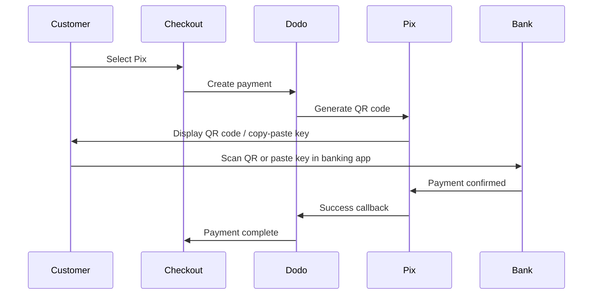

Pix ist das Sofortzahlungssystem Brasiliens, das von der Zentralbank von Brasilien (Banco Central do Brasil) erstellt wurde. Es ermöglicht 24/7 Echtzeitüberweisungen, auch an Wochenenden und Feiertagen, und ist die beliebteste Zahlungsmethode in Brasilien.

## Warum Pix anbieten?

<CardGroup cols={3}>
<Card title="Dominant in Brazil" icon="chart-line">
Pix ist die am häufigsten verwendete Zahlungsmethode in Brasilien und übertrifft Kreditkarten und Boleto.
</Card>

<Card title="Instant Settlement" icon="bolt">
Zahlungen werden in Sekunden bestätigt, 24/7/365 — kein Warten auf Bankbearbeitungsfenster.
</Card>

<Card title="Low Friction" icon="mobile">
Kunden zahlen via QR-Code oder durch Kopieren und Einfügen eines Schlüssels — keine Kartennummern oder Bankdaten erforderlich.
</Card>
</CardGroup>

## Übersicht

| Detail | Wert |
| :----- | :--- |
| **Rechnungswährung** | BRL |
| **Unterstützte Länder** | Brasilien |
| **Abonnements** | Nein |
| **Mindestbetrag** | $0.50 |
| **Abwicklung** | Sofort |

## Wie es funktioniert



## Kundenerfahrung

1. Kunde wählt Pix beim Checkout
2. Ein QR-Code und ein Schlüssel zum Kopieren und Einfügen werden angezeigt
3. Kunde öffnet seine Banking-App und scannt den QR-Code oder fügt den Schlüssel ein
4. Zahlung wird sofort bestätigt
5. Kunde wird zur Erfolgsseite weitergeleitet

<Info>
Pix QR-Codes verfallen typischerweise nach einer bestimmten Zeit. Wenn der Kunde die Zahlung nicht rechtzeitig abschließt, muss er den Checkout neu starten.
</Info>

## Konfiguration

```javascript
const session = await client.checkoutSessions.create({
  product_cart: [{ product_id: 'pdt_123', quantity: 1 }],
  allowed_payment_method_types: ['pix', 'credit', 'debit'],
  billing_currency: 'BRL',
  return_url: 'https://example.com/success'
});
```

## API-Methode

| Typ | Methode | Land |
| :--- | :------ | :--- |
| `pix` | Pix | Brasilien |

## Testen

<Steps>
<Step title="Enable test mode">
Verwenden Sie Ihre Dodo Payments Test-API-Schlüssel.
</Step>

<Step title="Set billing currency to BRL">
Stellen Sie sicher, dass die Rechnungswährung in Ihrem Checkout-Antrag auf `BRL` gesetzt ist.
</Step>

<Step title="Enter test CPF and scan the QR code">
Wenn du zur Eingabe einer Pix CPF aufgefordert wirst, gib `1234567890` ein. Ein Test-QR-Code wird generiert – scanne ihn mit der normalen Kamera deines Telefons (keine Pix-App erforderlich). Du wirst zu einer Testseite weitergeleitet, auf der du die Transaktion als erfolgreich oder fehlgeschlagen simulieren kannst.
</Step>
</Steps>

## Beste Praktiken

<AccordionGroup>
<Accordion title="Set billing currency to BRL">
Pix funktioniert nur mit BRL. Stellen Sie sicher, dass Ihre Preisgestaltung Transaktionen mit brasilianischem Real für den brasilianischen Markt unterstützt.
</Accordion>

<Accordion title="Provide card fallbacks">
Nicht alle brasilianischen Kunden bevorzugen möglicherweise Pix. Bieten Sie immer `credit` und `debit` als Ausweichmöglichkeiten an.
</Accordion>

<Accordion title="Handle QR code expiration">
Pix QR-Codes verfallen nach einer bestimmten Zeit. Stellen Sie sicher, dass Ihr Checkout Ablaufzeiten elegant handhabt und Kunden ermöglicht, den Code neu zu generieren.
</Accordion>
</AccordionGroup>

## Fehlerbehebung

<AccordionGroup>
<Accordion title="Pix not appearing at checkout">
**Prüfen:**
1. Rechnungswährung ist auf `BRL` gesetzt?
2. `pix` in `allowed_payment_method_types` enthalten?
3. Kundenland für Rechnungsstellung ist Brasilien?

**Lösung:** Pix ist nur für BRL-Transaktionen verfügbar. Überprüfen Sie die Währung und die Rechnungsadresse in Ihrem API-Antrag.
</Accordion>

<Accordion title="QR code expired">
**Ursache:** Der Kunde hat die Zahlung nicht innerhalb des Ablauffensters abgeschlossen.

**Lösung:** Der Kunde muss den Checkout neu starten, um einen neuen QR-Code zu generieren.
</Accordion>

<Accordion title="Payment pending">
**Ursache:** Pix-Zahlungen werden in den meisten Fällen sofort bestätigt, aber gelegentlich können bankseitige Verzögerungen auftreten.

**Lösung:** Überwachen Sie Webhooks zur Bestätigung der Zahlung. Wenn die Zahlung nicht innerhalb weniger Minuten bestätigt wird, behandeln Sie sie als fehlgeschlagen.
</Accordion>
</AccordionGroup>

## Verwandte Seiten

<CardGroup cols={2}>
<Card title="Payment Methods Overview" icon="credit-card" href="/features/payment-methods">
Alle unterstützten Zahlungsmethoden anzeigen.
</Card>

<Card title="Adaptive Currency" icon="globe" href="/features/adaptive-currency">
Währungsunterstützung und automatische Umrechnung.
</Card>

<Card title="Checkout Guide" icon="book" href="/developer-resources/checkout-session">
Komplette Anleitung zur Checkout-Implementierung.
</Card>

<Card title="Webhooks" icon="webhook" href="/developer-resources/webhooks">
Asynchrone Bestätigung von Zahlungen.
</Card>
</CardGroup>
