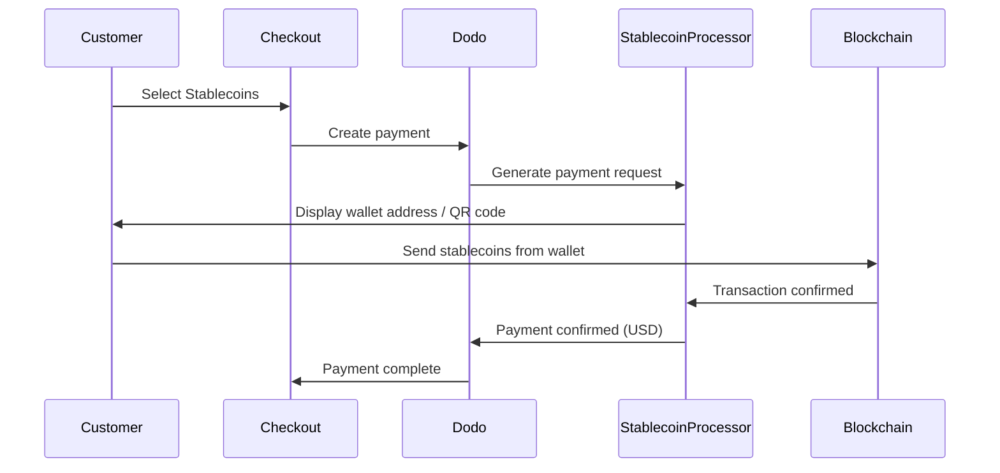

Stablecoin-Zahlungen ermöglichen es Kunden, mit Stablecoins von überall auf der Welt (außer Indien) zu bezahlen. Transaktionen werden in USD abgerechnet, sodass du Fiat-Währung erhältst, während Kunden mit ihrer bevorzugten Stablecoin-Wallet bezahlen.

## Warum Stablecoins anbieten?

<CardGroup cols={3}>
<Card title="Global Reach" icon="globe">
Akzeptiere Zahlungen aus jedem Land – keine Banken-Infrastruktur auf Kundenseite erforderlich.
</Card>

<Card title="No Chargebacks" icon="shield-check">
Stablecoin-Transaktionen sind unumkehrbar, was Chargeback-Betrug vollständig eliminiert.
</Card>

<Card title="USD Settlement" icon="dollar-sign">
Du erhältst USD – keine Notwendigkeit, Volatilität oder Wallets zu verwalten.
</Card>
</CardGroup>

## Überblick

| Detail | Wert |
| :----- | :---- |
| **Abrechnungswährung** | USD |
| **Unterstützte Länder** | Global (außer IN) |
| **Abonnements** | Nein |
| **Mindestbetrag** | $0,50 |
| **Abrechnung** | USD |

## Wie es funktioniert



## Kundenerfahrung

1. Kunde wählt Stablecoins beim Checkout
2. Eine Wallet-Adresse und ein QR-Code werden mit dem Betrag in Stablecoins angezeigt
3. Kunde sendet den exakten Betrag von seiner Stablecoin-Wallet
4. Transaktion wird auf der Blockchain bestätigt
5. Kunde wird zur Erfolgsseite weitergeleitet

<Info>
Stablecoin-Zahlungen werden in USD abgerechnet. Der beim Checkout angezeigte Stablecoin-Betrag spiegelt den Echtzeit-Wechselkurs zum Zeitpunkt der Zahlung wider.
</Info>

## Unterstützte Währungen & Netzwerke

| Währung | Netzwerke |
| :------- | :------- |
| **USDC** | Ethereum, Solana, Polygon, Base |
| **USDP** | Ethereum, Solana |
| **USDG** | Ethereum |

## Konfiguration

```javascript
const session = await client.checkoutSessions.create({
  product_cart: [{ product_id: 'prod_123', quantity: 1 }],
  allowed_payment_method_types: ['crypto_currency', 'credit', 'debit'],
  return_url: 'https://example.com/success'
});
```

## API-Methode Typ

| Typ | Methode | Land |
| :--- | :----- | :------ |
| `crypto` | Stablecoins | Global (außer IN) |

## Tests

<Steps>
<Step title="Enable test mode">
Verwende deine Dodo Payments Test-API-Keys.
</Step>

<Step title="Create a test checkout">
Erstelle eine Checkout-Session mit `crypto` in den erlaubten Zahlungsmethoden.
</Step>

<Step title="Complete the test flow">
Folge dem simulierten Stablecoin-Zahlungsfluss in der Testumgebung.
</Step>
</Steps>

## Best Practices

<AccordionGroup>
<Accordion title="Always include card fallbacks">
Nicht alle Kunden haben Stablecoin-Wallets. Integriere immer `credit` und `debit` als alternative Zahlungsmethoden.
</Accordion>

<Accordion title="Set clear expectations on confirmation time">
Blockchain-Bestätigungen können je nach Netzwerk Minuten dauern. Stelle sicher, dass dein Checkout dies den Kunden kommuniziert.
</Accordion>

<Accordion title="Handle underpayments and overpayments">
Stablecoin-Zahlungen können gelegentlich aufgrund von Netzwerkgebühren leicht vom exakten Betrag abweichen. Überwache Webhooks für Zahlungsstatus-Updates.
</Accordion>
</AccordionGroup>

## Fehlerbehebung

<AccordionGroup>
<Accordion title="Stablecoins not appearing at checkout">
**Überprüfung:**
1. `crypto` in `allowed_payment_method_types` enthalten?
2. Transaktionsbetrag entspricht dem Minimum ($0,50)?

**Lösung:** Überprüfe, ob der Zahlungsmethodentyp korrekt in deiner API-Anfrage übergeben wurde.
</Accordion>

<Accordion title="Payment not confirming">
**Ursache:** Die Zeiten für Blockchain-Bestätigungen variieren. Einige Netzwerke benötigen länger als andere.

**Lösung:** Warte auf die Webhook-Bestätigung. Behandle die Zahlung nicht als fehlgeschlagen, bis das Bestätigungsfenster verstrichen ist.
</Accordion>

<Accordion title="Amount mismatch">
**Ursache:** Netzwerkgebühren können dazu führen, dass sich der empfangene Betrag leicht vom angeforderten Betrag unterscheidet.

**Lösung:** Überwache Webhooks für den endgültig bestätigten Betrag. Kleine Abweichungen werden automatisch gehandhabt.
</Accordion>
</AccordionGroup>

## Verwandte Seiten

<CardGroup cols={2}>
<Card title="Payment Methods Overview" icon="credit-card" href="/features/payment-methods">
Siehe alle unterstützten Zahlungsmethoden.
</Card>

<Card title="Checkout Guide" icon="book" href="/developer-resources/checkout-session">
Vollständiger Leitfaden zur Checkout-Implementierung.
</Card>

<Card title="Webhooks" icon="webhook" href="/developer-resources/webhooks">
Zahlungsbestätigungen asynchron verarbeiten.
</Card>

<Card title="Testing Process" icon="flask" href="/miscellaneous/testing-process">
Vollständiger Testleitfaden für alle Zahlungsmethoden.
</Card>
</CardGroup>
