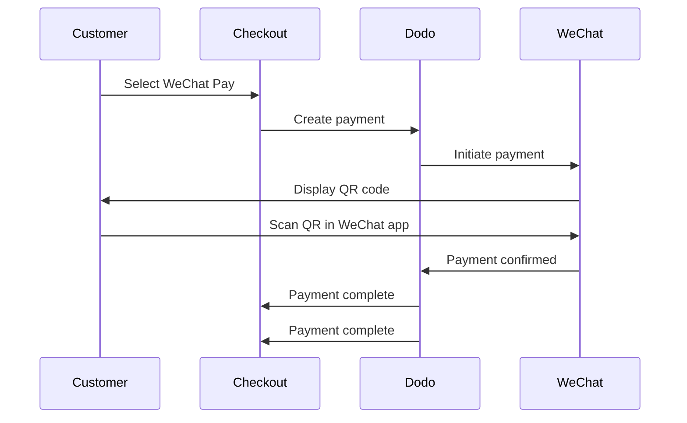

WeChat Pay ist eine der beiden dominierenden mobilen Zahlungsplattformen in China, die von über einer Milliarde Menschen genutzt wird. Es ermöglicht Zahlungen über QR-Codes innerhalb der WeChat-App und ist somit unerlässlich für Unternehmen, die chinesische Verbraucher ansprechen.

## Warum WeChat Pay anbieten?

<CardGroup cols={3}>
<Card title="1B+ Users" icon="users">
WeChat Pay wird von über einer Milliarde Menschen genutzt und ist damit eine der größten Zahlungsplattformen der Welt.
</Card>

<Card title="Mobile-First" icon="mobile">
Zahlungen werden vollständig innerhalb der WeChat-App abgeschlossen — schnell, vertraut und reibungslos für chinesische Kunden.
</Card>

<Card title="Dual Currency" icon="money-bill-transfer">
Akzeptieren Sie Zahlungen sowohl in USD als auch in CNY, was Flexibilität für grenzüberschreitende und inländische Transaktionen bietet.
</Card>
</CardGroup>

## Überblick

| Detail | Wert |
| :----- | :---- |
| **Abrechnungswährung** | USD, CNY |
| **Abonnements** | Nein |
| **Mindestbetrag** | $0.50 / ¥1.00 |
| **Abwicklung** | USD |

## Funktionsweise



## Kundenerfahrung

1. Kunde wählt WeChat Pay beim Checkout
2. Ein QR-Code wird auf der Checkout-Seite angezeigt
3. Kunde öffnet WeChat auf seinem Telefon und scannt den QR-Code
4. Kunde bestätigt die Zahlung in der WeChat-App
5. Zahlung wird sofort bestätigt und der Kunde wird zur Erfolgsseite weitergeleitet

<Info>
Kunden zahlen in USD oder CNY, und Sie erhalten die Abrechnung in USD.
</Info>

## Konfiguration

```javascript
const session = await client.checkoutSessions.create({
  product_cart: [{ product_id: 'prod_123', quantity: 1 }],
  allowed_payment_method_types: ['wechat_pay', 'credit', 'debit'],
  return_url: 'https://example.com/success'
});
```

## API-Methode

| Typ | Methode | Währungen |
| :--- | :----- | :-------- |
| `wechat_pay` | WeChat Pay | USD, CNY |

## Testen

<Steps>
<Step title="Enable test mode">
Verwenden Sie Ihre Dodo Payments-Test-API-Schlüssel.
</Step>

<Step title="Create a test checkout">
Erstellen Sie eine Checkout-Sitzung mit `wechat_pay` in den erlaubten Zahlungsmethoden.
</Step>

<Step title="Scan the QR code">
Ein Test-QR-Code wird generiert — scannen Sie ihn mit Ihrer normalen Handykamera (keine WeChat-App erforderlich). Sie werden zu einer Testseite weitergeleitet, auf der Sie die Transaktion als Erfolg oder Misserfolg simulieren können.
</Step>
</Steps>

## Best Practices

<AccordionGroup>
<Accordion title="Target Chinese customers">
WeChat Pay wird hauptsächlich von chinesischen Verbrauchern genutzt. Integrieren Sie es, wenn Ihre Kundenbasis chinesische Käufer umfasst oder Sie den chinesischen Markt ansprechen.
</Accordion>

<Accordion title="Always include card fallbacks">
Nicht alle Kunden haben WeChat. Integrieren Sie immer `credit` und `debit` als alternative Zahlungsmethoden.
</Accordion>

<Accordion title="Optimize for mobile">
Viele WeChat Pay-Nutzer surfen mobil. Stellen Sie sicher, dass Ihre Checkout-Seite responsiv ist — das Scannen von QR-Codes funktioniert am besten, wenn der Checkout auf einem Desktop oder Tablet angezeigt wird, während der Kunde mit seinem Telefon scannt.
</Accordion>

<Accordion title="Consider both currencies">
WeChat Pay unterstützt sowohl USD als auch CNY. Wählen Sie die Abrechnungswährung, die am besten zu Ihrem Zielmarkt passt — USD für grenzüberschreitende, CNY für inländische chinesische Transaktionen.
</Accordion>
</AccordionGroup>

## Fehlerbehebung

<AccordionGroup>
<Accordion title="WeChat Pay not appearing at checkout">
**Prüfen:**
1. `wechat_pay` in `allowed_payment_method_types` enthalten?
2. Abrechnungswährung auf USD oder CNY eingestellt?
3. Transaktionsbetrag erfüllt das Minimum?

**Lösung:** Überprüfen Sie, ob die Zahlungsmethode und die Währung korrekt in Ihrer API-Anfrage übergeben werden.
</Accordion>

<Accordion title="QR code not scanning">
**Ursache:** QR-Code kann abgelaufen sein oder die WeChat-Version des Kunden ist veraltet.

**Lösung:** Aktualisieren Sie die Checkout-Seite, um einen neuen QR-Code zu generieren. Stellen Sie sicher, dass der Kunde eine aktuelle Version von WeChat verwendet.
</Accordion>

<Accordion title="Payment not confirming">
**Ursache:** WeChat Pay bestätigt normalerweise sofort, aber Netzwerkverzögerungen können auftreten.

**Lösung:** Überwachen Sie Webhooks auf Zahlungsbestätigungen. Sollte die Zahlung nicht innerhalb weniger Minuten bestätigt werden, muss der Kunde möglicherweise erneut versuchen.
</Accordion>
</AccordionGroup>

## Verwandte Seiten

<CardGroup cols={2}>
<Card title="Payment Methods Overview" icon="credit-card" href="/features/payment-methods">
Alle unterstützten Zahlungsmethoden anzeigen.
</Card>

<Card title="Checkout Guide" icon="book" href="/developer-resources/checkout-session">
Vollständige Checkout-Implementierungsanleitung.
</Card>

<Card title="Webhooks" icon="webhook" href="/developer-resources/webhooks">
Zahlungsbestätigungen asynchron bearbeiten.
</Card>

<Card title="Testing Process" icon="flask" href="/miscellaneous/testing-process">
Vollständige Testanleitung für alle Zahlungsmethoden.
</Card>
</CardGroup>
