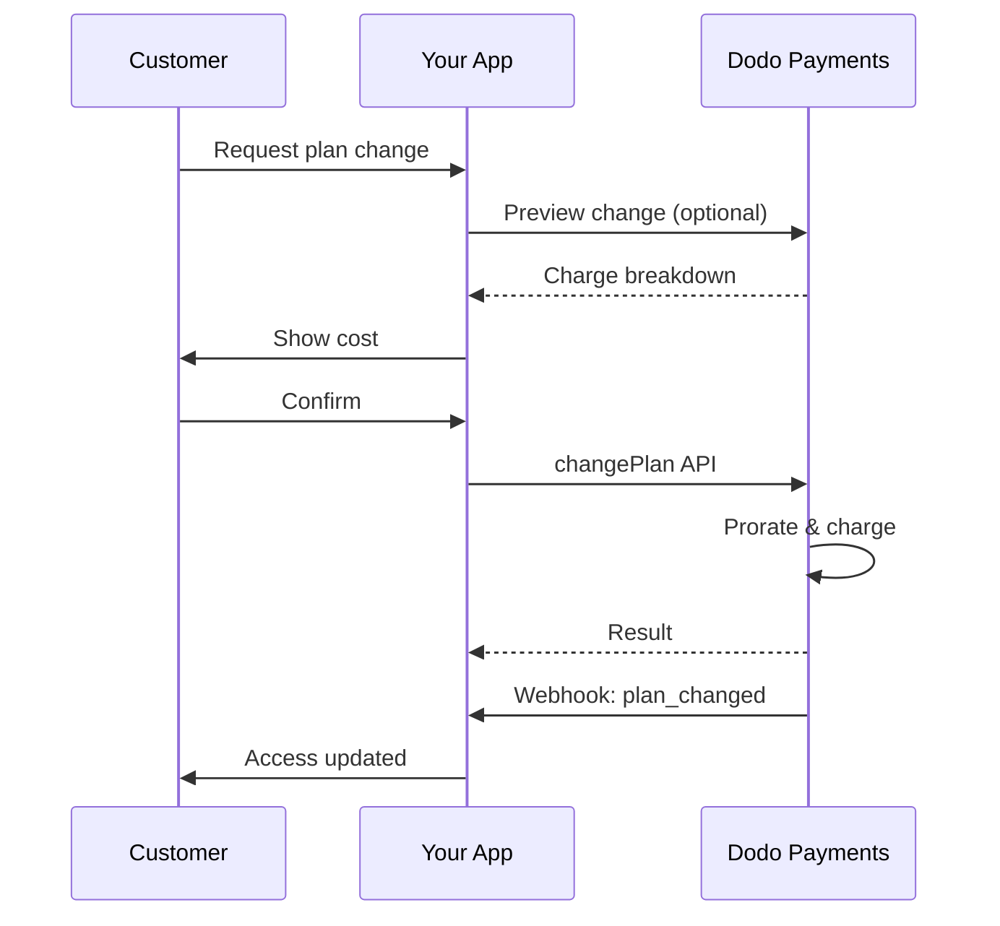
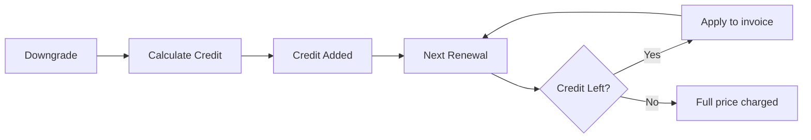
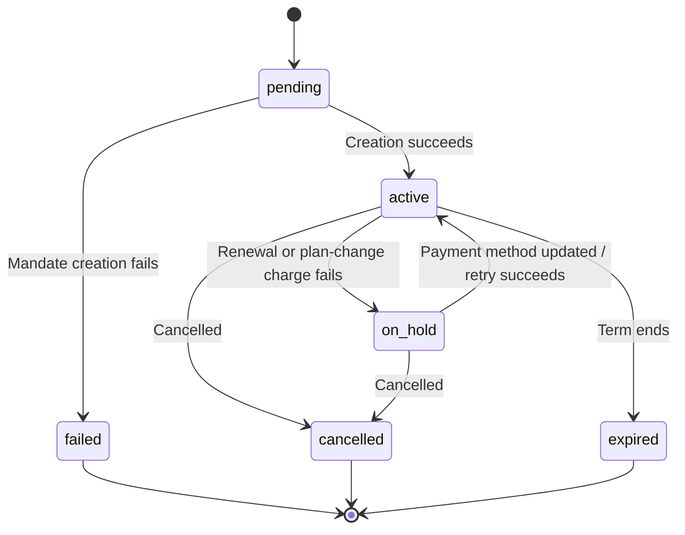

<Info>
Subscriptions let you sell ongoing access with automated renewals. Use flexible billing cycles, free trials, plan changes, and add‑ons to tailor pricing for each customer.
</Info>

<CardGroup cols={2}>
<Card title="Upgrade & Downgrade" icon="repeat" href="/developer-resources/subscription-upgrade-downgrade">
Control plan changes with proration and quantity updates.
</Card>

<Card title="On‑Demand Subscriptions" icon="bolt" href="/developer-resources/ondemand-subscriptions">
Authorize a mandate now and charge later with custom amounts.
</Card>

<Card title="Customer Portal" icon="id-card" href="/features/customer-portal">
Let customers manage plans, billing, and cancellations.
</Card>

<Card title="Subscription Webhooks" icon="code" href="/developer-resources/webhooks/intents/subscription">
React to lifecycle events like created, renewed, and canceled.
</Card>
</CardGroup>

## What Are Subscriptions?

Subscriptions are recurring products customers purchase on a schedule. They’re ideal for:

- **SaaS licenses**: Apps, APIs, or platform access
- **Memberships**: Communities, programs, or clubs
- **Digital content**: Courses, media, or premium content
- **Support plans**: SLAs, success packages, or maintenance

## Key Benefits

- **Predictable revenue**: Recurring billing with automated renewals
- **Flexible cycles**: Monthly, annual, custom intervals, and trials
- **Plan agility**: Proration for upgrades and downgrades
- **Add‑ons and seats**: Attach optional, quantifiable upgrades
- **Seamless checkout**: Hosted checkout and customer portal
- **Developer-first**: Clear APIs for creation, changes, and usage tracking

## Creating Subscriptions

Create subscription products in your Dodo Payments dashboard, then sell them through checkout or your API. Separating products from active subscriptions lets you version pricing, attach add‑ons, and track performance independently.

### Subscription product creation

Configure the fields in the dashboard to define how your subscription sells, renews, and bills. The sections below map directly to what you see in the creation form.

#### Product details

- **Product Name** (required): The display name shown in checkout, customer portal, and invoices.
- **Product Description** (required): A clear value statement that appears in checkout and invoices.
- **Product Image** (required): PNG/JPG/WebP up to 3 MB. Used on checkout and invoices.
- **Brand**: Associate the product with a specific brand for theming and emails.
- **Tax Category** (required): Choose the category (for example, SaaS) to determine tax rules.

<Tip>
Pick the most accurate tax category to ensure correct tax collection per region.
</Tip>

#### Pricing

- **Pricing Type**: Wählen Sie <b>Abonnement</b> (dieses Handbuch). Alternativen sind Einmalzahlung und Nutzungsbasierte Abrechnung.
- **Preis** (erforderlich): Basierend auf wiederkehrendem Preis mit Währung. Der Preis muss mindestens **1 $** (oder das Äquivalent in Ihrer gewählten Währung) betragen. Beträge unter diesem Minimum werden nicht unterstützt und das Abonnement wird nicht funktionieren.
- **Anwendbarer Rabatt (%)**: Optionaler prozentualer Rabatt, der auf den Basispreis angewendet wird; im Checkout und auf Rechnungen ausgewiesen.
- **Wiederkehrende Zahlung alle** (erforderlich): Intervall für Erneuerungen, z.B. alle 1 Monat. Wählen Sie den Rhythmus (Monate oder Jahre) und die Anzahl.
- **Abonnementzeitraum** (erforderlich): Gesamtlaufzeit, für die das Abonnement aktiv bleibt (z.B. 10 Jahre). Nach Ablauf dieser Periode stoppen die Erneuerungen, es sei denn, sie wird verlängert.
- **Testzeitraum in Tagen** (erforderlich): Legen Sie die Testdauer in Tagen fest. Verwenden Sie 0, um Tests zu deaktivieren. Die erste Belastung erfolgt automatisch, wenn die Testperiode endet.
- **Add‑on auswählen**: Fügen Sie bis zu 10 Add‑ons hinzu, die Kunden zusätzlich zum Basisplan erwerben können.

<Warning>
Changing pricing on an active product affects new purchases. Existing subscriptions follow your plan‑change and proration settings.
</Warning>

<Info>
Add‑ons are ideal for quantifiable extras such as seats or storage. You can control allowed quantities and proration behavior when customers change them.
</Info>

#### Advanced settings

- **Tax Inclusive Pricing**: Display prices inclusive of applicable taxes. Final tax calculation still varies by customer location.
- **Generate license keys**: Issue a unique key to each customer after purchase. See the <a href="/features/license-keys">License Keys</a> guide.
- **Digital Product Delivery**: Deliver files or content automatically after purchase. Learn more in <a href="/features/digital-product-delivery">Digital Product Delivery</a>.
- **Metadata**: Attach custom key–value pairs for internal tagging or client integrations. See <a href="/api-reference/metadata">Metadata</a>.

<Tip>
Use metadata to store identifiers from your system (e.g., accountId) so you can reconcile events and invoices later.
</Tip>

## Subscription Trials

Trials let customers access subscriptions without immediate payment. The first charge occurs automatically when the trial ends.

### Configuring Trials

Set **Trial Period Days** in the product pricing section (use `0` to disable). You can override this when creating subscriptions:

```typescript
// Via subscription creation
const subscription = await client.subscriptions.create({
  customer_id: 'cus_123',
  product_id: 'prod_monthly',
  trial_period_days: 14  // Overrides product's trial period
});

// Via checkout session
const session = await client.checkoutSessions.create({
  product_cart: [{ product_id: 'prod_monthly', quantity: 1 }],
  subscription_data: { trial_period_days: 14 }
});
```

<Warning>
The `trial_period_days` value must be between 0 and 10,000 days.
</Warning>

### Detecting Trial Status

<Warning>
Currently, there is no direct field to detect trial status. The following is a workaround that requires querying payments, which is inefficient. We are working on a more efficient solution.
</Warning>

To determine if a subscription is in trial, retrieve the list of payments for the subscription. If there is exactly one payment with amount 0, the subscription is in trial period:

```typescript
const subscription = await client.subscriptions.retrieve('sub_123');
const payments = await client.payments.list({
  subscription_id: subscription.subscription_id
});

// Check if subscription is in trial
const isInTrial = payments.items.length === 1 && 
                  payments.items[0].total_amount === 0;
```

### Updating Trial Period

Extend the trial by updating `next_billing_date`:

```typescript
await client.subscriptions.update('sub_123', {
  next_billing_date: '2025-02-15T00:00:00Z'  // New trial end date
});
```

<Warning>
You cannot set `next_billing_date` to a past time. The date must be in the future.
</Warning>

## Subscription Plan Changes

Plan changes let you upgrade or downgrade subscriptions, adjust quantities, or migrate to different products. Depending on the proration mode you select, a change may trigger an immediate charge, create credit, or apply no billing adjustment.

<Tip>
You can change subscription plans and update the next billing date directly from the Dodo Payments dashboard. This provides a quick way to adjust subscriptions for customer support requests, promotional upgrades, or plan migrations without making API calls.
</Tip>

<Tip>
**Enable self-service plan changes:** Want customers to upgrade or downgrade their own subscriptions via the Customer Portal? Add your subscription products to a Product Collection and enable "Allow Subscription Updates" in your Subscription Settings.
</Tip>



<Card title="Product Collections" icon="layer-group" href="/features/product-collections">
  Group related products into collections to enable seamless upgrade/downgrade paths in the Customer Portal.
</Card>

### Proration Modes

Choose how customers are billed when changing plans:

<Info>
**Quick comparison of the four proration modes:**

| | `prorated_immediately` | `difference_immediately` | `full_immediately` | `do_not_bill` |
|---|---|---|---|---|
| **Upgrade** | Anteile des Restgeldes für verbleibende Tage | Preisunterschied vollständig berechnet | Voller Preis des neuen Plans berechnet | Keine Berechnung — sofort wechseln |
| **Downgrade** | Anteile als Gutschrift für verbleibende Tage | Preisunterschied vollständig als Gutschrift | Keine Gutschrift, voller Preis berechnet | Keine Gutschrift — sofort wechseln |
| **Abrechnungszyklus** | Wird auf heute zurückgesetzt | Wird auf heute zurückgesetzt | Wird auf heute zurückgesetzt | Bleibt gleich |
| **Am besten für** | Faire zeitbasierte Abrechnung | Einfache Tarifänderungen | Abrechnungszyklus-Resets | Kostenlose Migrationen oder Kulanzwechsel |
</Info>

#### `prorated_immediately`
Charges prorated amount based on remaining time in the current billing cycle. Best for fair billing that accounts for unused time.

```typescript
await client.subscriptions.changePlan('sub_123', {
  product_id: 'prod_pro',
  quantity: 1,
  proration_billing_mode: 'prorated_immediately'
});
```

#### `difference_immediately`
Charges the price difference immediately (upgrade) or adds credit for future renewals (downgrade). Best for simple upgrade/downgrade scenarios.

```typescript
// Upgrade: charges $50 (difference between $30 and $80)
// Downgrade: credits remaining value, auto-applied to renewals
await client.subscriptions.changePlan('sub_123', {
  product_id: 'prod_pro',
  quantity: 1,
  proration_billing_mode: 'difference_immediately'
});
```

<Info>
Credits from downgrades using `difference_immediately` are subscription-scoped and auto-applied to future renewals. They're distinct from <a href="/features/credit-based-billing">Credit-Based Billing</a> entitlements.
</Info>

When a customer downgrades with `difference_immediately`, the unused value becomes a subscription-scoped credit that automatically offsets future renewals:



#### `full_immediately`
Charges full new plan amount immediately, ignoring remaining time. Best for resetting billing cycles.

```typescript
await client.subscriptions.changePlan('sub_123', {
  product_id: 'prod_monthly',
  quantity: 1,
  proration_billing_mode: 'full_immediately'
});
```

#### `do_not_bill`
Switches to the new plan without any billing adjustment. No proration charges, no credits — the customer simply moves to the new plan. Best for courtesy migrations, free plan switches, or scenarios where you want to absorb the cost difference.

```typescript
await client.subscriptions.changePlan('sub_123', {
  product_id: 'prod_new_plan',
  quantity: 1,
  proration_billing_mode: 'do_not_bill'
});
```

<AccordionGroup>
<Accordion title="Example: Prorated upgrade calculation">

**Scenario**: Customer on Basic ($30/month) upgrades to Pro ($80/month) on day 16 of a 30-day cycle using `prorated_immediately`.

```
Unused credit from Basic = $30 × (15 remaining / 30 total) = $15.00
Prorated cost of Pro     = $80 × (15 remaining / 30 total) = $40.00
────────────────────────────────────────────────────────────────────
Immediate charge         = $40.00 − $15.00 = $25.00
```

Nächste Verlängerung am **15. Februar** (16. Januar + 30 Tage): **80,00 $/Monat**.

<Tip>
For more detailed calculation examples and edge cases, see our full [Upgrade & Downgrade Guide](/developer-resources/subscription-upgrade-downgrade).
</Tip>

</Accordion>
<Accordion title="Example: Downgrade credit calculation">

**Scenario**: Customer on Pro ($80/month) downgrades to Starter ($20/month) using `difference_immediately`.

```
Credit = Old plan − New plan = $80 − $20 = $60.00
```

The $60 credit auto-applies to future renewals:
- Renewal 1: $20 − $20 (credit) = **$0.00** ($40 credit remaining)
- Renewal 2: $20 − $20 (credit) = **$0.00** ($20 credit remaining)  
- Renewal 3: $20 − $20 (credit) = **$0.00** (credit exhausted)
- Renewal 4: **$20.00** (full price)

<Info>
Learn more about how credits are managed in the [Upgrade & Downgrade Guide](/developer-resources/subscription-upgrade-downgrade).
</Info>

</Accordion>
</AccordionGroup>

### Changing Plans with Add-ons

Modify add-ons when changing plans. Add-ons are included in proration calculations:

```typescript
await client.subscriptions.changePlan('sub_123', {
  product_id: 'prod_pro',
  quantity: 1,
  proration_billing_mode: 'difference_immediately',
  addons: [{ addon_id: 'addon_extra_seats', quantity: 2 }]  // Add add-ons
  // addons: []  // Empty array removes all existing add-ons
});
```

<Info>
Plan changes trigger immediate charges. Failed charges may move the subscription to `on_hold` status. Track changes via `subscription.plan_changed` webhook events.
</Info>

### Previewing Plan Changes

Before committing to a plan change, preview the exact charge and resulting subscription:

```typescript
const preview = await client.subscriptions.previewChangePlan('sub_123', {
  product_id: 'prod_pro',
  quantity: 1,
  proration_billing_mode: 'prorated_immediately'
});

// Show customer the charge before confirming
console.log('You will be charged:', preview.immediate_charge.summary);
```

<Card title="Preview Change Plan API" icon="eye" href="/api-reference/subscriptions/preview-change-plan">
  Preview plan changes before committing to them.
</Card>

## Subscription States

Ein Abonnement bewegt sich im Laufe seines Lebens durch eine definierte Reihe von Status. Diese Tabelle dient als Referenz für jeden Status, was ihn verursacht und wie (oder ob) Sie ihn wiederherstellen können.

| Status | Was es bedeutet | Wiederherstellbar? | Wiederherstellungspfad / nächster Schritt |
|--------|---------------|--------------|---------------------------|
| `pending` | Das Abonnement wird erstellt oder verarbeitet | — | Warten auf `subscription.active` (oder `subscription.failed`) |
| `active` | Das Abonnement ist aktiv und wird automatisch verlängert | — | Keine Aktion erforderlich |
| `on_hold` | Eine Verlängerungszahlung (oder Planänderung) ist fehlgeschlagen; das Abonnement ist pausiert | **Ja** | Aktualisieren Sie die Zahlungsmethode, um die Reaktivierung automatisch über [Payment Retries](/features/recovery/payment-retries) und [Dunning](/features/recovery/subscription-dunning) oder manuell über die [Update Payment Method API](/api-reference/subscriptions/update-payment-method) vorzunehmen. |
| `cancelled` | Das Abonnement wurde gekündigt und wird nicht erneuert | Nur Neubestellung | Der Kunde muss ein neues Abonnement starten; [Dunning](/features/recovery/subscription-dunning) kann eine Neubestellung anregen |
| `failed` | Abonnement **Erstellung** ist fehlgeschlagen (das erste Mandat oder die Zahlung war nicht erfolgreich) | **Nein — terminal** | Der Kunde muss ein neues Abonnement mit einer funktionierenden Zahlungsmethode erstellen |
| `expired` | Das Abonnement hat das Ende seines Zeitraums erreicht | — | Der Kunde muss ein neues Abonnement starten, falls gewünscht |

<Warning>
`on_hold` und `failed` werden oft verwechselt. `on_hold` ist ein **wiederherstellbarer** Zustand für ein bereits aktives Abonnement, dessen Verlängerung fehlgeschlagen ist. `failed` ist ein **terminaler** Zustand, der nur auftritt, wenn die **initiale** Erstellung des Abonnements fehlschlägt — es kann nicht reaktiviert werden.
</Warning>

### Zustandsdiagramm



### On-Hold-Zustand

Ein Abonnement wechselt in den Zustand `on_hold`, wenn:

- Eine Verlängerungszahlung fehlschlägt (unzureichende Mittel, abgelaufene Karte usw.)
- Eine Planänderungsgebühr fehlschlägt
- Die Autorisierung der Zahlungsmethode fehlschlägt

<Warning>
Wenn ein Abonnement im Zustand `on_hold` ist, wird es nicht automatisch erneuert. Sie müssen die Zahlungsmethode aktualisieren, um das Abonnement zu reaktivieren.
</Warning>

### Reaktivieren aus dem On-Hold-Zustand

Um ein Abonnement aus dem Zustand `on_hold` zu reaktivieren, aktualisieren Sie die Zahlungsmethode. Dies führt automatisch zu:

1. Erstellung einer Gebühr für ausstehende Beträge
2. Erstellung einer Rechnung
3. Bearbeitung der Zahlung mit der neuen Zahlungsmethode
4. Reaktivierung des Abonnements in den Zustand `active` nach erfolgreicher Zahlung

```typescript
// Reactivate subscription from on_hold
const response = await client.subscriptions.updatePaymentMethod('sub_123', {
  type: 'new',
  return_url: 'https://example.com/return'
});

// For on_hold subscriptions, a charge is automatically created
if (response.payment_id) {
  console.log('Charge created:', response.payment_id);
  // Redirect customer to response.payment_link to complete payment
  // Monitor webhooks for payment.succeeded and subscription.active
}
```

<Info>
Nach erfolgreicher Aktualisierung der Zahlungsmethode für ein Abonnement im Zustand `on_hold` erhalten Sie `payment.succeeded` gefolgt von `subscription.active` Webhook-Ereignissen.
</Info>

### Webhook-Ereignisse nach Transition

Jeder Übergang löst einen Webhook aus, damit Sie Berechtigungslogik ohne Abfragen steuern können:

| Transition | Ereignis |
|------------|-------|
| Abonnement aktiviert | `subscription.active` |
| Verlängerung erfolgreich | `subscription.renewed` |
| Verlängerung fehlgeschlagen → pausiert | `subscription.on_hold` |
| Erstellung fehlgeschlagen | `subscription.failed` |
| Plan aufgewertet/abgestuft | `subscription.plan_changed` |
| Gekündigt | `subscription.cancelled` |
| Zeitraum beendet | `subscription.expired` |
| Jegliche Feldänderungen | `subscription.updated` |

<Card title="Subscription Webhook Payloads" icon="webhook" href="/developer-resources/webhooks/intents/subscription">
Sehen Sie das vollständige Payload-Schema für Abonnement-Lebenszyklusereignisse ein.
</Card>

## API-Verwaltung

<AccordionGroup>
<Accordion title="Create subscriptions">
Verwenden Sie `POST /subscriptions`, um Abonnements programmgesteuert aus Produkten zu erstellen, mit optionalen Testversionen und Add-ons.

<Card title="API Reference" icon="code" href="/api-reference/subscriptions/post-subscriptions">
Siehe die API zur Erstellung von Abonnements.
</Card>
</Accordion>

<Accordion title="Update subscriptions">
Verwenden Sie `PATCH /subscriptions/{id}`, um Mengen zu aktualisieren, zum nächsten Abrechnungsdatum zu kündigen oder Metadaten zu ändern.

<Card title="API Reference" icon="code" href="/api-reference/subscriptions/patch-subscriptions">
Erfahren Sie, wie Sie Abonnementdetails aktualisieren können.
</Card>
</Accordion>

<Accordion title="Change plans (proration)">
Ändern Sie das aktive Produkt und die Mengen mit Prorationskontrollen.

<Card title="API Reference" icon="code" href="/api-reference/subscriptions/change-plan">
Überprüfen Sie die Optionen zur Planänderung.
</Card>
</Accordion>

<Accordion title="On‑demand charges">
Für bedarfsgerechte Abonnements, berechnen Sie spezifische Beträge auf Abruf.

<Card title="API Reference" icon="code" href="/api-reference/subscriptions/create-charge">
Belasten Sie ein bedarfsgerechtes Abonnement.
</Card>
</Accordion>

<Accordion title="List and retrieve">
Verwenden Sie `GET /subscriptions`, um alle Abonnements aufzulisten, und `GET /subscriptions/{id}`, um ein einzelnes abzurufen.

<Card title="API Reference" icon="code" href="/api-reference/subscriptions/get-subscriptions">
Durchsuchen Sie die APIs zum Auflisten und Abrufen.
</Card>
</Accordion>

<Accordion title="Usage history">
Abruf der aufgezeichneten Nutzung für gemessene oder hybride Preismodelle.

<Card title="API Reference" icon="code" href="/api-reference/subscriptions/get-usage-history">
Siehe die Nutzungsverlauf-API.
</Card>
</Accordion>

<Accordion title="Update payment method">
Aktualisieren Sie die Zahlungsmethode für ein Abonnement. Für aktive Abonnements wird die Zahlungsmethode für zukünftige Verlängerungen aktualisiert. Für Abonnements im Zustand `on_hold` reaktiviert dies das Abonnement, indem eine Gebühr für ausstehende Beträge erstellt wird.

Beim Generieren eines neuen Links zur Zahlungsmethode (dem Anforderungstyp `New`) können Sie `allowed_payment_method_types` übergeben, um einzuschränken, welche Zahlungsmethoden der Kunde auf dieser Seite sieht. Kunden werden niemals eine Methode sehen, die nicht in der Liste enthalten ist, obwohl das Hinzufügen einer Methode nicht garantiert, dass sie angezeigt wird (die Verfügbarkeit hängt immer noch von Faktoren wie dem Standort des Kunden und Ihren Geschäftseinstellungen ab).

<Card title="API Reference" icon="code" href="/api-reference/subscriptions/update-payment-method">
Erfahren Sie, wie Sie Zahlungsmethoden aktualisieren und Abonnements reaktivieren können.
</Card>
</Accordion>
</AccordionGroup>

## Häufige Anwendungsfälle

- **SaaS und APIs**: Stufenweiser Zugriff mit Zusatzoptionen für Plätze oder Nutzung
- **Inhalt und Medien**: Monatlicher Zugriff mit Einführungstests
- **B2B-Supportpläne**: Jahresverträge mit Premium-Support-Zusätzen
- **Tools und Plugins**: Lizenzschlüssel und versionierte Releases

## Integrationsbeispiele

### Checkout-Sessions (Abonnements)
Wenn Sie Checkout-Sessions erstellen, fügen Sie Ihr Abonnementprodukt und optionale Add-ons hinzu:

```typescript
const session = await client.checkoutSessions.create({
  product_cart: [
    {
      product_id: 'prod_subscription',
      quantity: 1
    }
  ]
});
```

### Planänderungen mit Proratio
Ein Abonnement aufwerten oder abwerten und das Prorationsverhalten steuern:

```typescript
await client.subscriptions.changePlan('sub_123', {
  product_id: 'prod_new',
  quantity: 1,
  proration_billing_mode: 'difference_immediately'
});
```

### Kündigung mit dem nächsten Abrechnungstermin
Planen Sie eine Kündigung, die am Ende des aktuellen Abrechnungszeitraums wirksam wird:

```typescript
await client.subscriptions.update('sub_123', {
  cancel_at_next_billing_date: true
});
```

### On-Demand-Abonnements
Erstellen Sie ein On-Demand-Abonnement und berechnen Sie später bei Bedarf:

```typescript
const onDemand = await client.subscriptions.create({
  customer_id: 'cus_123',
  product_id: 'prod_on_demand',
  on_demand: true
});

await client.subscriptions.charge(onDemand.id, {
  amount: 4900,
  currency: 'USD',
  description: 'Extra usage for September'
});
```

### Zahlungsmethode für aktives Abonnement aktualisieren
Aktualisieren Sie die Zahlungsmethode für ein aktives Abonnement:

```typescript
// Update with new payment method
const response = await client.subscriptions.updatePaymentMethod('sub_123', {
  type: 'new',
  return_url: 'https://example.com/return'
});

// Or use existing payment method
await client.subscriptions.updatePaymentMethod('sub_123', {
  type: 'existing',
  payment_method_id: 'pm_abc123'
});
```

### Reaktivieren des Abonnements aus der on-hold
Reaktivieren Sie ein Abonnement, das aufgrund einer fehlgeschlagenen Zahlung in den On-Hold-Zustand versetzt wurde:

```typescript
// Update payment method - automatically creates charge for remaining dues
const response = await client.subscriptions.updatePaymentMethod('sub_123', {
  type: 'new',
  return_url: 'https://example.com/return'
});

if (response.payment_id) {
  // Charge created for remaining dues
  // Redirect customer to response.payment_link
  // Monitor webhooks: payment.succeeded → subscription.active
}
```

## Abonnements mit RBI-konformen Mandaten

UPI- und indische Kartenabonnements unterliegen den Vorschriften der RBI (Reserve Bank of India) mit spezifischen Mandatsanforderungen:

### Mandatsgrenzen

Der Mandatstyp und der Betrag hängen von der wiederkehrenden Belastung Ihres Abonnements ab:

- **Belastungen unterhalb der Mandatsuntergrenze (Standard ₹15,000):** Wir erstellen ein On-Demand-Mandat für den Mindestbetrag. Der Abonnementbetrag wird je nach Abonnementhäufigkeit periodisch bis zur Mandatsgrenze berechnet.
- **Belastungen bei oder über der Mandatsuntergrenze:** Wir erstellen ein Abonnementmandat (oder On-Demand-Mandat) für den genauen Abonnementbetrag.

Die Mandatsuntergrenze ist pro Händler oder pro Anfrage via `mandate_min_amount_inr_paise` (INR paise) konfigurierbar. Der bei der Bank registrierte Betrag ist `max(mandate_floor, billing_amount)` — daher wird die Untergrenze effektiv zur kundenorientierten Autorisierungsobergrenze, wann immer die Abrechnung niedriger ist.

Detaillierte Informationen über RBI-konforme Mandate und die konfigurierbare Mandatsuntergrenze für indische Zahlungsmethoden finden Sie auf der Seite <a href="/features/payment-methods/india#configurable-mandate-floor">Indische Zahlungsmethoden</a>.

### Überlegungen zu Upgrades und Downgrades

**Wichtig:** Wenn Sie Abonnements upgraden oder downgraden, berücksichtigen Sie sorgfältig die Mandatsgrenzen:

- Wenn ein Upgrade/Downgrade zu einem Belastungsbetrag führt, der Rs 15.000 übersteigt und das bestehende On-Demand-Zahlungslimit überschreitet, kann die Transaktionsbelastung fehlschlagen.
- In solchen Fällen muss der Kunde möglicherweise seine Zahlungsmethode aktualisieren oder das Abonnement erneut ändern, um ein neues Mandat mit dem richtigen Grenzwert zu erstellen.

### Autorisierung für hochpreisige Belastungen

Für Abonnementbelastungen von Rs 15.000 oder mehr:

- Der Kunde wird von seiner Bank aufgefordert, die Transaktion zu autorisieren.
- Wenn der Kunde die Transaktion nicht autorisiert, schlägt die Transaktion fehl und das Abonnement wird auf Eis gelegt.

### 48-Stunden-Verarbeitungsverzögerung

**Bearbeitungszeitlinie:** Wiederkehrende Belastungen auf indischen Karten und UPI-Abonnements folgen einem einzigartigen Verarbeitungsmuster:

- Belastungen werden **initiiert** am geplanten Datum gemäß Ihrer Abonnementfrequenz.
- Der tatsächliche **Abzug** vom Konto des Kunden erfolgt erst nach **48 Stunden** ab Zahlungsauslösung.
- Dieses 48-Stunden-Fenster kann sich je nach Bank-API-Antworten um **2-3 zusätzliche Stunden** verlängern.

### Widerrufsfenster des Mandats

Während des 48-Stunden-Verarbeitungsfensters:

- Kunden können das Mandat über ihre Banking-Apps widerrufen.
- Wenn ein Kunde das Mandat während dieser Zeit widerruft, bleibt das Abonnement **aktiv** (dies ist ein Randfall, der speziell für indische Karten- und UPI-AutoPay-Abonnements gilt).
- Der tatsächliche Abzug kann jedoch fehlschlagen und in diesem Fall wird das Abonnement **pausiert**.

**Randfallbehandlung:** Wenn Sie Kundenleistungen, Gutschriften oder Abonnementnutzung direkt bei der Zahlungsauslösung bereitstellen, müssen Sie dieses 48-Stunden-Fenster in Ihrer Anwendung entsprechend behandeln. In Betracht ziehen:

- Verzögerung der Nutzenaktivierung bis zur Zahlungsbestätigung
- Implementierung von Kulanzzeiträumen oder temporärem Zugriff
- Überwachung des Abonnementstatus auf Mandatswiderrufe
- Umgang mit pausierten Abonnementzuständen in Ihrer Anwendungslogik

<Tip>
Überwachen Sie Abonnement-Webhooks, um Zahlungsstatusänderungen zu verfolgen und Randfälle zu behandeln, bei denen Mandate während des 48-Stunden-Fensters widerrufen werden.
</Tip>

## Best Practices

- **Starten Sie mit klaren Stufen**: 2–3 Pläne mit offensichtlichen Unterschieden
- **Preise kommunizieren**: Zeigen Sie Gesamtsummen, Proration und die nächste Verlängerung an
- **Tests sinnvoll einsetzen**: Konvertieren Sie mit Onboarding, nicht nur durch Zeit
- **Add-Ons nutzen**: Halten Sie die Basispläne einfach und verkaufen Sie Zusätze
- **Änderungen testen**: Validieren Sie Planänderungen und Proration im Testmodus

<Info>
Abonnements sind eine flexible Grundlage für wiederkehrende Einnahmen. Starten Sie einfach, testen Sie gründlich und iterieren Sie basierend auf Annahme, Abwanderung und Expansionsmetriken.
</Info>