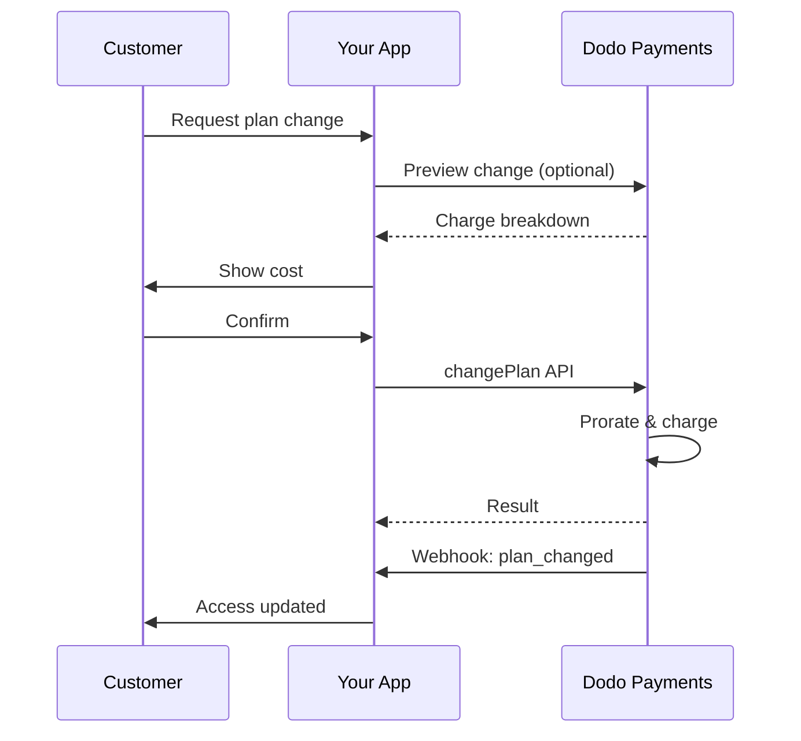
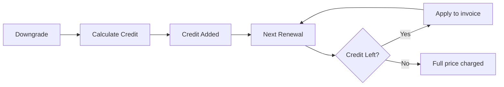
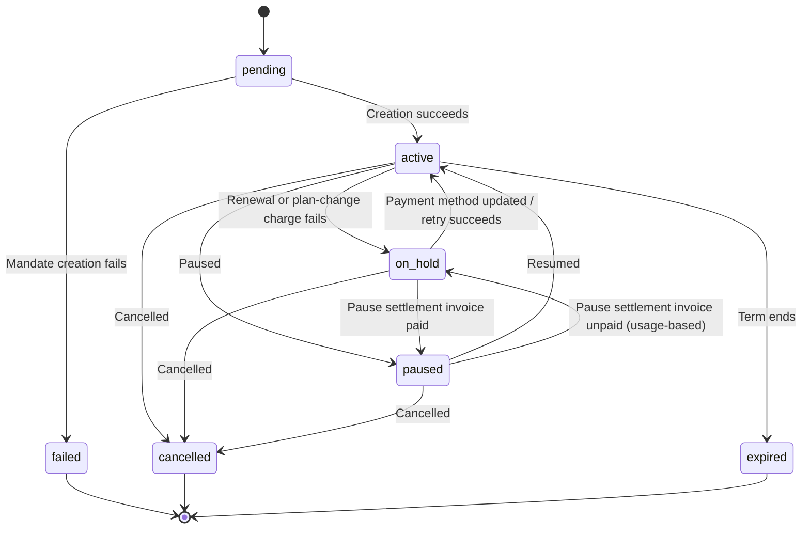

<Info>
Subscriptions let you sell ongoing access with automated renewals. Use flexible billing cycles, free trials, plan changes, and add‑ons to tailor pricing for each customer.
</Info>

<CardGroup cols={2}>
<Card title="Upgrade & Downgrade" icon="repeat" href="/developer-resources/subscription-upgrade-downgrade">
Control plan changes with proration and quantity updates.
</Card>

<Card title="On‑Demand Subscriptions" icon="bolt" href="/developer-resources/ondemand-subscriptions">
Authorize a mandate now and charge later with custom amounts.
</Card>

<Card title="Customer Portal" icon="id-card" href="/features/customer-portal">
Let customers manage plans, billing, and cancellations.
</Card>

<Card title="Subscription Webhooks" icon="code" href="/developer-resources/webhooks/intents/subscription">
React to lifecycle events like created, renewed, and canceled.
</Card>
</CardGroup>

## What Are Subscriptions?

Subscriptions are recurring products customers purchase on a schedule. They’re ideal for:

- **SaaS licenses**: Apps, APIs, or platform access
- **Memberships**: Communities, programs, or clubs
- **Digital content**: Courses, media, or premium content
- **Support plans**: SLAs, success packages, or maintenance

## Key Benefits

- **Predictable revenue**: Recurring billing with automated renewals
- **Flexible cycles**: Monthly, annual, custom intervals, and trials
- **Plan agility**: Proration for upgrades and downgrades
- **Add‑ons and seats**: Attach optional, quantifiable upgrades
- **Seamless checkout**: Hosted checkout and customer portal
- **Developer-first**: Clear APIs for creation, changes, and usage tracking

## Creating Subscriptions

Create subscription products in your Dodo Payments dashboard, then sell them through checkout or your API. Separating products from active subscriptions lets you version pricing, attach add‑ons, and track performance independently.

### Subscription product creation

Configure the fields in the dashboard to define how your subscription sells, renews, and bills. The sections below map directly to what you see in the creation form.

#### Product details

- **Product Name** (required): The display name shown in checkout, customer portal, and invoices.
- **Product Description** (required): A clear value statement that appears in checkout and invoices.
- **Product Image** (required): PNG/JPG/WebP up to 3 MB. Used on checkout and invoices.
- **Brand**: Associate the product with a specific brand for theming and emails.
- **Tax Category** (required): Choose the category (for example, SaaS) to determine tax rules.

<Tip>
Pick the most accurate tax category to ensure correct tax collection per region.
</Tip>

#### Pricing

- **Preistyp**: Wähle <b>Subscription</b> (dieser Leitfaden). Alternativen sind Einzelzahlung und nutzungsbasierte Abrechnung.
- **Preis** (erforderlich): Wiederkehrender Grundpreis mit Währung. Der Preis muss mindestens **$1** (oder dem Gegenwert in der gewählten Währung) entsprechen. Beträge unter diesem Mindestwert werden nicht unterstützt, und die Subscription funktioniert nicht.
- **Rabatt anwendbar (%)**: Optionaler prozentualer Rabatt auf den Grundpreis; wird im Checkout und auf Rechnungen berücksichtigt.
- **Zahlung wiederholen alle** (erforderlich): Intervall für Verlängerungen, z. B. jeden Monat. Wähle den Turnus (Monate oder Jahre) und die Anzahl.
- **Subscription-Zeitraum** (erforderlich): Gesamtlaufzeit, während der die Subscription aktiv bleibt (z. B. 10 Jahre). Nach Ablauf dieses Zeitraums werden keine Verlängerungen mehr durchgeführt, sofern der Zeitraum nicht erweitert wird.
- **Tage des Testzeitraums** (erforderlich): Lege die Länge des Testzeitraums in Tagen fest. Verwende 0, um Testzeiträume zu deaktivieren. Die erste Abbuchung erfolgt automatisch nach Ende des Testzeitraums.
- **Testbetrag**: Optionale Vorauszahlung für einen kostenpflichtigen Testzeitraum. Lass das Feld leer für einen kostenlosen Testzeitraum. Siehe [Kostenpflichtige Testzeiträume](#paid-trials).
- **Add-on auswählen**: Füge bis zu 10 Add-ons hinzu, die Kunden zusammen mit dem Basistarif erwerben können.

<Warning>
Changing pricing on an active product affects new purchases. Existing subscriptions follow your plan‑change and proration settings.
</Warning>

<Info>
Add‑ons are ideal for quantifiable extras such as seats or storage. You can control allowed quantities and proration behavior when customers change them.
</Info>

#### Advanced settings

- **Tax Inclusive Pricing**: Display prices inclusive of applicable taxes. Final tax calculation still varies by customer location.
- **Generate license keys**: Issue a unique key to each customer after purchase. See the <a href="/features/license-keys">License Keys</a> guide.
- **Digital Product Delivery**: Deliver files or content automatically after purchase. Learn more in <a href="/features/digital-product-delivery">Digital Product Delivery</a>.
- **Metadata**: Attach custom key–value pairs for internal tagging or client integrations. See <a href="/api-reference/metadata">Metadata</a>.

<Tip>
Use metadata to store identifiers from your system (e.g., accountId) so you can reconcile events and invoices later.
</Tip>

## Subscription Trials

Testzeiträume ermöglichen es Kunden, eine Subscription zu prüfen, bevor sie den vollständigen wiederkehrenden Preis bezahlen. Ein Testzeitraum kann **kostenlos** sein, wobei bis zu seinem Ende nichts berechnet wird, oder **kostenpflichtig**, wobei vorab ein reduzierter Betrag berechnet wird. In beiden Fällen beginnt die Berechnung des vollständigen Preises mit der ersten Verlängerung nach Ende des Testzeitraums.

### Configuring Trials

Set **Trial Period Days** in the product pricing section (use `0` to disable). You can override this when creating subscriptions:

```typescript
// Via subscription creation
const subscription = await client.subscriptions.create({
  customer: { customer_id: 'cus_123' },
  billing: { country: 'US' },
  product_id: 'pdt_monthly',
  quantity: 1,
  trial_period_days: 14  // Overrides product's trial period
});

// Via checkout session
const session = await client.checkoutSessions.create({
  product_cart: [{ product_id: 'pdt_monthly', quantity: 1 }],
  subscription_data: { trial_period_days: 14 }
});
```

<Warning>
The `trial_period_days` value must be between 0 and 10,000 days.
</Warning>

### Kostenpflichtige Testzeiträume

Testzeiträume müssen nicht kostenlos sein. Lege beim wiederkehrenden Preis eines Subscription-Produkts einen **Testbetrag** fest, um für das Testfenster eine reduzierte Vorauszahlung zu berechnen. Der vollständige wiederkehrende Preis wird dann mit der ersten Verlängerung berechnet.

<Frame>

</Frame>

Kostenpflichtige Testzeiträume werden über den Checkout konfiguriert, nicht pro Subscription oder Checkout-Session:

| Feld | Typ | Beschreibung |
|-------|------|-------------|
| `trial_amount` | integer | Heute für den Testzeitraum berechneter Betrag in den kleineren Währungseinheiten der Preiswährung (zum Beispiel `500` für $5.00). Erfordert `trial_period_days > 0`. Für einen kostenlosen Testzeitraum weglassen oder auf `null` setzen. |
| `trial_apply_discounts` | boolean | Gibt an, ob Checkout-Rabattcodes die Testgebühr reduzieren. Standardmäßig `false`, sodass der Testbetrag auch dann vollständig berechnet wird, wenn ein Rabatt auf den wiederkehrenden Preis angewendet wird. |

```typescript
const product = await client.products.create({
  name: 'Pro Plan',
  tax_category: 'saas',
  price: {
    type: 'recurring_price',
    price: 2900,                      // $29.00 per month after the trial
    currency: 'USD',
    discount: 0,
    purchasing_power_parity: false,
    payment_frequency_count: 1,
    payment_frequency_interval: 'Month',
    subscription_period_count: 1,
    subscription_period_interval: 'Year',
    trial_period_days: 14,            // A paid trial requires a positive trial period
    trial_amount: 500,                // $5.00 charged today
    trial_apply_discounts: false      // Discounts apply to the recurring price only
  }
});
```

Kostenpflichtige Testzeiträume durchlaufen ebenfalls den Checkout. Der Testbetrag wird besteuert, in den Berechnungen der Checkout-Session und in der Preisgestaltung von Payment Links angezeigt, und das Adaptive Currency-Aufgeld wird je nach Währung angewendet. Der [Preview-Endpunkt](/developer-resources/checkout-session) gibt `trial_amount` und `trial_period_days` zurück, damit du den heute fälligen Betrag anzeigen kannst, bevor die Subscription erstellt wird.

<Info>
Kostenlose Testzeiträume bleiben unverändert. Wenn du **Testbetrag** nicht festlegst, bleibt das bestehende Verhalten erhalten: Die erste Abbuchung beträgt `0` und der vollständige Preis wird nach Ende des Testzeitraums berechnet.
</Info>

### Verhindern des Missbrauchs von Testzeiträumen

**Missbrauch von Testzeiträumen verhindern** verhindert, dass Kunden wiederholt Testzeiträume für dasselbe Unternehmen beanspruchen. Wenn diese Option aktiviert ist, wird ein Kunde, der bereits einen Testzeitraum eingelöst hat, automatisch zu einem **kostenpflichtigen Kauf ohne Testzeitraum** herabgestuft, anstatt einen neuen Testzeitraum zu erhalten.

<Frame>

</Frame>

Aktiviere die Option im Tab **Subscriptions** unter **Settings**. Nach der Aktivierung gilt:

- Kunden werden anhand der **normalisierten E-Mail-Adresse** abgeglichen. Dabei werden Plus-Aliase entfernt, sodass `user+trial@example.com` und `user@example.com` als dieselbe Person gelten.
- Einlösungen werden bei der **Aktivierung des Testzeitraums** erfasst. Ein Kunde, der noch am selben Tag kündigt, hat seinen Testzeitraum daher trotzdem verbraucht.
- Bestehende Kunden werden anhand ihrer früheren Testzeiträume per E-Mail nachgetragen, sodass frühere Nutzer von Testzeiträumen sofort erkannt werden.

<Info>
Die Einstellung ist standardmäßig **deaktiviert**. Eine vollständige Liste der Subscription-Steuerungen auf Unternehmensebene findest du unter [Subscription Settings](/features/product-collections#subscription-settings).
</Info>

### Erkennen des Testzeitraumstatus

<Warning>
Derzeit gibt es kein direktes Feld zum Erkennen des Testzeitraumstatus. Die folgende Umgehungslösung erfordert das Abfragen von Zahlungen und ist daher ineffizient. Wir arbeiten an einer effizienteren Lösung.
</Warning>

Um festzustellen, ob sich eine Subscription mit einem **kostenlosen Testzeitraum** im Testzeitraum befindet, rufe die Liste der Zahlungen für die Subscription ab. Gibt es genau eine Zahlung mit dem Betrag 0, befindet sich die Subscription im Testzeitraum:

```typescript
const subscription = await client.subscriptions.retrieve('sub_123');
const payments = await client.payments.list({
  subscription_id: subscription.subscription_id
});

// Check if subscription is in trial
const isInTrial = payments.items.length === 1 && 
                  payments.items[0].total_amount === 0;
```

<Warning>
Diese Prüfung auf den Betrag null funktioniert nur bei kostenlosen Testzeiträumen. Bei einem [kostenpflichtigen Testzeitraum](#paid-trials) entspricht die erste Zahlung dem Testbetrag und nicht `0`. Vergleiche stattdessen die erste Zahlung mit `trial_amount` der Subscription oder prüfe, ob `next_billing_date` noch innerhalb des Testzeitraums liegt.
</Warning>

### Testzeitraum aktualisieren

Verlängere den Testzeitraum, indem du `next_billing_date` aktualisierst:

```typescript
await client.subscriptions.update('sub_123', {
  next_billing_date: '2025-02-15T00:00:00Z'  // New trial end date
});
```

<Warning>
Du kannst `next_billing_date` nicht auf einen Zeitpunkt in der Vergangenheit setzen. Das Datum muss in der Zukunft liegen.
</Warning>

## Änderungen an Subscription-Tarifen

Tarifänderungen ermöglichen Upgrades oder Downgrades von Subscriptions, die Anpassung von Mengen oder die Migration zu anderen Produkten. Je nach ausgewähltem Proration-Modus kann eine Änderung eine sofortige Belastung auslösen, ein Guthaben erstellen oder keine Anpassung der Abrechnung vornehmen.

<Tip>
Du kannst Subscription-Tarife ändern und das nächste Abrechnungsdatum direkt über das Dodo Payments-Dashboard aktualisieren. So lassen sich Subscriptions für Supportanfragen, werbliche Upgrades oder Tarifmigrationen schnell anpassen, ohne API-Aufrufe durchzuführen.
</Tip>

<Tip>
**Self-Service-Tarifänderungen aktivieren:** Sollen Kunden ihre eigenen Subscriptions über das Customer Portal upgraden oder downgraden können? Füge deine Subscription-Produkte einer Product Collection hinzu und aktiviere in deinen Subscription Settings die Option „Allow Subscription Updates“.
</Tip>



<Card title="Product Collections" icon="layer-group" href="/features/product-collections">
  Gruppiere verwandte Produkte in Collections, um nahtlose Upgrade-/Downgrade-Pfade im Customer Portal zu ermöglichen.
</Card>

### Proration-Modi

Wähle aus, wie Kunden bei Tarifänderungen abgerechnet werden:

<Info>
**Kurzer Vergleich der vier Proration-Modi:**

| | `prorated_immediately` | `difference_immediately` | `full_immediately` | `do_not_bill` |
|---|---|---|---|---|
| **Upgrade** | Anteilig berechneter Betrag für verbleibende Tage | Vollständige Preisdifferenz wird berechnet | Vollständiger Preis des neuen Tarifs wird berechnet | Keine Belastung – sofortiger Wechsel |
| **Downgrade** | Anteiliges Guthaben für verbleibende Tage | Vollständige Preisdifferenz als Guthaben | Kein Guthaben, vollständige Belastung | Kein Guthaben – sofortiger Wechsel |
| **Abrechnungszyklus** | Wird auf heute zurückgesetzt | Wird auf heute zurückgesetzt | Wird auf heute zurückgesetzt | Bleibt gleich |
| **Am besten geeignet für** | Faire zeitbasierte Abrechnung | Einfache Tarifstufenänderungen | Zurücksetzen von Abrechnungszyklen | Kostenlose Migrationen oder Kulanzwechsel |
</Info>

#### `prorated_immediately`
Berechnet einen anteiligen Betrag auf Grundlage der verbleibenden Zeit im aktuellen Abrechnungszyklus. Geeignet für eine faire Abrechnung, die ungenutzte Zeit berücksichtigt.

```typescript
await client.subscriptions.changePlan('sub_123', {
  product_id: 'pdt_pro',
  quantity: 1,
  proration_billing_mode: 'prorated_immediately'
});
```

#### `difference_immediately`
Berechnet die Preisdifferenz sofort (Upgrade) oder fügt Guthaben für zukünftige Verlängerungen hinzu (Downgrade). Geeignet für einfache Upgrade-/Downgrade-Szenarien.

```typescript
// Upgrade: charges $50 (difference between $30 and $80)
// Downgrade: credits remaining value, auto-applied to renewals
await client.subscriptions.changePlan('sub_123', {
  product_id: 'pdt_pro',
  quantity: 1,
  proration_billing_mode: 'difference_immediately'
});
```

<Info>
Guthaben aus Downgrades mit `difference_immediately` ist auf die Subscription beschränkt und wird automatisch auf zukünftige Verlängerungen angewendet. Es unterscheidet sich von den Berechtigungen der <a href="/features/credit-based-billing">Credit-Based Billing</a>.
</Info>

Wenn ein Kunde mit `difference_immediately` downgradet, wird der ungenutzte Wert zu einem auf die Subscription beschränkten Guthaben, das zukünftige Verlängerungen automatisch verrechnet:



#### `full_immediately`
Berechnet sofort den vollständigen Betrag des neuen Tarifs und ignoriert die verbleibende Zeit. Geeignet zum Zurücksetzen von Abrechnungszyklen.

```typescript
await client.subscriptions.changePlan('sub_123', {
  product_id: 'pdt_monthly',
  quantity: 1,
  proration_billing_mode: 'full_immediately'
});
```

#### `do_not_bill`
Wechselt ohne Anpassung der Abrechnung zum neuen Tarif. Es gibt weder Proration-Belastungen noch Guthaben – der Kunde wechselt einfach zum neuen Tarif. Geeignet für Kulanzmigrationen, kostenlose Tarifwechsel oder Situationen, in denen du die Kostendifferenz übernehmen möchtest.

```typescript
await client.subscriptions.changePlan('sub_123', {
  product_id: 'pdt_new_plan',
  quantity: 1,
  proration_billing_mode: 'do_not_bill'
});
```

<AccordionGroup>
<Accordion title="Example: Prorated upgrade calculation">

**Szenario**: Ein Kunde im Basic-Tarif ($30/Monat) führt am 16. Tag eines 30-tägigen Zyklus mit `prorated_immediately` ein Upgrade auf Pro ($80/Monat) durch.

```
Unused credit from Basic = $30 × (15 remaining / 30 total) = $15.00
Prorated cost of Pro     = $80 × (15 remaining / 30 total) = $40.00
────────────────────────────────────────────────────────────────────
Immediate charge         = $40.00 − $15.00 = $25.00
```

Die nächste Verlängerung erfolgt am **15. Februar** (16. Januar + 30 Tage): **$80.00/Monat**.

<Tip>
Ausführlichere Berechnungsbeispiele und Sonderfälle findest du in unserem vollständigen [Upgrade-&-Downgrade-Leitfaden](/developer-resources/subscription-upgrade-downgrade).
</Tip>

</Accordion>
<Accordion title="Example: Downgrade credit calculation">

**Szenario**: Ein Kunde im Pro-Tarif ($80/Monat) downgradet mit `difference_immediately` auf Starter ($20/Monat).

```
Credit = Old plan − New plan = $80 − $20 = $60.00
```

Das Guthaben von $60 wird automatisch auf zukünftige Verlängerungen angewendet:
- Verlängerung 1: $20 − $20 (Guthaben) = **$0.00** (verbleibendes Guthaben: $40)
- Verlängerung 2: $20 − $20 (Guthaben) = **$0.00** (verbleibendes Guthaben: $20)  
- Verlängerung 3: $20 − $20 (Guthaben) = **$0.00** (Guthaben aufgebraucht)
- Verlängerung 4: **$20.00** (vollständiger Preis)

<Info>
Mehr darüber, wie Guthaben verwaltet wird, erfährst du im [Upgrade-&-Downgrade-Leitfaden](/developer-resources/subscription-upgrade-downgrade).
</Info>

</Accordion>
</AccordionGroup>

### Tarifänderungen mit Add-ons

Ändere Add-ons bei Tarifänderungen. Add-ons werden in die Proration-Berechnungen einbezogen:

```typescript
await client.subscriptions.changePlan('sub_123', {
  product_id: 'pdt_pro',
  quantity: 1,
  proration_billing_mode: 'difference_immediately',
  addons: [{ addon_id: 'addon_extra_seats', quantity: 2 }]  // Add add-ons
  // addons: []  // Empty array removes all existing add-ons
});
```

<Info>
Standardmäßig lösen (`effective_at: 'immediately'`)-Änderungen sofortige Abbuchungen aus. Übergeben Sie `effective_at: 'next_billing_date'`, um die Änderung stattdessen für das nächste Abrechnungsdatum zu planen — die ausstehende Änderung wird beim Abonnement als `scheduled_change` zurückgegeben und kann mit [Geplante Planänderung stornieren](/api-reference/subscriptions/cancel-change-plan) storniert werden. Fehlgeschlagene Abbuchungen können das Abonnement in den Status `on_hold` versetzen, es sei denn, Sie übergeben `on_payment_failure: 'prevent_change'`; dadurch bleibt das Abonnement bei seinem aktuellen Plan, bis die Zahlung erfolgreich ist. Verfolgen Sie Änderungen über `subscription.plan_changed` Webhook-Events.
</Info>

### Tarifänderungen anzeigen

Zeige vor der Bestätigung einer Tarifänderung die genaue Belastung und die daraus resultierende Subscription an:

```typescript
const preview = await client.subscriptions.previewChangePlan('sub_123', {
  product_id: 'pdt_pro',
  quantity: 1,
  proration_billing_mode: 'prorated_immediately'
});

// Show customer the charge before confirming
console.log('You will be charged:', preview.immediate_charge.summary);
```

<Card title="Preview Change Plan API" icon="eye" href="/api-reference/subscriptions/preview-change-plan">
  Zeige Tarifänderungen an, bevor du sie bestätigst.
</Card>

## Abonnements pausieren und fortsetzen

Beim Pausieren wird ein Abonnement eingefroren, anstatt es zu beenden. Die Abrechnung wird angehalten, der Zugriff entzogen und das Abonnement behält seinen Tarif und seinen Verlauf, sodass der Kunde genau dort weitermachen kann, wo er aufgehört hat. Nutze diese Funktion als Alternative zur Kündigung, um Kunden zu halten.

Öffne unter **Sales → Subscriptions** ein beliebiges aktives Abonnement und klicke auf **Pause subscription**. Der Status ändert sich zu `paused` und Verlängerungen werden angehalten, bis das Abonnement fortgesetzt wird.

<Frame>
    
</Frame>

### Was beim Pausieren geschieht

- **Verlängerungen werden angehalten.** Während das Abonnement pausiert ist, wird keine Rechnung erstellt und keine Verlängerungsgebühr eingezogen.
- **Der Zugriff wird sofort entzogen.** Beim Pausieren werden alle auf dem Abonnement bereitgestellten und ausstehenden [entitlement grants](/features/entitlements/introduction) widerrufen. Dadurch werden die [license keys](/features/license-keys) deaktiviert und es werden keine neuen Download-URLs für [digital products](/features/digital-product-delivery) ausgegeben. Beim Fortsetzen werden sie erneut gewährt – genauso wie bei der Wiederherstellung aus `on_hold`.
- **Die Abrechnungsuhr wird eingefroren.** `next_billing_date` und `expires_at` werden beide um genau die Dauer der Pause nach hinten verschoben, sodass der Kunde die bereits bezahlte Zeit behält.
- **Es gibt keine Begrenzung der Pausendauer.** Ein pausiertes Abonnement bleibt pausiert, bis jemand es fortsetzt. Eine Pausendauer muss nicht im Voraus festgelegt werden.

<Warning>
Beim Pausieren wird der Zugriff sofort entzogen, nicht erst am Ende des Abrechnungszeitraums. Wenn ein Abonnement den Zugriff auf dein Produkt steuert, solltest du den Kunden darüber informieren, bevor er bestätigt.
</Warning>

Durch das Fortsetzen erhält das Abonnement wieder den Status `active` und seine Berechtigungen werden wiederhergestellt. Da die Uhr eingefroren war, findet die nächste Verlängerung um die Pausendauer später als ursprünglich geplant statt – ein 12 Tage pausiertes Abonnement verlängert sich 12 Tage später.

### Nutzungsbasierte Abonnements pausieren

Bei einem [usage-based](/features/usage-based-billing/introduction) Abonnement kann zum Zeitpunkt des Pausierens eine Nutzung erfasst, aber noch nicht abgerechnet worden sein. **Bill Usage at Pause** unter **Settings → Subscriptions** bestimmt, was damit geschieht:

| Einstellung | Verhalten |
|---------|----------|
| **On** (Standard) | Dodo Payments stellt eine Rechnung für die seit dem letzten Abrechnungsdatum angefallene Nutzung aus und zieht den Betrag sofort ein. |
| **Off** | Die ausstehende Nutzung wird vorgetragen und auf der nächsten regulären Rechnung des Abonnements abgerechnet. |

Auf diese Weise wird nur die gemessene Nutzung abgerechnet – die wiederkehrende Grundgebühr wird zum Zeitpunkt des Pausierens niemals berechnet. Bei Standard- und On-Demand-Abonnements gibt es nichts abzurechnen, daher hat diese Einstellung keine Auswirkungen auf sie.

<Info>
**Bill Usage at Pause** wird pro Abrechnungszyklus erfasst. Eine Änderung innerhalb eines Zyklus ändert nicht, wie der bereits laufende Zyklus abgerechnet wird; der neue Wert gilt ab dem nächsten Zyklus.
</Info>

<Warning>
Die Abrechnungsrechnung wird wie jede andere Rechnung eingezogen und kann daher fehlschlagen. Wenn sie nach Ablauf der [dunning](/features/recovery/subscription-dunning)-Kulanzfrist unbezahlt bleibt, wechselt das Abonnement zu `on_hold` und bleibt gleichzeitig als pausiert markiert.
</Warning>

Ein Abonnement in diesem Zustand kann auf zwei Arten fortgesetzt werden. Sie unterscheiden sich darin, wer die ausstehende Nutzung übernimmt:

| Ausweg | Ergebnis |
|------|--------|
| Die Abrechnungsrechnung wird bezahlt | Das Abonnement erhält wieder den Status `paused`, nicht `active`. Setze es ausdrücklich fort, sobald der Kunde bereit ist. |
| Du setzt es direkt fort | Das Abonnement wechselt direkt zu `active` und die unbezahlte Abrechnungsrechnung wird zusammen mit ihren ausstehenden Wiederholungsversuchen **storniert**. Die ausstehende Nutzung wird abgeschrieben. |

<Info>
Das Fortsetzen ist ein gültiger Ausweg aus diesem Sperrzustand – die Abrechnungsrechnung muss nicht zuerst eingezogen werden. Beachte jedoch, dass durch das Fortsetzen die ausstehende Nutzung erlassen und nicht aufgeschoben wird.
</Info>

### Kunden erlauben, ihre eigenen Abonnements zu pausieren

**Allow Subscription Pause** unter **Settings → Subscriptions** steuert, ob Kunden Abonnements über das Customer Portal pausieren und fortsetzen können. Die Option ist **standardmäßig deaktiviert**, sodass das Selbstbedienungs-Pausieren ausdrücklich aktiviert werden muss.

<Frame>
    
</Frame>

Diese Einstellung gilt nur für das Customer Portal. Du kannst Abonnements immer über das Dashboard oder die API pausieren und fortsetzen, unabhängig davon, wie der Schalter eingestellt ist.

Wenn du die Option deaktivierst, werden neue Pausierungen durch Kunden verhindert. Kunden, deren Abonnement bereits pausiert ist, werden jedoch nicht daran gehindert, es fortzusetzen – sie können eine selbst gestartete Pause weiterhin beenden. Von dir gestartete Pausen bleiben unter deiner Kontrolle.

<Card title="Pausing from the Customer Portal" icon="id-card" href="/features/customer-portal#pausing-a-subscription">
Sieh dir an, was der Kunde einschließlich des Bestätigungsdialogs sieht.
</Card>

### Über die API pausieren

Pausieren und Fortsetzen erfolgen über das Feld `status` am Endpunkt zum Aktualisieren des Abonnements. Es gibt keinen separaten Endpunkt zum Pausieren.

```typescript
// Pause
await client.subscriptions.update('sub_123', { status: 'paused' });

// Resume
await client.subscriptions.update('sub_123', { status: 'active' });
```

<Warning>
Senden Sie `paused` oder `active` allein — die Kombination eines der beiden Felder mit einem anderen Feld wird mit `422` abgelehnt. Das ältere boolesche Feld `pause` wurde entfernt und schlägt nun immer mit `422` fehl, sodass ein Aufrufer, der es noch verwendet, einen deutlichen Fehler anstelle eines stillen No-op erhält.
</Warning>

Beim Pausieren wird `subscription.paused` ausgegeben, beim Fortsetzen `subscription.unpaused`. Beide enthalten das vollständige Abonnementobjekt. Dabei ist `paused_at` während der Pause gesetzt und `null` nach dem Fortsetzen.

### Pausieren und andere Aktionen für Abonnements

- **Kündigungen funktionieren weiterhin.** Du kannst ein pausiertes Abonnement genauso kündigen wie ein aktives. Eine offene Abrechnungsrechnung aus der Pause wird dabei storniert.
- **Geplante Tarifänderungen werden verzögert, nicht verworfen.** Eine für das nächste Abrechnungsdatum geplante [Tarifänderung](#subscription-plan-changes) bleibt während der Pause unverändert und wird beim verschobenen Abrechnungsdatum nach dem Fortsetzen angewendet. Ihr `scheduled_change.effective_at` ist eine Momentaufnahme aus dem Zeitpunkt der Planung und wird nicht an die Pause angepasst. Daher kann ein Datum in der Vergangenheit angezeigt werden – interpretiere es als „war geplant für“ und nicht als garantiertes Datum. Um die Änderung zu verwerfen, statt sie auszuführen, verwende [Cancel Scheduled Plan Change](/api-reference/subscriptions/cancel-change-plan).

## Abonnementstatus

Ein Abonnement durchläuft während seiner Laufzeit eine festgelegte Reihe von Status. Diese Tabelle dient als Referenz für jeden Status, seine Ursache und die Möglichkeit zur Wiederherstellung.

| Status | Bedeutung | Wiederherstellbar? | Wiederherstellung / nächster Schritt |
|--------|-----------|--------------------|---------------------------------------|
| `pending` | Das Abonnement wird erstellt oder verarbeitet | — | Auf `subscription.active` (oder `subscription.failed`) warten |
| `active` | Das Abonnement ist aktiv und wird automatisch verlängert | — | Keine Aktion erforderlich |
| `on_hold` | Eine Zahlung für eine Verlängerung (oder eine Gebühr für eine Planänderung) ist fehlgeschlagen; Verlängerungen wurden gestoppt | **Ja** | Zahlungsmethode aktualisieren, um das Abonnement zu reaktivieren — automatisch über [Payment Retries](/features/recovery/payment-retries) und [Dunning](/features/recovery/subscription-dunning) oder manuell über die [Update Payment Method API](/api-reference/subscriptions/update-payment-method) |
| `paused` | Das Abonnement wurde von Ihnen oder dem Kunden absichtlich pausiert; die Abrechnung ist eingefroren und der Zugriff wurde entzogen | **Ja** | Mit `status: active` fortsetzen oder über das Customer Portal, wenn das Self-Service-Pausieren aktiviert ist — siehe [Abonnements pausieren und fortsetzen](#pausing-and-resuming-subscriptions) |
| `cancelled` | Das Abonnement wurde gekündigt und wird nicht verlängert | Nur erneuter Kauf | Der Kunde muss ein neues Abonnement starten; [Dunning](/features/recovery/subscription-dunning) kann zu einem erneuten Kauf auffordern |
| `failed` | Die **Erstellung** des Abonnements ist fehlgeschlagen (das anfängliche Mandat oder die Zahlung war nicht erfolgreich) | **Nein — endgültig** | Der Kunde muss mit einer funktionierenden Zahlungsmethode ein neues Abonnement erstellen |
| `expired` | Das Abonnement hat das Ende seiner Laufzeit erreicht | — | Der Kunde muss bei Bedarf ein neues Abonnement starten |

<Warning>
`on_hold` und `failed` werden häufig verwechselt. `on_hold` ist ein **wiederherstellbarer** Status für ein bereits aktives Abonnement, dessen Verlängerung fehlgeschlagen ist. `failed` ist ein **endgültiger** Status, der nur auftritt, wenn die **erstmalige** Erstellung des Abonnements fehlschlägt – das Abonnement kann nicht reaktiviert werden.
</Warning>

<Info>
`on_hold` und `paused` sind ebenfalls unterschiedlich. `on_hold` ist unfreiwillig – eine Zahlung ist fehlgeschlagen. `paused` ist beabsichtigt – du oder der Kunde habt das Abonnement eingefroren, und solange es pausiert ist, wird keine Verlängerung versucht. Bei einem nutzungsbasierten Abonnement kann zum Zeitpunkt des Pausierens weiterhin eine einmalige Abrechnungsrechnung ausstehen; siehe [Nutzungsbasierte Abonnements pausieren](#pausing-usage-based-subscriptions).
</Info>

### Zustandsautomat



### Status „On Hold“

Ein Abonnement wechselt in den Status `on_hold`, wenn:

- Eine Verlängerungszahlung fehlschlägt (unzureichendes Guthaben, abgelaufene Karte usw.)
- Eine Gebühr für eine Tarifänderung fehlschlägt
- Die Autorisierung der Zahlungsmethode fehlschlägt
- Eine [Abrechnungsrechnung für eine Pause](#pausing-usage-based-subscriptions) eines nutzungsbasierten Abonnements unbezahlt bleibt

<Warning>
Wenn sich ein Abonnement im Status `on_hold` befindet, wird es nicht automatisch verlängert. Du musst die Zahlungsmethode aktualisieren, um das Abonnement zu reaktivieren.
</Warning>

### Aus dem Status „On Hold“ reaktivieren

Um ein Abonnement aus dem Status `on_hold` zu reaktivieren, aktualisiere die Zahlungsmethode. Dadurch werden automatisch folgende Schritte ausgeführt:

1. Eine Gebühr für die verbleibenden offenen Beträge wird erstellt
2. Eine Rechnung wird generiert
3. Die Zahlung wird mit der neuen Zahlungsmethode verarbeitet
4. Das Abonnement wird bei erfolgreicher Zahlung in den Status `active` reaktiviert

<Note>
Die einzige Ausnahme ist ein durch eine unbezahlte Abrechnungsrechnung für eine Pause verursachter Sperrzustand. Durch das Begleichen dieser Rechnung erhält das Abonnement wieder den Status `paused` und nicht `active`, da es sich vor dem Zahlungsfehler in der Pause befand. Setze es ausdrücklich fort, sobald die Rechnung beglichen ist.
</Note>

```typescript
// Reactivate subscription from on_hold
const response = await client.subscriptions.updatePaymentMethod('sub_123', {
  payment_method: {
    type: 'new',
    return_url: 'https://example.com/return'
  }
});

// For on_hold subscriptions, a charge is automatically created
if (response.payment_id) {
  console.log('Charge created:', response.payment_id);
  // Redirect customer to response.payment_link to complete payment
  // Monitor webhooks for payment.succeeded and subscription.active
}
```

<Info>
Nach der erfolgreichen Aktualisierung der Zahlungsmethode für ein Abonnement im Status `on_hold` erhältst du die Webhook-Ereignisse `payment.succeeded` gefolgt von `subscription.active`.
</Info>

### Webhook-Ereignisse nach Übergang

Jeder Statusübergang löst einen Webhook aus, sodass du die Berechtigungslogik ohne Polling steuern kannst:

| Übergang | Ereignis |
|------------|-------|
| Abonnement aktiviert | `subscription.active` |
| Verlängerung erfolgreich | `subscription.renewed` |
| Verlängerung fehlgeschlagen → On Hold | `subscription.on_hold` |
| Abonnement pausiert | `subscription.paused` |
| Pausiertes Abonnement fortgesetzt | `subscription.unpaused` |
| Erstellung fehlgeschlagen | `subscription.failed` |
| Tarif hochgestuft/herabgestuft | `subscription.plan_changed` |
| Gekündigt | `subscription.cancelled` |
| Laufzeit beendet | `subscription.expired` |
| Beliebige Feldänderungen | `subscription.updated` |

<Card title="Subscription Webhook Payloads" icon="webhook" href="/developer-resources/webhooks/intents/subscription">
Sieh dir das vollständige Payload-Schema für Lifecycle-Ereignisse von Abonnements an.
</Card>

## API-Verwaltung

<AccordionGroup>
<Accordion title="Create subscriptions">
Verwende `POST /checkouts`, um Abonnements programmgesteuert aus Produkten mit optionalen Testphasen (`subscription_data.trial_period_days`) und Add-ons (`product_cart[].addons`) zu erstellen.

<Warning>
`POST /subscriptions` ist veraltet. Bestehende Integrationen funktionieren weiterhin, neue Integrationen sollten jedoch [Checkout Sessions](/api-reference/checkout-sessions/create) verwenden.
</Warning>

<Card title="API Reference" icon="code" href="/api-reference/checkout-sessions/create">
Sieh dir die API zum Erstellen einer Checkout Session an.
</Card>
</Accordion>

<Accordion title="Update subscriptions">
Verwende `PATCH /subscriptions/{subscription_id}`, um zum nächsten Abrechnungsdatum zu kündigen, die Abonnementlaufzeit zu verlängern, Abrechnungsdetails zu aktualisieren oder Metadaten zu ändern. Um die Menge zu ändern, verwende stattdessen die [Change Plan API](/api-reference/subscriptions/change-plan) – `PATCH` akzeptiert `quantity` nicht.

<Card title="API Reference" icon="code" href="/api-reference/subscriptions/patch-subscriptions">
Erfahre, wie du Abonnementdetails aktualisierst.
</Card>
</Accordion>

<Accordion title="Pause and resume subscriptions">
Pausieren und Fortsetzen erfolgen über denselben Endpunkt `PATCH /subscriptions/{subscription_id}` unter Verwendung des Felds `status`: `status: paused` pausiert ein aktives Abonnement, und `status: active` setzt es fort. Keiner der beiden Werte kann in derselben Anfrage mit einem anderen Feld kombiniert werden. Das vollständige Verhalten, die Auswirkungen auf die Abrechnung und die zugehörigen Geschäftseinstellungen finden Sie unter [Abonnements pausieren und fortsetzen](#pausing-and-resuming-subscriptions).

<Card title="API Reference" icon="code" href="/api-reference/subscriptions/patch-subscriptions">
Sehen Sie sich die API zum Aktualisieren des Abonnements an, einschließlich des Felds `status`.
</Card>
</Accordion>

<Accordion title="Change plans (proration)">
Ändere das aktive Produkt und die Mengen mit Steuerung der anteiligen Abrechnung.

<Card title="API Reference" icon="code" href="/api-reference/subscriptions/change-plan">
Sieh dir die Optionen für Tarifänderungen an.
</Card>
</Accordion>

<Accordion title="On‑demand charges">
Bei On-Demand-Abonnements kannst du bestimmte Beträge nach Bedarf berechnen.

<Card title="API Reference" icon="code" href="/api-reference/subscriptions/create-charge">
Ein On-Demand-Abonnement berechnen.
</Card>
</Accordion>

<Accordion title="List and retrieve">
Verwende `GET /subscriptions`, um alle Abonnements aufzulisten, und `GET /subscriptions/{id}`, um ein einzelnes abzurufen.

<Card title="API Reference" icon="code" href="/api-reference/subscriptions/get-subscriptions">
Sieh dir die APIs zum Auflisten und Abrufen an.
</Card>
</Accordion>

<Accordion title="Usage history">
Rufe erfasste Nutzung für gemessene oder hybride Preismodelle ab.

<Card title="API Reference" icon="code" href="/api-reference/subscriptions/get-usage-history">
Sieh dir die API für den Nutzungsverlauf an.
</Card>
</Accordion>

<Accordion title="Update payment method">
Aktualisiere die Zahlungsmethode für ein Abonnement. Bei aktiven Abonnements wird die Zahlungsmethode für zukünftige Verlängerungen aktualisiert. Bei Abonnements im Status `on_hold` wird das Abonnement reaktiviert, indem eine Gebühr für die verbleibenden offenen Beträge erstellt wird.

Beim Erstellen eines neuen Links für eine Zahlungsmethode (dem Anfragetyp `New`) kannst du `allowed_payment_method_types` übergeben, um einzuschränken, welche Zahlungsmethoden der Kunde auf dieser Seite sieht. Kunden sehen niemals eine Methode, die nicht in der Liste enthalten ist. Die Aufnahme einer Methode garantiert jedoch nicht, dass sie angezeigt wird, da ihre Verfügbarkeit weiterhin von Faktoren wie dem Standort des Kunden und deinen Geschäftseinstellungen abhängt.

<Card title="API Reference" icon="code" href="/api-reference/subscriptions/update-payment-method">
Erfahre, wie du Zahlungsmethoden aktualisierst und Abonnements reaktivierst.
</Card>
</Accordion>
</AccordionGroup>

## Häufige Anwendungsfälle

- **SaaS und APIs**: Gestaffelter Zugriff mit Add-ons für Sitze oder Nutzung
- **Inhalte und Medien**: Monatlicher Zugriff mit Einführungstests
- **B2B-Supportpläne**: Jahresverträge mit Premium-Support-Add-ons
- **Tools und Plugins**: Lizenzschlüssel und versionierte Releases

## Integrationsbeispiele

### Checkout Sessions (Abonnements)
Füge beim Erstellen von Checkout Sessions dein Abonnementprodukt und optionale Add-ons hinzu:

```typescript
const session = await client.checkoutSessions.create({
  product_cart: [
    {
      product_id: 'pdt_subscription',
      quantity: 1
    }
  ]
});
```

### Tarifänderungen mit anteiliger Abrechnung
Stufe ein Abonnement hoch oder herunter und steuere das Verhalten der anteiligen Abrechnung:

```typescript
await client.subscriptions.changePlan('sub_123', {
  product_id: 'pdt_new',
  quantity: 1,
  proration_billing_mode: 'difference_immediately'
});
```

### Zum nächsten Abrechnungsdatum kündigen
Plane eine Kündigung, die am Ende des aktuellen Abrechnungszeitraums wirksam wird:

```typescript
await client.subscriptions.update('sub_123', {
  cancel_at_next_billing_date: true
});
```

### Abonnementlaufzeit verlängern
Verlängere die Laufzeit eines Abonnements, indem du einen neuen `subscription_period_count` und `subscription_period_interval` an `PATCH /subscriptions/{subscription_id}` übergibst. Das Ablaufdatum des Abonnements wird anhand der neuen Anzahl und des neuen Intervalls neu berechnet – zum Beispiel, um einem Kunden zusätzliche Zeit für seinen aktuellen Tarif zu gewähren:

```typescript
await client.subscriptions.update('sub_123', {
  subscription_period_count: 5,
  subscription_period_interval: 'Month'
});
```

<Note>
Die Laufzeit eines Abonnements kann nur **verlängert**, niemals verkürzt werden.
</Note>

### On-Demand-Abonnements
Erstelle ein On-Demand-Abonnement und berechne Gebühren später nach Bedarf:

```typescript
const onDemand = await client.subscriptions.create({
  customer: { customer_id: 'cus_123' },
  billing: { country: 'US' },
  product_id: 'pdt_on_demand',
  quantity: 1,
  on_demand: { mandate_only: true }
});

await client.subscriptions.charge(onDemand.subscription_id, {
  product_price: 4900,
  product_currency: 'USD',
  product_description: 'Extra usage for September'
});
```

### Zahlungsmethode für aktives Abonnement aktualisieren
Aktualisiere die Zahlungsmethode für ein aktives Abonnement:

```typescript
// Update with new payment method
const response = await client.subscriptions.updatePaymentMethod('sub_123', {
  payment_method: {
    type: 'new',
    return_url: 'https://example.com/return'
  }
});

// Or use existing payment method
await client.subscriptions.updatePaymentMethod('sub_123', {
  payment_method: {
    type: 'existing',
    payment_method_id: 'pm_abc123'
  }
});
```

### Abonnement aus „on_hold“ reaktivieren
Reaktiviere ein Abonnement, das aufgrund einer fehlgeschlagenen Zahlung in den Status „On Hold“ gewechselt ist:

```typescript
// Update payment method - automatically creates charge for remaining dues
const response = await client.subscriptions.updatePaymentMethod('sub_123', {
  payment_method: {
    type: 'new',
    return_url: 'https://example.com/return'
  }
});

if (response.payment_id) {
  // Charge created for remaining dues
  // Redirect customer to response.payment_link
  // Monitor webhooks: payment.succeeded → subscription.active
}
```

## Abonnements mit RBI-konformen Mandaten

  UPI- und indische Kartenabonnements unterliegen den Vorschriften der RBI (Reserve Bank of India) mit spezifischen Anforderungen an Mandate:

  ### Mandatslimits

  Typ und Betrag des Mandats hängen von der wiederkehrenden Gebühr deines Abonnements ab:

  - **Gebühren unter dem Mandatsuntergrenzwert (standardmäßig ₹15.000):** Wir erstellen ein On-Demand-Mandat über den Untergrenzwert. Der Abonnementbetrag wird entsprechend der Abonnementfrequenz regelmäßig bis zum Mandatslimit berechnet.
  - **Gebühren in Höhe des oder über dem Mandatsuntergrenzwert:** Wir erstellen ein Abonnementmandat (oder On-Demand-Mandat) über den genauen Abonnementbetrag.

  Der Mandatsuntergrenzwert kann pro Händler oder pro Anfrage über `mandate_min_amount_inr_paise` (INR-Paise) konfiguriert werden. Der bei der Bank registrierte Betrag ist `max(mandate_floor, billing_amount)` – dadurch wird der Untergrenzwert effektiv zum kunden sichtbaren Autorisierungslimit, wenn die Abrechnung niedriger ausfällt.

Ausführliche Informationen zu RBI-konformen Mandaten und dem konfigurierbaren Mandatsuntergrenzwert für indische Zahlungsmethoden findest du auf der Seite <a href="/features/payment-methods/india#configurable-mandate-floor">India Payment Methods</a>.

  ### Überlegungen zu Hoch- und Herabstufungen

  **Wichtig:** Berücksichtige bei der Hoch- oder Herabstufung von Abonnements sorgfältig die Mandatslimits:

  - Wenn eine Hoch- oder Herabstufung zu einem Gebührenbetrag von mehr als 15.000 Rupien führt und das bestehende On-Demand-Zahlungslimit überschreitet, kann die Transaktionsgebühr fehlschlagen.
  - In solchen Fällen muss der Kunde möglicherweise seine Zahlungsmethode aktualisieren oder das Abonnement erneut ändern, um ein neues Mandat mit dem korrekten Limit einzurichten.

  ### Autorisierung hoher Gebühren

  Bei Abonnementgebühren von 15.000 Rupien oder mehr:

  - Die Bank fordert den Kunden zur Autorisierung der Transaktion auf.
  - Wenn der Kunde die Transaktion nicht autorisiert, schlägt die Transaktion fehl und das Abonnement wird in den Status „On Hold“ versetzt.

  ### Verarbeitungsverzögerung von 48 Stunden

  **Verarbeitungszeitplan:** Wiederkehrende Gebühren für indische Karten- und UPI-Abonnements folgen einem besonderen Verarbeitungsmuster:

  - Die Gebühren werden am geplanten Datum entsprechend der Abonnementfrequenz **initiiert**.
  - Der tatsächliche **Einzug** vom Konto des Kunden erfolgt erst **48 Stunden** nach der Zahlungsinitiierung.
  - Dieses 48-Stunden-Fenster kann je nach Antworten der Bank-API um **2–3 zusätzliche Stunden** verlängert werden.

  ### Zeitfenster für die Mandatskündigung

  Während des 48-stündigen Verarbeitungsfensters:

  - Kunden können das Mandat über ihre Banking-Apps kündigen.
  - Wenn ein Kunde das Mandat in diesem Zeitraum kündigt, bleibt das Abonnement **aktiv** (dies ist ein Sonderfall, der nur bei indischen Karten- und UPI-AutoPay-Abonnements auftritt).
  - Der tatsächliche Einzug kann jedoch fehlschlagen. In diesem Fall versetzen wir das Abonnement in den Status **On Hold**.

  **Umgang mit Sonderfällen:** Wenn du Kunden unmittelbar bei der Gebühreninitiierung Vorteile, Guthaben oder Abonnementnutzung gewährst, musst du dieses 48-Stunden-Fenster in deiner Anwendung angemessen berücksichtigen. Erwäge Folgendes:

  - Die Aktivierung von Vorteilen bis zur Zahlungsbestätigung verzögern
  - Kulanzfristen oder vorübergehenden Zugriff implementieren
  - Den Abonnementstatus auf Mandatskündigungen überwachen
  - Status „On Hold“ von Abonnements in der Anwendungslogik behandeln

  <Tip>
  Überwache Abonnement-Webhooks, um Änderungen des Zahlungsstatus zu verfolgen und Sonderfälle zu behandeln, in denen Mandate während des 48-Stunden-Fensters gekündigt werden.
  </Tip>

## Best Practices

- **Beginne mit klaren Stufen:** 2–3 Tarife mit deutlichen Unterschieden
- **Kommuniziere die Preise:** Zeige Gesamtbeträge, anteilige Abrechnung und nächste Verlängerung
- **Setze Testphasen sinnvoll ein:** Konvertiere mit Onboarding, nicht nur durch Zeit
- **Nutze Add-ons:** Halte Basistarife einfach und biete zusätzliche Funktionen als Upsell an
- **Teste Änderungen:** Validiere Tarifänderungen und anteilige Abrechnung im Testmodus

<Info>
Abonnements bieten eine flexible Grundlage für wiederkehrende Umsätze. Beginne einfach, teste gründlich und optimiere auf Grundlage von Akzeptanz-, Abwanderungs- und Expansionskennzahlen.
</Info>