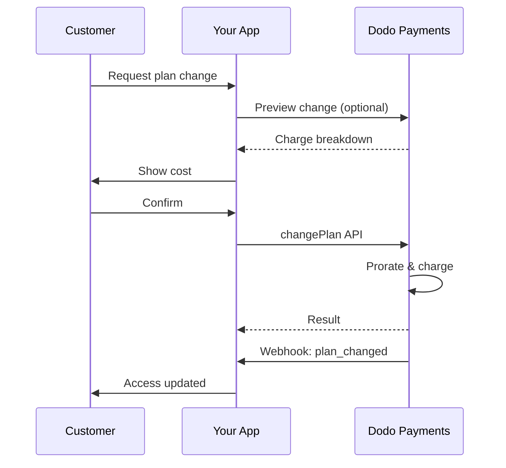
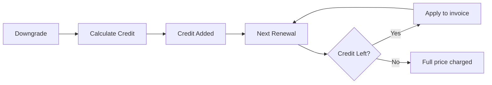

<Info>
Abonnements ermöglichen es Ihnen, fortlaufenden Zugang mit automatischen Erneuerungen zu verkaufen. Verwenden Sie flexible Abrechnungszyklen, kostenlose Testversionen, Planänderungen und Zusatzleistungen, um die Preise für jeden Kunden anzupassen.
</Info>

<CardGroup cols={2}>
<Card title="Upgrade & Downgrade" icon="repeat" href="/developer-resources/subscription-upgrade-downgrade">
Steuern Sie Planänderungen mit anteiliger Abrechnung und Mengenaktualisierungen.
</Card>

<Card title="On-Demand-Abonnements" icon="bolt" href="/developer-resources/ondemand-subscriptions">
Autorisieren Sie jetzt ein Mandat und berechnen Sie später mit benutzerdefinierten Beträgen.
</Card>

<Card title="Kundenportal" icon="id-card" href="/features/customer-portal">
Lassen Sie Kunden Pläne, Abrechnungen und Stornierungen verwalten.
</Card>

<Card title="Abonnement-Webhooks" icon="code" href="/developer-resources/webhooks/intents/subscription">
Reagieren Sie auf Lebenszyklusereignisse wie erstellt, erneuert und storniert.
</Card>
</CardGroup>

## Was sind Abonnements?

Abonnements sind wiederkehrende Produkte, die Kunden nach einem Zeitplan erwerben. Sie sind ideal für:

- **SaaS-Lizenzen**: Apps, APIs oder Plattformzugang
- **Mitgliedschaften**: Gemeinschaften, Programme oder Clubs
- **Digitale Inhalte**: Kurse, Medien oder Premium-Inhalte
- **Supportpläne**: SLAs, Erfolgspakete oder Wartung

## Wichtige Vorteile

- **Vorhersehbare Einnahmen**: Wiederkehrende Abrechnung mit automatischen Erneuerungen
- **Flexible Zyklen**: Monatlich, jährlich, benutzerdefinierte Intervalle und Testversionen
- **Planagilität**: Anteilige Abrechnung für Upgrades und Downgrades
- **Zusatzleistungen und Plätze**: Fügen Sie optionale, quantifizierbare Upgrades hinzu
- **Nahtloser Checkout**: Gehosteter Checkout und Kundenportal
- **Entwicklerfreundlich**: Klare APIs für Erstellung, Änderungen und Nutzungstracking

## Abonnements erstellen

Erstellen Sie Abonnementprodukte in Ihrem Dodo Payments-Dashboard und verkaufen Sie diese dann über den Checkout oder Ihre API. Die Trennung von Produkten und aktiven Abonnements ermöglicht es Ihnen, die Preisgestaltung zu versionieren, Zusatzleistungen anzuhängen und die Leistung unabhängig zu verfolgen.

### Erstellung von Abonnementprodukten

Konfigurieren Sie die Felder im Dashboard, um zu definieren, wie Ihr Abonnement verkauft, erneuert und abgerechnet wird. Die folgenden Abschnitte entsprechen direkt dem, was Sie im Erstellungsformular sehen.

#### Produktdetails

- **Produktname** (erforderlich): Der Anzeigename, der im Checkout, im Kundenportal und auf Rechnungen angezeigt wird.
- **Produktbeschreibung** (erforderlich): Eine klare Wertangabe, die im Checkout und auf Rechnungen erscheint.
- **Produktbild** (erforderlich): PNG/JPG/WebP bis zu 3 MB. Wird im Checkout und auf Rechnungen verwendet.
- **Marke**: Verknüpfen Sie das Produkt mit einer bestimmten Marke für das Design und E-Mails.
- **Steuerkategorie** (erforderlich): Wählen Sie die Kategorie (z. B. SaaS), um die Steuerregeln zu bestimmen.

<Tip>
Wählen Sie die genaueste Steuerkategorie, um die korrekte Steuererhebung pro Region sicherzustellen.
</Tip>

#### Preisgestaltung

- **Preismodell**: Wählen Sie <b>Abonnement</b> (diese Anleitung). Alternativen sind Einmalzahlung und nutzungsbasierte Abrechnung.
- **Preis** (erforderlich): Basis wiederkehrender Preis mit Währung.
- **Anwendbarer Rabatt (%)**: Optionaler prozentualer Rabatt, der auf den Basispreis angewendet wird; wird im Checkout und auf Rechnungen angezeigt.
- **Wiederholungszahlung alle** (erforderlich): Intervall für Erneuerungen, z. B. alle 1 Monat. Wählen Sie die Frequenz (Monate oder Jahre) und die Menge.
- **Abonnementzeitraum** (erforderlich): Gesamtlaufzeit, für die das Abonnement aktiv bleibt (z. B. 10 Jahre). Nach Ablauf dieses Zeitraums enden die Erneuerungen, es sei denn, sie werden verlängert.
- **Testzeitraum in Tagen** (erforderlich): Legen Sie die Testdauer in Tagen fest. Verwenden Sie 0, um Tests zu deaktivieren. Die erste Abbuchung erfolgt automatisch, wenn der Testzeitraum endet.
- **Zusatzoption auswählen**: Fügen Sie bis zu 10 Zusatzoptionen hinzu, die Kunden zusammen mit dem Basisplan erwerben können.

<Warning>
Änderungen der Preisgestaltung bei einem aktiven Produkt wirken sich auf neue Käufe aus. Bestehende Abonnements folgen Ihren Planänderungs- und anteiligen Abrechnungseinstellungen.
</Warning>

<Info>
Zusatzleistungen sind ideal für quantifizierbare Extras wie Plätze oder Speicherplatz. Sie können die erlaubten Mengen und das Verhalten der anteiligen Abrechnung steuern, wenn Kunden diese ändern.
</Info>

#### Erweiterte Einstellungen

- **Steuerinklusivpreise**: Preise anzeigen, die die anwendbaren Steuern enthalten. Die endgültige Steuerberechnung variiert weiterhin je nach Kundenstandort.
- **Lizenzschlüssel generieren**: Geben Sie jedem Kunden nach dem Kauf einen eindeutigen Schlüssel. Siehe die <a href="/features/license-keys">Lizenzschlüssel</a>-Anleitung.
- **Lieferung digitaler Produkte**: Dateien oder Inhalte automatisch nach dem Kauf bereitstellen. Erfahren Sie mehr in <a href="/features/digital-product-delivery">Lieferung digitaler Produkte</a>.
- **Metadaten**: Fügen Sie benutzerdefinierte Schlüssel-Wert-Paare für interne Tagging- oder Kundenintegrationen hinzu. Siehe <a href="/api-reference/metadata">Metadaten</a>.

<Tip>
Verwenden Sie Metadaten, um Identifikatoren aus Ihrem System (z. B. accountId) zu speichern, damit Sie Ereignisse und Rechnungen später abgleichen können.
</Tip>

## Abonnement-Testversionen

Testversionen ermöglichen es Kunden, auf Abonnements ohne sofortige Zahlung zuzugreifen. Die erste Abbuchung erfolgt automatisch, wenn die Testversion endet.

### Testversionen konfigurieren

Setze **Testzeitraum-Tage** im Abschnitt Produktpreisgestaltung (verwende `0`, um dies zu deaktivieren). Du kannst dies beim Erstellen von Abonnements überschreiben:

```typescript
// Via subscription creation
const subscription = await client.subscriptions.create({
  customer_id: 'cus_123',
  product_id: 'prod_monthly',
  trial_period_days: 14  // Overrides product's trial period
});

// Via checkout session
const session = await client.checkoutSessions.create({
  product_cart: [{ product_id: 'prod_monthly', quantity: 1 }],
  subscription_data: { trial_period_days: 14 }
});
```

<Warnung>
Der Wert von `trial_period_days` muss zwischen 0 und 10.000 Tagen liegen.
</Warnung>

### Teststatus erkennen

<Warning>
Derzeit gibt es kein direktes Feld zur Erkennung des Teststatus. Folgendes ist ein Workaround, der das Abfragen von Zahlungen erfordert, was ineffizient ist. Wir arbeiten an einer effizienteren Lösung.
</Warning>

Um festzustellen, ob sich ein Abonnement in der Testphase befindet, rufen Sie die Liste der Zahlungen für das Abonnement ab. Wenn es genau eine Zahlung mit dem Betrag 0 gibt, befindet sich das Abonnement in der Testphase:

```typescript
const subscription = await client.subscriptions.retrieve('sub_123');
const payments = await client.payments.list({
  subscription_id: subscription.subscription_id
});

// Check if subscription is in trial
const isInTrial = payments.items.length === 1 && 
                  payments.items[0].total_amount === 0;
```

### Testzeitraum aktualisieren

Verlängere die Testphase, indem du `next_billing_date` aktualisierst:

```typescript
await client.subscriptions.update('sub_123', {
  next_billing_date: '2025-02-15T00:00:00Z'  // New trial end date
});
```

<Warnung>
Du kannst `next_billing_date` nicht auf eine vergangene Zeit setzen. Das Datum muss in der Zukunft liegen.
</Warnung>

## Änderungen an Abonnementplänen

Änderungen an Plänen ermöglichen es Ihnen, Abonnements zu upgraden oder downgraden, Mengen anzupassen oder auf andere Produkte zu migrieren. Jede Änderung löst eine sofortige Abbuchung basierend auf dem von Ihnen ausgewählten anteiligen Abrechnungsmodus aus.

<Tip>
Sie können Abonnementspläne ändern und das nächste Abrechnungsdatum direkt im Dodo Payments-Dashboard aktualisieren. Dies bietet eine schnelle Möglichkeit, Abonnements für Kundenanfragen, Werbe-Upgrades oder Planmigrationen anzupassen, ohne API-Aufrufe tätigen zu müssen.
</Tip>

<Tipp>
**Aktiviere Selbstbedienungsplanänderungen:** Möchtest du, dass Kunden ihre eigenen Abonnements im Kundenportal aktualisieren? Füge deine Abonnementprodukte zu einer Produktkollektion hinzu und aktiviere "Änderungen an Abonnements erlauben" in deinen Abonnementeinstellungen.
</Tipp>



<Karte title="Produktkollektionen" icon="layer-group" href="/features/product-collections">
  Gruppiere verwandte Produkte in Kollektionen, um nahtlose Upgrade-/Downgrade-Pfade im Kundenportal zu ermöglichen.
</Karte>

### Prorationsmodi

Wähle, wie Kunden beim Ändern von Tarifen abgerechnet werden:

<Info>
**Schneller Vergleich der drei Prorationsmodi:**

| | `prorated_immediately` | `difference_immediately` | `full_immediately` |
|---|---|---|---|
| **Upgrade** | Proratisierte Gebühr für verbleibende Tage | Voller Preisunterschied wird berechnet | Voller Preis des neuen Plans wird berechnet |
| **Downgrade** | Proratisierter Kredit für verbleibende Tage | Voller Preisunterschied als Kredit | Kein Kredit, voller Betrag |
| **Abrechnungszeitraum** | Bleibt gleich | Bleibt gleich | Wird auf heute zurückgesetzt |
| **Am besten für** | Faire zeitbasierte Abrechnung | Einfache Tarifänderungen | Abrechnungszyklen werden zurückgesetzt |
</Info>

#### `prorated_immediately`
Berechnet den proratisierten Betrag basierend auf der verbleibenden Zeit im aktuellen Abrechnungszyklus. Am besten für faire Abrechnung, die ungenutzte Zeit berücksichtigt.

```typescript
await client.subscriptions.changePlan('sub_123', {
  product_id: 'prod_pro',
  quantity: 1,
  proration_billing_mode: 'prorated_immediately'
});
```

#### `difference_immediately`
Berechnet den Preisunterschied sofort (Upgrade) oder fügt Kredit für zukünftige Erneuerungen hinzu (Downgrade). Am besten für einfache Upgrade-/Downgrade-Szenarien.

```typescript
// Upgrade: charges $50 (difference between $30 and $80)
// Downgrade: credits remaining value, auto-applied to renewals
await client.subscriptions.changePlan('sub_123', {
  product_id: 'prod_pro',
  quantity: 1,
  proration_billing_mode: 'difference_immediately'
});
```

<Info>
Kredite aus Downgrades mit `difference_immediately` sind abonnementbezogen und werden automatisch auf zukünftige Erneuerungen angewendet. Sie sind verschieden von <a href="/features/customer-credit">Kundenkrediten</a>.
</Info>

Wenn ein Kunde mit `difference_immediately` downgrades, wird der ungenutzte Wert zu einem abonnementbezogenen Kredit, der automatisch zukünftige Erneuerungen ausgleicht:



#### `full_immediately`
Berechnet sofort den vollen Betrag des neuen Plans, ignoriert die verbleibende Zeit. Am besten zum Zurücksetzen von Abrechnungszyklen.

```typescript
await client.subscriptions.changePlan('sub_123', {
  product_id: 'prod_monthly',
  quantity: 1,
  proration_billing_mode: 'full_immediately'
});
```

<AccordionGroup>
<Accordion title="Beispiel: Proratisierte Upgrade-Berechnung">

**Szenario**: Kunde mit Basic ($30/Monat) wechselt am Tag 16 eines 30-tägigen Zyklus auf Pro ($80/Monat) mit `prorated_immediately`.

```
Unused credit from Basic = $30 × (15 remaining / 30 total) = $15.00
Prorated cost of Pro     = $80 × (15 remaining / 30 total) = $40.00
────────────────────────────────────────────────────────────────────
Immediate charge         = $40.00 − $15.00 = $25.00
```

Nächste Erneuerung am ursprünglichen Abrechnungstag: **$80,00/Monat**.

<Tipp>
Für detaillierte Berechnungsbeispiele und Randfälle siehe unser vollständiges [Upgrade- und Downgrade-Handbuch](/developer-resources/subscription-upgrade-downgrade).
</Tipp>

</Accordion>
<Accordion title="Beispiel: Downgrade-Kreditberechnung">

**Szenario**: Kunde mit Pro ($80/Monat) downgrades auf Starter ($20/Monat) mit `difference_immediately`.

```
Credit = Old plan − New plan = $80 − $20 = $60.00
```

Der Kredit von $60 wird automatisch auf zukünftige Erneuerungen angewendet:
- Erneuerung 1: $20 − $20 (Kredit) = **$0,00** (Kredit von $40 verbleibend)
- Erneuerung 2: $20 − $20 (Kredit) = **$0,00** (Kredit von $20 verbleibend)  
- Erneuerung 3: $20 − $20 (Kredit) = **$0,00** (Kredit aufgebraucht)
- Erneuerung 4: **$20,00** (voller Preis)

<Info>
Erfahre mehr darüber, wie Kredite im [Upgrade- und Downgrade-Handbuch](/developer-resources/subscription-upgrade-downgrade) verwaltet werden.
</Info>

</Accordion>
</AccordionGroup>

### Pläne mit Add-ons ändern

Ändere Add-ons, wenn du die Pläne änderst. Add-ons sind in die Prorationsberechnungen einbezogen:

```typescript
await client.subscriptions.changePlan('sub_123', {
  product_id: 'prod_pro',
  quantity: 1,
  proration_billing_mode: 'difference_immediately',
  addons: [{ addon_id: 'addon_extra_seats', quantity: 2 }]  // Add add-ons
  // addons: []  // Empty array removes all existing add-ons
});
```

<Info>
Änderungen an Plänen lösen sofortige Gebühren aus. Fehlgeschlagene Gebühren können das Abonnement in den Status `on_hold` versetzen. Verfolge Änderungen über `subscription.plan_changed`-Webhook-Ereignisse.
</Info>

### Vorschau auf die Planänderungen

Bevor du dich für eine Planänderung entscheidest, sieh dir die genaue Gebühr und das resultierende Abonnement an:

```typescript
const preview = await client.subscriptions.previewChangePlan('sub_123', {
  product_id: 'prod_pro',
  quantity: 1,
  proration_billing_mode: 'prorated_immediately'
});

// Show customer the charge before confirming
console.log('You will be charged:', preview.immediate_charge.summary);
```

<Karte title="Vorschau Änderungsplan API" icon="eye" href="/api-reference/subscriptions/preview-change-plan">
  Sieh dir die Planänderungen an, bevor du sie bestätigst.
</Karte>

## Abonnementsstatus

Abonnements können sich während ihres Lebenszyklus in verschiedenen Status befinden:

- **`active`**: Abonnement ist aktiv und wird automatisch erneuert
- **`on_hold`**: Abonnement ist aufgrund fehlgeschlagener Zahlungen pausiert. Aktualisierung der Zahlungsmethode erforderlich, um es wieder zu aktivieren
- **`cancelled`**: Abonnement ist gekündigt und wird nicht erneuert
- **`expired`**: Abonnement hat sein Enddatum erreicht
- **`pending`**: Abonnement wird erstellt oder bearbeitet

### Pausierter Zustand

Ein Abonnement betritt den Status `on_hold`, wenn:

- Eine erneute Zahlung fehlschlägt (unzureichende Mittel, abgelaufene Karte usw.)
- Eine Planänderungsgebühr fehlschlägt
- Die Autorisierung der Zahlungsmethode fehlschlägt

<Warnung>
Wenn ein Abonnement im Status `on_hold` ist, wird es nicht automatisch erneuert. Du musst die Zahlungsmethode aktualisieren, um das Abonnement wieder zu aktivieren.
</Warnung>

### Reaktivierung aus dem Pausenstatus

Um ein Abonnement aus dem Status `on_hold` zu reaktivieren, aktualisiere die Zahlungsmethode. Dies sorgt automatisch für:

1. Erstellung einer Gebühr für ausstehende Beträge
2. Erstellung einer Rechnung
3. Verarbeitung der Zahlung mit der neuen Zahlungsmethode
4. Reaktivierung des Abonnements in den Status `active` nach erfolgreicher Zahlung

```typescript
// Reactivate subscription from on_hold
const response = await client.subscriptions.updatePaymentMethod('sub_123', {
  type: 'new',
  return_url: 'https://example.com/return'
});

// For on_hold subscriptions, a charge is automatically created
if (response.payment_id) {
  console.log('Charge created:', response.payment_id);
  // Redirect customer to response.payment_link to complete payment
  // Monitor webhooks for payment.succeeded and subscription.active
}
```

<Info>
Nach erfolgreicher Aktualisierung der Zahlungsmethode für ein Abonnement im Status `on_hold` erhältst du `payment.succeeded`, gefolgt von `subscription.active`-Webhook-Ereignissen.
</Info>

## API-Verwaltung

<AccordionGroup>
<Accordion title="Abonnements erstellen">
Verwende `POST /subscriptions`, um Abonnements programmgesteuert aus Produkten zu erstellen, mit optionalen Testphasen und Add-ons.

<Karte title="API-Referenz" icon="code" href="/api-reference/subscriptions/post-subscriptions">
Siehe die API zum Erstellen von Abonnements.
</Karte>
</Accordion>

<Accordion title="Abonnements aktualisieren">
Verwende `PATCH /subscriptions/{id}`, um Mengen zu aktualisieren, zum nächsten Abrechnungsdatum zu kündigen oder Metadaten zu ändern.

<Karte title="API-Referenz" icon="code" href="/api-reference/subscriptions/patch-subscriptions">
Erfahre, wie du Abonnementdetails aktualisieren kannst.
</Karte>
</Accordion>

<Accordion title="Pläne ändern (Proration)">
Ändere das aktive Produkt und die Mengen mit Prorationskontrollen.

<Karte title="API-Referenz" icon="code" href="/api-reference/subscriptions/change-plan">
Überprüfe die Optionen zur Planänderung.
</Karte>
</Accordion>

<Accordion title="Nach Bedarf Gebühren">
Für On-Demand-Abonnements spezifische Beträge nach Bedarf berechnen.

<Karte title="API-Referenz" icon="code" href="/api-reference/subscriptions/create-charge">
Berechne ein On-Demand-Abonnement.
</Karte>
</Accordion>

<Accordion title="Auflisten und Abrufen">
Verwende `GET /subscriptions`, um alle Abonnements aufzulisten, und `GET /subscriptions/{id}`, um eines abzurufen.

<Karte title="API-Referenz" icon="code" href="/api-reference/subscriptions/get-subscriptions">
Durchsuche Auflistungs- und Abruf-APIs.
</Karte>
</Accordion>

<Accordion title="Nutzungsverlauf">
Rufe die erfasste Nutzung für gemessene oder hybride Preisgestaltungsmodelle ab.

<Karte title="API-Referenz" icon="code" href="/api-reference/subscriptions/get-usage-history">
Siehe die API für die Nutzungshistorie.
</Karte>
</Accordion>

<Accordion title="Zahlungsmethode aktualisieren">
Aktualisiere die Zahlungsmethode für ein Abonnement. Für aktive Abonnements aktualisiert dies die Zahlungsmethode für zukünftige Erneuerungen. Für Abonnements im Status `on_hold` reaktiviert dies das Abonnement, indem eine Gebühr für ausstehende Beträge erstellt wird.

<Karte title="API-Referenz" icon="code" href="/api-reference/subscriptions/update-payment-method">
Erfahre, wie du Zahlungsmethoden aktualisieren und Abonnements reaktivieren kannst.
</Karte>
</Accordion>
</AccordionGroup>

## Häufige Anwendungsfälle

- **SaaS und APIs**: Gestaffelter Zugriff mit Add-ons für Sitzplätze oder Nutzung
- **Inhalte und Medien**: Monatlicher Zugriff mit Einführungstestphasen
- **B2B-Supportpläne**: Jährliche Verträge mit Premium-Support-Add-ons
- **Tools und Plugins**: Lizenzschlüssel und versionierte Veröffentlichungen

## Integrationsbeispiele

### Checkout-Sitzungen (Abonnements)
Beim Erstellen von Checkout-Sitzungen schließe dein Abonnementprodukt und optionale Add-ons ein:

```typescript
const session = await client.checkoutSessions.create({
  product_cart: [
    {
      product_id: 'prod_subscription',
      quantity: 1
    }
  ]
});
```

### Planänderungen mit Proration
Upgrade oder Downgrade eines Abonnements und Kontrolle des Prorationsverhaltens:

```typescript
await client.subscriptions.changePlan('sub_123', {
  product_id: 'prod_new',
  quantity: 1,
  proration_billing_mode: 'difference_immediately'
});
```

### Kündigung zum nächsten Abrechnungsdatum
Plane eine Kündigung, die am Ende des aktuellen Abrechnungszeitraums wirksam wird:

```typescript
await client.subscriptions.update('sub_123', {
  cancel_at_next_billing_date: true
});
```

### On-Demand-Abonnements
Erstelle ein On-Demand-Abonnement und berechne später nach Bedarf:

```typescript
const onDemand = await client.subscriptions.create({
  customer_id: 'cus_123',
  product_id: 'prod_on_demand',
  on_demand: true
});

await client.subscriptions.createCharge(onDemand.id, {
  amount: 4900,
  currency: 'USD',
  description: 'Extra usage for September'
});
```

### Zahlungsmethode für aktives Abonnement aktualisieren
Aktualisiere die Zahlungsmethode für ein aktives Abonnement:

```typescript
// Update with new payment method
const response = await client.subscriptions.updatePaymentMethod('sub_123', {
  type: 'new',
  return_url: 'https://example.com/return'
});

// Or use existing payment method
await client.subscriptions.updatePaymentMethod('sub_123', {
  type: 'existing',
  payment_method_id: 'pm_abc123'
});
```

### Abonnement aus dem Pausenstatus reaktivieren
Reaktiviere ein Abonnement, das aufgrund einer fehlgeschlagenen Zahlung pausiert wurde:

```typescript
// Update payment method - automatically creates charge for remaining dues
const response = await client.subscriptions.updatePaymentMethod('sub_123', {
  type: 'new',
  return_url: 'https://example.com/return'
});

if (response.payment_id) {
  // Charge created for remaining dues
  // Redirect customer to response.payment_link
  // Monitor webhooks: payment.succeeded → subscription.active
}
```

## Abonnements mit RBI-konformen Mandaten

  UPI- und indische Kartenabonnements operieren unter den Vorschriften der RBI (Reserve Bank of India) mit spezifischen Mandatsanforderungen:

  ### Mandatsgrenzen

  Der Mandatstyp und -betrag hängen von den wiederkehrenden Gebühren deines Abonnements ab:

  - **Gebühren unter 15.000 Rs:** Wir erstellen ein On-Demand-Mandat für 15.000 INR. Der Abonnementbetrag wird periodisch gemäß deiner Abonnementfrequenz bis zur Mandatsgrenze belastet.
  - **Gebühren von 15.000 Rs oder mehr:** Wir erstellen ein Abonnementmandat (oder ein On-Demand-Mandat) für den exakten Abonnementbetrag.

Für detaillierte Informationen über RBI-konforme Mandate für indische Zahlungsmethoden siehe die <a href="/features/payment-methods/india">Seite zu indischen Zahlungsmethoden</a>.

  ### Überlegungen zu Upgrade und Downgrade

  **Wichtig:** Bei der Durchführung von Upgrades oder Downgrades von Abonnements sind die Mandatsgrenzen zu berücksichtigen:

  - Wenn ein Upgrade/Downgrade zu einem Betrag führt, der 15.000 Rs übersteigt und über das bestehende On-Demand-Zahlungslimit hinausgeht, kann die Transaktionsgebühr fehlschlagen.
  - In solchen Fällen muss der Kunde möglicherweise seine Zahlungsmethode aktualisieren oder das Abonnement erneut ändern, um ein neues Mandat mit dem richtigen Limit einzurichten.

  ### Autorisierung für hochpreisige Gebühren

  Bei Abonnementgebühren von 15.000 Rs oder mehr:

  - Der Kunde wird von seiner Bank aufgefordert, die Transaktion zu autorisieren.
  - Wenn der Kunde die Transaktion nicht autorisiert, schlägt die Transaktion fehl und das Abonnement wird pausiert.

  ### 48-Stunden-Verarbeitungsverzögerung

  **Verarbeitungszeitplan:** Wiederkehrende Gebühren auf indischen Karten und UPI-Abonnements folgen einem einzigartigen Verarbeitungsmuster:

  - Gebühren werden **am festgelegten Datum** gemäß deiner Abonnementfrequenz **initiiert**.
  - Der tatsächliche **Abzug** vom Konto des Kunden erfolgt erst nach **48 Stunden** nach der Zahlungsinitiierung.
  - Dieses 48-Stunden-Fenster kann sich auf bis zu **2-3 zusätzliche Stunden** je nach Bank-API-Antworten verlängern.

  ### Mandatsstornierungsfenster

  Während des 48-stündigen Verarbeitungsfensters:

  - Kunden können das Mandat über ihre Banking-Apps stornieren.
  - Wenn ein Kunde das Mandat während dieses Zeitraums storniert, bleibt das Abonnement **aktiv** (dies ist ein Randfall, der spezifisch für indische Karten und UPI-Autopay-Abonnements ist).
  - Der tatsächliche Abzug kann jedoch fehlschlagen, und in diesem Fall setzen wir das Abonnement **auf Halt**.

  **Verarbeitung von Randfällen:** Wenn du Kunden sofort nach der Zahlungsinitiierung Vorteile, Kredite oder die Nutzung des Abonnements zur Verfügung stellst, musst du dieses 48-Stunden-Fenster in deiner Anwendung angemessen verwalten. Berücksichtige:

  - Verzögere die Aktivierung von Vorteilen bis zur Zahlungsbestätigung
  - Implementiere Karenzzeiten oder vorübergehenden Zugriff
  - Überwache den Abonnementstatus auf Mandatsstornierungen
  - Verarbeite Abonnement-Haltezustände in deiner Anwendungslogik

  <Tipp>
  Überwache Abonnement-Webhook-Ereignisse, um Änderungen des Zahlungsstatus zu verfolgen und Randfälle zu behandeln, in denen Mandate während des 48-Stunden-Fensters storniert werden.
  </Tipp>

## Best Practices

- **Beginne mit klaren Stufen**: 2–3 Pläne mit offensichtlichen Unterschieden
- **Kommuniziere die Preise**: Zeige Gesamtsummen, Prorationen und die nächste Erneuerung
- **Nutze Testphasen durchdacht**: Konvertiere mit Onboarding, nicht nur Zeit
- **Nutze Add-ons**: Halte Basispläne einfach und verkaufe Extras hinzu
- **Teste Änderungen**: Validere Planänderungen und Prorationen im Testmodus

<Info>
Abonnements sind eine flexible Grundlage für wiederkehrende Einnahmen. Beginne einfach, teste gründlich und iteriere basierend auf Annahme, Abwanderung und Erweiterungsmetriken.
</Info>