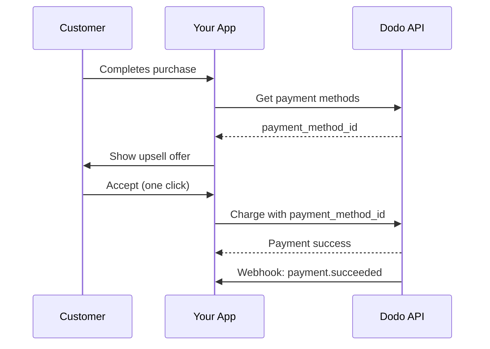
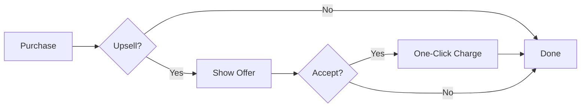
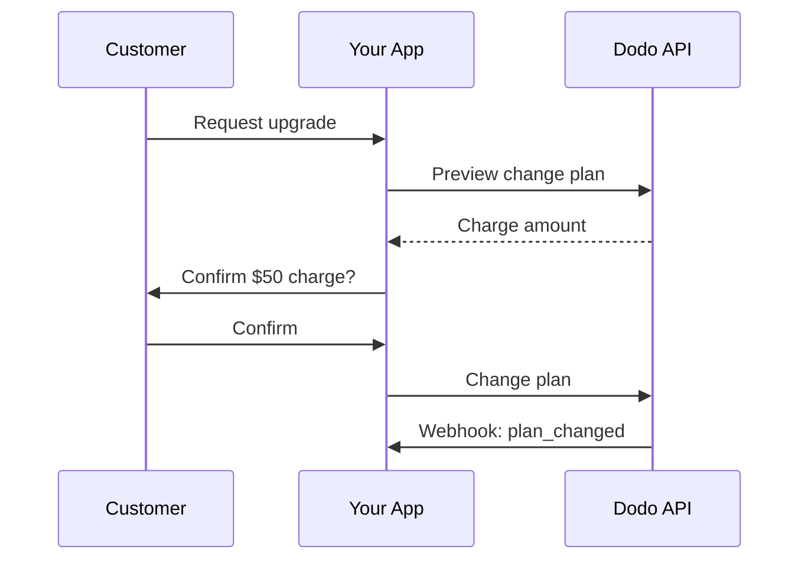
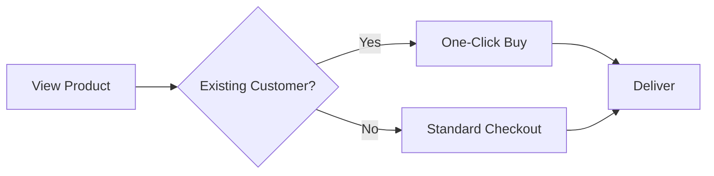

<Info>
Upsells und Downsells ermöglichen es Ihnen, Kunden zusätzliche Produkte oder Tarifänderungen über deren gespeicherte Zahlungsmethoden anzubieten. Dadurch sind Ein-Klick-Käufe möglich, bei denen die Zahlungserfassung übersprungen wird, was die Conversion-Raten erheblich verbessert.
</Info>

<CardGroup cols={3}>
<Card title="Post-Purchase Upsells" icon="cart-plus">
  Bieten Sie ergänzende Produkte direkt nach dem Checkout mit Ein-Klick-Käufen an.
</Card>

<Card title="Subscription Upgrades" icon="arrow-up">
  Führen Sie Kunden mit automatischer anteiliger Berechnung und sofortiger Abrechnung in höhere Stufen.
</Card>

<Card title="Cross-Sells" icon="grid-2-plus">
  Fügen Sie bestehenden Kunden verwandte Produkte hinzu, ohne Zahlungsdaten erneut abzufragen.
</Card>
</CardGroup>

## Übersicht

Upsells und Downsells sind leistungsstarke Strategien zur Umsatzoptimierung:

- **Upsells**: Bieten Sie ein höherwertiges Produkt oder Upgrade an (z.B. Pro-Plan anstelle von Basic)
- **Downsells**: Bieten Sie eine günstigere Alternative an, wenn ein Kunde ablehnt oder downgradiert
- **Cross-sells**: Schlagen Sie ergänzende Produkte vor (z.B. Add-ons, verwandte Artikel)

Dodo Payments ermöglicht diese Abläufe über den `payment_method_id`-Parameter, mit dem Sie die gespeicherte Zahlungsmethode eines Kunden belasten können, ohne dass dieser Kartendaten erneut eingeben muss.

### Wesentliche Vorteile

| Vorteil | Auswirkung |
|---------|-------------|
| **Ein-Klick-Käufe** | Überspringen Sie das Zahlungsformular vollständig für wiederkehrende Kunden |
| **Höhere Conversion** | Reduzieren Sie Reibungsverluste im Entscheidungsmoment |
| **Sofortige Verarbeitung** | Belastungen erfolgen sofort mit `confirm: true` |
| **Nahtloses UX** | Kunden bleiben während des gesamten Ablaufs in Ihrer App |

## Funktionsweise



## Voraussetzungen

Bevor Sie Upsells und Downsells implementieren, stellen Sie sicher, dass Sie:

<Steps>
<Step title="Customer with Saved Payment Method">
  Kunden müssen mindestens einen Kauf abgeschlossen haben. Zahlungsmethoden werden automatisch gespeichert, wenn Kunden den Checkout abschließen.
</Step>

<Step title="Products Configured">
  Erstellen Sie Ihre Upsell-Produkte im Dodo Payments-Dashboard. Diese können Einmalzahlungen, Abonnements oder Add-ons sein.
</Step>

<Step title="Webhook Endpoint">
  Richten Sie Webhooks ein, um `payment.succeeded`-, `payment.failed`- und `subscription.plan_changed`-Ereignisse zu verarbeiten.
</Step>
</Steps>

## Abrufen der Zahlungsmethoden von Kunden

Bevor Sie ein Upsell anbieten, rufen Sie die gespeicherten Zahlungsmethoden des Kunden ab:

<Tabs>
<Tab title="TypeScript">

```typescript
import DodoPayments from 'dodopayments';

const client = new DodoPayments({
  bearerToken: process.env.DODO_PAYMENTS_API_KEY,
  environment: 'live_mode',
});

async function getPaymentMethods(customerId: string) {
  const paymentMethods = await client.customers.retrievePaymentMethods(customerId);
  
  // Returns { items: [...] } — the list of saved payment methods.
  // Each item has: payment_method_id, payment_method, payment_method_type, last_used_at,
  // recurring_enabled, and card (last4_digits, card_network, card_type, expiry_month, expiry_year)
  return paymentMethods;
}

// Example usage
const methods = await getPaymentMethods('cus_123');
console.log('Available payment methods:', methods);

// Use the first available method for upsell
const primaryMethod = methods.items[0]?.payment_method_id;
```

</Tab>

<Tab title="Python">

```python
import os
from dodopayments import DodoPayments

client = DodoPayments(
    bearer_token=os.environ.get("DODO_PAYMENTS_API_KEY"),
    environment="live_mode",
)

def get_payment_methods(customer_id: str):
    payment_methods = client.customers.retrieve_payment_methods(customer_id)
    
    # Returns an object with an `items` list of saved payment methods.
    # Each item has: payment_method_id, payment_method, payment_method_type, last_used_at,
    # recurring_enabled, and card (last4_digits, card_network, card_type, expiry_month, expiry_year)
    return payment_methods

# Example usage
methods = get_payment_methods("cus_123")
print("Available payment methods:", methods)

# Use the first available method for upsell
primary_method = methods.items[0].payment_method_id if methods.items else None
```

</Tab>

<Tab title="Go">

```go
package main

import (
    "context"
    "fmt"
    "github.com/dodopayments/dodopayments-go"
    "github.com/dodopayments/dodopayments-go/option"
)

func getPaymentMethods(customerID string) ([]dodopayments.CustomerGetPaymentMethodsResponseItem, error) {
    client := dodopayments.NewClient(
        option.WithBearerToken(os.Getenv("DODO_PAYMENTS_API_KEY")),
    )
    
    resp, err := client.Customers.GetPaymentMethods(
        context.TODO(),
        customerID,
    )
    if err != nil {
        return nil, err
    }
    
    return resp.Items, nil
}

func main() {
    methods, err := getPaymentMethods("cus_123")
    if err != nil {
        panic(err)
    }
    
    fmt.Println("Available payment methods:", methods)
    
    // Use the first available method for upsell
    if len(methods) > 0 {
        primaryMethod := methods[0].PaymentMethodID
        fmt.Println("Primary method:", primaryMethod)
    }
}
```

</Tab>
</Tabs>

<Info>
Zahlungsmethoden werden automatisch gespeichert, wenn Kunden den Checkout abschließen. Sie müssen sie nicht explizit speichern.
</Info>

## Post-Purchase One-Click Upsells

Bieten Sie zusätzliche Produkte sofort nach einem erfolgreichen Kauf an. Der Kunde kann mit einem einzigen Klick akzeptieren, da seine Zahlungsmethode bereits gespeichert ist.



### Implementierung

<Tabs>
<Tab title="TypeScript">

```typescript
import DodoPayments from 'dodopayments';

const client = new DodoPayments({
  bearerToken: process.env.DODO_PAYMENTS_API_KEY,
  environment: 'live_mode',
});

async function createOneClickUpsell(
  customerId: string,
  paymentMethodId: string,
  upsellProductId: string
) {
  // Create checkout session with saved payment method
  // confirm: true processes the payment immediately
  const session = await client.checkoutSessions.create({
    product_cart: [
      {
        product_id: upsellProductId,
        quantity: 1
      }
    ],
    customer: {
      customer_id: customerId
    },
    payment_method_id: paymentMethodId,
    confirm: true,  // Required when using payment_method_id
    return_url: 'https://yourapp.com/upsell-success',
    feature_flags: {
      redirect_immediately: true  // Skip success page
    },
    metadata: {
      upsell_source: 'post_purchase',
      original_order_id: 'order_123'
    }
  });

  return session;
}

// Example: Offer premium add-on after initial purchase
async function handlePostPurchaseUpsell(customerId: string) {
  // Get customer's payment methods
  const methods = await client.customers.retrievePaymentMethods(customerId);
  
  if (methods.items.length === 0) {
    console.log('No saved payment methods available');
    return null;
  }

  // Create the upsell with one-click checkout
  const upsell = await createOneClickUpsell(
    customerId,
    methods.items[0].payment_method_id,
    'prod_premium_addon'
  );

  console.log('Upsell processed:', upsell.session_id);
  return upsell;
}
```

</Tab>

<Tab title="Python">

```python
import os
from dodopayments import DodoPayments

client = DodoPayments(
    bearer_token=os.environ.get("DODO_PAYMENTS_API_KEY"),
    environment="live_mode",
)

def create_one_click_upsell(
    customer_id: str,
    payment_method_id: str,
    upsell_product_id: str
):
    """Create a one-click upsell using saved payment method."""
    
    # Create checkout session with saved payment method
    # confirm=True processes the payment immediately
    session = client.checkout_sessions.create(
        product_cart=[
            {
                "product_id": upsell_product_id,
                "quantity": 1
            }
        ],
        customer={
            "customer_id": customer_id
        },
        payment_method_id=payment_method_id,
        confirm=True,  # Required when using payment_method_id
        return_url="https://yourapp.com/upsell-success",
        feature_flags={
            "redirect_immediately": True  # Skip success page
        },
        metadata={
            "upsell_source": "post_purchase",
            "original_order_id": "order_123"
        }
    )
    
    return session

def handle_post_purchase_upsell(customer_id: str):
    """Offer premium add-on after initial purchase."""
    
    # Get customer's payment methods
    methods = client.customers.retrieve_payment_methods(customer_id)
    
    if not methods.items:
        print("No saved payment methods available")
        return None
    
    # Create the upsell with one-click checkout
    upsell = create_one_click_upsell(
        customer_id=customer_id,
        payment_method_id=methods.items[0].payment_method_id,
        upsell_product_id="prod_premium_addon"
    )
    
    print(f"Upsell processed: {upsell.session_id}")
    return upsell
```

</Tab>

<Tab title="Go">

```go
package main

import (
    "context"
    "fmt"
    "os"
    
    "github.com/dodopayments/dodopayments-go"
    "github.com/dodopayments/dodopayments-go/option"
)

func createOneClickUpsell(
    customerID string,
    paymentMethodID string,
    upsellProductID string,
) (*dodopayments.CheckoutSessionResponse, error) {
    client := dodopayments.NewClient(
        option.WithBearerToken(os.Getenv("DODO_PAYMENTS_API_KEY")),
    )
    
    // Create checkout session with saved payment method
    // Confirm: true processes the payment immediately
    session, err := client.CheckoutSessions.New(context.TODO(), dodopayments.CheckoutSessionNewParams{
        CheckoutSessionRequest: dodopayments.CheckoutSessionRequestParam{
            ProductCart: dodopayments.F([]dodopayments.ProductItemReqParam{
                {
                    ProductID: dodopayments.F(upsellProductID),
                    Quantity:  dodopayments.F(int64(1)),
                },
            }),
            Customer: dodopayments.F[dodopayments.CustomerRequestUnionParam](
                dodopayments.AttachExistingCustomerParam{
                    CustomerID: dodopayments.F(customerID),
                },
            ),
            PaymentMethodID: dodopayments.F(paymentMethodID),
            Confirm:         dodopayments.F(true), // Required when using payment_method_id
            ReturnURL:       dodopayments.F("https://yourapp.com/upsell-success"),
            FeatureFlags: dodopayments.F(dodopayments.CheckoutSessionFlagsParam{
                RedirectImmediately: dodopayments.F(true), // Skip success page
            }),
            Metadata: dodopayments.F(map[string]string{
                "upsell_source":     "post_purchase",
                "original_order_id": "order_123",
            }),
        },
    })
    
    return session, err
}

func handlePostPurchaseUpsell(customerID string) (*dodopayments.CheckoutSessionResponse, error) {
    client := dodopayments.NewClient(
        option.WithBearerToken(os.Getenv("DODO_PAYMENTS_API_KEY")),
    )
    
    // Get customer's payment methods
    resp, err := client.Customers.GetPaymentMethods(context.TODO(), customerID)
    if err != nil {
        return nil, err
    }
    
    if len(resp.Items) == 0 {
        fmt.Println("No saved payment methods available")
        return nil, nil
    }
    
    // Create the upsell with one-click checkout
    upsell, err := createOneClickUpsell(
        customerID,
        resp.Items[0].PaymentMethodID,
        "prod_premium_addon",
    )
    if err != nil {
        return nil, err
    }
    
    fmt.Printf("Upsell processed: %s\n", upsell.SessionID)
    return upsell, nil
}
```

</Tab>
</Tabs>

<Warning>
Wenn Sie `payment_method_id` verwenden, müssen Sie `confirm: true` festlegen und eine vorhandene `customer_id` angeben. Die Zahlungsmethode muss diesem Kunden zugeordnet sein.
</Warning>

## Subscription Upgrades

Versetzen Sie Kunden automatisch in höherwertige Abonnementpläne mit automatischer Prorationsbehandlung.



### Vorschau vor der Bestätigung

Zeigen Sie immer die Planänderungen in der Vorschau an, um Kunden genau zu zeigen, was sie berechnet werden:

<Tabs>
<Tab title="TypeScript">

```typescript
async function previewUpgrade(
  subscriptionId: string,
  newProductId: string
) {
  const preview = await client.subscriptions.previewChangePlan(subscriptionId, {
    product_id: newProductId,
    quantity: 1,
    proration_billing_mode: 'difference_immediately'
  });

  return {
    immediateCharge: preview.immediate_charge?.summary,
    newPlan: preview.new_plan,
    effectiveAt: preview.immediate_charge?.effective_at
  };
}

// Show customer the charge before confirming
const preview = await previewUpgrade('sub_123', 'prod_pro_plan');
console.log(`Upgrade will charge: ${preview.immediateCharge}`);
```

</Tab>

<Tab title="Python">

```python
def preview_upgrade(subscription_id: str, new_product_id: str):
    preview = client.subscriptions.preview_change_plan(
        subscription_id=subscription_id,
        product_id=new_product_id,
        quantity=1,
        proration_billing_mode="difference_immediately"
    )
    
    return {
        "immediate_charge": preview.immediate_charge.summary if preview.immediate_charge else None,
        "new_plan": preview.new_plan,
        "effective_at": preview.immediate_charge.effective_at if preview.immediate_charge else None,
    }

# Show customer the charge before confirming
preview = preview_upgrade("sub_123", "prod_pro_plan")
print(f"Upgrade will charge: {preview['immediate_charge']}")
```

</Tab>

<Tab title="Go">

```go
func previewUpgrade(subscriptionID string, newProductID string) (map[string]interface{}, error) {
    client := dodopayments.NewClient(
        option.WithBearerToken(os.Getenv("DODO_PAYMENTS_API_KEY")),
    )
    
    preview, err := client.Subscriptions.PreviewChangePlan(
        context.TODO(),
        subscriptionID,
        dodopayments.SubscriptionPreviewChangePlanParams{
            UpdateSubscriptionPlanReq: dodopayments.UpdateSubscriptionPlanReqParam{
                ProductID:            dodopayments.F(newProductID),
                Quantity:             dodopayments.F(int64(1)),
                ProrationBillingMode: dodopayments.F(dodopayments.UpdateSubscriptionPlanReqProrationBillingModeDifferenceImmediately),
            },
        },
    )
    if err != nil {
        return nil, err
    }
    
    return map[string]interface{}{
        "immediate_charge": preview.ImmediateCharge.Summary,
        "new_plan":         preview.NewPlan,
        "effective_at":     preview.ImmediateCharge.EffectiveAt,
    }, nil
}
```

</Tab>
</Tabs>

### Durchführung des Upgrades

<Tabs>
<Tab title="TypeScript">

```typescript
async function upgradeSubscription(
  subscriptionId: string,
  newProductId: string,
  prorationMode: 'prorated_immediately' | 'difference_immediately' | 'full_immediately' | 'do_not_bill' = 'difference_immediately'
) {
  // change-plan returns 200 with an empty body — resolving without an error means it was accepted.
  await client.subscriptions.changePlan(subscriptionId, {
    product_id: newProductId,
    quantity: 1,
    proration_billing_mode: prorationMode
  });

  // Re-read the subscription to observe the applied state.
  return await client.subscriptions.retrieve(subscriptionId);
}

// Upgrade from Basic ($30) to Pro ($80)
// With difference_immediately: charges $50 instantly
const upgrade = await upgradeSubscription('sub_123', 'pdt_pro_plan');
console.log('Upgrade status:', upgrade.status);
```

</Tab>

<Tab title="Python">

```python
def upgrade_subscription(
    subscription_id: str,
    new_product_id: str,
    proration_mode: str = "difference_immediately"
):
    # change_plan returns 200 with an empty body — returning without an error means it was accepted.
    client.subscriptions.change_plan(
        subscription_id=subscription_id,
        product_id=new_product_id,
        quantity=1,
        proration_billing_mode=proration_mode
    )

    # Re-read the subscription to observe the applied state.
    return client.subscriptions.retrieve(subscription_id)

# Upgrade from Basic ($30) to Pro ($80)
# With difference_immediately: charges $50 instantly
upgrade = upgrade_subscription("sub_123", "pdt_pro_plan")
print(f"Upgrade status: {upgrade.status}")
```

</Tab>

<Tab title="Go">

```go
func upgradeSubscription(
    subscriptionID string,
    newProductID string,
    prorationMode dodopayments.UpdateSubscriptionPlanReqProrationBillingMode,
) error {
    client := dodopayments.NewClient(
        option.WithBearerToken(os.Getenv("DODO_PAYMENTS_API_KEY")),
    )
    
    // ChangePlan returns no response body; a nil error means the change succeeded.
    err := client.Subscriptions.ChangePlan(
        context.TODO(),
        subscriptionID,
        dodopayments.SubscriptionChangePlanParams{
            UpdateSubscriptionPlanReq: dodopayments.UpdateSubscriptionPlanReqParam{
                ProductID:            dodopayments.F(newProductID),
                Quantity:             dodopayments.F(int64(1)),
                ProrationBillingMode: dodopayments.F(prorationMode),
            },
        },
    )
    
    return err
}

// Upgrade from Basic ($30) to Pro ($80)
// With DifferenceImmediately: charges $50 instantly
err := upgradeSubscription(
    "sub_123",
    "prod_pro_plan",
    dodopayments.UpdateSubscriptionPlanReqProrationBillingModeDifferenceImmediately,
)
if err != nil {
    panic(err)
}
fmt.Println("Upgrade succeeded")
```

</Tab>
</Tabs>

### Prorationsmodi

Wählen Sie, wie Kunden bei einem Upgrade berechnet werden:

| Modus | Verhalten | Am besten geeignet für |
|------|----------|----------|
| `difference_immediately` | Berechnet die Preisdifferenz sofort ($30→$80 = $50) | Einfache Upgrades |
| `prorated_immediately` | Berechnet den Betrag auf Grundlage der verbleibenden Zeit im Abrechnungszeitraum | Faire zeitbasierte Abrechnung |
| `full_immediately` | Berechnet den vollständigen Preis des neuen Plans und ignoriert die verbleibende Zeit | Abrechnungszeitraum wird zurückgesetzt |
| `do_not_bill` | Wendet die Planänderung ohne sofortige Belastung an; der neue Plan wird bei der nächsten Verlängerung abgerechnet und das ursprüngliche Abrechnungsdatum bleibt erhalten | Upgrades aus Kulanz und kostenlose Migrationen |

<Tip>
Verwenden Sie `difference_immediately` für einfache Upgrade-Abläufe. Verwenden Sie `prorated_immediately`, wenn Sie ungenutzte Zeit des aktuellen Tarifs berücksichtigen möchten.
</Tip>

## Cross-Sells

Fügen Sie komplementäre Produkte für bestehende Kunden hinzu, ohne dass diese die Zahlungsdetails erneut eingeben müssen.



### Implementierung

<Tabs>
<Tab title="TypeScript">

```typescript
async function createCrossSell(
  customerId: string,
  paymentMethodId: string,
  productId: string,
  quantity: number = 1
) {
  // Create a one-time payment using saved payment method
  const payment = await client.payments.create({
    product_cart: [
      {
        product_id: productId,
        quantity: quantity
      }
    ],
    customer: { customer_id: customerId },
    billing: { country: 'US', city: 'San Francisco', state: 'CA', street: '1 Market St', zipcode: '94105' },
    payment_method_id: paymentMethodId,
    return_url: 'https://yourapp.com/purchase-complete',
    metadata: {
      purchase_type: 'cross_sell',
      source: 'product_recommendation'
    }
  });

  return payment;
}

// Example: Customer bought a course, offer related ebook
async function offerRelatedProduct(customerId: string, relatedProductId: string) {
  const methods = await client.customers.retrievePaymentMethods(customerId);
  
  if (methods.items.length === 0) {
    // Fall back to standard checkout
    return client.checkoutSessions.create({
      product_cart: [{ product_id: relatedProductId, quantity: 1 }],
      customer: { customer_id: customerId },
      return_url: 'https://yourapp.com/purchase-complete'
    });
  }

  // One-click purchase
  return createCrossSell(customerId, methods.items[0].payment_method_id, relatedProductId);
}
```

</Tab>

<Tab title="Python">

```python
def create_cross_sell(
    customer_id: str,
    payment_method_id: str,
    product_id: str,
    quantity: int = 1
):
    """Create a one-time payment using saved payment method."""
    
    payment = client.payments.create(
        product_cart=[
            {
                "product_id": product_id,
                "quantity": quantity
            }
        ],
        customer={"customer_id": customer_id},
        billing={"country": "US", "city": "San Francisco", "state": "CA", "street": "1 Market St", "zipcode": "94105"},
        payment_method_id=payment_method_id,
        return_url="https://yourapp.com/purchase-complete",
        metadata={
            "purchase_type": "cross_sell",
            "source": "product_recommendation"
        }
    )
    
    return payment

def offer_related_product(customer_id: str, related_product_id: str):
    """Offer related product with one-click purchase if possible."""
    
    methods = client.customers.retrieve_payment_methods(customer_id)
    
    if not methods.items:
        # Fall back to standard checkout
        return client.checkout_sessions.create(
            product_cart=[{"product_id": related_product_id, "quantity": 1}],
            customer={"customer_id": customer_id},
            return_url="https://yourapp.com/purchase-complete"
        )
    
    # One-click purchase
    return create_cross_sell(customer_id, methods.items[0].payment_method_id, related_product_id)
```

</Tab>

<Tab title="Go">

```go
func createCrossSell(
    customerID string,
    paymentMethodID string,
    productID string,
    quantity int64,
) (*dodopayments.PaymentNewResponse, error) {
    client := dodopayments.NewClient(
        option.WithBearerToken(os.Getenv("DODO_PAYMENTS_API_KEY")),
    )
    
    payment, err := client.Payments.New(context.TODO(), dodopayments.PaymentNewParams{
        ProductCart: dodopayments.F([]dodopayments.OneTimeProductCartItemParam{
            {
                ProductID: dodopayments.F(productID),
                Quantity:  dodopayments.F(quantity),
            },
        }),
        Customer: dodopayments.F[dodopayments.CustomerRequestUnionParam](
            dodopayments.AttachExistingCustomerParam{CustomerID: dodopayments.F(customerID)},
        ),
        Billing: dodopayments.F(dodopayments.BillingAddressParam{
            Country: dodopayments.F(dodopayments.CountryCodeUs),
            City:    dodopayments.F("San Francisco"),
            State:   dodopayments.F("CA"),
            Street:  dodopayments.F("1 Market St"),
            Zipcode: dodopayments.F("94105"),
        }),
        PaymentMethodID: dodopayments.F(paymentMethodID),
        ReturnURL:       dodopayments.F("https://yourapp.com/purchase-complete"),
        Metadata: dodopayments.F(map[string]string{
            "purchase_type": "cross_sell",
            "source":        "product_recommendation",
        }),
    })
    
    return payment, err
}

func offerRelatedProduct(customerID string, relatedProductID string) (interface{}, error) {
    client := dodopayments.NewClient(
        option.WithBearerToken(os.Getenv("DODO_PAYMENTS_API_KEY")),
    )
    
    resp, err := client.Customers.GetPaymentMethods(context.TODO(), customerID)
    if err != nil {
        return nil, err
    }
    
    if len(resp.Items) == 0 {
        // Fall back to standard checkout
        return client.CheckoutSessions.New(context.TODO(), dodopayments.CheckoutSessionNewParams{
            CheckoutSessionRequest: dodopayments.CheckoutSessionRequestParam{
                ProductCart: dodopayments.F([]dodopayments.ProductItemReqParam{
                    {ProductID: dodopayments.F(relatedProductID), Quantity: dodopayments.F(int64(1))},
                }),
                Customer: dodopayments.F[dodopayments.CustomerRequestUnionParam](
                    dodopayments.AttachExistingCustomerParam{CustomerID: dodopayments.F(customerID)},
                ),
                ReturnURL: dodopayments.F("https://yourapp.com/purchase-complete"),
            },
        })
    }
    
    // One-click purchase
    return createCrossSell(customerID, resp.Items[0].PaymentMethodID, relatedProductID, 1)
}
```

</Tab>
</Tabs>

## Subscription Downgrades

Wenn Kunden zu einem niedrigeren Plan wechseln möchten, gestalten Sie den Übergang reibungslos mit automatischen Gutschriften.

### So funktionieren Downgrades

1. Kunde beantragt Downgrade (Pro → Basic)
2. System berechnet den verbleibenden Wert des aktuellen Plans
3. Gutschrift wird dem Abonnement für zukünftige Erneuerungen hinzugefügt
4. Kunde wechselt sofort zu einem neuen Plan

<Tabs>
<Tab title="TypeScript">

```typescript
async function downgradeSubscription(
  subscriptionId: string,
  newProductId: string
) {
  // Preview the downgrade first
  const preview = await client.subscriptions.previewChangePlan(subscriptionId, {
    product_id: newProductId,
    quantity: 1,
    proration_billing_mode: 'difference_immediately'
  });

  console.log('Credit to be applied:', preview.immediate_charge.summary.customer_credits);

  // Execute the downgrade. change-plan returns 200 with an empty body.
  await client.subscriptions.changePlan(subscriptionId, {
    product_id: newProductId,
    quantity: 1,
    proration_billing_mode: 'difference_immediately'
  });

  // Credits are automatically applied to future renewals
  return await client.subscriptions.retrieve(subscriptionId);
}

// Downgrade from Pro ($80) to Basic ($30)
// $50 credit added to subscription, auto-applied on next renewal
const downgrade = await downgradeSubscription('sub_123', 'pdt_basic_plan');
```

</Tab>

<Tab title="Python">

```python
def downgrade_subscription(subscription_id: str, new_product_id: str):
    # Preview the downgrade first
    preview = client.subscriptions.preview_change_plan(
        subscription_id=subscription_id,
        product_id=new_product_id,
        quantity=1,
        proration_billing_mode="difference_immediately"
    )
    
    print(f"Credit to be applied: {preview.immediate_charge.summary.customer_credits}")
    
    # Execute the downgrade. change_plan returns 200 with an empty body.
    client.subscriptions.change_plan(
        subscription_id=subscription_id,
        product_id=new_product_id,
        quantity=1,
        proration_billing_mode="difference_immediately"
    )

    # Credits are automatically applied to future renewals
    return client.subscriptions.retrieve(subscription_id)

# Downgrade from Pro ($80) to Basic ($30)
# $50 credit added to subscription, auto-applied on next renewal
downgrade = downgrade_subscription("sub_123", "pdt_basic_plan")
```

</Tab>

<Tab title="Go">

```go
func downgradeSubscription(subscriptionID string, newProductID string) error {
    client := dodopayments.NewClient(
        option.WithBearerToken(os.Getenv("DODO_PAYMENTS_API_KEY")),
    )
    
    // Preview the downgrade first
    preview, err := client.Subscriptions.PreviewChangePlan(
        context.TODO(),
        subscriptionID,
        dodopayments.SubscriptionPreviewChangePlanParams{
            UpdateSubscriptionPlanReq: dodopayments.UpdateSubscriptionPlanReqParam{
                ProductID:            dodopayments.F(newProductID),
                Quantity:             dodopayments.F(int64(1)),
                ProrationBillingMode: dodopayments.F(dodopayments.UpdateSubscriptionPlanReqProrationBillingModeDifferenceImmediately),
            },
        },
    )
    if err != nil {
        return err
    }
    
    fmt.Printf("Customer credits to be applied: %v\n", preview.ImmediateCharge.Summary.CustomerCredits)
    
    // Execute the downgrade (returns no response body; nil error means success)
    return client.Subscriptions.ChangePlan(
        context.TODO(),
        subscriptionID,
        dodopayments.SubscriptionChangePlanParams{
            UpdateSubscriptionPlanReq: dodopayments.UpdateSubscriptionPlanReqParam{
                ProductID:            dodopayments.F(newProductID),
                Quantity:             dodopayments.F(int64(1)),
                ProrationBillingMode: dodopayments.F(dodopayments.UpdateSubscriptionPlanReqProrationBillingModeDifferenceImmediately),
            },
        },
    )
}
```

</Tab>
</Tabs>

<Info>
Guthaben aus Downgrades mit `difference_immediately` sind abonnementbezogen und werden automatisch auf zukünftige Verlängerungen angewendet. Sie unterscheiden sich von [Credit-Based Billing](/features/credit-based-billing)-Berechtigungen.
</Info>

## Komplettes Beispiel: Post-Purchase Upsell-Flow

Hier ist eine vollständige Implementierung, die zeigt, wie man ein Upsell nach einem erfolgreichen Kauf anbietet:

<Tabs>
<Tab title="TypeScript">

```typescript
import DodoPayments from 'dodopayments';
import express from 'express';

const client = new DodoPayments({
  bearerToken: process.env.DODO_PAYMENTS_API_KEY,
  environment: 'live_mode',
});

const app = express();

// Store for tracking upsell eligibility (use your database in production)
const eligibleUpsells = new Map<string, { customerId: string; productId: string }>();

// Webhook handler for initial purchase success
app.post('/webhooks/dodo', express.raw({ type: 'application/json' }), async (req, res) => {
  const event = JSON.parse(req.body.toString());
  
  switch (event.type) {
    case 'payment.succeeded':
      // Check if customer is eligible for upsell
      const customerId = event.data.customer_id;
      const productId = event.data.product_id;
      
      // Define upsell rules (e.g., bought Basic, offer Pro)
      const upsellProduct = getUpsellProduct(productId);
      
      if (upsellProduct) {
        eligibleUpsells.set(customerId, {
          customerId,
          productId: upsellProduct
        });
      }
      break;
      
    case 'payment.failed':
      console.log('Payment failed:', event.data.payment_id);
      // Handle failed upsell payment
      break;
  }
  
  res.json({ received: true });
});

// API endpoint to check upsell eligibility
app.get('/api/upsell/:customerId', async (req, res) => {
  const { customerId } = req.params;
  const upsell = eligibleUpsells.get(customerId);
  
  if (!upsell) {
    return res.json({ eligible: false });
  }
  
  // Get payment methods
  const methods = await client.customers.retrievePaymentMethods(customerId);
  
  if (methods.items.length === 0) {
    return res.json({ eligible: false, reason: 'no_payment_method' });
  }
  
  // Get product details for display
  const product = await client.products.retrieve(upsell.productId);
  
  res.json({
    eligible: true,
    product: {
      id: product.product_id,
      name: product.name,
      price: product.price,
      currency: product.price.currency
    },
    paymentMethodId: methods.items[0].payment_method_id
  });
});

// API endpoint to accept upsell
app.post('/api/upsell/:customerId/accept', async (req, res) => {
  const { customerId } = req.params;
  const upsell = eligibleUpsells.get(customerId);
  
  if (!upsell) {
    return res.status(400).json({ error: 'No upsell available' });
  }
  
  try {
    const methods = await client.customers.retrievePaymentMethods(customerId);
    
    // Create one-click purchase
    const session = await client.checkoutSessions.create({
      product_cart: [{ product_id: upsell.productId, quantity: 1 }],
      customer: { customer_id: customerId },
      payment_method_id: methods.items[0].payment_method_id,
      confirm: true,
      return_url: `${process.env.APP_URL}/upsell-success`,
      feature_flags: { redirect_immediately: true },
      metadata: { upsell: 'true', source: 'post_purchase' }
    });
    
    // Clear the upsell offer
    eligibleUpsells.delete(customerId);
    
    res.json({ success: true, sessionId: session.session_id });
  } catch (error) {
    console.error('Upsell failed:', error);
    res.status(500).json({ error: 'Upsell processing failed' });
  }
});

// Helper function to determine upsell product
function getUpsellProduct(purchasedProductId: string): string | null {
  const upsellMap: Record<string, string> = {
    'prod_basic_plan': 'prod_pro_plan',
    'prod_starter_course': 'prod_complete_bundle',
    'prod_single_license': 'prod_team_license'
  };
  
  return upsellMap[purchasedProductId] || null;
}

app.listen(3000);
```

</Tab>

<Tab title="Python">

```python
import os
from flask import Flask, request, jsonify
from dodopayments import DodoPayments

client = DodoPayments(
    bearer_token=os.environ.get("DODO_PAYMENTS_API_KEY"),
    environment="live_mode",
)

app = Flask(__name__)

# Store for tracking upsell eligibility (use your database in production)
eligible_upsells = {}

@app.route('/webhooks/dodo', methods=['POST'])
def webhook_handler():
    event = request.json
    
    if event['type'] == 'payment.succeeded':
        # Check if customer is eligible for upsell
        customer_id = event['data']['customer_id']
        product_id = event['data']['product_id']
        
        # Define upsell rules
        upsell_product = get_upsell_product(product_id)
        
        if upsell_product:
            eligible_upsells[customer_id] = {
                'customer_id': customer_id,
                'product_id': upsell_product
            }
    
    elif event['type'] == 'payment.failed':
        print(f"Payment failed: {event['data']['payment_id']}")
    
    return jsonify({'received': True})

@app.route('/api/upsell/<customer_id>', methods=['GET'])
def check_upsell(customer_id):
    upsell = eligible_upsells.get(customer_id)
    
    if not upsell:
        return jsonify({'eligible': False})
    
    # Get payment methods
    methods = client.customers.retrieve_payment_methods(customer_id)
    
    if not methods.items:
        return jsonify({'eligible': False, 'reason': 'no_payment_method'})
    
    # Get product details for display
    product = client.products.retrieve(upsell['product_id'])
    
    return jsonify({
        'eligible': True,
        'product': {
            'id': product.product_id,
            'name': product.name,
            'price': product.price,
            'currency': product.price.currency
        },
        'payment_method_id': methods.items[0].payment_method_id
    })

@app.route('/api/upsell/<customer_id>/accept', methods=['POST'])
def accept_upsell(customer_id):
    upsell = eligible_upsells.get(customer_id)
    
    if not upsell:
        return jsonify({'error': 'No upsell available'}), 400
    
    try:
        methods = client.customers.retrieve_payment_methods(customer_id)
        
        # Create one-click purchase
        session = client.checkout_sessions.create(
            product_cart=[{'product_id': upsell['product_id'], 'quantity': 1}],
            customer={'customer_id': customer_id},
            payment_method_id=methods.items[0].payment_method_id,
            confirm=True,
            return_url=f"{os.environ['APP_URL']}/upsell-success",
            feature_flags={'redirect_immediately': True},
            metadata={'upsell': 'true', 'source': 'post_purchase'}
        )
        
        # Clear the upsell offer
        del eligible_upsells[customer_id]
        
        return jsonify({'success': True, 'session_id': session.session_id})
    
    except Exception as error:
        print(f"Upsell failed: {error}")
        return jsonify({'error': 'Upsell processing failed'}), 500

def get_upsell_product(purchased_product_id: str) -> str:
    """Determine upsell product based on purchased product."""
    upsell_map = {
        'prod_basic_plan': 'prod_pro_plan',
        'prod_starter_course': 'prod_complete_bundle',
        'prod_single_license': 'prod_team_license'
    }
    return upsell_map.get(purchased_product_id)

if __name__ == '__main__':
    app.run(port=3000)
```

</Tab>
</Tabs>

## Best Practices

<AccordionGroup>
<Accordion title="Time Your Upsells Strategically">
Der beste Zeitpunkt, um einen Upsell anzubieten, ist unmittelbar nach einem erfolgreichen Kauf, wenn Kunden in Kauflaune sind. Weitere effektive Momente:
- Nach dem Erreichen von Feature-Nutzungsschwellenwerten
- Wenn Planlimits näher rücken
- Beim Abschluss des Onboardings
</Accordion>

<Accordion title="Validate Payment Method Eligibility">
Bevor Sie versuchen, eine Ein-Klick-Belastung durchzuführen, prüfen Sie die Zahlungsmethode:
- Ist mit der Währung des Produkts kompatibel
- Ist nicht abgelaufen
- Gehört zum Kunden

Die API validiert dies zwar, aber eine proaktive Prüfung verbessert die UX.
</Accordion>

<Accordion title="Handle Failures Gracefully">
Wenn Ein-Klick-Belastungen fehlschlagen:
1. Führen Sie den Standard-Checkout durch
2. Informieren Sie den Kunden mit klarer Kommunikation
3. Bieten Sie an, die Zahlungsmethode zu aktualisieren
4. Versuchen Sie nicht wiederholt fehlgeschlagene Belastungen
</Accordion>

<Accordion title="Provide Clear Value Proposition">
Upsells konvertieren besser, wenn Kunden den Mehrwert verstehen:
- Zeigen Sie, was sie im Vergleich zum aktuellen Plan erhalten
- Heben Sie die Preisdifferenz hervor, nicht den Gesamtpreis
- Verwenden Sie Social Proof (z. B. „Beliebtestes Upgrade“)
</Accordion>

<Accordion title="Respect Customer Choice">
- Bieten Sie immer eine einfache Möglichkeit zum Ablehnen
- Zeigen Sie denselben Upsell nach einem Ablehnen nicht wiederholt an
- Verfolgen und analysieren Sie, welche Upsells konvertieren, um Angebote zu optimieren
</Accordion>
</AccordionGroup>

## Webhooks zur Überwachung

Verfolgen Sie diese Webhook-Ereignisse für Upsell- und Downgrade-Flows:

| Ereignis | Auslöser | Aktion |
|---------|----------|--------|
| `payment.succeeded` | Upsell/Cross-Sell-Zahlung abgeschlossen | Produkt bereitstellen, Zugriff aktualisieren |
| `payment.failed` | Ein-Klick-Belastung fehlgeschlagen | Fehler anzeigen, erneuten Versuch oder Fallback anbieten |
| `subscription.plan_changed` | Upgrade/Downgrade abgeschlossen | Funktionen aktualisieren, Bestätigung senden |
| `subscription.active` | Abonnement nach Tarifänderung reaktiviert | Zugriff auf neue Stufe gewähren |

<Card title="Webhook Integration Guide" icon="webhook" href="/developer-resources/webhooks">
  Erfahren Sie, wie Sie Webhook-Endpunkte einrichten und verifizieren.
</Card>

## Verwandte Ressourcen

<CardGroup cols={2}>
<Card title="Subscription Upgrade Guide" icon="arrows-rotate" href="/developer-resources/subscription-upgrade-downgrade">
  Ausführliche Anleitung zu Tarifänderungen, Prorationsmodi und Fehlerbehandlung.
</Card>

<Card title="Checkout Sessions" icon="cart-shopping" href="/developer-resources/checkout-session">
  Vollständige Referenz für die Erstellung von Checkout-Sessions mit allen Optionen.
</Card>

<Card title="Customer Payment Methods API" icon="credit-card" href="/api-reference/customers/get-customer-payment-methods">
  API-Referenz zum Auflisten von Kunden-Zahlungsmethoden.
</Card>

<Card title="Add-ons" icon="puzzle-piece" href="/features/addons">
  Erweitern Sie Abonnements mit flexiblen Add-ons für zusätzlichen Umsatz.
</Card>
</CardGroup>
