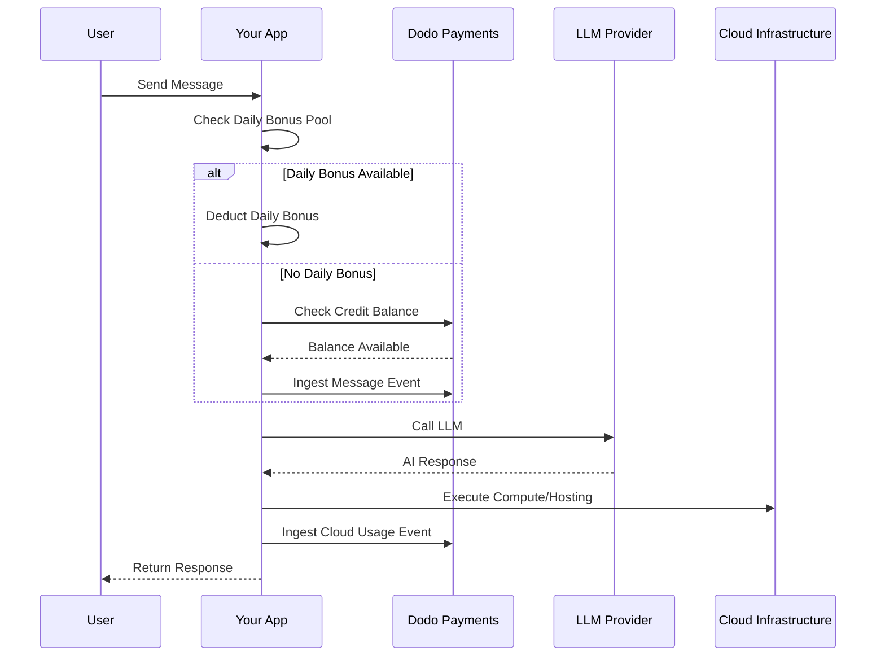

Lovable (lovable.dev) is an AI web app builder that uses a credit-based subscription model. Unlike token-based systems, Lovable simplifies the user experience by charging one credit per message. This model combines a monthly credit pool with a daily bonus drip to encourage consistent engagement while allowing for burst usage.

## Lovable's Billing Model

Lovable's pricing is built around message credits and separate metered billing for cloud infrastructure.

| Plan | Price | Monthly Credits | Daily Bonus | Key Features |
| :--- | :--- | :--- | :--- | :--- |
| Free | \$0/month | 0 | 5/day (up to 30/month) | Public projects only |
| Pro | \$25/month | 100 | 5/day (up to 150/month total) | On-demand top-ups, usage-based Cloud + AI, custom domains |
| Business | \$50/month | 100 | 5/day | SSO, team workspace, design templates, security center |
| Enterprise | Custom | Custom | Custom | SCIM, dedicated support, audit logs |

- **Credit-based subscription**: 1 credit = 1 message/prompt to the AI.
- **Credits are shared across unlimited users**: Team-wide pool, not per-seat.
- **Credits reset each billing cycle**: Monthly credits refresh on renewal.
- **On-demand credit top-ups**: Users can buy more credits if they run out.
- **Separate usage-based Cloud + AI billing**: Metered billing for hosting and compute.
- **Daily bonus credits reset each day**: A use-it-or-lose-it daily drip of 5 credits.

## What Makes It Unique

- **Message-based simplicity**: 1 credit = 1 message regardless of complexity. No token counting or model weighting.
- **Daily drip + monthly pool hybrid**: The 5 daily bonus credits create a daily engagement incentive, while the 100 monthly credits allow burst usage.
- **Team-wide shared pool**: Credits shared across unlimited users for a flat team price, not per-seat.
- **Two-layer billing**: Credits for AI interactions + separate metered billing for cloud infrastructure.

## Build This with Dodo Payments

You can replicate Lovable's hybrid model using Dodo Payments' credit entitlements and usage-based meters.

<Steps>
  <Step title="Create a Custom Unit Credit Entitlement">
    Define the message credit system in your Dodo Payments dashboard. This entitlement handles the monthly credit pool.

    - **Credit Type**: Custom Unit
    - **Unit Name**: "Messages"
    - **Precision**: 0
    - **Credit Expiry**: 30 days
    - **Overage**: Disabled (hard cap when credits hit 0)
  </Step>

  <Step title="Create Subscription Products">
    Create your plans and attach the credit entitlement. For the Free plan, you'll handle the daily bonus via application logic.

    - **Free**: \$0/mo, 0 credits (daily bonus handled by app logic)
    - **Pro**: \$25/mo, 100 credits/cycle, attach credit entitlement
    - **Business**: \$50/mo, 100 credits/cycle, attach credit entitlement

    ```typescript
    import DodoPayments from 'dodopayments';

    const client = new DodoPayments({
      bearerToken: process.env.DODO_PAYMENTS_API_KEY,
    });

    const session = await client.checkoutSessions.create({
      product_cart: [
        { product_id: 'prod_lovable_pro', quantity: 1 }
      ],
      customer: { email: 'user@example.com' },
      return_url: 'https://lovable.dev/dashboard'
    });
    ```
  </Step>

  <Step title="Create a Usage Meter for Cloud + AI">
    Lovable bills separately for cloud infrastructure. Create a meter to track these costs.

    - **Meter name**: `cloud.compute_seconds`
    - **Aggregation**: Sum on `compute_seconds` property

    Attach this meter to your subscription products with per-unit pricing. When you ingest usage, Dodo calculates the cost based on your rates.

    ```typescript
    await client.usageEvents.ingest({
      events: [{
        event_id: `compute_${Date.now()}`,
        customer_id: 'cust_123',
        event_name: 'cloud.compute_seconds',
        timestamp: new Date().toISOString(),
        metadata: {
          compute_seconds: 3600,
          project_id: 'proj_abc'
        }
      }]
    });
    ```
  </Step>

  <Step title="Implement Daily Bonus Credits (Application Logic)">
    The daily bonus drip is handled at the application level. You can use a cron job to grant these credits or track them separately in your database.

    To track the usage of these bonus credits in Dodo without depleting the main entitlement balance immediately, you can use a separate event name or handle the logic in your app to check the bonus pool first.

    ```typescript
    // Example cron job logic (pseudo-code)
    // Every day at midnight UTC:
    // 1. Reset 'daily_bonus_used' to 0 for all users in your DB
    
    // When a user sends a message:
    async function handleMessage(userId: string) {
      const user = await db.users.findUnique({ where: { id: userId } });
      
      if (user.daily_bonus_used < 5) {
        // Use daily bonus
        await db.users.update({
          where: { id: userId },
          data: { daily_bonus_used: { increment: 1 } }
        });
        // Track for analytics but don't deduct from Dodo credits yet
        await client.usageEvents.ingest({
          events: [{
            event_id: `msg_bonus_${Date.now()}`,
            customer_id: userId,
            event_name: 'ai.message.bonus',
            timestamp: new Date().toISOString(),
            metadata: { type: 'daily_bonus' }
          }]
        });
      } else {
        // Deduct from Dodo credit entitlement
        await client.usageEvents.ingest({
          events: [{
            event_id: `msg_${Date.now()}`,
            customer_id: userId,
            event_name: 'ai.message',
            timestamp: new Date().toISOString(),
            metadata: { type: 'subscription_credit' }
          }]
        });
      }
    }
    ```
  </Step>

  <Step title="Send Usage Events for Messages">
    Track each AI message as a usage event. Link the `ai.message` event to your "Messages" credit entitlement in the Dodo dashboard.

    ```typescript
    await client.usageEvents.ingest({
      events: [{
        event_id: `msg_${Date.now()}`,
        customer_id: 'cust_123',
        event_name: 'ai.message',
        timestamp: new Date().toISOString(),
        metadata: {
          content_length: 450,
          project_id: 'proj_abc',
          feature_type: 'editor'
        }
      }]
    });
    ```
  </Step>

  <Step title="Handle Webhooks for Low Balance">
    Notify users when they are running low on credits so they can top up or upgrade.

    ```typescript
    import DodoPayments from 'dodopayments';
    import express from 'express';

    const app = express();
    app.use(express.raw({ type: 'application/json' }));

    const client = new DodoPayments({
      bearerToken: process.env.DODO_PAYMENTS_API_KEY,
      webhookKey: process.env.DODO_PAYMENTS_WEBHOOK_KEY,
    });

    app.post('/webhooks/dodo', async (req, res) => {
      try {
        const event = client.webhooks.unwrap(req.body.toString(), {
          headers: {
            'webhook-id': req.headers['webhook-id'] as string,
            'webhook-signature': req.headers['webhook-signature'] as string,
            'webhook-timestamp': req.headers['webhook-timestamp'] as string,
          },
        });

        if (event.type === 'credit.balance_low') {
          const { customer_id, available_balance } = event.data;
          await notifyUser(customer_id, `Your balance is low: ${available_balance} messages left.`);
        }

        res.json({ received: true });
      } catch (error) {
        res.status(401).json({ error: 'Invalid signature' });
      }
    });
    ```
  </Step>
</Steps>

## Accelerate with the LLM Ingestion Blueprint

The [LLM Ingestion Blueprint](/developer-resources/ingestion-blueprints/llm) simplifies tracking by wrapping your AI client.

```typescript
import { createLLMTracker } from '@dodopayments/ingestion-blueprints';
import OpenAI from 'openai';

const tracker = createLLMTracker({
  apiKey: process.env.DODO_PAYMENTS_API_KEY,
  environment: 'live_mode',
  eventName: 'ai.message',
});

const trackedClient = tracker.wrap({
  client: new OpenAI(),
  customerId: 'cust_123',
});

// Automatically tracks the message and deducts 1 credit (if configured)
await trackedClient.chat.completions.create({
  model: 'gpt-4o',
  messages: [{ role: 'user', content: 'Build a landing page' }],
});
```

<Tip>
  Check out the [full blueprint documentation](/developer-resources/ingestion-blueprints/llm) for more details on automatic tracking.
</Tip>

## Architecture Overview



## Key Dodo Features Used

Explore the features that make this implementation possible.

<CardGroup cols={2}>
  <Card title="Credit-Based Billing" icon="coins" href="/features/credit-based-billing">
    Manage message credits and shared team pools.
  </Card>
  <Card title="Subscriptions" icon="calendar" href="/features/subscription">
    Set up recurring plans for Pro and Business tiers.
  </Card>
  <Card title="Usage-Based Billing" icon="chart-line" href="/features/usage-based-billing/introduction">
    Meter cloud infrastructure usage separately from AI credits.
  </Card>
  <Card title="Event Ingestion" icon="bolt" href="/features/usage-based-billing/event-ingestion">
    Send high-volume message and compute events to Dodo.
  </Card>
  <Card title="Webhooks" icon="webhook" href="/developer-resources/webhooks/intents/credit">
    Automate notifications for low credit balances.
  </Card>
  <Card title="LLM Ingestion Blueprint" icon="brain-circuit" href="/developer-resources/ingestion-blueprints/llm">
    Simplify AI usage tracking with pre-built integrations.
  </Card>
</CardGroup>
