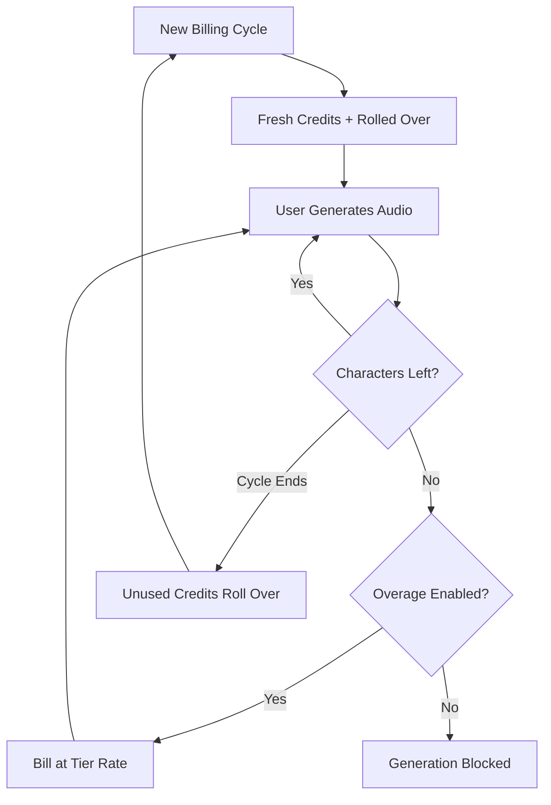

ElevenLabs ha construido una posición dominante en el ámbito de la voz con IA al hacer que su facturación sea tan fluida como su síntesis de voz. Su modelo se centra en una única unidad de valor: el carácter. Ya sea que generes texto a voz, clones una voz o dobles un video, consumes de un fondo unificado de créditos de caracteres.

## Cómo factura ElevenLabs

La estructura de precios de ElevenLabs utiliza cuotas mensuales fijas vinculadas a niveles de suscripción. A medida que los usuarios pasan a niveles superiores, obtienen más caracteres y acceso a funciones más avanzadas, como la clonación profesional de voz o los derechos comerciales.

| Plan | Precio | Caracteres/mes | Tarifa por exceso |
| :--- | :--- | :--- | :--- |
| Gratis | \$0 | 10,000 | No disponible |
| Starter | \$5/mes | 30,000 | ~\$0.30/1K caracteres |
| Creator | \$22/mes | 100,000 | ~\$0.24/1K caracteres |
| Pro | \$99/mes | 500,000 | ~\$0.15/1K caracteres |
| Scale | \$330/mes | 2,000,000 | ~\$0.10/1K caracteres |

1. **Precios basados en caracteres**: Los caracteres son la moneda universal de la plataforma. Text-to-Speech, Dubbing y Voice Cloning consumen del mismo saldo, lo que simplifica el seguimiento del uso.
2. **Mecánica de acumulación**: Los caracteres no utilizados se acumulan para el siguiente ciclo de facturación en lugar de caducar. ElevenLabs aplica un límite para evitar la acumulación infinita y garantizar que los usuarios conserven el valor de su suscripción.
3. **Excesos escalonados**: Los excesos se gestionan según el nivel de suscripción. En los planes inferiores, los excesos están desactivados de forma predeterminada por seguridad, mientras que los niveles superiores permiten cargos opcionales para mantener la continuidad del servicio.

## Qué lo hace único

Varias decisiones estratégicas hacen que el modelo de facturación de ElevenLabs sea especialmente eficaz para retener usuarios y fomentar las actualizaciones.

- **Acumulación de caracteres**: Los créditos acumulables reducen la preocupación de «úsalo o piérdelo» al transferir la inversión no utilizada. Esto mantiene el valor de la suscripción incluso durante periodos de menor actividad.
- **Precios escalonados por exceso**: Las tarifas por exceso disminuyen a medida que aumentan los tamaños de los planes, lo que crea un fuerte incentivo para actualizarse. Los usuarios suelen considerar más atractivos los niveles superiores debido al menor costo del uso adicional.
- **Consumo unificado**: Un único fondo de caracteres para todos los servicios elimina la carga cognitiva de gestionar cuotas separadas. Los usuarios solo necesitan controlar una cifra para entender su capacidad restante.
- **Excesos opcionales**: Los usuarios profesionales pueden habilitar los excesos para mantener la continuidad, mientras que los usuarios ocasionales se benefician de la seguridad de un límite estricto.



## Crea esto con Dodo Payments

Puedes replicar este sofisticado modelo usando la facturación basada en créditos y la medición del uso de Dodo Payments.

<Steps>
<Step title="Create a Custom Unit Credit Entitlement">
Primero, define la unidad «Characters» que servirá como moneda de tu plataforma.

1. Ve a **Entitlements** en el dashboard de Dodo.
2. Crea un nuevo **Credit Entitlement**.
3. Establece **Credit Type** como **Custom Unit**.
4. Asigna a la unidad el nombre «Characters».
5. Establece **Precision** en 0, ya que los caracteres siempre son unidades enteras.
6. Establece **Credit Expiry** en 30 días para coincidir con el ciclo de facturación mensual.
7. Habilita **Rollover** con esta configuración:
    - **Max Rollover Percentage**: 100 % (permite transferir todos los caracteres no utilizados).
    - **Rollover Timeframe**: 1 Month.
    - **Max Rollover Count**: 1 (los créditos pueden transferirse una vez y luego caducan).
</Step>

<Step title="Create Tiered Subscription Products">
Crea cinco productos de suscripción. Adjuntarás la misma autorización «Characters» a cada uno, pero con configuraciones diferentes para cada nivel.

| Producto | Precio | Créditos/ciclo | Exceso habilitado | Precio por exceso (por 1K caracteres) |
| :--- | :--- | :--- | :--- | :--- |
| Gratis | \$0/mes | 10,000 | No | - |
| Starter | \$5/mes | 30,000 | Sí (opcional) | \$0.30 |
| Creator | \$22/mes | 100,000 | Sí | \$0.24 |
| Pro | \$99/mes | 500,000 | Sí | \$0.15 |
| Scale | \$330/mes | 2,000,000 | Sí | \$0.10 |

Al adjuntar la autorización de crédito a cada producto, desmarca **Import Default Credit Settings**. Esto te permite establecer el **Price Per Unit** específico para los excesos de ese nivel. Establece **Overage Behavior** como **Bill overage at billing** y configura un **Low Balance Threshold** del 10 % de la cuota del nivel.
</Step>

<Step title="Create a Usage Meter">
El medidor de uso conecta la actividad de tu aplicación con el sistema de créditos.

1. Crea un nuevo medidor llamado `tts.characters`.
2. Establece **Aggregation** como **Sum**. Esto sumará la propiedad `characters` de cada evento que envíes.
3. Vincula este medidor con la autorización de crédito «Characters».
4. Establece **Meter units per credit** en 1. Esto garantiza que un carácter utilizado en tu aplicación equivalga a un crédito descontado del saldo.
</Step>

<Step title="Send Usage Events">
Integra el seguimiento del uso en el código de tu aplicación. Cada vez que un usuario genere audio, envía un evento a Dodo.

```typescript
import DodoPayments from 'dodopayments';

async function trackGeneration(
  customerId: string,
  text: string, 
  service: 'tts' | 'dubbing' | 'cloning'
) {
  const characterCount = text.length;

  const client = new DodoPayments({
    bearerToken: process.env.DODO_PAYMENTS_API_KEY,
  });

  await client.usageEvents.ingest({
    events: [{
      event_id: `gen_${Date.now()}_${Math.random().toString(36).slice(2)}`,
      customer_id: customerId,
      event_name: 'tts.characters',
      timestamp: new Date().toISOString(),
      metadata: {
        characters: characterCount,
        service: service,
        voice_id: 'voice_abc123'
      }
    }]
  });
}
```

</Step>

<Step title="Handle Low Balance and Overage">
Usa webhooks para mantener informados a tus usuarios sobre su consumo de caracteres.

```typescript
import DodoPayments from 'dodopayments';
import express from 'express';

const app = express();
app.use(express.raw({ type: 'application/json' }));

const client = new DodoPayments({
  bearerToken: process.env.DODO_PAYMENTS_API_KEY,
  webhookKey: process.env.DODO_PAYMENTS_WEBHOOK_KEY,
});

app.post('/webhooks/dodo', async (req, res) => {
  try {
    const event = client.webhooks.unwrap(req.body.toString(), {
      headers: {
        'webhook-id': req.headers['webhook-id'] as string,
        'webhook-signature': req.headers['webhook-signature'] as string,
        'webhook-timestamp': req.headers['webhook-timestamp'] as string,
      },
    });

    switch (event.type) {
      case 'credit.balance_low':
        await notifyUser(event.data.customer_id, 
          'You are running low on characters. Consider upgrading your plan for more characters and lower overage rates.'
        );
        break;
      case 'credit.deducted':
        await logUsage(event.data);
        break;
      case 'credit.overage_charged':
        await notifyUser(event.data.customer_id,
          'You have exceeded your character quota. Overage charges will appear on your next invoice.'
        );
        break;
    }

    res.json({ received: true });
  } catch (error) {
    res.status(401).json({ error: 'Invalid signature' });
  }
});
```

</Step>

<Step title="Create Checkout">
Cuando un usuario esté listo para suscribirse, crea una sesión de checkout para el nivel elegido.

```typescript
const session = await client.checkoutSessions.create({
  product_cart: [
    { product_id: 'prod_elevenlabs_pro', quantity: 1 }
  ],
  customer: { email: 'creator@example.com' },
  return_url: 'https://yourapp.com/dashboard'
});
```

</Step>
</Steps>

## Acelera con el Stream Ingestion Blueprint

Para realizar un seguimiento del audio generado junto con la facturación basada en caracteres, el [Stream Ingestion Blueprint](/developer-resources/ingestion-blueprints/stream) ofrece una forma optimizada de medir el consumo de ancho de banda.

```bash
npm install @dodopayments/ingestion-blueprints
```

```typescript
import { Ingestion, trackStreamBytes } from '@dodopayments/ingestion-blueprints';

const ingestion = new Ingestion({
  apiKey: process.env.DODO_PAYMENTS_API_KEY,
  environment: 'live_mode',
  eventName: 'tts.audio_bytes',
});

// After generating audio, track the output size
const audioBuffer = await generateSpeech(text, voiceId);

await trackStreamBytes(ingestion, {
  customerId: customerId,
  bytes: audioBuffer.byteLength,
  metadata: {
    voice_id: voiceId,
    service: 'tts',
    format: 'mp3',
  },
});
```

Usa el Stream Blueprint para realizar un seguimiento del ancho de banda de audio junto con tu sistema de créditos basado en caracteres. Esto te proporciona visibilidad sobre los costos reales de infraestructura de cada generación.

<Tip>
El Stream Blueprint también admite el procesamiento por lotes en escenarios de gran volumen. Consulta la [documentación completa del blueprint](/developer-resources/ingestion-blueprints/stream) para conocer patrones de uso avanzados.
</Tip>

## Incentivo para actualizarse: precios escalonados por exceso

La parte más brillante del modelo de ElevenLabs es cómo utiliza las tarifas por exceso para impulsar las actualizaciones. Al hacer que el costo por carácter sea menor en los niveles superiores, cambia la conversación de «¿cuánto necesito?» a «¿cuánto puedo ahorrar?»

| Nivel | Caracteres incluidos | Exceso (por 1K) | Costo efectivo con 500K caracteres |
| :--- | :--- | :--- | :--- |
| Creator | 100,000 | \$0.24 | \$22 + (400 * \$0.24) = \$118 |
| Pro | 500,000 | \$0.15 | \$99 (sin exceso) |

Un usuario que consume regularmente 500,000 caracteres con el plan Creator paga \$118 al mes entre la suscripción y los excesos. Al actualizarse al plan Pro, cubre el mismo uso por \$99, lo que supone un ahorro de \$19 al mes. La menor tarifa por exceso de los niveles superiores significa que, a medida que crece el uso, actualizarse se convierte en la decisión financiera obvia.

Con Dodo Payments, implementas esto desmarcando la casilla **Import Default Credit Settings** al adjuntar créditos a tus productos de suscripción. Esto te proporciona control total sobre el **Price Per Unit** de cada nivel específico, lo que te permite recompensar a tus clientes que más pagan con las mejores tarifas.

## Funciones clave de Dodo utilizadas

<CardGroup cols={2}>
  <Card title="Credit-Based Billing" icon="coins" href="/features/credit-based-billing">
    Gestiona las cuotas, acumulaciones y caducidades de caracteres.
  </Card>
  <Card title="Subscriptions" icon="calendar" href="/features/subscription">
    Configura los niveles recurrentes que proporcionan asignaciones mensuales de caracteres.
  </Card>
  <Card title="Usage-Based Billing" icon="chart-line" href="/features/usage-based-billing/introduction">
    Realiza un seguimiento del consumo de caracteres en tiempo real en todos tus servicios.
  </Card>
  <Card title="Event Ingestion" icon="bolt" href="/features/usage-based-billing/event-ingestion">
    Envía datos de uso de gran volumen a Dodo con una latencia mínima.
  </Card>
  <Card title="Webhooks" icon="webhook" href="/developer-resources/webhooks/intents/credit">
    Reacciona a saldos bajos y eventos de exceso en tiempo real.
  </Card>
  <Card title="Stream Ingestion Blueprint" icon="tower-broadcast" href="/developer-resources/ingestion-blueprints/stream">
    Realiza un seguimiento del ancho de banda de streaming de audio para la facturación basada en el uso.
  </Card>
</CardGroup>
