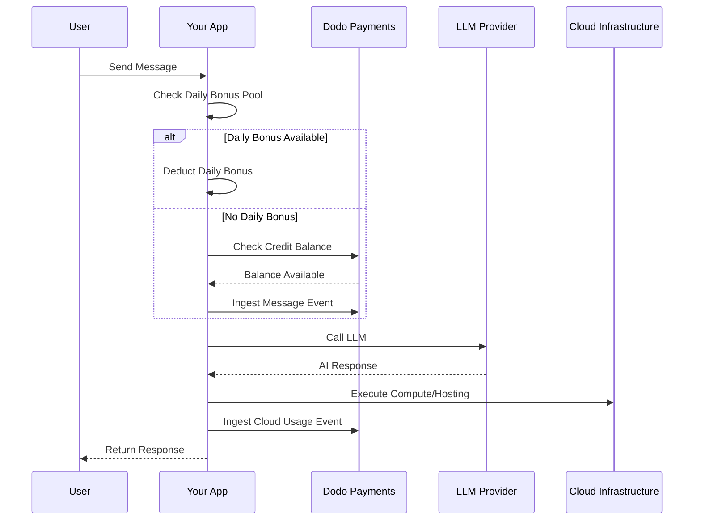

Lovable (lovable.dev) es un creador de aplicaciones web de IA que utiliza un modelo de suscripción basado en créditos. A diferencia de los sistemas basados en tokens, Lovable simplifica la experiencia del usuario cobrando un crédito por mensaje. Este modelo combina un conjunto de créditos mensuales con un goteo diario de bonificación para fomentar un compromiso constante mientras permite un uso intensivo.

## Modelo de Facturación de Lovable

La tarifa de Lovable se basa en créditos por mensaje y facturación medida por separado para la infraestructura en la nube.

| Plan | Precio | Créditos Mensuales | Bonificación Diaria | Características Clave |
| :--- | :--- | :--- | :--- | :--- |
| Gratis | $0/mes | 0 | 5/día (hasta 30/mes) | Solo proyectos públicos |
| Pro | $25/mes | 100 | 5/día (hasta 150/mes en total) | Recargas a demanda, nube + IA basadas en uso, dominios personalizados |
| Business | $50/mes | 100 | 5/día | SSO, espacio de trabajo en equipo, plantillas de diseño, centro de seguridad |
| Enterprise | Personalizado | Personalizado | Personalizado | SCIM, soporte dedicado, registros de auditoría |

- **Suscripción basada en créditos**: 1 crédito = 1 mensaje/prompt para la IA.
- **Los créditos se comparten entre usuarios ilimitados**: Conjunto a nivel de equipo, no por asiento.
- **Los créditos se reinician cada ciclo de facturación**: Los créditos mensuales se refrescan al renovar.
- **Recargas de créditos a demanda**: Los usuarios pueden comprar más créditos si se agotan.
- **Facturación separada en nube + IA basada en uso**: Facturación medida para alojamiento y computación.
- **Los créditos de bonificación diaria se reinician cada día**: Un goteo diario de 5 créditos que se usan o se pierden.

## Qué lo Hace Único

- **Simplicidad basada en mensajes**: 1 crédito = 1 mensaje sin importar la complejidad. No se cuentan tokens ni peso de modelos.
- **Goteo diario + conjunto mensual híbrido**: Los 5 créditos de bonificación diaria crean un incentivo de compromiso diario, mientras que los 100 créditos mensuales permiten un uso intensivo.
- **Conjunto compartido a nivel de equipo**: Créditos compartidos entre usuarios ilimitados por un precio fijo de equipo, no por asiento.
- **Facturación de dos capas**: Créditos para interacciones con IA + facturación medida por separado para infraestructura en la nube.

## Construye Esto con Dodo Payments

Puedes replicar el modelo híbrido de Lovable usando los derechos de crédito y los medidores basados en uso de Dodo Payments.

<Steps>
  <Step title="Create a Custom Unit Credit Entitlement">
    Define el sistema de créditos por mensaje en tu panel de Dodo Payments. Este derecho maneja el conjunto de créditos mensuales.

    - **Tipo de Crédito**: Unidad Personalizada
    - **Nombre de Unidad**: "Mensajes"
    - **Precisión**: 0
    - **Caducidad de Crédito**: 30 días
    - **Exceso**: Deshabilitado (límite duro cuando los créditos llegan a 0)
  </Step>

  <Step title="Create Subscription Products">
    Crea tus planes y adjunta el derecho de crédito. Para el plan Gratis, manejarás la bonificación diaria a través de la lógica de la aplicación.

    - **Gratis**: $0/mes, 0 créditos (bonificación diaria manejada por lógica de la aplicación)
    - **Pro**: $25/mes, 100 créditos/ciclo, adjuntar derecho de crédito
    - **Business**: $50/mes, 100 créditos/ciclo, adjuntar derecho de crédito

    ```typescript
    import DodoPayments from 'dodopayments';

    const client = new DodoPayments({
      bearerToken: process.env.DODO_PAYMENTS_API_KEY,
    });

    const session = await client.checkoutSessions.create({
      product_cart: [
        { product_id: 'pdt_lovable_pro', quantity: 1 }
      ],
      customer: { email: 'user@example.com' },
      return_url: 'https://lovable.dev/dashboard'
    });
    ```

  </Step>

  <Step title="Create a Usage Meter for Cloud + AI">
    Lovable factura por separado la infraestructura en la nube. Crea un medidor para rastrear estos costos.

    - **Nombre del Medidor**: `cloud.compute_seconds`
    - **Agregación**: Suma en propiedad `compute_seconds`

    Adjunta este medidor a tus productos de suscripción con precios por unidad. Cuando ingieres uso, Dodo calcula el costo basado en tus tarifas.

    ```typescript
    await client.usageEvents.ingest({
      events: [{
        event_id: `compute_${Date.now()}`,
        customer_id: 'cust_123',
        event_name: 'cloud.compute_seconds',
        timestamp: new Date().toISOString(),
        metadata: {
          compute_seconds: 3600,
          project_id: 'proj_abc'
        }
      }]
    });
    ```

  </Step>

  <Step title="Implement Daily Bonus Credits (Application Logic)">
    El goteo diario de bonificación se maneja a nivel de aplicación. Puedes usar un trabajo cron para otorgar estos créditos o rastrearlos por separado en tu base de datos.

    Para rastrear el uso de estos créditos de bonificación en Dodo sin agotar inmediatamente el saldo del principal derecho, puedes usar un nombre de evento separado o manejar la lógica en tu aplicación para verificar primero el conjunto de bonificación.

    ```typescript
    // Example cron job logic (pseudo-code)
    // Every day at midnight UTC:
    // 1. Reset 'daily_bonus_used' to 0 for all users in your DB
    
    // When a user sends a message:
    async function handleMessage(userId: string) {
      const user = await db.users.findUnique({ where: { id: userId } });
      
      if (user.daily_bonus_used < 5) {
        // Use daily bonus
        await db.users.update({
          where: { id: userId },
          data: { daily_bonus_used: { increment: 1 } }
        });
        // Track for analytics but don't deduct from Dodo credits yet
        await client.usageEvents.ingest({
          events: [{
            event_id: `msg_bonus_${Date.now()}`,
            customer_id: userId,
            event_name: 'ai.message.bonus',
            timestamp: new Date().toISOString(),
            metadata: { type: 'daily_bonus' }
          }]
        });
      } else {
        // Deduct from Dodo credit entitlement
        await client.usageEvents.ingest({
          events: [{
            event_id: `msg_${Date.now()}`,
            customer_id: userId,
            event_name: 'ai.message',
            timestamp: new Date().toISOString(),
            metadata: { type: 'subscription_credit' }
          }]
        });
      }
    }
    ```

  </Step>

  <Step title="Send Usage Events for Messages">
    Rastrear cada mensaje de IA como un evento de uso. Vincula el evento `ai.message` a tu derecho de crédito "Mensajes" en el panel de Dodo.

    ```typescript
    await client.usageEvents.ingest({
      events: [{
        event_id: `msg_${Date.now()}`,
        customer_id: 'cust_123',
        event_name: 'ai.message',
        timestamp: new Date().toISOString(),
        metadata: {
          content_length: 450,
          project_id: 'proj_abc',
          feature_type: 'editor'
        }
      }]
    });
    ```

  </Step>

  <Step title="Handle Webhooks for Low Balance">
    Notifica a los usuarios cuando están bajos en créditos para que puedan recargar o actualizar.

    ```typescript
    import DodoPayments from 'dodopayments';
    import express from 'express';

    const app = express();
    app.use(express.raw({ type: 'application/json' }));

    const client = new DodoPayments({
      bearerToken: process.env.DODO_PAYMENTS_API_KEY,
      webhookKey: process.env.DODO_PAYMENTS_WEBHOOK_KEY,
    });

    app.post('/webhooks/dodo', async (req, res) => {
      try {
        const event = client.webhooks.unwrap(req.body.toString(), {
          headers: {
            'webhook-id': req.headers['webhook-id'] as string,
            'webhook-signature': req.headers['webhook-signature'] as string,
            'webhook-timestamp': req.headers['webhook-timestamp'] as string,
          },
        });

        if (event.type === 'credit.balance_low') {
          const { customer_id, available_balance } = event.data;
          await notifyUser(customer_id, `Your balance is low: ${available_balance} messages left.`);
        }

        res.json({ received: true });
      } catch (error) {
        res.status(401).json({ error: 'Invalid signature' });
      }
    });
    ```

  </Step>
</Steps>

## Acelera con el Diseño de Ingestión LLM

El [Diseño de Ingestión LLM](/developer-resources/ingestion-blueprints/llm) simplifica el seguimiento envolviendo tu cliente de IA.

```typescript
import { createLLMTracker } from '@dodopayments/ingestion-blueprints';
import OpenAI from 'openai';

const tracker = createLLMTracker({
  apiKey: process.env.DODO_PAYMENTS_API_KEY,
  environment: 'live_mode',
  eventName: 'ai.message',
});

const trackedClient = tracker.wrap({
  client: new OpenAI(),
  customerId: 'cust_123',
});

// Automatically tracks the message and deducts 1 credit (if configured)
await trackedClient.chat.completions.create({
  model: 'gpt-4o',
  messages: [{ role: 'user', content: 'Build a landing page' }],
});
```

<Tip>
  Consulta la [documentación completa del diseño](/developer-resources/ingestion-blueprints/llm) para más detalles sobre el seguimiento automático.
</Tip>

## Descripción General de la Arquitectura



## Características Clave de Dodo Utilizadas

Explora las características que hacen posible esta implementación.

<CardGroup cols={2}>
  <Card title="Credit-Based Billing" icon="coins" href="/features/credit-based-billing">
    Gestiona créditos por mensaje y grupos compartidos en equipo.
  </Card>
  <Card title="Subscriptions" icon="calendar" href="/features/subscription">
    Configura planes recurrentes para los niveles Pro y Business.
  </Card>
  <Card title="Usage-Based Billing" icon="chart-line" href="/features/usage-based-billing/introduction">
    Mide el uso de la infraestructura en la nube por separado de los créditos de IA.
  </Card>
  <Card title="Event Ingestion" icon="bolt" href="/features/usage-based-billing/event-ingestion">
    Envía eventos de mensajes y computación de alto volumen a Dodo.
  </Card>
  <Card title="Webhooks" icon="webhook" href="/developer-resources/webhooks/intents/credit">
    Automatiza notificaciones para saldos bajos en créditos.
  </Card>
  <Card title="LLM Ingestion Blueprint" icon="brain-circuit" href="/developer-resources/ingestion-blueprints/llm">
    Simplifica el seguimiento del uso de la IA con integraciones pre-construidas.
  </Card>
</CardGroup>
