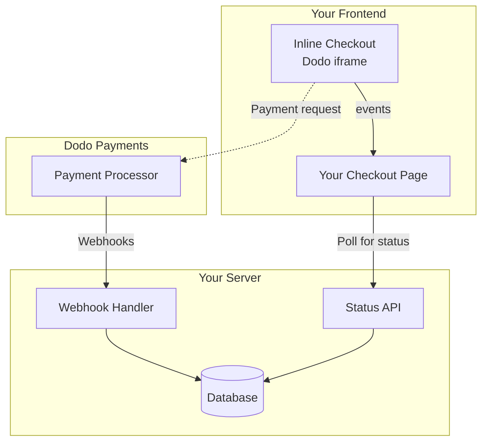

## Descripción general

El pago en línea te permite crear experiencias de pago completamente integradas que se mezclan sin problemas con tu sitio web o aplicación. A diferencia del [pago en superposición](/developer-resources/overlay-checkout), que se abre como un modal sobre tu página, el pago en línea incrusta el formulario de pago directamente en el diseño de tu página.

Usando el pago en línea, puedes:

- Crear experiencias de pago que están completamente integradas con tu aplicación o sitio web
- Permitir que Dodo Payments capture de forma segura la información del cliente y de pago en un marco de pago optimizado
- Mostrar artículos, totales y otra información de Dodo Payments en tu página
- Usar métodos y eventos del SDK para construir experiencias de pago avanzadas

<Frame>
    
</Frame>

## Cómo funciona

El pago en línea funciona incrustando un marco seguro de Dodo Payments en tu sitio web o aplicación.

El marco de pago se encarga de recopilar la información del cliente y capturar los detalles de pago. Tu página muestra la lista de artículos, totales y opciones para cambiar lo que hay en el pago. El SDK permite que tu página y el marco de pago interactúen entre sí.

Dodo Payments crea automáticamente una suscripción cuando se completa un pago, lista para que la provisionen.

<Note>
El marco de inline checkout gestiona de forma segura toda la información de pago sensible, garantizando el cumplimiento de PCI sin que necesites certificación adicional.
</Note>

## ¿Qué hace que un buen pago en línea?

Es importante que los clientes sepan de quién están comprando, qué están comprando y cuánto están pagando.

Para construir un pago en línea que sea conforme y optimizado para la conversión, tu implementación debe incluir:

<Frame caption="Example inline checkout layout showing required elements">
    
</Frame>

1. **Información recurrente**: Si es recurrente, con qué frecuencia se repite y el total a pagar en la renovación. Si es una prueba, cuánto dura la prueba.
2. **Descripciones de artículos**: Una descripción de lo que se está comprando.
3. **Totales de transacción**: Totales de transacción, incluyendo subtotal, total de impuestos y total general. Asegúrate de incluir también la moneda.
4. **Pie de página de Dodo Payments**: El marco completo de pago en línea, incluyendo el pie de página de pago que tiene información sobre Dodo Payments, nuestros términos de venta y nuestra política de privacidad.
5. **Política de reembolso**: Un enlace a tu política de reembolso, si difiere de la política de reembolso estándar de Dodo Payments.

<Warning>
Siempre muestra el marco completo de inline checkout, incluido el pie de página. Eliminar u ocultar la información legal incumple los requisitos de conformidad.
</Warning>

## Viaje del cliente

El flujo de pago está determinado por la configuración de tu sesión de pago. Dependiendo de cómo configures la sesión de pago, los clientes experimentarán un pago que puede presentar toda la información en una sola página o a través de múltiples pasos.

<Steps>
<Step title="Customer opens checkout">

Puedes abrir el pago en línea pasando artículos o una transacción existente. Usa el SDK para mostrar y actualizar la información en la página, y los métodos del SDK para actualizar los artículos según la interacción del cliente.
    

</Step>

<Step title="Customer enters their details">

El pago en línea primero pide a los clientes que ingresen su dirección de correo electrónico, seleccionen su país y (donde sea necesario) ingresen su código postal. Este paso recopila toda la información necesaria para determinar impuestos y opciones de pago disponibles.

Puedes prellenar los detalles del cliente y presentar direcciones guardadas para agilizar la experiencia.

</Step>

<Step title="Customer selects payment method">

Después de ingresar sus datos, se presentan a los clientes los métodos de pago disponibles y el formulario de pago. Las opciones pueden incluir tarjeta de crédito o débito, PayPal, Apple Pay, Google Pay y otros métodos de pago locales según su ubicación.

Muestra los métodos de pago guardados si están disponibles para acelerar el pago.


</Step>

<Step title="Checkout completed">

Dodo Payments dirige cada pago al mejor adquirente para esa venta para obtener la mejor oportunidad de éxito. Los clientes ingresan a un flujo de éxito que puedes construir.


</Step>

<Step title="Dodo Payments creates subscription">

Dodo Payments crea automáticamente una suscripción para el cliente, lista para que la provisionen. El método de pago que utilizó el cliente se guarda para renovaciones o cambios de suscripción.


</Step>
</Steps>

## Inicio Rápido

Comienza con el Pago en Línea de Dodo Payments en solo unas pocas líneas de código:

```typescript
import { DodoPayments } from "dodopayments-checkout";

// Initialize the SDK for inline mode
DodoPayments.Initialize({
  mode: "test",
  displayType: "inline",
  onEvent: (event) => {
    console.log("Checkout event:", event);
  },
});

// Open checkout in a specific container
DodoPayments.Checkout.open({
  checkoutUrl: "https://test.dodopayments.com/session/cks_123",
  elementId: "dodo-inline-checkout" // ID of the container element
});
```

<Tip>
Asegúrate de tener un elemento contenedor con el `id` correspondiente en tu página: `<div id="dodo-inline-checkout"></div>`.
</Tip>

## Guía de Integración Paso a Paso

<Steps>
<Step title="Install the SDK">

Instala el SDK de Dodo Payments Checkout:

<CodeGroup>

```bash npm
npm install dodopayments-checkout
```

```bash yarn
yarn add dodopayments-checkout
```

```bash pnpm
pnpm add dodopayments-checkout
```

</CodeGroup>

</Step>

<Step title="Initialize the SDK for Inline Display">

Inicializa el SDK y especifica `displayType: 'inline'`. También debes escuchar el evento `checkout.breakdown` para actualizar tu interfaz de usuario con los cálculos de impuestos y totales en tiempo real.

```typescript
import { DodoPayments } from "dodopayments-checkout";

DodoPayments.Initialize({
  mode: "test",
  displayType: "inline",
  onEvent: (event) => {
    if (event.event_type === "checkout.breakdown") {
      const breakdown = event.data?.message;
      // Update your UI with breakdown.subTotal, breakdown.tax, breakdown.total, etc.
    }
  },
});
```

</Step>

<Step title="Create a Container Element">

Agrega un elemento a tu HTML donde se inyectará el marco de pago:

```html
<div id="dodo-inline-checkout"></div>
```

</Step>

<Step title="Open the Checkout">

Llama a `DodoPayments.Checkout.open()` con el `checkoutUrl` y el `elementId` de tu contenedor:

```typescript
DodoPayments.Checkout.open({
  checkoutUrl: "https://test.dodopayments.com/session/cks_123",
  elementId: "dodo-inline-checkout"
});
```

</Step>

<Step title="Test Your Integration">

1. Inicia tu servidor de desarrollo:

```bash
npm run dev
```

2. Prueba el flujo de pago:
   - Ingresa tu correo electrónico y detalles de dirección en el marco en línea.
   - Verifica que tu resumen de pedido personalizado se actualice en tiempo real.
   - Prueba el flujo de pago usando credenciales de prueba.
   - Confirma que las redirecciones funcionen correctamente.

<Check>
Deberías ver eventos `checkout.breakdown` registrados en la consola del navegador si agregaste un console.log en la devolución `onEvent`.
</Check>

</Step>

<Step title="Go Live">

Cuando estés listo para producción:

1. Cambia el modo a `'live'`:

```typescript
DodoPayments.Initialize({
  mode: "live",
  displayType: "inline",
  onEvent: (event) => {
    // Handle events
  }
});
```

2. Actualiza tus URLs de pago para usar sesiones de pago en vivo desde tu backend.
3. Prueba el flujo completo en producción.

</Step>
</Steps>

## Ejemplo Completo en React

Este ejemplo muestra cómo implementar un resumen de pedido personalizado junto al inline checkout, manteniéndolos sincronizados mediante el evento `checkout.breakdown`.

```tsx
"use client";

import { useEffect, useState } from 'react';
import { DodoPayments, CheckoutBreakdownData } from 'dodopayments-checkout';

export default function CheckoutPage() {
  const [breakdown, setBreakdown] = useState<Partial<CheckoutBreakdownData>>({});

  useEffect(() => {
    // 1. Initialize the SDK
    DodoPayments.Initialize({
      mode: 'test',
      displayType: 'inline',
      onEvent: (event) => {
        // 2. Listen for the 'checkout.breakdown' event
        if (event.event_type === "checkout.breakdown") {
          const message = event.data?.message as CheckoutBreakdownData;
          if (message) setBreakdown(message);
        }
      }
    });

    // 3. Open the checkout in the specified container
    DodoPayments.Checkout.open({
      checkoutUrl: 'https://test.dodopayments.com/session/cks_123',
      elementId: 'dodo-inline-checkout'
    });

    return () => DodoPayments.Checkout.close();
  }, []);

  const format = (amt: number | null | undefined, curr: string | null | undefined) => 
    amt != null && curr ? `${curr} ${(amt/100).toFixed(2)}` : '0.00';

  const currency = breakdown.currency ?? breakdown.finalTotalCurrency ?? '';

  return (
    <div className="flex flex-col md:flex-row min-h-screen">
      {/* Left Side - Checkout Form */}
      <div className="w-full md:w-1/2 flex items-center">
        <div id="dodo-inline-checkout" className='w-full' />
      </div>

      {/* Right Side - Custom Order Summary */}
      <div className="w-full md:w-1/2 p-8 bg-gray-50">
        <h2 className="text-2xl font-bold mb-4">Order Summary</h2>
        <div className="space-y-2">
          {breakdown.subTotal && (
            <div className="flex justify-between">
              <span>Subtotal</span>
              <span>{format(breakdown.subTotal, currency)}</span>
            </div>
          )}
          {breakdown.discount && (
            <div className="flex justify-between">
              <span>Discount</span>
              <span>{format(breakdown.discount, currency)}</span>
            </div>
          )}
          {breakdown.tax != null && (
            <div className="flex justify-between">
              <span>Tax</span>
              <span>{format(breakdown.tax, currency)}</span>
            </div>
          )}
          <hr />
          {(breakdown.finalTotal ?? breakdown.total) && (
            <div className="flex justify-between font-bold text-xl">
              <span>Total</span>
              <span>{format(breakdown.finalTotal ?? breakdown.total, breakdown.finalTotalCurrency ?? currency)}</span>
            </div>
          )}
        </div>
      </div>
    </div>
  );
}

```

## Referencia de API

### Configuración

#### Opciones de Inicialización

```typescript
interface InitializeOptions {
  mode: "test" | "live";
  displayType: "inline"; // Required for inline checkout
  onEvent: (event: CheckoutEvent) => void;
}
```

| Opción | Tipo | Requerido | Descripción |
|--------|------|----------|-------------|
| `mode` | `"test" \| "live"` | Sí | Modo de entorno. |
| `displayType` | `"inline" \| "overlay"` | Sí | Debe establecerse en `"inline"` para incrustar el checkout. |
| `onEvent` | `function` | Sí | Función de devolución para manejar eventos del checkout. |

#### Opciones de Pago

```typescript
export type FontSize = "xs" | "sm" | "md" | "lg" | "xl" | "2xl";
export type FontWeight = "normal" | "medium" | "bold" | "extraBold";

interface CheckoutOptions {
  checkoutUrl: string;
  elementId: string; // Required for inline checkout
  options?: {
    showTimer?: boolean;
    showSecurityBadge?: boolean;
    payButtonText?: string;
    fontSize?: FontSize;
    fontWeight?: FontWeight;
  };
}
```

| Opción | Tipo | Requerido | Descripción |
|--------|------|----------|-------------|
| `checkoutUrl` | `string` | Sí | URL de la sesión de pago. |
| `elementId` | `string` | Sí | El `id` del elemento DOM donde se debe renderizar el pago. |
| `options.showTimer` | `boolean` | No | Mostrar u ocultar el temporizador de pago. Predeterminado a `true`. Cuando está deshabilitado, recibirás el evento `checkout.link_expired` cuando la sesión expire. |
| `options.showSecurityBadge` | `boolean` | No | Mostrar u ocultar la insignia de seguridad. Predeterminado a `true`. |
| `options.payButtonText` | `string` | No | Texto personalizado para mostrar en el botón de pago. |
| `options.fontSize` | `FontSize` | No | Tamaño de fuente global para el pago. |
| `options.fontWeight` | `FontWeight` | No | Peso de la fuente global para el pago. |

### Métodos

#### Abrir Pago

Abre el marco de pago en el contenedor especificado.

```typescript
DodoPayments.Checkout.open({
  checkoutUrl: "https://test.dodopayments.com/session/cks_123",
  elementId: "dodo-inline-checkout"
});
```

También puedes pasar opciones adicionales para personalizar el comportamiento del pago:

```typescript
DodoPayments.Checkout.open({
  checkoutUrl: "https://test.dodopayments.com/session/cks_123",
  elementId: "dodo-inline-checkout",
  options: {
    showTimer: false,
    showSecurityBadge: false,
    payButtonText: "Pay Now",
  },
});
```

#### Cerrar Pago

Elimina programáticamente el marco de pago y limpia los listeners de eventos.

```typescript
DodoPayments.Checkout.close();
```

#### Verificar Estado

Indica si el marco de pago está actualmente inyectado.

```typescript
const isOpen = DodoPayments.Checkout.isOpen();
// Returns: boolean
```

### Eventos

El SDK proporciona eventos en tiempo real a través del callback `onEvent`. Para el pago en línea, `checkout.breakdown` es particularmente útil para sincronizar tu UI.

| Tipo de Evento | Descripción |
|------------|-------------|
| `checkout.opened` | El marco de pago ha sido cargado. |
| `checkout.form_ready` | El formulario de pago está listo para recibir entrada del usuario. Útil para ocultar estados de carga y mostrar la interfaz de usuario de pago. |
| `checkout.breakdown` | Se activa cuando se actualizan precios, impuestos o descuentos. |
| `checkout.customer_details_submitted` | Se han enviado los detalles del cliente. |
| `checkout.pay_button_clicked` | Se activa cuando el cliente hace clic en el botón de pago. Útil para análisis y seguimiento de embudos de conversión. |
| `checkout.redirect` | El pago realizará una redirección (por ejemplo, a una página de banco). |
| `checkout.error` | Ocurrió un error durante el pago. |
| `checkout.link_expired` | Se activa cuando la sesión de pago expira. Solo se recibe cuando `showTimer` está configurado a `false`. |

#### Datos del Análisis del Pago

El evento `checkout.breakdown` proporciona los siguientes datos:

```typescript
interface CheckoutBreakdownData {
  subTotal?: number;          // Amount in cents
  discount?: number;         // Amount in cents
  tax?: number;              // Amount in cents
  total?: number;            // Amount in cents
  currency?: string;         // e.g., "USD"
  finalTotal?: number;       // Final amount including adjustments
  finalTotalCurrency?: string; // Currency for the final total
}
```

#### Entendiendo el Evento de Análisis

El evento `checkout.breakdown` es la forma principal de mantener la interfaz de usuario de tu aplicación sincronizada con el estado de pago de Dodo Payments.

**Cuándo se activa:**
- **Al inicializar**: Inmediatamente después de que se carga y lista el marco de pago.
- **Al cambiar de dirección**: Cada vez que el cliente selecciona un país o ingresa un código postal que resulta en un recálculo de impuestos.

**Detalles del Campo:**

| Campo | Descripción |
|-------|-------------|
| `subTotal` | La suma de todos los artículos de línea en la sesión antes de que se apliquen descuentos o impuestos. |
| `discount` | El valor total de todos los descuentos aplicados. |
| `tax` | El monto de impuestos calculado. En modo `inline`, esto se actualiza dinámicamente a medida que el usuario interactúa con los campos de dirección. |
| `total` | El resultado matemático de `subTotal - discount + tax` en la moneda base de la sesión. |
| `currency` | El código ISO de la moneda (por ejemplo, `"USD"`) para los valores estándar de subtotal, descuento e impuestos. |
| `finalTotal` | El monto real que se cobra al cliente. Esto puede incluir ajustes de cambio de divisa adicionales o tarifas de método de pago local que no son parte del desglose de precio básico. |
| `finalTotalCurrency` | La moneda en la que el cliente está realmente pagando. Esto puede diferir de `currency` si la paridad del poder adquisitivo o la conversión de moneda local está activa. |

**Consejos Clave de Integración:**

1.  **Formato de Moneda**: Los precios siempre se devuelven como enteros en la unidad monetaria más pequeña (por ejemplo, centavos para USD, yen para JPY). Para mostrarlos, divide por 100 (o la potencia de 10 correspondiente) o usa una biblioteca de formato como `Intl.NumberFormat`.
2.  **Manejo de Estados Iniciales**: Cuando el pago se carga por primera vez, `tax` e `discount` pueden ser `0` o `null` hasta que el usuario proporcione su información de facturación o aplique un código. Tu UI debe manejar estos estados de manera adecuada (por ejemplo, mostrando un guion `—` u ocultando la fila).
3.  **El "Total Final" vs "Total"**: Mientras que `total` te da el cálculo de precio estándar, `finalTotal` es la fuente de verdad para la transacción. Si `finalTotal` está presente, refleja exactamente lo que se cargará a la tarjeta del cliente, incluyendo cualquier ajuste dinámico.
4.  **Retroalimentación en Tiempo Real**: Usa el campo `tax` para mostrar a los usuarios que los impuestos están siendo calculados en tiempo real. Esto proporciona una sensación de "en vivo" a tu página de pago y reduce la fricción durante el paso de ingreso de dirección.

## Opciones de Implementación

### Instalación del Gestor de Paquetes

Instala vía npm, yarn o pnpm como se muestra en la [Guía de Integración Paso a Paso](#step-by-step-integration-guide).

### Implementación vía CDN

Para una integración rápida sin un paso de compilación, puedes usar nuestro CDN:

```html
<!DOCTYPE html>
<html lang="en">
<head>
    <meta charset="UTF-8">
    <meta name="viewport" content="width=device-width, initial-scale=1.0">
    <title>Dodo Payments Inline Checkout</title>
    
    <!-- Load DodoPayments -->
    <script src="https://cdn.jsdelivr.net/npm/dodopayments-checkout@latest/dist/index.js"></script>
    <script>
        // Initialize the SDK
        DodoPaymentsCheckout.DodoPayments.Initialize({
            mode: "test",
            displayType: "inline",
            onEvent: (event) => {
                console.log('Checkout event:', event);
            }
        });
    </script>
</head>
<body>
    <div id="dodo-inline-checkout"></div>

    <script>
        // Open the checkout
        DodoPaymentsCheckout.DodoPayments.Checkout.open({
            checkoutUrl: "https://test.dodopayments.com/session/cks_123",
            elementId: "dodo-inline-checkout"
        });
    </script>
</body>
</html>
```

## Actualizar Método de Pago

El pago en línea admite **actualizaciones de método de pago** para suscripciones. Cuando un cliente necesita actualizar su método de pago -- ya sea para una suscripción activa o para reactivar una suscripción en espera -- puedes renderizar el flujo de actualización directamente dentro de la disposición de tu página.

### Cómo Funciona

1. Llama a la [API de Actualización de Método de Pago](/features/subscription#update-payment-method-for-active-subscription) para obtener un `payment_link`:

```typescript
const response = await client.subscriptions.updatePaymentMethod('sub_123', {
  type: 'new',
  return_url: 'https://example.com/return'
});
```

2. Pasa el `payment_link` devuelto como el `checkoutUrl` para abrir el pago en línea:

```typescript
DodoPayments.Checkout.open({
  checkoutUrl: response.payment_link,
  elementId: "dodo-inline-checkout"
});
```

El marco en línea solo muestra el formulario de recopilación de método de pago. Los clientes pueden ingresar nuevos detalles de tarjeta o seleccionar un método de pago guardado sin salir de tu página.

### Para Suscripciones en Espera

Al actualizar el método de pago para una suscripción en estado `on_hold`, Dodo Payments automáticamente crea un cargo por cualquier deuda pendiente. Monitorea los webhooks `payment.succeeded` e `subscription.active` para confirmar la reactivación.

```typescript
const response = await client.subscriptions.updatePaymentMethod('sub_123', {
  type: 'new',
  return_url: 'https://example.com/return'
});

if (response.payment_id) {
  // Charge created for remaining dues
  // Open inline checkout for payment collection
  DodoPayments.Checkout.open({
    checkoutUrl: response.payment_link,
    elementId: "dodo-inline-checkout"
  });
}
```

<Tip>
También puedes usar un método de pago guardado existente en lugar de recopilar nuevos detalles pasando `type: 'existing'` con un `payment_method_id` a la API de Actualización de Método de Pago.
</Tip>

## Manejo de Errores

El SDK proporciona información detallada sobre errores a través del sistema de eventos. Siempre implementa un manejo adecuado de errores en tu callback `onEvent`:

```typescript
DodoPayments.Initialize({
  mode: "test",
  displayType: "inline",
  onEvent: (event: CheckoutEvent) => {
    if (event.event_type === "checkout.error") {
      console.error("Checkout error:", event.data?.message);
      // Handle error appropriately
    }
  }
});
```

<Warning>
Siempre maneja el evento `checkout.error` para proporcionar una buena experiencia al usuario cuando ocurran problemas.
</Warning>

## Mejores Prácticas

1. **Diseño Responsivo**: Asegúrate de que tu elemento contenedor tenga suficiente ancho y alto. El iframe típicamente se expandirá para llenar su contenedor.
2. **Sincronización**: Usa el evento `checkout.breakdown` para mantener tu resumen de pedido personalizado o tablas de precios sincronizados con lo que el usuario ve en el marco de pago.
3. **Estados de Esqueleto**: Muestra un indicador de carga en tu contenedor hasta que se active el evento `checkout.opened`.
4. **Limpieza**: Llama a `DodoPayments.Checkout.close()` cuando tu componente se desmonte para limpiar el iframe y los listeners de eventos.

<Info>
Para implementaciones en modo oscuro, se recomienda usar `#0d0d0d` como el color de fondo para una integración visual óptima con el marco de pago en línea.
</Info>

## Validación de Estado de Pago

<Warning>
No confíes únicamente en los eventos de pago en línea para determinar el éxito o fracaso del pago. Siempre implementa validación del lado del servidor usando webhooks y/o sondeo.
</Warning>

### Por Qué la Validación del Lado del Servidor es Esencial

Aunque los eventos de pago en línea proporcionan retroalimentación en tiempo real, no deben ser tu única fuente de verdad para el estado de pago. Problemas de red, fallos del navegador o el cierre de la página por parte de los usuarios pueden hacer que se pierdan eventos. Para asegurar una validación de pago confiable:

1. **Tu servidor debe escuchar eventos webhook** - Dodo Payments envía webhooks para cambios de estado de pago
2. **Implementa un mecanismo de sondeo** - Tu frontend debe sondear a tu servidor para actualizaciones de estado
3. **Combina ambos enfoques** - Usa webhooks como fuente principal y sondeo como respaldo

### Arquitectura Recomendad



### Pasos de Implementación

**1. Escucha eventos de pago** - Cuando el usuario hace clic en pagar, comienza a prepararte para verificar el estado:

```typescript
onEvent: (event) => {
  if (event.event_type === 'checkout.pay_button_clicked') {
    // Start polling your server for confirmed status
    startPolling();
  }
}
```

**2. Sonne a tu servidor** - Crea un endpoint que verifique tu base de datos para el estado de pago (actualizado por webhooks):

```typescript
// Poll every 2 seconds until status is confirmed
const interval = setInterval(async () => {
  const { status } = await fetch(`/api/payments/${paymentId}/status`).then(r => r.json());
  if (status === 'succeeded' || status === 'failed') {
    clearInterval(interval);
    handlePaymentResult(status);
  }
}, 2000);
```

**3. Maneja webhooks del lado del servidor** - Actualiza tu base de datos cuando Dodo envía webhooks `payment.succeeded` o `payment.failed`. Consulta nuestra [documentación de Webhooks](/developer-resources/webhooks) para más detalles.

## Solución de Problemas

<AccordionGroup>
<Accordion title="Checkout frame is not appearing">
- Verifica que `elementId` coincida con el `id` de un `div` que realmente exista en el DOM.
- Asegúrate de que `displayType: 'inline'` haya sido pasado a `Initialize`.
- Revisa que el `checkoutUrl` sea válido.
</Accordion>

<Accordion title="Taxes are not updating in my UI">
- Asegúrate de estar escuchando el evento `checkout.breakdown`.
- Los impuestos solo se calculan después de que el usuario ingrese un país y código postal válidos en el marco de pago.
</Accordion>
</AccordionGroup>

## Habilitación de Billeteras Digitales

Para información detallada sobre cómo configurar Apple Pay, Google Pay y otras billeteras digitales, consulta la página de <a href="/features/payment-methods/digital-wallets">Billeteras Digitales</a>.

### Configuración Rápida para Apple Pay

<Steps>
<Step title="Download domain association file">
Descarga el [archivo de asociación de dominio de Apple Pay](http://checkout.dodopayments.com/.well-known/apple-developer-merchantid-domain-association).
</Step>

<Step title="Request activation">
Envía un correo electrónico a **support@dodopayments.com** con la URL de tu dominio de producción y solicita la activación de Apple Pay.
</Step>

<Step title="Test after confirmation">
Una vez confirmado, verifica que Apple Pay aparezca en el pago y prueba el flujo completo.
</Step>
</Steps>

<Warning>
Apple Pay requiere verificación de dominio antes de aparecer en producción. Contacta a soporte antes de ir en vivo si planeas ofrecer Apple Pay.
</Warning>

## Soporte de Navegadores

El SDK de Pagos Dodo admite los siguientes navegadores:

- Chrome (última versión)
- Firefox (última versión)
- Safari (última versión)
- Edge (última versión)
- IE11+

## Pago En Línea vs Pago Superpuesto

Elige el tipo de pago adecuado para tu caso de uso:

| Característica | Pago En Línea | Pago Superpuesto |
|---------|-----------------|------------------|
| Profundidad de integración | Completamente incrustado en la página | Modal sobre la página |
| Control de diseño | Control total | Limitado |
| Marca | Fluida | Separada de la página |
| Esfuerzo de implementación | Mayor | Menor |
| Mejor para | Páginas de pago personalizadas, flujos de alta conversión | Integración rápida, páginas existentes |

<Tip>
Usa **pago en línea** cuando desees el máximo control sobre la experiencia de pago y una marca fluida. Usa **pago superpuesto** para una integración más rápida con cambios mínimos en tus páginas existentes.
</Tip>

## Recursos Relacionados

<CardGroup cols={2}>
<Card title="Overlay Checkout" icon="layer-group" href="/developer-resources/overlay-checkout">
    Usa el pago superpuesto para una integración rápida basada en modal.
</Card>

<Card title="Checkout Sessions API" icon="code" href="/api-reference/checkout-sessions/create">
    Crea sesiones de pago para impulsar tus experiencias de pago.
</Card>

<Card title="Webhooks" icon="webhook" href="/developer-resources/webhooks">
    Maneja eventos de pago del lado del servidor con webhooks.
</Card>

<Card title="Integration Guide" icon="book" href="/developer-resources/integration-guide">
    Guía completa para integrar Dodo Payments.
</Card>
</CardGroup>

Para más ayuda, visita nuestra [comunidad en Discord](https://discord.gg/bYqAp4ayYh) o contacta a nuestro equipo de soporte para desarrolladores.
