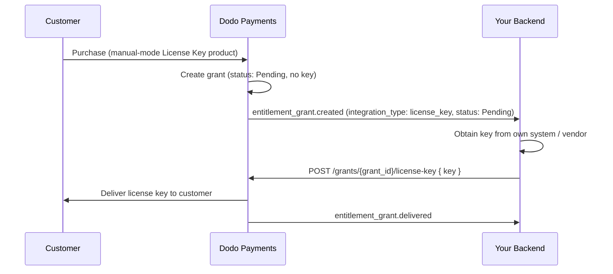

Esta guía explica cómo crear un sistema completo de **entrega manual de claves de licencia**. En lugar de que Dodo Payments genere automáticamente una clave al realizar el pago, cada compra crea una concesión `Pending` y espera a que *tú* proporciones el valor de la clave desde tu propio sistema, un proveedor externo o un conjunto finito de códigos.

Al final tendrás:

- Un producto con un derecho de Clave de Licencia configurado para cumplimiento `manual`.
- Un receptor de webhooks que detecta cuando un cliente está esperando una clave.
- Una llamada de cumplimiento que entrega la clave y notifica automáticamente al cliente.

<CardGroup cols={2}>
<Card title="License Keys overview" icon="key" href="/features/license-keys">
El ciclo de vida completo de la clave de licencia y la configuración `fulfillment_mode`.
</Card>
<Card title="Fulfill License Key Grant API" icon="code" href="/api-reference/entitlements/fulfill-license-key">
Referencia de API para el punto final que llamas para entregar una clave.
</Card>
</CardGroup>

## Cómo Funciona



El cumplimiento manual solo cambia el paso de **emisión**. Activación, validación, desactivación, vencimiento y revocación se comportan exactamente como una clave auto-generada una vez entregada.

## Prerrequisitos

Para seguir esta guía necesitarás:

- Una cuenta de comerciante de Dodo Payments.
- Tu API key (`DODO_PAYMENTS_API_KEY`) y la clave secreta de webhook del dashboard. Consulta la [guía de generación de API key](/api-reference/introduction#api-key-management-and-authentication).
- Un endpoint de backend que pueda recibir webhooks.

<Info>
Usa `https://test.dodopayments.com` y credenciales de modo de prueba mientras desarrollas. Cambia a `https://live.dodopayments.com` y claves en vivo cuando vayas a producción.
</Info>

## Paso 1 — Crear un Derecho de Clave de Licencia en Modo Manual

Un **derecho** es una definición reutilizable de lo que entregas. Crea un derecho de Clave de Licencia y configura su `fulfillment_mode` en `manual`.

<Tabs>
<Tab title="Dashboard">
<Steps>
<Step title="Open Entitlements">
Ve a **Derechos** en tu panel de control y haz clic en **+** para crear un nuevo derecho.
</Step>
<Step title="Choose License Key">
Selecciona **Clave de Licencia** como la integración y dale un **Nombre**. El formulario expone estos campos:

- **Modo de Cumplimiento** — `Automatic` por defecto. Esta es la configuración que permite el cumplimiento manual; la cambiarás en el siguiente paso.
- **Duración de la Licencia** — cuánto tiempo se mantiene válida cada clave emitida, o **Sin vencimiento**.
- **Límite de Activaciones** — activaciones máximas por clave, o **Ilimitado**.
- **Mensaje de Activación** — mensaje opcional de cara al cliente que se muestra cuando activan la clave.

<Frame>

</Frame>
</Step>
<Step title="Set Fulfillment Mode to Manual">
Abre el menú desplegable **Fulfillment Mode** y cámbialo de **Automatic** a **Manual**. Este es el ajuste que determina toda esta guía: sin él, las claves se generan y envían por correo electrónico automáticamente y no se crea ninguna concesión pendiente. Con **Manual** seleccionado, cada compra crea una concesión `Pending` que debes completar. Haz clic en **Create Entitlement** para guardar.
</Step>
</Steps>
</Tab>

<Tab title="API">
Crea el derecho con `integration_config.fulfillment_mode` configurado en `manual`.
<CodeGroup>

```typescript Node.js theme={null}
import DodoPayments from 'dodopayments';

const client = new DodoPayments({
  bearerToken: process.env.DODO_PAYMENTS_API_KEY,
  environment: 'test_mode', // defaults to 'live_mode'
});

const entitlement = await client.entitlements.create({
  name: 'Pro License (Manual)',
  integration_type: 'license_key',
  integration_config: {
    fulfillment_mode: 'manual',
    activations_limit: 5,
    duration_count: 1,
    duration_interval: 'Year',
  },
});

console.log(entitlement.id); // ent_...
```

```python Python theme={null}
import os
from dodopayments import DodoPayments

client = DodoPayments(
    bearer_token=os.environ.get("DODO_PAYMENTS_API_KEY"),
    environment="test_mode",  # defaults to "live_mode"
)

entitlement = client.entitlements.create(
    name="Pro License (Manual)",
    integration_type="license_key",
    integration_config={
        "fulfillment_mode": "manual",
        "activations_limit": 5,
        "duration_count": 1,
        "duration_interval": "Year",
    },
)

print(entitlement.id)
```

```bash cURL theme={null}
curl -X POST https://test.dodopayments.com/entitlements \
  -H "Authorization: Bearer $DODO_PAYMENTS_API_KEY" \
  -H "Content-Type: application/json" \
  -d '{
    "name": "Pro License (Manual)",
    "integration_type": "license_key",
    "integration_config": {
      "fulfillment_mode": "manual",
      "activations_limit": 5,
      "duration_count": 1,
      "duration_interval": "Year"
    }
  }'
```

</CodeGroup>
</Tab>
</Tabs>

<Note>
La `fulfillment_mode` tiene un valor predeterminado de `auto`. Omitirlo, o dejar un derecho existente sin cambios, mantiene el comportamiento automático. Solo los derechos configurados explícitamente en `manual` crean concesiones pendientes.
</Note>

## Paso 2 — Adjuntar el Derecho a un Producto

Abre el producto que deseas vender, expande **Configuración Avanzada → Derechos & Créditos**, y selecciona el **derecho de Clave de Licencia que configuraste en Manual** en el Paso 1. Un solo producto puede entregar esta clave de licencia junto a otros derechos en la misma compra.

 <Frame caption="Selecting the License Key entitlement in the product entitlements panel.">

</Frame>

 <Note>
El modo de cumplimiento es una propiedad del **derecho**, no del producto. Debido a que lo configuraste en **Manual** en el Paso 1, cada producto al que se adjunta este derecho crea concesiones de clave de licencia `pending` en la compra — no hay nada extra que configurar aquí.
</Note>

<Note>
El modo de entrega es una propiedad de la **concesión**, no del producto. Como lo estableciste en **Manual** en el Paso 1, cada producto al que esté asociada esta concesión crea concesiones de claves de licencia `Pending` al realizar la compra; no hay nada más que configurar aquí.
</Note>

## Paso 3 — Detectar Concesiones Pendientes

Cuando un cliente compra el producto, Dodo Payments crea una concesión en estado `pending` **sin clave adjunta** y activa un webhook `entitlement_grant.created`. Esta es tu señal de que un cliente está esperando una clave.

Cuando un cliente compra el producto, Dodo Payments crea una concesión con estado `Pending` **sin ninguna clave asociada** y activa un webhook `entitlement_grant.created`. Esta es la señal de que un cliente está esperando una clave.

Configura un punto final de webhook (Desarrollador → Webhooks en el panel de control) y actúa sobre concesiones de claves de licencia pendientes. La implementación sigue la especificación de [Standard Webhooks](https://standardwebhooks.com/).

```typescript theme={null}
import { Webhook } from 'standardwebhooks';

const webhook = new Webhook(process.env.DODO_WEBHOOK_KEY!);

export async function POST(request: Request) {
  const rawBody = await request.text();
  const headers = {
    'webhook-id': request.headers.get('webhook-id') || '',
    'webhook-signature': request.headers.get('webhook-signature') || '',
    'webhook-timestamp': request.headers.get('webhook-timestamp') || '',
  };

  await webhook.verify(rawBody, headers);
  const event = JSON.parse(rawBody);

  // A customer bought a manual-mode license key and is waiting for it.
  if (
    event.type === 'entitlement_grant.created' &&
    event.data.integration_type === 'license_key' &&
    event.data.status === 'pending'
  ) {
    await queueLicenseKeyFulfillment({
      grantId: event.data.id,
      customerId: event.data.customer_id,
    });
  }

  return new Response('ok');
}
```

```typescript theme={null}
import { Webhook } from 'standardwebhooks';

const webhook = new Webhook(process.env.DODO_WEBHOOK_KEY!);

export async function POST(request: Request) {
  const rawBody = await request.text();
  const headers = {
    'webhook-id': request.headers.get('webhook-id') || '',
    'webhook-signature': request.headers.get('webhook-signature') || '',
    'webhook-timestamp': request.headers.get('webhook-timestamp') || '',
  };

  await webhook.verify(rawBody, headers);
  const event = JSON.parse(rawBody);

  // A customer bought a manual-mode license key and is waiting for it.
  if (
    event.type === 'entitlement_grant.created' &&
    event.data.integration_type === 'license_key' &&
    event.data.status === 'Pending'
  ) {
    await queueLicenseKeyFulfillment({
      grantId: event.data.id,
      customerId: event.data.customer_id,
    });
  }

  return new Response('ok');
}
```

### O consulta la API de Listado de Concesiones

Si prefieres no depender de webhooks, lista concesiones para el derecho y filtra por `integration_type` e `status`:

Si prefieres no depender de webhooks, lista las concesiones para tu derecho de Clave de Licencia y filtra por `status`. Cada concesión en un derecho de Clave de Licencia es ya una concesión de clave de licencia, por lo que no se necesita el filtro `integration_type`:

```typescript Node.js theme={null}
const pending = await client.entitlements.grants.list('ent_license_key_id', {
  integration_type: 'license_key',
  status: 'pending',
});

for (const grant of pending.items) {
  console.log(`Grant ${grant.id} for customer ${grant.customer_id} needs a key`);
}
```

```typescript Node.js theme={null}
const pending = await client.entitlements.grants.list('ent_license_key_id', {
  status: 'Pending',
});

for (const grant of pending.items) {
  console.log(`Grant ${grant.id} for customer ${grant.customer_id} needs a key`);
}
```

```bash cURL theme={null}
curl -G https://test.dodopayments.com/entitlements/ent_license_key_id/grants \
  -H "Authorization: Bearer $DODO_PAYMENTS_API_KEY" \
  --data-urlencode "status=Pending"
```

## Paso 4 — Entregar la Clave

Obtén el valor de la clave de tu propio sistema, luego envíala con el punto final [Fulfill License Key Grant](/api-reference/entitlements/fulfill-license-key). Esto requiere tu clave API secreta (permiso de Editor); **no** es uno de los puntos finales públicos de licencia.

 <CodeGroup>

```typescript Node.js theme={null}
async function fulfill(grantId: string, key: string) {
  const res = await fetch(
    `https://test.dodopayments.com/grants/${grantId}/license-key`,
    {
      method: 'POST',
      headers: {
        'Content-Type': 'application/json',
        Authorization: `Bearer ${process.env.DODO_PAYMENTS_API_KEY}`,
      },
      body: JSON.stringify({
        key,
        // Optional — fall back to the entitlement config when omitted
        activations_limit: 5,
        expires_at: '2027-05-01T00:00:00Z',
      }),
    },
  );

  if (!res.ok) {
    // See the status code table below for handling
    throw new Error(`Fulfillment failed: ${res.status}`);
  }

  return res.json(); // updated grant, now status: "delivered"
}
```

```typescript Node.js theme={null}
async function fulfill(grantId: string, key: string) {
  const res = await fetch(
    `https://test.dodopayments.com/grants/${grantId}/license-key`,
    {
      method: 'POST',
      headers: {
        'Content-Type': 'application/json',
        Authorization: `Bearer ${process.env.DODO_PAYMENTS_API_KEY}`,
      },
      body: JSON.stringify({
        key,
        // Optional — fall back to the entitlement config when omitted
        activations_limit: 5,
        expires_at: '2027-05-01T00:00:00Z',
      }),
    },
  );

  if (!res.ok) {
    // See the status code table below for handling
    throw new Error(`Fulfillment failed: ${res.status}`);
  }

  return res.json(); // updated grant, now status: "Delivered"
}
```

 </CodeGroup>

### Campos de solicitud

 <ParamField body="key" type="string" required>
La cadena de la clave de licencia para entregar al cliente. Se recorta el espacio en blanco; se rechaza un valor vacío o solo de espacios en blanco.
</ParamField>

 <ParamField body="activations_limit" type="integer">
Límite de activación por clave. Vuelve a la configuración del derecho cuando se omite.
</ParamField>

 <ParamField body="expires_at" type="string">
Vencimiento por clave (ISO 8601). Vuelve a la duración de la configuración del derecho cuando se omite. Para concesiones emitidas por suscripción, la validez sigue estando ligada a la suscripción sin importar nada.
</ParamField>

Al tener éxito, la concesión pasa a `delivered`, el cliente recibe automáticamente la clave (el mismo correo electrónico que recibiría bajo cumplimiento automático), y se activa `entitlement_grant.delivered`.

Cuando la operación tiene éxito, la concesión pasa a `Delivered`, el cliente recibe la clave automáticamente (el mismo correo electrónico que recibiría con la entrega automática) y se activan los eventos de webhook `license_key.created` y `entitlement_grant.delivered`.

 <Frame caption="The license key email the customer receives once you fulfill the grant.">

</Frame>

 <Check>
No necesitas enviar tú mismo el correo electrónico con la clave — la entrega ocurre automáticamente cuando se cumple la concesión.
</Check>

## Paso 5 — Manejar Errores y Reintentos

El punto final valida la concesión antes de entregar nada. Maneja estas respuestas:

| Estado | Significado | Qué hacer |
|---|---|---|
| `200` | Clave entregada, la concesión ahora es `delivered`. | Listo. |
| `400` | No es una concesión de clave de licencia, o la clave está vacía/solo contiene espacios. | Corrige la solicitud; no reintentes tal cual. |
| `404` | No hay concesión con ese ID para tu negocio. | Verifica el `grant_id`. |
| `409` | Concesión no está esperando cumplimiento (ya entregada o ya tiene una clave), **o** el valor de la clave ya existe. | Si ya se entregó, trata como éxito. Si es una clave duplicada, proporciona una clave diferente. |
| `422` | El cuerpo de la solicitud falló en la validación (por ejemplo, `activations_limit < 1`). | Corrige el campo y reintenta. |

| Estado | Significado | Qué hacer |
|---|---|---|
| `200` | Clave entregada; la concesión ahora está en `Delivered`. | Listo. |
| `400` | No es una concesión de clave de licencia, o la clave está vacía o contiene solo espacios en blanco. | Corrige la solicitud; no la reintentes tal cual. |
| `404` | No existe ninguna concesión con ese ID para tu empresa. | Verifica el `grant_id`. |
| `409` | La concesión no está esperando la entrega (ya se entregó o ya tiene una clave), **o** el valor de la clave ya existe. | Si ya se entregó, trátalo como un éxito. Si la clave está duplicada, proporciona otra clave. |
| `422` | El cuerpo de la solicitud no superó la validación (por ejemplo, `activations_limit < 1`). | Corrige el campo y vuelve a intentarlo. |

## Verifica el Flujo

1. Compra el producto en modo de prueba (consulta las [guías de pago](/developer-resources/integration-guide)).
2. Confirma que tu webhook recibió `entitlement_grant.created` con `status: "pending"` e `integration_type: "license_key"`, o que la concesión aparece en la respuesta de List Grants con esos filtros.
3. Llama al punto final de cumplimiento con una clave de prueba.
4. Confirma que la respuesta muestra `status: "delivered"` con `license_key` poblado, el cliente recibe el correo electrónico con la clave y se activa `entitlement_grant.delivered`.

1. Compra el producto en modo de prueba (consulta las [guías de checkout](/developer-resources/integration-guide)).
2. Confirma que tu webhook recibió `entitlement_grant.created` con `status: "Pending"` y `integration_type: "license_key"`, o que la concesión aparece en la respuesta de List Grants con esos filtros.
3. Llama al endpoint de entrega con una clave de prueba.
4. Confirma que la respuesta muestra `status: "Delivered"` con un `license_key` completado, que el cliente recibe el correo electrónico con la clave y que se activa `entitlement_grant.delivered`.

## Referencia de API Relacionada

 <CardGroup cols={2}>
<Card title="Create Entitlement" icon="plus" href="/api-reference/entitlements/create-entitlement">
Crea el derecho de Clave de Licencia con `fulfillment_mode: manual`.
</Card>
<Card title="List Grants" icon="users" href="/api-reference/entitlements/list-grants">
Filtra por `integration_type` e `status` para encontrar concesiones pendientes.
</Card>
<Card title="Fulfill License Key Grant" icon="code" href="/api-reference/entitlements/fulfill-license-key">
Entrega el valor de la clave y transiciona la concesión a entregada.
</Card>
<Card title="Entitlement Grant Webhooks" icon="webhook" href="/developer-resources/webhooks/intents/entitlement-grant">
Los eventos `entitlement_grant.*` que indican concesiones pendientes y entregadas.
</Card>
</CardGroup>

<CardGroup cols={2}>
<Card title="Create Entitlement" icon="plus" href="/api-reference/entitlements/create-entitlement">
Crea la concesión de License Key con `fulfillment_mode: manual`.
</Card>
<Card title="List Grants" icon="users" href="/api-reference/entitlements/list-grants">
Filtra por `status` y `customer_id` para encontrar las concesiones pendientes.
</Card>
<Card title="Fulfill License Key Grant" icon="code" href="/api-reference/entitlements/fulfill-license-key">
Entrega el valor de la clave y cambia la concesión al estado entregado.
</Card>
<Card title="Entitlement Grant Webhooks" icon="webhook" href="/developer-resources/webhooks/intents/entitlement-grant">
Los eventos `entitlement_grant.*` que indican que las concesiones están pendientes y entregadas.
</Card>
</CardGroup>
